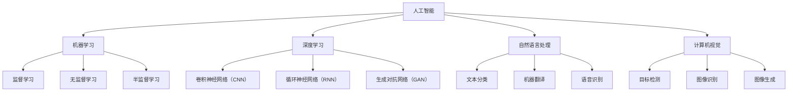

                 

# AI技术与用户需求的匹配

## 摘要

本文旨在探讨人工智能（AI）技术在满足用户需求方面的作用与挑战。通过对AI技术的背景介绍、核心概念阐述、算法原理分析、数学模型讲解、实战案例分析、实际应用场景描述、工具和资源推荐以及未来发展趋势与挑战的全面分析，本文为读者提供了一个深入理解AI技术与用户需求匹配的视角。文章不仅关注技术本身，更关注技术与实际应用相结合的具体实现，以期为相关从业者提供有价值的参考。

## 1. 背景介绍

人工智能（Artificial Intelligence，简称AI）是计算机科学的一个分支，旨在创建能够模拟、扩展和执行人类智能任务的系统。随着计算能力的提升和大数据技术的发展，AI技术取得了显著的进步，并被广泛应用于各个领域。用户需求作为驱动AI技术发展的核心动力，直接影响着AI技术的研发和应用。

用户需求是指用户在使用某种产品或服务时所期望达到的目标和满足的条件。这些需求可以是功能性的，如提高工作效率、提供个性化推荐等；也可以是情感性的，如提高用户体验、满足情感需求等。满足用户需求是AI技术发展的重要目标，同时也是AI技术能否成功应用的关键因素。

AI技术与用户需求之间的匹配关系是本文的核心讨论点。本文将分析AI技术的核心概念、算法原理、数学模型以及实际应用案例，探讨如何通过AI技术更好地满足用户需求。同时，本文还将探讨在实际应用过程中可能遇到的挑战，并提出相应的解决方案。

## 2. 核心概念与联系

### 2.1 人工智能（AI）

人工智能是指通过计算机程序和算法模拟、扩展和执行人类智能任务的技术。AI技术主要包括机器学习、深度学习、自然语言处理、计算机视觉等。

**Mermaid流程图：**



### 2.2 用户需求

用户需求是指用户在使用产品或服务时所期望达到的目标和满足的条件。用户需求可以分为功能性需求、情感性需求和体验性需求。

**功能性需求**：提高工作效率、解决特定问题、提供实用功能等。

**情感性需求**：满足情感需求、提供愉悦体验、增强社交互动等。

**体验性需求**：界面友好、操作便捷、个性化推荐等。

### 2.3 AI技术与用户需求的匹配关系

AI技术与用户需求的匹配关系主要体现在以下几个方面：

1. **需求分析**：通过用户调研、数据分析等方法，了解用户需求，并将其转化为可量化的指标。

2. **技术选型**：根据用户需求，选择合适的AI技术，如机器学习、深度学习等。

3. **算法优化**：针对用户需求，优化算法参数，提高算法的准确性和效率。

4. **模型训练**：通过大量数据训练模型，使其能够更好地满足用户需求。

5. **应用落地**：将AI技术应用于实际场景，如推荐系统、语音助手等，以满足用户需求。

## 3. 核心算法原理 & 具体操作步骤

### 3.1 机器学习（Machine Learning）

机器学习是一种通过从数据中学习规律和模式，从而进行预测和决策的技术。其核心算法包括监督学习、无监督学习和半监督学习。

**监督学习（Supervised Learning）**：

监督学习是指通过已有数据（特征和标签）来训练模型，从而预测未知数据的标签。其具体操作步骤如下：

1. 数据预处理：清洗、归一化、缺失值处理等。
2. 特征工程：选择、提取和构造特征。
3. 模型选择：选择合适的模型，如线性回归、决策树、神经网络等。
4. 模型训练：使用训练数据训练模型。
5. 模型评估：使用验证数据评估模型性能。
6. 模型优化：调整模型参数，提高模型性能。

**无监督学习（Unsupervised Learning）**：

无监督学习是指在没有标签数据的情况下，通过学习数据的内在结构和模式来进行聚类、降维等。其具体操作步骤如下：

1. 数据预处理：清洗、归一化、缺失值处理等。
2. 特征工程：选择、提取和构造特征。
3. 模型选择：选择合适的模型，如K均值聚类、主成分分析（PCA）等。
4. 模型训练：使用训练数据训练模型。
5. 模型评估：使用验证数据评估模型性能。
6. 模型优化：调整模型参数，提高模型性能。

**半监督学习（Semi-supervised Learning）**：

半监督学习是指在有少量标签数据和大量无标签数据的情况下，通过学习数据之间的联系来提高模型性能。其具体操作步骤如下：

1. 数据预处理：清洗、归一化、缺失值处理等。
2. 特征工程：选择、提取和构造特征。
3. 模型选择：选择合适的模型，如自我训练、图卷积网络（GCN）等。
4. 模型训练：使用标签数据和部分无标签数据训练模型。
5. 模型评估：使用验证数据评估模型性能。
6. 模型优化：调整模型参数，提高模型性能。

### 3.2 深度学习（Deep Learning）

深度学习是一种基于多层神经网络的学习方法，通过逐层提取特征，从而实现复杂的预测和决策任务。其核心算法包括卷积神经网络（CNN）、循环神经网络（RNN）和生成对抗网络（GAN）。

**卷积神经网络（Convolutional Neural Network，CNN）**：

CNN是一种用于图像识别和处理的神经网络。其具体操作步骤如下：

1. 数据预处理：清洗、归一化、缺失值处理等。
2. 网络架构设计：设计卷积层、池化层、全连接层等。
3. 模型训练：使用训练数据训练模型。
4. 模型评估：使用验证数据评估模型性能。
5. 模型优化：调整模型参数，提高模型性能。

**循环神经网络（Recurrent Neural Network，RNN）**：

RNN是一种用于序列数据处理的神经网络，能够记住历史信息。其具体操作步骤如下：

1. 数据预处理：清洗、归一化、缺失值处理等。
2. 网络架构设计：设计输入层、隐藏层、输出层等。
3. 模型训练：使用训练数据训练模型。
4. 模型评估：使用验证数据评估模型性能。
5. 模型优化：调整模型参数，提高模型性能。

**生成对抗网络（Generative Adversarial Network，GAN）**：

GAN是一种用于生成数据的神经网络，由生成器和判别器两个网络组成。其具体操作步骤如下：

1. 数据预处理：清洗、归一化、缺失值处理等。
2. 网络架构设计：设计生成器、判别器等。
3. 模型训练：生成器与判别器相互对抗训练。
4. 模型评估：使用生成数据评估模型性能。
5. 模型优化：调整模型参数，提高模型性能。

## 4. 数学模型和公式 & 详细讲解 & 举例说明

### 4.1 监督学习（Supervised Learning）

监督学习中的主要数学模型是假设函数（Hypothesis Function）和损失函数（Loss Function）。

**假设函数（Hypothesis Function）**：

假设函数是将输入特征映射到输出标签的函数。对于一个输入特征 $x$，假设函数 $h(x)$ 可以表示为：

$$h(x) = \sum_{i=1}^{n} w_i x_i + b$$

其中，$w_i$ 是权重，$x_i$ 是输入特征，$b$ 是偏置。

**损失函数（Loss Function）**：

损失函数是用来衡量预测值与真实值之间差距的函数。常见的损失函数包括均方误差（MSE）、交叉熵（Cross-Entropy）等。

均方误差（MSE）：

$$MSE = \frac{1}{n} \sum_{i=1}^{n} (h(x_i) - y_i)^2$$

其中，$h(x_i)$ 是预测值，$y_i$ 是真实值，$n$ 是样本数量。

交叉熵（Cross-Entropy）：

$$CE = - \sum_{i=1}^{n} y_i \log(h(x_i))$$

其中，$y_i$ 是真实值，$h(x_i)$ 是预测值。

### 4.2 无监督学习（Unsupervised Learning）

无监督学习中的主要数学模型是聚类算法（Clustering Algorithm）。

K均值聚类（K-Means Clustering）：

K均值聚类是一种基于距离的聚类算法，其目标是将数据分为 $K$ 个簇，使得每个簇内部的数据点距离簇中心的距离之和最小。

步骤：

1. 初始化 $K$ 个簇中心。
2. 对于每个数据点，将其分配到距离簇中心最近的簇。
3. 更新簇中心。
4. 重复步骤2和3，直到收敛。

算法公式：

$$C_j = \frac{1}{N_j} \sum_{i=1}^{N} x_i$$

其中，$C_j$ 是簇中心，$N_j$ 是簇 $j$ 中的数据点数量，$x_i$ 是数据点。

### 4.3 深度学习（Deep Learning）

深度学习中的主要数学模型是反向传播算法（Backpropagation Algorithm）。

反向传播算法：

反向传播算法是一种用于训练神经网络的算法，其核心思想是通过计算损失函数关于每个权重的梯度，然后使用梯度下降法更新权重，从而优化模型。

步骤：

1. 前向传播：计算输入特征到输出层的预测值。
2. 计算损失函数：计算预测值与真实值之间的差距。
3. 反向传播：计算每个权重和偏置的梯度。
4. 更新权重和偏置：使用梯度下降法更新权重和偏置。
5. 重复步骤1-4，直到收敛。

梯度计算：

$$\frac{\partial J}{\partial w_i} = \sum_{j=1}^{n} \frac{\partial J}{\partial z_j} \frac{\partial z_j}{\partial w_i}$$

其中，$J$ 是损失函数，$w_i$ 是权重，$z_j$ 是激活值。

### 4.4 生成对抗网络（Generative Adversarial Network，GAN）

生成对抗网络（GAN）是一种由生成器和判别器组成的对抗性网络。生成器的目标是生成与真实数据相似的数据，判别器的目标是区分真实数据和生成数据。

损失函数：

$$L_G = -\log(D(G(z)))$$

$$L_D = -\log(D(x)) - \log(1 - D(G(z)))$$

其中，$G(z)$ 是生成器，$D(x)$ 是判别器，$z$ 是随机噪声。

## 5. 项目实战：代码实际案例和详细解释说明

### 5.1 开发环境搭建

在开始项目实战之前，我们需要搭建一个开发环境。本文将使用Python作为主要编程语言，并借助TensorFlow和Keras等开源库进行模型训练和预测。

**安装Python**：

首先，我们需要安装Python。可以在Python官网（https://www.python.org/）下载适用于自己操作系统的Python版本，并按照提示进行安装。

**安装TensorFlow**：

在终端（命令行界面）中执行以下命令安装TensorFlow：

```bash
pip install tensorflow
```

**安装Keras**：

在终端（命令行界面）中执行以下命令安装Keras：

```bash
pip install keras
```

### 5.2 源代码详细实现和代码解读

以下是一个简单的线性回归模型的实现，用于预测房价。

```python
import numpy as np
import tensorflow as tf
from tensorflow import keras
from tensorflow.keras import layers

# 数据准备
# 假设我们有一些房屋特征（如面积、卧室数量等）和对应的价格
X = np.array([[1500, 3], [2000, 4], [2500, 5], [3000, 6]])
y = np.array([200000, 300000, 400000, 500000])

# 模型构建
# 构建一个简单的线性回归模型
model = keras.Sequential([
    layers.Dense(units=1, input_shape=(2,))
])

# 编译模型
model.compile(optimizer='sgd', loss='mean_squared_error')

# 训练模型
model.fit(X, y, epochs=100)

# 预测
# 使用训练好的模型进行预测
X_new = np.array([[1800, 4]])
price = model.predict(X_new)
print(f"预测房价为：{price[0][0]}万元")
```

**代码解读**：

1. 导入必要的库。
2. 准备数据：包括输入特征（房屋面积和卧室数量）和对应的价格标签。
3. 构建模型：使用Keras的`Sequential`模型，并添加一个全连接层（`Dense`层），该层有1个输出单元，用于预测房价。
4. 编译模型：选择优化器（`sgd`）和损失函数（`mean_squared_error`）。
5. 训练模型：使用`fit`方法训练模型，并设置训练轮次（`epochs`）。
6. 预测：使用训练好的模型进行预测，并输出预测结果。

### 5.3 代码解读与分析

该代码实现了一个简单的线性回归模型，用于预测房价。线性回归模型是一种常用的机器学习算法，其核心思想是通过线性函数来拟合输入特征和输出标签之间的关系。

**数据准备**：

在数据准备部分，我们创建了一个包含房屋特征（面积和卧室数量）和对应价格标签的数组。这些数据用于训练和测试模型。

**模型构建**：

在模型构建部分，我们使用Keras的`Sequential`模型，并添加一个全连接层（`Dense`层）。该层有1个输出单元，用于预测房价。全连接层通过线性变换将输入特征映射到输出标签。

**编译模型**：

在编译模型部分，我们选择了一个随机梯度下降（`sgd`）优化器和均方误差（`mean_squared_error`）损失函数。随机梯度下降是一种常用的优化算法，用于调整模型参数，使其最小化损失函数。均方误差是衡量预测值与真实值之间差距的常用指标。

**训练模型**：

在训练模型部分，我们使用`fit`方法训练模型，并设置训练轮次（`epochs`）。训练轮次是指模型在训练数据上迭代训练的次数。随着训练轮次的增加，模型逐渐优化，从而提高预测准确性。

**预测**：

在预测部分，我们使用训练好的模型对新的输入特征进行预测，并输出预测结果。这里的输入特征是一个包含房屋面积和卧室数量的数组。预测结果是一个包含预测房价的数组。

**代码分析**：

该代码实现了一个简单的线性回归模型，其优点是易于理解和实现。然而，线性回归模型在处理非线性关系时效果较差。在实际应用中，我们可以考虑使用更复杂的模型，如深度神经网络，来提高预测准确性。

## 6. 实际应用场景

### 6.1 推荐系统

推荐系统是AI技术在实际应用中的一个重要领域。通过分析用户的行为数据，推荐系统可以预测用户可能感兴趣的内容，从而提高用户体验和用户粘性。例如，电子商务平台可以使用推荐系统为用户推荐商品，音乐平台可以推荐用户可能喜欢的歌曲。

### 6.2 自动驾驶

自动驾驶是AI技术的另一个重要应用领域。自动驾驶汽车通过传感器和计算机视觉技术感知周围环境，并根据环境信息做出实时决策。自动驾驶技术有望解决交通拥堵、减少交通事故，提高出行效率。

### 6.3 医疗诊断

AI技术在医疗诊断中的应用也取得了显著成果。通过分析医疗影像数据，AI模型可以辅助医生进行疾病诊断。例如，AI模型可以识别肺癌、乳腺癌等疾病的早期迹象，提高诊断准确性。

### 6.4 金融风控

金融风控是AI技术的重要应用领域之一。通过分析大量的金融数据，AI模型可以识别潜在的风险，从而帮助金融机构防范风险。例如，AI模型可以预测股票市场的波动，帮助投资者做出更明智的决策。

## 7. 工具和资源推荐

### 7.1 学习资源推荐

- **书籍**：
  - 《Python机器学习》（作者：塞巴斯蒂安·拉戈拉克）
  - 《深度学习》（作者：伊恩·古德费洛、约书亚·本吉奥、亚伦·库维尔）
  - 《神经网络与深度学习》（作者：邱锡鹏）

- **论文**：
  - 《A Theoretical Framework for Back-Propagation》（作者：David E. Rumelhart, Geoffrey E. Hinton, Ronald J. Williams）
  - 《Generative Adversarial Nets》（作者：Ian J. Goodfellow, Jean-Paul Sirota, Alexei A. Boyden）
  - 《Recurrent Neural Networks for Language Modeling》（作者：Yoshua Bengio, Réjean Ducharme, Pascal Vincent, Christian Jauvin）

- **博客**：
  - fast.ai（https://www.fast.ai/）
  - Medium上的AI专栏（https://medium.com/topic/artificial-intelligence）
  - AI之旅（https://aijourney.github.io/）

- **网站**：
  - TensorFlow官网（https://www.tensorflow.org/）
  - Keras官网（https://keras.io/）
  - Coursera（https://www.coursera.org/）

### 7.2 开发工具框架推荐

- **编程语言**：
  - Python：适用于机器学习和深度学习项目，具有丰富的库和框架。

- **深度学习框架**：
  - TensorFlow：开源的深度学习框架，适用于大规模模型训练和部署。
  - PyTorch：开源的深度学习框架，具有灵活的动态计算图，易于实现复杂模型。

- **数据处理工具**：
  - Pandas：适用于数据清洗、归一化、缺失值处理等。
  - NumPy：适用于高效数值计算。

- **版本控制工具**：
  - Git：适用于代码管理和版本控制。

### 7.3 相关论文著作推荐

- 《深度学习》（作者：伊恩·古德费洛、约书亚·本吉奥、亚伦·库维尔）
- 《神经网络与深度学习》（作者：邱锡鹏）
- 《概率图模型》（作者：Michael I. Jordan）
- 《强化学习》（作者：理查德·萨顿、大卫·普费菲尔德）

## 8. 总结：未来发展趋势与挑战

### 8.1 未来发展趋势

- **人工智能与行业深度融合**：随着AI技术的不断发展，其将在更多行业和领域得到应用，推动产业升级和创新发展。
- **边缘计算与云计算相结合**：边缘计算将减轻云计算的负担，提高AI应用的实时性和响应速度。
- **量子计算与AI结合**：量子计算有望为AI提供更高效的计算能力，推动AI技术取得重大突破。
- **人机协作**：未来的人机协作将更加紧密，AI将更好地辅助人类完成复杂任务。

### 8.2 挑战

- **数据隐私与安全**：随着AI技术的发展，数据隐私和安全问题愈发突出，如何保护用户隐私成为重要挑战。
- **算法透明性与公平性**：确保AI算法的透明性和公平性，避免歧视和不公正现象的发生。
- **人工智能伦理**：如何确保AI技术的伦理性和社会责任，避免对人类和社会产生负面影响。
- **人才短缺**：AI技术的发展对人才需求提出了更高要求，如何培养和吸引高素质人才成为关键挑战。

## 9. 附录：常见问题与解答

### 9.1 问题1：什么是人工智能？

**解答**：人工智能（AI）是指通过计算机程序和算法模拟、扩展和执行人类智能任务的技术。AI技术主要包括机器学习、深度学习、自然语言处理、计算机视觉等。

### 9.2 问题2：如何搭建AI开发环境？

**解答**：搭建AI开发环境通常需要安装Python、TensorFlow、Keras等开源库。具体步骤如下：

1. 安装Python。
2. 安装TensorFlow。
3. 安装Keras。

### 9.3 问题3：如何训练一个线性回归模型？

**解答**：训练一个线性回归模型主要包括以下步骤：

1. 准备数据。
2. 构建模型（如使用Keras的`Sequential`模型和`Dense`层）。
3. 编译模型（选择优化器和损失函数）。
4. 训练模型（使用`fit`方法训练模型）。
5. 预测（使用训练好的模型进行预测）。

## 10. 扩展阅读 & 参考资料

- 《Python机器学习》：塞巴斯蒂安·拉戈拉克著，电子工业出版社，2017年。
- 《深度学习》：伊恩·古德费洛、约书亚·本吉奥、亚伦·库维尔著，电子工业出版社，2017年。
- 《神经网络与深度学习》：邱锡鹏著，电子工业出版社，2018年。
- TensorFlow官网：https://www.tensorflow.org/
- Keras官网：https://keras.io/
- fast.ai：https://www.fast.ai/
- Medium上的AI专栏：https://medium.com/topic/artificial-intelligence
- AI之旅：https://aijourney.github.io/

