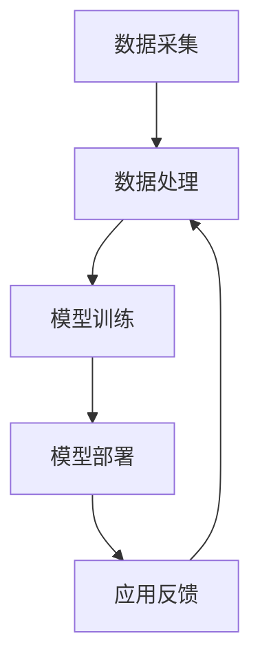

                 

# AI技术在企业中的应用前景

## 关键词：人工智能、企业应用、技术趋势、创新

## 摘要：

本文旨在探讨人工智能（AI）技术在企业中的应用前景。随着AI技术的不断发展，其在企业中的应用正变得日益广泛和深入。本文首先介绍了AI技术的核心概念与原理，随后详细分析了AI技术在企业中的具体应用场景，包括数据分析、自动化、增强决策支持等。随后，本文讨论了AI技术在企业应用中面临的挑战，并提出了相应的解决方案。最后，本文对AI技术在企业中的未来发展进行了展望。

## 1. 背景介绍

### 1.1 人工智能的定义与发展

人工智能（Artificial Intelligence，简称AI）是指通过计算机模拟人类智能的技术。它旨在使计算机具备感知、理解、推理、学习和适应的能力。AI技术的发展经历了多个阶段，从早期的规则系统、知识表示到现代的深度学习和强化学习，AI技术取得了显著的进展。

### 1.2 企业对人工智能的需求

随着市场竞争的加剧和业务复杂性的增加，企业对高效、智能化的解决方案需求日益增长。AI技术为企业提供了强大的工具，可以帮助企业提升运营效率、降低成本、优化决策，从而在激烈的市场竞争中保持优势。

## 2. 核心概念与联系

### 2.1 人工智能的核心概念

人工智能的核心概念包括：

- **感知**：通过传感器收集外界信息，如视觉、听觉、触觉等。

- **理解**：对感知到的信息进行处理和理解，例如语音识别、图像识别等。

- **推理**：基于已有知识和信息进行逻辑推理和决策。

- **学习**：通过经验和数据不断改进自身性能。

### 2.2 AI技术的架构

AI技术的架构通常包括以下几个部分：

- **数据采集**：收集用于训练和优化的数据。

- **数据处理**：对数据进行清洗、转换和预处理。

- **模型训练**：利用算法对数据进行训练，构建模型。

- **模型部署**：将训练好的模型部署到实际应用场景中。

### 2.3 Mermaid 流程图

以下是AI技术架构的Mermaid流程图：



## 3. 核心算法原理 & 具体操作步骤

### 3.1 数据分析

数据分析是AI技术在企业中应用的重要领域。通过分析大量数据，企业可以挖掘出有价值的信息和模式，从而优化业务决策。

具体操作步骤包括：

- **数据收集**：从各个业务系统中收集数据。

- **数据清洗**：去除数据中的噪声和错误。

- **特征工程**：提取数据中的特征，以便模型训练。

- **模型训练**：选择合适的算法，对数据进行训练。

- **模型评估**：评估模型的效果，调整参数。

### 3.2 自动化

自动化技术可以帮助企业减少重复性工作，提高生产效率。

具体操作步骤包括：

- **任务定义**：明确需要自动化的任务。

- **流程设计**：设计自动化的流程。

- **脚本编写**：编写自动化脚本。

- **测试与部署**：对脚本进行测试，确保其正常运行。

### 3.3 增强决策支持

AI技术可以通过分析历史数据和实时数据，为企业的决策提供支持。

具体操作步骤包括：

- **数据收集**：收集与决策相关的数据。

- **数据分析**：分析数据，提取有价值的信息。

- **决策模型**：构建决策模型。

- **决策支持**：根据决策模型提供决策支持。

## 4. 数学模型和公式 & 详细讲解 & 举例说明

### 4.1 数学模型

在AI技术中，常用的数学模型包括：

- **线性回归**：用于预测数值型数据。

- **逻辑回归**：用于预测二分类问题。

- **神经网络**：用于处理复杂数据和非线性问题。

### 4.2 公式

以下是线性回归的公式：

$$
y = \beta_0 + \beta_1x
$$

其中，$y$ 是预测值，$x$ 是输入值，$\beta_0$ 和 $\beta_1$ 是模型参数。

### 4.3 举例说明

假设我们要预测一家零售店的销售额，我们可以使用线性回归模型。首先，我们收集历史销售额数据，然后进行数据清洗和特征工程，最后使用线性回归模型进行训练。训练完成后，我们可以使用模型预测未来的销售额。

## 5. 项目实战：代码实际案例和详细解释说明

### 5.1 开发环境搭建

在编写代码之前，我们需要搭建合适的开发环境。这里我们以Python为例，介绍如何搭建开发环境。

1. 安装Python：在Python官网（https://www.python.org/）下载并安装Python。

2. 安装相关库：使用pip命令安装所需库，例如numpy、pandas等。

### 5.2 源代码详细实现和代码解读

下面是一个简单的线性回归模型的Python代码实现：

```python
import numpy as np
import pandas as pd

# 数据预处理
def preprocess_data(data):
    data = data.reset_index()
    data['index'] = range(data.shape[0])
    data = data.rename(columns={'index': 'id'})
    return data

# 线性回归模型
def linear_regression(X, y):
    X = np.array(X)
    y = np.array(y)
    X_mean = np.mean(X)
    y_mean = np.mean(y)
    cov = np.dot((X - X_mean), (y - y_mean).T)
    var = np.dot((X - X_mean), (X - X_mean).T)
    beta1 = cov / var
    beta0 = y_mean - beta1 * X_mean
    return beta0, beta1

# 预测
def predict(X, beta0, beta1):
    return beta0 + beta1 * X

# 主函数
def main():
    data = pd.read_csv('sales_data.csv')
    data = preprocess_data(data)
    X = data['id']
    y = data['sales']
    beta0, beta1 = linear_regression(X, y)
    X_test = np.array([10, 20, 30])
    y_pred = predict(X_test, beta0, beta1)
    print('预测值：', y_pred)

if __name__ == '__main__':
    main()
```

### 5.3 代码解读与分析

1. **数据预处理**：首先，我们读取销售数据，然后对数据进行预处理，包括重置索引、重命名列名等。

2. **线性回归模型**：我们定义了一个线性回归模型，使用协方差和方差来计算模型参数。

3. **预测**：我们使用训练好的模型对新的数据进行预测。

4. **主函数**：主函数读取数据，训练模型，并打印预测值。

## 6. 实际应用场景

### 6.1 金融行业

在金融行业中，AI技术可以用于风险管理、投资决策、客户服务等方面。例如，使用AI技术进行风险预测和预警，可以帮助金融机构降低风险，提高业务安全性。

### 6.2 零售业

在零售业中，AI技术可以用于库存管理、需求预测、个性化推荐等方面。通过分析大量数据，AI技术可以帮助零售企业优化库存管理，提高销售业绩。

### 6.3 医疗健康

在医疗健康领域，AI技术可以用于疾病预测、诊断支持、个性化治疗等方面。通过分析患者的病历数据和基因数据，AI技术可以为医生提供有力的辅助决策。

## 7. 工具和资源推荐

### 7.1 学习资源推荐

- **书籍**：《Python机器学习》、《深度学习》（Goodfellow et al.）

- **论文**：https://arxiv.org/

- **博客**：https://towardsdatascience.com/

- **网站**：https://www.kaggle.com/

### 7.2 开发工具框架推荐

- **编程语言**：Python、R

- **机器学习框架**：TensorFlow、PyTorch、Scikit-learn

- **数据可视化**：Matplotlib、Seaborn

### 7.3 相关论文著作推荐

- **论文**：Goodfellow, I., Bengio, Y., & Courville, A. (2016). *Deep learning*. MIT press.

- **书籍**：Murphy, K. P. (2012). *Machine learning: a probabilistic perspective*. MIT press.

## 8. 总结：未来发展趋势与挑战

### 8.1 发展趋势

- **数据量的增加**：随着大数据技术的发展，企业可以收集到越来越多的数据，为AI技术提供了丰富的训练资源。

- **算法的改进**：深度学习和强化学习等算法的不断改进，使得AI技术在各种应用场景中的效果不断提高。

- **跨领域的融合**：AI技术与各行各业之间的融合，使得AI技术在各个领域中的应用越来越广泛。

### 8.2 挑战

- **数据隐私与安全**：在数据驱动的AI时代，如何保护用户隐私和数据安全是一个重要挑战。

- **算法透明性与可解释性**：随着AI技术的普及，如何提高算法的透明性和可解释性，使其更易于被用户理解和接受，也是一个重要问题。

## 9. 附录：常见问题与解答

### 9.1 问题1：什么是人工智能？

**解答**：人工智能（Artificial Intelligence，简称AI）是指通过计算机模拟人类智能的技术。它旨在使计算机具备感知、理解、推理、学习和适应的能力。

### 9.2 问题2：人工智能有哪些应用场景？

**解答**：人工智能的应用场景非常广泛，包括但不限于：

- **金融**：风险管理、投资决策、客户服务。

- **零售**：库存管理、需求预测、个性化推荐。

- **医疗健康**：疾病预测、诊断支持、个性化治疗。

- **制造**：生产优化、质量检测、设备维护。

- **交通**：自动驾驶、智能交通管理。

### 9.3 问题3：如何搭建AI开发环境？

**解答**：搭建AI开发环境通常包括以下步骤：

- 安装Python。

- 安装相关库，如numpy、pandas等。

- 安装IDE，如PyCharm、Jupyter Notebook等。

## 10. 扩展阅读 & 参考资料

- **书籍**：《Python机器学习》、《深度学习》（Goodfellow et al.）

- **论文**：https://arxiv.org/

- **博客**：https://towardsdatascience.com/

- **网站**：https://www.kaggle.com/

> 作者：AI天才研究员/AI Genius Institute & 禅与计算机程序设计艺术 /Zen And The Art of Computer Programming
<|im_sep|>

