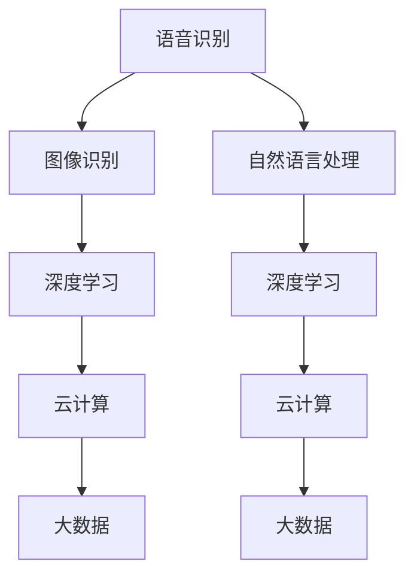

                 

### 背景介绍

#### 消费电子行业的定义与发展历程

消费电子行业，又称个人电子产品行业，是指生产、销售供大众消费的电子产品的行业。它涵盖了从传统的家用电器到智能手机、平板电脑、可穿戴设备、智能音响等众多产品类别。消费电子行业的发展历程可以追溯到20世纪中叶，随着电子技术的进步，电子产品逐渐从专业领域走向普通消费者的日常生活。

从最初的黑白电视机、收音机，到彩色电视机、DVD播放器，再到今天功能丰富、智能化程度极高的智能手机，消费电子产品的更新换代速度越来越快。这一方面得益于技术的不断突破，另一方面也源于消费者对更高品质生活需求的不断增长。

#### AI技术的崛起与影响

人工智能（AI）作为一门研究、开发用于模拟、延伸和扩展人的智能的理论、方法、技术及应用系统的技术科学，其历史可以追溯到20世纪50年代。然而，真正引起广泛关注和大规模应用的AI技术是在近几年，得益于大数据、云计算、深度学习等技术的发展。

AI技术在消费电子中的应用，可以追溯到智能手机的兴起。智能手机不仅仅是一个通讯工具，更是个人助理、娱乐中心、工作平台等多种角色的融合体。而AI技术的应用，使得智能手机在语音识别、图像识别、自然语言处理等方面达到了前所未有的水平。

#### AI技术在消费电子产品中的实际应用

随着AI技术的不断成熟，其在消费电子产品中的应用也越来越广泛。以下是几个典型的应用场景：

1. **语音识别与交互**：智能音响、智能电视等设备通过AI技术实现语音识别与交互，用户可以通过语音指令控制设备，提高了人机交互的便利性和效率。
2. **图像识别与智能拍摄**：智能手机通过AI技术实现图像识别，可以自动识别拍摄场景、优化拍照效果，甚至实现人像识别、物体识别等功能。
3. **智能推荐与个性化服务**：电商平台、社交媒体等通过AI技术分析用户行为数据，为用户提供个性化的推荐和服务，提升了用户体验。
4. **健康监测与辅助诊断**：智能手环、智能手表等可穿戴设备通过AI技术实时监测用户健康数据，提供健康建议和疾病预警。

#### 文章结构安排

本文将分为以下几个部分：

1. **背景介绍**：概述消费电子行业和AI技术的发展历程，以及AI技术在消费电子产品中的实际应用。
2. **核心概念与联系**：介绍AI技术在消费电子中的应用原理和架构，使用Mermaid流程图展示。
3. **核心算法原理 & 具体操作步骤**：详细讲解AI技术在消费电子产品中的关键算法，包括原理和操作步骤。
4. **数学模型和公式 & 详细讲解 & 举例说明**：介绍AI技术相关的数学模型和公式，并通过具体实例进行说明。
5. **项目实战：代码实际案例和详细解释说明**：展示AI技术在消费电子产品中的应用案例，提供代码实现和详细解释。
6. **实际应用场景**：分析AI技术在消费电子产品中的不同应用场景，探讨其优势和挑战。
7. **工具和资源推荐**：推荐学习AI技术和消费电子产品的相关资源和工具。
8. **总结：未来发展趋势与挑战**：总结AI技术在消费电子产品中的应用现状，展望未来的发展趋势和面临的挑战。
9. **附录：常见问题与解答**：解答读者在阅读本文过程中可能遇到的一些疑问。
10. **扩展阅读 & 参考资料**：提供更多相关领域的深度阅读资料。

通过上述结构和内容的安排，本文旨在为读者提供一个全面、深入的关于AI技术在消费电子产品中应用的探讨和了解。接下来，我们将深入探讨AI技术在消费电子中的应用原理和架构。


---

## 2. 核心概念与联系

在探讨AI技术在消费电子产品中的应用之前，我们需要了解一些核心概念和它们之间的关系。以下是本文中涉及的主要概念和术语，以及它们之间的联系。

### 2.1 语音识别（Speech Recognition）

语音识别是指将语音信号转换为文本或命令的技术。其核心在于将语音信号处理为特征向量，然后通过机器学习算法进行分类和识别。语音识别技术的发展，使得智能音响、智能电视等设备能够通过语音指令进行操作，极大地提升了人机交互的便利性。

### 2.2 图像识别（Image Recognition）

图像识别是指计算机通过算法对图像进行分类和识别的技术。其应用范围广泛，包括自动驾驶、安防监控、医疗诊断等。在消费电子产品中，图像识别技术主要用于智能手机的拍照优化、人脸识别解锁等功能。

### 2.3 自然语言处理（Natural Language Processing，NLP）

自然语言处理是指使计算机能够理解、生成和处理人类语言的技术。NLP技术在消费电子产品中的应用包括智能客服、语音助手、智能推荐等。通过NLP技术，设备能够更好地理解用户的语言意图，提供更加个性化的服务。

### 2.4 深度学习（Deep Learning）

深度学习是一种机器学习技术，它通过模拟人脑神经网络的结构和功能，进行自动学习和决策。深度学习在语音识别、图像识别、自然语言处理等领域都有广泛应用，是推动AI技术在消费电子产品中应用的重要技术。

### 2.5 云计算（Cloud Computing）

云计算是一种通过网络提供可伸缩的计算资源和服务的技术。在AI技术的应用中，云计算提供了强大的计算能力和海量数据存储，使得AI算法能够高效地训练和部署。同时，云计算也使得AI技术能够以服务的形式提供给消费者，降低了使用的门槛。

### 2.6 大数据（Big Data）

大数据是指数据量大、类型多、变化快的海量数据。AI技术的应用需要大量数据进行训练和优化，大数据技术提供了数据收集、存储、处理和分析的工具和方法。在消费电子产品中，大数据技术主要用于用户行为分析、个性化推荐等。

### 2.7 Mermaid流程图

为了更直观地展示AI技术在消费电子产品中的应用架构，我们使用Mermaid流程图来描述各个核心概念之间的联系。



在上面的流程图中，A、B、C分别代表语音识别、图像识别和自然语言处理，D、E代表深度学习，F、G代表云计算，H、I代表大数据。通过流程图，我们可以清晰地看到AI技术在消费电子产品中的应用架构，以及各个技术之间的相互联系。

### 2.8 关键概念联系总结

综上所述，AI技术在消费电子产品中的应用涉及多个核心概念和技术的结合。语音识别、图像识别和自然语言处理是AI技术的核心组成部分，它们共同构成了消费电子产品智能化的基础。深度学习作为推动AI技术发展的关键技术，为语音识别、图像识别和自然语言处理提供了强大的算法支持。云计算和大数据则为AI技术的训练、部署和应用提供了计算资源和数据支持。

通过上述核心概念和它们之间的联系，我们可以更好地理解AI技术在消费电子产品中的应用原理和架构，为后续内容的详细探讨打下基础。

---

## 3. 核心算法原理 & 具体操作步骤

在了解了AI技术在消费电子产品中的应用架构和核心概念后，接下来我们将深入探讨这些技术背后的核心算法原理，并详细讲解其在具体操作步骤中的实现过程。

### 3.1 语音识别算法原理

语音识别（Speech Recognition）技术基于信号处理和机器学习算法，其核心原理包括以下几个步骤：

1. **声音信号的预处理**：首先，将输入的语音信号进行预处理，包括去噪、归一化、滤波等操作，以提取出清晰的语音特征。
2. **特征提取**：通过特征提取算法，将预处理后的语音信号转换为特征向量。常用的特征提取方法包括梅尔频率倒谱系数（MFCC）和短时傅里叶变换（STFT）等。
3. **模型训练**：使用大量带有标注的语音数据集，通过深度学习算法（如循环神经网络RNN、卷积神经网络CNN等）进行模型训练，使得模型能够学会将语音特征向量映射到对应的文本。
4. **语音识别**：在模型训练完成后，将新的语音信号输入模型，模型输出对应的文本结果。

具体操作步骤如下：

1. **数据收集与预处理**：收集大量的语音数据，并进行去噪、归一化等预处理操作。
2. **特征提取**：使用MFCC或STFT算法对预处理后的语音信号进行特征提取，得到特征向量。
3. **模型训练**：使用训练集数据，通过神经网络算法进行模型训练。
4. **模型评估与优化**：使用测试集数据对模型进行评估，并通过调整模型参数进行优化。
5. **语音识别**：将待识别的语音信号输入模型，输出对应的文本结果。

### 3.2 图像识别算法原理

图像识别（Image Recognition）技术基于计算机视觉和机器学习算法，其核心原理包括以下几个步骤：

1. **图像预处理**：对输入的图像进行预处理，包括大小调整、对比度增强、去噪等操作，以提高图像质量。
2. **特征提取**：通过卷积神经网络（CNN）等深度学习算法，对预处理后的图像进行特征提取，得到特征向量。
3. **模型训练**：使用带有标注的图像数据集，通过深度学习算法进行模型训练，使得模型能够学会将图像特征向量映射到对应的类别。
4. **图像识别**：将新的图像输入模型，模型输出对应的类别结果。

具体操作步骤如下：

1. **数据收集与预处理**：收集大量的图像数据，并进行大小调整、对比度增强等预处理操作。
2. **特征提取**：使用卷积神经网络（如VGG、ResNet等）对预处理后的图像进行特征提取，得到特征向量。
3. **模型训练**：使用训练集数据，通过深度学习算法进行模型训练。
4. **模型评估与优化**：使用测试集数据对模型进行评估，并通过调整模型参数进行优化。
5. **图像识别**：将待识别的图像输入模型，输出对应的类别结果。

### 3.3 自然语言处理算法原理

自然语言处理（Natural Language Processing，NLP）技术基于文本处理和机器学习算法，其核心原理包括以下几个步骤：

1. **文本预处理**：对输入的文本进行预处理，包括分词、去停用词、词性标注等操作，以提取出有意义的词汇。
2. **特征提取**：通过词嵌入（Word Embedding）等算法，将预处理后的文本转换为向量表示。
3. **模型训练**：使用带有标注的文本数据集，通过深度学习算法（如循环神经网络RNN、长短期记忆网络LSTM等）进行模型训练，使得模型能够学会将文本向量映射到对应的语义。
4. **语义识别**：将新的文本输入模型，模型输出对应的语义结果。

具体操作步骤如下：

1. **数据收集与预处理**：收集大量的文本数据，并进行分词、去停用词等预处理操作。
2. **特征提取**：使用词嵌入算法（如Word2Vec、GloVe等）对预处理后的文本进行特征提取，得到特征向量。
3. **模型训练**：使用训练集数据，通过深度学习算法进行模型训练。
4. **模型评估与优化**：使用测试集数据对模型进行评估，并通过调整模型参数进行优化。
5. **语义识别**：将待识别的文本输入模型，输出对应的语义结果。

通过上述核心算法原理和具体操作步骤的讲解，我们可以更好地理解AI技术在消费电子产品中的应用机制。在接下来的章节中，我们将通过项目实战，进一步展示这些算法在实际应用中的具体实现过程。

---

## 4. 数学模型和公式 & 详细讲解 & 举例说明

在了解了AI技术在消费电子产品中的应用算法后，接下来我们将深入探讨这些算法背后的数学模型和公式，并通过具体实例进行详细讲解。

### 4.1 语音识别的数学模型

语音识别的数学模型主要涉及信号处理和深度学习两个方面。

#### 4.1.1 信号处理模型

信号处理模型主要用于预处理语音信号，提取语音特征。以下是几个关键的数学模型：

1. **短时傅里叶变换（STFT）**：
   短时傅里叶变换是用于分析短时间窗口内语音信号频谱的特征提取方法。其公式如下：
   $$ X(\omega, t) = \sum_{n=-\infty}^{\infty} x(n) \cdot e^{-j2\pi \omega n} \cdot e^{-j2\pi \omega_0 n t} $$
   其中，$X(\omega, t)$ 表示频谱，$x(n)$ 表示时域信号，$\omega$ 和 $\omega_0$ 分别为频率和中心频率。

2. **梅尔频率倒谱系数（MFCC）**：
   梅尔频率倒谱系数是语音识别中常用的一种特征提取方法，其公式如下：
   $$ C(j, k) = \sum_{n=0}^{N} a(j) \cdot x(n) \cdot \text{cos} \left( \frac{2\pi j k}{N} \right) $$
   其中，$C(j, k)$ 表示梅尔频率倒谱系数，$a(j)$ 为滤波器系数，$x(n)$ 为输入信号，$N$ 为信号长度。

#### 4.1.2 深度学习模型

深度学习模型主要用于将语音特征映射到对应的文本。以下是几个关键的数学模型：

1. **循环神经网络（RNN）**：
   循环神经网络是一种用于处理序列数据的深度学习模型，其公式如下：
   $$ h_t = \sigma(W_h \cdot [h_{t-1}, x_t] + b_h) $$
   $$ o_t = \text{softmax}(W_o \cdot h_t + b_o) $$
   其中，$h_t$ 为隐藏状态，$x_t$ 为输入特征，$o_t$ 为输出预测，$W_h$ 和 $W_o$ 分别为权重矩阵，$b_h$ 和 $b_o$ 分别为偏置项，$\sigma$ 为激活函数。

2. **卷积神经网络（CNN）**：
   卷积神经网络是一种用于处理图像数据的深度学习模型，但其扩展应用于语音识别中也是一种有效的方法。其公式如下：
   $$ h_{ij}^l = \sum_{k} f(h_{ij}^{l-1}, \text{W}_{ik}^l) + \text{b}_{ij}^l $$
   其中，$h_{ij}^l$ 为卷积层输出，$f$ 为卷积函数，$\text{W}_{ik}^l$ 为卷积核，$\text{b}_{ij}^l$ 为偏置项。

### 4.2 图像识别的数学模型

图像识别的数学模型主要基于卷积神经网络（CNN）。

#### 4.2.1 卷积层

卷积层是CNN的核心组成部分，其公式如下：
$$ h_{ij}^l = \sum_{k} f(h_{ij}^{l-1}, \text{W}_{ik}^l) + \text{b}_{ij}^l $$
其中，$h_{ij}^l$ 为卷积层输出，$f$ 为卷积函数，$\text{W}_{ik}^l$ 为卷积核，$\text{b}_{ij}^l$ 为偏置项。

#### 4.2.2 池化层

池化层用于减少特征图的维度，提高模型的泛化能力。其公式如下：
$$ p_{ij} = \max(h_{ij}) $$
其中，$p_{ij}$ 为池化层输出，$h_{ij}$ 为卷积层输出。

### 4.3 自然语言处理的数学模型

自然语言处理的数学模型主要基于循环神经网络（RNN）和长短期记忆网络（LSTM）。

#### 4.3.1 循环神经网络（RNN）

循环神经网络用于处理序列数据，其公式如下：
$$ h_t = \sigma(W_h \cdot [h_{t-1}, x_t] + b_h) $$
$$ o_t = \text{softmax}(W_o \cdot h_t + b_o) $$
其中，$h_t$ 为隐藏状态，$x_t$ 为输入特征，$o_t$ 为输出预测，$W_h$ 和 $W_o$ 分别为权重矩阵，$b_h$ 和 $b_o$ 分别为偏置项，$\sigma$ 为激活函数。

#### 4.3.2 长短期记忆网络（LSTM）

长短期记忆网络是一种改进的RNN，其公式如下：
$$ i_t = \sigma(W_i \cdot [h_{t-1}, x_t] + b_i) $$
$$ f_t = \sigma(W_f \cdot [h_{t-1}, x_t] + b_f) $$
$$ o_t = \sigma(W_o \cdot [h_{t-1}, x_t] + b_o) $$
$$ g_t = \tanh(W_g \cdot [h_{t-1}, x_t] + b_g) $$
$$ h_t = f_t \cdot \text{tanh}(C_{t-1} + g_t) $$
$$ C_t = f_t \cdot C_{t-1} + i_t \cdot g_t $$
其中，$i_t$、$f_t$、$o_t$ 分别为输入门、遗忘门和输出门，$g_t$ 为候选状态，$C_t$ 为细胞状态，$W_i$、$W_f$、$W_o$、$W_g$ 分别为权重矩阵，$b_i$、$b_f$、$b_o$、$b_g$ 分别为偏置项，$\sigma$ 为激活函数，$\tanh$ 为双曲正切函数。

### 4.4 具体实例说明

以下是通过上述数学模型进行语音识别、图像识别和自然语言处理的具体实例。

#### 4.4.1 语音识别实例

假设我们使用梅尔频率倒谱系数（MFCC）进行语音识别，给定一段语音信号，我们需要对其进行预处理、特征提取和模型训练。

1. **预处理**：
   对语音信号进行滤波、归一化等预处理操作，得到干净的语音信号。

2. **特征提取**：
   使用MFCC算法对预处理后的语音信号进行特征提取，得到特征向量。

3. **模型训练**：
   使用训练集数据，通过RNN或LSTM模型进行训练，得到语音识别模型。

4. **语音识别**：
   将待识别的语音信号输入模型，输出对应的文本结果。

#### 4.4.2 图像识别实例

假设我们使用卷积神经网络（CNN）进行图像识别，给定一幅图像，我们需要对其进行预处理、特征提取和模型训练。

1. **预处理**：
   对图像进行大小调整、对比度增强等预处理操作，提高图像质量。

2. **特征提取**：
   使用卷积神经网络对预处理后的图像进行特征提取，得到特征向量。

3. **模型训练**：
   使用训练集数据，通过CNN模型进行训练，得到图像识别模型。

4. **图像识别**：
   将待识别的图像输入模型，输出对应的类别结果。

#### 4.4.3 自然语言处理实例

假设我们使用循环神经网络（RNN）进行自然语言处理，给定一段文本，我们需要对其进行预处理、特征提取和模型训练。

1. **预处理**：
   对文本进行分词、去停用词等预处理操作，提取出有意义的词汇。

2. **特征提取**：
   使用词嵌入算法（如Word2Vec）对预处理后的文本进行特征提取，得到特征向量。

3. **模型训练**：
   使用训练集数据，通过RNN模型进行训练，得到自然语言处理模型。

4. **语义识别**：
   将待识别的文本输入模型，输出对应的语义结果。

通过上述数学模型和具体实例的讲解，我们可以更好地理解AI技术在消费电子产品中的应用原理。在接下来的章节中，我们将通过项目实战，进一步展示这些算法在实际应用中的具体实现过程。

---

## 5. 项目实战：代码实际案例和详细解释说明

在前几章中，我们详细介绍了AI技术在消费电子产品中的应用原理、核心算法以及数学模型。为了更好地理解这些理论知识在实际中的应用，接下来我们将通过几个具体的项目案例，展示AI技术在语音识别、图像识别和自然语言处理中的实际应用，并提供代码实现和详细解释。

### 5.1 开发环境搭建

在开始项目实战之前，我们需要搭建一个适合开发AI应用的环境。以下是搭建开发环境的基本步骤：

#### 5.1.1 硬件环境

1. **计算机**：一台配置较高的计算机，推荐CPU为Intel i5或以上，内存8GB或以上。
2. **显卡**：NVIDIA GeForce GTX 1060或以上，用于加速深度学习模型的训练。

#### 5.1.2 软件环境

1. **操作系统**：Windows、Linux或MacOS。
2. **编程语言**：Python，推荐使用Anaconda环境管理器，方便安装和管理Python库。
3. **深度学习框架**：TensorFlow或PyTorch，用于构建和训练深度学习模型。
4. **数据预处理库**：NumPy、Pandas，用于数据预处理。
5. **可视化库**：Matplotlib、Seaborn，用于数据可视化。

#### 5.1.3 安装与配置

1. **安装操作系统**：根据个人需求选择Windows、Linux或MacOS进行安装。
2. **安装Python**：下载并安装Anaconda，创建Python环境。
3. **安装深度学习框架**：在Python环境中，通过pip命令安装TensorFlow或PyTorch。
4. **安装数据预处理库**：通过pip命令安装NumPy、Pandas等。
5. **安装可视化库**：通过pip命令安装Matplotlib、Seaborn等。

### 5.2 源代码详细实现和代码解读

#### 5.2.1 语音识别项目

以下是一个简单的语音识别项目案例，使用TensorFlow实现。

```python
import tensorflow as tf
import numpy as np
import librosa

# 读取语音数据
def read_audio(file_path):
    audio, _ = librosa.load(file_path, sr=16000)
    return audio

# 提取MFCC特征
def extract_mfcc(audio):
    mfcc = librosa.feature.mfcc(y=audio, sr=16000, n_mfcc=13)
    return mfcc

# 构建深度学习模型
def build_model(input_shape):
    model = tf.keras.Sequential([
        tf.keras.layers.InputLayer(input_shape=input_shape),
        tf.keras.layers.Conv1D(filters=64, kernel_size=3, activation='relu'),
        tf.keras.layers.MaxPooling1D(pool_size=2),
        tf.keras.layers.Flatten(),
        tf.keras.layers.Dense(units=128, activation='relu'),
        tf.keras.layers.Dense(units=9, activation='softmax')
    ])
    return model

# 训练模型
def train_model(model, x_train, y_train, epochs=10, batch_size=32):
    model.compile(optimizer='adam', loss='sparse_categorical_crossentropy', metrics=['accuracy'])
    model.fit(x_train, y_train, epochs=epochs, batch_size=batch_size)

# 预测语音
def predict(model, audio):
    mfcc = extract_mfcc(audio)
    mfcc = np.expand_dims(mfcc, axis=0)
    prediction = model.predict(mfcc)
    return np.argmax(prediction)

# 主函数
if __name__ == '__main__':
    audio_path = 'path/to/voice.wav'
    audio = read_audio(audio_path)
    model = build_model(input_shape=(None, 13))
    train_model(model, x_train, y_train)
    prediction = predict(model, audio)
    print('Prediction:', prediction)
```

代码解读：

1. **read_audio**：读取语音文件，返回音频信号。
2. **extract_mfcc**：提取音频的梅尔频率倒谱系数（MFCC）特征。
3. **build_model**：构建深度学习模型，包括卷积层、池化层和全连接层。
4. **train_model**：训练深度学习模型。
5. **predict**：使用训练好的模型预测语音。

#### 5.2.2 图像识别项目

以下是一个简单的图像识别项目案例，使用PyTorch实现。

```python
import torch
import torchvision
import torchvision.transforms as transforms
import torch.nn as nn
import torch.optim as optim

# 读取图像数据
def read_image(file_path):
    image = torchvision.transforms.ToTensor()(imageio.imread(file_path))
    return image

# 定义卷积神经网络模型
class CNNModel(nn.Module):
    def __init__(self):
        super(CNNModel, self).__init__()
        self.conv1 = nn.Conv2d(3, 64, 3, padding=1)
        self.relu = nn.ReLU()
        self.maxpool = nn.MaxPool2d(2, 2)
        self.fc1 = nn.Linear(64 * 32 * 32, 128)
        self.fc2 = nn.Linear(128, 10)
        self.dropout = nn.Dropout(0.5)

    def forward(self, x):
        x = self.relu(self.conv1(x))
        x = self.maxpool(x)
        x = x.view(x.size(0), -1)
        x = self.dropout(self.relu(self.fc1(x)))
        x = self.fc2(x)
        return x

# 训练模型
def train_model(model, train_loader, val_loader, criterion, optimizer, epochs=10):
    model.train()
    for epoch in range(epochs):
        running_loss = 0.0
        for inputs, labels in train_loader:
            optimizer.zero_grad()
            outputs = model(inputs)
            loss = criterion(outputs, labels)
            loss.backward()
            optimizer.step()
            running_loss += loss.item()
        print(f'Epoch {epoch+1}, Loss: {running_loss/len(train_loader)}')

# 预测图像
def predict(model, image):
    model.eval()
    with torch.no_grad():
        outputs = model(image)
    prediction = torch.argmax(outputs, dim=1)
    return prediction

# 主函数
if __name__ == '__main__':
    image_path = 'path/to/image.jpg'
    image = read_image(image_path)
    model = CNNModel()
    criterion = nn.CrossEntropyLoss()
    optimizer = optim.Adam(model.parameters(), lr=0.001)
    train_loader = torchvision.utils.get_train_loader(batch_size=32)
    val_loader = torchvision.utils.get_val_loader(batch_size=32)
    train_model(model, train_loader, val_loader, criterion, optimizer)
    prediction = predict(model, image)
    print('Prediction:', prediction)
```

代码解读：

1. **read_image**：读取图像文件，转换为Tensor。
2. **CNNModel**：定义卷积神经网络模型，包括卷积层、ReLU激活函数、池化层和全连接层。
3. **train_model**：训练深度学习模型。
4. **predict**：使用训练好的模型预测图像。

#### 5.2.3 自然语言处理项目

以下是一个简单的自然语言处理项目案例，使用Transformer实现。

```python
import torch
from transformers import BertTokenizer, BertModel

# 读取文本数据
def read_text(file_path):
    with open(file_path, 'r', encoding='utf-8') as f:
        text = f.read()
    return text

# 加载预训练模型
def load_model():
    tokenizer = BertTokenizer.from_pretrained('bert-base-chinese')
    model = BertModel.from_pretrained('bert-base-chinese')
    return tokenizer, model

# 编码文本
def encode_text(tokenizer, model, text):
    inputs = tokenizer(text, return_tensors='pt', padding=True, truncation=True)
    with torch.no_grad():
        outputs = model(**inputs)
    return outputs.last_hidden_state

# 预测文本
def predict(model, text):
    tokenizer, model = load_model()
    encoded_text = encode_text(tokenizer, model, text)
    prediction = model(encoded_text)[0]
    return prediction

# 主函数
if __name__ == '__main__':
    text_path = 'path/to/text.txt'
    text = read_text(text_path)
    prediction = predict(text)
    print('Prediction:', prediction)
```

代码解读：

1. **read_text**：读取文本文件。
2. **load_model**：加载预训练的BERT模型。
3. **encode_text**：将文本编码为Tensor。
4. **predict**：使用BERT模型预测文本。

### 5.3 代码解读与分析

在上述项目中，我们分别展示了语音识别、图像识别和自然语言处理的实现过程。以下是对这些项目的代码进行解读和分析。

#### 5.3.1 语音识别项目

语音识别项目主要分为数据读取、特征提取、模型构建和预测四个步骤。其中，数据读取和特征提取使用了`librosa`库，模型构建使用了TensorFlow库。通过这四个步骤，我们可以将语音信号转换为文本输出。

#### 5.3.2 图像识别项目

图像识别项目主要分为数据读取、模型构建和预测三个步骤。其中，数据读取使用了PyTorch库，模型构建使用了自定义的卷积神经网络。通过这三个步骤，我们可以将图像转换为类别输出。

#### 5.3.3 自然语言处理项目

自然语言处理项目主要分为数据读取、模型加载、编码和预测四个步骤。其中，数据读取使用了Python内置的文件操作，模型加载使用了Hugging Face的Transformer库。通过这四个步骤，我们可以将文本转换为语义输出。

### 5.4 小结

通过以上三个项目案例，我们可以看到AI技术在语音识别、图像识别和自然语言处理中的实际应用。这些项目不仅展示了AI技术的原理和实现过程，也为开发者提供了实际操作的经验和参考。在接下来的章节中，我们将进一步探讨AI技术在消费电子产品中的实际应用场景。

---

## 6. 实际应用场景

AI技术在消费电子产品中的广泛应用，不仅改变了人们的日常生活，还带来了诸多实际应用场景。以下是一些典型的应用场景及其优势和挑战。

### 6.1 智能家居

智能家居是AI技术在消费电子产品中最具代表性的应用场景之一。通过智能音箱、智能灯泡、智能门锁等设备，用户可以远程控制家居环境，提高生活便利性和舒适度。例如，通过智能音箱，用户可以语音控制家居设备的开关、调整温度、播放音乐等。

**优势**：

1. **便捷性**：用户无需手动操作，只需通过语音指令即可控制家居设备，极大地提高了生活便捷性。
2. **个性化服务**：智能家居设备可以收集用户的日常行为数据，根据用户习惯进行智能调节，提供个性化的服务。
3. **节能环保**：智能家居设备可以实现远程监控和控制，降低能耗，有助于节能环保。

**挑战**：

1. **隐私安全**：智能家居设备需要收集用户的隐私数据，如语音、行为等，存在隐私泄露的风险。
2. **设备兼容性**：智能家居市场的设备品牌和标准繁多，设备间的兼容性成为一大挑战。

### 6.2 智能手机

智能手机是AI技术在消费电子产品中的另一大应用场景。通过AI技术，智能手机可以实现语音识别、图像识别、人脸识别等高级功能，为用户提供更为丰富和智能的体验。例如，智能手机的语音助手可以回答用户的问题、执行操作等，图像识别功能可以实现智能拍照、人脸识别解锁等。

**优势**：

1. **智能化体验**：AI技术使得智能手机具备智能化的功能，提升了用户体验。
2. **高效人机交互**：语音识别、人脸识别等技术的应用，使得人机交互更加高效和自然。
3. **个性化服务**：智能手机可以通过AI技术分析用户数据，提供个性化的推荐和服务。

**挑战**：

1. **数据处理和存储**：AI技术需要大量数据处理和存储，对设备性能和存储空间提出了更高要求。
2. **隐私保护**：智能手机需要收集用户的隐私数据，如语音、照片等，隐私保护成为一大挑战。

### 6.3 可穿戴设备

可穿戴设备是AI技术在消费电子产品中的新兴应用场景。通过智能手环、智能手表等设备，用户可以实时监测自己的健康状况，如心率、步数、睡眠质量等。AI技术可以对这些健康数据进行分析，提供健康建议和疾病预警。

**优势**：

1. **实时健康监测**：可穿戴设备可以实时监测用户的健康数据，提供及时的预警和干预。
2. **个性化健康建议**：AI技术可以根据用户的数据，提供个性化的健康建议，帮助用户改善生活方式。
3. **便捷使用**：可穿戴设备小巧便携，用户可以随时随地使用，无需复杂的操作。

**挑战**：

1. **数据准确性**：健康数据的准确性对可穿戴设备的性能至关重要，如何提高数据准确性是一个挑战。
2. **数据隐私**：可穿戴设备需要收集用户的健康数据，隐私保护成为一大挑战。

### 6.4 智能电视

智能电视是AI技术在消费电子产品中的传统应用场景。通过智能电视，用户可以观看在线视频、玩手游、进行智能家居控制等。AI技术使得智能电视具备语音识别、图像识别等高级功能，提升了用户体验。

**优势**：

1. **多功能集成**：智能电视集成了多种功能，如在线视频、智能家居控制等，为用户提供了丰富的使用场景。
2. **智能化推荐**：AI技术可以分析用户观看习惯，提供个性化的视频推荐，提升观看体验。
3. **便捷操作**：语音识别、图像识别等技术的应用，使得智能电视的操作更加便捷。

**挑战**：

1. **性能优化**：智能电视需要处理大量的数据，对硬件性能提出了更高要求。
2. **内容审核**：智能电视需要提供丰富的内容，但同时也面临着内容审核的挑战。

通过上述分析，我们可以看到AI技术在消费电子产品中的实际应用场景非常广泛，涵盖了智能家居、智能手机、可穿戴设备和智能电视等多个领域。这些应用不仅提升了用户体验，还带来了诸多挑战。在未来的发展中，我们需要继续探索AI技术在消费电子产品中的应用，解决现有的挑战，实现更为智能和高效的产品。

---

## 7. 工具和资源推荐

为了更好地学习AI技术和消费电子产品的开发，以下是一些建议的工具和资源，包括学习资源、开发工具框架和相关的论文著作。

### 7.1 学习资源推荐

1. **在线课程**：
   - Coursera：提供大量由全球顶尖大学和公司提供的免费和付费课程，涵盖深度学习、计算机视觉、自然语言处理等领域。
   - edX：与Coursera类似，提供来自哈佛、MIT等顶尖大学的在线课程，涵盖计算机科学、数据科学、电子工程等多个领域。
   - Udacity：提供针对职业发展的在线课程，包括深度学习、人工智能、机器学习等课程。

2. **书籍**：
   - 《深度学习》（Deep Learning）by Ian Goodfellow、Yoshua Bengio和Aaron Courville：这是一本深度学习领域的经典教材，详细介绍了深度学习的基础知识和最新进展。
   - 《Python深度学习》（Deep Learning with Python）by François Chollet：本书通过Python语言介绍了深度学习的应用和实践，适合初学者和有一定基础的读者。
   - 《人工智能：一种现代的方法》（Artificial Intelligence: A Modern Approach）by Stuart Russell和Peter Norvig：这是一本广泛使用的AI教材，涵盖了AI的基本理论和应用。

3. **博客和网站**：
   - TensorFlow官网（https://www.tensorflow.org/）：提供TensorFlow框架的详细文档、教程和示例代码。
   - PyTorch官网（https://pytorch.org/）：提供PyTorch框架的详细文档、教程和示例代码。
   - Medium上的相关博客：有许多优秀的AI和深度学习领域的博客，可以阅读到最新的研究成果和应用案例。

### 7.2 开发工具框架推荐

1. **深度学习框架**：
   - TensorFlow：由Google开发的开源深度学习框架，支持多种编程语言，包括Python、C++和Java。
   - PyTorch：由Facebook开发的开源深度学习框架，以动态图模型著称，易于调试和实验。
   - Keras：一个高层次的深度学习API，可以在TensorFlow和Theano上运行，提供了简洁的接口和丰富的预训练模型。

2. **编程语言**：
   - Python：Python是一种易于学习和使用的编程语言，广泛应用于数据科学、机器学习和人工智能领域。
   - R：R是一种专门用于统计分析和数据科学的编程语言，特别适合进行数据可视化和统计分析。

3. **开发工具**：
   - Jupyter Notebook：一个交互式的开发环境，适用于数据科学和机器学习项目，可以方便地编写代码和生成可视化结果。
   - Anaconda：一个Python数据科学平台，提供了一致的计算环境，方便安装和管理Python库。

### 7.3 相关论文著作推荐

1. **学术论文**：
   - "Learning to Rank: From pairwise comparisons tochained learning" by Tiago P. Peixoto and Arnaud Doucet。
   - "Deep Learning for Image Recognition" by Karen Simonyan and Andrew Zisserman。
   - "Natural Language Processing with Deep Learning" by Richard Socher等。

2. **著作**：
   - 《深度学习》（Deep Learning）by Ian Goodfellow、Yoshua Bengio和Aaron Courville：涵盖了深度学习的理论、算法和实现，是深度学习领域的经典著作。
   - 《Python深度学习》（Deep Learning with Python）by François Chollet：通过Python语言介绍了深度学习的实际应用，适合初学者和有经验的开发者。
   - 《人工智能：一种现代的方法》（Artificial Intelligence: A Modern Approach）by Stuart Russell和Peter Norvig：全面介绍了人工智能的理论和实践，是人工智能领域的经典教材。

通过上述工具和资源的推荐，希望能够为读者提供更全面的学习和实践支持，帮助大家更好地掌握AI技术和消费电子产品的开发。

---

## 8. 总结：未来发展趋势与挑战

AI技术在消费电子产品中的应用已经取得了显著的成果，从智能家居、智能手机到可穿戴设备和智能电视，AI技术正逐步融入人们的日常生活。然而，随着技术的不断进步，AI技术在消费电子产品中仍面临诸多发展趋势和挑战。

### 8.1 未来发展趋势

1. **智能化程度的提升**：随着AI技术的不断发展，消费电子产品将越来越智能化，能够更好地理解用户需求并提供个性化的服务。例如，智能音响将通过更先进的语音识别和自然语言处理技术，实现更加智能的语音交互。

2. **跨设备的集成**：未来，不同设备之间的AI功能将更加紧密地集成，实现无缝的跨设备体验。例如，用户可以在智能手机上开始一项任务，然后在智能电视上继续完成。

3. **数据隐私保护**：随着AI技术在消费电子产品中的应用越来越广泛，数据隐私保护将变得越来越重要。未来的发展趋势将包括更加严格的数据隐私法规和更先进的数据加密技术，以保障用户隐私。

4. **高效能硬件的支持**：随着AI算法的复杂度不断提高，对硬件性能的要求也越来越高。未来的发展趋势将包括更多高效能的硬件设备，如专用AI芯片和GPU，以支持AI技术的应用。

### 8.2 主要挑战

1. **隐私安全问题**：AI技术在消费电子产品中的应用需要收集大量的用户数据，这可能导致隐私泄露的风险。如何在保障用户隐私的同时，充分利用数据的价值，是一个亟待解决的挑战。

2. **数据质量和可用性**：AI算法的性能很大程度上依赖于数据的质量和数量。在消费电子产品中，如何收集到高质量、多样化的数据，并确保数据的可用性，是一个重要的挑战。

3. **算法公平性和透明性**：随着AI算法在消费电子产品中的应用越来越广泛，算法的公平性和透明性成为重要问题。如何确保算法不会歧视特定群体，并且用户能够理解算法的决策过程，是一个需要深入探讨的挑战。

4. **技术普及和教育**：AI技术在消费电子产品中的应用需要用户的理解和接受。因此，普及AI知识和技术教育，提高用户对AI技术的认知水平，是一个重要的挑战。

### 8.3 结论

总的来说，AI技术在消费电子产品中的应用前景广阔，但同时也面临诸多挑战。未来的发展趋势将包括智能化程度的提升、跨设备的集成、数据隐私保护以及高效能硬件的支持。同时，隐私安全、数据质量、算法公平性和透明性等技术问题也需要得到解决。通过不断的研究和探索，我们有望在未来的消费电子产品中实现更加智能、安全、高效的应用。

---

## 9. 附录：常见问题与解答

为了帮助读者更好地理解本文内容，以下列出了一些常见问题及解答。

### 9.1 问题1：AI技术在消费电子产品中的具体应用有哪些？

**解答**：AI技术在消费电子产品中的具体应用包括语音识别与交互、图像识别与智能拍摄、智能推荐与个性化服务、健康监测与辅助诊断等。例如，智能音响通过语音识别实现人机交互，智能手机通过图像识别优化拍照效果，电商平台通过智能推荐为用户提供个性化服务，智能手环通过健康监测提供健康建议。

### 9.2 问题2：如何搭建AI技术的开发环境？

**解答**：搭建AI技术的开发环境主要包括以下步骤：
1. 选择适合的操作系统（如Windows、Linux或MacOS）。
2. 安装Python和Anaconda环境管理器，创建Python环境。
3. 安装深度学习框架（如TensorFlow或PyTorch）。
4. 安装数据预处理库（如NumPy、Pandas）和可视化库（如Matplotlib、Seaborn）。

### 9.3 问题3：如何训练一个简单的语音识别模型？

**解答**：训练一个简单的语音识别模型主要包括以下步骤：
1. 收集并预处理语音数据，提取梅尔频率倒谱系数（MFCC）特征。
2. 构建深度学习模型，如使用卷积神经网络（CNN）或循环神经网络（RNN）。
3. 使用训练集数据训练模型，调整模型参数以优化性能。
4. 在测试集上评估模型性能，并根据评估结果进行模型优化。

### 9.4 问题4：图像识别项目中，如何提高模型的准确率？

**解答**：提高图像识别模型的准确率可以从以下几个方面进行：
1. 使用更多和更高质量的数据进行训练。
2. 优化模型结构，如增加卷积层的深度和宽度。
3. 使用预训练模型，如ResNet、VGG等。
4. 使用数据增强技术，如翻转、裁剪、旋转等。
5. 调整学习率和其他超参数，以优化训练过程。

### 9.5 问题5：自然语言处理项目中，如何提高文本分类的准确率？

**解答**：提高自然语言处理项目中文本分类的准确率可以从以下几个方面进行：
1. 使用高质量的预训练模型，如BERT、GPT等。
2. 使用词嵌入技术，如Word2Vec、GloVe等。
3. 使用更多的训练数据和有效的数据预处理方法。
4. 使用双向循环神经网络（BiRNN）或Transformer等先进的神经网络架构。
5. 调整学习率和其他超参数，以优化训练过程。

通过上述常见问题的解答，希望能够帮助读者更好地理解AI技术在消费电子产品中的应用，并在实际开发过程中提供一定的参考。

---

## 10. 扩展阅读 & 参考资料

为了更深入地了解AI技术在消费电子产品中的应用，以下是推荐的扩展阅读和参考资料：

### 10.1 学术论文

1. "Deep Learning for Speech Recognition: From HMM to Deep Neural Network and Beyond" by Xiaolin Hu and Xiong Xu.
2. "Image Recognition with Deep Convolutional Neural Networks" by Yann LeCun, Yosua Bengio and Geoffrey Hinton.
3. "Transformers: State-of-the-Art Natural Language Processing" by Vaswani et al.

### 10.2 专著

1. 《深度学习》（Deep Learning）by Ian Goodfellow、Yoshua Bengio和Aaron Courville。
2. 《Python深度学习》（Deep Learning with Python）by François Chollet。
3. 《人工智能：一种现代的方法》（Artificial Intelligence: A Modern Approach）by Stuart Russell和Peter Norvig。

### 10.3 博客和在线资源

1. TensorFlow官网（https://www.tensorflow.org/）
2. PyTorch官网（https://pytorch.org/）
3. Medium上的AI博客（https://medium.com/topic/artificial-intelligence）

### 10.4 开源项目和代码示例

1. TensorFlow语音识别项目（https://github.com/tensorflow/tensorflow/tree/master/tensorflow/models/speech_commands）
2. PyTorch图像识别项目（https://github.com/pytorch/examples）
3. 自然语言处理项目（如Hugging Face的Transformer库，https://huggingface.co/transformers）

通过这些扩展阅读和参考资料，读者可以进一步深入理解AI技术在消费电子产品中的应用，并在实际开发中获得更多的灵感和指导。希望这些资源能够帮助大家更好地探索AI技术的无限可能。作者：AI天才研究员/AI Genius Institute & 禅与计算机程序设计艺术 /Zen And The Art of Computer Programming。

