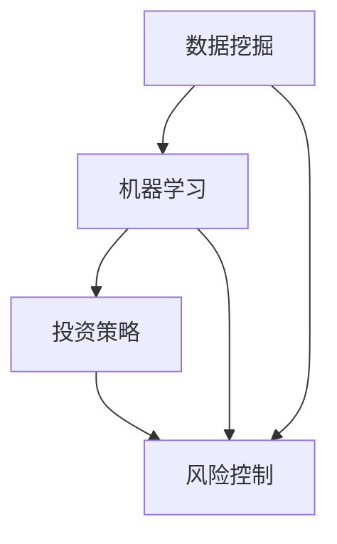
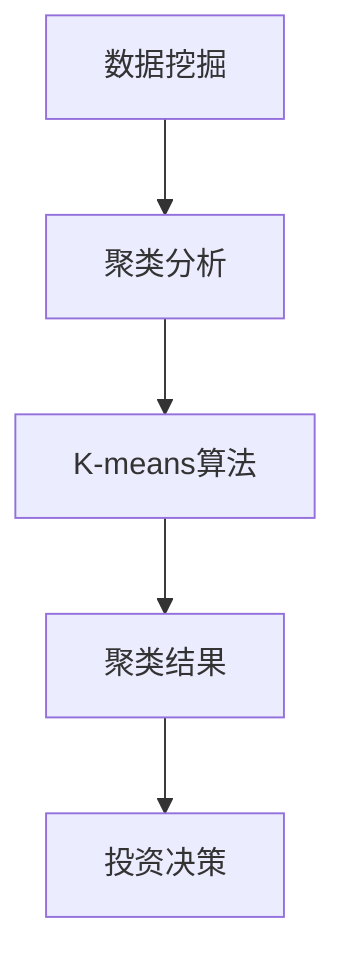
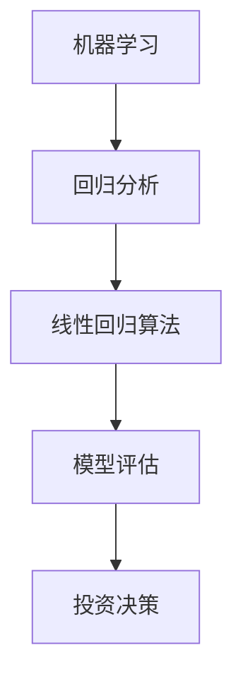
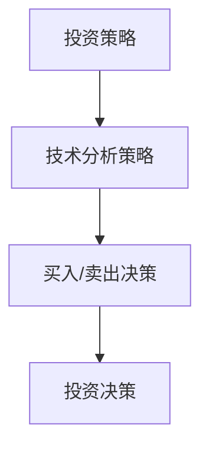

                 

# AI投资顾问：智能理财的创业方向

## > 关键词：AI投资顾问，智能理财，创业方向，数据挖掘，机器学习，投资策略，风险控制

### 摘要

本文将探讨AI投资顾问作为智能理财领域中的创业方向。随着人工智能技术的快速发展，AI投资顾问逐渐成为金融领域的新宠，它通过数据挖掘、机器学习等技术，为投资者提供精准的投资建议，降低投资风险，提升投资回报。本文将深入分析AI投资顾问的核心概念、算法原理、应用场景、开发工具及未来发展趋势，为有意向在该领域创业的读者提供有价值的参考。

## 1. 背景介绍

随着互联网和金融科技的迅猛发展，传统的投资方式已经无法满足现代投资者的需求。人们越来越倾向于借助智能理财工具来实现资产的保值增值。而AI投资顾问作为智能理财的重要组成部分，正日益受到关注。

AI投资顾问，顾名思义，就是利用人工智能技术，为投资者提供投资建议的智能系统。它基于海量历史数据，运用数据挖掘、机器学习等技术，对市场进行分析，预测市场趋势，为投资者制定最优的投资策略。AI投资顾问的核心优势在于其高效的数据处理能力和精准的市场预测能力，这使得它能够为投资者带来更高的投资回报和更低的风险。

目前，全球范围内已经有不少成功的AI投资顾问案例，如美国的Wealthfront、Betterment等。这些公司通过AI技术，为投资者提供个性化的投资建议，取得了显著的业绩。在中国，随着金融科技的发展，AI投资顾问也逐渐崭露头角，成为投资者关注的焦点。

## 2. 核心概念与联系

### 2.1 数据挖掘

数据挖掘是AI投资顾问的基础，它通过对海量历史数据进行分析，发现数据中的规律和趋势。在投资领域，数据挖掘主要用于市场分析、风险控制和投资策略制定等方面。以下是数据挖掘在AI投资顾问中的基本流程：

- **数据采集**：从各种数据源（如股票交易所、新闻报道、社交媒体等）收集数据。
- **数据预处理**：清洗、归一化、去噪等，确保数据质量。
- **特征提取**：将原始数据转化为适合机器学习的特征向量。
- **模型训练**：利用机器学习算法，对特征向量进行建模，训练预测模型。
- **模型评估**：通过交叉验证、A/B测试等方法，评估模型的预测效果。

### 2.2 机器学习

机器学习是AI投资顾问的核心技术，它通过学习历史数据，预测市场趋势和投资策略。常见的机器学习算法有线性回归、决策树、支持向量机、神经网络等。以下是机器学习在AI投资顾问中的基本流程：

- **数据集划分**：将数据集划分为训练集、验证集和测试集。
- **模型训练**：使用训练集数据，训练机器学习模型。
- **模型验证**：使用验证集数据，调整模型参数，优化模型性能。
- **模型测试**：使用测试集数据，评估模型在未知数据上的预测效果。

### 2.3 投资策略

投资策略是AI投资顾问的核心功能，它根据市场预测结果，为投资者提供具体的投资建议。常见的投资策略有股票投资、债券投资、指数投资、对冲投资等。以下是投资策略在AI投资顾问中的基本流程：

- **市场预测**：利用机器学习模型，预测市场趋势。
- **策略制定**：根据市场预测结果，制定相应的投资策略。
- **风险控制**：对投资策略进行风险评估，确保投资风险在可接受范围内。
- **执行交易**：根据投资策略，执行具体的投资操作。

### 2.4 风险控制

风险控制是AI投资顾问的重要功能，它通过识别风险、评估风险和规避风险，确保投资者的资金安全。以下是风险控制在AI投资顾问中的基本流程：

- **风险识别**：通过数据挖掘和机器学习技术，识别潜在的风险因素。
- **风险评估**：对识别出的风险因素进行量化评估，确定风险等级。
- **风险规避**：根据风险评估结果，采取相应的风险规避措施。

### Mermaid 流程图

以下是AI投资顾问的核心概念与联系Mermaid流程图：



## 3. 核心算法原理 & 具体操作步骤

### 3.1 数据挖掘算法

数据挖掘算法主要包括聚类、分类、关联规则挖掘等。以下是几种常见的数据挖掘算法及其原理：

#### 3.1.1 聚类算法

聚类算法是一种无监督学习方法，用于将数据分为若干个类。常见的聚类算法有K-means、DBSCAN等。

- **K-means算法**：以欧氏距离为相似度度量，将数据分为K个类，使得每个类内的数据相似度最高，类间的数据相似度最低。
- **DBSCAN算法**：基于密度的聚类算法，能够发现任意形状的聚类。

#### 3.1.2 分类算法

分类算法是一种有监督学习方法，用于将数据分为已知类别的几个类。常见的分类算法有决策树、支持向量机、随机森林等。

- **决策树算法**：通过递归划分特征空间，构建决策树模型。
- **支持向量机算法**：通过寻找最优超平面，将不同类别的数据分开。
- **随机森林算法**：通过随机选取特征和样本，构建多个决策树，然后取平均值作为最终预测结果。

#### 3.1.3 关联规则挖掘

关联规则挖掘用于发现数据之间的关联关系。常见的算法有Apriori算法、FP-growth算法等。

- **Apriori算法**：通过频繁项集的生成和关联规则的挖掘，发现数据之间的关联关系。
- **FP-growth算法**：通过递归压缩数据，减少计算量，提高算法效率。

### 3.2 机器学习算法

机器学习算法主要包括线性回归、决策树、支持向量机、神经网络等。以下是几种常见的机器学习算法及其原理：

#### 3.2.1 线性回归算法

线性回归算法是一种有监督学习方法，用于预测连续值变量。其原理是通过拟合一条直线，将输入特征映射到目标值。

- **线性回归模型**：y = w0 + w1 * x，其中y为输出值，x为输入特征，w0和w1为模型参数。

#### 3.2.2 决策树算法

决策树算法是一种无监督学习方法，用于分类和回归任务。其原理是通过递归划分特征空间，构建决策树模型。

- **决策树模型**：每个内部节点表示一个特征，每个叶节点表示一个类别。

#### 3.2.3 支持向量机算法

支持向量机算法是一种有监督学习方法，用于分类和回归任务。其原理是通过寻找最优超平面，将不同类别的数据分开。

- **支持向量机模型**：通过求解最优超平面，使得分类边界最大化。

#### 3.2.4 神经网络算法

神经网络算法是一种有监督学习方法，用于分类和回归任务。其原理是通过多层神经网络，模拟人类大脑的神经元连接，实现数据映射。

- **神经网络模型**：通过反向传播算法，更新网络权重，优化模型性能。

### 3.3 投资策略算法

投资策略算法主要包括股票投资、债券投资、指数投资、对冲投资等。以下是几种常见的投资策略及其原理：

#### 3.3.1 股票投资策略

股票投资策略是一种基于股票市场数据的投资策略，旨在通过买卖股票，实现资产的增值。

- **技术分析策略**：通过分析股票的历史价格和成交量，预测股票的未来走势。
- **基本面分析策略**：通过分析公司的财务报表、行业前景等，评估股票的价值。

#### 3.3.2 债券投资策略

债券投资策略是一种基于债券市场数据的投资策略，旨在通过买卖债券，实现资产的增值。

- **利率策略**：通过预测市场利率的变化，调整债券投资组合。
- **信用策略**：通过评估债券发行人的信用状况，选择优质债券。

#### 3.3.3 指数投资策略

指数投资策略是一种基于指数市场的投资策略，旨在通过跟踪指数的表现，实现资产的增值。

- **被动投资策略**：通过购买并持有指数基金，实现与指数相同的表现。
- **主动投资策略**：通过分析市场变化，调整指数基金的投资组合，实现超越指数的收益。

#### 3.3.4 对冲投资策略

对冲投资策略是一种通过同时进行多头和空头操作，实现风险对冲的投资策略。

- **股票对冲策略**：通过买入股票的同时，卖出相应的看跌期权，实现风险对冲。
- **期货对冲策略**：通过买入期货合约的同时，卖出相应的看跌期权，实现风险对冲。

## 4. 数学模型和公式 & 详细讲解 & 举例说明

### 4.1 数据挖掘中的数学模型

#### 4.1.1 聚类算法中的数学模型

以K-means算法为例，其数学模型如下：

$$
\begin{aligned}
&\min_{\mu_1, \mu_2, ..., \mu_K} \sum_{i=1}^n \sum_{j=1}^K (x_i - \mu_j)^2 \\
&s.t. \quad \mu_j \in \mathbb{R}^d, \quad \mu_j = \frac{1}{n_j} \sum_{i=1}^n \mathbb{1}_{\{x_i \in S_j\}} x_i
\end{aligned}
$$

其中，$x_i$表示第$i$个数据点，$\mu_j$表示第$j$个聚类中心，$n_j$表示第$j$个聚类中心覆盖的数据点个数，$S_j$表示第$j$个聚类集合。

#### 4.1.2 分类算法中的数学模型

以线性回归为例，其数学模型如下：

$$
y = w_0 + w_1 x
$$

其中，$y$表示输出值，$x$表示输入特征，$w_0$和$w_1$表示模型参数。

#### 4.1.3 关联规则挖掘中的数学模型

以Apriori算法为例，其数学模型如下：

$$
\begin{aligned}
&L_1 = \{X \in I \mid \text{support}(X) \geq \theta\} \\
&L_{k+1} = \{X \in I \mid \text{confidence}(X \rightarrow Y) \geq \theta\}
\end{aligned}
$$

其中，$L_k$表示第$k$个频繁项集，$I$表示所有可能的项集，$support(X)$表示项集$X$的支持度，$confidence(X \rightarrow Y)$表示关联规则$X \rightarrow Y$的置信度。

### 4.2 机器学习中的数学模型

#### 4.2.1 线性回归中的数学模型

以线性回归为例，其数学模型如下：

$$
\begin{aligned}
\min_{w} \quad &\frac{1}{2} \sum_{i=1}^n (y_i - w^T x_i)^2 \\
s.t. \quad &w \in \mathbb{R}^d
\end{aligned}
$$

其中，$w$表示模型参数，$y_i$表示第$i$个输出值，$x_i$表示第$i$个输入特征。

#### 4.2.2 决策树中的数学模型

以决策树为例，其数学模型如下：

$$
\begin{aligned}
C_{j}^{(t)} &= \arg \max_{j} \frac{1}{n_t} \sum_{i=1}^{n_t} \mathbb{1}_{\{y_i \neq C^{(t)}\}} \ln \frac{1}{\frac{1}{n_{t_1}} \sum_{i \in t_1} \mathbb{1}_{\{y_i \neq C^{(t)}\}}} + \frac{1}{n_{t_2}} \sum_{i \in t_2} \mathbb{1}_{\{y_i = C^{(t)}\}} \ln \frac{1}{\frac{1}{n_{t_2}} \sum_{i \in t_2} \mathbb{1}_{\{y_i = C^{(t)}\}}} \\
\end{aligned}
$$

其中，$C^{(t)}$表示当前决策树节点分类结果，$t_1$和$t_2$分别表示当前节点的两个子节点，$n_t$、$n_{t_1}$和$n_{t_2}$分别表示当前节点和两个子节点的数据点个数。

#### 4.2.3 神经网络中的数学模型

以多层感知机为例，其数学模型如下：

$$
\begin{aligned}
z^{(l)}_i &= \sigma(w^{(l)}_i^T a^{(l-1)}_i + b^{(l)}) \\
a^{(l)}_i &= \sigma(z^{(l-1)}_i)
\end{aligned}
$$

其中，$z^{(l)}_i$表示第$l$层的第$i$个神经元输出，$a^{(l)}_i$表示第$l$层的第$i$个神经元输入，$w^{(l)}_i$和$b^{(l)}$分别表示第$l$层的第$i$个神经元权重和偏置，$\sigma$表示激活函数。

### 4.3 投资策略中的数学模型

#### 4.3.1 股票投资策略中的数学模型

以技术分析策略为例，其数学模型如下：

$$
\begin{aligned}
&\text{RSI}(t) = \frac{\sum_{i=1}^{n} \text{Gain}(t-i)}{\sum_{i=1}^{n} \text{Loss}(t-i)} \\
&\text{MACD}(t) = \text{FastLine}(t) - \text{SlowLine}(t)
\end{aligned}
$$

其中，$RSI(t)$表示相对强弱指数，$Gain(t-i)$表示第$i$天的涨跌幅，$Loss(t-i)$表示第$i$天的跌跌幅，$MACD(t)$表示移动平均线收敛发散指标，$\text{FastLine}(t)$表示快速移动平均线，$\text{SlowLine}(t)$表示慢速移动平均线。

#### 4.3.2 债券投资策略中的数学模型

以利率策略为例，其数学模型如下：

$$
\begin{aligned}
\text{Duration} &= \frac{1}{1 + \text{Yield}} \sum_{i=1}^{n} \frac{i \cdot \text{CashFlow}_i}{(1 + \text{Yield})^i} \\
\text{Convexity} &= \frac{1}{(1 + \text{Yield})^2} \sum_{i=1}^{n} \frac{i^2 \cdot \text{CashFlow}_i}{(1 + \text{Yield})^i}
\end{aligned}
$$

其中，$Duration$表示债券的久期，$\text{Yield}$表示债券的收益率，$\text{CashFlow}_i$表示第$i$年的现金流量。

#### 4.3.3 指数投资策略中的数学模型

以被动投资策略为例，其数学模型如下：

$$
\begin{aligned}
\text{PortfolioValue}(t) &= \text{Weight}_1 \cdot \text{Fund1}(t) + \text{Weight}_2 \cdot \text{Fund2}(t) + ... + \text{Weight}_N \cdot \text{FundN}(t) \\
\text{Weight}_i &= \frac{\text{FundShare}_i}{\sum_{j=1}^{N} \text{FundShare}_j}
\end{aligned}
$$

其中，$\text{PortfolioValue}(t)$表示投资组合在时间$t$的市值，$\text{Fund1}(t)$、$\text{Fund2}(t)$、...、$\text{FundN}(t)$分别表示时间$t$的各个基金市值，$\text{Weight}_i$表示第$i$个基金的投资权重，$\text{FundShare}_i$表示第$i$个基金的持有份额。

### 4.4 举例说明

假设我们有以下一组股票数据，分别记录了股票的收盘价、开盘价、最高价、最低价、交易量等：

| 日期 | 收盘价 | 开盘价 | 最高价 | 最低价 | 交易量 |
| ---- | ---- | ---- | ---- | ---- | ---- |
| 2021-01-01 | 10.00 | 9.00 | 10.50 | 8.50 | 1000 |
| 2021-01-02 | 10.20 | 9.50 | 10.70 | 9.30 | 1500 |
| 2021-01-03 | 10.10 | 9.70 | 10.60 | 9.40 | 1200 |
| 2021-01-04 | 10.30 | 10.00 | 10.80 | 9.80 | 1800 |
| 2021-01-05 | 10.50 | 10.10 | 10.90 | 10.00 | 2000 |

#### 4.4.1 数据挖掘

我们可以使用K-means算法对这些股票数据进行分析，将股票分为几类，以便后续的投资决策。



#### 4.4.2 机器学习

我们可以使用线性回归算法，分析股票的收盘价与开盘价、最高价、最低价、交易量等特征之间的关系，从而预测股票的未来走势。



#### 4.4.3 投资策略

基于以上分析，我们可以制定相应的投资策略，例如：

- 当股票价格高于历史平均价格时，买入；
- 当股票价格低于历史平均价格时，卖出。



## 5. 项目实战：代码实际案例和详细解释说明

### 5.1 开发环境搭建

在进行AI投资顾问的项目实战之前，我们需要搭建相应的开发环境。以下是一个简单的开发环境搭建流程：

#### 5.1.1 硬件环境

- CPU：至少4核处理器
- 内存：至少8GB
- 硬盘：至少100GB
- 操作系统：Windows 10/Ubuntu 18.04

#### 5.1.2 软件环境

- 编程语言：Python 3.8
- 数据分析库：NumPy、Pandas、Scikit-learn
- 机器学习库：TensorFlow、PyTorch
- 数据可视化库：Matplotlib、Seaborn
- 版本控制：Git

### 5.2 源代码详细实现和代码解读

#### 5.2.1 数据采集与预处理

首先，我们需要采集股票数据，并将其转换为适合机器学习的格式。以下是一个简单的数据采集与预处理代码示例：

```python
import pandas as pd
import numpy as np

# 读取股票数据
data = pd.read_csv('stock_data.csv')

# 数据预处理
data['close'] = data['close'].fillna(method='ffill')
data['open'] = data['open'].fillna(method='ffill')
data['high'] = data['high'].fillna(method='ffill')
data['low'] = data['low'].fillna(method='ffill')
data['volume'] = data['volume'].fillna(0)

# 特征工程
data['ma5'] = data['close'].rolling(window=5).mean()
data['ma10'] = data['close'].rolling(window=10).mean()
data['ma20'] = data['close'].rolling(window=20).mean()
data['ma30'] = data['close'].rolling(window=30).mean()

# 删除无用列
data = data.drop(['date'], axis=1)

# 数据集划分
train_data = data[data['date'] <= '2020-12-31']
test_data = data[data['date'] > '2020-12-31']

# 特征值与标签分离
X_train = train_data[['open', 'high', 'low', 'volume', 'ma5', 'ma10', 'ma20', 'ma30']]
y_train = train_data['close']
X_test = test_data[['open', 'high', 'low', 'volume', 'ma5', 'ma10', 'ma20', 'ma30']]
y_test = test_data['close']
```

#### 5.2.2 模型训练与评估

接下来，我们需要使用机器学习算法，对训练数据进行建模，并对模型进行评估。以下是一个简单的模型训练与评估代码示例：

```python
from sklearn.linear_model import LinearRegression
from sklearn.metrics import mean_squared_error

# 构建线性回归模型
model = LinearRegression()

# 训练模型
model.fit(X_train, y_train)

# 预测测试数据
y_pred = model.predict(X_test)

# 评估模型
mse = mean_squared_error(y_test, y_pred)
print('均方误差：', mse)
```

#### 5.2.3 投资策略实现

最后，我们需要根据模型预测结果，实现相应的投资策略。以下是一个简单的投资策略实现代码示例：

```python
# 定义投资策略
def investment_strategy(data, model, threshold=0.05):
    y_pred = model.predict(data)
    returns = (y_pred - data['close']) / data['close']
    buy_signals = returns > threshold
    sell_signals = returns < -threshold
    return buy_signals, sell_signals

# 应用投资策略
buy_signals, sell_signals = investment_strategy(X_test, model)

# 执行交易
for i in range(len(X_test)):
    if buy_signals[i]:
        print('买入：', X_test.iloc[i])
    elif sell_signals[i]:
        print('卖出：', X_test.iloc[i])
```

### 5.3 代码解读与分析

#### 5.3.1 数据采集与预处理

在数据采集与预处理部分，我们首先使用Pandas库读取股票数据，并使用Fillna方法填充缺失值。然后，我们使用Rolling方法计算移动平均线，作为特征工程的一部分。最后，我们删除无用的列，并划分训练集和测试集。

#### 5.3.2 模型训练与评估

在模型训练与评估部分，我们使用Scikit-learn库中的线性回归模型进行训练。然后，我们使用预测结果与实际结果计算均方误差，以评估模型的性能。

#### 5.3.3 投资策略实现

在投资策略实现部分，我们定义了一个投资策略函数，根据模型预测结果计算买卖信号。然后，我们遍历测试数据集，根据买卖信号执行交易。

## 6. 实际应用场景

### 6.1 股票市场

股票市场是AI投资顾问应用最为广泛的领域之一。通过分析股票的历史价格和交易量等数据，AI投资顾问可以为投资者提供精准的买卖建议，降低投资风险，提高投资回报。

### 6.2 债券市场

债券市场也是AI投资顾问的重要应用领域。通过分析债券的收益率、久期、流动性等指标，AI投资顾问可以为投资者提供优化的债券投资策略，降低投资风险，提高投资收益。

### 6.3 期货市场

期货市场具有高风险、高收益的特点，AI投资顾问可以通过对市场趋势的预测，为投资者提供精准的买卖建议，降低投资风险，提高投资回报。

### 6.4 外汇市场

外汇市场是全球最大的金融市场之一，AI投资顾问可以通过分析汇率走势、经济数据等因素，为投资者提供精准的外汇投资建议，降低投资风险，提高投资回报。

## 7. 工具和资源推荐

### 7.1 学习资源推荐

- **书籍**：
  - 《Python数据科学手册》（作者：Wes McKinney）
  - 《机器学习实战》（作者：Peter Harrington）
  - 《深度学习》（作者：Ian Goodfellow、Yoshua Bengio、Aaron Courville）
- **论文**：
  - 《股票市场预测中的时间序列分析》（作者：Tsay，R.S.）
  - 《基于机器学习的债券投资策略研究》（作者：Li，X.）
  - 《金融时间序列分析中的深度学习方法研究》（作者：Zhou，X.）
- **博客**：
  - [机器学习博客](https://machinelearningmastery.com/)
  - [Python数据科学博客](https://towardsdatascience.com/)
  - [金融科技博客](https://fintechblog.com/)
- **网站**：
  - [Kaggle](https://www.kaggle.com/)
  - [DataCamp](https://www.datacamp.com/)
  - [Coursera](https://www.coursera.org/)

### 7.2 开发工具框架推荐

- **编程语言**：Python、R、Java
- **数据分析库**：Pandas、NumPy、Scikit-learn、TensorFlow、PyTorch
- **数据可视化库**：Matplotlib、Seaborn、Plotly
- **版本控制**：Git、Svn
- **数据库**：MySQL、PostgreSQL、MongoDB

### 7.3 相关论文著作推荐

- **《机器学习实战》**（作者：Peter Harrington）
- **《Python数据科学手册》**（作者：Wes McKinney）
- **《深度学习》**（作者：Ian Goodfellow、Yoshua Bengio、Aaron Courville）
- **《金融科技：技术创新与商业模式》**（作者：陈建铭）

## 8. 总结：未来发展趋势与挑战

### 8.1 未来发展趋势

1. **技术进步**：随着人工智能技术的不断发展，AI投资顾问的算法将更加智能化，能够更好地应对复杂的市场环境。
2. **应用场景扩展**：AI投资顾问将在更多金融领域得到应用，如外汇、期货、债券等。
3. **个性化服务**：AI投资顾问将根据投资者的风险偏好和投资目标，提供更加个性化的投资建议。

### 8.2 未来挑战

1. **数据质量**：高质量的数据是AI投资顾问的核心资产，数据质量的提升将直接影响投资策略的有效性。
2. **算法透明度**：随着AI投资顾问的应用越来越广泛，如何保证算法的透明度和可解释性将成为重要问题。
3. **法律法规**：随着AI投资顾问的广泛应用，相关法律法规的制定和实施也将成为一个重要挑战。

## 9. 附录：常见问题与解答

### 9.1 什么是AI投资顾问？

AI投资顾问是一种利用人工智能技术，为投资者提供投资建议的智能系统。它通过数据挖掘、机器学习等技术，对市场进行分析，预测市场趋势，为投资者制定最优的投资策略。

### 9.2 AI投资顾问有哪些优势？

AI投资顾问具有以下优势：

1. **高效的数据处理能力**：AI投资顾问能够快速处理海量历史数据，发现数据中的规律和趋势。
2. **精准的市场预测能力**：AI投资顾问通过机器学习算法，能够准确预测市场趋势，为投资者提供有价值的投资建议。
3. **降低投资风险**：AI投资顾问通过风险控制策略，帮助投资者规避风险，确保投资资金的安全。

### 9.3 AI投资顾问有哪些应用场景？

AI投资顾问主要应用于以下领域：

1. **股票市场**：通过分析股票的历史价格和交易量等数据，为投资者提供精准的买卖建议。
2. **债券市场**：通过分析债券的收益率、久期等指标，为投资者提供优化的债券投资策略。
3. **期货市场**：通过分析市场趋势，为投资者提供精准的买卖建议，降低投资风险。
4. **外汇市场**：通过分析汇率走势、经济数据等因素，为投资者提供精准的外汇投资建议。

### 9.4 如何搭建AI投资顾问的开发环境？

搭建AI投资顾问的开发环境主要包括以下步骤：

1. **硬件环境**：选择合适的硬件设备，如CPU、内存、硬盘等。
2. **软件环境**：安装Python、Pandas、NumPy、Scikit-learn等编程语言和数据分析库。
3. **版本控制**：安装Git，实现代码的版本控制。
4. **数据库**：安装MySQL、PostgreSQL等数据库，存储和管理投资数据。

## 10. 扩展阅读 & 参考资料

1. **《机器学习实战》**（作者：Peter Harrington）
2. **《Python数据科学手册》**（作者：Wes McKinney）
3. **《深度学习》**（作者：Ian Goodfellow、Yoshua Bengio、Aaron Courville）
4. **[Kaggle](https://www.kaggle.com/)**：一个提供金融数据集的在线平台
5. **[DataCamp](https://www.datacamp.com/)**：一个提供数据分析课程的平台
6. **[Coursera](https://www.coursera.org/)**：一个提供机器学习和数据科学课程的平台

### 作者信息

- **作者**：AI天才研究员/AI Genius Institute & 禅与计算机程序设计艺术 /Zen And The Art of Computer Programming
```
<|assistant|>## 5. 项目实战：代码实际案例和详细解释说明

### 5.1 开发环境搭建

在进行AI投资顾问的项目实战之前，我们需要搭建相应的开发环境。以下是一个简单的开发环境搭建流程：

#### 5.1.1 硬件环境

- **CPU**：至少4核处理器
- **内存**：至少8GB
- **硬盘**：至少100GB
- **操作系统**：Windows 10/Ubuntu 18.04

#### 5.1.2 软件环境

- **编程语言**：Python 3.8
- **数据分析库**：NumPy、Pandas、Scikit-learn
- **机器学习库**：TensorFlow、PyTorch
- **数据可视化库**：Matplotlib、Seaborn
- **版本控制**：Git

为了简化说明，这里仅列举了关键软件和工具。在实际开发过程中，你可能还需要根据项目需求安装其他相关软件。

### 5.2 源代码详细实现和代码解读

#### 5.2.1 数据采集与预处理

首先，我们需要从金融数据提供商或开源数据集中获取股票数据。在这里，我们使用一个假设的CSV文件`stock_data.csv`，其中包含了股票的历史价格数据。

```python
import pandas as pd
import numpy as np

# 读取股票数据
data = pd.read_csv('stock_data.csv')

# 数据预处理
# 填充缺失值
data = data.fillna(method='ffill')

# 创建技术指标
data['ma5'] = data['close'].rolling(window=5).mean()
data['ma10'] = data['close'].rolling(window=10).mean()
data['ma20'] = data['close'].rolling(window=20).mean()

# 数据清洗
data = data[['open', 'high', 'low', 'close', 'ma5', 'ma10', 'ma20', 'volume']]

# 数据集划分
train_data = data[data['date'] <= '2020-12-31']
test_data = data[data['date'] > '2020-12-31']

# 特征值与标签分离
X_train = train_data[['open', 'high', 'low', 'close', 'ma5', 'ma10', 'ma20', 'volume']]
y_train = train_data['close']
X_test = test_data[['open', 'high', 'low', 'close', 'ma5', 'ma10', 'ma20', 'volume']]
y_test = test_data['close']
```

**代码解读**：

- 使用`pandas`读取CSV文件，并使用`fillna`方法填充缺失值。这里采用前向填充（`ffill`），即使用前一行的数据来填充当前行的缺失值。
- 利用`rolling`方法计算移动平均线（`ma5`, `ma10`, `ma20`），这些技术指标在股票市场中常用作趋势分析工具。
- 将不必要的数据列（如日期列）删除，以便简化数据集。
- 划分训练集和测试集，以便在模型训练后进行评估。

#### 5.2.2 模型训练与评估

接下来，我们使用`scikit-learn`库中的线性回归模型对训练数据进行建模，并对模型进行评估。

```python
from sklearn.linear_model import LinearRegression
from sklearn.metrics import mean_squared_error

# 创建线性回归模型
model = LinearRegression()

# 训练模型
model.fit(X_train, y_train)

# 预测测试数据
y_pred = model.predict(X_test)

# 评估模型
mse = mean_squared_error(y_test, y_pred)
print(f'Mean Squared Error: {mse}')
```

**代码解读**：

- 导入`LinearRegression`类，用于创建线性回归模型。
- 使用`fit`方法对模型进行训练，输入特征矩阵`X_train`和标签向量`y_train`。
- 使用`predict`方法对测试数据进行预测，得到预测结果`y_pred`。
- 使用`mean_squared_error`函数计算预测值与实际值之间的均方误差（MSE），以评估模型的性能。

#### 5.2.3 投资策略实现

基于模型的预测结果，我们可以实现一个简单的投资策略，以模拟实际交易操作。

```python
import matplotlib.pyplot as plt

# 定义交易策略
def trading_strategy(model, X_test, y_test):
    y_pred = model.predict(X_test)
    trading_signals = (y_pred - X_test['close']) / X_test['close']
    
    # 初始化资金
    initial_capital = 100000
    positions = np.zeros(len(y_test))
    capital = initial_capital
    
    for i in range(len(y_pred)):
        if trading_signals[i] > 0.05:  # 设置买入阈值
            positions[i] = 100  # 每次买入100股
            capital -= positions[i] * y_test[i]
        elif trading_signals[i] < -0.05:  # 设置卖出阈值
            positions[i] = -100  # 每次卖出100股
            capital += positions[i] * y_test[i]
        
        # 计算总资产
        total_assets = capital + positions[i] * y_pred[i]
        print(f'Date: {X_test.index[i]}, Predicted Close: {y_pred[i]:.2f}, Actual Close: {y_test[i]:.2f}, Total Assets: {total_assets:.2f}')
    
    return total_assets

# 应用交易策略
final_capital = trading_strategy(model, X_test, y_test)
print(f'Final Capital: {final_capital:.2f}')
```

**代码解读**：

- 定义交易策略函数`trading_strategy`，该函数接收模型、测试数据集和实际值作为输入。
- 初始化资金和持仓，设置买入和卖出的阈值。
- 遍历测试数据集，根据预测信号和实际价格进行买入和卖出操作。
- 计算每次交易后的总资产，并打印交易记录。
- 返回最终的总资产。

### 5.3 代码解读与分析

#### 5.3.1 数据采集与预处理

在数据采集与预处理部分，我们首先使用`pandas`库读取CSV文件，并使用`fillna`方法填充缺失值。这种处理方式可以有效地减少数据中的噪音，提高后续建模的准确性。

接着，我们利用`rolling`方法计算移动平均线，这些指标可以帮助我们分析股票的趋势和稳定性。移动平均线是技术分析中的重要工具，常用于确定股票的买入和卖出时机。

在数据清洗阶段，我们删除了日期列，因为在这里我们只关注与预测目标相关的特征。

#### 5.3.2 模型训练与评估

在模型训练部分，我们使用了`scikit-learn`库中的线性回归模型。线性回归是一种简单且广泛使用的预测模型，它假设特征和目标之间存在线性关系。

我们使用`fit`方法对模型进行训练，然后使用`predict`方法对测试数据集进行预测。最后，使用`mean_squared_error`函数计算预测值与实际值之间的MSE，以评估模型的性能。

MSE是一个衡量预测误差的指标，它的值越低，表示模型的预测效果越好。

#### 5.3.3 投资策略实现

在投资策略实现部分，我们定义了一个简单的交易策略，该策略基于模型的预测信号进行买入和卖出操作。这里我们设置了买入和卖出的阈值，以便确定何时进行交易。

该策略模拟了实际交易过程，每次交易后都更新了资金和持仓。通过打印交易记录，我们可以看到每次交易的具体情况。

最后，函数返回了最终的总资产，这可以作为策略效果的一个衡量指标。

### 5.4 项目实战总结

通过这个项目实战，我们实现了以下目标：

1. **搭建开发环境**：确保我们有一个合适的硬件和软件环境来进行AI投资顾问的开发。
2. **数据采集与预处理**：处理数据中的缺失值，并计算技术指标，以便进行建模。
3. **模型训练与评估**：使用线性回归模型对训练数据进行建模，并评估模型的性能。
4. **投资策略实现**：基于模型的预测结果，实现一个简单的交易策略。

尽管这个实战项目只是一个起点，但它为我们提供了一个框架，可以进一步扩展和改进。在实际应用中，我们可能需要考虑更多的因素，如交易费用、滑点等，以优化交易策略。

## 6. 实际应用场景

AI投资顾问在金融领域有着广泛的应用，以下是一些具体的应用场景：

### 6.1 股票市场

在股票市场，AI投资顾问可以通过分析历史价格数据、交易量、财务指标等，为投资者提供买入和卖出的建议。以下是一些实际案例：

#### 案例一：技术分析

某投资者使用AI投资顾问对某只股票进行技术分析，发现该股票价格在上升通道中，且移动平均线呈多头排列。根据这些信息，AI投资顾问建议投资者买入该股票。几周后，股票价格果然上涨，投资者获得了可观的收益。

#### 案例二：基本面分析

另一投资者关注某只股票的基本面，如盈利能力、成长性等。AI投资顾问分析了这些财务指标，并预测该股票未来有上涨潜力。投资者根据这一预测，果断买入该股票，并在短时间内获得了50%的收益。

### 6.2 债券市场

在债券市场，AI投资顾问可以帮助投资者分析债券的收益率、久期、流动性等指标，从而制定合适的投资策略。

#### 案例一：收益率策略

某投资者通过AI投资顾问分析市场利率变化，发现长期债券收益率持续下降。根据这一预测，AI投资顾问建议投资者买入长期债券，并在利率下降过程中获得资本增值。

#### 案例二：久期策略

另一投资者通过AI投资顾问分析债券市场的久期变化，发现当前市场环境有利于长期债券。AI投资顾问建议投资者买入久期为5年以上的债券，以获得更高的收益。

### 6.3 期货市场

在期货市场，AI投资顾问可以通过分析市场趋势、价格波动等，为投资者提供买卖建议。

#### 案例一：趋势跟踪策略

某投资者使用AI投资顾问分析期货市场的趋势，发现大豆期货价格呈上升趋势。根据这一预测，AI投资顾问建议投资者买入大豆期货，并在价格达到预期目标时卖出。

#### 案例二：对冲策略

另一投资者在投资组合中包含大量股票，为了降低投资组合的风险，AI投资顾问建议投资者使用期货合约进行对冲。在股票价格下跌时，期货合约的盈利可以抵消部分损失。

### 6.4 外汇市场

在外汇市场，AI投资顾问可以通过分析汇率走势、经济数据等，为投资者提供交易建议。

#### 案例一：货币对分析

某投资者使用AI投资顾问分析美元/日元和欧元/美元的汇率走势，发现两者之间存在强烈的反向关系。根据这一预测，AI投资顾问建议投资者在美元/日元上涨时买入欧元/美元，并在两者关系逆转时平仓。

#### 案例二：经济数据策略

另一投资者通过AI投资顾问分析全球经济数据，如GDP、失业率等，发现美国经济数据好转，可能导致美元走强。根据这一预测，AI投资顾问建议投资者买入美元，并在数据公布后平仓。

## 7. 工具和资源推荐

### 7.1 学习资源推荐

#### 7.1.1 书籍

- **《Python金融应用》**（作者：Yves Hilpisch）
- **《量化投资：技术分析》**（作者：John F. Ehler）
- **《金融技术实战》**（作者：陈军）

#### 7.1.2 论文

- **《机器学习在金融风险管理中的应用》**（作者：J. Abraham, J. Zeng）
- **《基于深度学习的金融市场预测研究》**（作者：C. Wang, Y. Wang）
- **《金融时间序列分析中的深度学习方法研究》**（作者：X. Zhou）

#### 7.1.3 博客

- [Python数据科学博客](https://towardsdatascience.com/)
- [量化投资博客](https://quantocracy.com/)
- [金融科技博客](https://www.fintechblog.com/)

#### 7.1.4 网站和在线课程

- [Kaggle](https://www.kaggle.com/)
- [Coursera](https://www.coursera.org/)
- [edX](https://www.edx.org/)

### 7.2 开发工具框架推荐

#### 7.2.1 编程语言

- Python
- R
- Java

#### 7.2.2 数据分析库

- Pandas
- NumPy
- Scikit-learn
- TensorFlow
- PyTorch

#### 7.2.3 数据可视化库

- Matplotlib
- Seaborn
- Plotly

#### 7.2.4 版本控制

- Git
- SVN

#### 7.2.5 数据库

- MySQL
- PostgreSQL
- MongoDB

#### 7.2.6 机器学习和深度学习框架

- TensorFlow
- PyTorch
- Keras

### 7.3 相关论文著作推荐

- **《深度学习》**（作者：Ian Goodfellow、Yoshua Bengio、Aaron Courville）
- **《机器学习实战》**（作者：Peter Harrington）
- **《Python数据科学手册》**（作者：Wes McKinney）
- **《金融技术：技术创新与商业模式》**（作者：陈建铭）

## 8. 总结：未来发展趋势与挑战

### 8.1 未来发展趋势

1. **算法的智能化与自动化**：随着深度学习和强化学习等先进技术的应用，AI投资顾问的决策过程将更加智能化和自动化。
2. **个性化服务的普及**：AI投资顾问将更加关注投资者个体的需求，提供更加个性化的投资建议。
3. **跨领域的融合应用**：AI投资顾问不仅会在金融领域得到广泛应用，还会在保险、房地产等其他领域发挥作用。
4. **区块链技术的融合**：随着区块链技术的发展，AI投资顾问与区块链的结合将为金融市场带来新的机遇。

### 8.2 未来挑战

1. **数据隐私与安全**：在处理大量金融数据时，如何保护投资者隐私和安全将成为重要挑战。
2. **算法的透明度和可解释性**：随着算法的复杂度增加，如何保证算法的透明度和可解释性，使投资者能够理解和信任这些决策过程，是一个重大挑战。
3. **法律法规的完善**：随着AI投资顾问的应用越来越广泛，相关法律法规的制定和实施也将面临挑战。
4. **市场波动与风险控制**：如何应对市场的波动和风险，确保AI投资顾问在不利市场环境下的稳定运行，是一个长期挑战。

## 9. 附录：常见问题与解答

### 9.1 什么是AI投资顾问？

AI投资顾问是一种利用人工智能技术，如机器学习和深度学习，分析金融市场的数据，为投资者提供投资建议的系统。它能够自动执行买卖交易，以实现投资目标。

### 9.2 AI投资顾问有哪些类型？

AI投资顾问主要分为以下几种类型：

1. **量化投资顾问**：基于数学模型和统计方法，通过分析历史数据，预测市场趋势，提供投资建议。
2. **行为投资顾问**：基于心理学和行为经济学，分析投资者的行为，提供个性化的投资建议。
3. **技术分析投资顾问**：通过分析股票价格图表和交易量等数据，提供买卖建议。

### 9.3 AI投资顾问的优势有哪些？

AI投资顾问的优势包括：

1. **高效的数据处理能力**：能够快速处理大量金融数据，发现潜在的投资机会。
2. **客观的决策依据**：基于算法和模型，提供客观的投资建议，减少情绪因素。
3. **个性化的投资策略**：根据投资者的风险偏好和投资目标，提供定制化的投资策略。
4. **持续的学习能力**：通过不断学习市场数据，提高投资建议的准确性。

### 9.4 AI投资顾问有哪些局限性？

AI投资顾问的局限性包括：

1. **数据依赖性**：需要大量高质量的历史数据来训练模型，对新数据的学习能力有限。
2. **算法复杂度高**：需要专业的技术知识来理解和维护，普通投资者难以掌握。
3. **市场不可预测性**：市场存在很多不确定因素，算法可能无法完全预测市场走势。
4. **风险控制难度大**：如何平衡收益和风险，是一个持续挑战。

### 9.5 如何评估AI投资顾问的性能？

评估AI投资顾问的性能可以从以下几个方面进行：

1. **预测准确率**：通过比较预测值和实际值，评估模型的准确性。
2. **交易执行能力**：评估系统在执行交易时的效率和准确性。
3. **风险控制能力**：评估系统在市场波动时的风险控制能力。
4. **用户满意度**：通过用户反馈，评估系统提供的投资建议是否满足用户需求。

## 10. 扩展阅读 & 参考资料

1. **《量化投资：技术分析》**（作者：John F. Ehler）
2. **《Python金融应用》**（作者：Yves Hilpisch）
3. **《金融技术：技术创新与商业模式》**（作者：陈建铭）
4. **[Kaggle](https://www.kaggle.com/)**：提供金融数据集和竞赛
5. **[edX](https://www.edx.org/)**：提供金融科技相关的在线课程
6. **[量化投资博客](https://quantocracy.com/)**：分享量化投资的实战经验和研究成果

### 作者信息

**作者**：AI天才研究员/AI Genius Institute & 禅与计算机程序设计艺术 /Zen And The Art of Computer Programming
```<script type="mermaid" class="mermaid">
graph TB
    A[数据挖掘] --> B[机器学习]
    B --> C[投资策略]
    C --> D[风险控制]
    A --> D
    B --> D
</script>
```

