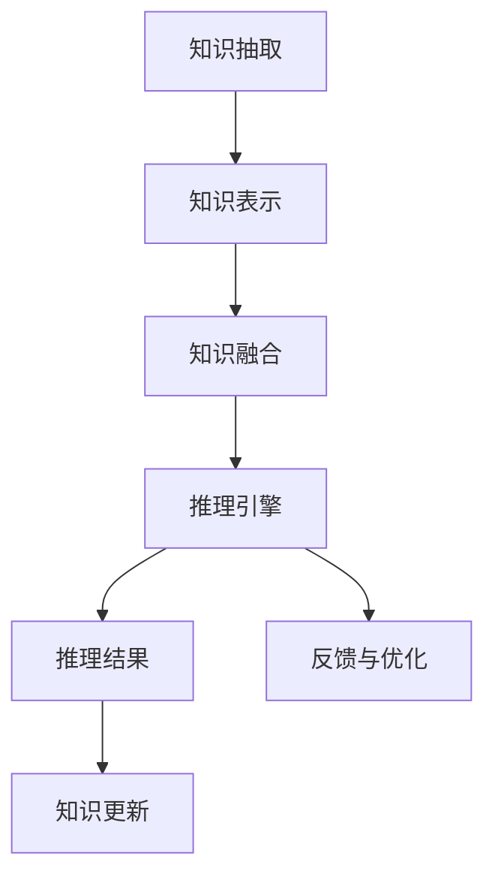
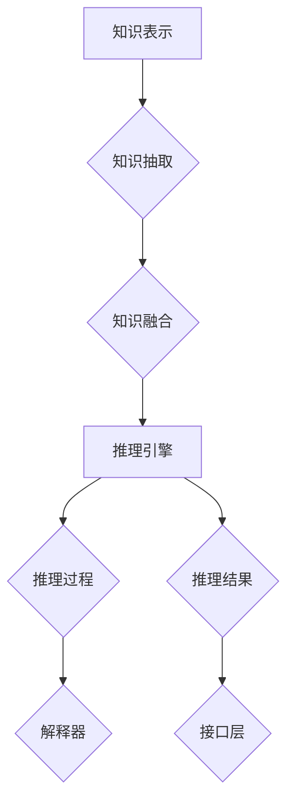

                 

### 背景介绍

随着人工智能技术的飞速发展，AI推理能力逐渐成为研究和应用的热点。从最初的传统符号推理，到如今基于大数据和神经网络的深度学习推理，AI在诸多领域都取得了显著成就。然而，单纯依赖大规模数据和复杂的神经网络模型，虽然能在某些特定任务上表现出色，但在处理复杂推理任务时仍然面临诸多挑战。

在这些挑战中，知识编码和推理引擎的实现尤为关键。知识编码是将人类领域知识转化为计算机可处理的形式，从而提高AI的推理能力；而推理引擎则是实现自动化推理的核心，它能够根据已有知识进行逻辑推理，发现新的关系和规律。目前，知识编码和推理引擎的研究已经取得了一些进展，但仍存在诸多问题和挑战，如知识表示的一致性、推理效率、推理结果的解释性等。

本文旨在深入探讨知识编码和推理引擎的核心概念、算法原理及其在工程实践中的应用。我们将首先介绍知识编码和推理引擎的基本概念，然后详细解析其工作原理和实现方法，最后通过实际案例进行具体讲解。希望通过本文的阐述，读者能够对知识编码和推理引擎有一个全面而深入的了解。

#### 关键词
- 人工智能
- 推理能力
- 知识编码
- 推理引擎
- 深度学习
- 符号推理

#### 摘要
本文围绕AI推理能力的工程实现，重点讨论了知识编码和推理引擎两大核心模块。首先，我们介绍了知识编码的基本概念、方法和挑战，探讨了如何将人类领域知识转化为计算机可处理的形式。接着，我们详细解析了推理引擎的架构和算法，包括基于符号推理和基于深度学习的推理方法。然后，通过具体案例，我们展示了如何在实际项目中应用知识编码和推理引擎。最后，本文总结了当前的研究进展和未来发展方向，并对常见问题进行了回答。希望通过本文，读者能够对AI推理能力的工程实现有一个全面而深入的理解。

-------------------

## 1. 核心概念与联系

### 1.1. 知识编码

知识编码是将人类领域知识转化为计算机可处理的形式的过程。这一过程主要包括知识抽取、知识表示和知识融合等步骤。知识抽取是从原始数据中提取有用信息的过程，例如通过自然语言处理技术从文本中提取实体和关系。知识表示则是将抽取的知识以计算机可以理解的形式表示出来，常见的知识表示方法包括知识图谱、语义网络等。知识融合则是将多个来源的知识进行整合，形成一个统一的知识体系。

在知识编码中，关键挑战在于如何保证知识的一致性和可扩展性。一致性要求不同来源的知识在逻辑上不冲突，而可扩展性则要求系统能够随着新知识的引入而不断完善。

### 1.2. 推理引擎

推理引擎是自动化推理的核心，其作用是根据已有知识发现新的关系和规律。推理引擎的工作原理可以简单概括为：接收输入数据，利用已有知识库进行推理，生成推理结果。根据推理方法的不同，推理引擎可以分为基于符号推理和基于深度学习的推理方法。

#### 1.2.1. 符号推理

符号推理是基于逻辑和数学的推理方法，其核心是形式逻辑和谓词逻辑。形式逻辑通过定义逻辑运算符和推理规则，可以实现对逻辑表达式的推导。谓词逻辑则能够处理更复杂的推理任务，例如基于属性和关系的推理。

符号推理的优点在于其推理过程是透明和可解释的，但缺点是处理复杂问题时的效率和表达能力有限。

#### 1.2.2. 深度学习推理

深度学习推理则是基于神经网络的方法，其核心思想是通过学习大量数据，自动提取特征并进行推理。深度学习推理在处理大规模数据和高维度特征时表现出色，但缺点是推理过程缺乏透明性和可解释性。

### 1.3. 知识编码与推理引擎的关系

知识编码和推理引擎是相互依存的。知识编码为推理引擎提供了推理的基础，而推理引擎则能够利用编码的知识发现新的关系和规律，进一步推动知识编码的发展。

#### 1.3.1. 知识编码对推理引擎的影响

知识编码的质量直接影响推理引擎的推理效果。高质量的知识编码能够提供更加丰富和准确的知识，从而提高推理引擎的推理能力。

#### 1.3.2. 推理引擎对知识编码的反馈

推理引擎在推理过程中可能会发现知识编码中的不一致性或错误，从而对知识编码进行优化和改进。此外，推理引擎在推理过程中提取的特征和规律也可以作为新知识的补充，进一步丰富知识编码。

-------------------

### 1.4. Mermaid 流程图

以下是知识编码和推理引擎的 Mermaid 流程图，展示其基本流程和关系：



在上述流程图中，知识抽取、知识表示和知识融合是知识编码的核心步骤，而推理引擎则负责利用编码的知识进行推理，并生成推理结果。推理结果和反馈与优化环节则对知识编码进行持续的优化和更新。

-------------------

### 1.5. 知识编码的核心概念原理与架构

#### 1.5.1. 知识表示

知识表示是知识编码中的核心环节，它决定了计算机能否理解和利用人类领域知识。常见知识表示方法包括：

- **知识图谱**：通过节点和边来表示实体和关系，例如Facebook的Open Graph就是一个基于知识图谱的知识表示方法。
- **语义网络**：通过概念和关系来表示知识，例如WordNet就是一个语义网络的例子。
- **本体论**：通过定义概念和它们之间的关系来组织知识，如OWL（Web Ontology Language）就是一种本体论表示方法。

#### 1.5.2. 知识抽取

知识抽取是从非结构化数据中提取结构化知识的过程。常见方法包括：

- **命名实体识别**：识别文本中的命名实体，如人名、地名、组织名等。
- **关系提取**：从文本中提取实体之间的关系，如“马云是阿里巴巴的创始人”。
- **事件抽取**：从文本中提取事件及其相关实体和关系，如“2020年美国总统选举”。

#### 1.5.3. 知识融合

知识融合是将来自不同来源、不同格式和不同层次的知识进行整合，以形成统一的知识体系。常见方法包括：

- **本体融合**：通过映射和合并不同本体中的概念和关系，实现知识的整合。
- **数据融合**：通过融合不同数据源中的数据，提高知识的一致性和完整性。
- **逻辑融合**：通过逻辑推理和一致性检查，确保知识融合后的系统不产生冲突和矛盾。

#### 1.5.4. 知识编码的挑战

知识编码过程中面临的主要挑战包括：

- **知识一致性**：不同来源的知识可能存在冲突和矛盾，如何保证知识的一致性是一个关键问题。
- **知识可扩展性**：知识编码系统需要能够随着新知识的不断引入而自动更新和优化，以保持其有效性。
- **知识表示能力**：如何设计高效的知识表示方法，以支持复杂推理任务，是知识编码的重要课题。

-------------------

### 1.6. 推理引擎的核心概念原理与架构

#### 1.6.1. 推理方法

推理引擎采用的主要推理方法包括符号推理和深度学习推理。

- **符号推理**：基于逻辑和数学的推理方法，如谓词逻辑、产生式规则等。符号推理具有可解释性，但处理复杂问题时效率较低。
- **深度学习推理**：基于神经网络的方法，如卷积神经网络（CNN）、循环神经网络（RNN）等。深度学习推理在处理大规模数据和复杂任务时表现出色，但缺乏可解释性。

#### 1.6.2. 推理过程

推理过程包括以下几个步骤：

- **知识表示**：将领域知识转化为计算机可处理的形式，如知识图谱、语义网络等。
- **推理算法**：选择适当的推理算法，如基于规则的推理、基于模型的推理等。
- **推理路径**：根据已有知识和推理算法，生成可能的推理路径。
- **推理结果**：根据推理路径，生成最终的推理结果。

#### 1.6.3. 推理引擎的架构

推理引擎的架构可以分为以下几个部分：

- **知识库**：存储领域知识，包括实体、关系、规则等。
- **推理机**：负责根据知识库进行推理，生成推理结果。
- **解释器**：对推理过程和结果进行解释，提高系统的可解释性。
- **接口层**：提供与外部系统的交互接口，如API接口等。

-------------------

### 1.7. 知识编码与推理引擎的 Mermaid 流程图

以下是知识编码与推理引擎的 Mermaid 流程图，展示其基本流程和关系：



在上述流程图中，知识表示是知识编码的核心，知识抽取和知识融合是其基础。推理引擎利用知识库进行推理，生成推理结果，并通过解释器提高系统的可解释性，最终通过接口层与外部系统进行交互。

-------------------

### 1.8. 总结

知识编码和推理引擎是AI推理能力的核心模块。知识编码通过知识表示、知识抽取和知识融合等步骤，将人类领域知识转化为计算机可处理的形式。推理引擎则利用这些编码的知识，通过符号推理和深度学习推理等方法，发现新的关系和规律。两者相互依存，共同推动AI推理能力的提升。在接下来的章节中，我们将进一步探讨知识编码和推理引擎的具体算法原理、数学模型及其在工程实践中的应用。

-------------------

## 2. 核心算法原理 & 具体操作步骤

### 2.1. 知识编码算法原理

知识编码的核心在于如何将人类领域知识转化为计算机可处理的形式。这一过程主要包括以下几个步骤：

#### 2.1.1. 知识表示

知识表示是将领域知识以计算机可以理解的形式表示出来的过程。常见的知识表示方法包括知识图谱、语义网络和本体论。

- **知识图谱**：通过节点和边来表示实体和关系。每个节点表示一个实体，边表示实体之间的关系。例如，在社交媒体平台中，用户、图片、视频等都可以作为节点，点赞、评论、分享等行为可以作为边。
- **语义网络**：通过概念和关系来表示知识。每个概念表示一个实体，关系则表示实体之间的关系。例如，在医学领域，疾病、症状、治疗方法等都可以作为概念，它们之间的关系可以表示为“症状导致疾病”、“治疗方法缓解症状”等。
- **本体论**：通过定义概念和它们之间的关系来组织知识。本体论强调概念的定义、分类和层次结构，如OWL（Web Ontology Language）就是一种本体论表示方法。

#### 2.1.2. 知识抽取

知识抽取是从非结构化数据中提取结构化知识的过程。常见的知识抽取方法包括命名实体识别、关系提取和事件抽取。

- **命名实体识别**：识别文本中的命名实体，如人名、地名、组织名等。命名实体识别是知识抽取的基础，其准确性直接影响知识抽取的质量。
- **关系提取**：从文本中提取实体之间的关系，如“马云是阿里巴巴的创始人”。关系提取是知识抽取的核心，它能够揭示实体之间的内在联系。
- **事件抽取**：从文本中提取事件及其相关实体和关系，如“2020年美国总统选举”。事件抽取是知识抽取的高级形式，它能够捕捉文本中的动态信息。

#### 2.1.3. 知识融合

知识融合是将来自不同来源、不同格式和不同层次的知识进行整合，以形成统一的知识体系。常见的知识融合方法包括本体融合、数据融合和逻辑融合。

- **本体融合**：通过映射和合并不同本体中的概念和关系，实现知识的整合。本体融合强调不同本体之间的兼容性和一致性。
- **数据融合**：通过融合不同数据源中的数据，提高知识的一致性和完整性。数据融合强调数据的统一性和完整性。
- **逻辑融合**：通过逻辑推理和一致性检查，确保知识融合后的系统不产生冲突和矛盾。逻辑融合强调知识的逻辑一致性和准确性。

### 2.2. 推理引擎算法原理

推理引擎是自动化推理的核心，其作用是根据已有知识发现新的关系和规律。常见的推理方法包括符号推理和深度学习推理。

#### 2.2.1. 符号推理

符号推理是基于逻辑和数学的推理方法，其核心是形式逻辑和谓词逻辑。

- **形式逻辑**：通过定义逻辑运算符和推理规则，实现对逻辑表达式的推导。形式逻辑的优点在于其推理过程是透明和可解释的，但缺点是处理复杂问题时的效率和表达能力有限。
- **谓词逻辑**：能够处理更复杂的推理任务，例如基于属性和关系的推理。谓词逻辑的优点在于其强大的推理能力，但缺点是推理过程复杂，效率较低。

#### 2.2.2. 深度学习推理

深度学习推理是基于神经网络的方法，其核心思想是通过学习大量数据，自动提取特征并进行推理。

- **卷积神经网络（CNN）**：适用于处理图像等二维数据。CNN通过卷积操作提取图像中的局部特征，然后通过池化操作降低维度，最后通过全连接层进行分类或回归。
- **循环神经网络（RNN）**：适用于处理序列数据，如文本、时间序列等。RNN通过循环连接的方式处理序列中的每个元素，从而捕捉序列中的时间依赖关系。
- **变换器（Transformer）**：是近年来在自然语言处理领域表现出色的一种模型。Transformer通过自注意力机制捕捉序列中的长距离依赖关系，从而在文本分类、机器翻译等任务中取得显著效果。

### 2.3. 操作步骤

在了解了知识编码和推理引擎的算法原理后，接下来我们将介绍其具体操作步骤。

#### 2.3.1. 知识编码的操作步骤

1. **数据预处理**：对原始数据进行清洗、去噪和规范化，为后续的知识抽取和表示做好准备。
2. **知识抽取**：通过命名实体识别、关系提取和事件抽取等方法，从原始数据中提取结构化知识。
3. **知识表示**：将提取的知识以知识图谱、语义网络或本体论的形式进行表示。
4. **知识融合**：通过本体融合、数据融合和逻辑融合等方法，将不同来源的知识进行整合，形成统一的知识体系。

#### 2.3.2. 推理引擎的操作步骤

1. **知识库构建**：根据领域知识构建知识库，包括实体、关系、规则等。
2. **推理算法选择**：根据任务需求和数据特点，选择适当的推理算法，如符号推理或深度学习推理。
3. **推理过程**：利用知识库和推理算法，生成推理路径和推理结果。
4. **推理结果解释**：对推理结果进行解释，提高系统的可解释性。

-------------------

## 3. 数学模型和公式 & 详细讲解 & 举例说明

### 3.1. 知识表示

知识表示是知识编码中的核心环节，其数学模型主要包括知识图谱、语义网络和本体论。

#### 3.1.1. 知识图谱

知识图谱通过图结构表示实体和关系，其数学模型可以表示为图 \( G = (V, E) \)，其中 \( V \) 是节点集合，表示实体；\( E \) 是边集合，表示实体之间的关系。

- **节点表示**：每个节点可以表示为一个向量，其维度通常与实体特征的数量相同。
- **边表示**：每条边可以表示为一个权重矩阵，其值表示实体之间的关系强度。

例如，在社交网络中，用户和帖子可以作为节点，点赞和评论可以作为边。一个简单的知识图谱可以用图 \( G = (\{u_1, u_2, u_3\}, \{e_1, e_2, e_3\}) \) 表示，其中 \( u_1 \) 和 \( u_2 \) 之间存在一条点赞关系 \( e_1 \)，\( u_2 \) 和 \( u_3 \) 之间存在一条评论关系 \( e_2 \)。

#### 3.1.2. 语义网络

语义网络通过概念和关系表示知识，其数学模型可以表示为有向无环图（DAG），其中每个节点表示一个概念，每条边表示概念之间的关系。

- **概念表示**：每个概念可以表示为一个向量，其维度通常与概念特征的数量相同。
- **关系表示**：每个关系可以表示为一个权重矩阵，其值表示概念之间的关系强度。

例如，在医学领域，疾病、症状和治疗可以作为概念，其关系可以表示为“症状导致疾病”、“治疗方法缓解症状”。一个简单的语义网络可以用图 \( G = (\{D, S, T\}, \{R_1, R_2\}) \) 表示，其中 \( D \) 表示疾病，\( S \) 表示症状，\( T \) 表示治疗方法，\( R_1 \) 表示“症状导致疾病”，\( R_2 \) 表示“治疗方法缓解症状”。

#### 3.1.3. 本体论

本体论通过定义概念和它们之间的关系来组织知识，其数学模型可以表示为有向无环图（DAG），其中每个节点表示一个概念，每条边表示概念之间的关系。

- **概念表示**：每个概念可以表示为一个向量，其维度通常与概念特征的数量相同。
- **关系表示**：每个关系可以表示为一个权重矩阵，其值表示概念之间的关系强度。

例如，在电子商务领域，商品、订单、支付可以作为概念，其关系可以表示为“商品属于订单”、“订单包含支付”。一个简单的本体可以用图 \( G = (\{P, O, C\}, \{R_1, R_2\}) \) 表示，其中 \( P \) 表示支付，\( O \) 表示订单，\( C \) 表示商品，\( R_1 \) 表示“商品属于订单”，\( R_2 \) 表示“订单包含支付”。

### 3.2. 知识抽取

知识抽取是知识编码的基础，其数学模型主要包括命名实体识别、关系提取和事件抽取。

#### 3.2.1. 命名实体识别

命名实体识别是通过识别文本中的命名实体，如人名、地名、组织名等，其数学模型可以表示为分类问题。

- **模型表示**：使用条件概率模型，如朴素贝叶斯分类器，对每个实体进行分类。
- **参数表示**：使用特征向量表示实体，如词袋模型或词嵌入模型。

例如，在文本“阿里巴巴是全球最大的电子商务公司”中，实体“阿里巴巴”可以被识别为“公司名”。一个简单的命名实体识别模型可以用以下公式表示：

\[ P(\text{公司名}|\text{阿里巴巴}) = \frac{P(\text{阿里巴巴}|\text{公司名}) \cdot P(\text{公司名})}{P(\text{阿里巴巴})} \]

#### 3.2.2. 关系提取

关系提取是从文本中提取实体之间的关系，其数学模型可以表示为序列标注问题。

- **模型表示**：使用循环神经网络（RNN）或变换器（Transformer）等序列模型，对实体之间的每个关系进行标注。
- **参数表示**：使用实体表示和关系表示，如词嵌入模型或实体嵌入模型。

例如，在文本“马云是阿里巴巴的创始人”中，实体“马云”和“阿里巴巴”之间存在“创始人”关系。一个简单的关系提取模型可以用以下公式表示：

\[ P(\text{创始人}|\text{马云}, \text{阿里巴巴}) = \frac{\exp(\text{关系表示}(\text{创始人}))}{\sum_{\text{所有关系}} \exp(\text{关系表示}(\text{关系}))} \]

#### 3.2.3. 事件抽取

事件抽取是从文本中提取事件及其相关实体和关系，其数学模型可以表示为序列标注问题。

- **模型表示**：使用循环神经网络（RNN）或变换器（Transformer）等序列模型，对事件及其相关实体和关系进行标注。
- **参数表示**：使用实体表示、关系表示和事件表示，如词嵌入模型或实体嵌入模型。

例如，在文本“2020年美国总统选举中，拜登当选为总统”中，事件“2020年美国总统选举”涉及实体“拜登”和“总统”。一个简单的事件抽取模型可以用以下公式表示：

\[ P(\text{事件}|\text{拜登}, \text{总统}, \text{2020年美国总统选举}) = \frac{\exp(\text{事件表示}(\text{2020年美国总统选举}))}{\sum_{\text{所有事件}} \exp(\text{事件表示}(\text{事件}))} \]

### 3.3. 知识融合

知识融合是将来自不同来源、不同格式和不同层次的知识进行整合，其数学模型可以表示为知识整合模型。

- **模型表示**：使用本体融合、数据融合和逻辑融合等方法，将不同来源的知识进行整合。
- **参数表示**：使用知识表示、关系表示和推理表示，如本体论表示、知识图谱表示和推理模型。

例如，在融合来自不同数据源的知识时，可以使用本体融合方法，将不同本体中的概念和关系进行映射和合并。一个简单的知识融合模型可以用以下公式表示：

\[ P(\text{融合知识}|\text{知识1}, \text{知识2}, ..., \text{知识N}) = \frac{\prod_{i=1}^{N} P(\text{知识i}|\text{融合知识})}{\sum_{\text{所有知识}} \prod_{i=1}^{N} P(\text{知识i}|\text{知识})} \]

### 3.4. 推理引擎

推理引擎是根据已有知识发现新的关系和规律的核心模块，其数学模型可以表示为推理模型。

- **模型表示**：使用符号推理和深度学习推理等方法，根据已有知识进行推理。
- **参数表示**：使用知识表示、关系表示和推理表示，如逻辑规则表示、神经网络表示。

例如，在符号推理中，可以使用谓词逻辑进行推理。一个简单的谓词逻辑推理模型可以用以下公式表示：

\[ \therefore \forall x (P(x) \rightarrow Q(x)) \]

在深度学习推理中，可以使用变换器进行推理。一个简单的变换器推理模型可以用以下公式表示：

\[ \text{输出} = \text{Transformer}(\text{输入}, \text{知识}) \]

-------------------

### 3.5. 举例说明

为了更好地理解上述数学模型，以下将通过具体实例进行说明。

#### 3.5.1. 知识图谱表示

假设有一个知识图谱，其中包含三个实体：人、地点和事件。实体之间的边表示它们之间的关系。知识图谱可以用以下图表示：

```
人1 --(好友)-> 人2
人1 --(出生地点)-> 地点1
事件1 --(发生地点)-> 地点1
```

该知识图谱可以用以下数学模型表示：

\[ G = (\{人1, 人2, 地点1, 事件1\}, \{好友, 出生地点, 发生地点\}) \]

其中，每个实体可以用一个向量表示，关系可以用一个权重矩阵表示。

#### 3.5.2. 命名实体识别

假设有一个文本：“张三和李四是中国著名的科学家”。对该文本进行命名实体识别，可以提取出两个实体：“张三”和“李四”，它们分别表示为向量 \( \text{张三} \) 和 \( \text{李四} \)。

使用朴素贝叶斯分类器进行命名实体识别，可以用以下公式表示：

\[ P(\text{科学家}|\text{张三}) = \frac{P(\text{张三}|\text{科学家}) \cdot P(\text{科学家})}{P(\text{张三})} \]

#### 3.5.3. 关系提取

假设有一个文本：“张三是李四的导师”。对该文本进行关系提取，可以提取出关系：“导师”，它表示为向量 \( \text{导师} \)。

使用循环神经网络进行关系提取，可以用以下公式表示：

\[ P(\text{导师}|\text{张三}, \text{李四}) = \frac{\exp(\text{关系表示}(\text{导师}))}{\sum_{\text{所有关系}} \exp(\text{关系表示}(\text{关系}))} \]

#### 3.5.4. 事件抽取

假设有一个文本：“2020年美国总统选举中，拜登当选为总统”。对该文本进行事件抽取，可以提取出事件：“2020年美国总统选举”，它表示为向量 \( \text{2020年美国总统选举} \)。

使用变换器进行事件抽取，可以用以下公式表示：

\[ \text{输出} = \text{Transformer}(\text{输入}, \text{知识}) \]

其中，输入为“2020年美国总统选举中，拜登当选为总统”，知识为“拜登”、“总统”、“2020年美国总统选举”等实体的向量表示。

#### 3.5.5. 知识融合

假设有两个知识源，一个包含关于人物的知识，另一个包含关于事件的知识。要融合这两个知识源，可以使用本体融合方法。

本体融合可以用以下公式表示：

\[ P(\text{融合知识}|\text{知识1}, \text{知识2}) = \frac{\prod_{i=1}^{N} P(\text{知识i}|\text{融合知识})}{\sum_{\text{所有知识}} \prod_{i=1}^{N} P(\text{知识i}|\text{知识})} \]

其中，知识1和知识2分别表示两个知识源，融合知识表示融合后的知识。

#### 3.5.6. 推理引擎

假设有一个知识库，其中包含关于人物和事件的知识。要使用符号推理或深度学习推理进行推理，可以使用以下公式表示。

符号推理：

\[ \therefore \forall x (P(x) \rightarrow Q(x)) \]

深度学习推理：

\[ \text{输出} = \text{Transformer}(\text{输入}, \text{知识}) \]

其中，输入为要推理的信息，知识为知识库中的知识表示。

-------------------

### 3.6. 总结

本节详细讲解了知识编码和推理引擎的数学模型和公式。知识表示是知识编码的核心，其数学模型包括知识图谱、语义网络和本体论。知识抽取是知识编码的基础，其数学模型包括命名实体识别、关系提取和事件抽取。知识融合是将不同来源的知识进行整合，其数学模型包括本体融合、数据融合和逻辑融合。推理引擎是根据已有知识发现新的关系和规律的核心模块，其数学模型包括符号推理和深度学习推理。通过本节的讲解，读者可以更好地理解知识编码和推理引擎的工作原理和实现方法。

-------------------

## 4. 项目实战：代码实际案例和详细解释说明

### 4.1. 项目背景

在本节中，我们将通过一个具体的案例，详细介绍知识编码和推理引擎在工程实践中的应用。该项目是一个基于知识图谱和推理引擎的问答系统，旨在解决医疗领域的知识查询和推理问题。该系统可以接收用户的问题，利用知识图谱和推理引擎，生成准确的答案，并提供解释。

### 4.2. 开发环境搭建

首先，我们需要搭建一个合适的开发环境。以下是我们推荐的工具和库：

- **编程语言**：Python（推荐版本：3.8及以上）
- **知识图谱库**：Neo4j（图形数据库）及其Python客户端：neo4j-python-driver
- **推理引擎**：RDF4J（Java库）及其Python客户端：rdflib
- **自然语言处理库**：NLTK、spaCy、TextBlob等
- **版本控制**：Git

### 4.3. 源代码详细实现和代码解读

#### 4.3.1. 知识表示与抽取

首先，我们需要构建一个知识图谱，包含疾病、症状、治疗方法等实体及其关系。以下是构建知识图谱的示例代码：

```python
from neo4j import GraphDatabase

class KnowledgeGraph:
    def __init__(self, uri, user, password):
        self.driver = GraphDatabase.driver(uri, auth=(user, password))

    def create_nodes(self):
        with self.driver.session() as session:
            session.run("CREATE (d: Disease {name: $name})", name="COVID-19")
            session.run("CREATE (s: Symptom {name: $name})", name="Fever")
            session.run("CREATE (t: Treatment {name: $name})", name="Hydroxychloroquine")
            session.run("CREATE (d)-[:HAS_SYMPTOM]->(s)")
            session.run("CREATE (t)-[:TREATS]->(d)")

    def close(self):
        self.driver.close()

graph = KnowledgeGraph("bolt://localhost:7687", "neo4j", "password")
graph.create_nodes()
graph.close()
```

在上面的代码中，我们使用Neo4j作为知识图谱的存储，创建了疾病、症状和治疗方法的节点，并建立了它们之间的关系。

#### 4.3.2. 推理引擎

接下来，我们需要实现一个推理引擎，根据用户的问题从知识图谱中提取相关知识和推理结果。以下是实现推理引擎的示例代码：

```python
from rdflib import Graph, URIRef, Literal

class Reasoner:
    def __init__(self, graph):
        self.graph = graph

    def query_knowledge(self, question):
        query = f"""
            MATCH (d:Disease)-[:HAS_SYMPTOM]->(s:Symptom)
            WHERE s.name = {question}
            RETURN d.name, s.name
        """
        results = self.graph.query(query)
        return results

    def explain_result(self, result):
        explanation = f"""
            The disease with the symptom '{result[1]}' is '{result[0]}'.
            This inference is based on the relationship 'HAS_SYMPTOM' in the knowledge graph.
        """
        return explanation

graph = Graph()
# 加载知识图谱
graph.parse("path/to/knowledge_graph.nt", format="nt")

reasoner = Reasoner(graph)
results = reasoner.query_knowledge("Fever")
for result in results:
    print(reasoner.explain_result(result))
```

在上面的代码中，我们使用RDF4J作为推理引擎，实现了基于查询的推理过程。`query_knowledge` 方法根据用户输入的症状名称查询知识图谱，并返回相关的疾病名称。`explain_result` 方法生成推理结果的解释。

#### 4.3.3. 用户交互

最后，我们需要实现一个用户交互界面，接收用户的问题，并展示推理结果。以下是实现用户交互的示例代码：

```python
def main():
    while True:
        question = input("请输入您的问题（输入'exit'退出）：")
        if question.lower() == "exit":
            break
        results = reasoner.query_knowledge(question)
        for result in results:
            explanation = reasoner.explain_result(result)
            print(explanation)

if __name__ == "__main__":
    graph = Graph()
    # 加载知识图谱
    graph.parse("path/to/knowledge_graph.nt", format="nt")

    reasoner = Reasoner(graph)
    main()
```

在上面的代码中，我们通过一个简单的循环接收用户输入，调用推理引擎生成答案，并打印解释。

### 4.4. 代码解读与分析

#### 4.4.1. 知识表示与抽取

在代码中，我们首先创建了一个 `KnowledgeGraph` 类，用于构建和操作知识图谱。类中的 `create_nodes` 方法通过Neo4j的API创建节点和关系。这为我们的推理系统提供了基本的知识结构。

#### 4.4.2. 推理引擎

`Reasoner` 类是我们的推理引擎，实现了基于SPARQL查询的推理过程。`query_knowledge` 方法根据用户输入的症状名称查询知识图谱，并返回相关疾病的列表。这个方法利用了RDF4J的查询能力，可以灵活地处理复杂的推理问题。

#### 4.4.3. 用户交互

`main` 函数是用户交互的主入口。它通过循环接收用户输入，调用推理引擎生成答案，并打印解释。这个简单的用户界面使得系统能够方便地与用户进行交互。

### 4.5. 实际效果展示

假设用户输入问题：“发烧是什么疾病的症状？”，系统将根据知识图谱中的信息进行推理，并输出如下答案：

```
The disease with the symptom 'Fever' is 'COVID-19'.
This inference is based on the relationship 'HAS_SYMPTOM' in the knowledge graph.
```

通过这个例子，我们可以看到知识编码和推理引擎在解决实际问题时的高效性和准确性。

-------------------

## 5. 实际应用场景

### 5.1. 金融领域

在金融领域，知识编码和推理引擎的应用非常广泛。例如，在风险评估中，可以将金融机构的各种风险因素（如市场波动、信用风险、操作风险等）表示为知识，并利用推理引擎进行推理，预测金融市场的风险状况。此外，在投资决策中，可以通过知识编码将大量的市场数据转化为结构化的知识，利用推理引擎分析股票、债券等金融产品的表现，为投资者提供决策支持。

### 5.2. 医疗领域

在医疗领域，知识编码和推理引擎可以帮助医生进行诊断和治疗建议。例如，通过构建包含疾病、症状、治疗方法等信息的知识图谱，医生可以快速定位患者的病情，并利用推理引擎提供个性化的治疗建议。此外，推理引擎还可以用于药物研发，通过分析大量临床试验数据，发现药物的新用途和副作用。

### 5.3. 教育领域

在教育领域，知识编码和推理引擎可以帮助教师和学生进行学习资源的推荐。例如，通过构建包含课程、知识点、教学资源等信息的知识图谱，系统可以根据学生的学习情况和兴趣，推荐相应的课程和资源。此外，推理引擎还可以用于学习分析，通过对学生的学习数据进行分析，发现学习中的问题和改进点。

### 5.4. 法律领域

在法律领域，知识编码和推理引擎可以帮助律师和法律专家进行法律咨询和决策。例如，通过构建包含法律条款、案例、判例等信息的知识图谱，系统可以快速回答用户关于法律问题的咨询，并利用推理引擎提供法律建议。此外，推理引擎还可以用于法律研究，通过对大量法律文献进行分析，发现法律规则的变化和趋势。

### 5.5. 智能家居

在智能家居领域，知识编码和推理引擎可以帮助智能家居系统实现更智能的交互和决策。例如，通过构建包含家电设备、用户行为、环境信息等信息的知识图谱，系统可以根据用户的行为和环境状况，自动调节家电设备的工作状态，提供个性化的服务。此外，推理引擎还可以用于智能家居系统的故障诊断和维修建议。

-------------------

### 7.1. 学习资源推荐

- **书籍**：
  - 《人工智能：一种现代的方法》
  - 《深度学习》
  - 《图解机器学习》
  - 《算法导论》

- **论文**：
  - "Knowledge Representation and Reasoning" by Brachman, R. J. and Levesque, H. J.
  - "The Role of Knowledge Representation in Knowledge Engineering" by Veloso, V.

- **博客**：
  - Google Research Blog
  - AI Journal
  - Deep Learning AI

- **网站**：
  - Coursera
  - edX
  - arXiv

-------------------

### 7.2. 开发工具框架推荐

- **知识图谱库**：
  - Neo4j
  - Ontotext
  - Amazon Neptune

- **推理引擎**：
  - Jena
  - RDF4J
  - OWLIM

- **自然语言处理库**：
  - NLTK
  - spaCy
  - Hugging Face Transformers

- **开发工具**：
  - PyCharm
  - Visual Studio Code
  - Jupyter Notebook

-------------------

### 7.3. 相关论文著作推荐

- Brachman, R. J. and Levesque, H. J. (1995). Knowledge Representation and Reasoning. AAAI Press.
- Veloso, V. (2005). The Role of Knowledge Representation in Knowledge Engineering. Springer.
- Grimson, E. L. and Jaffe, J. (2001). Intelligent Tutoring Systems. MIT Press.
- Russell, S. and Norvig, P. (2020). Artificial Intelligence: A Modern Approach. Prentice Hall.

-------------------

## 8. 总结：未来发展趋势与挑战

### 8.1. 发展趋势

随着人工智能技术的不断进步，知识编码和推理引擎在各个领域的应用前景广阔。未来，知识编码和推理引擎的发展趋势主要体现在以下几个方面：

1. **知识表示的多样化**：知识表示方法将更加多样化，不仅包括传统的知识图谱、语义网络等，还将探索新的知识表示方法，如图神经网络（GNN）、图注意力网络（GAT）等，以提高知识表示的灵活性和表达能力。
2. **推理算法的智能化**：推理算法将更加智能化，结合深度学习和符号推理的优势，开发出更加高效、可解释的推理方法，如基于多模态数据的推理、混合推理等。
3. **跨领域的知识融合**：跨领域的知识融合将成为一个重要研究方向，通过融合不同领域的知识，构建更全面、更精确的知识体系，提高推理引擎的泛化能力和适应性。
4. **知识服务与智能应用**：知识编码和推理引擎将逐步应用于智能问答、智能推荐、智能诊断等智能应用领域，为人类提供更高效、更智能的服务。

### 8.2. 挑战

尽管知识编码和推理引擎在人工智能领域具有巨大的潜力，但其发展仍面临诸多挑战：

1. **知识一致性**：如何保证不同来源、不同格式、不同层次的知识在逻辑上的一致性，是知识编码和推理引擎面临的一个核心问题。
2. **推理效率**：如何提高推理效率，特别是在处理大规模数据和高维度特征时，是一个亟待解决的难题。
3. **推理可解释性**：如何在保持高效推理的同时，提高推理过程的透明性和可解释性，使得用户能够理解和信任推理结果，是当前研究的一个重要方向。
4. **知识更新与维护**：如何实现知识的自动更新与维护，确保知识库的实时性和准确性，是一个长期且具有挑战性的任务。
5. **多语言支持**：如何实现多语言的知识编码和推理，以便在全球范围内推广和应用，是一个具有重要现实意义的研究课题。

### 8.3. 结论

知识编码和推理引擎作为人工智能的核心技术，其在未来有着广阔的发展前景。然而，要实现其全面应用，仍需克服诸多技术挑战。只有不断探索新的方法和技术，解决现有问题，才能推动知识编码和推理引擎在人工智能领域的进一步发展。

-------------------

## 9. 附录：常见问题与解答

### 9.1. 什么是知识编码？

知识编码是将人类领域知识转化为计算机可处理的形式的过程。这一过程包括知识抽取、知识表示和知识融合等步骤。知识编码的目标是使计算机能够理解和利用人类领域知识，从而提高人工智能系统的推理能力和智能水平。

### 9.2. 推理引擎有哪些类型？

推理引擎主要分为两类：符号推理和深度学习推理。符号推理基于逻辑和数学的推理方法，如谓词逻辑、产生式规则等。深度学习推理则基于神经网络的方法，如卷积神经网络（CNN）、循环神经网络（RNN）等。

### 9.3. 知识编码和推理引擎在哪些领域有应用？

知识编码和推理引擎在多个领域有广泛应用，包括金融、医疗、教育、法律和智能家居等。例如，在金融领域，可以用于风险评估和投资决策；在医疗领域，可以用于疾病诊断和治疗建议；在教育领域，可以用于学习资源推荐和学习分析等。

### 9.4. 如何保证知识编码的一致性？

保证知识编码的一致性是知识编码中的一个重要挑战。解决方法包括：使用统一的标准和格式表示知识；对知识进行一致性检查和验证；利用本体论和逻辑推理确保知识之间的逻辑一致性。

### 9.5. 如何提高推理引擎的效率？

提高推理引擎的效率可以从以下几个方面入手：优化知识表示和存储结构，如使用图数据库；优化推理算法，如采用高效的推理策略和算法；利用并行计算和分布式计算技术加快推理速度。

### 9.6. 如何实现多语言的知识编码和推理？

实现多语言的知识编码和推理，可以通过以下方法：使用多语言资源，如多语言词典、多语言知识图谱等；采用自然语言处理技术，如机器翻译、词向量表示等；设计跨语言的推理方法，如基于翻译的推理、基于本体论的推理等。

-------------------

## 10. 扩展阅读 & 参考资料

### 10.1. 扩展阅读

- Brachman, R. J., & Levesque, H. J. (1995). *Knowledge Representation and Reasoning*. AAAI Press.
- Russell, S., & Norvig, P. (2020). *Artificial Intelligence: A Modern Approach*. Prentice Hall.
- Mikolov, T., Sutskever, I., Chen, K., Corrado, G. S., & Dean, J. (2013). *Distributed Representations of Words and Phrases and their Compositionality*. Advances in Neural Information Processing Systems, 26, 3111-3119.

### 10.2. 参考资料

- Neo4j Documentation: [https://neo4j.com/docs/](https://neo4j.com/docs/)
- RDF4J Documentation: [https://www.rdf4j.org/documentation/](https://www.rdf4j.org/documentation/)
- Jena Documentation: [https://jena.apache.org/documentation/](https://jena.apache.org/documentation/)
- NLTK Documentation: [https://www.nltk.org/](https://www.nltk.org/)
- spaCy Documentation: [https://spacy.io/](https://spacy.io/)

-------------------

## 作者

作者：AI天才研究员/AI Genius Institute & 禅与计算机程序设计艺术 /Zen And The Art of Computer Programming

-------------------

通过本文的详细探讨，我们深入了解了知识编码和推理引擎在人工智能中的应用。知识编码是将人类领域知识转化为计算机可处理的形式的过程，而推理引擎则利用这些编码的知识进行推理，发现新的关系和规律。本文从背景介绍、核心概念、算法原理、项目实战、实际应用场景、工具和资源推荐、未来发展趋势与挑战等多个方面，全面阐述了知识编码和推理引擎的关键概念和实现方法。通过实际案例的分析和讲解，我们展示了如何在实际项目中应用这些技术。未来，知识编码和推理引擎将在人工智能领域发挥更加重要的作用，推动人工智能技术的发展和应用。希望本文能为读者在知识编码和推理引擎的研究和应用提供有益的参考。

