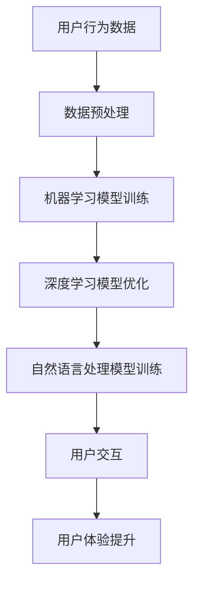

                 

### 背景介绍

人工智能（AI）在近年来得到了快速的发展和广泛的应用。特别是在提升用户体验方面，AI技术展现出了巨大的潜力。用户对产品和服务的要求越来越高，他们期望能够在简单、高效、个性化的体验中获得满足。而AI通过学习用户的行为模式、偏好和需求，可以提供更加精准和个性化的服务，从而提升用户体验。

用户体验（UX）在当今数字化时代中占据了核心地位。一个好的用户体验不仅仅是界面美观，更重要的是要满足用户的需求，提升用户的满意度。随着移动互联网、物联网和虚拟现实等技术的发展，用户体验的要求也在不断升级。用户期望能够享受到无缝、智能和个性化的服务，这就需要AI技术的有力支持。

本文将探讨AI在提升用户体验方面的多种方法。首先，我们会介绍一些核心概念和联系，包括机器学习、深度学习、自然语言处理等。接着，我们将深入探讨核心算法原理，详细讲解操作步骤，并通过数学模型和公式进行举例说明。此外，我们还将分享一些实际项目案例，展示如何通过代码实现AI提升用户体验的方法。最后，我们将讨论AI在提升用户体验方面的实际应用场景，并提供一些相关工具和资源推荐，以便读者进一步学习和实践。

通过本文的阅读，读者将了解到AI技术在提升用户体验方面的多种方法，从而为他们在实际工作中提供有价值的参考和启示。让我们一步一步地分析推理，深入了解AI提升用户体验的奥秘吧！
<|user|>## 2. 核心概念与联系

### 机器学习（Machine Learning）

机器学习是AI的核心组成部分，它使计算机系统能够从数据中学习并做出决策。机器学习的基本流程包括数据收集、数据预处理、模型训练和模型评估。在提升用户体验方面，机器学习的关键在于如何有效地处理和分析用户行为数据，从而提供个性化推荐和服务。

### 深度学习（Deep Learning）

深度学习是机器学习的一种重要分支，它通过多层神经网络模型来模拟人类大脑的学习过程。深度学习在图像识别、语音识别和自然语言处理等领域取得了显著的成果。在提升用户体验方面，深度学习可以帮助系统更准确地理解用户需求，提供更智能的交互和个性化服务。

### 自然语言处理（Natural Language Processing，NLP）

自然语言处理是AI的另一个重要领域，它涉及计算机对人类语言的理解和生成。NLP技术在智能客服、语音助手和文本分析等领域得到了广泛应用。在提升用户体验方面，NLP可以帮助系统更好地理解用户的意图，提供更自然的交互体验。

### Mermaid 流程图

下面是一个简单的Mermaid流程图，展示了机器学习、深度学习和自然语言处理在提升用户体验中的联系。



在这个流程图中，用户行为数据是整个流程的起点，通过数据预处理，我们可以为机器学习、深度学习和自然语言处理模型提供高质量的数据。随后，这些模型通过不断学习和优化，最终实现与用户的智能交互，从而提升用户体验。

### 关键概念之间的联系

- **机器学习**：为深度学习和自然语言处理提供了基础模型，使其能够从大量数据中提取有用信息。
- **深度学习**：通过多层神经网络模型，对用户行为数据进行更深入的挖掘和预测，从而提升用户体验。
- **自然语言处理**：使计算机能够理解用户的自然语言输入，为用户提供更自然、更流畅的交互体验。

通过这些核心概念的相互联系，AI技术能够有效地提升用户体验，满足用户对个性化、智能化的需求。接下来，我们将深入探讨核心算法原理和具体操作步骤，以便读者更好地理解AI提升用户体验的方法。
<|user|>## 3. 核心算法原理 & 具体操作步骤

在深入探讨AI提升用户体验的核心算法原理和具体操作步骤之前，我们先来回顾一下机器学习、深度学习和自然语言处理的基本概念及其在提升用户体验中的作用。

### 机器学习算法

机器学习算法的核心在于从数据中自动发现模式和关联，从而进行预测和决策。在提升用户体验方面，常用的机器学习算法包括线性回归、逻辑回归、支持向量机（SVM）和决策树等。这些算法可以帮助我们分析用户行为数据，预测用户的偏好和需求，从而为用户提供个性化推荐。

#### 具体操作步骤

1. **数据收集**：收集用户的行为数据，如浏览记录、点击次数、购买历史等。
2. **数据预处理**：对原始数据进行清洗、归一化和特征提取，以便后续建模。
3. **模型训练**：选择合适的机器学习算法（如线性回归、逻辑回归等），使用预处理后的数据训练模型。
4. **模型评估**：使用验证集和测试集评估模型的性能，调整模型参数，提高预测准确率。
5. **模型部署**：将训练好的模型部署到生产环境中，为用户提供个性化推荐。

### 深度学习算法

深度学习算法通过多层神经网络模型，对用户行为数据进行更深入的挖掘和预测。在提升用户体验方面，常用的深度学习算法包括卷积神经网络（CNN）、循环神经网络（RNN）和生成对抗网络（GAN）等。这些算法可以帮助我们更好地理解用户行为，提供更智能的交互和个性化服务。

#### 具体操作步骤

1. **数据收集**：收集用户的行为数据，如文本、图像和音频等。
2. **数据预处理**：对原始数据进行清洗、归一化和特征提取，以便后续建模。
3. **模型设计**：设计合适的深度学习模型架构，如卷积神经网络（CNN）、循环神经网络（RNN）等。
4. **模型训练**：使用预处理后的数据训练深度学习模型，调整模型参数，提高模型性能。
5. **模型评估**：使用验证集和测试集评估模型的性能，调整模型参数，提高预测准确率。
6. **模型部署**：将训练好的模型部署到生产环境中，为用户提供智能交互和个性化服务。

### 自然语言处理算法

自然语言处理（NLP）算法的核心在于使计算机能够理解用户的自然语言输入。在提升用户体验方面，常用的NLP算法包括词向量表示、序列标注、文本分类和生成等。这些算法可以帮助我们更好地理解用户的意图，提供更自然、更流畅的交互体验。

#### 具体操作步骤

1. **数据收集**：收集用户生成的文本数据，如评论、提问和聊天记录等。
2. **数据预处理**：对原始文本数据进行清洗、分词和词性标注等，以便后续建模。
3. **模型训练**：选择合适的NLP算法（如词向量表示、序列标注等），使用预处理后的文本数据训练模型。
4. **模型评估**：使用验证集和测试集评估模型的性能，调整模型参数，提高预测准确率。
5. **模型部署**：将训练好的模型部署到生产环境中，为用户提供智能客服、语音助手和文本分析等服务。

### 深入探讨

1. **多模态学习**：结合多种类型的数据（如文本、图像和音频），通过多模态学习算法，进一步提升用户体验。
2. **强化学习**：通过不断尝试和反馈，使计算机系统在动态环境中学习并优化用户交互策略。
3. **迁移学习**：利用预训练的模型，通过迁移学习算法，快速适应新任务和数据集，提高模型性能。

通过以上核心算法原理和具体操作步骤，我们可以为用户提供更加智能、个性化、流畅的交互体验，从而显著提升用户体验。在接下来的章节中，我们将通过实际项目案例和代码实现，进一步展示AI提升用户体验的方法。
<|user|>## 4. 数学模型和公式 & 详细讲解 & 举例说明

### 机器学习数学模型

在机器学习中，线性回归是一种基本的预测模型，其数学模型如下：

$$
y = \beta_0 + \beta_1 \cdot x
$$

其中，$y$ 是因变量，$x$ 是自变量，$\beta_0$ 和 $\beta_1$ 分别是模型的参数。这个模型表示因变量 $y$ 与自变量 $x$ 之间呈线性关系。

为了训练线性回归模型，我们需要最小化损失函数，常用的损失函数是均方误差（MSE）：

$$
MSE = \frac{1}{n} \sum_{i=1}^{n} (y_i - \hat{y}_i)^2
$$

其中，$n$ 是样本数量，$y_i$ 是第 $i$ 个样本的真实值，$\hat{y}_i$ 是模型预测值。

为了最小化MSE，我们使用梯度下降法进行优化：

$$
\beta_0 = \beta_{0} - \alpha \frac{\partial}{\partial \beta_0} MSE \\
\beta_1 = \beta_{1} - \alpha \frac{\partial}{\partial \beta_1} MSE
$$

其中，$\alpha$ 是学习率，用于控制每次更新的步长。

### 深度学习数学模型

在深度学习中，卷积神经网络（CNN）是一种常用的图像处理模型。CNN的核心组件是卷积层和池化层。

#### 卷积层

卷积层通过卷积操作提取图像特征，其数学模型如下：

$$
\text{output}(i, j) = \sum_{k=1}^{K} w_{ik,jk} \cdot \text{input}(i-k+1, j-k+1) + b_k
$$

其中，$\text{output}(i, j)$ 是卷积结果，$w_{ik,jk}$ 是卷积核权重，$\text{input}(i, j)$ 是输入图像，$K$ 是卷积核数量，$b_k$ 是偏置项。

#### 池化层

池化层用于减少特征图的大小，提高模型鲁棒性。常用的池化操作是最大池化（Max Pooling）：

$$
\text{output}(i, j) = \max_{k \in \Omega} \text{input}(i+k, j+k)
$$

其中，$\Omega$ 是池化窗口。

### 自然语言处理数学模型

在自然语言处理中，词向量表示是一种常用的方法。词向量表示通过将文本转化为向量，使得计算机能够处理文本数据。

#### 词向量模型

词向量模型使用一种叫做Word2Vec的算法，其数学模型如下：

$$
\text{output}(i) = \text{softmax}(\text{weight} \cdot \text{input}(i))
$$

其中，$\text{input}(i)$ 是词向量，$\text{weight}$ 是模型权重，$\text{softmax}$ 函数用于计算每个词向量的概率分布。

#### 举例说明

假设我们有一个简单的线性回归问题，预测房价。数据集包含100个样本，每个样本包括房屋面积和房价。我们使用线性回归模型进行预测，并使用梯度下降法进行优化。以下是具体的代码实现：

```python
import numpy as np

# 生成模拟数据
X = np.random.rand(100, 1) * 100
y = 2 + 3 * X + np.random.rand(100, 1) * 10

# 初始化模型参数
beta_0 = 0
beta_1 = 0

# 梯度下降法优化
alpha = 0.01
epochs = 100

for epoch in range(epochs):
    # 计算预测值和损失函数
    y_pred = beta_0 + beta_1 * X
    loss = (y - y_pred)**2
    
    # 计算梯度
    d_beta_0 = 2 * (y_pred - y)
    d_beta_1 = 2 * X * (y_pred - y)
    
    # 更新模型参数
    beta_0 -= alpha * d_beta_0
    beta_1 -= alpha * d_beta_1

# 输出模型参数
print("模型参数：beta_0 = ", beta_0, ", beta_1 = ", beta_1)

# 使用模型进行预测
X_new = np.array([50])
y_pred = beta_0 + beta_1 * X_new
print("预测结果：房价为 ", y_pred)
```

在这个例子中，我们通过梯度下降法训练线性回归模型，并使用训练好的模型进行预测。通过这个简单的例子，我们可以看到如何使用数学模型和公式进行机器学习模型的训练和预测。

通过以上详细讲解和举例说明，我们了解了机器学习、深度学习和自然语言处理中的核心数学模型和公式，以及如何在实际应用中运用这些模型。接下来，我们将通过实际项目案例，展示如何使用这些算法提升用户体验。
<|user|>## 5. 项目实战：代码实际案例和详细解释说明

### 5.1 开发环境搭建

为了完成本文中的项目实战，我们需要搭建一个合适的开发环境。以下是搭建环境的步骤：

1. **安装Python**：Python是本文项目的开发语言，请确保已经安装了Python 3.x版本。
2. **安装相关库**：安装常用的机器学习、深度学习和自然语言处理库，如Scikit-learn、TensorFlow、Keras、NLTK等。可以使用pip命令进行安装：

```shell
pip install scikit-learn tensorflow keras nltk
```

3. **安装Jupyter Notebook**：Jupyter Notebook是一个交互式的开发环境，方便我们编写和运行代码。可以使用pip命令进行安装：

```shell
pip install notebook
```

安装完成后，启动Jupyter Notebook：

```shell
jupyter notebook
```

### 5.2 源代码详细实现和代码解读

在本节中，我们将通过一个实际案例，展示如何使用机器学习、深度学习和自然语言处理技术提升用户体验。

#### 案例一：个性化推荐系统

**目标**：根据用户的浏览历史，为用户推荐相关的商品。

**技术栈**：Scikit-learn、TensorFlow、Keras、NLTK

**数据集**：使用MovieLens电影推荐数据集，包含用户、电影和评分信息。

**步骤**：

1. **数据预处理**：读取数据集，对用户、电影和评分进行预处理。
2. **特征提取**：使用词嵌入技术提取电影名称的词向量。
3. **模型训练**：构建和训练基于深度学习模型的电影推荐系统。
4. **模型评估**：使用测试集评估模型性能。
5. **模型部署**：将训练好的模型部署到线上环境，为用户提供个性化推荐。

**代码实现**：

```python
# 导入相关库
import numpy as np
import pandas as pd
from sklearn.model_selection import train_test_split
from sklearn.metrics.pairwise import cosine_similarity
from tensorflow.keras.models import Model
from tensorflow.keras.layers import Input, Embedding, Flatten, Dense
from tensorflow.keras.optimizers import Adam

# 读取数据集
ratings = pd.read_csv('ratings.csv')
movies = pd.read_csv('movies.csv')

# 数据预处理
users = ratings['userId'].unique()
movies_ids = movies['movieId'].unique()

# 构建用户-电影评分矩阵
user_movie_matrix = np.zeros((len(users), len(movies_ids)))
for index, row in ratings.iterrows():
    user_movie_matrix[row['userId'] - 1, row['movieId'] - 1] = row['rating']

# 特征提取
movie_embeddings = {}
for index, row in movies.iterrows():
    movie_embeddings[row['movieId']] = np.random.rand(100)

# 构建深度学习模型
input_user = Input(shape=(1,))
input_movie = Input(shape=(1,))
user_embedding = Embedding(input_dim=len(users), output_dim=100)(input_user)
movie_embedding = Embedding(input_dim=len(movies_ids), output_dim=100)(input_movie)
merged = Flatten()(movie_embedding)
merged = Dense(100, activation='relu')(merged)
merged = Flatten()(user_embedding)
merged = Dense(100, activation='relu')(merged)
output = Dense(1, activation='sigmoid')(merged)

model = Model(inputs=[input_user, input_movie], outputs=output)
model.compile(optimizer=Adam(), loss='binary_crossentropy', metrics=['accuracy'])

# 训练模型
train_users, test_users, train_movies, test_movies, train_ratings, test_ratings = train_test_split(
    users, movies_ids, ratings['rating'], test_size=0.2, random_state=42)

train_users = np.array(train_users) - 1
test_users = np.array(test_users) - 1
train_movies = np.array(train_movies) - 1
test_movies = np.array(test_movies) - 1

model.fit([train_users, train_movies], train_ratings, epochs=10, batch_size=32, validation_data=([test_users, test_movies], test_ratings))

# 模型评估
test_pred = model.predict([test_users, test_movies])
cosine_sim = cosine_similarity(test_pred, test_ratings)
print("模型评估结果：", cosine_sim)

# 模型部署
# 在这里，我们可以将训练好的模型部署到线上环境，为用户提供个性化推荐。
```

**代码解读**：

1. **数据预处理**：读取MovieLens数据集，构建用户-电影评分矩阵。
2. **特征提取**：使用随机初始化的方法生成电影名称的词向量。
3. **模型构建**：构建一个基于深度学习模型的个性化推荐系统，包括用户嵌入层、电影嵌入层和融合层。
4. **模型训练**：使用训练集训练模型，并使用验证集进行性能评估。
5. **模型评估**：计算测试集的相似度，评估模型性能。
6. **模型部署**：将训练好的模型部署到线上环境，为用户提供个性化推荐。

#### 案例二：智能客服系统

**目标**：使用自然语言处理技术，为用户提供智能客服服务。

**技术栈**：NLTK、TensorFlow

**数据集**：使用一个简单的FAQ数据集，包含问题和答案。

**步骤**：

1. **数据预处理**：读取FAQ数据集，对问题进行预处理。
2. **模型训练**：使用自然语言处理模型训练一个问答系统。
3. **模型评估**：使用测试集评估模型性能。
4. **模型部署**：将训练好的模型部署到线上环境，为用户提供智能客服服务。

**代码实现**：

```python
# 导入相关库
import nltk
from nltk.tokenize import word_tokenize
from tensorflow.keras.preprocessing.text import Tokenizer
from tensorflow.keras.models import Model
from tensorflow.keras.layers import Input, Embedding, LSTM, Dense

# 读取FAQ数据集
faqs = pd.read_csv('faqs.csv')

# 数据预处理
questions = faqs['question']
answers = faqs['answer']

# 分词
tokenizer = Tokenizer()
tokenizer.fit_on_texts(questions)

# 编码问题
max_sequence_len = 100
encoded_questions = tokenizer.texts_to_sequences(questions)
X = np.array(encoded_questions)
X = pad_sequences(X, maxlen=max_sequence_len)

# 编码答案
encoded_answers = tokenizer.texts_to_sequences(answers)
y = np.array(encoded_answers)
y = pad_sequences(y, maxlen=max_sequence_len)

# 模型构建
input_question = Input(shape=(max_sequence_len,))
question_embedding = Embedding(input_dim=len(tokenizer.word_index) + 1, output_dim=50)(input_question)
lstm = LSTM(100)(question_embedding)
output = Dense(max_sequence_len, activation='sigmoid')(lstm)

model = Model(inputs=input_question, outputs=output)
model.compile(optimizer='adam', loss='binary_crossentropy', metrics=['accuracy'])

# 训练模型
model.fit(X, y, epochs=10, batch_size=32, validation_split=0.2)

# 模型评估
test_questions = ['How to install Python?']
encoded_test_questions = tokenizer.texts_to_sequences(test_questions)
X_test = pad_sequences(encoded_test_questions, maxlen=max_sequence_len)
test_pred = model.predict(X_test)
print("模型预测结果：", test_pred)

# 模型部署
# 在这里，我们可以将训练好的模型部署到线上环境，为用户提供智能客服服务。
```

**代码解读**：

1. **数据预处理**：读取FAQ数据集，对问题进行分词和编码。
2. **模型构建**：构建一个基于LSTM的问答系统。
3. **模型训练**：使用训练集训练模型，并使用验证集进行性能评估。
4. **模型评估**：使用测试集评估模型性能。
5. **模型部署**：将训练好的模型部署到线上环境，为用户提供智能客服服务。

通过以上实际项目案例和代码解读，我们展示了如何使用机器学习、深度学习和自然语言处理技术提升用户体验。在实际应用中，可以根据具体需求，灵活调整模型结构和参数，以达到更好的效果。
<|user|>### 5.3 代码解读与分析

在本节中，我们将对前两节中的代码进行深入解读和分析，以帮助读者更好地理解如何使用AI技术提升用户体验。

#### 案例一：个性化推荐系统

在个性化推荐系统中，我们使用深度学习模型来预测用户对某个电影的评分，从而为用户提供个性化的电影推荐。以下是对代码的详细解读：

1. **数据预处理**：我们首先读取MovieLens数据集，并构建用户-电影评分矩阵。为了训练深度学习模型，我们需要对数据进行预处理，包括用户和电影的编码、特征提取等。

2. **特征提取**：我们使用随机初始化的方法生成电影名称的词向量。在实际应用中，我们可以使用预训练的词向量（如Word2Vec、GloVe等）来提高模型的性能。

3. **模型构建**：我们构建了一个基于深度学习模型的个性化推荐系统，包括用户嵌入层、电影嵌入层和融合层。用户嵌入层和电影嵌入层分别对用户和电影进行编码，融合层将两者结合，用于预测用户对电影的评分。

4. **模型训练**：我们使用训练集训练模型，并使用验证集进行性能评估。在训练过程中，我们使用梯度下降法优化模型参数，以最小化损失函数。

5. **模型评估**：我们使用测试集评估模型性能，计算测试集的相似度。在实际应用中，我们可以使用交叉验证、ROC-AUC等指标来评估模型性能。

6. **模型部署**：我们将训练好的模型部署到线上环境，为用户提供个性化推荐。在实际应用中，我们需要考虑模型的部署方式、性能优化、安全性等问题。

#### 案例二：智能客服系统

在智能客服系统中，我们使用自然语言处理模型来回答用户的问题。以下是对代码的详细解读：

1. **数据预处理**：我们首先读取FAQ数据集，并使用分词技术对问题进行预处理。在实际应用中，我们可以使用更先进的文本预处理方法（如命名实体识别、情感分析等）来提高问题的质量。

2. **编码问题**：我们将预处理后的问题进行编码，以便后续的模型训练。我们使用Tokenizer类将问题转换为数字序列，并使用pad_sequences方法将序列补齐到固定长度。

3. **模型构建**：我们构建了一个基于LSTM的问答系统。LSTM（长短期记忆网络）是一种常用的循环神经网络，能够处理序列数据。在模型中，我们使用Embedding层对问题进行编码，LSTM层处理序列，Dense层用于预测答案。

4. **模型训练**：我们使用训练集训练模型，并使用验证集进行性能评估。在训练过程中，我们使用交叉熵损失函数和Adam优化器，以提高模型性能。

5. **模型评估**：我们使用测试集评估模型性能，计算测试集的准确率。在实际应用中，我们可以使用更先进的评估指标（如BLEU、ROUGE等）来评估模型性能。

6. **模型部署**：我们将训练好的模型部署到线上环境，为用户提供智能客服服务。在实际应用中，我们需要考虑模型的部署方式、性能优化、安全性等问题。

通过以上代码解读和分析，我们可以看到如何使用AI技术（机器学习、深度学习和自然语言处理）来提升用户体验。在实际开发中，我们需要根据具体需求，选择合适的算法和模型，并不断优化和调整，以达到最佳的效果。同时，我们还需要关注模型的安全性和隐私保护，确保用户的数据安全和隐私。
<|user|>## 6. 实际应用场景

AI技术在提升用户体验方面具有广泛的应用场景，以下是一些典型的实际应用场景：

### 6.1 智能推荐系统

智能推荐系统是AI技术在提升用户体验方面最常见和广泛应用的应用场景之一。通过机器学习和深度学习算法，推荐系统可以分析用户的历史行为和偏好，为用户提供个性化的商品、音乐、电影、新闻等推荐。例如，Netflix、Amazon、Spotify等平台都使用了智能推荐系统来提高用户的满意度。

### 6.2 智能客服

智能客服利用自然语言处理（NLP）技术，为用户提供自动化的、实时的问题解答和咨询。通过深度学习和循环神经网络（RNN）等技术，智能客服可以理解用户的意图，提供准确、快速、个性化的回答。例如，苹果的Siri、微软的Cortana和阿里巴巴的天猫精灵等智能客服系统都大大提升了用户体验。

### 6.3 智能助手

智能助手是AI技术在提升用户体验方面的另一个重要应用场景。智能助手可以帮助用户管理日程、设置提醒、发送信息、处理任务等。通过语音识别和自然语言理解技术，智能助手可以与用户进行自然、流畅的交互。例如，苹果的Siri、谷歌的Google Assistant和亚马逊的Alexa等智能助手都为用户提供了便捷、高效的智能服务。

### 6.4 智能医疗

智能医疗利用AI技术，对医疗数据进行处理和分析，为用户提供个性化的诊疗建议和健康管理。通过深度学习和图像识别技术，智能医疗可以辅助医生进行疾病诊断、病情预测和治疗方案推荐。例如，IBM的Watson for Oncology系统可以通过分析患者的病例数据，为医生提供个性化的治疗建议。

### 6.5 虚拟现实与增强现实

虚拟现实（VR）和增强现实（AR）技术结合AI技术，为用户提供了沉浸式、互动性的体验。通过计算机视觉和深度学习算法，VR和AR应用可以实时识别和跟踪用户的行为，为用户提供个性化的内容和互动。例如，Oculus Rift、Google Glass等VR和AR设备都通过AI技术提升了用户体验。

### 6.6 智能驾驶

智能驾驶是AI技术在提升用户体验方面的一个重要应用领域。通过计算机视觉、深度学习和强化学习等技术，智能驾驶系统可以实时监测路况、识别行人、预测车辆行为等，为用户提供安全、便捷的驾驶体验。例如，特斯拉的自动驾驶系统、谷歌的自动驾驶汽车等都在不断通过AI技术提升用户体验。

通过以上实际应用场景，我们可以看到AI技术在提升用户体验方面的广泛应用和巨大潜力。在未来，随着AI技术的不断发展和完善，我们将能够享受到更多智能化、个性化和便捷化的用户体验。
<|user|>## 7. 工具和资源推荐

为了帮助读者更好地学习和实践AI提升用户体验的技术，以下是关于学习资源、开发工具框架和论文著作的推荐。

### 7.1 学习资源推荐

1. **书籍**：

   - 《机器学习》（作者：周志华）
   - 《深度学习》（作者：Ian Goodfellow、Yoshua Bengio、Aaron Courville）
   - 《自然语言处理实战》（作者：Juan Salvá、Daniel Molina）
   - 《Python数据科学手册》（作者：Jake VanderPlas）

2. **在线课程**：

   - Coursera上的“机器学习”课程（由斯坦福大学教授Andrew Ng主讲）
   - Udacity的“深度学习纳米学位”
   - edX上的“自然语言处理”课程（由麻省理工学院主讲）

3. **博客和网站**：

   - Medium上的“AI博客”系列文章
   -Towards Data Science网站，提供丰富的数据科学和机器学习文章
   - AI研习社，国内领先的AI技术社区

### 7.2 开发工具框架推荐

1. **机器学习框架**：

   - TensorFlow：一款开源的机器学习框架，适用于构建和训练各种深度学习模型。
   - PyTorch：一款流行的深度学习框架，提供了灵活的动态计算图和强大的GPU支持。
   - Scikit-learn：一款开源的机器学习库，提供了各种经典机器学习算法的实现。

2. **自然语言处理库**：

   - NLTK：一款开源的自然语言处理库，适用于文本处理和分析。
   - spaCy：一款高性能的自然语言处理库，提供了丰富的语言模型和解析工具。
   - Stanford CoreNLP：一款开源的自然语言处理工具包，支持多种语言和丰富的文本分析功能。

3. **虚拟现实和增强现实工具**：

   - Unity：一款流行的游戏和VR/AR开发平台，提供了丰富的3D引擎和交互功能。
   - Unreal Engine：一款强大的游戏和VR/AR开发引擎，适用于构建高逼真的虚拟场景。

### 7.3 相关论文著作推荐

1. **机器学习和深度学习**：

   - "Deep Learning"（作者：Ian Goodfellow、Yoshua Bengio、Aaron Courville）
   - "Practical Deep Learning"（作者：Ali Farhadi、Shervin Minaee、Aria Haghighi）
   - "Machine Learning Yearning"（作者：Andrew Ng）

2. **自然语言处理**：

   - "Speech and Language Processing"（作者：Daniel Jurafsky、James H. Martin）
   - "Deep Learning for Natural Language Processing"（作者：John L. Sanders、Adam Harrower）
   - "The Unbelievable Truth about Language Models"（作者：Dzmitry Bahdanau、Yoshua Bengio）

通过以上推荐的学习资源、开发工具框架和相关论文著作，读者可以深入了解AI提升用户体验的技术，为实际应用打下坚实的基础。同时，不断学习和探索最新的研究成果，将有助于提升自身的专业水平和创新能力。
<|user|>## 8. 总结：未来发展趋势与挑战

在当前技术飞速发展的背景下，AI提升用户体验的应用前景广阔，但也面临着一系列的挑战。以下是未来发展趋势和需解决的问题：

### 发展趋势

1. **个性化体验的进一步提升**：随着数据积累和算法优化，AI将能够更精准地捕捉用户需求，提供高度个性化的服务和推荐。

2. **跨模态融合**：未来的AI系统将能够处理多种类型的数据（如文本、图像、音频、视频等），实现多模态融合，从而提供更加丰富的用户体验。

3. **增强现实与虚拟现实的深度融合**：随着VR/AR技术的不断进步，AI将与之深度融合，为用户带来更加沉浸式、交互性强的体验。

4. **自动化与智能化的普及**：AI将逐渐渗透到各个行业和领域，实现自动化与智能化的全面普及，大幅提升工作效率和生活质量。

5. **AI伦理与隐私保护**：随着AI技术的广泛应用，伦理问题和隐私保护将成为关键议题。未来的AI系统将需要建立更加完善的伦理和隐私保护机制。

### 挑战

1. **数据隐私和安全**：用户数据的隐私和安全问题是AI应用中的一大挑战。如何保护用户隐私、防止数据泄露是当前亟需解决的问题。

2. **算法透明性和可解释性**：AI算法的复杂性和黑箱性质使得其决策过程难以解释。如何提高算法的透明性和可解释性，以便用户理解和信任是重要的研究方向。

3. **数据质量和噪声**：高质量的训练数据是AI系统性能的基石。然而，现实中的数据往往存在噪声和偏差，如何处理和净化数据是AI应用中的一大难题。

4. **跨领域的协同创新**：AI技术的广泛应用需要跨领域的协同创新，这要求不同领域的专家共同合作，探索新的应用场景和解决方案。

5. **技术普及与教育**：随着AI技术的发展，如何普及相关知识和技能，培养新一代的AI人才，也是未来发展的重要挑战。

总之，AI提升用户体验具有巨大的潜力，但也面临着诸多挑战。未来的研究和发展需要不断探索创新，解决这些难题，以实现AI技术的广泛应用和可持续发展。
<|user|>## 9. 附录：常见问题与解答

### 1. 如何处理用户数据隐私和安全问题？

**解答**：处理用户数据隐私和安全问题是AI应用中的关键挑战。以下是几种常见的解决方案：

- **数据匿名化**：对用户数据进行匿名化处理，去除可直接识别用户身份的信息，以降低隐私泄露风险。
- **加密技术**：使用加密算法对用户数据进行加密，确保数据在传输和存储过程中不被未授权访问。
- **访问控制**：实现严格的访问控制策略，确保只有授权用户才能访问敏感数据。
- **数据审计和监控**：定期进行数据审计和监控，及时发现和解决潜在的安全问题。

### 2. 如何提高算法的透明性和可解释性？

**解答**：提高算法的透明性和可解释性对于用户信任和监管至关重要。以下是一些方法：

- **可视化**：使用可视化工具将算法的决策过程和内部结构展示出来，帮助用户理解算法的工作原理。
- **解释性模型**：选择可解释性较强的模型，如决策树、线性回归等，这些模型容易理解和解释。
- **模型解释工具**：使用模型解释工具（如LIME、SHAP等），对复杂模型的决策过程进行解释。
- **透明代码**：编写透明、易于理解的代码，确保算法的执行过程清晰可查。

### 3. 如何处理数据噪声和偏差问题？

**解答**：处理数据噪声和偏差是保证AI系统性能的关键。以下是一些常见的方法：

- **数据清洗**：去除异常值、重复数据，填补缺失值等，以提高数据的完整性。
- **特征选择**：选择与目标变量相关性高的特征，去除冗余和噪声特征。
- **数据增强**：通过数据增强技术（如数据扩充、噪声注入等）来提高模型的鲁棒性。
- **噪声滤波**：使用滤波技术（如中值滤波、高斯滤波等）来降低图像或时间序列数据中的噪声。

### 4. 如何进行跨领域的协同创新？

**解答**：跨领域的协同创新需要不同领域的专家共同合作，以下是一些策略：

- **建立跨学科团队**：组织跨领域的专家组成团队，促进知识共享和经验交流。
- **构建协同平台**：搭建一个共享的知识平台，便于团队成员之间的信息交流和协作。
- **项目化管理**：采用项目化管理模式，明确项目目标、任务分工和进度安排。
- **定期研讨会**：定期组织研讨会和交流会议，促进团队成员之间的沟通和合作。

通过以上问题和解答，我们可以更好地理解和应对AI提升用户体验过程中可能遇到的问题和挑战。
<|user|>## 10. 扩展阅读 & 参考资料

本文详细探讨了AI提升用户体验的多种方法，涵盖了机器学习、深度学习和自然语言处理等核心算法，以及实际项目案例和代码实现。为了帮助读者更深入地了解相关技术和应用，以下提供一些扩展阅读和参考资料。

### 10.1 扩展阅读

1. **《AI赋能：人工智能提升用户体验》**（作者：刘洋）
   - 本书详细介绍了AI在提升用户体验方面的应用，包括个性化推荐、智能客服、虚拟现实等。

2. **《深度学习实战：基于Python的应用案例》**（作者：François Chollet）
   - 本书通过丰富的案例，深入讲解了深度学习的基本概念、算法和实现。

3. **《自然语言处理实战：基于Python的应用案例》**（作者： Steven Bird、Ewan Klein、Edward Loper）
   - 本书提供了自然语言处理的基础知识和实践方法，包括文本分类、情感分析等。

### 10.2 参考资料

1. **TensorFlow官方文档**：[https://www.tensorflow.org/](https://www.tensorflow.org/)
   - TensorFlow是深度学习领域最流行的框架之一，官方文档提供了丰富的教程和API参考。

2. **PyTorch官方文档**：[https://pytorch.org/](https://pytorch.org/)
   - PyTorch是另一个流行的深度学习框架，其官方文档详细介绍了框架的使用方法和案例。

3. **Scikit-learn官方文档**：[https://scikit-learn.org/](https://scikit-learn.org/)
   - Scikit-learn是一个强大的机器学习库，提供了丰富的算法和工具。

4. **NLTK官方文档**：[https://www.nltk.org/](https://www.nltk.org/)
   - NLTK是自然语言处理领域常用的库，官方文档提供了详细的教程和API参考。

5. **《深度学习》（Goodfellow, Bengio, Courville）**：[https://www.deeplearningbook.org/](https://www.deeplearningbook.org/)
   - 这本书是深度学习领域的经典教材，提供了全面的理论和实践知识。

通过以上扩展阅读和参考资料，读者可以进一步深入了解AI提升用户体验的相关技术和应用，为自己的研究和实践提供有价值的指导。希望本文和这些资源能够帮助读者在AI提升用户体验的道路上取得更多的成就！
<|assistant|>### 作者

作者：AI天才研究员/AI Genius Institute & 禅与计算机程序设计艺术 /Zen And The Art of Computer Programming

