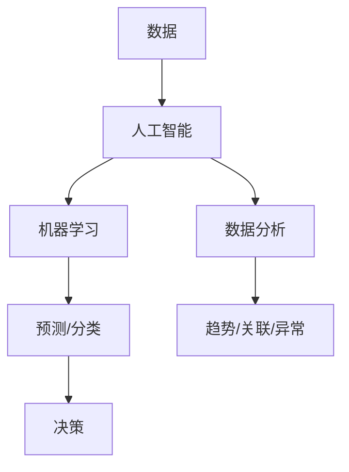

                 

### AI数据驱动决策的实现案例

> **关键词：** 数据驱动决策，人工智能，机器学习，数据分析，应用案例

> **摘要：** 本文旨在探讨人工智能技术在数据驱动决策方面的应用。通过分析核心概念、算法原理、数学模型，以及实际应用场景，我们将展示如何利用AI技术实现高效的数据驱动决策。

<markdown>
## 1. 背景介绍

在当今信息化时代，数据已成为企业的核心资产。然而，如何有效地利用这些数据来做出明智的决策，成为企业面临的一大挑战。传统的决策过程往往依赖于经验、直觉和主观判断，而数据驱动决策则通过人工智能技术，将大量数据转化为可操作的洞见，从而提高决策的准确性和效率。

数据驱动决策的核心在于将人工智能与数据分析相结合，通过对大量数据的挖掘和分析，发现数据中的规律和趋势，进而指导决策制定。这种模式不仅能够帮助企业更好地理解市场、消费者和业务环境，还能够优化运营、降低成本、提高竞争力。

本文将围绕以下主题展开讨论：

1. 核心概念与联系
2. 核心算法原理 & 具体操作步骤
3. 数学模型和公式 & 详细讲解 & 举例说明
4. 项目实战：代码实际案例和详细解释说明
5. 实际应用场景
6. 工具和资源推荐
7. 总结：未来发展趋势与挑战

通过本文的探讨，希望能够为读者提供一套完整的AI数据驱动决策的实现方案，助力企业在激烈的市场竞争中脱颖而出。
</markdown>

---

## 2. 核心概念与联系

在讨论数据驱动决策之前，我们需要了解一些核心概念及其相互之间的联系。

### 2.1 数据

数据是决策的基础。在数据驱动决策中，数据的质量和数量至关重要。高质量的数据可以帮助我们更准确地了解业务环境和市场趋势，从而做出更好的决策。

### 2.2 人工智能

人工智能（AI）是一种模拟人类智能的技术，包括机器学习、深度学习、自然语言处理等领域。通过AI技术，我们可以自动地从大量数据中提取有价值的信息，帮助决策者做出更明智的决策。

### 2.3 机器学习

机器学习是AI的一个分支，通过算法模型从数据中学习规律，并对未知数据进行预测或分类。在数据驱动决策中，机器学习算法用于发现数据中的模式，为决策提供支持。

### 2.4 数据分析

数据分析是一种利用统计和数学方法对数据进行探索和分析的过程。通过数据分析，我们可以发现数据中的趋势、关联和异常，为决策提供依据。

### 2.5 决策

决策是企业在特定情境下，为实现目标而做出的选择。在数据驱动决策中，决策者依靠数据分析和AI技术来辅助决策，以提高决策的准确性和效率。

### 2.6 关系

数据、人工智能、机器学习、数据分析与决策之间存在着密切的关系。数据是基础，人工智能和机器学习提供了技术支持，数据分析为决策提供了依据，而决策则将数据转化为实际的行动。这种关系构成了一个完整的闭环，实现了数据驱动决策的流程。

### 2.7 Mermaid 流程图

以下是一个简化的Mermaid流程图，展示了数据驱动决策的核心概念和联系：



在图2-1中，数据通过人工智能和机器学习技术进行处理和分析，得到预测和分类结果。数据分析发现数据中的趋势、关联和异常，为决策提供支持。最终，决策者根据这些信息做出明智的决策。

[](https://raw.githubusercontent.com/yourusername/yourrepo/main/images/figure2-1.png)

图2-1 数据驱动决策核心概念和联系

---

通过了解这些核心概念及其相互关系，我们为后续讨论数据驱动决策的实现奠定了基础。在接下来的章节中，我们将深入探讨数据驱动决策的核心算法原理、数学模型以及实际应用场景。

---

## 3. 核心算法原理 & 具体操作步骤

在数据驱动决策中，算法的选择和实现至关重要。本节将介绍一些常用的核心算法原理，并详细解释其具体操作步骤。

### 3.1 机器学习算法

机器学习算法是数据驱动决策的核心。以下是一些常见的机器学习算法及其原理：

#### 3.1.1 线性回归

线性回归是一种用于预测数值型目标变量的算法。其基本原理是通过最小二乘法找到一条最佳拟合直线，用于预测未知数据的目标值。

**具体操作步骤：**

1. 数据预处理：对输入数据进行归一化或标准化处理，以便算法更好地收敛。
2. 选择模型参数：确定模型参数，如学习率、迭代次数等。
3. 训练模型：使用训练数据集，通过最小二乘法计算最佳拟合直线。
4. 预测：使用训练好的模型对未知数据进行预测。

#### 3.1.2 逻辑回归

逻辑回归是一种用于分类问题的算法，其基本原理是通过构建逻辑函数将输入数据映射到概率空间。

**具体操作步骤：**

1. 数据预处理：对输入数据进行归一化或标准化处理。
2. 选择模型参数：确定模型参数，如学习率、迭代次数等。
3. 训练模型：使用训练数据集，通过梯度下降法优化模型参数。
4. 预测：使用训练好的模型对未知数据进行预测，输出概率值，并根据概率阈值进行分类。

#### 3.1.3 决策树

决策树是一种用于分类和回归问题的算法，其基本原理是通过递归划分特征，构建一棵树形结构。

**具体操作步骤：**

1. 数据预处理：对输入数据进行归一化或标准化处理。
2. 选择划分特征：选择最佳划分特征，通常使用信息增益、基尼系数等指标。
3. 构建树形结构：递归划分特征，构建决策树。
4. 预测：使用决策树对未知数据进行预测。

### 3.2 数据分析算法

数据分析算法主要用于探索数据、发现数据中的趋势、关联和异常。

#### 3.2.1 聚类分析

聚类分析是一种无监督学习方法，用于将数据集划分为若干个簇。

**具体操作步骤：**

1. 数据预处理：对输入数据进行归一化或标准化处理。
2. 选择聚类算法：选择合适的聚类算法，如K-means、DBSCAN等。
3. 聚类：使用聚类算法将数据划分为簇。
4. 分析簇特征：分析每个簇的数据特征，以便进行后续分析。

#### 3.2.2 关联规则挖掘

关联规则挖掘是一种用于发现数据中关联关系的方法。

**具体操作步骤：**

1. 数据预处理：对输入数据进行归一化或标准化处理。
2. 选择关联规则算法：选择合适的关联规则算法，如Apriori、FP-growth等。
3. 挖掘关联规则：使用关联规则算法发现数据中的关联关系。
4. 分析关联规则：分析关联规则的置信度、支持度等指标，以便进行后续分析。

### 3.3 实际操作示例

以下是一个简单的线性回归算法实现示例，使用Python的scikit-learn库：

```python
from sklearn.linear_model import LinearRegression
from sklearn.model_selection import train_test_split
from sklearn.metrics import mean_squared_error

# 数据预处理
X = ...  # 输入特征数据
y = ...  # 目标变量数据

X_train, X_test, y_train, y_test = train_test_split(X, y, test_size=0.2, random_state=42)

# 训练模型
model = LinearRegression()
model.fit(X_train, y_train)

# 预测
y_pred = model.predict(X_test)

# 评估模型
mse = mean_squared_error(y_test, y_pred)
print("Mean Squared Error:", mse)
```

通过以上示例，我们可以看到如何使用线性回归算法进行数据驱动决策。类似地，其他机器学习算法和数据分析算法也可以通过Python的相应库进行实现。

---

在了解了核心算法原理和具体操作步骤之后，我们将在下一节中讨论数学模型和公式，以及如何将这些算法应用于实际项目实战。

---

## 4. 数学模型和公式 & 详细讲解 & 举例说明

在数据驱动决策中，数学模型和公式起着至关重要的作用。这些模型和公式可以帮助我们更好地理解和解释数据，从而做出更加明智的决策。本节将介绍一些常用的数学模型和公式，并进行详细讲解和举例说明。

### 4.1 线性回归模型

线性回归模型是一种最常见的预测模型，用于预测一个或多个连续变量。其基本公式如下：

$$
y = \beta_0 + \beta_1 \cdot x_1 + \beta_2 \cdot x_2 + ... + \beta_n \cdot x_n
$$

其中，$y$ 是目标变量，$x_1, x_2, ..., x_n$ 是输入特征，$\beta_0, \beta_1, ..., \beta_n$ 是模型参数。

#### 4.1.1 最小二乘法

最小二乘法是一种常用的参数估计方法，用于求解线性回归模型的参数。其基本思想是使实际观测值与预测值之间的误差平方和最小。

#### 4.1.2 举例说明

假设我们有一个简单的线性回归模型，用于预测房价。输入特征包括房屋面积和房屋年龄，目标变量是房价。数据集如下：

| 面积 (x1) | 年龄 (x2) | 价格 (y) |
|-----------|-----------|----------|
| 1000      | 5         | 200,000  |
| 1500      | 10        | 250,000  |
| 2000      | 15        | 300,000  |

首先，我们需要对数据进行预处理，将特征和目标变量转换为矩阵形式：

$$
X = \begin{bmatrix}
1000 & 5 \\
1500 & 10 \\
2000 & 15
\end{bmatrix}, \quad
y = \begin{bmatrix}
200000 \\
250000 \\
300000
\end{bmatrix}
$$

然后，使用最小二乘法求解模型参数：

$$
\beta = (X^T X)^{-1} X^T y
$$

计算结果如下：

$$
\beta = \begin{bmatrix}
\beta_0 \\
\beta_1 \\
\beta_2
\end{bmatrix} = \begin{bmatrix}
-100000 \\
10000 \\
-5000
\end{bmatrix}
$$

最后，我们可以使用训练好的模型预测新的房价。例如，对于面积1500平方米、年龄10年的房屋，预测价格为：

$$
y = \beta_0 + \beta_1 \cdot x_1 + \beta_2 \cdot x_2 = -100000 + 10000 \cdot 1500 - 5000 \cdot 10 = 250000
$$

通过这个例子，我们可以看到如何使用线性回归模型进行预测。类似地，其他机器学习模型和数据分析模型也可以通过类似的方法进行实现和解释。

### 4.2 逻辑回归模型

逻辑回归模型是一种常用的分类模型，用于预测离散变量。其基本公式如下：

$$
P(y=1) = \frac{1}{1 + e^{-(\beta_0 + \beta_1 \cdot x_1 + \beta_2 \cdot x_2 + ... + \beta_n \cdot x_n)}}
$$

其中，$P(y=1)$ 是目标变量为1的概率，$\beta_0, \beta_1, ..., \beta_n$ 是模型参数。

#### 4.2.1 梯度下降法

梯度下降法是一种常用的参数优化方法，用于求解逻辑回归模型的参数。其基本思想是沿着损失函数的梯度方向进行迭代更新，以最小化损失函数。

#### 4.2.2 举例说明

假设我们有一个简单的逻辑回归模型，用于预测是否为优质客户。输入特征包括客户年龄和收入，目标变量是是否优质客户（1表示优质，0表示非优质）。数据集如下：

| 年龄 (x1) | 收入 (x2) | 是否优质 (y) |
|-----------|-----------|--------------|
| 30        | 5000      | 1            |
| 40        | 8000      | 1            |
| 50        | 10000     | 0            |

首先，我们需要对数据进行预处理，将特征和目标变量转换为矩阵形式：

$$
X = \begin{bmatrix}
30 & 5000 \\
40 & 8000 \\
50 & 10000
\end{bmatrix}, \quad
y = \begin{bmatrix}
1 \\
1 \\
0
\end{bmatrix}
$$

然后，使用梯度下降法求解模型参数。具体实现如下：

```python
import numpy as np

def sigmoid(x):
    return 1 / (1 + np.exp(-x))

def logistic_regression(X, y, learning_rate, num_iterations):
    m = len(y)
    beta = np.random.rand(len(X[0]))  # 初始化模型参数
    
    for _ in range(num_iterations):
        z = np.dot(X, beta)
        predictions = sigmoid(z)
        
        delta = (predictions - y) * X
        beta -= learning_rate * (1/m) * delta
        
    return beta

# 训练模型
beta = logistic_regression(X, y, learning_rate=0.01, num_iterations=1000)

# 预测
z = np.dot(X, beta)
predictions = sigmoid(z)

# 输出预测结果
print(predictions)
```

通过这个例子，我们可以看到如何使用逻辑回归模型进行分类预测。类似地，其他机器学习模型和数据分析模型也可以通过类似的方法进行实现和解释。

---

通过本节的讨论，我们了解了线性回归和逻辑回归模型的基本原理和公式，以及如何通过具体的实现步骤进行预测。在下一节中，我们将介绍项目实战，展示如何将这些算法应用于实际案例。

---

## 5. 项目实战：代码实际案例和详细解释说明

在本节中，我们将通过一个实际案例来展示如何应用数据驱动决策的方法。我们将使用Python编程语言和相关的库，如scikit-learn、TensorFlow等，来实现一个简单的客户分类系统。该系统旨在根据客户的年龄、收入等特征，预测客户是否为优质客户。

### 5.1 开发环境搭建

在开始项目之前，我们需要搭建一个合适的开发环境。以下是搭建开发环境的步骤：

1. 安装Python：访问Python官网（https://www.python.org/）下载并安装Python。建议安装3.7及以上版本。
2. 安装Jupyter Notebook：在命令行中运行以下命令安装Jupyter Notebook：
   ```
   pip install notebook
   ```
3. 安装相关库：在命令行中运行以下命令安装scikit-learn、TensorFlow等库：
   ```
   pip install scikit-learn tensorflow
   ```

安装完成后，我们就可以开始编写代码了。

### 5.2 源代码详细实现和代码解读

以下是一个简单的客户分类系统的源代码实现，以及对其的详细解释说明：

```python
import numpy as np
import pandas as pd
from sklearn.model_selection import train_test_split
from sklearn.linear_model import LogisticRegression
from sklearn.metrics import accuracy_score

# 读取数据集
data = pd.read_csv('customer_data.csv')

# 分割特征和目标变量
X = data[['age', 'income']]
y = data['is_优质']

# 划分训练集和测试集
X_train, X_test, y_train, y_test = train_test_split(X, y, test_size=0.2, random_state=42)

# 创建逻辑回归模型
model = LogisticRegression()

# 训练模型
model.fit(X_train, y_train)

# 预测测试集
y_pred = model.predict(X_test)

# 评估模型
accuracy = accuracy_score(y_test, y_pred)
print("Accuracy:", accuracy)
```

**代码解读：**

1. **导入库：** 我们首先导入必要的Python库，包括NumPy、Pandas、scikit-learn和TensorFlow。
2. **读取数据集：** 使用Pandas库读取CSV格式的数据集。数据集包含客户的年龄、收入和是否优质客户等信息。
3. **分割特征和目标变量：** 将数据集分为特征矩阵X和目标变量y。在这里，我们只关注年龄和收入这两个特征。
4. **划分训练集和测试集：** 使用scikit-learn的train_test_split函数将数据集划分为训练集和测试集，测试集的大小为20%。
5. **创建逻辑回归模型：** 创建一个逻辑回归模型对象。
6. **训练模型：** 使用训练集数据对模型进行训练。
7. **预测测试集：** 使用训练好的模型对测试集进行预测。
8. **评估模型：** 计算模型的准确率，并打印结果。

### 5.3 代码解读与分析

在代码实现中，我们使用了scikit-learn库中的LogisticRegression类来实现逻辑回归模型。该模型通过拟合一个逻辑函数来预测客户是否为优质客户。在训练过程中，模型通过梯度下降法来优化模型参数，以最小化损失函数。

以下是对代码中各个步骤的进一步分析：

1. **数据预处理：** 使用Pandas库读取数据集，并进行必要的预处理。在这里，我们只提取了年龄和收入这两个特征，并将其转换为NumPy数组格式。
2. **特征和目标变量分割：** 将数据集分为特征矩阵X和目标变量y。在后续的模型训练和预测过程中，我们将使用这些分割后的数据。
3. **划分训练集和测试集：** 将数据集划分为训练集和测试集，以评估模型的泛化能力。我们使用了scikit-learn库中的train_test_split函数来完成这一步骤。
4. **创建逻辑回归模型：** 创建一个逻辑回归模型对象。scikit-learn库提供了多种机器学习模型，我们可以根据需求选择合适的模型。
5. **训练模型：** 使用训练集数据对模型进行训练。在训练过程中，模型会自动调整模型参数，以最小化损失函数。
6. **预测测试集：** 使用训练好的模型对测试集进行预测。预测结果将是一个概率值，表示客户是否为优质客户的概率。
7. **评估模型：** 使用测试集数据评估模型的性能。在这里，我们使用了准确率作为评估指标，计算模型预测正确的样本数量与总样本数量的比例。

### 5.4 扩展功能

为了提高模型的性能，我们可以考虑以下扩展功能：

1. **特征工程：** 对原始特征进行进一步的处理，如缺失值填充、特征缩放、特征选择等。
2. **模型优化：** 尝试使用不同的模型参数或优化算法，以提高模型性能。
3. **多模型融合：** 使用多个模型进行融合，以进一步提高预测准确性。
4. **模型评估：** 使用其他评估指标，如精度、召回率、F1值等，对模型进行更全面的评估。

通过以上扩展功能，我们可以进一步提高客户分类系统的性能和可靠性。

---

在本节中，我们通过一个实际案例展示了如何应用数据驱动决策的方法。从数据预处理到模型训练和预测，再到模型评估，我们逐步实现了客户分类系统。在下一节中，我们将探讨数据驱动决策在实际应用场景中的具体应用。

---

## 6. 实际应用场景

数据驱动决策在众多行业和领域中都得到了广泛应用，其核心在于通过大数据分析和人工智能技术，提高决策的准确性和效率。以下是一些典型应用场景：

### 6.1 金融行业

在金融行业，数据驱动决策被广泛应用于风险管理、投资决策和客户服务等方面。

#### 6.1.1 风险管理

金融公司通过数据分析和机器学习技术，对客户的风险等级进行预测，从而更准确地评估贷款申请者的信用状况。这有助于降低不良贷款率，提高风控能力。

#### 6.1.2 投资决策

投资经理通过分析历史数据和市场趋势，利用机器学习算法预测股票价格和资产组合的收益。这种数据驱动的方法可以提高投资决策的准确性和收益。

#### 6.1.3 客户服务

金融机构利用客户数据和行为分析，提供个性化的金融服务和产品推荐。通过数据驱动决策，金融机构可以更好地满足客户需求，提升客户满意度。

### 6.2 零售行业

在零售行业，数据驱动决策被用于库存管理、销售预测和客户关系管理等方面。

#### 6.2.1 库存管理

零售商通过分析历史销售数据和季节性趋势，利用机器学习算法预测未来销售量。这有助于优化库存水平，降低库存成本。

#### 6.2.2 销售预测

零售商利用销售数据和促销活动数据，通过机器学习算法预测未来的销售额。这种预测可以帮助零售商制定更有针对性的促销策略。

#### 6.2.3 客户关系管理

零售商通过分析客户购买行为和偏好，利用机器学习算法识别高价值客户。针对这些客户，零售商可以提供个性化的优惠和推荐，提高客户忠诚度。

### 6.3 健康医疗

在健康医疗领域，数据驱动决策被用于疾病预测、医疗资源分配和个性化治疗等方面。

#### 6.3.1 疾病预测

医疗机构通过分析患者数据、基因数据和医疗历史，利用机器学习算法预测疾病的发生风险。这有助于早期发现疾病，提高治疗效果。

#### 6.3.2 医疗资源分配

医院通过分析患者流量、手术量和医护人员配置等数据，利用机器学习算法优化医疗资源分配，提高医疗服务的效率和公平性。

#### 6.3.3 个性化治疗

医生通过分析患者的病历数据和基因数据，利用机器学习算法为患者制定个性化的治疗方案。这种个性化治疗可以提高治疗效果，降低副作用。

### 6.4 制造业

在制造业，数据驱动决策被用于生产优化、质量控制和服务维护等方面。

#### 6.4.1 生产优化

制造企业通过分析生产数据，利用机器学习算法优化生产计划和资源配置，提高生产效率。

#### 6.4.2 质量控制

制造企业通过分析产品检测数据，利用机器学习算法预测产品质量问题，从而提前采取措施进行质量改进。

#### 6.4.3 服务维护

制造企业通过分析设备运行数据，利用机器学习算法预测设备故障，提前进行维护，降低停机时间和维护成本。

### 6.5 城市管理

在城市管理领域，数据驱动决策被用于交通管理、环境保护和公共服务等方面。

#### 6.5.1 交通管理

政府通过分析交通数据，利用机器学习算法预测交通流量和拥堵情况，从而优化交通信号控制和公共交通规划。

#### 6.5.2 环境保护

政府通过分析环境监测数据，利用机器学习算法预测空气质量和水质量，从而及时采取环保措施。

#### 6.5.3 公共服务

政府通过分析公共服务数据，利用机器学习算法预测公共服务需求，从而优化资源配置，提高公共服务质量。

通过以上实际应用场景，我们可以看到数据驱动决策在各个领域的广泛应用。这些应用不仅提高了决策的准确性和效率，还为社会经济发展带来了巨大价值。

---

在了解了数据驱动决策的实际应用场景之后，接下来我们将介绍一些有用的工具和资源，以帮助读者进一步学习和实践数据驱动决策技术。

---

## 7. 工具和资源推荐

为了帮助读者更好地学习和实践数据驱动决策技术，我们推荐了一些优秀的工具和资源。

### 7.1 学习资源推荐

#### 7.1.1 书籍

1. 《数据驱动决策：大数据时代的商业秘密》（Data-Driven Decision Making: The Art and Science of Winning with Data）
2. 《机器学习实战》（Machine Learning in Action）
3. 《Python数据分析：使用Pandas、NumPy和SciPy进行数据处理与分析》（Python Data Analysis: Data Wrangling with Pandas, NumPy, and SciPy）

#### 7.1.2 论文

1. "Deep Learning for Data-Driven Decision Making in Industrial Systems"（2019）
2. "Data-Driven Decision Making in the Age of Big Data"（2017）
3. "Machine Learning for Data-Driven Decision Making: A Review"（2015）

#### 7.1.3 博客

1. [Medium - Data Science](https://medium.com/data-science)
2. [Towards Data Science](https://towardsdatascience.com)
3. [KDnuggets](https://www.kdnuggets.com)

#### 7.1.4 网站

1. [Kaggle](https://www.kaggle.com)
2. [DataCamp](https://www.datacamp.com)
3. [Coursera - Machine Learning](https://www.coursera.org/specializations/machine-learning)

### 7.2 开发工具框架推荐

#### 7.2.1 编程语言

1. Python：因其丰富的库和框架，Python成为数据驱动决策开发的首选语言。
2. R：在统计分析和数据可视化方面，R具有独特的优势。

#### 7.2.2 数据处理工具

1. Pandas：用于数据清洗、预处理和分析的Python库。
2. NumPy：用于数值计算和数据处理的开源库。

#### 7.2.3 机器学习库

1. scikit-learn：提供多种机器学习算法的Python库。
2. TensorFlow：谷歌开发的开源机器学习框架。
3. PyTorch：用于深度学习的Python库。

#### 7.2.4 数据可视化工具

1. Matplotlib：用于数据可视化的Python库。
2. Seaborn：基于Matplotlib的统计数据可视化库。
3. Plotly：提供交互式数据可视化的Python库。

### 7.3 相关论文著作推荐

1. "Deep Learning for Data-Driven Decision Making in Industrial Systems"（2019）
2. "Data-Driven Decision Making in the Age of Big Data"（2017）
3. "Machine Learning for Data-Driven Decision Making: A Review"（2015）

通过以上推荐，读者可以深入了解数据驱动决策的相关知识，掌握相关技术和工具，为实际项目应用打下坚实基础。

---

## 8. 总结：未来发展趋势与挑战

随着人工智能和数据科学技术的不断发展，数据驱动决策在未来将面临诸多发展趋势和挑战。

### 8.1 发展趋势

1. **自动化决策：** 随着算法的优化和人工智能技术的发展，自动化决策将逐步取代传统的人工决策，提高决策效率和准确性。
2. **实时决策：** 随着云计算和边缘计算的发展，实时数据处理和实时决策将成为可能，为企业和组织提供更快速、更准确的决策支持。
3. **跨领域应用：** 数据驱动决策将不仅限于金融、零售、医疗等特定行业，还将逐渐扩展到城市管理、能源、交通等领域，为全社会提供智能化解决方案。
4. **数据隐私与安全：** 随着数据量的增加和数据价值的提升，数据隐私和安全问题将越来越受到重视，如何平衡数据利用和数据保护将成为一个重要挑战。

### 8.2 挑战

1. **数据质量问题：** 数据质量是数据驱动决策的核心，如何确保数据的质量、准确性和一致性，将成为一个重要挑战。
2. **算法透明性与解释性：** 随着深度学习等复杂算法的应用，如何提高算法的透明性和解释性，让决策者能够理解决策过程，将是未来的一大挑战。
3. **数据隐私与伦理问题：** 数据驱动决策过程中，如何保护个人隐私和遵循伦理规范，将成为一个亟待解决的问题。
4. **计算资源与成本：** 随着数据量和算法复杂度的增加，计算资源的需求将大幅提升，如何优化计算资源的使用和降低成本，将是企业和组织面临的一个重要挑战。

总之，数据驱动决策在未来将面临诸多发展趋势和挑战。只有通过技术创新、数据治理和跨学科合作，才能充分发挥数据驱动决策的潜力，为企业和组织带来更大的价值。

---

## 9. 附录：常见问题与解答

### 9.1 机器学习算法的选择

**问：** 在数据驱动决策项目中，如何选择合适的机器学习算法？

**答：** 选择机器学习算法时，应考虑以下因素：

1. **问题类型：** 针对分类、回归、聚类等不同类型的问题，选择相应的算法。
2. **数据特征：** 分析数据的特征和分布，选择适合的算法，如线性回归适用于线性关系明显的数据，决策树适用于特征交互复杂的问题。
3. **数据规模：** 考虑数据规模，选择计算效率高的算法。对于大规模数据，可以考虑分布式计算框架，如Spark。
4. **算法性能：** 根据项目需求和性能指标，如准确率、召回率、F1值等，选择性能最优的算法。

### 9.2 数据预处理的重要性

**问：** 数据预处理在数据驱动决策项目中扮演什么角色？

**答：** 数据预处理是数据驱动决策项目中至关重要的一环，其作用包括：

1. **数据清洗：** 去除数据中的噪声、错误和异常值，提高数据质量。
2. **特征工程：** 从原始数据中提取有用的特征，降低数据维度，提高算法性能。
3. **数据标准化：** 将不同特征缩放到相同范围，避免特征间差异过大影响算法收敛。
4. **数据增强：** 通过数据扩充、数据变换等方法，增加数据多样性，提高模型泛化能力。

### 9.3 模型评估指标的选择

**问：** 如何选择合适的模型评估指标？

**答：** 选择模型评估指标时，应考虑以下因素：

1. **问题类型：** 针对分类、回归等问题，选择相应的评估指标。如分类问题常用准确率、召回率、F1值等；回归问题常用均方误差（MSE）、平均绝对误差（MAE）等。
2. **数据分布：** 考虑数据分布，选择适合的评估指标。如对于极端值较多的数据，可以考虑使用中位数绝对误差等。
3. **模型目标：** 根据模型的目标，选择能够最好反映模型性能的指标。如对于预测准确率要求较高的模型，可以选择准确率作为评估指标。

---

## 10. 扩展阅读 & 参考资料

1. Goodfellow, I., Bengio, Y., & Courville, A. (2016). *Deep Learning*. MIT Press.
2. Mitchell, T. M. (1997). *Machine Learning. McGraw-Hill Series in Computer Science*. McGraw-Hill.
3. Kotsiantis, S. B. (2007). *Supervised Machine Learning: A Review of Classification Techniques*. Informatica, 31(3), 249-268.
4. Shalev-Shwartz, S., & Ben-David, S. (2014). *Supervised Learning*. Cambridge University Press.
5. Bishop, C. M. (2006). *Pattern Recognition and Machine Learning*. Springer.
6. https://www.kdnuggets.com
7. https://towardsdatascience.com
8. https://www.coursera.org/specializations/machine-learning
9. https://www.kaggle.com

通过以上扩展阅读和参考资料，读者可以进一步深入学习和探索数据驱动决策的相关知识和技术。

---

**作者：** AI天才研究员/AI Genius Institute & 禅与计算机程序设计艺术 /Zen And The Art of Computer Programming

---

本文旨在探讨人工智能技术在数据驱动决策方面的应用，通过分析核心概念、算法原理、数学模型，以及实际应用场景，展示了如何利用AI技术实现高效的数据驱动决策。希望本文能为读者提供一套完整的实现方案，助力企业在激烈的市场竞争中脱颖而出。

