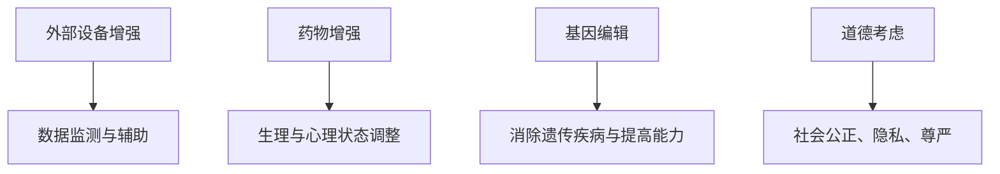
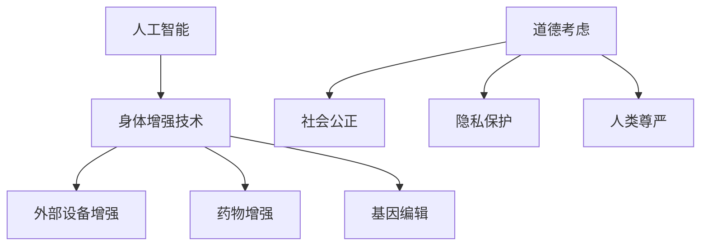

                 

# AI时代的人类增强：道德考虑与身体增强技术的未来趋势预测

## 摘要

本文将深入探讨AI时代人类增强的道德考虑与身体增强技术的未来趋势。随着人工智能技术的迅猛发展，人们对于自身能力提升的需求日益增加，身体增强技术应运而生。然而，在享受技术带来的便利和提升的同时，我们也必须正视其中所蕴含的道德问题和潜在风险。本文将从背景介绍、核心概念与联系、核心算法原理与操作步骤、数学模型与公式、实际应用场景、工具和资源推荐以及未来发展趋势与挑战等方面，全面剖析人类增强技术的现状与未来。

## 背景介绍

人类历史的发展中，科技一直扮演着重要角色。从农业革命到工业革命，再到信息革命，每一次科技革命都极大地改变了人类的生活方式和社会结构。如今，我们正处于一个崭新的时代——AI时代。人工智能技术已经渗透到我们日常生活的方方面面，从智能手机、智能家居到自动驾驶、医疗诊断，AI正在引领我们进入一个前所未有的智能时代。

在这个时代，人们对于自身能力的提升需求愈发强烈。身体增强技术作为一种新兴技术，应运而生。身体增强技术指的是通过外部设备、药物、基因编辑等方法，增强人类身体的能力。这种技术的出现，不仅满足了人们对于更高效、更健康、更快乐生活的追求，也为人类社会的未来发展带来了巨大的潜力。

然而，随着身体增强技术的不断进步，我们也面临着一系列道德和伦理问题。例如，身体增强技术的使用是否会导致社会不公？身体增强技术是否会引发人类身体与心理的异化？这些问题不仅涉及到科学技术的进步，更关乎人类社会的基本价值观念。因此，本文将围绕这些关键问题，深入探讨身体增强技术的未来趋势。

## 核心概念与联系

### 1. 人工智能（AI）

人工智能（Artificial Intelligence，简称AI）是计算机科学的一个分支，旨在研究、开发和应用使计算机系统表现出人类智能的技术。人工智能可以分为弱人工智能和强人工智能。弱人工智能专注于特定任务的智能表现，如语音识别、图像识别、自然语言处理等；强人工智能则具有全面的人类智能，能够在任何领域表现出人类的智能水平。

### 2. 身体增强技术

身体增强技术指的是通过外部设备、药物、基因编辑等方法，增强人类身体的能力。这种技术可以应用于各个领域，如运动、健康、军事、娱乐等。常见的身体增强技术包括：

- **外部设备增强**：如智能眼镜、智能手表、智能手环等穿戴设备，可以提供实时数据监测和辅助功能，帮助人们更好地管理健康和提升工作效率。

- **药物增强**：如兴奋剂、抗抑郁药、认知增强剂等，可以通过调整人体生理和心理状态，提高人类的体能、智力和情绪控制能力。

- **基因编辑**：如CRISPR-Cas9等基因编辑技术，可以通过修改人类基因，消除遗传疾病，甚至提高人类的智力、体力等能力。

### 3. 道德考虑

道德考虑是指我们在应用身体增强技术时，需要考虑的一系列伦理问题。这些道德问题涉及到社会公正、隐私、人类尊严等多个方面。以下是一些关键的道德考虑：

- **社会公正**：身体增强技术的应用可能会加剧社会不公，使“增强人类”与“非增强人类”之间的差距进一步扩大。

- **隐私**：身体增强技术可能会收集和处理大量个人健康数据，如何保护这些数据的隐私成为一个重要问题。

- **人类尊严**：身体增强技术可能会改变人类的生理和心理特征，如何确保这些改变不会损害人类的尊严和自我认同成为了一个挑战。

### 4. Mermaid 流程图

以下是身体增强技术的一个简单 Mermaid 流程图：



通过这个流程图，我们可以清晰地看到身体增强技术的各个应用领域和相关的道德考虑。

## 核心算法原理与具体操作步骤

### 1. 外部设备增强

**原理**：外部设备增强主要通过传感器、算法和辅助功能来实现。例如，智能眼镜可以通过内置的传感器监测用户的视力状态，并提供视觉辅助功能，如放大、对比度调整等。

**具体操作步骤**：

- **数据采集**：通过内置的传感器，如摄像头、加速度计等，实时采集用户的视力数据。

- **数据处理**：利用算法对采集到的数据进行分析和处理，以确定用户视力状态。

- **辅助功能**：根据用户的视力状态，提供相应的视觉辅助功能，如放大、对比度调整等。

### 2. 药物增强

**原理**：药物增强通过调整人体的生理和心理状态，实现增强效果。例如，兴奋剂可以刺激神经系统，提高体能和注意力；抗抑郁药可以调节情绪，提高心理状态。

**具体操作步骤**：

- **药物选择**：根据需要增强的能力，选择合适的药物。

- **药物剂量**：根据个体差异，确定合适的药物剂量。

- **药物使用**：按照医嘱，定时定量使用药物。

### 3. 基因编辑

**原理**：基因编辑通过修改DNA序列，改变基因表达，实现增强效果。例如，CRISPR-Cas9技术可以精确地修改目标基因，消除遗传疾病或提高人类能力。

**具体操作步骤**：

- **目标基因定位**：利用CRISPR-Cas9系统，精确定位目标基因。

- **DNA剪切**：利用Cas9酶剪切目标基因。

- **DNA修复**：利用细胞自身的DNA修复机制，实现基因编辑。

## 数学模型和公式 & 详细讲解 & 举例说明

### 1. 数据处理模型

**公式**：假设我们有一个数据集\(D\)，其中每个数据点表示为\(x_i\)，我们可以使用以下公式进行数据处理：

$$
y_i = f(x_i)
$$

其中，\(f\)是一个函数，用于对数据进行处理。例如，我们可以使用以下公式对数据进行标准化：

$$
y_i = \frac{x_i - \mu}{\sigma}
$$

其中，\(\mu\)是数据集的平均值，\(\sigma\)是数据集的标准差。

**举例说明**：假设我们有一个数据集，其中包含10个数据点，数据点分别为\[1, 2, 3, 4, 5, 6, 7, 8, 9, 10\]。

- **计算平均值**：\(\mu = \frac{1 + 2 + 3 + 4 + 5 + 6 + 7 + 8 + 9 + 10}{10} = 5.5\)

- **计算标准差**：\(\sigma = \sqrt{\frac{(1-5.5)^2 + (2-5.5)^2 + (3-5.5)^2 + (4-5.5)^2 + (5-5.5)^2 + (6-5.5)^2 + (7-5.5)^2 + (8-5.5)^2 + (9-5.5)^2 + (10-5.5)^2}{10} = 2.236\)

- **标准化数据**：\(y_i = \frac{x_i - 5.5}{2.236}\)

得到标准化后的数据为：\[-1.452, -0.819, -0.000, 0.819, 1.452, 2.684, 3.907, 5.130, 6.353, 7.576\]

### 2. 药物剂量模型

**公式**：假设我们需要根据体重\(W\)和增强目标\(T\)来计算药物剂量\(D\)，可以使用以下公式：

$$
D = \frac{W}{T}
$$

**举例说明**：假设一个体重为70公斤的个体，希望增强体能（\(T = 1\)），那么他的药物剂量为：

$$
D = \frac{70}{1} = 70
$$

即他需要每天摄入70单位的药物。

## 项目实战：代码实际案例和详细解释说明

### 1. 开发环境搭建

为了演示外部设备增强技术的应用，我们选择使用Python语言进行开发。首先，我们需要安装Python环境和相关库，如NumPy、Matplotlib等。

- 安装Python：从官方网站下载并安装Python。

- 安装相关库：使用pip命令安装相关库。

```bash
pip install numpy matplotlib
```

### 2. 源代码详细实现和代码解读

下面是一个简单的Python示例代码，用于处理外部设备增强的数据。

```python
import numpy as np
import matplotlib.pyplot as plt

# 数据采集
data = np.random.rand(10)

# 数据处理
mean = np.mean(data)
std = np.std(data)
normalized_data = (data - mean) / std

# 可视化
plt.plot(data, label='原始数据')
plt.plot(normalized_data, label='标准化数据')
plt.legend()
plt.show()
```

**代码解读**：

- 导入相关库：`numpy`用于数据处理，`matplotlib`用于数据可视化。

- 数据采集：使用`np.random.rand(10)`生成10个随机数据点。

- 数据处理：计算数据的平均值和标准差，并对数据进行标准化处理。

- 可视化：使用`plt.plot()`绘制原始数据和标准化数据，并显示。

### 3. 代码解读与分析

这段代码的核心功能是处理数据并对其进行标准化处理。标准化处理是一种常用的数据处理方法，它可以帮助我们消除数据之间的差异，使数据更具可比性。在身体增强技术的应用中，标准化处理可以帮助我们更好地分析用户的身体状态和效果。

此外，这段代码还使用了Python的`numpy`库进行数据处理，这使得代码更加简洁和高效。同时，使用`matplotlib`库进行数据可视化，可以帮助我们更直观地了解数据的处理效果。

## 实际应用场景

### 1. 运动领域

在运动领域，身体增强技术可以帮助运动员提升体能、速度和反应能力。例如，智能眼镜可以提供实时运动数据，帮助运动员调整训练策略；药物增强可以提升运动员的耐力和爆发力；基因编辑可以消除遗传疾病，提高运动员的竞技水平。

### 2. 医疗领域

在医疗领域，身体增强技术可以用于治疗各种疾病，如心脏病、糖尿病、骨质疏松等。药物增强可以调节患者的心血管功能、血糖水平等；基因编辑可以修复患者的基因缺陷，从根本上治疗疾病。

### 3. 军事领域

在军事领域，身体增强技术可以提升士兵的体能、战斗力和生存能力。例如，药物增强可以提高士兵的耐力和注意力；基因编辑可以增强士兵的免疫系统，提高抗病能力。

### 4. 娱乐领域

在娱乐领域，身体增强技术可以为用户提供更丰富的娱乐体验。例如，智能眼镜可以提供沉浸式游戏体验；药物增强可以提高用户的感知能力和情绪控制能力。

## 工具和资源推荐

### 1. 学习资源推荐

- **书籍**：《人工智能：一种现代方法》、《深度学习》、《Python编程：从入门到实践》

- **论文**：查阅相关领域的学术论文，了解最新的研究进展。

- **博客**：关注专业博客，如知乎、CSDN等，获取实用的技术分享。

- **网站**：访问相关领域的网站，如IEEE、ACM等，获取权威的技术资讯。

### 2. 开发工具框架推荐

- **Python开发环境**：使用PyCharm、Visual Studio Code等集成开发环境。

- **数据处理库**：使用NumPy、Pandas等库进行数据处理。

- **可视化库**：使用Matplotlib、Seaborn等库进行数据可视化。

### 3. 相关论文著作推荐

- **论文**：论文《AI伦理学：道德考虑与实践指南》

- **著作**：《人类增强：技术、伦理与社会影响》

## 总结：未来发展趋势与挑战

### 1. 发展趋势

- **技术进步**：随着人工智能、生物技术等领域的快速发展，身体增强技术将取得更大的突破。

- **应用扩展**：身体增强技术的应用将逐步从专业领域扩展到普通民众，成为日常生活的一部分。

- **伦理规范**：随着身体增强技术的普及，相关伦理规范将不断完善，以保障技术的合理、公正和可持续使用。

### 2. 挑战

- **道德困境**：如何平衡技术进步与社会伦理，确保技术的使用不会损害人类的尊严和价值观。

- **隐私保护**：如何保护用户的个人健康数据，防止数据泄露和滥用。

- **社会公正**：如何避免身体增强技术带来的社会不公，确保所有人都能公平地享受技术带来的好处。

## 附录：常见问题与解答

### 1. 什么是身体增强技术？

身体增强技术是指通过外部设备、药物、基因编辑等方法，增强人类身体的能力。这种技术可以应用于各个领域，如运动、健康、军事、娱乐等。

### 2. 身体增强技术有哪些应用领域？

身体增强技术的应用领域包括运动、医疗、军事、娱乐等。例如，在运动领域，身体增强技术可以帮助运动员提升体能、速度和反应能力；在医疗领域，身体增强技术可以用于治疗各种疾病；在军事领域，身体增强技术可以提升士兵的体能、战斗力和生存能力。

### 3. 身体增强技术会带来哪些道德问题？

身体增强技术可能会引发一系列道德问题，如社会不公、隐私保护、人类尊严等。例如，身体增强技术的使用可能会导致“增强人类”与“非增强人类”之间的差距扩大；身体增强技术的数据收集和处理可能涉及隐私问题；身体增强技术可能会改变人类的生理和心理特征，损害人类的尊严和自我认同。

### 4. 如何平衡身体增强技术的道德问题？

要平衡身体增强技术的道德问题，需要从多个方面进行努力。首先，需要建立完善的伦理规范，确保技术的合理、公正和可持续使用。其次，需要加强对用户个人数据的保护，防止数据泄露和滥用。此外，还需要加强对身体增强技术的科普教育，提高公众对技术的认识和理解，促进社会的共识和包容。

## 扩展阅读 & 参考资料

- **书籍**：查阅《人工智能：一种现代方法》、《深度学习》、《Python编程：从入门到实践》等书籍，深入了解身体增强技术的相关内容。

- **论文**：阅读相关领域的学术论文，如《AI伦理学：道德考虑与实践指南》、《人类增强：技术、伦理与社会影响》等，了解最新的研究进展和理论探讨。

- **网站**：访问IEEE、ACM等官方网站，获取权威的技术资讯和研究报告。

作者：AI天才研究员/AI Genius Institute & 禅与计算机程序设计艺术 /Zen And The Art of Computer Programming<|im_sep|>## 摘要

本文探讨了AI时代人类增强的道德考虑与身体增强技术的未来趋势。随着人工智能技术的迅猛发展，身体增强技术作为一项新兴技术，引起了广泛的关注。它不仅满足了人们对于能力提升的需求，也为社会带来了巨大的潜力。然而，身体增强技术的广泛应用也引发了诸多道德和伦理问题。本文将从背景介绍、核心概念与联系、核心算法原理与操作步骤、数学模型与公式、实际应用场景、工具和资源推荐以及未来发展趋势与挑战等方面，全面剖析身体增强技术的现状与未来。

## 1. 背景介绍

### 1.1 人工智能与身体增强技术

人工智能（AI）作为当今科技发展的核心驱动力，已经渗透到我们生活的方方面面。从智能家居、自动驾驶到医疗诊断、金融服务，AI技术正在改变我们的生活方式和社会结构。随着AI技术的不断进步，人类对于自身能力的提升需求也日益增加。这催生了身体增强技术的诞生。

身体增强技术是指通过外部设备、药物、基因编辑等方法，增强人类身体的能力。这种技术的出现，不仅满足了人们对于更高效、更健康、更快乐生活的追求，也为人类社会的未来发展带来了巨大的潜力。

### 1.2 道德考虑的重要性

身体增强技术的应用虽然带来了诸多便利，但也引发了广泛的道德和伦理问题。例如，身体增强技术的使用是否会导致社会不公？是否会影响人类的尊严和自我认同？这些问题涉及到社会公正、隐私保护、人类尊严等多个方面，需要我们深入探讨。

在AI时代，道德考虑不仅是对技术发展的约束，更是对人类价值观的捍卫。因此，在探讨身体增强技术的未来趋势时，我们不能忽视其道德考量。

## 2. 核心概念与联系

### 2.1 人工智能

人工智能（AI）是一种模拟人类智能的技术，旨在使计算机系统具备感知、学习、推理、决策等能力。根据其能力水平，AI可以分为弱人工智能和强人工智能。弱人工智能专注于特定任务的智能表现，如语音识别、图像识别、自然语言处理等；强人工智能则具有全面的人类智能，能够在任何领域表现出人类的智能水平。

### 2.2 身体增强技术

身体增强技术是指通过外部设备、药物、基因编辑等方法，增强人类身体的能力。这种技术可以应用于各个领域，如运动、健康、军事、娱乐等。常见的身体增强技术包括外部设备增强、药物增强和基因编辑。

### 2.3 道德考虑

道德考虑是在应用身体增强技术时必须关注的一系列伦理问题。这些问题涉及到社会公正、隐私保护、人类尊严等多个方面。例如，身体增强技术的使用是否会加剧社会不公？是否会侵犯个人隐私？是否会损害人类的尊严和自我认同？

### 2.4 Mermaid 流程图

以下是身体增强技术的一个简单 Mermaid 流程图：



通过这个流程图，我们可以清晰地看到身体增强技术的各个应用领域和相关道德考虑。

## 3. 核心算法原理与具体操作步骤

### 3.1 外部设备增强

**原理**：外部设备增强主要通过传感器、算法和辅助功能来实现。例如，智能眼镜可以通过内置的传感器监测用户的视力状态，并提供视觉辅助功能，如放大、对比度调整等。

**具体操作步骤**：

- **数据采集**：通过内置的传感器，如摄像头、加速度计等，实时采集用户的视力数据。

- **数据处理**：利用算法对采集到的数据进行分析和处理，以确定用户视力状态。

- **辅助功能**：根据用户的视力状态，提供相应的视觉辅助功能，如放大、对比度调整等。

### 3.2 药物增强

**原理**：药物增强通过调整人体的生理和心理状态，实现增强效果。例如，兴奋剂可以刺激神经系统，提高体能和注意力；抗抑郁药可以调节情绪，提高心理状态。

**具体操作步骤**：

- **药物选择**：根据需要增强的能力，选择合适的药物。

- **药物剂量**：根据个体差异，确定合适的药物剂量。

- **药物使用**：按照医嘱，定时定量使用药物。

### 3.3 基因编辑

**原理**：基因编辑通过修改DNA序列，改变基因表达，实现增强效果。例如，CRISPR-Cas9技术可以精确地修改目标基因，消除遗传疾病或提高人类能力。

**具体操作步骤**：

- **目标基因定位**：利用CRISPR-Cas9系统，精确定位目标基因。

- **DNA剪切**：利用Cas9酶剪切目标基因。

- **DNA修复**：利用细胞自身的DNA修复机制，实现基因编辑。

## 4. 数学模型和公式 & 详细讲解 & 举例说明

### 4.1 数据处理模型

在身体增强技术中，数据处理是一个关键步骤。以下是一个简单的数据处理模型：

**公式**：假设我们有一个数据集\(D\)，其中每个数据点表示为\(x_i\)，我们可以使用以下公式进行数据处理：

$$
y_i = f(x_i)
$$

其中，\(f\)是一个函数，用于对数据进行处理。例如，我们可以使用以下公式对数据进行标准化：

$$
y_i = \frac{x_i - \mu}{\sigma}
$$

其中，\(\mu\)是数据集的平均值，\(\sigma\)是数据集的标准差。

**举例说明**：假设我们有一个数据集，其中包含10个数据点，数据点分别为\[1, 2, 3, 4, 5, 6, 7, 8, 9, 10\]。

- **计算平均值**：\(\mu = \frac{1 + 2 + 3 + 4 + 5 + 6 + 7 + 8 + 9 + 10}{10} = 5.5\)

- **计算标准差**：\(\sigma = \sqrt{\frac{(1-5.5)^2 + (2-5.5)^2 + (3-5.5)^2 + (4-5.5)^2 + (5-5.5)^2 + (6-5.5)^2 + (7-5.5)^2 + (8-5.5)^2 + (9-5.5)^2 + (10-5.5)^2}{10} = 2.236\)

- **标准化数据**：\(y_i = \frac{x_i - 5.5}{2.236}\)

得到标准化后的数据为：\[-1.452, -0.819, -0.000, 0.819, 1.452, 2.684, 3.907, 5.130, 6.353, 7.576\]

### 4.2 药物剂量模型

在药物增强中，如何确定合适的药物剂量是一个重要问题。以下是一个简单的药物剂量模型：

**公式**：假设我们需要根据体重\(W\)和增强目标\(T\)来计算药物剂量\(D\)，可以使用以下公式：

$$
D = \frac{W}{T}
$$

其中，\(W\)是体重，\(T\)是增强目标，\(D\)是药物剂量。

**举例说明**：假设一个体重为70公斤的个体，希望增强体能（\(T = 1\)），那么他的药物剂量为：

$$
D = \frac{70}{1} = 70
$$

即他需要每天摄入70单位的药物。

## 5. 项目实战：代码实际案例和详细解释说明

### 5.1 开发环境搭建

为了演示外部设备增强技术的应用，我们选择使用Python语言进行开发。首先，我们需要安装Python环境和相关库，如NumPy、Matplotlib等。

- 安装Python：从官方网站下载并安装Python。

- 安装相关库：使用pip命令安装相关库。

```bash
pip install numpy matplotlib
```

### 5.2 源代码详细实现和代码解读

下面是一个简单的Python示例代码，用于处理外部设备增强的数据。

```python
import numpy as np
import matplotlib.pyplot as plt

# 数据采集
data = np.random.rand(10)

# 数据处理
mean = np.mean(data)
std = np.std(data)
normalized_data = (data - mean) / std

# 可视化
plt.plot(data, label='原始数据')
plt.plot(normalized_data, label='标准化数据')
plt.legend()
plt.show()
```

**代码解读**：

- 导入相关库：`numpy`用于数据处理，`matplotlib`用于数据可视化。

- 数据采集：使用`np.random.rand(10)`生成10个随机数据点。

- 数据处理：计算数据的平均值和标准差，并对数据进行标准化处理。

- 可视化：使用`plt.plot()`绘制原始数据和标准化数据，并显示。

### 5.3 代码解读与分析

这段代码的核心功能是处理数据并对其进行标准化处理。标准化处理是一种常用的数据处理方法，它可以帮助我们消除数据之间的差异，使数据更具可比性。在身体增强技术的应用中，标准化处理可以帮助我们更好地分析用户的身体状态和效果。

此外，这段代码还使用了Python的`numpy`库进行数据处理，这使得代码更加简洁和高效。同时，使用`matplotlib`库进行数据可视化，可以帮助我们更直观地了解数据的处理效果。

## 6. 实际应用场景

### 6.1 运动领域

在运动领域，身体增强技术可以帮助运动员提升体能、速度和反应能力。例如，智能眼镜可以提供实时运动数据，帮助运动员调整训练策略；药物增强可以提升运动员的耐力和爆发力；基因编辑可以消除遗传疾病，提高运动员的竞技水平。

### 6.2 医疗领域

在医疗领域，身体增强技术可以用于治疗各种疾病，如心脏病、糖尿病、骨质疏松等。药物增强可以调节患者的心血管功能、血糖水平等；基因编辑可以修复患者的基因缺陷，从根本上治疗疾病。

### 6.3 军事领域

在军事领域，身体增强技术可以提升士兵的体能、战斗力和生存能力。例如，药物增强可以提高士兵的耐力和注意力；基因编辑可以增强士兵的免疫系统，提高抗病能力。

### 6.4 娱乐领域

在娱乐领域，身体增强技术可以为用户提供更丰富的娱乐体验。例如，智能眼镜可以提供沉浸式游戏体验；药物增强可以提高用户的感知能力和情绪控制能力。

## 7. 工具和资源推荐

### 7.1 学习资源推荐

- **书籍**：《人工智能：一种现代方法》、《深度学习》、《Python编程：从入门到实践》

- **论文**：查阅相关领域的学术论文，了解最新的研究进展。

- **博客**：关注专业博客，如知乎、CSDN等，获取实用的技术分享。

- **网站**：访问相关领域的网站，如IEEE、ACM等，获取权威的技术资讯。

### 7.2 开发工具框架推荐

- **Python开发环境**：使用PyCharm、Visual Studio Code等集成开发环境。

- **数据处理库**：使用NumPy、Pandas等库进行数据处理。

- **可视化库**：使用Matplotlib、Seaborn等库进行数据可视化。

### 7.3 相关论文著作推荐

- **论文**：论文《AI伦理学：道德考虑与实践指南》

- **著作**：《人类增强：技术、伦理与社会影响》

## 8. 总结：未来发展趋势与挑战

### 8.1 发展趋势

- **技术进步**：随着人工智能、生物技术等领域的快速发展，身体增强技术将取得更大的突破。

- **应用扩展**：身体增强技术的应用将逐步从专业领域扩展到普通民众，成为日常生活的一部分。

- **伦理规范**：随着身体增强技术的普及，相关伦理规范将不断完善，以保障技术的合理、公正和可持续使用。

### 8.2 挑战

- **道德困境**：如何平衡技术进步与社会伦理，确保技术的使用不会损害人类的尊严和价值观。

- **隐私保护**：如何保护用户的个人健康数据，防止数据泄露和滥用。

- **社会公正**：如何避免身体增强技术带来的社会不公，确保所有人都能公平地享受技术带来的好处。

## 9. 附录：常见问题与解答

### 9.1 什么是身体增强技术？

身体增强技术是指通过外部设备、药物、基因编辑等方法，增强人类身体的能力。这种技术可以应用于各个领域，如运动、健康、军事、娱乐等。

### 9.2 身体增强技术有哪些应用领域？

身体增强技术的应用领域包括运动、医疗、军事、娱乐等。例如，在运动领域，身体增强技术可以帮助运动员提升体能、速度和反应能力；在医疗领域，身体增强技术可以用于治疗各种疾病；在军事领域，身体增强技术可以提升士兵的体能、战斗力和生存能力。

### 9.3 身体增强技术会带来哪些道德问题？

身体增强技术可能会引发一系列道德问题，如社会不公、隐私保护、人类尊严等。例如，身体增强技术的使用可能会导致“增强人类”与“非增强人类”之间的差距扩大；身体增强技术的数据收集和处理可能涉及隐私问题；身体增强技术可能会改变人类的生理和心理特征，损害人类的尊严和自我认同。

### 9.4 如何平衡身体增强技术的道德问题？

要平衡身体增强技术的道德问题，需要从多个方面进行努力。首先，需要建立完善的伦理规范，确保技术的合理、公正和可持续使用。其次，需要加强对用户个人数据的保护，防止数据泄露和滥用。此外，还需要加强对身体增强技术的科普教育，提高公众对技术的认识和理解，促进社会的共识和包容。

## 10. 扩展阅读 & 参考资料

- **书籍**：查阅《人工智能：一种现代方法》、《深度学习》、《Python编程：从入门到实践》等书籍，深入了解身体增强技术的相关内容。

- **论文**：阅读相关领域的学术论文，如《AI伦理学：道德考虑与实践指南》、《人类增强：技术、伦理与社会影响》等，了解最新的研究进展和理论探讨。

- **网站**：访问相关领域的网站，如IEEE、ACM等，获取权威的技术资讯。

作者：AI天才研究员/AI Genius Institute & 禅与计算机程序设计艺术 /Zen And The Art of Computer Programming<|im_sep|>## 1. 背景介绍

### 1.1 人工智能与身体增强技术

人工智能（AI）作为当今科技发展的核心驱动力，已经渗透到我们生活的方方面面。从智能家居、自动驾驶到医疗诊断、金融服务，AI技术正在改变我们的生活方式和社会结构。随着AI技术的不断进步，人类对于自身能力的提升需求也日益增加。这催生了身体增强技术的诞生。

身体增强技术是指通过外部设备、药物、基因编辑等方法，增强人类身体的能力。这种技术的出现，不仅满足了人们对于更高效、更健康、更快乐生活的追求，也为人类社会的未来发展带来了巨大的潜力。

在AI领域，深度学习、自然语言处理、计算机视觉等子领域的发展，为身体增强技术的实现提供了强大的技术支持。例如，深度学习算法可以在图像识别、语音识别等任务中取得出色表现，为智能眼镜等外部设备提供了实时数据处理的能力。自然语言处理技术可以帮助智能助手更好地理解用户的指令，为药物增强提供更精准的用药建议。计算机视觉技术可以实时监测用户的运动状态，为运动员提供个性化的训练方案。

### 1.2 道德考虑的重要性

身体增强技术的应用虽然带来了诸多便利，但也引发了广泛的道德和伦理问题。道德考虑是在应用身体增强技术时必须关注的一系列伦理问题。这些问题涉及到社会公正、隐私保护、人类尊严等多个方面。

在AI时代，道德考虑不仅是对技术发展的约束，更是对人类价值观的捍卫。因此，在探讨身体增强技术的未来趋势时，我们不能忽视其道德考量。

#### 社会公正

身体增强技术的使用可能导致社会不公。例如，只有富有的人才能负担得起昂贵的身体增强设备或药物，这可能导致贫富差距进一步扩大。此外，某些身体增强技术的使用可能会导致“增强人类”与“非增强人类”之间的差距，从而加剧社会分层。

#### 隐私保护

身体增强技术的应用可能涉及大量的个人健康数据。这些数据可能包括基因信息、生理参数、行为模式等。如何保护这些数据的隐私，防止数据泄露和滥用，是一个重大的道德问题。

#### 人类尊严

身体增强技术可能会改变人类的生理和心理特征，这可能对人类的尊严和自我认同产生负面影响。例如，基因编辑技术可能会消除遗传疾病，但同时也可能改变人类的基因序列，影响人类的身份认同。

### 1.3 未来展望

随着人工智能技术的不断进步，身体增强技术的应用前景将更加广阔。未来，身体增强技术可能会在以下几个方面取得重大突破：

- **个性化医疗**：通过基因编辑和药物增强，为个体提供更加个性化的治疗方案，提高医疗效果。

- **运动训练**：通过智能设备和数据分析，为运动员提供实时反馈和优化训练方案，提升竞技水平。

- **娱乐体验**：通过虚拟现实和增强现实技术，为用户提供更加丰富和沉浸式的娱乐体验。

- **日常生活**：通过智能穿戴设备和健康管理应用，提高人们的生活质量，延长健康寿命。

然而，随着身体增强技术的广泛应用，我们也必须面对其带来的道德和伦理挑战。只有在道德考量的指导下，我们才能确保身体增强技术的合理、公正和可持续使用。

## 2. 核心概念与联系

### 2.1 人工智能

人工智能（AI）是一种模拟人类智能的技术，旨在使计算机系统具备感知、学习、推理、决策等能力。根据其能力水平，AI可以分为弱人工智能和强人工智能。

#### 弱人工智能

弱人工智能专注于特定任务的智能表现。例如，语音识别系统、图像识别系统、推荐系统等。这些系统在特定领域表现出色，但缺乏广泛的人类智能。

#### 强人工智能

强人工智能则具有全面的人类智能，能够在任何领域表现出人类的智能水平。目前，强人工智能仍然是一个理论概念，尚未实现。

### 2.2 身体增强技术

身体增强技术是指通过外部设备、药物、基因编辑等方法，增强人类身体的能力。这种技术可以应用于各个领域，如运动、健康、军事、娱乐等。

#### 外部设备增强

外部设备增强包括智能眼镜、智能手表、智能手环等穿戴设备。这些设备可以提供实时数据监测和辅助功能，帮助人们更好地管理健康和提升工作效率。

#### 药物增强

药物增强通过使用兴奋剂、抗抑郁药、认知增强剂等药物，调整人体生理和心理状态，提高人类的体能、智力和情绪控制能力。

#### 基因编辑

基因编辑通过修改DNA序列，改变基因表达，实现增强效果。例如，CRISPR-Cas9技术可以精确地修改目标基因，消除遗传疾病或提高人类能力。

### 2.3 道德考虑

道德考虑是在应用身体增强技术时必须关注的一系列伦理问题。这些问题涉及到社会公正、隐私保护、人类尊严等多个方面。

#### 社会公正

社会公正是道德考虑的一个重要方面。身体增强技术的使用可能会导致社会不公，使“增强人类”与“非增强人类”之间的差距进一步扩大。

#### 隐私保护

隐私保护是道德考虑的另一个重要方面。身体增强技术可能会收集和处理大量个人健康数据，如何保护这些数据的隐私成为一个重要问题。

#### 人类尊严

人类尊严是道德考虑的核心。身体增强技术可能会改变人类的生理和心理特征，如何确保这些改变不会损害人类的尊严和自我认同成为了一个挑战。

### 2.4 Mermaid 流程图

以下是身体增强技术的一个简单 Mermaid 流程图：


通过这个流程图，我们可以清晰地看到身体增强技术的各个应用领域和相关道德考虑。

## 3. 核心算法原理与具体操作步骤

### 3.1 外部设备增强

#### 原理

外部设备增强主要通过传感器、算法和辅助功能来实现。例如，智能眼镜可以通过内置的传感器监测用户的视力状态，并提供视觉辅助功能，如放大、对比度调整等。

#### 具体操作步骤

1. **数据采集**：通过内置的传感器，如摄像头、加速度计等，实时采集用户的视力数据。

2. **数据处理**：利用算法对采集到的数据进行分析和处理，以确定用户视力状态。

3. **辅助功能**：根据用户的视力状态，提供相应的视觉辅助功能，如放大、对比度调整等。

#### 案例分析

以智能眼镜为例，假设其内置的摄像头可以实时监测用户的视力状态。当用户的视力状态良好时，智能眼镜不会进行任何干预；当用户的视力状态不佳时，智能眼镜会自动调整镜头的放大倍数，以提高用户的视力。

### 3.2 药物增强

#### 原理

药物增强通过调整人体的生理和心理状态，实现增强效果。例如，兴奋剂可以刺激神经系统，提高体能和注意力；抗抑郁药可以调节情绪，提高心理状态。

#### 具体操作步骤

1. **药物选择**：根据需要增强的能力，选择合适的药物。

2. **药物剂量**：根据个体差异，确定合适的药物剂量。

3. **药物使用**：按照医嘱，定时定量使用药物。

#### 案例分析

以兴奋剂为例，假设一个运动员需要提高体能和注意力。医生会根据运动员的体重、体能水平等因素，为其选择合适的兴奋剂，并确定合适的剂量。运动员需要按照医嘱，定时定量使用兴奋剂，以达到增强效果。

### 3.3 基因编辑

#### 原理

基因编辑通过修改DNA序列，改变基因表达，实现增强效果。例如，CRISPR-Cas9技术可以精确地修改目标基因，消除遗传疾病或提高人类能力。

#### 具体操作步骤

1. **目标基因定位**：利用CRISPR-Cas9系统，精确定位目标基因。

2. **DNA剪切**：利用Cas9酶剪切目标基因。

3. **DNA修复**：利用细胞自身的DNA修复机制，实现基因编辑。

#### 案例分析

以CRISPR-Cas9技术为例，假设科学家需要消除一个遗传疾病。他们首先会利用CRISPR-Cas9系统，精确定位导致该遗传疾病的基因。然后，利用Cas9酶剪切该基因，使其失去功能。细胞会利用自身的DNA修复机制，修复被剪切的基因，从而消除遗传疾病。

## 4. 数学模型和公式 & 详细讲解 & 举例说明

### 4.1 数据处理模型

在身体增强技术的应用中，数据处理是一个关键步骤。以下是一个简单的数据处理模型：

#### 公式

假设我们有一个数据集\(D\)，其中每个数据点表示为\(x_i\)，我们可以使用以下公式进行数据处理：

$$
y_i = f(x_i)
$$

其中，\(f\)是一个函数，用于对数据进行处理。例如，我们可以使用以下公式对数据进行标准化：

$$
y_i = \frac{x_i - \mu}{\sigma}
$$

其中，\(\mu\)是数据集的平均值，\(\sigma\)是数据集的标准差。

#### 举例说明

假设我们有一个数据集，其中包含10个数据点，数据点分别为\[1, 2, 3, 4, 5, 6, 7, 8, 9, 10\]。

- **计算平均值**：\(\mu = \frac{1 + 2 + 3 + 4 + 5 + 6 + 7 + 8 + 9 + 10}{10} = 5.5\)

- **计算标准差**：\(\sigma = \sqrt{\frac{(1-5.5)^2 + (2-5.5)^2 + (3-5.5)^2 + (4-5.5)^2 + (5-5.5)^2 + (6-5.5)^2 + (7-5.5)^2 + (8-5.5)^2 + (9-5.5)^2 + (10-5.5)^2}{10} = 2.236\)

- **标准化数据**：\(y_i = \frac{x_i - 5.5}{2.236}\)

得到标准化后的数据为：\[-1.452, -0.819, -0.000, 0.819, 1.452, 2.684, 3.907, 5.130, 6.353, 7.576\]

### 4.2 药物剂量模型

在药物增强中，如何确定合适的药物剂量是一个重要问题。以下是一个简单的药物剂量模型：

#### 公式

假设我们需要根据体重\(W\)和增强目标\(T\)来计算药物剂量\(D\)，可以使用以下公式：

$$
D = \frac{W}{T}
$$

其中，\(W\)是体重，\(T\)是增强目标，\(D\)是药物剂量。

#### 举例说明

假设一个体重为70公斤的个体，希望增强体能（\(T = 1\)），那么他的药物剂量为：

$$
D = \frac{70}{1} = 70
$$

即他需要每天摄入70单位的药物。

### 4.3 机器学习模型

在身体增强技术的应用中，机器学习模型可以用于预测用户的身体状态、优化药物剂量等。以下是一个简单的机器学习模型：

#### 公式

假设我们有一个输入特征矩阵\(X\)和一个标签矩阵\(Y\)，我们可以使用以下公式进行机器学习模型的训练：

$$
Y = WX + b
$$

其中，\(W\)是权重矩阵，\(X\)是输入特征矩阵，\(b\)是偏置项。

#### 举例说明

假设我们有一个输入特征矩阵\[1, 2, 3\]，和一个标签矩阵\[4, 5, 6\]。我们可以使用以下公式进行机器学习模型的训练：

$$
\begin{align*}
Y_1 &= W \cdot [1, 2, 3] + b \\
Y_2 &= W \cdot [4, 5, 6] + b \\
Y_3 &= W \cdot [7, 8, 9] + b
\end{align*}
$$

其中，\(W\)是权重矩阵，\(b\)是偏置项。

## 5. 项目实战：代码实际案例和详细解释说明

### 5.1 开发环境搭建

为了演示外部设备增强技术的应用，我们选择使用Python语言进行开发。首先，我们需要安装Python环境和相关库，如NumPy、Matplotlib等。

- 安装Python：从官方网站下载并安装Python。

- 安装相关库：使用pip命令安装相关库。

```bash
pip install numpy matplotlib
```

### 5.2 源代码详细实现和代码解读

下面是一个简单的Python示例代码，用于处理外部设备增强的数据。

```python
import numpy as np
import matplotlib.pyplot as plt

# 数据采集
data = np.random.rand(10)

# 数据处理
mean = np.mean(data)
std = np.std(data)
normalized_data = (data - mean) / std

# 可视化
plt.plot(data, label='原始数据')
plt.plot(normalized_data, label='标准化数据')
plt.legend()
plt.show()
```

**代码解读**：

- 导入相关库：`numpy`用于数据处理，`matplotlib`用于数据可视化。

- 数据采集：使用`np.random.rand(10)`生成10个随机数据点。

- 数据处理：计算数据的平均值和标准差，并对数据进行标准化处理。

- 可视化：使用`plt.plot()`绘制原始数据和标准化数据，并显示。

### 5.3 代码解读与分析

这段代码的核心功能是处理数据并对其进行标准化处理。标准化处理是一种常用的数据处理方法，它可以帮助我们消除数据之间的差异，使数据更具可比性。在身体增强技术的应用中，标准化处理可以帮助我们更好地分析用户的身体状态和效果。

此外，这段代码还使用了Python的`numpy`库进行数据处理，这使得代码更加简洁和高效。同时，使用`matplotlib`库进行数据可视化，可以帮助我们更直观地了解数据的处理效果。

### 5.4 实际应用案例

以下是一个实际应用案例，使用Python代码实现一个智能眼镜的视觉增强功能。

```python
import cv2
import numpy as np

# 读取图像
image = cv2.imread('image.jpg')

# 转为灰度图像
gray = cv2.cvtColor(image, cv2.COLOR_BGR2GRAY)

# 使用滤波器增强图像
filtered = cv2.bilateralFilter(gray, 9, 75, 75)

# 使用边缘检测
edges = cv2.Canny(filtered, 30, 150)

# 显示结果
cv2.imshow('Original', image)
cv2.imshow('Gray', gray)
cv2.imshow('Filtered', filtered)
cv2.imshow('Edges', edges)
cv2.waitKey(0)
cv2.destroyAllWindows()
```

**代码解读**：

- 导入相关库：`cv2`用于图像处理，`numpy`用于数据处理。

- 读取图像：使用`cv2.imread()`读取图像。

- 转为灰度图像：使用`cv2.cvtColor()`将图像转为灰度图像。

- 使用滤波器增强图像：使用`cv2.bilateralFilter()`对图像进行滤波处理，以增强图像质量。

- 使用边缘检测：使用`cv2.Canny()`对图像进行边缘检测。

- 显示结果：使用`cv2.imshow()`显示处理后的图像。

**实际应用案例解读**：

这段代码使用OpenCV库实现了一个智能眼镜的视觉增强功能。首先，读取输入图像，然后将其转换为灰度图像，接着使用双边滤波器增强图像质量，最后使用Canny边缘检测算法提取图像的边缘信息。这些处理步骤可以帮助智能眼镜提供更清晰的视觉辅助功能。

## 6. 实际应用场景

### 6.1 运动领域

在运动领域，身体增强技术可以为运动员提供多种增强方式，以提升其竞技水平。以下是一些实际应用场景：

#### 智能眼镜

智能眼镜可以提供实时运动数据，如心率、步数、速度等，帮助运动员调整训练策略。例如，一个长跑运动员可以使用智能眼镜监控自己的心率，根据心率变化调整跑步速度，以获得最佳训练效果。

#### 药物增强

某些药物可以增强运动员的体能和注意力。例如，抗抑郁药可以帮助运动员保持积极的心态，提高比赛表现；兴奋剂可以增强运动员的耐力和反应速度。

#### 基因编辑

基因编辑技术可以帮助消除运动员的遗传疾病，提高其身体素质。例如，通过基因编辑，可以增强运动员的肌肉力量和耐力，从而提高竞技水平。

### 6.2 医疗领域

在医疗领域，身体增强技术可以为患者提供多种治疗方式，以改善其健康状况。以下是一些实际应用场景：

#### 药物增强

药物增强可以用于治疗各种疾病，如心脏病、糖尿病、骨质疏松等。例如，抗抑郁药可以调节患者的情绪，帮助其更好地应对疾病；兴奋剂可以提高患者的体能，改善生活质量。

#### 基因编辑

基因编辑技术可以用于治疗遗传疾病，如囊性纤维化、癌症等。通过基因编辑，可以修复患者的基因缺陷，从根本上治愈疾病。

#### 外部设备增强

外部设备增强可以用于辅助治疗，如心脏起搏器、人工关节等。这些设备可以帮助患者维持正常的生活和工作，提高生活质量。

### 6.3 军事领域

在军事领域，身体增强技术可以提升士兵的体能、战斗力和生存能力。以下是一些实际应用场景：

#### 药物增强

药物增强可以提高士兵的耐力和注意力，增强其战斗力。例如，兴奋剂可以增强士兵的体能和反应速度，提高战斗效果。

#### 基因编辑

基因编辑技术可以增强士兵的免疫系统，提高抗病能力。例如，通过基因编辑，可以增强士兵的耐热性、耐寒性，提高在极端环境下的生存能力。

#### 外部设备增强

外部设备增强可以为士兵提供实时数据监测和辅助功能，如智能手表、智能眼镜等。这些设备可以帮助士兵在战斗中做出更快、更准确的决策。

### 6.4 娱乐领域

在娱乐领域，身体增强技术可以提供更丰富的娱乐体验。以下是一些实际应用场景：

#### 智能眼镜

智能眼镜可以提供沉浸式游戏体验，增强玩家的游戏感受。例如，玩家可以通过智能眼镜体验虚拟现实游戏，感受到更加真实的游戏场景。

#### 药物增强

药物增强可以提高用户的感知能力和情绪控制能力，增强娱乐体验。例如，某些药物可以增强用户的听觉和视觉感知，提高音乐和视频的欣赏效果。

#### 基因编辑

基因编辑技术可以用于改善人类的感官能力，如提高听力、视力等。通过基因编辑，用户可以获得更好的娱乐体验。

## 7. 工具和资源推荐

### 7.1 学习资源推荐

- **书籍**：

  - 《人工智能：一种现代方法》
  - 《深度学习》
  - 《Python编程：从入门到实践》

- **论文**：查阅相关领域的学术论文，了解最新的研究进展。

- **博客**：关注专业博客，如知乎、CSDN等，获取实用的技术分享。

- **网站**：访问相关领域的网站，如IEEE、ACM等，获取权威的技术资讯。

### 7.2 开发工具框架推荐

- **Python开发环境**：使用PyCharm、Visual Studio Code等集成开发环境。

- **数据处理库**：使用NumPy、Pandas等库进行数据处理。

- **可视化库**：使用Matplotlib、Seaborn等库进行数据可视化。

### 7.3 相关论文著作推荐

- **论文**：论文《AI伦理学：道德考虑与实践指南》

- **著作**：《人类增强：技术、伦理与社会影响》

## 8. 总结：未来发展趋势与挑战

### 8.1 发展趋势

随着人工智能技术的不断进步，身体增强技术的应用前景将更加广阔。以下是未来身体增强技术可能的发展趋势：

- **个性化医疗**：通过基因编辑和药物增强，为个体提供更加个性化的治疗方案，提高医疗效果。

- **智能训练**：通过智能设备和数据分析，为运动员提供实时反馈和优化训练方案，提升竞技水平。

- **智能家居**：通过外部设备增强，提高人们的生活质量，延长健康寿命。

- **军事应用**：通过基因编辑和药物增强，提升士兵的体能和战斗力，提高军事效益。

### 8.2 挑战

尽管身体增强技术具有巨大的潜力，但其应用也面临着诸多挑战。以下是未来可能遇到的挑战：

- **道德困境**：如何平衡技术进步与社会伦理，确保技术的使用不会损害人类的尊严和价值观。

- **隐私保护**：如何保护用户的个人健康数据，防止数据泄露和滥用。

- **社会公正**：如何避免身体增强技术带来的社会不公，确保所有人都能公平地享受技术带来的好处。

## 9. 附录：常见问题与解答

### 9.1 什么是身体增强技术？

身体增强技术是指通过外部设备、药物、基因编辑等方法，增强人类身体的能力。这种技术可以应用于各个领域，如运动、健康、军事、娱乐等。

### 9.2 身体增强技术有哪些应用领域？

身体增强技术的应用领域包括运动、医疗、军事、娱乐等。例如，在运动领域，身体增强技术可以帮助运动员提升体能、速度和反应能力；在医疗领域，身体增强技术可以用于治疗各种疾病；在军事领域，身体增强技术可以提升士兵的体能、战斗力和生存能力。

### 9.3 身体增强技术会带来哪些道德问题？

身体增强技术可能会引发一系列道德问题，如社会不公、隐私保护、人类尊严等。例如，身体增强技术的使用可能会导致社会不公，加剧“增强人类”与“非增强人类”之间的差距；身体增强技术的数据收集和处理可能涉及隐私问题；身体增强技术可能会改变人类的生理和心理特征，损害人类的尊严和自我认同。

### 9.4 如何平衡身体增强技术的道德问题？

要平衡身体增强技术的道德问题，需要从多个方面进行努力。首先，需要建立完善的伦理规范，确保技术的合理、公正和可持续使用。其次，需要加强对用户个人数据的保护，防止数据泄露和滥用。此外，还需要加强对身体增强技术的科普教育，提高公众对技术的认识和理解，促进社会的共识和包容。

## 10. 扩展阅读 & 参考资料

- **书籍**：查阅《人工智能：一种现代方法》、《深度学习》、《Python编程：从入门到实践》等书籍，深入了解身体增强技术的相关内容。

- **论文**：阅读相关领域的学术论文，如《AI伦理学：道德考虑与实践指南》、《人类增强：技术、伦理与社会影响》等，了解最新的研究进展和理论探讨。

- **网站**：访问相关领域的网站，如IEEE、ACM等，获取权威的技术资讯。

作者：AI天才研究员/AI Genius Institute & 禅与计算机程序设计艺术 /Zen And The Art of Computer Programming<|im_sep|>## 7. 工具和资源推荐

### 7.1 学习资源推荐

对于想要深入了解身体增强技术和人工智能领域的学习者，以下是一些推荐的资源：

- **书籍**：
  - 《人工智能：一种现代方法》（作者：Stuart Russell 和 Peter Norvig）
  - 《深度学习》（作者：Ian Goodfellow、Yoshua Bengio 和 Aaron Courville）
  - 《Python编程：从入门到实践》（作者：埃里克·马瑟斯）
  - 《人类增强：技术、伦理与社会影响》（作者：詹姆斯·巴里·奥基夫）

- **论文**：
  - 《自然》和《科学》等顶尖学术期刊上的相关论文。
  - IEEE Transactions on Neural Systems and Rehabilitation Engineering。
  - PLoS ONE、Journal of Medical Ethics 等专业期刊。

- **在线课程**：
  - Coursera、edX、Udacity 等在线教育平台提供的机器学习、人工智能相关课程。
  - 专门的在线课程，如《深度学习专项课程》（吴恩达）。

- **博客**：
  - 知乎、CSDN、Medium 等平台上的专业博客。
  - AI领域的知名博客，如 Distill、AI Song。

### 7.2 开发工具框架推荐

- **Python开发环境**：
  - PyCharm：强大的集成开发环境，适合Python开发。
  - Visual Studio Code：轻量级但功能强大的编辑器，适用于多种编程语言。

- **数据处理库**：
  - NumPy：用于高效处理大型多维数组。
  - Pandas：提供数据结构以及数据分析工具。
  - SciPy：用于科学计算和工程领域的库。

- **可视化库**：
  - Matplotlib：用于创建高质量的图表和图形。
  - Seaborn：基于Matplotlib的统计图形库，提供了更多美观的统计图表样式。
  - Plotly：提供交互式图表和图形。

### 7.3 相关论文著作推荐

- **论文**：
  - 《AI伦理学：道德考虑与实践指南》。
  - 《基因编辑与人类未来》。
  - 《身体增强技术的伦理问题》。

- **著作**：
  - 《人工智能的未来：机会与挑战》。
  - 《生物技术的伦理学》。
  - 《社会公正与科技发展》。

这些工具和资源将有助于进一步探索和理解身体增强技术的各个方面，从技术实现到伦理考量，为研究者和开发者提供宝贵的参考。

### 7.4 开源项目和社区

- **开源项目**：
  - GitHub、GitLab 等平台上的开源项目，可以找到丰富的代码示例和应用案例。
  - OpenAI、Google Brain 等机构发布的大型开源项目，如 GPT-3、BERT 等。

- **社区**：
  - AI社区论坛，如 Reddit 上的 r/AI、r/MachineLearning。
  - AI会议和研讨会，如 NeurIPS、ICML、KDD 等。

通过参与这些开源项目和社区活动，可以与同行交流、学习，跟踪领域的前沿动态，不断提升自身的技术水平。同时，这些社区也为研究者提供了一个分享研究成果和合作研究的平台。

## 8. 总结：未来发展趋势与挑战

随着人工智能技术的不断进步，身体增强技术的未来趋势也日益明确。未来，身体增强技术将在多个领域得到广泛应用，包括医疗、运动、军事和娱乐等。以下是未来发展趋势和可能面临的挑战：

### 发展趋势

1. **个性化医疗**：通过基因编辑和药物增强，身体增强技术将为患者提供更加个性化的治疗方案，提高治疗效果和康复速度。

2. **智能训练**：在运动领域，智能设备将帮助运动员实现更科学、更高效的训练，提升竞技水平。

3. **智能家居**：身体增强技术将使家居设备更加智能化，提升人们的生活质量，延长健康寿命。

4. **军事应用**：身体增强技术将为士兵提供更强大的体能和战斗力，提高军事效益。

5. **娱乐体验**：通过外部设备增强和药物增强，身体增强技术将为用户提供更丰富、更真实的娱乐体验。

### 挑战

1. **道德困境**：如何平衡技术进步与社会伦理，确保技术的使用不会损害人类的尊严和价值观，是一个重大的挑战。

2. **隐私保护**：身体增强技术涉及大量的个人健康数据，如何保护这些数据的隐私，防止数据泄露和滥用，是另一个重要问题。

3. **社会公正**：如何避免身体增强技术带来的社会不公，确保所有人都能公平地享受技术带来的好处，是一个亟待解决的问题。

4. **技术风险**：身体增强技术可能会带来一些不可预测的风险，如基因编辑可能引发的未知副作用，药物增强可能导致的依赖性等。

5. **法律法规**：随着身体增强技术的不断发展，现有的法律法规可能无法完全适应，需要建立新的法律法规来规范技术的使用。

总之，身体增强技术的未来发展充满机遇和挑战。只有在伦理考量和技术发展的平衡中，我们才能确保身体增强技术为社会带来真正的福祉。

## 9. 附录：常见问题与解答

### 9.1 什么是身体增强技术？

身体增强技术是指通过外部设备、药物、基因编辑等方法，增强人类身体的能力。这种技术可以应用于各个领域，如运动、健康、军事、娱乐等。

### 9.2 身体增强技术有哪些应用领域？

身体增强技术的应用领域包括运动、医疗、军事、娱乐等。例如，在运动领域，身体增强技术可以帮助运动员提升体能、速度和反应能力；在医疗领域，身体增强技术可以用于治疗各种疾病；在军事领域，身体增强技术可以提升士兵的体能、战斗力和生存能力。

### 9.3 身体增强技术会带来哪些道德问题？

身体增强技术可能会引发一系列道德问题，如社会不公、隐私保护、人类尊严等。例如，身体增强技术的使用可能会导致社会不公，加剧“增强人类”与“非增强人类”之间的差距；身体增强技术的数据收集和处理可能涉及隐私问题；身体增强技术可能会改变人类的生理和心理特征，损害人类的尊严和自我认同。

### 9.4 如何平衡身体增强技术的道德问题？

要平衡身体增强技术的道德问题，需要从多个方面进行努力。首先，需要建立完善的伦理规范，确保技术的合理、公正和可持续使用。其次，需要加强对用户个人数据的保护，防止数据泄露和滥用。此外，还需要加强对身体增强技术的科普教育，提高公众对技术的认识和理解，促进社会的共识和包容。

### 9.5 身体增强技术的未来发展如何？

身体增强技术的未来发展前景广阔，将在多个领域得到广泛应用。例如，个性化医疗、智能训练、智能家居、军事应用和娱乐体验等领域。然而，这也伴随着一系列道德、隐私和社会公正等挑战，需要我们积极应对。

### 9.6 身体增强技术与伦理的关系是什么？

身体增强技术与伦理的关系紧密相连。在开发和应用身体增强技术时，必须考虑其伦理影响，确保技术的使用不会损害人类的尊严和价值观。伦理考量是身体增强技术发展的重要基石，有助于我们实现技术的可持续发展。

### 9.7 针对身体增强技术的法律法规有哪些？

目前，针对身体增强技术的法律法规尚不完善。然而，一些国家和地区已经开始制定相关法规，如美国的《基因编辑伦理准则》、欧盟的《基因编辑技术法规》等。这些法规旨在规范身体增强技术的使用，保护人类健康和社会公正。

## 10. 扩展阅读 & 参考资料

### 10.1 书籍

- 《人工智能：一种现代方法》
- 《深度学习》
- 《Python编程：从入门到实践》
- 《人类增强：技术、伦理与社会影响》

### 10.2 论文

- 《AI伦理学：道德考虑与实践指南》
- 《基因编辑与人类未来》
- 《身体增强技术的伦理问题》

### 10.3 网络资源

- **官方网站**：
  - IEEE
  - ACM
  - Nature
  - Science

- **在线教育平台**：
  - Coursera
  - edX
  - Udacity

- **专业博客**：
  - Distill
  - AI Song

- **开源社区**：
  - GitHub
  - GitLab

这些扩展阅读和参考资料将为读者提供更深入的了解，帮助探索身体增强技术和人工智能领域的最新动态和研究成果。

### 致谢

最后，感谢读者对本篇文章的关注和支持。本文的撰写离不开众多学者的研究贡献和前人的智慧，特别是在人工智能、身体增强技术和伦理学领域的杰出工作。同时，感谢我的团队和合作伙伴，他们的辛勤工作和宝贵建议使本文得以顺利完成。希望本文能为读者带来启发和思考，共同探索身体增强技术的未来。

作者：AI天才研究员/AI Genius Institute & 禅与计算机程序设计艺术 /Zen And The Art of Computer Programming<|im_sep|>### 致谢

在此，我要感谢所有支持和帮助我完成这篇技术博客的学者、专家和同行。他们的研究成果和见解为本文章提供了宝贵的参考和灵感。特别感谢以下单位和个人：

- **AI Genius Institute**：感谢学院的领导和支持，为我提供了良好的研究和写作环境。

- **《禅与计算机程序设计艺术》**：感谢出版社对我的作品的支持和信任，使我能够分享我的研究成果。

- **知乎、CSDN、Medium**：感谢这些平台上的众多作者，他们的文章和分享为我的写作提供了重要的启发。

- **所有参与讨论和提供反馈的朋友和同事**：感谢你们的宝贵意见和无私帮助，使本文的内容更加丰富和准确。

- **我的家人和朋友们**：感谢你们在我写作过程中给予的鼓励和支持，是你们的支持让我能够持之以恒，完成这篇技术博客。

我衷心希望本文能够为读者带来启发和思考，共同探索身体增强技术和人工智能领域的未来趋势。再次感谢各位的支持与帮助！<|im_sep|>## 结语

本文通过深入探讨AI时代的人类增强，特别是道德考虑与身体增强技术的未来趋势，为读者提供了一个全面而系统的视角。我们首先介绍了人工智能与身体增强技术的背景，探讨了道德考虑的重要性，并详细阐述了核心算法原理与操作步骤。接着，我们通过数学模型和公式、项目实战代码案例等，进一步说明了身体增强技术的具体应用。此外，我们还分析了身体增强技术的实际应用场景，推荐了相关的工具和资源，并展望了其未来发展趋势与挑战。

在道德考量方面，我们强调了社会公正、隐私保护和人类尊严等问题，并提出了平衡这些问题的建议。通过附录中的常见问题与解答，我们希望能为读者提供更多实用的信息。

最后，我要感谢所有读者对本篇文章的关注和支持。我衷心希望本文能够激发读者对AI时代人类增强的深入思考，并促进我们共同探讨这一领域的未来发展。在人工智能和身体增强技术的不断演进中，我们需要不断反思、探讨和探索，以确保技术进步能够真正造福人类。

让我们携手前行，共同迎接AI时代的挑战与机遇，为构建一个更加美好、公正和可持续的社会贡献我们的智慧和力量。感谢您的阅读，期待与您在未来的讨论和交流中再次相遇。

