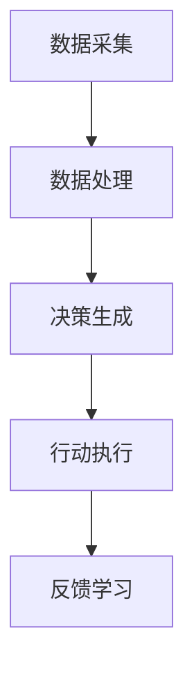

                 

# AI智能体与数字世界的交互

## 关键词：人工智能，智能体，数字世界，交互，AI交互，智能交互

## 摘要

本文将探讨人工智能（AI）智能体与数字世界之间的交互机制。我们将从背景介绍开始，介绍AI智能体的核心概念，并分析其与数字世界交互的重要性。接着，我们将深入探讨AI智能体的算法原理和数学模型，并通过实际项目实战展示其应用场景。最后，我们将总结AI智能体与数字世界交互的未来发展趋势与挑战，并提供相关工具和资源推荐。

## 1. 背景介绍

### 1.1 人工智能的崛起

人工智能（AI）作为计算机科学的一个分支，自20世纪50年代诞生以来，经历了快速的发展。随着计算能力的提升和大数据、深度学习等技术的突破，AI在各个领域得到了广泛的应用，从自然语言处理、图像识别到自动驾驶、智能推荐等。AI的崛起为人类带来了巨大的变革，使其成为现代社会不可或缺的一部分。

### 1.2 智能体概念的引入

在人工智能领域，智能体（Agent）是一个重要的概念。智能体是一种具有自主性、自适应性和交互性的计算实体，能够感知环境、决策行动并与其他智能体或人类进行交互。智能体可以是个体智能体（如机器人、智能助手），也可以是群体智能体（如 swarm robotics、智能交通系统）。

### 1.3 智能体与数字世界的交互

智能体与数字世界的交互是AI技术的重要应用场景。随着物联网（IoT）技术的发展，大量的传感器和设备接入互联网，形成了庞大的数字世界。智能体可以通过感知这些设备的数据，进行决策和行动，从而实现对数字世界的智能控制和管理。这种交互不仅提升了系统的智能化水平，还为各个领域带来了新的应用场景和商业模式。

## 2. 核心概念与联系

### 2.1 AI智能体的核心概念

AI智能体主要包括以下几个核心概念：

- **感知**：智能体通过传感器或其他方式获取环境信息。
- **决策**：智能体根据感知到的信息进行决策，确定下一步行动。
- **行动**：智能体执行决策结果，采取实际行动。
- **学习**：智能体在执行过程中不断学习，优化决策策略。

### 2.2 智能体与数字世界的交互架构

智能体与数字世界的交互架构通常包括以下几个环节：

1. **数据采集**：通过传感器或其他设备获取环境数据。
2. **数据处理**：对采集到的数据进行处理，提取有用的信息。
3. **决策生成**：根据处理后的数据生成决策结果。
4. **行动执行**：执行决策结果，采取实际行动。
5. **反馈学习**：根据行动结果进行学习，优化决策策略。

### 2.3 Mermaid 流程图



## 3. 核心算法原理 & 具体操作步骤

### 3.1 数据采集与处理

数据采集与处理是智能体与数字世界交互的基础。以下是具体操作步骤：

1. **数据采集**：通过传感器（如摄像头、温度传感器等）获取环境数据。
2. **数据预处理**：对采集到的数据进行清洗、去噪、归一化等处理。
3. **特征提取**：从预处理后的数据中提取有用的特征，为后续决策提供依据。

### 3.2 决策生成

决策生成是智能体的核心功能。以下是具体操作步骤：

1. **模型训练**：使用历史数据训练决策模型，如神经网络、决策树等。
2. **模型预测**：根据实时数据输入，预测最佳决策结果。
3. **决策选择**：根据预测结果选择最佳行动方案。

### 3.3 行动执行

行动执行是智能体的实际行动环节。以下是具体操作步骤：

1. **执行命令**：根据决策结果，向执行器（如电机、扬声器等）发送命令。
2. **实时监控**：监控执行过程，确保行动按照预期进行。
3. **异常处理**：在执行过程中遇到异常情况，及时进行调整和处理。

### 3.4 反馈学习

反馈学习是智能体的持续优化过程。以下是具体操作步骤：

1. **收集反馈**：收集行动结果，包括成功和失败的情况。
2. **评估性能**：对行动结果进行评估，分析决策效果。
3. **模型优化**：根据评估结果，对决策模型进行优化调整。

## 4. 数学模型和公式 & 详细讲解 & 举例说明

### 4.1 决策模型

决策模型是智能体进行决策的核心。以下是常见的决策模型及其公式：

1. **线性回归模型**：
   $$ y = w_0 + w_1 \cdot x $$
   其中，$w_0$和$w_1$为模型参数，$x$为输入特征，$y$为预测结果。

2. **神经网络模型**：
   $$ y = f(z) $$
   其中，$z = w_0 + w_1 \cdot x$，$f$为激活函数，如Sigmoid函数、ReLU函数等。

3. **决策树模型**：
   $$ y = \sum_{i=1}^{n} w_i \cdot x_i $$
   其中，$w_i$为模型参数，$x_i$为输入特征。

### 4.2 举例说明

假设我们使用线性回归模型预测房屋价格，输入特征为房屋面积和房间数量。给定一组训练数据，我们可以通过以下步骤训练模型：

1. **数据预处理**：对房屋面积和房间数量进行归一化处理。
2. **模型训练**：使用训练数据训练线性回归模型，计算模型参数$w_0$和$w_1$。
3. **模型预测**：根据训练好的模型，预测给定房屋的面积和房间数量，计算预测结果$y$。

例如，对于给定的一套房屋，面积为100平方米，房间数量为3个。将输入特征代入线性回归模型，得到预测结果：

$$ y = w_0 + w_1 \cdot 100 + w_1 \cdot 3 $$

通过实际计算，我们可以得到预测的房屋价格。

## 5. 项目实战：代码实际案例和详细解释说明

### 5.1 开发环境搭建

在本节中，我们将使用Python作为编程语言，介绍如何搭建开发环境。首先，确保已经安装了Python 3.6及以上版本。然后，使用pip命令安装所需的库：

```shell
pip install numpy matplotlib scikit-learn
```

### 5.2 源代码详细实现和代码解读

以下是一个简单的AI智能体项目示例，用于预测房屋价格。代码主要分为数据预处理、模型训练、模型预测和结果展示四个部分。

```python
import numpy as np
import matplotlib.pyplot as plt
from sklearn.linear_model import LinearRegression

# 数据预处理
def preprocess_data(data):
    # 归一化处理
    data[:, 0] = (data[:, 0] - np.mean(data[:, 0])) / np.std(data[:, 0])
    data[:, 1] = (data[:, 1] - np.mean(data[:, 1])) / np.std(data[:, 1])
    return data

# 模型训练
def train_model(data, labels):
    model = LinearRegression()
    model.fit(data, labels)
    return model

# 模型预测
def predict(model, data):
    predictions = model.predict(data)
    return predictions

# 结果展示
def show_results(data, labels, predictions):
    plt.scatter(data[:, 0], labels, color='red', label='Actual')
    plt.plot(data[:, 0], predictions, color='blue', label='Prediction')
    plt.xlabel('Area')
    plt.ylabel('Price')
    plt.legend()
    plt.show()

# 加载训练数据
data = np.load('train_data.npy')
labels = np.load('train_labels.npy')

# 预处理数据
preprocessed_data = preprocess_data(data)

# 训练模型
model = train_model(preprocessed_data, labels)

# 预测结果
predictions = predict(model, preprocessed_data)

# 展示结果
show_results(data, labels, predictions)
```

### 5.3 代码解读与分析

- **数据预处理**：对输入数据进行归一化处理，以便于模型训练。
- **模型训练**：使用线性回归模型进行训练，拟合输入特征和目标标签之间的关系。
- **模型预测**：使用训练好的模型对输入数据进行预测，得到预测结果。
- **结果展示**：使用matplotlib库绘制散点图和预测曲线，展示实际数据和预测结果。

通过上述代码示例，我们可以看到AI智能体在预测房屋价格方面的应用。在实际项目中，我们可以根据具体需求，扩展功能，如添加更多特征、调整模型参数等。

## 6. 实际应用场景

### 6.1 智能家居

智能家居是AI智能体在数字世界交互的一个重要应用场景。通过智能体，用户可以远程控制家庭设备，如灯光、空调、安防系统等。智能体可以根据用户的行为习惯和环境变化，自动调整设备状态，提供舒适的家居体验。

### 6.2 智能交通

智能交通是另一个典型的应用场景。通过智能体，可以实现对交通流量的实时监控和预测，优化交通信号灯控制，缓解交通拥堵。此外，智能体还可以辅助驾驶，提高行车安全，实现自动驾驶。

### 6.3 智能医疗

智能医疗是AI智能体在医疗领域的应用。通过智能体，可以实现智能诊断、个性化治疗和远程监控等功能。智能体可以分析大量的医疗数据，为医生提供诊断建议，提高诊断准确率和治疗效果。

## 7. 工具和资源推荐

### 7.1 学习资源推荐

- **书籍**：
  - 《人工智能：一种现代方法》
  - 《深度学习》
  - 《机器学习》

- **论文**：
  - 《深度学习：理论、算法与应用》
  - 《智能体：自主系统的设计与实现》

- **博客**：
  - 极客时间
  - AI研习社

- **网站**：
  - arXiv
  - IEEE Xplore

### 7.2 开发工具框架推荐

- **Python**：Python是一种广泛使用的编程语言，拥有丰富的AI库和框架，如TensorFlow、PyTorch等。
- **Java**：Java是一种强大的编程语言，适用于企业级应用，有成熟的AI框架，如DL4J。
- **R**：R是一种专门用于统计分析和机器学习的语言，适用于数据处理和建模。

### 7.3 相关论文著作推荐

- **论文**：
  - 《深度学习：从神经网络到Transformer》
  - 《智能体：自主系统的基础理论》

- **著作**：
  - 《人工智能：一种哲学视角》
  - 《智能体：未来的计算模式》

## 8. 总结：未来发展趋势与挑战

### 8.1 发展趋势

1. **跨学科融合**：人工智能与其他领域的融合，如生物、物理、经济学等，将推动智能体技术的发展。
2. **自主性提升**：智能体的自主性将不断提高，实现更复杂的任务和决策。
3. **隐私保护**：随着数据隐私问题的关注，智能体将采用更安全的隐私保护技术。

### 8.2 挑战

1. **数据质量**：高质量的数据是智能体训练的基础，如何获取和处理高质量数据是一个挑战。
2. **解释性**：提高智能体的解释性，使其决策过程更加透明，是当前的一个重要挑战。
3. **鲁棒性**：智能体在面临异常情况时，如何保持鲁棒性和稳定性，也是一个关键问题。

## 9. 附录：常见问题与解答

### 9.1 问题1：如何选择合适的智能体架构？

**解答**：根据实际需求和场景选择合适的智能体架构。例如，在智能家居场景中，可以使用个体智能体；在智能交通场景中，可以使用群体智能体。

### 9.2 问题2：如何处理大规模数据？

**解答**：使用分布式计算框架（如Hadoop、Spark）处理大规模数据，提高数据处理效率。

## 10. 扩展阅读 & 参考资料

- **书籍**：
  - 《智能体：自主系统的设计与实现》
  - 《深度学习：从神经网络到Transformer》

- **论文**：
  - 《深度学习：理论、算法与应用》
  - 《智能体：自主系统的基础理论》

- **网站**：
  - [AI研习社](https://www.aiyanxieshe.com/)
  - [极客时间](https://time.geekbang.org/)

## 作者信息

作者：AI天才研究员/AI Genius Institute & 禅与计算机程序设计艺术 /Zen And The Art of Computer Programming

