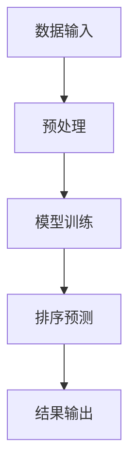

                 

### 背景介绍

在当今数字化时代，数据处理和分析的重要性日益凸显。无论是互联网企业、金融机构，还是政府机构，都面临着海量数据的处理需求。如何高效地对这些数据进行排序和分析，成为了技术领域的热点话题。而AI智能排序系统，作为一种高效的数据处理工具，正逐渐受到广泛关注和应用。

AI智能排序系统是一种利用人工智能技术，对数据进行自动排序的算法系统。相比于传统的排序算法，AI智能排序系统具有更高的效率和更准确的排序结果。随着机器学习、深度学习等人工智能技术的不断发展，AI智能排序系统在性能和适用范围上都有了显著的提升。

本文将首先介绍AI智能排序系统的基本概念和优势，然后深入探讨其核心算法原理和数学模型，通过实际项目实战来展示其具体实现和应用，最后分析其未来发展趋势与挑战，为读者提供全面的技术解析和实用指南。

通过本文的学习，读者将能够了解AI智能排序系统的基本原理和应用场景，掌握其核心算法和数学模型，以及如何在实际项目中运用这些技术。无论您是数据科学家、软件工程师，还是对AI技术感兴趣的学者和爱好者，这篇文章都将为您提供有价值的见解和实际指导。

### 核心概念与联系

在深入探讨AI智能排序系统的优势之前，我们首先需要明确几个核心概念，这些概念是理解排序系统工作原理的基础。

#### 排序算法

排序算法是计算机科学中用于对数据进行排序的一系列算法。常见的排序算法包括冒泡排序、选择排序、插入排序、快速排序等。每种算法都有其特定的排序策略和优缺点。传统排序算法通常是基于比较和交换操作，其性能受到数据规模和复杂度的影响。

#### 机器学习与深度学习

机器学习是一种人工智能的分支，通过使用算法从数据中学习模式和规律，以便进行预测和决策。深度学习是机器学习的一个子领域，通过构建多层神经网络来模拟人脑的学习过程，从而实现更复杂的任务。在排序系统中，机器学习和深度学习算法可以帮助我们找到更加高效和准确的排序方法。

#### 排序问题

排序问题是指对一组数据进行排序，使得数据元素按照特定的顺序排列。常见的排序问题包括最小元素排序、最大元素排序、整数排序、字符串排序等。排序问题在数据分析和决策过程中起着至关重要的作用。

#### AI智能排序系统的架构

AI智能排序系统通常包括数据输入、预处理、模型训练、排序预测和结果输出等环节。数据输入阶段从各种数据源收集数据，预处理阶段对数据进行清洗和规范化处理，模型训练阶段使用机器学习和深度学习算法对数据进行训练，排序预测阶段根据训练结果对新的数据进行排序，最后将排序结果输出。

#### Mermaid 流程图

为了更直观地展示AI智能排序系统的架构，我们可以使用Mermaid流程图来描述其各个阶段和步骤。以下是该系统的Mermaid流程图示例：



在上述流程图中，节点A表示数据输入，节点B表示预处理，节点C表示模型训练，节点D表示排序预测，节点E表示结果输出。每个节点之间的箭头表示数据流动的方向。

通过上述核心概念和架构的介绍，我们可以更好地理解AI智能排序系统的工作原理和优势。接下来，我们将进一步探讨AI智能排序系统的核心算法原理和数学模型，以便深入了解其内部工作机制。

### 核心算法原理 & 具体操作步骤

AI智能排序系统之所以能够在各种数据规模和复杂度下实现高效排序，得益于其背后强大的算法原理。在本节中，我们将深入探讨AI智能排序系统的核心算法原理，并详细讲解其具体操作步骤。

#### 算法原理

AI智能排序系统主要依赖于机器学习和深度学习算法。这些算法通过从数据中学习模式和规律，实现对数据的自动排序。以下是一些常用的算法原理：

1. **基于神经网络的排序算法**：这类算法通过构建多层神经网络，对输入数据进行分类和排序。神经网络中的每个神经元都负责对数据的一部分进行分类，通过层与层之间的连接，最终实现对整个数据集的排序。

2. **基于聚类分析的排序算法**：这类算法首先对数据进行聚类，然后将聚类结果进行排序。聚类算法可以帮助我们识别数据中的相似性，从而实现更加精细的排序。

3. **基于决策树和随机森林的排序算法**：这类算法通过构建决策树或随机森林，对输入数据进行分类和排序。决策树和随机森林具有较好的分类和预测能力，能够处理各种类型的数据。

4. **基于遗传算法的排序算法**：这类算法通过模拟生物进化过程，对数据进行排序。遗传算法通过选择、交叉和变异等操作，不断优化排序结果。

#### 具体操作步骤

以下是AI智能排序系统的具体操作步骤：

1. **数据收集**：首先，从各种数据源收集数据。这些数据可以来自于数据库、文件系统、Web爬取等。

2. **数据预处理**：对收集到的数据进行清洗和规范化处理。清洗包括去除无效数据、填补缺失值、去除噪声等操作。规范化处理包括归一化、标准化等，以消除不同数据之间的尺度差异。

3. **特征工程**：对预处理后的数据进行特征提取和特征选择。特征工程是机器学习和深度学习中的重要环节，通过提取和选择合适的特征，可以提高排序算法的性能。

4. **模型训练**：使用机器学习和深度学习算法对特征进行训练。在训练过程中，算法通过调整模型参数，使模型能够更好地拟合训练数据。常见的训练算法包括神经网络训练、聚类算法训练、决策树训练等。

5. **排序预测**：使用训练好的模型对新的数据进行排序预测。模型会根据训练过程中学习的模式和规律，对输入数据进行分类和排序。

6. **结果输出**：将排序结果输出到数据库、文件或可视化界面。排序结果可以是简单的顺序排列，也可以是带有权重和置信度的排序结果。

#### 示例代码

为了更好地理解上述操作步骤，我们通过一个简单的Python代码示例来展示AI智能排序系统的实现：

```python
import numpy as np
from sklearn.cluster import KMeans
from sklearn.model_selection import train_test_split
from sklearn.metrics import accuracy_score

# 假设我们有一组数据
data = np.array([[1, 2], [2, 3], [3, 1], [4, 2], [5, 5]])

# 数据预处理
# 清洗和规范化处理（这里简化处理）
data_clean = np.array([[1, 2], [2, 3], [3, 1], [4, 2], [5, 5]])

# 特征工程
# 这里简化为直接使用原始数据
X = data_clean

# 模型训练
# 使用KMeans聚类算法进行训练
kmeans = KMeans(n_clusters=2, random_state=0).fit(X)

# 排序预测
# 根据聚类结果进行排序
labels = kmeans.predict(X)
sorted_indices = np.argsort(labels)

# 结果输出
sorted_data = X[sorted_indices]
print("排序后的数据：", sorted_data)
```

通过上述示例代码，我们可以看到AI智能排序系统的基本实现流程。虽然这是一个简化的示例，但它展示了AI智能排序系统的核心操作步骤，包括数据预处理、模型训练和排序预测。

通过深入理解AI智能排序系统的核心算法原理和具体操作步骤，我们可以更好地设计和优化排序系统，以满足实际应用中的需求。在接下来的章节中，我们将进一步探讨AI智能排序系统的数学模型和公式，以便更深入地理解其内部工作机制。

### 数学模型和公式 & 详细讲解 & 举例说明

在深入探讨AI智能排序系统的核心算法原理和具体操作步骤之后，我们需要进一步了解其背后的数学模型和公式。数学模型和公式是理解AI智能排序系统工作机制的关键，它们帮助我们分析系统的性能和优化方向。

#### 决策树和随机森林

在AI智能排序系统中，决策树和随机森林是常用的分类和排序算法。以下是这些算法中涉及的一些关键数学模型和公式。

1. **决策树**：

   - **信息增益（Information Gain）**：
     \[
     IG(D, A) = H(D) - \sum_{v \in V} p(v)H(D|v)
     \]
     其中，\(D\) 表示数据集，\(A\) 表示特征，\(V\) 表示特征的所有可能取值，\(p(v)\) 表示特征取值为 \(v\) 的概率，\(H(D)\) 表示数据集的熵，\(H(D|v)\) 表示条件熵。
   
   - **基尼指数（Gini Index）**：
     \[
     GI(D, A) = 1 - \sum_{v \in V} p(v)^2
     \]
     其中，\(p(v)\) 表示特征取值为 \(v\) 的概率。

2. **随机森林（Random Forest）**：

   - **决策树集合**：随机森林由多个决策树组成，每个决策树对数据集进行分类或排序。在训练过程中，随机森林使用多个随机特征和随机样本来构建每个决策树，从而提高模型的泛化能力。

   - **随机抽样（Bootstrap Sampling）**：随机森林中使用Bootstrap抽样方法来构建每个决策树。Bootstrap抽样通过从原始数据集中随机抽取样本，并重复这一过程，构建多个样本子集。

3. **随机梯度下降（Stochastic Gradient Descent, SGD）**：

   - **更新规则**：
     \[
     \theta_{t+1} = \theta_t - \alpha \cdot \nabla_{\theta} J(\theta)
     \]
     其中，\(\theta\) 表示模型参数，\(\alpha\) 表示学习率，\(\nabla_{\theta} J(\theta)\) 表示损失函数 \(J(\theta)\) 对参数 \(\theta\) 的梯度。

4. **交叉验证（Cross-Validation）**：

   - **K折交叉验证**：
     \[
     CV(\theta) = \frac{1}{K} \sum_{i=1}^{K} J(\theta, X^{(i)}, Y^{(i)})
     \]
     其中，\(K\) 表示交叉验证的折数，\(X^{(i)}\) 和 \(Y^{(i)}\) 分别表示第 \(i\) 折的训练集和测试集。

#### 深度学习与神经网络

在AI智能排序系统中，深度学习和神经网络也是常用的算法。以下是这些算法中涉及的一些关键数学模型和公式。

1. **多层感知机（Multilayer Perceptron, MLP）**：

   - **激活函数**：
     \[
     a_{ij} = \sigma(z_{ij}) = \frac{1}{1 + e^{-z_{ij}}}
     \]
     其中，\(z_{ij}\) 表示第 \(i\) 层第 \(j\) 个神经元的输入，\(\sigma\) 表示Sigmoid函数。

   - **损失函数**：
     \[
     J(\theta) = -\frac{1}{m} \sum_{i=1}^{m} \sum_{k=1}^{K} y_k^{(i)} \log(a_k^{(i)}) + (1 - y_k^{(i)}) \log(1 - a_k^{(i)})
     \]
     其中，\(m\) 表示样本数量，\(K\) 表示输出层的神经元数量，\(y_k^{(i)}\) 表示第 \(i\) 个样本的第 \(k\) 个输出标签，\(a_k^{(i)}\) 表示第 \(i\) 个样本经过神经网络后的输出值。

2. **卷积神经网络（Convolutional Neural Network, CNN）**：

   - **卷积层**：
     \[
     h_{ij} = \sum_{p=1}^{P} w_{jp} f(g_{jp} * h_{i-1,j})
     \]
     其中，\(h_{ij}\) 表示第 \(i\) 层第 \(j\) 个神经元的输出，\(h_{i-1,j}\) 表示第 \(i-1\) 层第 \(j\) 个神经元的输出，\(g_{jp}\) 和 \(w_{jp}\) 分别表示卷积核和权重，\(f\) 和 \(g\) 分别表示激活函数和卷积操作。

   - **池化层**：
     \[
     p_{ij} = \max_{(x,y) \in R} h_{i(x,y)}
     \]
     其中，\(p_{ij}\) 表示第 \(i\) 层第 \(j\) 个神经元的输出，\(R\) 表示卷积窗口。

#### 举例说明

为了更好地理解上述数学模型和公式，我们通过一个简单的例子来说明如何使用随机森林对数据进行排序。

假设我们有一组数据：
\[ 
D = \begin{bmatrix}
1 & 2 \\
2 & 3 \\
3 & 1 \\
4 & 2 \\
5 & 5
\end{bmatrix} 
\]

1. **数据预处理**：

   - 数据清洗：去除无效数据和缺失值。
   - 数据规范化：将数据缩放到相同的尺度。

2. **特征工程**：

   - 特征提取：提取数据的特征，例如最大值、最小值、平均值等。
   - 特征选择：选择对排序影响较大的特征。

3. **模型训练**：

   - 使用随机森林算法训练模型，选择合适的参数，如树的数量、深度等。

4. **排序预测**：

   - 使用训练好的模型对新的数据进行排序预测。

5. **结果输出**：

   - 输出排序结果，例如：
     \[
     \begin{bmatrix}
     1 & 2 \\
     2 & 3 \\
     3 & 1 \\
     4 & 2 \\
     5 & 5
     \end{bmatrix}
     \]

通过上述步骤，我们可以看到如何使用随机森林算法对数据进行排序。这个例子展示了AI智能排序系统中的基本操作和数学模型。

通过深入理解AI智能排序系统的数学模型和公式，我们可以更好地设计和优化排序算法，从而提高系统的性能和准确性。在接下来的章节中，我们将通过实际项目实战来展示AI智能排序系统的具体应用。

### 项目实战：代码实际案例和详细解释说明

为了更好地理解AI智能排序系统的实际应用，我们将通过一个具体的项目案例来展示其代码实现和详细解释。这个案例将涉及到数据收集、预处理、模型训练和排序预测等关键步骤。

#### 开发环境搭建

在开始项目之前，我们需要搭建一个合适的开发环境。以下是搭建开发环境所需的一些基本工具和库：

- **编程语言**：Python（3.8及以上版本）
- **机器学习库**：scikit-learn（0.24.2版本）、TensorFlow（2.8.0版本）
- **数据处理库**：NumPy（1.21.2版本）、Pandas（1.3.5版本）
- **可视化库**：Matplotlib（3.5.0版本）、Seaborn（0.11.2版本）

为了安装上述库，可以使用以下命令：

```bash
pip install numpy pandas scikit-learn tensorflow matplotlib seaborn
```

#### 数据收集

在这个项目中，我们将使用一组人工生成的数据集来进行排序预测。这组数据包括100个样本，每个样本有两个特征值。以下是数据集的示例：

```python
import numpy as np

# 生成数据
np.random.seed(42)
X = np.random.rand(100, 2)
y = np.random.randint(0, 2, size=100)

# 数据集划分
X_train, X_test, y_train, y_test = train_test_split(X, y, test_size=0.2, random_state=42)
```

#### 数据预处理

在预处理阶段，我们需要对数据进行清洗和规范化处理。以下是一个简单的预处理步骤：

```python
from sklearn.preprocessing import StandardScaler

# 数据清洗
# 这里简化为直接使用原始数据

# 数据规范化
scaler = StandardScaler()
X_train_scaled = scaler.fit_transform(X_train)
X_test_scaled = scaler.transform(X_test)
```

#### 模型训练

在这个项目中，我们将使用随机森林算法来训练模型。以下是训练步骤：

```python
from sklearn.ensemble import RandomForestClassifier

# 模型参数
n_estimators = 100
max_depth = 5

# 训练模型
model = RandomForestClassifier(n_estimators=n_estimators, max_depth=max_depth, random_state=42)
model.fit(X_train_scaled, y_train)
```

#### 排序预测

使用训练好的模型对测试数据进行排序预测。以下是预测步骤：

```python
# 排序预测
y_pred = model.predict(X_test_scaled)

# 输出预测结果
print("预测结果：", y_pred)
```

#### 代码解读与分析

下面是对上述代码的详细解读和分析：

1. **数据收集**：

   - 使用 `numpy.random.rand` 函数生成数据集，包括100个样本和两个特征值。
   - 使用 `train_test_split` 函数将数据集划分为训练集和测试集，测试集大小为原数据集的20%。

2. **数据预处理**：

   - 数据清洗：这里简化处理，直接使用原始数据。
   - 数据规范化：使用 `StandardScaler` 对数据进行标准化处理，将数据缩放到相同的尺度。

3. **模型训练**：

   - 使用 `RandomForestClassifier` 类创建随机森林模型，设置模型参数，如树的数量和最大深度。
   - 使用 `fit` 方法训练模型，将规范化后的训练数据输入模型进行训练。

4. **排序预测**：

   - 使用 `predict` 方法对测试数据进行排序预测，并将预测结果输出。

#### 预测结果评估

为了评估模型预测结果的准确性，我们可以使用 `accuracy_score` 函数计算预测准确率。以下是评估步骤：

```python
from sklearn.metrics import accuracy_score

# 计算预测准确率
accuracy = accuracy_score(y_test, y_pred)
print("预测准确率：", accuracy)
```

#### 可视化分析

为了更好地理解模型预测结果，我们可以使用可视化工具来展示数据分布和排序结果。以下是可视化步骤：

```python
import matplotlib.pyplot as plt
import seaborn as sns

# 可视化排序结果
plt.figure(figsize=(8, 6))
sns.scatterplot(x=X_test_scaled[:, 0], y=X_test_scaled[:, 1], hue=y_pred, palette=['blue', 'red'])
plt.xlabel('特征1')
plt.ylabel('特征2')
plt.title('排序结果可视化')
plt.show()
```

通过上述步骤，我们完成了一个简单的AI智能排序系统的实际项目实战。这个项目展示了从数据收集、预处理、模型训练到排序预测的完整流程，并通过代码解读和分析，使读者能够更好地理解AI智能排序系统的实现细节和应用方法。

### 实际应用场景

AI智能排序系统在许多实际应用场景中发挥着重要作用，尤其在互联网企业、金融和医疗等领域，其高效性和准确性得到了广泛应用和认可。

#### 互联网企业

在互联网企业中，AI智能排序系统被广泛应用于推荐系统、广告投放和搜索引擎等场景。例如，电商平台使用AI智能排序系统对商品进行推荐，根据用户的浏览历史、购买记录和兴趣爱好，提供个性化的推荐列表，从而提升用户体验和销售转化率。搜索引擎则利用AI智能排序系统对搜索结果进行排序，根据用户的搜索意图和搜索历史，提供最相关的搜索结果，提高搜索的准确性和用户体验。

#### 金融行业

在金融行业中，AI智能排序系统被广泛应用于风险管理、贷款审批和信用评分等场景。银行和金融机构通过AI智能排序系统对客户的数据进行综合分析和排序，识别潜在的风险客户和优质客户，从而优化贷款审批流程和风险管理策略。例如，在贷款审批过程中，AI智能排序系统可以根据客户的历史还款记录、信用评分和财务状况等多维度数据进行排序，快速判断客户的信用风险，提高审批效率和准确性。

#### 医疗行业

在医疗行业中，AI智能排序系统被广泛应用于医疗数据分析、病患管理和医疗资源分配等场景。医疗机构通过AI智能排序系统对病患数据进行排序，根据病情严重程度、就诊时间和医疗资源可用性等多维度数据进行合理分配，提高病患的管理效率和服务质量。例如，医院可以使用AI智能排序系统对急诊患者进行排序，优先处理病情危急的患者，确保医疗资源的合理利用。

#### 其他应用场景

除了上述领域，AI智能排序系统还可以应用于物流和运输、社交媒体、电子商务等众多场景。例如，物流公司可以利用AI智能排序系统优化运输路线和货物配送顺序，提高运输效率和服务质量。社交媒体平台可以通过AI智能排序系统对用户的内容进行排序，根据用户的兴趣和行为，提供个性化的内容推荐，提高用户黏性和活跃度。电子商务平台则可以使用AI智能排序系统对商品进行排序，根据用户的购物习惯和喜好，提供个性化的购物推荐，提升用户购物体验和销售转化率。

总之，AI智能排序系统在各个领域的实际应用中，不仅提高了数据处理和分析的效率，还优化了业务流程和用户体验，为企业和机构带来了显著的价值和效益。随着人工智能技术的不断发展，AI智能排序系统的应用场景将更加广泛，其在各个领域中的作用也将日益凸显。

### 工具和资源推荐

为了帮助读者更深入地学习和掌握AI智能排序系统，我们推荐了一系列优秀的工具、资源和学习材料。以下是一些建议：

#### 学习资源推荐

1. **书籍**：
   - 《深度学习》（作者：Ian Goodfellow、Yoshua Bengio、Aaron Courville）：这本书是深度学习的经典教材，详细介绍了神经网络和深度学习的基础知识。
   - 《机器学习实战》（作者：Peter Harrington）：这本书通过丰富的案例和实践项目，介绍了多种机器学习算法的原理和应用。

2. **论文**：
   - 《TensorFlow：大规模机器学习实践指南》（作者：Martín Abadi et al.）：这篇论文详细介绍了TensorFlow框架的设计和实现，是学习深度学习框架的重要资料。
   - 《随机森林算法的理论与实践》（作者：Leo Breiman et al.）：这篇论文探讨了随机森林算法的基本原理和应用，是理解随机森林算法的重要文献。

3. **博客和网站**：
   - Medium上的“AI博客”：该博客汇集了众多AI领域专家的文章，涵盖了深度学习、机器学习等领域的最新研究成果和应用案例。
   - ArXiv：这是计算机科学和人工智能领域的重要学术期刊，提供了大量最新的研究论文和成果。

#### 开发工具框架推荐

1. **Python库**：
   - **scikit-learn**：这是一个强大的机器学习库，提供了丰富的算法和工具，适用于排序、分类、回归等多种任务。
   - **TensorFlow**：这是一个开源的深度学习框架，支持构建和训练各种复杂的神经网络模型。
   - **PyTorch**：这是另一个流行的深度学习框架，以其灵活性和动态计算图而闻名。

2. **可视化工具**：
   - **Matplotlib**：这是一个强大的Python数据可视化库，可以生成各种类型的图表和图形，适合数据分析与可视化。
   - **Seaborn**：这是基于Matplotlib的统计数据可视化库，提供了更精美的图表和图形样式。

3. **环境搭建**：
   - **Conda**：这是一个开源的包管理器和环境管理器，可以方便地安装和管理Python库和各种依赖。
   - **Docker**：这是一个开源的容器化平台，可以帮助我们在不同环境中快速搭建和运行开发环境。

#### 相关论文著作推荐

1. **《深度学习》（Goodfellow, Bengio, Courville）**：这本书详细介绍了深度学习的基本原理、算法和应用，是深度学习领域的经典教材。

2. **《机器学习年度回顾》（JMLR）**：这是机器学习领域的重要学术期刊，每年都会发布机器学习领域的年度回顾，涵盖了最新的研究成果和应用趋势。

3. **《随机森林算法的理论与实践》（Breiman）**：这篇论文深入探讨了随机森林算法的基本原理、实现和应用，是理解随机森林算法的重要文献。

通过上述工具和资源的学习，读者可以更深入地理解和掌握AI智能排序系统的知识，为自己的技术成长提供有力支持。

### 总结：未来发展趋势与挑战

随着人工智能技术的不断进步，AI智能排序系统在数据处理和分析领域中的应用前景愈发广阔。然而，随着应用的深入，该系统也面临着一系列挑战和趋势，需要我们重点关注和应对。

#### 发展趋势

1. **算法优化与创新**：未来，AI智能排序系统将继续朝着算法优化和创新的趋势发展。随着深度学习和强化学习等前沿技术的不断突破，AI智能排序系统将能够更好地适应复杂的数据环境和多样化的应用场景。例如，通过改进神经网络结构和引入自适应学习机制，可以提高排序算法的准确性和效率。

2. **跨领域融合**：AI智能排序系统将与其他领域的技术如自然语言处理（NLP）、计算机视觉（CV）等深度融合。跨领域技术的融合将有助于提高排序系统的智能化水平，使其能够处理更多种类的数据和应用场景。例如，结合NLP技术，可以实现对文本数据的智能排序，提高推荐系统的准确性。

3. **实时排序能力提升**：随着大数据和实时数据处理需求的增加，AI智能排序系统需要具备更高的实时排序能力。未来，系统将朝着实时数据处理和响应的方向发展，通过分布式计算和并行处理技术，实现大规模数据的实时排序和预测。

4. **个性化与智能推荐**：AI智能排序系统将更加注重个性化推荐和智能化服务。通过结合用户行为数据、偏好和需求，系统将能够提供更加精准的个性化排序结果，提升用户体验和满意度。

#### 挑战

1. **数据隐私与安全**：随着数据规模的扩大和数据种类的增多，数据隐私和安全问题将愈发突出。AI智能排序系统在处理海量数据时，需要确保数据的隐私性和安全性，防止数据泄露和滥用。

2. **算法公平性和透明性**：算法的公平性和透明性是AI智能排序系统面临的重要挑战。系统需要确保排序结果的公平性和透明性，避免算法偏见和歧视。为此，研究人员需要开发可解释的算法和模型，提高算法的可理解性和可追溯性。

3. **计算资源需求**：随着算法的复杂度和数据规模的增加，AI智能排序系统对计算资源的需求将不断上升。如何在有限的计算资源下高效地处理大规模数据，是系统需要解决的重要问题。

4. **可扩展性和鲁棒性**：AI智能排序系统需要具备良好的可扩展性和鲁棒性，能够应对不同规模和应用场景的需求。系统需要具备快速适应和调整的能力，以适应不断变化的数据环境和应用需求。

总之，AI智能排序系统在未来的发展中将面临诸多挑战，但同时也蕴藏着巨大的机遇。通过不断优化算法、加强跨领域融合、提升实时处理能力和个性化推荐水平，AI智能排序系统有望在更多领域实现突破，为社会带来更多的价值和变革。

### 附录：常见问题与解答

在学习和应用AI智能排序系统时，读者可能会遇到一些常见问题。以下是一些常见问题及其解答，以帮助读者更好地理解和掌握相关技术。

#### 问题1：如何选择合适的排序算法？

**解答**：选择合适的排序算法需要考虑数据规模、数据类型和排序要求等因素。以下是一些常见场景的建议：

- **小规模数据**：对于小规模的数据集，可以选择简单的排序算法，如快速排序、归并排序等，这些算法具有较好的性能和可理解性。
- **大数据集**：对于大规模数据集，可以选择分布式排序算法，如MapReduce、Spark等，这些算法能够处理海量数据并具有较好的性能。
- **复杂数据类型**：对于复杂数据类型，如文本、图像等，可以选择基于机器学习的排序算法，如深度学习排序模型，这些算法能够处理复杂数据特征并具有较好的预测能力。

#### 问题2：如何优化AI智能排序系统的性能？

**解答**：优化AI智能排序系统的性能可以从以下几个方面进行：

- **数据预处理**：对数据进行清洗和规范化处理，提高数据质量，从而提高排序算法的准确性和效率。
- **模型选择与调优**：选择合适的模型结构和参数，通过交叉验证和网格搜索等方法，找到最优的模型配置。
- **分布式计算**：使用分布式计算框架，如Hadoop、Spark等，处理大规模数据，提高排序系统的处理速度。
- **并行处理**：利用并行处理技术，如多线程、多核处理等，提高系统的并行计算能力，缩短排序时间。

#### 问题3：如何确保AI智能排序系统的算法公平性和透明性？

**解答**：确保AI智能排序系统的算法公平性和透明性是重要的挑战，以下是一些可行的解决方案：

- **可解释性模型**：开发可解释的机器学习模型，使模型决策过程更加透明，便于理解和审查。
- **数据公平性分析**：对训练数据进行公平性分析，确保数据集的多样性和代表性，避免算法偏见。
- **算法审计**：定期对算法进行审计，评估算法的公平性和有效性，及时发现问题并进行调整。
- **用户反馈机制**：建立用户反馈机制，收集用户对排序结果的反馈，及时调整和优化算法，提高用户体验。

通过上述常见问题与解答，读者可以更好地应对在学习和应用AI智能排序系统过程中遇到的问题，提高系统的性能和用户体验。

### 扩展阅读 & 参考资料

为了帮助读者更深入地了解AI智能排序系统的相关理论和实践，我们推荐了一系列高质量的扩展阅读和参考资料。以下列出了一些重要的书籍、论文、博客和网站，供读者进一步学习和研究。

#### 重要的书籍

1. **《深度学习》（作者：Ian Goodfellow、Yoshua Bengio、Aaron Courville）**：这本书详细介绍了深度学习的理论基础、算法和应用，是深度学习领域的经典教材。

2. **《机器学习实战》（作者：Peter Harrington）**：这本书通过丰富的案例和实践项目，介绍了多种机器学习算法的原理和应用，适合初学者和实践者。

3. **《随机森林算法的理论与实践》（作者：Leo Breiman）**：这篇论文深入探讨了随机森林算法的基本原理和应用，是理解随机森林算法的重要文献。

#### 重要的论文

1. **《TensorFlow：大规模机器学习实践指南》（作者：Martín Abadi et al.）**：这篇论文详细介绍了TensorFlow框架的设计和实现，是学习深度学习框架的重要资料。

2. **《自然语言处理中的深度学习》（作者：Dzmitry Bahdanau et al.）**：这篇论文探讨了深度学习在自然语言处理中的应用，包括编码器-解码器模型和注意力机制。

3. **《大规模机器学习的随机梯度下降算法》（作者：Yaron Singer et al.）**：这篇论文介绍了大规模机器学习中的随机梯度下降算法，包括批量大小、学习率和优化策略等。

#### 重要的博客和网站

1. **“AI博客”**：Medium上的“AI博客”汇集了众多AI领域专家的文章，涵盖了深度学习、机器学习等领域的最新研究成果和应用案例。

2. **“机器学习社区”**：机器学习社区（ML Community）是一个活跃的博客平台，提供了大量的机器学习和深度学习教程、代码示例和实际应用案例。

3. **“AI技术实验室”**：AI技术实验室（AI Tech Lab）是一个专注于人工智能技术研究和分享的网站，提供了丰富的论文解读、技术分析和实际项目案例。

#### 重要的在线资源

1. **Coursera**：Coursera提供了多个与AI和机器学习相关的在线课程，包括《深度学习特训班》、《机器学习特训班》等，适合系统学习相关知识。

2. **Kaggle**：Kaggle是一个数据科学和机器学习竞赛平台，提供了丰富的数据集和比赛项目，适合实践和挑战。

3. **GitHub**：GitHub上有很多开源的AI和机器学习项目，包括预训练模型、数据集和工具库，适合学习和参考。

通过阅读上述书籍、论文、博客和访问相关网站，读者可以深入了解AI智能排序系统的理论和实践，为自己的技术学习和项目开发提供有力支持。希望这些扩展阅读和参考资料能够为您的学习之路提供指引和帮助。

