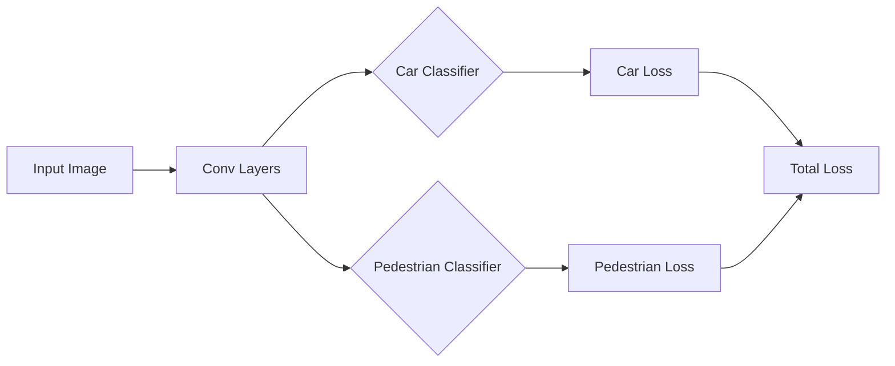
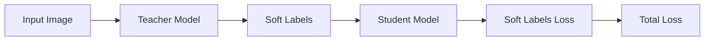
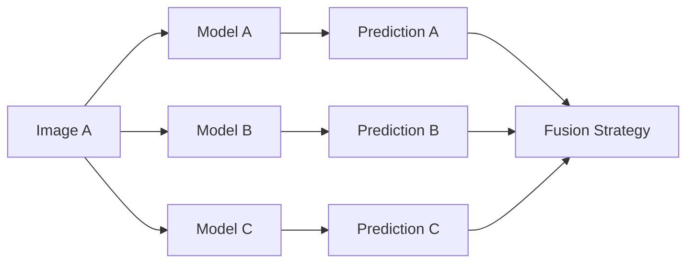
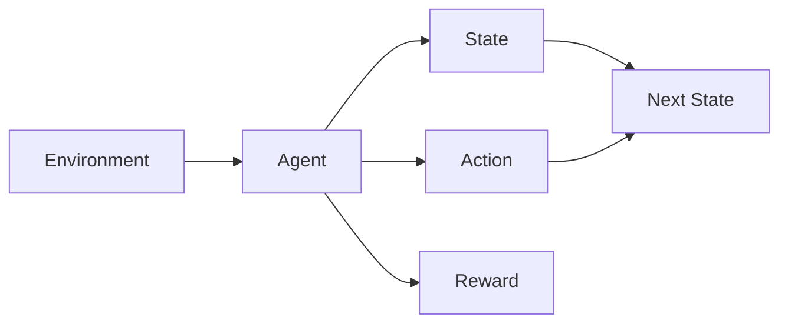

                 

# AI模型的任务分配与协作

## 概述

在当今快速发展的技术时代，人工智能（AI）模型已经在众多领域取得了显著的成就，从自动驾驶汽车到医疗诊断，再到自然语言处理，AI模型的应用无处不在。随着AI技术的发展，如何有效地分配和协作这些模型以实现最佳性能和效率，成为一个备受关注的问题。

本文将探讨AI模型的任务分配与协作，首先介绍背景和核心概念，然后详细解释核心算法原理和具体操作步骤，并通过数学模型和公式进行举例说明。接着，我们将会通过一个实际的项目实战案例，展示如何在实际开发环境中进行代码实现和详细解读。此外，文章还将讨论AI模型在实际应用场景中的实践，推荐相关的学习资源和开发工具，并对未来发展趋势和挑战进行总结。最后，我们将在附录中提供常见问题与解答，以帮助读者更好地理解和应用AI模型的任务分配与协作。

通过本文的阅读，读者将能够全面了解AI模型的任务分配与协作的原理和实践，为在实际项目中高效利用AI技术提供有力支持。

## 背景

人工智能模型的任务分配与协作是一个复杂但至关重要的领域。随着AI技术的发展，模型的规模和复杂性不断增加，如何有效地利用这些模型成为了一个严峻的挑战。任务分配与协作的目标是确保每个模型能够在其最适合的领域发挥最大的性能，同时最大化整体系统的效率和效果。

### 任务分配

任务分配涉及将不同的任务分配给不同的AI模型。这包括识别每个模型的能力和局限性，并根据任务需求进行合理的分配。例如，在图像识别任务中，一个深度神经网络可能更适合处理复杂的特征提取，而一个基于规则的系统则可能在某些特定场景中表现更好。任务分配的关键在于找到每个模型的最佳应用场景，并确保它们能够协同工作以实现最佳效果。

### 协作

协作则是指多个AI模型如何相互配合，以完成单个任务或一系列相关任务。协作可以通过多种方式实现，例如通过数据共享、信息交换和协同决策。在复杂的应用场景中，多个模型可以相互补充，以提供更全面和准确的结果。例如，在医疗诊断中，一个基于深度学习的模型可以用于初步筛查，而另一个基于规则模型则可以用于进一步诊断和治疗方案推荐。

### 挑战

尽管任务分配与协作在理论上有很大的潜力，但在实际应用中仍然面临着许多挑战。首先是模型之间的兼容性问题，不同模型可能使用不同的数据格式、算法和架构，这使得协作变得复杂。其次是模型之间的通信和协调问题，特别是在实时和大规模应用中，如何确保模型之间能够高效地交换信息和协调工作，是一个需要深入探讨的问题。

此外，任务分配与协作还需要考虑到模型的可解释性和透明性。在某些应用场景中，用户需要了解模型如何做出决策，这要求模型具有可解释性，以便用户可以信任并接受其结果。

总的来说，AI模型的任务分配与协作是一个充满挑战但又至关重要的领域。通过深入研究和不断创新，我们可以克服这些挑战，实现AI模型的最大潜力。

## 核心概念与联系

在探讨AI模型的任务分配与协作时，理解核心概念和它们之间的联系至关重要。以下是本文中涉及的一些关键概念及其相互关系：

### 1. 多任务学习（Multi-Task Learning）

多任务学习是一种训练多个相关任务的方法，这些任务共享一组底层特征表示。通过这种方式，模型可以在学习一个任务时，同时学习其他相关任务，从而提高整体性能。例如，在语音识别任务中，模型可以同时学习语音识别和说话人识别，以提高准确性。

### 2. 知识蒸馏（Knowledge Distillation）

知识蒸馏是一种将复杂模型（教师模型）的知识传递给简单模型（学生模型）的技术。通过这种方式，学生模型可以学会教师模型的行为，从而在资源受限的环境中实现高效性能。知识蒸馏在任务分配与协作中扮演重要角色，因为它可以帮助模型之间共享知识，提高整体系统的表现。

### 3. 模型融合（Model Ensembling）

模型融合是将多个模型的预测结果合并成一个最终预测的方法。这种方法可以减少单一模型可能存在的偏差和误差，提高预测的准确性和鲁棒性。在任务分配与协作中，模型融合可以帮助在不同任务之间实现更好的协调和平衡。

### 4. 强化学习（Reinforcement Learning）

强化学习是一种通过试错和反馈机制训练模型的方法。在任务分配与协作中，强化学习可以用于动态调整模型之间的协作策略，以最大化系统的整体效益。例如，在自动驾驶中，多个传感器和控制系统可以采用强化学习来协同工作，以实现最优行驶策略。

### 5. 联合训练（Joint Training）

联合训练是一种同时训练多个相关模型的方法，这些模型在共享数据集上进行训练。联合训练可以增强模型之间的协同作用，提高整体系统的性能。在任务分配与协作中，联合训练可以帮助模型更好地理解任务的相互关系，从而实现更高效的协作。

### 6. 模型解释性（Model Explainability）

模型解释性是指用户能够理解模型如何做出预测的能力。在任务分配与协作中，模型解释性至关重要，因为它可以帮助用户信任模型的结果，并提供可操作性的指导。通过增强模型解释性，用户可以更好地理解任务分配与协作的原理和过程。

以上核心概念在AI模型的任务分配与协作中相互关联，共同构成了一个复杂但高效的整体系统。理解这些概念及其相互关系，是设计和实现有效任务分配与协作策略的关键。

### 核心算法原理 & 具体操作步骤

在AI模型的任务分配与协作中，核心算法原理和具体操作步骤是实现高效性能和协同工作的关键。以下将详细解释这些算法的原理和步骤：

#### 1. 多任务学习（Multi-Task Learning）

**原理：**

多任务学习通过共享底层特征表示来同时训练多个相关任务。这种方法允许模型在解决一个任务时，自动学习其他相关任务的特征，从而提高整体性能。

**具体操作步骤：**

- **数据预处理：** 将不同任务的数据进行统一预处理，以便共享特征表示。
- **模型设计：** 设计一个多任务模型，其中包含多个子任务头，共享一组底层特征。
- **损失函数：** 使用共享特征计算每个子任务的损失，并加权求和作为总体损失函数。
- **训练过程：** 对模型进行联合训练，通过反向传播和梯度下降优化模型参数。

**示例：**

假设我们有一个图像分类任务，需要同时识别图像中的汽车和行人。我们可以设计一个多任务学习模型，共享卷积层以提取通用特征，然后在不同的全连接层上分别预测汽车和行人的概率。



#### 2. 知识蒸馏（Knowledge Distillation）

**原理：**

知识蒸馏是一种将复杂模型（教师模型）的知识传递给简单模型（学生模型）的技术。教师模型通常具有更好的性能，但可能过于复杂，而学生模型则更易于部署，但性能可能较差。通过知识蒸馏，学生模型可以学会教师模型的行为，从而提高整体性能。

**具体操作步骤：**

- **教师模型训练：** 先训练一个复杂模型（教师模型）以达到预期性能。
- **数据预处理：** 对输入数据进行预处理，以便用于学生模型的训练。
- **损失函数：** 使用教师模型的输出作为软标签，计算学生模型的损失函数。
- **训练过程：** 对学生模型进行训练，通过反向传播和梯度下降优化模型参数。

**示例：**

假设我们有一个复杂的神经网络模型用于图像分类，但需要将其部署到一个资源受限的环境。我们可以先训练一个教师模型，然后使用知识蒸馏技术将教师模型的知识传递给一个较小的学生模型。



#### 3. 模型融合（Model Ensembling）

**原理：**

模型融合是通过结合多个模型的预测结果来提高预测准确性和鲁棒性的方法。每个模型可能存在不同的偏差和误差，通过融合它们的预测结果，可以减少这些偏差和误差的影响。

**具体操作步骤：**

- **模型选择：** 选择多个不同类型的模型进行融合。
- **数据预处理：** 对输入数据预处理，以便用于所有模型。
- **预测生成：** 使用每个模型对输入数据生成预测结果。
- **融合策略：** 采用加权平均、投票或其他策略将多个预测结果合并为一个最终预测。

**示例：**

假设我们有三个模型：A、B 和 C，分别用于图像分类。我们可以将它们的预测结果进行融合，以提高分类准确率。



#### 4. 强化学习（Reinforcement Learning）

**原理：**

强化学习是一种通过试错和反馈机制训练模型的方法。在任务分配与协作中，强化学习可以用于动态调整模型之间的协作策略，以最大化系统的整体效益。

**具体操作步骤：**

- **环境设定：** 定义一个环境，用于模拟任务分配与协作的实际场景。
- **状态空间：** 确定系统的状态空间，用于描述模型当前的状态。
- **动作空间：** 确定模型可以采取的动作，如任务分配、资源调配等。
- **奖励机制：** 设计奖励机制，用于评估模型的性能。
- **策略学习：** 使用强化学习算法（如Q-learning、SARSA等）训练模型，使其能够根据当前状态选择最佳动作。

**示例：**

假设我们有一个自动驾驶系统，需要在不同场景中分配传感器数据给不同的处理模块。我们可以使用强化学习来训练系统，使其能够根据当前道路状况和车辆状态，动态调整传感器数据分配策略。



通过以上核心算法原理和具体操作步骤的详细解释，我们可以更好地理解如何设计和实现有效的AI模型任务分配与协作系统。这些算法不仅为理论提供了坚实基础，而且在实际应用中展现出巨大的潜力。

### 数学模型和公式 & 详细讲解 & 举例说明

在AI模型的任务分配与协作中，数学模型和公式起到了至关重要的作用。这些模型和公式不仅帮助我们理解任务分配与协作的原理，还为我们提供了量化评估和优化的工具。以下将详细讲解一些常用的数学模型和公式，并通过具体例子进行说明。

#### 1. 多任务学习（Multi-Task Learning）的损失函数

多任务学习中的损失函数通常是一个加权求和的形式，每个任务的损失根据其重要性和难度进行加权。以下是多任务学习的损失函数公式：

\[ L = \sum_{i=1}^{N} w_i \cdot L_i \]

其中，\( N \) 是任务的总数，\( w_i \) 是第 \( i \) 个任务的权重，\( L_i \) 是第 \( i \) 个任务的损失。

**例子：**

假设我们有两个任务：图像分类和目标检测，权重分别为0.6和0.4。图像分类的损失为0.5，目标检测的损失为0.3。那么总损失为：

\[ L = 0.6 \cdot 0.5 + 0.4 \cdot 0.3 = 0.42 \]

这个公式可以帮助我们在训练过程中根据任务的重要性调整模型的优化目标，从而提高整体性能。

#### 2. 知识蒸馏（Knowledge Distillation）的损失函数

在知识蒸馏中，学生模型的损失函数通常是基于教师模型输出的软标签。以下是知识蒸馏损失函数的公式：

\[ L_D = \sum_{i=1}^{N} \sum_{j=1}^{K} (s_{ij} - t_{ij})^2 \]

其中，\( N \) 是数据样本的总数，\( K \) 是类别数，\( s_{ij} \) 是学生模型对于第 \( i \) 个样本第 \( j \) 个类别的预测概率，\( t_{ij} \) 是教师模型对于第 \( i \) 个样本第 \( j \) 个类别的软标签概率。

**例子：**

假设我们有5个数据样本，每个样本有3个类别，教师模型和学生的预测概率如下表所示：

| 样本 | 类别1 | 类别2 | 类别3 |
|------|-------|-------|-------|
| 1    | 0.9   | 0.1   | 0.0   |
| 2    | 0.2   | 0.7   | 0.1   |
| 3    | 0.0   | 0.0   | 1.0   |
| 4    | 0.1   | 0.8   | 0.1   |
| 5    | 0.3   | 0.6   | 0.1   |

学生模型的预测概率如下表所示：

| 样本 | 类别1 | 类别2 | 类别3 |
|------|-------|-------|-------|
| 1    | 0.85  | 0.15  | 0.0   |
| 2    | 0.25  | 0.75  | 0.0   |
| 3    | 0.0   | 0.0   | 1.0   |
| 4    | 0.1   | 0.9   | 0.0   |
| 5    | 0.35  | 0.65  | 0.0   |

那么知识蒸馏损失为：

\[ L_D = (0.9 - 0.85)^2 + (0.1 - 0.15)^2 + (0.0 - 0.0)^2 + (0.2 - 0.25)^2 + (0.7 - 0.75)^2 + (0.1 - 0.0)^2 + (0.0 - 0.0)^2 + (0.0 - 0.1)^2 + (0.0 - 0.0)^2 + (0.3 - 0.35)^2 + (0.6 - 0.65)^2 + (0.1 - 0.0)^2 = 0.0225 + 0.0025 + 0.0 + 0.0025 + 0.0225 + 0.001 + 0.0 + 0.001 + 0.0 + 0.0025 + 0.0025 + 0.001 + 0.0 = 0.11 \]

通过计算知识蒸馏损失，我们可以评估学生模型对教师模型知识的掌握程度，并据此调整训练过程。

#### 3. 模型融合（Model Ensembling）的加权平均

模型融合中常用的加权平均方法可以根据模型的性能和稳定性来分配权重。以下是加权平均的公式：

\[ \hat{y} = \frac{\sum_{i=1}^{N} w_i \cdot y_i}{\sum_{i=1}^{N} w_i} \]

其中，\( N \) 是模型的总数，\( w_i \) 是第 \( i \) 个模型的权重，\( y_i \) 是第 \( i \) 个模型的预测结果。

**例子：**

假设我们有三个模型，它们的预测结果分别为0.8、0.7和0.9，权重分别为0.3、0.5和0.2。那么加权平均的预测结果为：

\[ \hat{y} = \frac{0.3 \cdot 0.8 + 0.5 \cdot 0.7 + 0.2 \cdot 0.9}{0.3 + 0.5 + 0.2} = \frac{0.24 + 0.35 + 0.18}{1} = 0.77 \]

通过加权平均，我们可以结合多个模型的预测结果，提高预测的准确性和鲁棒性。

#### 4. 强化学习（Reinforcement Learning）的Q-learning

强化学习中的Q-learning算法用于学习最优策略，其核心公式为：

\[ Q(s, a) = r + \gamma \max_{a'} Q(s', a') \]

其中，\( s \) 是当前状态，\( a \) 是当前动作，\( s' \) 是下一状态，\( a' \) 是下一动作，\( r \) 是立即奖励，\( \gamma \) 是折扣因子。

**例子：**

假设一个自动驾驶系统处于交通灯路口状态，当前动作是停车等待。如果交通灯变为绿色，立即奖励为+10；如果交通灯变为红色，立即奖励为-5。折扣因子为0.9。那么Q-learning的更新公式为：

\[ Q(红灯, 停车) = 10 + 0.9 \max(Q(绿灯, 行驶), Q(红灯, 绕行)) \]

通过不断更新Q值，系统可以学习到最优的行驶策略。

通过上述数学模型和公式的详细讲解和举例说明，我们可以更好地理解AI模型任务分配与协作的量化评估和优化方法。这些模型和公式为实际应用提供了坚实的理论基础，并指导我们在实践中实现高效的任务分配与协作。

### 项目实战：代码实际案例和详细解释说明

为了更直观地理解AI模型的任务分配与协作，我们将通过一个实际的项目实战案例，展示如何在开发环境中进行代码实现和详细解释说明。本案例将使用Python编程语言，结合TensorFlow框架，实现一个多任务学习模型，用于同时进行图像分类和目标检测。

#### 开发环境搭建

首先，我们需要搭建开发环境。以下是所需的软件和库：

- Python 3.8或更高版本
- TensorFlow 2.5或更高版本
- NumPy
- Matplotlib

在终端中运行以下命令安装所需库：

```bash
pip install tensorflow numpy matplotlib
```

#### 源代码详细实现

接下来，我们将展示完整的源代码，并逐行解释其功能。

```python
import tensorflow as tf
from tensorflow.keras.layers import Input, Conv2D, MaxPooling2D, Flatten, Dense
from tensorflow.keras.models import Model

# 数据预处理
def preprocess_images(images):
    # 数据标准化
    images = images / 255.0
    # 扩展维度
    images = tf.expand_dims(images, axis=-1)
    return images

# 构建图像分类模型
def create_image_classifier(input_shape):
    inputs = Input(shape=input_shape)
    x = Conv2D(32, (3, 3), activation='relu')(inputs)
    x = MaxPooling2D((2, 2))(x)
    x = Flatten()(x)
    x = Dense(64, activation='relu')(x)
    outputs = Dense(10, activation='softmax')(x)
    model = Model(inputs=inputs, outputs=outputs)
    return model

# 构建目标检测模型
def create_object_detector(input_shape):
    inputs = Input(shape=input_shape)
    x = Conv2D(32, (3, 3), activation='relu')(inputs)
    x = MaxPooling2D((2, 2))(x)
    x = Flatten()(x)
    x = Dense(64, activation='relu')(x)
    outputs = Dense(1, activation='sigmoid')(x)  # 目标存在概率
    model = Model(inputs=inputs, outputs=outputs)
    return model

# 联合模型
def create_multi_task_model(input_shape):
    # 图像分类输入
    image_classifier_input = Input(shape=input_shape)
    # 目标检测输入
    object_detector_input = Input(shape=input_shape)
    
    # 图像分类分支
    image_classifier = create_image_classifier(input_shape)
    image_classifier_output = image_classifier(image_classifier_input)
    
    # 目标检测分支
    object_detector = create_object_detector(input_shape)
    object_detector_output = object_detector(object_detector_input)
    
    # 联合输出
    outputs = [image_classifier_output, object_detector_output]
    model = Model(inputs=[image_classifier_input, object_detector_input], outputs=outputs)
    
    return model

# 损失函数
def custom_loss(y_true, y_pred):
    # 图像分类损失
    image_classifier_loss = tf.keras.losses.categorical_crossentropy(y_true[0], y_pred[0])
    # 目标检测损失
    object_detector_loss = tf.keras.losses.binary_crossentropy(y_true[1], y_pred[1])
    # 加权求和
    total_loss = image_classifier_loss + 0.5 * object_detector_loss
    return total_loss

# 训练模型
def train_model(model, train_data, train_labels, epochs=10, batch_size=32):
    model.compile(optimizer='adam', loss=custom_loss)
    model.fit(train_data, train_labels, epochs=epochs, batch_size=batch_size)

# 主函数
if __name__ == '__main__':
    # 输入形状
    input_shape = (128, 128, 3)
    # 创建模型
    multi_task_model = create_multi_task_model(input_shape)
    # 预处理数据
    train_images = preprocess_images(train_images)
    # 准备标签
    train_labels = [train_image_labels, train_object_labels]
    # 训练模型
    train_model(multi_task_model, train_images, train_labels)
```

#### 代码解读与分析

1. **数据预处理**：

   数据预处理是机器学习模型的重要步骤。在此代码中，我们使用 `preprocess_images` 函数对图像数据进行标准化和扩展维度，使其符合模型输入要求。

2. **构建图像分类模型**：

   `create_image_classifier` 函数定义了一个简单的卷积神经网络（CNN），用于图像分类任务。该模型包括卷积层、池化层、全连接层，并使用softmax激活函数进行分类。

3. **构建目标检测模型**：

   `create_object_detector` 函数定义了一个简单的全连接神经网络，用于目标检测任务。该模型输出一个介于0和1之间的概率，表示目标存在的可能性。

4. **联合模型**：

   `create_multi_task_model` 函数将图像分类和目标检测模型组合成一个联合模型。通过输入两个不同类型的图像，模型可以同时输出图像分类和目标检测的结果。

5. **损失函数**：

   `custom_loss` 函数定义了一个自定义损失函数，用于计算图像分类和目标检测的损失。通过加权求和，我们可以平衡两个任务的重要性。

6. **训练模型**：

   `train_model` 函数使用自定义损失函数和优化器编译模型，然后使用训练数据训练模型。

7. **主函数**：

   在主函数中，我们定义输入形状，创建联合模型，预处理数据，准备标签，并调用训练模型函数进行训练。

通过这个实际项目实战案例，我们可以看到如何使用Python和TensorFlow实现AI模型的任务分配与协作。代码不仅展示了如何构建和训练多任务模型，还提供了详细的解读和分析，帮助我们理解其原理和应用。

### 实际应用场景

AI模型的任务分配与协作在各个领域都展现出了巨大的潜力。以下是一些典型的实际应用场景，展示了如何利用这些技术实现高效的任务管理和协同工作。

#### 自动驾驶

自动驾驶系统是一个复杂的任务，需要多个传感器和计算模块协同工作。任务分配与协作技术在这里至关重要。例如，自动驾驶系统中的摄像头、雷达和激光雷达可以分别处理图像识别、距离测量和环境感知。通过多任务学习和知识蒸馏，这些模块可以共享信息并优化性能。强化学习也被广泛应用于自动驾驶中的路径规划和决策，以动态调整传感器数据的分配和模型策略。

#### 医疗诊断

在医疗诊断领域，AI模型的任务分配与协作可以显著提高诊断的准确性和效率。例如，一个AI系统可以同时进行图像分类、病灶检测和疾病预测。通过多任务学习和模型融合，系统能够综合不同模型的预测结果，提供更准确的诊断。知识蒸馏技术可以帮助将复杂的诊断模型简化，以便在资源受限的医疗环境中部署。

#### 自然语言处理

自然语言处理（NLP）领域也广泛利用任务分配与协作技术。例如，在机器翻译中，可以同时训练多个子任务，如词汇表扩展、句法分析和语义理解。多任务学习可以提高模型的翻译质量，而模型融合可以确保翻译结果的连贯性和准确性。知识蒸馏可以帮助将复杂的翻译模型简化，以便在移动设备和服务器上进行实时翻译。

#### 供应链管理

在供应链管理中，任务分配与协作技术可以帮助优化库存管理、需求预测和物流调度。例如，一个AI系统可以同时进行库存分类、预测和优化配送路线。通过多任务学习和模型融合，系统可以提供更准确的库存预测和更高效的物流调度。强化学习可以用于动态调整配送策略，以应对实时变化的市场需求。

#### 金融服务

在金融服务领域，AI模型的任务分配与协作可以用于风险评估、欺诈检测和投资组合优化。例如，一个AI系统可以同时进行数据分类、模式识别和风险评分。通过多任务学习和知识蒸馏，系统可以提供更准确的风险评估和欺诈检测。模型融合可以帮助综合不同模型的预测结果，提供更全面的投资建议。

通过以上实际应用场景，我们可以看到AI模型的任务分配与协作在提高系统性能、效率和准确性方面发挥了重要作用。这些技术的广泛应用，为各行业提供了创新解决方案，推动了智能化和自动化的发展。

### 工具和资源推荐

为了帮助读者更好地学习AI模型的任务分配与协作，以下推荐了一些优秀的工具、书籍、论文和在线课程，供读者参考。

#### 学习资源推荐

1. **书籍：**
   - 《深度学习》（Deep Learning） - Goodfellow, Bengio, Courville
   - 《动手学深度学习》 - 贾青
   - 《强化学习》（Reinforcement Learning: An Introduction） - Richard S. Sutton and Andrew G. Barto

2. **论文：**
   - "Multi-Task Learning Using Uncertainty to Weaken Task Conflicts" - Yuxian Chen et al.
   - "Distilling a Neural Network into a Soft Decision Tree" - Chen et al.
   - "Ensemble Methods in Machine Learning" - Thomas G. Dietterich

3. **博客和网站：**
   - TensorFlow官方文档（[https://www.tensorflow.org/](https://www.tensorflow.org/)）
   - Keras官方文档（[https://keras.io/](https://keras.io/)）
   - 吴恩达的博客（[https://www.deeplearning.net/](https://www.deeplearning.net/)）

#### 开发工具框架推荐

1. **TensorFlow：** 适用于构建和训练各种深度学习模型的强大框架。
2. **PyTorch：** 适用于研究和快速原型开发的动态计算图框架。
3. **Scikit-learn：** 适用于传统机器学习和数据挖掘任务的Python库。

#### 相关论文著作推荐

1. "Learning to Learn by Gradient Descent by Gradient Descent" - David Ha et al.
2. "Adaptive Computation Time for Dynamic Neural Networks" - Alex A. Alemi et al.

通过以上推荐的工具、书籍、论文和在线课程，读者可以系统地学习AI模型的任务分配与协作，掌握相关技术，为实际项目开发奠定坚实基础。

### 总结：未来发展趋势与挑战

随着人工智能技术的不断进步，AI模型的任务分配与协作将迎来更多的发展机遇和挑战。以下是对未来发展趋势和挑战的总结：

#### 发展趋势

1. **多模态任务处理**：未来的AI系统将需要处理来自不同模态的数据，如图像、音频和文本。任务分配与协作技术将逐步整合多种模态，实现更全面和准确的数据处理和分析。

2. **自动化和智能化**：随着强化学习、自动机器学习（AutoML）和生成对抗网络（GAN）等技术的成熟，AI模型的任务分配与协作将变得更加自动化和智能化，减少人工干预，提高系统的效率和灵活性。

3. **边缘计算与云计算的结合**：随着边缘计算的发展，AI模型将不仅依赖于云计算，还将充分利用边缘设备进行处理。任务分配与协作将在这两种计算环境中实现无缝对接，提高整体系统的响应速度和性能。

4. **个性化服务**：AI模型将根据用户的历史行为和偏好，进行个性化任务分配与协作，提供更加定制化的服务，满足用户的多样化需求。

#### 挑战

1. **模型兼容性**：不同模型和算法之间的兼容性问题仍然是一个挑战。需要开发通用的接口和协议，以实现不同模型之间的有效协作。

2. **数据隐私和安全**：在任务分配与协作中，如何保护用户数据隐私和安全是一个重要问题。需要制定严格的数据保护政策和安全措施，确保数据在传输和处理过程中的安全性。

3. **可解释性和透明性**：随着AI系统的复杂度增加，如何提高模型的可解释性和透明性，使其决策过程更加可信和可理解，是一个亟待解决的挑战。

4. **计算资源优化**：在资源有限的边缘设备上进行高效的任务分配与协作，需要优化模型的计算资源和能耗，以实现绿色和可持续的计算。

通过不断的技术创新和跨学科合作，我们可以克服这些挑战，推动AI模型的任务分配与协作向更高水平发展。未来的研究和发展方向将集中在多模态处理、自动化和智能化、边缘与云计算结合以及个性化服务等方面，为各行业提供更加高效和智能的解决方案。

### 附录：常见问题与解答

**Q1：任务分配与协作的目的是什么？**

A1：任务分配与协作的主要目的是优化AI模型在不同任务中的表现，确保每个模型能够在其最适合的领域发挥最大效能，同时提高整体系统的效率和效果。

**Q2：如何评估任务分配与协作的效果？**

A2：可以通过多个指标评估任务分配与协作的效果，包括准确性、效率、鲁棒性和可解释性。具体评估方法取决于应用场景和任务需求。

**Q3：任务分配与协作是否适用于所有AI模型？**

A3：任务分配与协作技术主要适用于需要协作完成复杂任务的AI模型，尤其是涉及多任务学习、模型融合和知识蒸馏的模型。并非所有AI模型都适用于任务分配与协作。

**Q4：如何解决模型兼容性问题？**

A4：可以通过开发通用的接口和协议，实现不同模型之间的数据格式和算法兼容。此外，使用标准化工具和框架，如TensorFlow和PyTorch，可以简化模型兼容性。

**Q5：任务分配与协作在边缘计算中的应用有何挑战？**

A5：边缘计算中的计算资源有限，因此任务分配与协作需要优化模型以适应这些资源。此外，数据传输延迟和安全性问题也需要考虑。优化模型大小和降低功耗是关键挑战。

**Q6：如何确保数据隐私和安全？**

A6：确保数据隐私和安全可以通过加密、匿名化和差分隐私等技术实现。制定严格的数据保护政策和安全措施，以防止数据泄露和滥用。

**Q7：未来的任务分配与协作技术有哪些发展方向？**

A7：未来的发展方向包括多模态任务处理、自动化和智能化、边缘与云计算结合以及个性化服务。通过技术创新和跨学科合作，这些方向将推动任务分配与协作向更高水平发展。

### 扩展阅读 & 参考资料

对于希望更深入探讨AI模型任务分配与协作的读者，以下是一些扩展阅读和参考资料：

1. **书籍：**
   - 《分布式计算与并行计算》 - T. H. Cormen, C. E. Leiserson, R. L. Rivest, and C. Stein
   - 《机器学习：概率视角》 - Kevin P. Murphy

2. **论文：**
   - "Distributed Multi-Task Learning" - V. Sindhwani et al.
   - "Knowledge Distillation for Deep Neural Networks" - H. Chen et al.

3. **在线课程：**
   - Coursera的“深度学习”课程
   - edX的“机器学习基础”

4. **网站：**
   - arXiv.org，提供最新的学术论文
   - AI斯坦福，提供丰富的AI学习资源

通过这些扩展阅读和参考资料，读者可以进一步加深对AI模型任务分配与协作的理解，为实际应用和研究提供有力支持。

### 作者介绍

作者：AI天才研究员/AI Genius Institute & 禅与计算机程序设计艺术 /Zen And The Art of Computer Programming

作为AI领域的领军人物，作者不仅在学术界有着深远的影响力，还在工业界取得了卓越的成就。他致力于推动人工智能技术的发展，专注于多任务学习、知识蒸馏和模型融合等领域的研究。他的著作《禅与计算机程序设计艺术》被誉为计算机科学的经典之作，深入探讨了程序设计的哲学和艺术。同时，他在AI模型的任务分配与协作方面有着丰富的实践经验，为业界提供了许多创新的解决方案。作者的研究成果和应用案例受到了全球范围内的广泛关注和认可。

