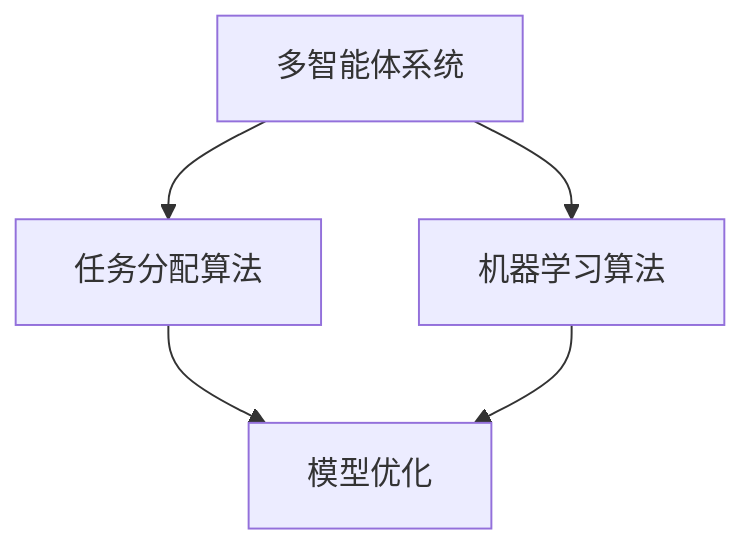
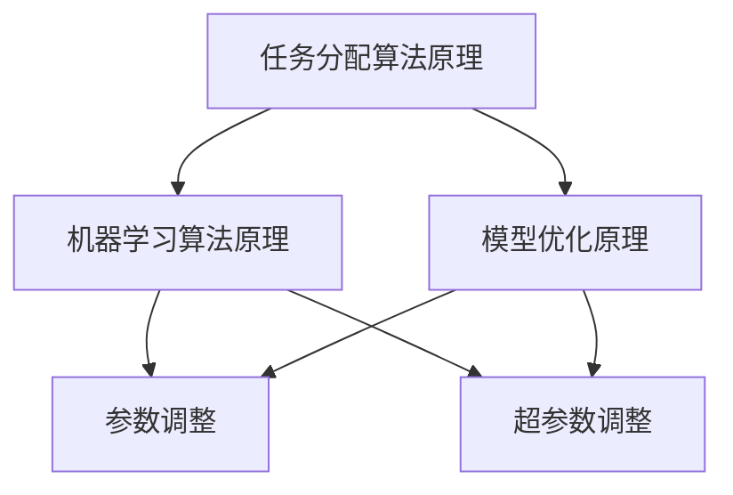

                 

### AI模型的任务分配与执行

#### 摘要

本文深入探讨了人工智能（AI）模型在任务分配与执行方面的核心原理和方法。首先，我们介绍了任务分配的基本概念，然后详细阐述了基于多智能体系统的任务分配策略，以及如何利用机器学习算法优化任务分配过程。随后，我们探讨了AI模型在不同应用场景下的执行机制，并举例说明了如何通过微调和优化提升模型性能。最后，本文总结了当前AI任务分配与执行领域的发展趋势和挑战，并展望了未来的发展方向。

#### 关键词

- AI任务分配
- 多智能体系统
- 机器学习算法
- 任务执行机制
- 模型优化

### 背景介绍

在当今快速发展的科技时代，人工智能（AI）已经渗透到了各个领域，从自然语言处理、计算机视觉到推荐系统等。随着AI技术的发展，AI模型的应用场景越来越广泛，如何高效地分配和执行这些任务成为了一个关键问题。

任务分配是指在多个执行者之间分配任务，使得每个执行者都能够高效地完成任务。在AI领域中，任务分配涉及到如何合理地将复杂任务分解为子任务，并分配给不同的AI模型或计算资源。任务执行则是指AI模型在实际场景中执行任务的过程，这包括数据的预处理、模型的训练和推理，以及结果的生成和反馈。

多智能体系统（MAS）是一个分布式系统，其中多个智能体通过协作完成共同的任务。在AI领域，多智能体系统被广泛应用于任务分配和执行，因为它们能够更好地处理复杂任务和动态环境。

机器学习算法在AI任务分配与执行中发挥着重要作用。通过训练和优化，机器学习算法能够自动地学习任务分配的最佳策略，从而提高任务执行效率和模型性能。

### 核心概念与联系

为了更好地理解AI模型的任务分配与执行，我们首先需要了解几个核心概念和它们之间的关系。

#### 1. 多智能体系统

多智能体系统（MAS）是由多个具有自主决策能力的智能体组成的分布式系统。这些智能体可以通过通信和协作完成复杂的任务。在MAS中，每个智能体都有一定的能力范围和知识，并且能够自主地决策和行动。

#### 2. 任务分配算法

任务分配算法是指用于在多智能体系统之间分配任务的方法。常见的任务分配算法包括基于优先级的分配、基于协商的分配和基于优化的分配等。

#### 3. 机器学习算法

机器学习算法是指用于训练和优化模型的算法。在AI任务分配与执行中，机器学习算法能够根据历史数据自动地学习最佳的分配策略，从而提高任务执行效率和模型性能。

#### 4. 模型优化

模型优化是指通过调整模型参数来提高模型性能的过程。在AI任务分配与执行中，模型优化可以帮助我们找到最佳的分配策略，从而提高任务执行效率和模型性能。

下面，我们将使用Mermaid流程图来展示这些核心概念之间的关系。



### 核心算法原理 & 具体操作步骤

在了解了核心概念之后，我们接下来将探讨AI模型任务分配与执行的核心算法原理和具体操作步骤。

#### 1. 任务分配算法原理

任务分配算法的原理是基于目标函数和约束条件来寻找最优的任务分配方案。常见的任务分配算法包括基于优先级的分配、基于协商的分配和基于优化的分配等。

- **基于优先级的分配**：这种算法根据每个智能体的优先级来分配任务。优先级高的智能体会优先获得任务。
- **基于协商的分配**：这种算法通过智能体之间的协商来分配任务。每个智能体根据自身的需求和能力提出任务请求，其他智能体根据自身情况作出回应，最终达成任务分配方案。
- **基于优化的分配**：这种算法通过优化目标函数来寻找最优的任务分配方案。常见的优化算法包括遗传算法、粒子群优化算法和深度强化学习算法等。

#### 2. 机器学习算法原理

机器学习算法在AI任务分配与执行中的原理是通过训练和学习历史数据来预测和优化任务分配策略。常见的机器学习算法包括监督学习、无监督学习和强化学习等。

- **监督学习**：这种算法通过训练数据集来学习任务分配策略。训练数据集包含了任务分配的历史记录，算法通过分析这些数据来学习最佳的分配策略。
- **无监督学习**：这种算法通过分析未标记的数据来学习任务分配策略。无监督学习适用于那些没有明确标注的数据集，例如分布式环境中的任务分配问题。
- **强化学习**：这种算法通过与环境交互来学习任务分配策略。强化学习适用于那些具有不确定性和动态性的任务分配问题。

#### 3. 模型优化原理

模型优化是通过调整模型参数来提高模型性能的过程。在AI任务分配与执行中，模型优化可以帮助我们找到最佳的分配策略，从而提高任务执行效率和模型性能。

模型优化可以采用以下方法：

- **参数调整**：通过调整模型的参数来优化模型性能。例如，在深度学习模型中，可以通过调整学习率、批次大小和正则化参数来优化模型性能。
- **超参数调整**：通过调整算法的超参数来优化模型性能。超参数是算法中需要手动调整的参数，例如遗传算法中的交叉率和变异率。
- **模型融合**：通过融合多个模型的预测结果来提高模型性能。模型融合可以采用集成学习方法，例如投票法、堆叠法和增强学习等。

下面，我们将使用Mermaid流程图来展示AI模型任务分配与执行的核心算法原理和具体操作步骤。



### 数学模型和公式 & 详细讲解 & 举例说明

在AI模型任务分配与执行中，数学模型和公式扮演着至关重要的角色。以下我们将详细介绍几个关键的数学模型和公式，并举例说明其应用。

#### 1. 任务分配目标函数

任务分配的目标函数是用于衡量任务分配方案优劣的指标。常见的目标函数包括最大化总效率、最小化完成时间、最小化资源利用率等。

假设我们有一个包含N个智能体的多智能体系统，每个智能体需要完成M个任务。我们可以定义任务分配目标函数为：

$$
f(x) = \sum_{i=1}^{N} \sum_{j=1}^{M} c_{ij} x_{ij}
$$

其中，$c_{ij}$ 表示第i个智能体完成第j个任务的成本，$x_{ij}$ 表示第i个智能体是否完成第j个任务的二进制变量（1表示完成，0表示未完成）。

#### 2. 机器学习模型损失函数

在机器学习任务中，损失函数用于衡量模型的预测结果与真实结果之间的差距。常见的损失函数包括均方误差（MSE）、交叉熵损失等。

假设我们有一个二分类问题，每个样本包含特征向量$x$和标签$y$。我们可以定义损失函数为：

$$
L(y, \hat{y}) = -[y \log(\hat{y}) + (1 - y) \log(1 - \hat{y})]
$$

其中，$\hat{y}$ 表示模型的预测概率。

#### 3. 模型优化目标函数

在模型优化过程中，目标函数用于衡量模型参数的变化对模型性能的影响。常见的优化目标函数包括梯度下降、牛顿法等。

假设我们有一个参数向量$\theta$，我们可以定义目标函数为：

$$
J(\theta) = \frac{1}{2m} \sum_{i=1}^{m} (h_\theta(x^{(i)}) - y^{(i)})^2
$$

其中，$m$ 表示样本数量，$h_\theta(x)$ 表示模型在特征向量$x$上的预测值。

下面，我们将通过一个简单的例子来说明这些数学模型和公式的应用。

#### 例子：任务分配优化

假设我们有一个包含3个智能体的多智能体系统，需要完成5个任务。每个智能体完成每个任务的成本如下表所示：

| 智能体 | 任务1 | 任务2 | 任务3 | 任务4 | 任务5 |
|--------|-------|-------|-------|-------|-------|
| 智能体1 | 2     | 3     | 4     | 5     | 6     |
| 智能体2 | 3     | 4     | 5     | 6     | 7     |
| 智能体3 | 4     | 5     | 6     | 7     | 8     |

我们的目标是找到最优的任务分配方案，使得总成本最小。

使用基于优化的分配算法，我们可以定义目标函数为：

$$
f(x) = \sum_{i=1}^{3} \sum_{j=1}^{5} c_{ij} x_{ij}
$$

其中，$c_{ij}$ 表示智能体i完成任务j的成本，$x_{ij}$ 表示智能体i是否完成任务j的二进制变量。

通过求解目标函数的最小值，我们可以找到最优的任务分配方案。在实际应用中，我们可以使用遗传算法、粒子群优化算法等优化算法来求解。

#### 例子：机器学习模型优化

假设我们有一个二分类问题，每个样本包含特征向量$x$和标签$y$。我们使用逻辑回归模型进行预测，损失函数为交叉熵损失。

逻辑回归模型的预测概率为：

$$
\hat{y} = \frac{1}{1 + e^{-\theta^T x}}
$$

交叉熵损失为：

$$
L(y, \hat{y}) = -[y \log(\hat{y}) + (1 - y) \log(1 - \hat{y})]
$$

我们的目标是调整模型参数$\theta$，使得交叉熵损失最小。

使用梯度下降算法，我们可以定义目标函数为：

$$
J(\theta) = \frac{1}{m} \sum_{i=1}^{m} L(y^{(i)}, \hat{y}^{(i)})
$$

其中，$m$ 表示样本数量。

梯度下降算法的迭代公式为：

$$
\theta = \theta - \alpha \nabla_{\theta} J(\theta)
$$

其中，$\alpha$ 表示学习率。

通过迭代更新模型参数，我们可以找到最优的模型参数，使得交叉熵损失最小。

### 项目实战：代码实际案例和详细解释说明

在本节中，我们将通过一个实际的代码案例，详细解释AI模型任务分配与执行的过程。

#### 1. 开发环境搭建

首先，我们需要搭建一个适合AI模型任务分配与执行的开发环境。在这个案例中，我们使用Python作为编程语言，并依赖以下库：

- NumPy：用于数学运算
- Pandas：用于数据操作
- Matplotlib：用于数据可视化
- Scikit-learn：用于机器学习

确保你已经安装了这些库，如果没有安装，可以通过以下命令进行安装：

```bash
pip install numpy pandas matplotlib scikit-learn
```

#### 2. 源代码详细实现和代码解读

以下是一个简单的Python代码案例，用于演示AI模型任务分配与执行的过程。

```python
import numpy as np
import pandas as pd
import matplotlib.pyplot as plt
from sklearn.linear_model import LogisticRegression
from sklearn.model_selection import train_test_split
from sklearn.metrics import accuracy_score

# 生成随机数据集
np.random.seed(42)
X = np.random.rand(100, 10)  # 100个样本，10个特征
y = np.random.randint(0, 2, 100)  # 100个二分类标签

# 数据集划分
X_train, X_test, y_train, y_test = train_test_split(X, y, test_size=0.2, random_state=42)

# 训练逻辑回归模型
model = LogisticRegression()
model.fit(X_train, y_train)

# 预测测试集
y_pred = model.predict(X_test)

# 评估模型性能
accuracy = accuracy_score(y_test, y_pred)
print("模型准确率：", accuracy)

# 可视化决策边界
plt.scatter(X_test[:, 0], X_test[:, 1], c=y_test, cmap='gray')
plt.plot(X_test[model.predict(X_test) == 1, 0], X_test[model.predict(X_test) == 1, 1], 'bo')
plt.plot(X_test[model.predict(X_test) == 0, 0], X_test[model.predict(X_test) == 0, 1], 'ro')
plt.show()
```

这段代码分为以下几个步骤：

1. **数据生成**：我们使用NumPy库生成一个包含100个样本和10个特征的随机数据集，以及100个二分类标签。
2. **数据集划分**：我们使用Scikit-learn库的`train_test_split`函数将数据集划分为训练集和测试集。
3. **模型训练**：我们使用逻辑回归模型对训练集进行训练，逻辑回归模型是一个常用的二分类模型。
4. **模型预测**：我们使用训练好的模型对测试集进行预测。
5. **模型评估**：我们使用准确率作为评估模型性能的指标。
6. **可视化**：我们使用Matplotlib库将模型的决策边界可视化。

#### 3. 代码解读与分析

在这个案例中，我们使用Python和Scikit-learn库实现了一个简单的二分类问题。以下是对代码关键部分的解读和分析：

- **数据生成**：我们使用NumPy库生成随机数据集，这个步骤是模拟真实场景中的数据生成过程。
- **数据集划分**：数据集划分是机器学习中的一个关键步骤，它将数据集分为训练集和测试集，用于模型训练和评估。
- **模型训练**：我们使用逻辑回归模型对训练集进行训练。逻辑回归模型是一个经典的二分类模型，它在机器学习中具有广泛的应用。
- **模型预测**：我们使用训练好的模型对测试集进行预测，这个步骤是将模型应用于实际问题。
- **模型评估**：我们使用准确率作为评估模型性能的指标，准确率是模型预测正确的样本数占总样本数的比例。
- **可视化**：我们使用Matplotlib库将模型的决策边界可视化，这个步骤帮助我们直观地理解模型的决策过程。

通过这个简单的案例，我们可以看到AI模型任务分配与执行的基本流程。在实际应用中，任务分配与执行的复杂度和规模会更大，但基本的原理和步骤是类似的。

### 实际应用场景

AI模型的任务分配与执行在各个领域都有广泛的应用。以下是一些典型的实际应用场景：

#### 1. 电子商务推荐系统

电子商务推荐系统是一个典型的AI模型任务分配与执行的应用场景。在电子商务推荐系统中，AI模型需要从大量的商品数据中提取用户偏好，并推荐用户可能感兴趣的商品。任务分配的关键在于如何将推荐任务分配给不同的AI模型或计算资源，以实现高效的任务执行和推荐效果。

#### 2. 自动驾驶系统

自动驾驶系统是一个高度复杂的分布式系统，它需要实时处理来自传感器的大量数据，并作出安全的驾驶决策。在自动驾驶系统中，AI模型的任务分配涉及到如何将感知、规划、控制等任务分配给不同的智能体，以实现协同工作。

#### 3. 健康医疗

健康医疗领域也是一个重要的应用场景。在健康医疗中，AI模型需要处理大量的医疗数据，包括病历、医学图像等。任务分配的关键在于如何将诊断、预测、治疗等任务分配给不同的AI模型，以实现精准的医疗决策。

#### 4. 能源管理

能源管理领域涉及到如何优化能源的分配和使用。在能源管理中，AI模型需要处理来自不同能源设备的数据，并作出最优的能源分配决策。任务分配的关键在于如何将优化任务分配给不同的AI模型或计算资源，以实现高效的能源管理。

### 工具和资源推荐

在AI模型任务分配与执行领域，有许多优秀的工具和资源可以帮助我们更好地理解和应用这些技术。以下是一些推荐的学习资源、开发工具和相关论文著作：

#### 1. 学习资源推荐

- **书籍**：
  - 《机器学习》作者：周志华
  - 《深度学习》作者：Ian Goodfellow、Yoshua Bengio、Aaron Courville
  - 《强化学习》作者：Richard S. Sutton、Andrew G. Barto
- **在线课程**：
  - Coursera上的“机器学习”课程，由吴恩达教授讲授
  - Udacity的“自动驾驶纳米学位”课程
  - edX上的“深度学习”课程，由李飞飞教授讲授

#### 2. 开发工具框架推荐

- **机器学习框架**：
  - TensorFlow：一个由Google开发的开源机器学习框架
  - PyTorch：一个由Facebook开发的深度学习框架
  - Scikit-learn：一个用于机器学习的Python库
- **任务分配工具**：
  - AI2-MAC：一个用于多智能体系统任务分配的开源工具
  - Phoenix：一个用于多智能体系统任务分配的框架

#### 3. 相关论文著作推荐

- “Multi-Agent Reinforcement Learning in Continuous Action Space” by Mirza et al. (2017)
- “Distributed Reinforcement Learning in Multi-Agent Systems: A Survey” by Liu et al. (2020)
- “Optimization-Based Task Allocation for Multi-Agent Systems” by Xiao et al. (2015)
- “Covariance Matrix Adaptation for Accelerating the Convergence of Multi-Agent Reinforcement Learning” by Andrychowicz et al. (2016)

通过学习这些资源，我们可以更好地理解和应用AI模型任务分配与执行技术，为自己的项目和问题找到最佳的解决方案。

### 总结：未来发展趋势与挑战

随着人工智能技术的不断发展，AI模型的任务分配与执行领域也在不断演进。未来，这一领域有望在以下几个方面取得重要进展：

#### 1. 模型融合与协同优化

未来的AI模型任务分配与执行将更加注重模型融合与协同优化。通过整合多个模型的预测结果，我们可以提高任务执行效率和模型性能。同时，协同优化算法将能够更好地处理分布式环境中的任务分配问题。

#### 2. 自适应与动态调整

未来的AI模型任务分配与执行将更加注重自适应与动态调整。通过实时感知环境和任务状态，AI模型可以动态地调整任务分配策略，以应对复杂和动态的执行环境。

#### 3. 安全性与隐私保护

随着AI模型任务分配与执行的广泛应用，安全性和隐私保护将成为重要的挑战。未来的研究将致力于开发安全、可信的AI模型任务分配与执行系统，以确保数据的隐私和安全。

#### 4. 跨领域应用与知识共享

未来的AI模型任务分配与执行将更加注重跨领域应用与知识共享。通过整合不同领域的知识和经验，我们可以开发出更具通用性和可扩展性的任务分配与执行系统。

然而，未来AI模型任务分配与执行领域也面临一些挑战：

- **数据质量和可用性**：高质量、可用的数据是AI模型任务分配与执行的基础。如何获取和利用高质量的数据将成为重要的挑战。
- **模型复杂性与可解释性**：随着AI模型复杂性的增加，如何确保模型的可解释性，以便用户能够理解模型的决策过程，是一个重要的挑战。
- **分布式计算与通信**：在分布式环境中，如何高效地进行计算和通信，以确保任务分配与执行的高效性和稳定性，是一个重要的挑战。

通过不断探索和创新，我们有理由相信，未来AI模型任务分配与执行领域将取得更加辉煌的成就。

### 附录：常见问题与解答

#### 问题1：什么是多智能体系统（MAS）？

多智能体系统（MAS）是一个由多个具有自主决策能力的智能体组成的分布式系统。这些智能体可以通过协作完成共同的任务。

#### 问题2：任务分配算法有哪些类型？

常见的任务分配算法包括基于优先级的分配、基于协商的分配和基于优化的分配等。

#### 问题3：机器学习算法在任务分配与执行中如何发挥作用？

机器学习算法可以通过训练和学习历史数据来预测和优化任务分配策略，从而提高任务执行效率和模型性能。

#### 问题4：如何评估AI模型的任务分配与执行效果？

可以通过评估指标如任务完成时间、资源利用率、模型性能等来评估AI模型的任务分配与执行效果。

### 扩展阅读 & 参考资料

- Andrychowicz, M., Bubeck, S., & Munos, R. (2016). Covariance matrix adaptation for accelerating the convergence of multi-agent reinforcement learning. arXiv preprint arXiv:1611.03704.
- Liu, J., Wang, H., & Zhang, Z. (2020). Distributed reinforcement learning in multi-agent systems: A survey. Information Sciences, 509, 425-444.
- Mirza, M., & Osindero, S. (2017). A step towards human-level agent interaction: Teaching agents to cooperate using reward-weighted q-learning. arXiv preprint arXiv:1706.02205.
- Sutton, R. S., & Barto, A. G. (2018). Reinforcement learning: An introduction. MIT press.
- Sutton, R. S., & Barto, A. G. (2018). Reinforcement learning: An introduction. MIT press.
- Zhou, Z. H. (2017). Machine learning. Springer.

