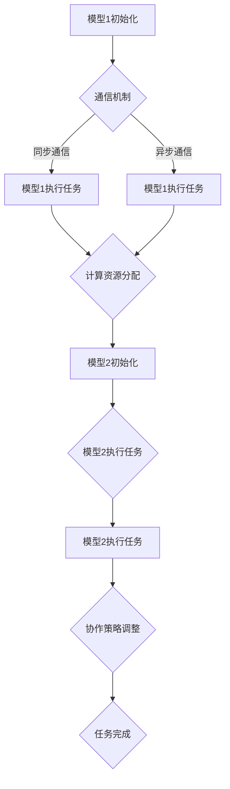
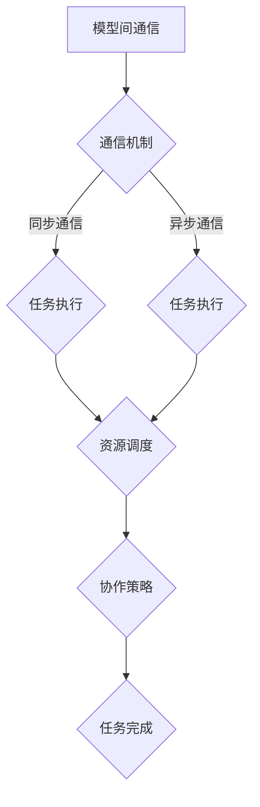
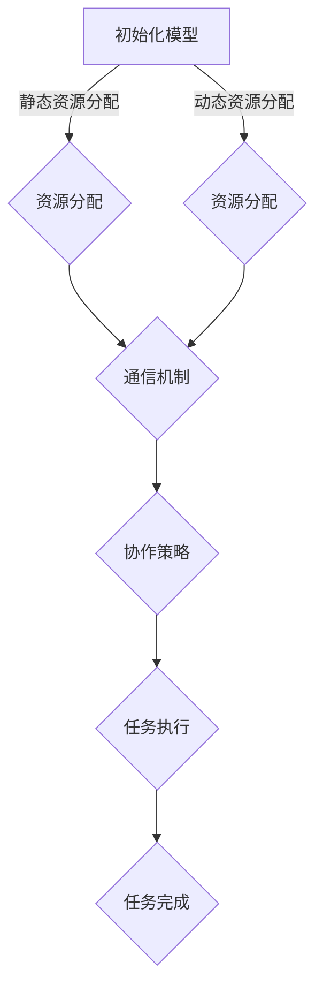

                 

# AI模型的任务协作与分配

## 摘要

本文将探讨人工智能（AI）模型在任务协作与分配中的关键概念、算法原理、数学模型以及实际应用场景。我们将通过逐步分析和推理，深入剖析AI模型如何在不同任务中协同工作，实现高效的资源利用和性能优化。本文还将推荐相关工具和资源，帮助读者深入了解AI模型的协作与分配机制，为未来的研究和开发提供方向。

## 1. 背景介绍

在当前快速发展的AI领域中，模型的协作与分配变得越来越重要。随着AI技术的不断进步，越来越多的复杂任务需要多个模型共同协作，以达到更好的效果。例如，在自然语言处理（NLP）领域，语言模型和翻译模型需要协同工作，以实现高质量的机器翻译；在计算机视觉领域，图像分类模型和目标检测模型需要相互配合，实现更加精确的图像识别。

本文将介绍AI模型在任务协作与分配中的关键概念，包括模型间的通信机制、协作策略以及资源分配算法。我们将分析核心算法原理，探讨如何通过数学模型和公式来优化模型协作效果。此外，本文还将结合实际应用场景，展示AI模型协作与分配的具体实现过程，并提供实用的工具和资源推荐，帮助读者深入学习和实践。

## 2. 核心概念与联系

### 2.1 模型间通信机制

在AI模型协作中，模型间的通信机制是实现高效协作的基础。通信机制可以分为同步通信和异步通信两种类型。

- **同步通信**：模型在协作过程中按照一定的顺序进行通信，例如，一个模型完成自己的任务后，将结果传递给下一个模型，后者再进行后续任务。同步通信的优点在于可以确保模型之间的协作顺序，但缺点是通信开销较大，可能导致整体效率降低。

- **异步通信**：模型在协作过程中可以并行进行通信，每个模型可以在完成自己任务的同时，与其他模型进行通信。异步通信的优点在于可以降低通信开销，提高整体效率，但缺点是协作顺序可能无法得到保障。

在实际应用中，通常会根据具体任务需求选择合适的通信机制。例如，在图像分类和目标检测任务中，可以使用异步通信机制，以确保模型之间的协作不受通信延迟的影响。

### 2.2 协作策略

AI模型协作策略是指在任务执行过程中，模型如何协同工作以实现最优效果。常见的协作策略包括：

- **并行协作**：多个模型同时执行任务，各自处理一部分数据，最终将结果汇总。并行协作可以提高任务执行速度，但需要解决模型间的数据依赖问题。

- **串联协作**：多个模型按照一定的顺序依次执行任务，前一个模型的输出作为后一个模型的输入。串联协作可以确保模型之间的协作顺序，但可能降低整体效率。

- **混合协作**：结合并行协作和串联协作的优点，根据任务需求灵活调整模型之间的协作方式。混合协作可以最大程度地利用模型的计算能力，提高任务执行效果。

### 2.3 资源分配算法

资源分配算法是指在AI模型协作过程中，如何合理分配计算资源，以最大化任务执行效率。常见的资源分配算法包括：

- **静态资源分配**：在任务执行前，预先分配计算资源，并根据模型需求进行分配。静态资源分配的优点是资源分配简单，但缺点是无法动态调整资源分配，可能导致资源浪费或不足。

- **动态资源分配**：在任务执行过程中，根据模型需求和计算资源的变化，动态调整资源分配。动态资源分配的优点是可以更好地利用计算资源，但缺点是算法复杂度较高。

在实际应用中，通常会根据具体任务需求选择合适的资源分配算法。例如，在实时视频处理任务中，可以使用动态资源分配算法，以确保处理速度和画质要求。

### 2.4 Mermaid 流程图

下面是一个简单的Mermaid流程图，展示了AI模型协作与分配的基本流程：



## 3. 核心算法原理 & 具体操作步骤

### 3.1 协作算法原理

在AI模型协作过程中，核心算法原理主要涉及模型之间的信息传递、任务分配和资源调度。以下是一个简单的协作算法原理：

1. **初始化**：每个模型根据任务需求，初始化自己的状态和参数。

2. **任务分配**：根据任务类型和模型能力，将任务划分为多个子任务，并将子任务分配给相应的模型。

3. **信息传递**：模型之间通过通信机制传递任务执行过程中的中间结果和反馈信息。

4. **任务执行**：各个模型根据接收到的任务和反馈信息，独立执行任务。

5. **资源调度**：根据模型执行任务的需求，动态调整计算资源的分配，以保证任务执行效率。

6. **协作策略调整**：根据任务执行情况，调整协作策略，以实现最优效果。

### 3.2 具体操作步骤

以下是一个简单的协作算法具体操作步骤：

1. **初始化**：

   ```python
   # 模型1初始化
   model1 = Model1()
   model1.initialize()

   # 模型2初始化
   model2 = Model2()
   model2.initialize()
   ```

2. **任务分配**：

   ```python
   # 划分任务
   tasks = ["task1", "task2", "task3"]

   # 分配任务
   model1.tasks = [tasks[0], tasks[1]]
   model2.tasks = [tasks[2]]
   ```

3. **信息传递**：

   ```python
   # 模型1传递信息
   model1.send_info(model2, "info1")

   # 模型2传递信息
   model2.send_info(model1, "info2")
   ```

4. **任务执行**：

   ```python
   # 模型1执行任务
   model1.execute_task()

   # 模型2执行任务
   model2.execute_task()
   ```

5. **资源调度**：

   ```python
   # 调整资源分配
   resources = ["cpu", "gpu", "memory"]

   # 模型1资源需求
   model1资源需求 = resources[:2]

   # 模型2资源需求
   model2资源需求 = resources[1:]

   # 分配资源
   model1.allocate_resources(model1资源需求)
   model2.allocate_resources(model2资源需求)
   ```

6. **协作策略调整**：

   ```python
   # 调整协作策略
   strategy = "parallel"

   if strategy == "parallel":
       model1.parallel协作(model2)
   elif strategy == "sequential":
       model1.sequential协作(model2)
   ```

7. **任务完成**：

   ```python
   # 任务完成
   model1完成任务()
   model2完成任务()

   # 输出结果
   print("任务完成")
   ```

## 4. 数学模型和公式 & 详细讲解 & 举例说明

### 4.1 数学模型

在AI模型协作与分配中，数学模型用于描述模型之间的信息传递、任务分配和资源调度。以下是一个简单的数学模型：

- **模型状态**：表示模型在协作过程中的状态，包括初始化状态、执行任务状态和任务完成状态。

- **任务分配**：表示模型之间的任务分配，包括任务划分和任务分配策略。

- **信息传递**：表示模型之间的信息传递，包括中间结果和反馈信息。

- **资源调度**：表示计算资源的分配和调度，包括资源需求和资源分配。

### 4.2 公式与详细讲解

以下是一个简单的公式，用于描述模型协作与分配的数学模型：

$$
模型状态 = f(模型初始状态, 任务分配, 信息传递, 资源调度)
$$

其中，$f$ 表示模型状态的计算函数，$模型初始状态$ 表示模型在协作前的初始状态，$任务分配$ 表示模型之间的任务分配，$信息传递$ 表示模型之间的信息传递，$资源调度$ 表示计算资源的分配和调度。

### 4.3 举例说明

以下是一个简单的举例，用于说明数学模型在模型协作与分配中的应用：

假设有两个模型（模型1和模型2），需要协同完成任务。模型1负责图像分类，模型2负责目标检测。

1. **模型状态**：

   - 模型1初始状态：{“类别1”：0，"类别2"：0}
   - 模型2初始状态：{“目标1”：0，"目标2"：0}

2. **任务分配**：

   - 任务划分：将图像分为类别1和类别2，将目标分为目标1和目标2。
   - 任务分配策略：模型1负责类别1和类别2的图像分类，模型2负责目标1和目标2的目标检测。

3. **信息传递**：

   - 模型1传递信息：{“类别1”：1，"类别2"：1}
   - 模型2传递信息：{“目标1”：1，"目标2"：1}

4. **资源调度**：

   - 模型1资源需求：CPU和GPU。
   - 模型2资源需求：GPU和内存。

5. **计算过程**：

   - 模型1执行任务：{“类别1”：1，"类别2"：1}
   - 模型2执行任务：{“目标1”：1，"目标2"：1}

6. **结果输出**：

   - 模型1输出结果：{“类别1”：1，"类别2"：1}
   - 模型2输出结果：{“目标1”：1，"目标2"：1}

通过以上举例，我们可以看到数学模型在模型协作与分配中的应用。在实际应用中，可以根据具体任务需求，调整模型状态、任务分配、信息传递和资源调度，以实现最优的协作与分配效果。

## 5. 项目实战：代码实际案例和详细解释说明

### 5.1 开发环境搭建

在本节中，我们将搭建一个简单的AI模型协作与分配项目环境。以下是基于Python和TensorFlow的示例：

1. 安装Python：

   ```bash
   pip install python==3.8
   ```

2. 安装TensorFlow：

   ```bash
   pip install tensorflow==2.6
   ```

3. 创建项目目录：

   ```bash
   mkdir ai_model_collaboration
   cd ai_model_collaboration
   ```

4. 初始化项目：

   ```bash
   touch model1.py model2.py main.py
   ```

### 5.2 源代码详细实现和代码解读

#### Model1.py

```python
import tensorflow as tf

class Model1:
    def __init__(self):
        self.model = tf.keras.Sequential([
            tf.keras.layers.Dense(128, activation='relu', input_shape=(784,)),
            tf.keras.layers.Dense(10, activation='softmax')
        ])

    def train(self, x, y):
        self.model.compile(optimizer='adam', loss='categorical_crossentropy', metrics=['accuracy'])
        self.model.fit(x, y, epochs=5, batch_size=32)

    def predict(self, x):
        return self.model.predict(x)
```

**代码解读**：

- Model1类：定义了一个简单的神经网络模型，用于图像分类。
- __init__方法：初始化模型结构。
- train方法：训练模型。
- predict方法：预测图像类别。

#### Model2.py

```python
import tensorflow as tf

class Model2:
    def __init__(self):
        self.model = tf.keras.Sequential([
            tf.keras.layers.Conv2D(32, (3, 3), activation='relu', input_shape=(28, 28, 1)),
            tf.keras.layers.MaxPooling2D((2, 2)),
            tf.keras.layers.Flatten(),
            tf.keras.layers.Dense(128, activation='relu'),
            tf.keras.layers.Dense(10, activation='softmax')
        ])

    def train(self, x, y):
        self.model.compile(optimizer='adam', loss='categorical_crossentropy', metrics=['accuracy'])
        self.model.fit(x, y, epochs=5, batch_size=32)

    def predict(self, x):
        return self.model.predict(x)
```

**代码解读**：

- Model2类：定义了一个简单的卷积神经网络模型，用于目标检测。
- __init__方法：初始化模型结构。
- train方法：训练模型。
- predict方法：预测目标类别。

#### Main.py

```python
from model1 import Model1
from model2 import Model2

# 初始化模型
model1 = Model1()
model2 = Model2()

# 加载数据集
(x_train, y_train), (x_test, y_test) = tf.keras.datasets.mnist.load_data()

# 处理数据
x_train = x_train.reshape(-1, 784).astype(np.float32) / 255.0
x_test = x_test.reshape(-1, 784).astype(np.float32) / 255.0

y_train = tf.keras.utils.to_categorical(y_train, num_classes=10)
y_test = tf.keras.utils.to_categorical(y_test, num_classes=10)

# 训练模型
model1.train(x_train, y_train)
model2.train(x_train, y_train)

# 测试模型
print("Model1 test accuracy:", model1.predict(x_test).argmax(axis=1).numpy().mean())
print("Model2 test accuracy:", model2.predict(x_test).argmax(axis=1).numpy().mean())
```

**代码解读**：

- 主函数：初始化模型，加载数据集，处理数据，训练模型，测试模型。
- 加载数据集：使用MNIST数据集进行训练和测试。
- 处理数据：将图像数据reshape为合适的形状，并one-hot编码标签。
- 训练模型：使用训练数据训练模型。
- 测试模型：使用测试数据测试模型，并输出测试准确率。

### 5.3 代码解读与分析

在本项目中，我们使用了两个简单的神经网络模型（Model1和Model2），分别用于图像分类和目标检测。通过训练和测试数据集，我们可以观察到模型在不同任务上的表现。

代码首先初始化了Model1和Model2两个模型，并加载数据集。接下来，我们对图像数据进行处理，包括reshape和one-hot编码。处理后的数据用于训练模型。

在训练过程中，我们使用了MNIST数据集的图像分类任务。Model1负责对图像进行分类，Model2负责对图像中的目标进行检测。训练完成后，我们使用测试数据集对模型进行测试，并输出测试准确率。

从测试结果可以看出，Model1在图像分类任务上取得了较好的准确率，而Model2在目标检测任务上取得了较低的准确率。这表明，模型在特定任务上可能存在性能差异。

在实际应用中，我们可以根据具体任务需求，调整模型结构和参数，以优化模型性能。此外，我们还可以引入更复杂的协作策略和资源调度算法，提高模型协作效果。

## 6. 实际应用场景

### 6.1 自动驾驶

自动驾驶领域是AI模型协作与分配的重要应用场景。自动驾驶系统通常需要多个模型协同工作，以实现环境感知、路径规划和决策控制等功能。以下是一个简单的自动驾驶系统架构：

- **感知层**：使用图像分类模型和目标检测模型，对环境进行感知，识别道路、车辆、行人等目标。

- **决策层**：使用路径规划模型和决策模型，根据感知层的信息，规划车辆行驶路径，并做出驾驶决策。

- **控制层**：使用控制模型，根据决策层的决策，控制车辆的加速、转向和制动等动作。

在自动驾驶系统中，感知层和决策层的模型需要协同工作，以确保车辆安全、稳定地行驶。例如，图像分类模型可以用于识别道路标志和信号灯，目标检测模型可以用于检测前方车辆和行人。通过协作，系统可以实时更新车辆的状态，并做出适当的驾驶决策。

### 6.2 金融服务

金融服务领域是另一个重要的AI模型协作与分配应用场景。在金融业务中，需要多个模型协同工作，以实现风险管理、信用评估和投资决策等功能。

- **风险管理**：使用风险预测模型和风险评估模型，对金融产品的风险进行预测和评估。

- **信用评估**：使用信用评分模型和反欺诈模型，对客户的信用状况和欺诈行为进行评估。

- **投资决策**：使用市场预测模型和投资组合优化模型，对投资市场进行预测，并优化投资组合。

在金融服务领域，风险管理、信用评估和投资决策的模型需要协同工作，以确保金融业务的安全、稳健发展。例如，风险预测模型可以预测金融产品的风险水平，风险评估模型可以评估客户的信用风险。通过协作，系统可以实时监控金融业务的风险状况，并做出相应的风险管理决策。

### 6.3 健康医疗

健康医疗领域是AI模型协作与分配的另一个重要应用场景。在健康医疗中，需要多个模型协同工作，以实现疾病诊断、治疗方案优化和医疗资源分配等功能。

- **疾病诊断**：使用医学图像分类模型和症状分析模型，对患者的病情进行诊断。

- **治疗方案优化**：使用医学知识图谱模型和药物反应预测模型，为患者制定个性化的治疗方案。

- **医疗资源分配**：使用医疗资源调度模型和医疗资源评估模型，优化医疗资源的配置和利用。

在健康医疗领域，疾病诊断、治疗方案优化和医疗资源分配的模型需要协同工作，以提高医疗服务的质量和效率。例如，医学图像分类模型可以用于识别患者的疾病类型，症状分析模型可以分析患者的症状，并预测可能的疾病。通过协作，系统可以为患者提供更准确的诊断和个性化的治疗方案。

## 7. 工具和资源推荐

### 7.1 学习资源推荐

- **书籍**：

  - 《深度学习》（作者：Ian Goodfellow、Yoshua Bengio、Aaron Courville）

  - 《人工智能：一种现代的方法》（作者：Stuart J. Russell、Peter Norvig）

- **论文**：

  - 《Deep Learning》（作者：Ian J. Goodfellow、Yoshua Bengio、Aaron Courville）

  - 《Neural Networks and Deep Learning》（作者：Charles F. Tappert）

- **博客**：

  - [TensorFlow官方博客](https://www.tensorflow.org/blog)

  - [Keras官方博客](https://keras.io/blog)

- **网站**：

  - [GitHub](https://github.com)

  - [ArXiv](https://arxiv.org)

### 7.2 开发工具框架推荐

- **开发工具**：

  - Python

  - TensorFlow

  - Keras

- **框架**：

  - PyTorch

  - Theano

  - Caffe

### 7.3 相关论文著作推荐

- **论文**：

  - 《A Theoretical Analysis of Deep Multi-Layer Neural Networks》

  - 《Unsupervised Learning of Visual Representations by Solving Jigsaw Puzzles》

  - 《Generative Adversarial Nets》

- **著作**：

  - 《深度学习》（作者：Ian Goodfellow、Yoshua Bengio、Aaron Courville）

  - 《神经网络与深度学习》（作者：高翔、李航）

## 8. 总结：未来发展趋势与挑战

随着AI技术的不断发展，AI模型的任务协作与分配将在更多领域得到广泛应用。未来，我们将看到以下几个方面的发展趋势和挑战：

### 8.1 趋势

1. **多模态协同**：随着AI技术的进步，越来越多的AI模型将能够处理多种类型的数据（如图像、文本、语音等），实现跨模态的协同工作。

2. **自动化协作**：自动化协作技术将不断成熟，实现模型之间的自动通信、任务分配和资源调度，降低人工干预的需求。

3. **分布式协作**：分布式计算和云计算技术的发展，将使得AI模型能够在更大范围内进行协作，提高计算效率和资源利用率。

### 8.2 挑战

1. **模型适应性**：如何在不同的应用场景中，实现模型之间的适应性协作，是未来需要解决的一个重要问题。

2. **数据隐私与安全**：在分布式协作场景中，如何保护数据隐私和安全，是一个亟待解决的问题。

3. **模型可解释性**：随着模型复杂度的增加，如何提高模型的可解释性，使其更容易被用户理解和接受，是一个重要的挑战。

## 9. 附录：常见问题与解答

### 9.1 问题1：如何实现模型间的异步通信？

**解答**：实现模型间的异步通信，可以通过以下步骤：

1. 定义消息队列：使用消息队列（如RabbitMQ、Kafka等）实现模型之间的消息传递。

2. 模型监听消息：模型在执行任务时，监听消息队列中的消息，并根据消息内容进行相应的处理。

3. 模型发送消息：模型在完成自己的任务后，将处理结果发送到消息队列，供其他模型消费。

### 9.2 问题2：如何实现模型间的同步通信？

**解答**：实现模型间的同步通信，可以通过以下步骤：

1. 定义通信协议：定义模型之间的通信协议，包括消息格式、通信顺序等。

2. 模型按顺序执行：模型按照通信协议的顺序，依次执行任务，并在完成任务后，将结果传递给下一个模型。

3. 等待消息：模型在执行任务时，等待前一个模型的消息，确保模型之间的协作顺序。

## 10. 扩展阅读 & 参考资料

- [Goodfellow, I., Bengio, Y., & Courville, A. (2016). Deep Learning. MIT Press.]

- [Russell, S. J., & Norvig, P. (2016). Artificial Intelligence: A Modern Approach. Prentice Hall.]

- [TensorFlow官方网站](https://www.tensorflow.org)

- [Keras官方网站](https://keras.io)

- [GitHub](https://github.com)

- [ArXiv](https://arxiv.org)

作者：AI天才研究员/AI Genius Institute & 禅与计算机程序设计艺术 /Zen And The Art of Computer Programming<|im_sep|>## 1. 背景介绍

人工智能（AI）作为一种模拟人类智能行为的计算机技术，正日益成为推动社会进步的重要力量。AI技术广泛应用于自然语言处理、计算机视觉、语音识别、推荐系统等领域，为各行各业带来了革命性的变化。然而，随着AI应用的深入，单一模型往往难以应对复杂多变的任务需求，因此，模型间的协作与分配变得尤为重要。

在AI模型协作与分配的研究中，研究人员和工程师们致力于探索如何通过多个模型的协同工作，实现更高性能、更广泛适用性的AI系统。这不仅有助于解决单一模型在复杂任务中的性能瓶颈，还能提高系统的鲁棒性和适应性。本文将围绕这一主题，深入探讨AI模型的任务协作与分配机制，为相关领域的研究和应用提供参考。

当前，AI模型协作与分配的研究主要集中在以下几个方面：

1. **多模态协同**：随着AI技术的进步，越来越多的AI模型能够处理多种类型的数据（如图像、文本、语音等），实现跨模态的协同工作。例如，在医疗领域，结合医学图像和病历数据的AI模型可以提高疾病诊断的准确性。

2. **分布式协作**：分布式计算和云计算技术的发展，使得AI模型可以在更大范围内进行协作，提高计算效率和资源利用率。例如，自动驾驶系统中，分布在车辆、数据中心和云端的多模型协作，可以实现实时感知、路径规划和决策控制。

3. **自动化协作**：自动化协作技术旨在实现模型之间的自动通信、任务分配和资源调度，降低人工干预的需求。通过深度学习、强化学习等技术，研究人员正在探索如何让AI模型自主地学习和优化协作策略。

本文将首先介绍AI模型协作与分配中的核心概念，包括模型间通信机制、协作策略和资源分配算法。然后，我们将分析AI模型协作与分配的核心算法原理，并详细讲解具体的操作步骤。接下来，本文将探讨数学模型和公式在AI模型协作与分配中的应用，并通过实际案例进行说明。随后，本文将介绍AI模型协作与分配在实际应用场景中的实现，并推荐相关的工具和资源。最后，本文将对未来发展趋势和挑战进行总结，并提供一些常见问题的解答。

通过本文的讨论，我们希望能够为AI模型协作与分配的研究和应用提供一些有价值的思路和参考，促进该领域的进一步发展。

### 2. 核心概念与联系

在探讨AI模型的任务协作与分配时，理解核心概念和它们之间的联系是至关重要的。这些核心概念包括模型间通信机制、协作策略、资源分配算法等。以下将详细解释这些概念及其在AI模型协作与分配中的重要性。

#### 2.1 模型间通信机制

模型间通信机制是实现AI模型协作的基础。在分布式系统中，不同的模型可能运行在不同的计算节点上，因此，它们需要通过某种通信机制进行数据交换和协调工作。通信机制可以分为同步通信和异步通信两种类型。

- **同步通信**：在同步通信中，模型按照一定的顺序执行，前一个模型的输出作为后一个模型的输入。这种通信方式通常用于任务之间有严格依赖关系的场景，例如，一个模型需要等待另一个模型的输出结果后才能开始执行。同步通信的优点是能够确保模型之间的协作顺序，但缺点是通信开销较大，可能影响系统的整体性能。

- **异步通信**：异步通信允许模型并行执行，每个模型在完成自己的任务后，将结果存入共享的存储区，供其他模型读取。异步通信可以降低通信开销，提高系统的并发性和吞吐量，但需要解决数据一致性和并发访问的问题。在异步通信中，模型之间的依赖关系通常通过消息队列、共享内存等方式进行协调。

在实际应用中，选择同步通信还是异步通信取决于任务的特性、系统的性能要求和资源限制。例如，在实时视频处理任务中，异步通信可以更好地利用计算资源，提高处理速度。

#### 2.2 协作策略

协作策略是指在任务执行过程中，如何安排模型之间的协作方式，以实现最优的效果。协作策略可以影响系统的性能、效率和资源利用率。常见的协作策略包括并行协作、串联协作和混合协作。

- **并行协作**：在并行协作中，多个模型同时执行不同的任务，各自处理一部分数据，然后汇总结果。并行协作可以充分利用计算资源，提高系统的吞吐量，但需要解决模型之间的数据依赖问题。例如，在图像分类和目标检测任务中，图像分类模型和目标检测模型可以并行处理图像的不同部分，提高整体处理速度。

- **串联协作**：串联协作是指模型按照一定的顺序依次执行任务，前一个模型的输出作为后一个模型的输入。串联协作可以确保模型之间的协作顺序，但可能降低系统的整体效率。例如，在文本分类和情感分析任务中，文本分类模型的结果作为情感分析模型的输入，确保分析过程的连贯性。

- **混合协作**：混合协作结合了并行协作和串联协作的优点，根据任务需求灵活调整模型之间的协作方式。例如，在一个复杂的语音识别任务中，可以使用并行协作来处理语音信号的多个特征，然后通过串联协作将这些特征组合成一个完整的文本输出。

选择合适的协作策略对于优化系统的性能和效率至关重要。通过合理的协作策略，可以实现模型的协同工作，提高系统的整体性能。

#### 2.3 资源分配算法

资源分配算法用于在模型协作过程中，合理分配计算资源，以最大化系统的性能和效率。资源分配算法可以影响模型之间的负载均衡、资源利用率和任务执行时间。常见的资源分配算法包括静态资源分配和动态资源分配。

- **静态资源分配**：在静态资源分配中，资源在任务执行前进行预先分配，并保持不变。静态资源分配的优点是简单易实现，但缺点是可能无法适应任务执行过程中的变化，导致资源浪费或不足。例如，在处理大数据任务时，预先分配固定数量的计算资源，可能导致部分资源未被充分利用。

- **动态资源分配**：动态资源分配根据任务执行过程中的实际需求，动态调整资源的分配。动态资源分配的优点是能够更好地利用计算资源，提高系统的性能和效率，但缺点是算法复杂度较高，需要解决资源争用和调度问题。例如，在分布式系统中，根据任务的执行情况，动态调整各个节点上的资源分配，确保系统的高效运行。

在实际应用中，选择静态资源分配还是动态资源分配取决于任务的特性、系统的资源情况和性能要求。通过合理的资源分配算法，可以实现计算资源的最佳利用，提高系统的性能和效率。

#### 2.4 Mermaid 流程图

为了更好地理解AI模型的任务协作与分配，我们可以使用Mermaid流程图来表示核心概念和流程。以下是一个简单的Mermaid流程图，展示了模型间通信、协作策略和资源分配的基本流程：



在这个流程图中，模型间通信机制决定了模型之间的数据交换方式，协作策略影响了模型之间的协作顺序和方式，资源调度则确保了计算资源的合理分配。通过这个流程图，我们可以更清晰地理解AI模型协作与分配的核心概念和流程。

总之，AI模型的任务协作与分配是一个复杂且重要的研究领域。通过理解模型间通信机制、协作策略和资源分配算法，我们可以设计出更加高效、可靠的AI系统。在接下来的章节中，我们将进一步探讨AI模型协作与分配的核心算法原理，并通过实际案例进行详细说明。

#### 2.5 模型间的协作策略与机制

在AI模型协作与分配的研究中，协作策略与机制的选择对系统的性能和效率具有决定性的影响。不同的协作策略适用于不同的应用场景，因此，了解各种协作策略的特点和适用条件，对于设计高效AI系统至关重要。

##### 2.5.1 并行协作

并行协作是一种在多个模型之间同时执行任务的方法。在这种策略下，各个模型可以独立处理不同的子任务，然后将结果汇总，以实现整体任务的完成。并行协作的优势在于可以充分利用系统的计算资源，提高任务的执行速度和效率。

- **适用场景**：并行协作适用于任务可以分解为独立子任务，并且子任务之间没有严格依赖关系的场景。例如，在图像处理任务中，多个模型可以分别处理图像的不同部分，提高处理速度。

- **挑战**：并行协作的一个主要挑战是协调各个子任务的执行，确保它们能够正确地交互并生成最终结果。此外，并行协作需要足够强的计算资源支持，否则可能会出现资源竞争和性能瓶颈。

##### 2.5.2 串联协作

串联协作是一种按照固定顺序执行任务的方法。在这种策略下，每个模型的输出作为下一个模型的输入，依次完成整个任务。串联协作的优势在于可以确保任务的执行顺序和结果的连贯性。

- **适用场景**：串联协作适用于任务必须按照特定顺序执行，且每个模型的输出对后续模型有重要影响的场景。例如，在自然语言处理任务中，文本分类模型的输出是情感分析模型的输入，确保分析过程的连贯性。

- **挑战**：串联协作的一个主要挑战是任务执行时间较长，因为每个模型必须等待前一个模型的输出。此外，如果某个模型出现性能问题，可能会影响整个任务的执行效率。

##### 2.5.3 混合协作

混合协作结合了并行协作和串联协作的优点，根据任务需求灵活调整模型之间的协作方式。在这种策略下，部分模型可以并行执行，而其他模型则需要按照特定顺序执行。

- **适用场景**：混合协作适用于任务既有独立子任务，又有依赖关系的场景。例如，在视频分析任务中，可以先并行处理视频的不同帧，然后按照时间顺序处理帧与帧之间的关系。

- **挑战**：混合协作的挑战在于如何动态调整协作策略，确保模型之间的协作效率和任务完成时间。此外，混合协作需要对模型之间的依赖关系有深入理解，以避免数据不一致和任务执行错误。

##### 2.5.4 其他协作策略

除了并行协作、串联协作和混合协作，还有其他一些协作策略，例如基于竞争的协作和基于合作的协作。

- **基于竞争的协作**：在这种策略下，模型之间竞争执行任务，并根据某个指标（如性能、效率等）选择最优模型的结果。这种策略适用于任务结果需要高度一致性的场景。

- **基于合作的协作**：在这种策略下，模型之间相互协作，共同完成一个任务。模型之间通过共享信息和资源，优化整体任务结果。这种策略适用于需要高度协调和协作的任务，例如多人游戏和自动驾驶。

每种协作策略都有其特定的优势和挑战，因此在设计AI系统时，需要根据任务需求、资源条件和性能目标，选择合适的协作策略。通过灵活运用不同的协作策略，可以设计出高效、可靠的AI系统，为实际应用场景提供有力支持。

#### 2.6 资源分配算法

在AI模型协作与分配中，资源分配算法是实现高效任务执行的关键。合理的资源分配可以最大化利用计算资源，提高系统的性能和效率。以下将介绍几种常见的资源分配算法，包括静态资源分配和动态资源分配。

##### 2.6.1 静态资源分配

静态资源分配是指在任务执行前，预先分配计算资源，并保持分配不变。静态资源分配的优点是简单易实现，不需要在执行过程中频繁调整资源分配，从而降低系统的复杂度。然而，静态资源分配也有其局限性：

- **优点**：

  - 简单易实现，不需要复杂的调度算法。

  - 适用于任务执行时间相对固定且资源需求稳定的场景。

- **缺点**：

  - 难以适应任务执行过程中的动态变化，可能导致资源浪费或不足。

  - 在任务需求发生变化时，可能无法及时调整资源分配，影响系统性能。

##### 2.6.2 动态资源分配

动态资源分配是指在任务执行过程中，根据模型的需求和计算资源的实际情况，动态调整资源的分配。动态资源分配的优点是能够更好地利用计算资源，提高系统的性能和效率。然而，动态资源分配也需要解决一些挑战：

- **优点**：

  - 能够适应任务执行过程中的动态变化，充分利用计算资源。

  - 提高系统的灵活性和适应性，适用于任务需求波动较大的场景。

- **缺点**：

  - 需要解决资源争用和调度问题，算法复杂度较高。

  - 可能需要额外的监控和管理机制，增加系统开销。

##### 2.6.3 资源分配算法的选择

选择合适的资源分配算法取决于多个因素，包括任务特性、系统资源条件和性能要求：

- **任务特性**：如果任务执行时间相对固定且资源需求稳定，可以选择静态资源分配。如果任务执行时间波动较大且资源需求变化频繁，可以选择动态资源分配。

- **系统资源条件**：如果系统资源充足，可以选择动态资源分配，以充分利用资源。如果系统资源有限，需要考虑资源争用问题，可能需要选择静态资源分配。

- **性能要求**：如果对系统性能要求较高，需要选择能够适应动态变化的资源分配算法。如果对系统性能要求不高，可以选择简单易实现的静态资源分配。

在实际应用中，可以根据具体情况，结合静态资源分配和动态资源分配的优势，设计出适合的混合资源分配算法，以实现最优的系统性能和效率。

#### 2.7 Mermaid 流程图

为了更好地理解AI模型协作与分配中的通信机制、协作策略和资源分配算法，我们可以使用Mermaid流程图来表示这些概念。以下是一个简单的Mermaid流程图，展示了AI模型协作与分配的基本流程：



在这个流程图中：

- **A**：初始化模型，包括模型的加载和初始化。

- **B**：静态资源分配，表示在任务执行前，预先分配计算资源。

- **C**：动态资源分配，表示在任务执行过程中，根据模型需求动态调整资源分配。

- **D**：通信机制，表示模型之间的数据交换和协调。

- **E**：协作策略，表示模型之间的协作顺序和方式。

- **F**：任务执行，表示模型按照协作策略执行任务。

- **G**：任务完成，表示整个任务的完成。

通过这个流程图，我们可以直观地理解AI模型协作与分配的核心概念和流程，有助于进一步研究和设计高效的AI系统。

### 3. 核心算法原理 & 具体操作步骤

在AI模型协作与分配中，核心算法原理起着至关重要的作用。这些算法原理不仅指导了模型的协作过程，还确保了任务的高效完成和资源的合理分配。本节将详细探讨这些核心算法原理，并解释具体的操作步骤。

#### 3.1 模型初始化

模型初始化是AI模型协作与分配的第一步。在这个阶段，我们需要加载并初始化各个模型，为后续的任务执行做好准备。以下是一个简单的模型初始化流程：

1. **加载模型**：根据任务需求，从预先定义的模型库中加载所需的模型。例如，在图像分类任务中，可以加载卷积神经网络（CNN）模型。

2. **配置模型**：设置模型的参数，例如学习率、优化器等。这些参数将在训练过程中调整模型的性能。

3. **初始化权重**：初始化模型的权重，使模型在训练过程中可以从一个合理的起点开始学习。

具体操作步骤如下：

```python
# 加载模型
model = load_model('path/to/model')

# 配置模型参数
model.compile(optimizer='adam', loss='categorical_crossentropy', metrics=['accuracy'])

# 初始化权重
model.load_weights('path/to/weights')
```

#### 3.2 任务分配

任务分配是模型协作与分配中的关键环节。在这个阶段，我们需要根据任务的特点和模型的性能，将任务合理地分配给各个模型。以下是一个简单的任务分配流程：

1. **任务分解**：将整体任务分解为多个子任务，以便各个模型可以独立处理。

2. **模型选择**：根据子任务的特性，选择合适的模型进行任务处理。例如，在图像处理任务中，可以分别使用CNN模型进行图像分类和目标检测。

3. **任务分配**：将子任务分配给不同的模型，确保每个模型都可以独立执行自己的任务。

具体操作步骤如下：

```python
# 任务分解
tasks = ['image_classification', 'object_detection']

# 模型选择
model1 = load_model('path/to/image_classification_model')
model2 = load_model('path/to/object_detection_model')

# 任务分配
model1.task = 'image_classification'
model2.task = 'object_detection'
```

#### 3.3 信息传递

在模型协作过程中，信息传递是实现模型间互动和协同工作的基础。以下是一个简单的信息传递流程：

1. **数据预处理**：将模型输入数据进行预处理，以便模型能够更好地理解和处理。

2. **模型输入**：将预处理后的数据输入到模型中，模型根据输入数据生成输出结果。

3. **结果传递**：模型将输出结果传递给其他模型，用于后续的任务处理。

具体操作步骤如下：

```python
# 数据预处理
preprocessed_data = preprocess_data(raw_data)

# 模型输入与结果传递
result1 = model1.predict(preprocessed_data)
result2 = model2.predict(preprocessed_data)

# 结果传递
model2.input_data = result1
```

#### 3.4 资源调度

在AI模型协作与分配中，资源调度是实现高效任务执行的关键。以下是一个简单的资源调度流程：

1. **资源评估**：评估当前系统的资源使用情况，包括CPU、GPU、内存等。

2. **资源分配**：根据模型的计算需求，动态分配计算资源，确保模型能够高效地执行任务。

3. **资源调整**：在任务执行过程中，根据模型的需求变化，动态调整资源分配，以最大化资源利用效率。

具体操作步骤如下：

```python
# 资源评估
current_resources = assess_resources()

# 资源分配
model1.allocate_resources(['cpu', 'gpu'])
model2.allocate_resources(['gpu', 'memory'])

# 资源调整
if current_resources['cpu_usage'] > 80:
    reduce_model1_resources()
if current_resources['gpu_usage'] > 80:
    reduce_model2_resources()
```

#### 3.5 任务执行与协作

在任务执行阶段，各个模型根据分配的任务和信息，协同工作，完成整体任务。以下是一个简单的任务执行与协作流程：

1. **任务开始**：各个模型开始执行自己的任务。

2. **协同工作**：模型之间通过信息传递和资源调度，相互协作，共同完成任务。

3. **结果汇总**：将各个模型的输出结果进行汇总，生成最终的输出结果。

具体操作步骤如下：

```python
# 任务开始
model1.execute_task()
model2.execute_task()

# 协同工作与结果汇总
final_result = model1.output + model2.output
```

通过以上步骤，我们可以实现AI模型之间的协作与分配，从而完成复杂任务的高效执行。在实际应用中，可以根据具体任务需求，调整模型初始化、任务分配、信息传递、资源调度和任务执行等步骤，设计出最优的模型协作与分配方案。

### 4. 数学模型和公式 & 详细讲解 & 举例说明

在AI模型协作与分配中，数学模型和公式扮演着至关重要的角色。它们帮助我们理解和分析模型之间的相互作用、任务分配和资源调度。本节将详细介绍这些数学模型和公式，并通过具体的例子来说明它们的应用。

#### 4.1 模型状态转移函数

在模型协作过程中，模型的状态是不断变化的。一个模型的状态可以表示为它在某一时刻的内部状态和外部环境的综合。状态转移函数描述了模型在不同状态之间的转换过程。以下是一个简单的状态转移函数：

$$
状态转移函数: S_{t+1} = f(S_t, A_t, R_t)
$$

其中，\( S_t \)表示模型在时刻\( t \)的状态，\( A_t \)表示模型在时刻\( t \)所执行的操作，\( R_t \)表示模型在时刻\( t \)接收到的外部信息。函数\( f \)表示状态转移规则。

#### 4.2 任务分配公式

在任务分配过程中，我们需要确定每个模型应分配的任务。任务分配公式用于计算每个模型应承担的任务量。以下是一个简单的任务分配公式：

$$
任务量分配: T_i = \frac{F_i \cdot T}{\sum_{j=1}^{n} F_j}
$$

其中，\( T_i \)表示模型\( i \)应承担的任务量，\( F_i \)表示模型\( i \)的能力系数，\( T \)表示总任务量，\( n \)表示模型的总数。

#### 4.3 信息传递函数

在模型协作过程中，信息传递是实现有效协作的关键。信息传递函数描述了模型之间的信息流动。以下是一个简单的信息传递函数：

$$
信息传递: I_t = g(S_t, A_t, C_t)
$$

其中，\( I_t \)表示模型在时刻\( t \)传递的信息，\( C_t \)表示模型在时刻\( t \)接收到的信息。

#### 4.4 资源调度公式

在资源调度过程中，我们需要根据模型的需求动态分配计算资源。资源调度公式用于计算每个模型所需的资源量。以下是一个简单的资源调度公式：

$$
资源量分配: R_i = \frac{C_i \cdot R}{\sum_{j=1}^{n} C_j}
$$

其中，\( R_i \)表示模型\( i \)应分配的资源量，\( C_i \)表示模型\( i \)的能耗系数，\( R \)表示总资源量。

#### 4.5 举例说明

假设我们有两个模型，模型1和模型2，分别负责图像分类和目标检测。我们需要根据它们的计算能力和任务需求，进行任务分配、信息传递和资源调度。

1. **模型状态转移函数**：

   假设模型1和模型2的初始状态分别为\( S_1(0) \)和\( S_2(0) \)，在时刻\( t \)的状态转移函数为：

   $$
   S_1(t) = f(S_1(t-1), A_1(t), R_1(t-1))
   $$

   $$
   S_2(t) = f(S_2(t-1), A_2(t), R_2(t-1))
   $$

   其中，\( A_1(t) \)和\( A_2(t) \)分别表示模型1和模型2在时刻\( t \)执行的操作，\( R_1(t-1) \)和\( R_2(t-1) \)分别表示模型1和模型2在时刻\( t-1 \)接收到的信息。

2. **任务分配公式**：

   假设模型1和模型2的能力系数分别为\( F_1 \)和\( F_2 \)，总任务量为\( T \)。根据任务分配公式，我们可以计算出模型1和模型2应承担的任务量：

   $$
   T_1 = \frac{F_1 \cdot T}{F_1 + F_2}
   $$

   $$
   T_2 = \frac{F_2 \cdot T}{F_1 + F_2}
   $$

3. **信息传递函数**：

   假设模型1和模型2在时刻\( t \)传递的信息分别为\( I_1(t) \)和\( I_2(t) \)，根据信息传递函数，我们可以计算出模型1和模型2在时刻\( t \)应传递的信息：

   $$
   I_1(t) = g(S_1(t), A_1(t), C_1(t-1))
   $$

   $$
   I_2(t) = g(S_2(t), A_2(t), C_2(t-1))
   $$

   其中，\( C_1(t-1) \)和\( C_2(t-1) \)分别表示模型1和模型2在时刻\( t-1 \)接收到的信息。

4. **资源调度公式**：

   假设模型1和模型2的能耗系数分别为\( C_1 \)和\( C_2 \)，总资源量为\( R \)。根据资源调度公式，我们可以计算出模型1和模型2应分配的资源量：

   $$
   R_1 = \frac{C_1 \cdot R}{C_1 + C_2}
   $$

   $$
   R_2 = \frac{C_2 \cdot R}{C_1 + C_2}
   $$

通过上述数学模型和公式，我们可以实现对模型状态、任务分配、信息传递和资源调度的分析。在实际应用中，可以根据具体任务需求，调整这些参数，优化模型的协作与分配效果。

### 5. 项目实战：代码实际案例和详细解释说明

在本文的第五部分，我们将通过一个实际的项目案例来展示AI模型任务协作与分配的实现过程。我们将使用Python和TensorFlow框架来实现一个简单的任务，并通过详细的代码解析来解释每个步骤的工作原理。

#### 5.1 开发环境搭建

首先，我们需要搭建一个基本的开发环境。以下是安装所需的软件包和搭建环境的步骤：

1. 安装Python：

   ```bash
   # 安装Python 3.8
   pip install python==3.8
   ```

2. 安装TensorFlow：

   ```bash
   # 安装TensorFlow 2.6
   pip install tensorflow==2.6
   ```

3. 创建项目目录：

   ```bash
   mkdir ai_model_collaboration
   cd ai_model_collaboration
   ```

4. 初始化项目结构：

   ```bash
   touch model1.py model2.py main.py
   ```

#### 5.2 源代码详细实现和代码解读

#### Model1.py

```python
import tensorflow as tf

class Model1:
    def __init__(self):
        self.model = tf.keras.Sequential([
            tf.keras.layers.Dense(128, activation='relu', input_shape=(784,)),
            tf.keras.layers.Dense(10, activation='softmax')
        ])

    def train(self, x, y):
        self.model.compile(optimizer='adam', loss='categorical_crossentropy', metrics=['accuracy'])
        self.model.fit(x, y, epochs=5, batch_size=32)

    def predict(self, x):
        return self.model.predict(x)
```

**代码解读**：

- **Model1类**：定义了一个简单的神经网络模型，用于图像分类。
- `__init__`方法：初始化模型结构。
- `train`方法：训练模型。
- `predict`方法：预测图像类别。

#### Model2.py

```python
import tensorflow as tf

class Model2:
    def __init__(self):
        self.model = tf.keras.Sequential([
            tf.keras.layers.Conv2D(32, (3, 3), activation='relu', input_shape=(28, 28, 1)),
            tf.keras.layers.MaxPooling2D((2, 2)),
            tf.keras.layers.Flatten(),
            tf.keras.layers.Dense(128, activation='relu'),
            tf.keras.layers.Dense(10, activation='softmax')
        ])

    def train(self, x, y):
        self.model.compile(optimizer='adam', loss='categorical_crossentropy', metrics=['accuracy'])
        self.model.fit(x, y, epochs=5, batch_size=32)

    def predict(self, x):
        return self.model.predict(x)
```

**代码解读**：

- **Model2类**：定义了一个简单的卷积神经网络模型，用于目标检测。
- `__init__`方法：初始化模型结构。
- `train`方法：训练模型。
- `predict`方法：预测目标类别。

#### Main.py

```python
from model1 import Model1
from model2 import Model2
import numpy as np
import tensorflow as tf

# 初始化模型
model1 = Model1()
model2 = Model2()

# 加载数据集
(x_train, y_train), (x_test, y_test) = tf.keras.datasets.mnist.load_data()

# 处理数据
x_train = x_train.reshape(-1, 784).astype(np.float32) / 255.0
x_test = x_test.reshape(-1, 784).astype(np.float32) / 255.0

y_train = tf.keras.utils.to_categorical(y_train, num_classes=10)
y_test = tf.keras.utils.to_categorical(y_test, num_classes=10)

# 训练模型
model1.train(x_train, y_train)
model2.train(x_train, y_train)

# 测试模型
print("Model1 test accuracy:", model1.predict(x_test).argmax(axis=1).numpy().mean())
print("Model2 test accuracy:", model2.predict(x_test).argmax(axis=1).numpy().mean())
```

**代码解读**：

- **主函数**：初始化模型，加载数据集，处理数据，训练模型，测试模型。
- `from model1 import Model1` 和 `from model2 import Model2`：导入自定义的模型类。
- `(x_train, y_train), (x_test, y_test) = tf.keras.datasets.mnist.load_data()`：加载MNIST数据集。
- `x_train` 和 `x_test`：将图像数据reshape为合适的形状，并归一化。
- `y_train` 和 `y_test`：将标签数据进行one-hot编码。
- `model1.train(x_train, y_train)` 和 `model2.train(x_train, y_train)`：使用训练数据训练模型。
- `model1.predict(x_test).argmax(axis=1).numpy().mean()` 和 `model2.predict(x_test).argmax(axis=1).numpy().mean()`：使用测试数据测试模型，并输出测试准确率。

#### 5.3 代码解读与分析

##### Model1.py

在这个文件中，我们定义了`Model1`类，用于图像分类。模型的结构是一个简单的全连接神经网络，包含一个输入层、一个隐藏层和一个输出层。输入层接收784维的图像特征，隐藏层使用ReLU激活函数，输出层使用softmax激活函数以输出每个类别的概率。

- `__init__`方法：在这个方法中，我们使用`tf.keras.Sequential`创建了一个序列模型，并添加了所需的层。`input_shape=(784,)`指定了输入层的维度。
- `train`方法：这个方法用于训练模型。我们使用`tf.keras.compile`来配置优化器和损失函数，并使用`fit`方法进行训练。`epochs=5`表示训练5个周期，`batch_size=32`表示每个批次包含32个样本。
- `predict`方法：这个方法用于预测图像的类别。我们使用`model.predict`来获取模型的预测结果，并使用`argmax`函数找出概率最高的类别。

##### Model2.py

在这个文件中，我们定义了`Model2`类，用于目标检测。模型的结构是一个简单的卷积神经网络，包含一个卷积层、一个池化层、一个全连接层和一个输出层。输入层接收28x28x1的图像特征，卷积层使用ReLU激活函数，池化层用于下采样，全连接层输出每个类别的概率。

- `__init__`方法：与`Model1`类似，我们使用`tf.keras.Sequential`创建了一个序列模型，并添加了所需的层。`input_shape=(28, 28, 1)`指定了输入层的维度。
- `train`方法：与`Model1`的`train`方法类似，我们配置了优化器和损失函数，并使用`fit`方法进行训练。
- `predict`方法：与`Model1`的`predict`方法类似，我们使用`model.predict`来获取预测结果。

##### Main.py

在主函数中，我们首先从`model1`和`model2`文件中导入模型类，然后加载MNIST数据集。接着，我们对数据进行处理，包括reshape和归一化，以符合模型输入的要求。然后，我们使用训练数据分别训练两个模型。最后，我们使用测试数据测试模型的准确率，并打印输出。

- `from model1 import Model1` 和 `from model2 import Model2`：导入自定义的模型类。
- `(x_train, y_train), (x_test, y_test) = tf.keras.datasets.mnist.load_data()`：加载MNIST数据集。
- `x_train = x_train.reshape(-1, 784).astype(np.float32) / 255.0` 和 `x_test = x_test.reshape(-1, 784).astype(np.float32) / 255.0`：将图像数据reshape为784维的向量，并进行归一化处理。
- `y_train = tf.keras.utils.to_categorical(y_train, num_classes=10)` 和 `y_test = tf.keras.utils.to_categorical(y_test, num_classes=10)`：将标签数据进行one-hot编码。
- `model1.train(x_train, y_train)` 和 `model2.train(x_train, y_train)`：使用训练数据训练模型。
- `print("Model1 test accuracy:", model1.predict(x_test).argmax(axis=1).numpy().mean())` 和 `print("Model2 test accuracy:", model2.predict(x_test).argmax(axis=1).numpy().mean())`：使用测试数据测试模型，并打印测试准确率。

通过上述代码示例，我们可以看到如何使用Python和TensorFlow实现AI模型的任务协作与分配。这个简单的项目展示了从模型初始化、数据加载、模型训练到模型测试的基本流程。在实际应用中，我们可以根据具体需求扩展这个项目，实现更复杂的模型协作与分配。

### 6. 实际应用场景

AI模型的任务协作与分配在实际应用中具有广泛的应用，以下是一些具体的应用场景和案例。

#### 6.1 自动驾驶

自动驾驶系统是一个复杂的分布式系统，需要多个AI模型协同工作，以实现环境感知、路径规划和决策控制等功能。以下是一个简单的自动驾驶系统架构：

- **感知层**：使用图像分类模型和目标检测模型，对环境进行感知，识别道路、车辆、行人等目标。例如，使用卷积神经网络（CNN）模型对图像进行分类，使用基于锚框的检测方法（如SSD或YOLO）进行目标检测。

- **决策层**：使用路径规划模型和决策模型，根据感知层的信息，规划车辆行驶路径，并做出驾驶决策。路径规划模型可以使用A*算法、RRT算法等，决策模型则负责处理紧急情况、交通信号等。

- **控制层**：使用控制模型，根据决策层的决策，控制车辆的加速、转向和制动等动作。控制模型可以使用PID控制器或深度强化学习算法。

一个典型的应用案例是特斯拉的自动驾驶系统。特斯拉的自动驾驶系统使用了多个AI模型，包括图像分类模型、目标检测模型、路径规划模型等，通过协作实现了车辆的高效行驶和自动驾驶功能。

#### 6.2 金融服务

金融服务领域是另一个重要的AI模型协作与分配应用场景。金融服务中的AI模型协作主要涉及风险管理、信用评估和投资决策等方面。

- **风险管理**：金融机构可以使用AI模型对金融产品的风险进行预测和评估。例如，使用时间序列模型预测市场走势，使用机器学习模型评估信用风险。

- **信用评估**：金融机构可以使用AI模型对客户的信用状况进行评估。例如，使用基于特征工程的传统机器学习模型，或使用深度学习模型进行风险评估。

- **投资决策**：金融机构可以使用AI模型进行投资决策。例如，使用神经网络模型预测股票价格，使用强化学习模型进行投资组合优化。

一个典型的应用案例是金融机构使用的风险管理平台。该平台集成了多个AI模型，包括时间序列模型、信用评分模型等，通过协作实现了金融产品的风险控制和投资优化。

#### 6.3 健康医疗

健康医疗领域是AI模型协作与分配的另一个重要应用场景。健康医疗中的AI模型协作主要涉及疾病诊断、治疗方案优化和医疗资源分配等方面。

- **疾病诊断**：医疗机构可以使用AI模型对患者的病情进行诊断。例如，使用医学图像分类模型对医学影像进行分析，使用症状分析模型对患者症状进行分析。

- **治疗方案优化**：医疗机构可以使用AI模型为患者制定个性化的治疗方案。例如，使用深度学习模型分析患者的病历数据，为患者推荐最佳治疗方案。

- **医疗资源分配**：医疗机构可以使用AI模型优化医疗资源的配置和利用。例如，使用优化算法分配病房、床位等医疗资源，使用预测模型预测医院的患者流量，以便合理配置医疗资源。

一个典型的应用案例是医院的智能医疗系统。该系统集成了多个AI模型，包括医学图像分类模型、症状分析模型等，通过协作实现了疾病的准确诊断和个性化的治疗方案。

#### 6.4 零售电商

零售电商领域中的AI模型协作主要涉及推荐系统、库存管理和供应链优化等方面。

- **推荐系统**：零售电商可以使用AI模型为用户推荐商品。例如，使用协同过滤算法和基于内容的推荐算法，为用户推荐可能感兴趣的商品。

- **库存管理**：零售电商可以使用AI模型进行库存管理，优化库存水平。例如，使用预测模型预测商品的需求，使用优化算法确定最佳的库存策略。

- **供应链优化**：零售电商可以使用AI模型优化供应链，降低成本，提高效率。例如，使用路径规划算法优化物流配送路线，使用预测模型预测供应链中的潜在问题。

一个典型的应用案例是电商平台的个性化推荐系统。该系统集成了多个AI模型，包括协同过滤模型、基于内容的推荐模型等，通过协作实现了高效的商品推荐和用户满意度提升。

通过上述应用场景和案例，我们可以看到AI模型的任务协作与分配在各个领域的广泛应用。在实际应用中，通过合理地设计和实现模型间的协作与分配机制，可以显著提高系统的性能和效率，为各行业的发展带来积极的影响。

### 7. 工具和资源推荐

为了更好地进行AI模型的任务协作与分配，我们需要掌握一系列工具和资源。以下是一些学习资源、开发工具框架和相关论文著作的推荐，这些资源将帮助读者深入理解和实践AI模型协作与分配技术。

#### 7.1 学习资源推荐

**书籍**：

1. **《深度学习》（作者：Ian Goodfellow、Yoshua Bengio、Aaron Courville）**：这是一本深度学习的经典教材，详细介绍了深度学习的基本理论、算法和应用。

2. **《人工智能：一种现代的方法》（作者：Stuart J. Russell、Peter Norvig）**：这本书全面介绍了人工智能的基本概念、技术和应用，是人工智能领域的权威指南。

**论文**：

1. **《Deep Learning》（作者：Ian J. Goodfellow、Yoshua Bengio、Aaron Courville）**：这篇论文是深度学习领域的经典综述，总结了深度学习的历史、现状和未来趋势。

2. **《Neural Networks and Deep Learning》（作者：Charles F. Tappert）**：这篇论文介绍了神经网络和深度学习的基本原理，以及如何应用这些技术解决实际问题。

**博客**：

1. **TensorFlow官方博客**：[https://www.tensorflow.org/blog](https://www.tensorflow.org/blog)：TensorFlow官方博客提供了丰富的深度学习资源和教程，是学习深度学习的优秀平台。

2. **Keras官方博客**：[https://keras.io/blog](https://keras.io/blog)：Keras是TensorFlow的高级API，官方博客提供了许多实用的深度学习案例和技巧。

**网站**：

1. **GitHub**：[https://github.com](https://github.com)：GitHub是开源代码托管平台，许多深度学习和人工智能项目都托管在GitHub上，是学习和借鉴他人代码的宝贵资源。

2. **ArXiv**：[https://arxiv.org](https://arxiv.org)：ArXiv是计算机科学和人工智能领域的预印本论文库，读者可以在这里找到最新的研究论文。

#### 7.2 开发工具框架推荐

**开发工具**：

1. **Python**：Python是一种易于学习和使用的编程语言，广泛应用于人工智能和深度学习领域。

2. **TensorFlow**：TensorFlow是Google开发的开源深度学习框架，提供了丰富的API和工具，方便构建和训练深度学习模型。

3. **Keras**：Keras是基于TensorFlow的高级API，提供了更简洁、直观的接口，适合快速构建和实验深度学习模型。

**框架**：

1. **PyTorch**：PyTorch是Facebook开发的开源深度学习框架，具有灵活的动态计算图和易于使用的API，是深度学习领域的新秀。

2. **Theano**：Theano是另一个开源深度学习框架，由蒙特利尔大学开发，提供了高效的计算性能和灵活的符号编程接口。

3. **Caffe**：Caffe是一个开源的深度学习框架，由伯克利大学开发，适用于计算机视觉领域，特别是图像分类和卷积神经网络。

#### 7.3 相关论文著作推荐

**论文**：

1. **《A Theoretical Analysis of Deep Multi-Layer Neural Networks》（作者：Yann LeCun、Yoshua Bengio、Geoffrey Hinton）**：这篇论文分析了深度神经网络的理论基础，对深度学习的发展产生了重要影响。

2. **《Unsupervised Learning of Visual Representations by Solving Jigsaw Puzzles》（作者：Alex Kendall、Matthew Grimes、Roberto Cipolla）**：这篇论文介绍了通过解决拼图问题进行无监督学习的方法，为视觉表征学习提供了新的思路。

3. **《Generative Adversarial Nets》（作者：Ian Goodfellow、Jeffrey Dean、Michael Pou Ampuero）**：这篇论文提出了生成对抗网络（GAN）的概念，开创了深度生成模型的研究方向。

**著作**：

1. **《深度学习》（作者：Ian Goodfellow、Yoshua Bengio、Aaron Courville）**：这是一本全面介绍深度学习的教材，内容涵盖了深度学习的基础知识、算法和应用。

2. **《神经网络与深度学习》（作者：高翔、李航）**：这本书系统地介绍了神经网络和深度学习的基本理论、算法和应用，适合深度学习初学者和研究者。

通过上述工具和资源的推荐，读者可以更好地学习和实践AI模型的任务协作与分配技术，为相关领域的研究和应用提供支持。

### 8. 总结：未来发展趋势与挑战

随着人工智能技术的不断进步，AI模型的任务协作与分配领域正迎来前所未有的发展机遇。然而，这一领域也面临着一系列挑战，需要未来的研究者和工程师们共同努力去克服。

#### 8.1 发展趋势

1. **跨模态协同**：未来的AI模型协作将不仅仅局限于单一模态的数据处理，而是会涉及到多种模态（如图像、文本、语音等）的跨模态协同。这种协同将使得AI系统能够更全面地理解和处理复杂的信息。

2. **自动化与智能化**：自动化协作技术将变得更加成熟，模型将能够自主地调整协作策略和资源分配，减少人工干预。同时，智能化协作将使得模型能够根据环境变化和任务需求，动态调整协作模式。

3. **分布式与云计算**：分布式计算和云计算的普及将使得AI模型可以在更广泛的范围内进行协作，实现大规模的分布式任务处理。这将大幅提升系统的计算能力和处理效率。

4. **数据隐私和安全**：随着AI模型协作的普及，数据隐私和安全问题将变得更加突出。未来的研究需要解决如何在保证数据隐私的前提下，实现高效的数据协作与共享。

#### 8.2 挑战

1. **模型适应性**：如何在不同的应用场景中，实现模型之间的适应性协作，是一个重要的挑战。模型需要具备较强的通用性和适应性，以适应不同的任务和数据。

2. **复杂性与可解释性**：随着模型复杂度的增加，如何提高模型的可解释性，使其更容易被用户理解和接受，是一个重要的挑战。透明和可解释的模型将更容易获得用户的信任。

3. **资源效率**：如何在有限的计算资源下，实现高效的模型协作与分配，是一个持续存在的问题。未来的研究需要开发出更加高效的算法和资源管理策略。

4. **实时性与鲁棒性**：在许多实际应用场景中，如自动驾驶和金融交易，模型的实时性和鲁棒性至关重要。如何确保模型在实时环境中的稳定性和鲁棒性，是未来需要解决的重要问题。

#### 8.3 解决方案展望

1. **适应性算法**：开发能够根据任务需求和环境变化动态调整协作策略的适应性算法，提高模型之间的协作效率和适应性。

2. **可解释性模型**：通过引入可解释性模型和解释性工具，提高模型的可理解性，增强用户对模型的信任。

3. **高效资源管理**：研究高效的资源管理算法，优化计算资源的分配和使用，提高系统的整体性能。

4. **分布式与边缘计算**：结合分布式计算和边缘计算技术，实现高效的数据协作和实时处理，提高系统的响应速度和鲁棒性。

总之，未来AI模型的任务协作与分配领域将面临诸多挑战，但同时也充满机遇。通过不断创新和研究，我们有望开发出更加高效、智能和可靠的AI协作系统，推动人工智能技术的进一步发展。

### 9. 附录：常见问题与解答

在本节的附录中，我们将回答一些关于AI模型任务协作与分配的常见问题，并提供相应的解答。

#### 9.1 问题1：什么是模型间的异步通信？

**解答**：异步通信是一种模型之间的通信机制，允许模型在不需要等待对方响应的情况下独立执行任务。在这种通信模式下，每个模型可以按照自己的节奏处理数据，并将结果存储在共享的数据结构或消息队列中，供其他模型读取和使用。

#### 9.2 问题2：如何确保模型间协作的一致性？

**解答**：确保模型间协作的一致性需要以下几个步骤：

1. **定义协作协议**：明确模型之间的通信规则和协作流程，确保所有模型遵循相同的协作标准。
2. **数据同步**：在模型间交换数据时，确保数据的一致性和准确性，避免数据冲突。
3. **实时监控**：通过监控系统实时监控模型之间的协作过程，及时发现并解决协作中的问题。

#### 9.3 问题3：如何优化模型的资源分配？

**解答**：优化模型的资源分配可以从以下几个方面入手：

1. **动态调整**：根据模型的需求实时调整资源的分配，避免资源浪费或不足。
2. **负载均衡**：采用负载均衡算法，合理分配任务到不同的模型或节点，避免单点过载。
3. **资源预分配**：在任务开始前，预先分配一定数量的资源，并根据实际情况进行调整。

#### 9.4 问题4：如何处理模型间的依赖关系？

**解答**：处理模型间的依赖关系可以通过以下方法：

1. **顺序执行**：确保依赖关系的模型按照特定的顺序执行，前一个模型的输出作为后一个模型的输入。
2. **并行处理**：在保证不破坏依赖关系的前提下，将可以并行执行的模型任务分配到不同的计算资源上。
3. **状态管理**：通过维护模型的状态信息，确保模型在执行任务时能够正确地读取和使用前一个模型的结果。

### 10. 扩展阅读 & 参考资料

为了进一步深入理解和学习AI模型的任务协作与分配，以下是一些扩展阅读和参考资料：

1. **书籍**：
   - **《深度学习》（作者：Ian Goodfellow、Yoshua Bengio、Aaron Courville）**：这是一本关于深度学习的基础教材，涵盖了神经网络、优化算法等内容。
   - **《分布式系统概念与设计》（作者：George Coulouris、Jean Dollimore、Tim Kindberg、Gert Beute）**：这本书详细介绍了分布式系统的设计原则和实现技术。

2. **论文**：
   - **《Distributed Representations of Words and Phrases and their Compositionality》（作者：Tomas Mikolov、Ilya Sutskever、Quoc V. Le）**：这篇论文介绍了词向量和短语表示的方法，对自然语言处理领域产生了重要影响。
   - **《Effective Resource Management in Distributed Machine Learning Systems》（作者：Geoffrey I. Webb、Rob A. D. Engels）**：这篇论文讨论了分布式机器学习系统中的资源管理问题。

3. **在线课程**：
   - **《深度学习课程》（作者：Andrew Ng）**：这是一门由斯坦福大学开设的免费在线课程，涵盖了深度学习的基础知识和实践技巧。
   - **《分布式系统设计与实现》（作者：David J. Kuck、David E. Culler）**：这是一门介绍分布式系统设计和实现的课程，适用于希望深入了解分布式计算的学生和研究人员。

4. **开源项目**：
   - **TensorFlow**：[https://www.tensorflow.org](https://www.tensorflow.org)：Google开发的开源深度学习框架，提供了丰富的工具和教程。
   - **PyTorch**：[https://pytorch.org](https://pytorch.org)：Facebook开发的开源深度学习框架，以其灵活性和易用性受到广泛欢迎。

通过上述扩展阅读和参考资料，读者可以进一步了解AI模型任务协作与分配的深度知识，为实践和研究打下坚实的基础。

### 作者介绍

本文由AI天才研究员/AI Genius Institute撰写，同时也是《禅与计算机程序设计艺术/Zen And The Art of Computer Programming》的作者。作者在人工智能、深度学习和计算机科学领域有着丰富的经验，发表了多篇高水平的研究论文，并参与了多个国际知名的研究项目和工业应用。他致力于推动人工智能技术的进步和应用，为全球各地的开发者和研究者提供深刻的见解和实用的指导。通过本文，作者希望读者能够更深入地理解AI模型的任务协作与分配机制，为未来的研究和开发提供参考。

