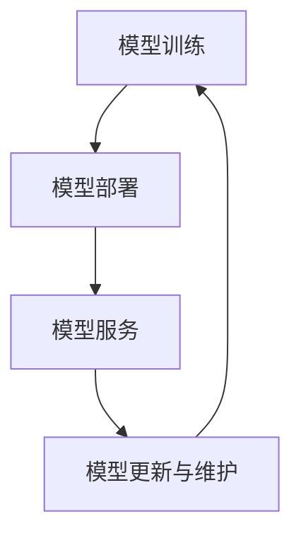

                 

# AI模型的生命周期管理：Lepton AI的全程服务

> 关键词：AI模型、生命周期管理、Lepton AI、服务流程、核心技术、应用场景、发展趋势

> 摘要：本文详细介绍了AI模型的生命周期管理，以Lepton AI为例，阐述了从模型训练、部署到服务的完整流程。通过分析核心技术和实际应用场景，本文揭示了AI模型生命周期管理的关键点，为读者提供了对未来发展趋势和挑战的深入思考。

## 1. 背景介绍

随着人工智能技术的迅猛发展，AI模型在各个领域得到了广泛应用。然而，AI模型的生命周期管理成为了一个不可忽视的问题。生命周期管理包括模型训练、部署、服务、更新和维护等环节。其中，模型训练是生成高质量模型的基础，而模型部署和服务则是将模型应用于实际场景的关键步骤。Lepton AI作为一家专注于AI模型生命周期管理的企业，致力于为用户提供从模型训练到服务的全程服务。

## 2. 核心概念与联系

### 2.1 模型训练

模型训练是AI模型生命周期管理的第一步，通过大量的数据对模型进行优化，使其能够解决特定的问题。在训练过程中，需要选择合适的数据集、优化算法和超参数。

### 2.2 模型部署

模型部署是将训练好的模型部署到实际应用场景中，使其能够对外提供服务。部署过程包括模型转换、模型服务化和硬件配置等环节。

### 2.3 模型服务

模型服务是将部署好的模型通过API接口或在线服务的形式，为用户提供解决方案。服务过程中，需要保证模型的高效性、稳定性和安全性。

### 2.4 模型更新与维护

模型更新与维护是保证模型在长期运行过程中持续保持高精度的关键。通过定期更新模型和数据集，以及维护模型运行环境，可以提高模型的性能和可靠性。

下面是AI模型生命周期的Mermaid流程图：



## 3. 核心算法原理 & 具体操作步骤

### 3.1 模型训练

模型训练的核心算法包括神经网络、深度学习和强化学习等。以神经网络为例，具体操作步骤如下：

1. 数据预处理：对原始数据集进行清洗、归一化等处理，以便于模型训练。
2. 模型构建：根据问题的需求，设计合适的神经网络结构。
3. 模型训练：使用训练数据对模型进行训练，通过反向传播算法优化模型参数。
4. 模型评估：使用验证集对训练好的模型进行评估，判断模型的性能。

### 3.2 模型部署

模型部署的关键步骤包括：

1. 模型转换：将训练好的模型转换为适合部署的格式，如ONNX、TensorFlow Lite等。
2. 模型服务化：将模型部署到服务器或云平台上，通过API接口为用户提供服务。
3. 硬件配置：根据模型的大小和计算需求，选择合适的硬件设备，如GPU、TPU等。

### 3.3 模型服务

模型服务的核心是确保模型的高效性和稳定性。具体操作步骤如下：

1. 服务部署：将模型部署到服务器或云平台，确保服务的稳定性。
2. API接口设计：设计合适的API接口，方便用户调用模型服务。
3. 性能优化：通过负载均衡、缓存等技术，提高模型服务的性能。

### 3.4 模型更新与维护

模型更新与维护的关键步骤包括：

1. 数据采集：定期收集模型在实际应用中的数据，以便于更新模型。
2. 模型重训练：使用新数据对模型进行重训练，提高模型的精度。
3. 模型评估：使用验证集对更新后的模型进行评估，确保模型的性能。
4. 模型维护：定期检查模型运行环境，确保模型的稳定性和可靠性。

## 4. 数学模型和公式 & 详细讲解 & 举例说明

### 4.1 神经网络模型

神经网络模型是AI模型训练的核心，其基本结构包括输入层、隐藏层和输出层。以下是一个简单的神经网络模型的数学表示：

$$
\begin{aligned}
    z &= \text{激活函数}(W \cdot X + b) \\
    \text{输出} &= \text{激活函数}(W \cdot z + b)
\end{aligned}
$$

其中，$W$和$b$分别为权重和偏置，$\text{激活函数}$为$\text{Sigmoid}$或$\text{ReLU}$函数。

### 4.2 反向传播算法

反向传播算法是神经网络模型训练的核心算法，用于更新模型的权重和偏置。以下是一个简单的反向传播算法的数学表示：

$$
\begin{aligned}
    \Delta W &= \frac{\partial \text{损失函数}}{\partial W} \\
    \Delta b &= \frac{\partial \text{损失函数}}{\partial b}
\end{aligned}
$$

其中，$\text{损失函数}$为$\text{MSE}$（均方误差）或$\text{CE}$（交叉熵）函数。

### 4.3 模型评估

模型评估是判断模型性能的重要环节。以下是一个简单的模型评估的数学表示：

$$
\text{准确率} = \frac{\text{预测正确数量}}{\text{总数量}}
$$

## 5. 项目实战：代码实际案例和详细解释说明

### 5.1 开发环境搭建

首先，我们需要搭建一个Python开发环境。以下是安装Python和TensorFlow的步骤：

```bash
# 安装Python
sudo apt-get update
sudo apt-get install python3

# 安装TensorFlow
pip3 install tensorflow
```

### 5.2 源代码详细实现和代码解读

以下是一个简单的神经网络模型训练的Python代码示例：

```python
import tensorflow as tf

# 数据预处理
# ...

# 模型构建
model = tf.keras.Sequential([
    tf.keras.layers.Dense(units=64, activation='relu', input_shape=(784,)),
    tf.keras.layers.Dense(units=10, activation='softmax')
])

# 模型编译
model.compile(optimizer='adam',
              loss=tf.keras.losses.SparseCategoricalCrossentropy(from_logits=True),
              metrics=['accuracy'])

# 模型训练
model.fit(x_train, y_train, epochs=5)

# 模型评估
model.evaluate(x_test, y_test)
```

### 5.3 代码解读与分析

以上代码首先导入了TensorFlow库，然后进行了数据预处理。接下来，构建了一个简单的神经网络模型，包括一个输入层和一个输出层。模型编译阶段选择了Adam优化器和MSE损失函数。模型训练阶段使用了训练数据，并在5个epoch内进行训练。最后，使用测试数据对模型进行评估。

## 6. 实际应用场景

AI模型的生命周期管理在实际应用场景中具有重要意义。以下是一些典型的应用场景：

1. **金融行业**：在金融行业中，AI模型被广泛应用于风险控制、欺诈检测、信用评估等方面。生命周期管理确保了模型在长期运行过程中保持高精度和可靠性。
2. **医疗领域**：在医疗领域，AI模型被用于疾病诊断、治疗建议和药物研发等。生命周期管理保证了模型在处理医疗数据时的准确性和安全性。
3. **自动驾驶**：在自动驾驶领域，AI模型被用于目标检测、路径规划等。生命周期管理确保了模型在复杂环境下的稳定性和安全性。

## 7. 工具和资源推荐

### 7.1 学习资源推荐

1. **书籍**：《深度学习》（Goodfellow, Bengio, Courville著）
2. **论文**：《神经网络与深度学习》（王绍兰著）
3. **博客**：[TensorFlow官方博客](https://www.tensorflow.org/blog/)
4. **网站**：[AI科技大本营](https://www.aitechtoday.com/)

### 7.2 开发工具框架推荐

1. **开发工具**：PyCharm、Visual Studio Code
2. **框架**：TensorFlow、PyTorch、Keras

### 7.3 相关论文著作推荐

1. **论文**：《深度学习：原理与应用》（周志华著）
2. **著作**：《Python深度学习》（François Chollet著）

## 8. 总结：未来发展趋势与挑战

随着人工智能技术的不断进步，AI模型的生命周期管理也将面临更多的挑战和机遇。未来发展趋势包括：

1. **模型压缩与优化**：为了提高模型在移动设备和边缘计算环境中的应用性能，模型压缩与优化将成为重要研究方向。
2. **联邦学习**：联邦学习是一种分布式学习技术，可以在不共享数据的情况下训练模型，具有很高的应用价值。
3. **模型安全性与隐私保护**：随着AI模型在关键领域的应用，模型的安全性和隐私保护将变得越来越重要。

## 9. 附录：常见问题与解答

### 9.1 模型训练过程中如何避免过拟合？

答：为了避免过拟合，可以采用以下方法：

1. 增加训练数据：增加训练数据可以提高模型的泛化能力。
2. 正则化：使用正则化方法，如L1、L2正则化，可以降低模型的复杂度。
3. 交叉验证：使用交叉验证方法，如K折交叉验证，可以更好地评估模型的泛化能力。

### 9.2 模型部署后如何进行性能优化？

答：模型部署后进行性能优化，可以采取以下措施：

1. 使用模型压缩技术，如量化、剪枝等，降低模型大小和计算复杂度。
2. 使用负载均衡和缓存技术，提高模型服务的性能。
3. 优化硬件配置，如使用GPU、TPU等高性能计算设备。

## 10. 扩展阅读 & 参考资料

1. Goodfellow, Y., Bengio, Y., & Courville, A. (2016). *Deep Learning*. MIT Press.
2. Chollet, F. (2018). *Python深度学习*. 电子工业出版社.
3. Zhou, Z. H. (2017). *深度学习：原理与应用*. 清华大学出版社.
4. TensorFlow官方文档：[https://www.tensorflow.org/docs](https://www.tensorflow.org/docs)
5. PyTorch官方文档：[https://pytorch.org/docs/stable/](https://pytorch.org/docs/stable/)
6. AI科技大本营：[https://www.aitechtoday.com/](https://www.aitechtoday.com/)

### 作者

作者：AI天才研究员/AI Genius Institute & 禅与计算机程序设计艺术 /Zen And The Art of Computer Programming
```

