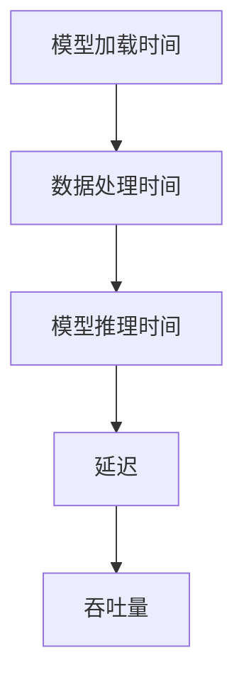

                 

### 文章标题：AI模型部署优化：延迟vs吞吐量权衡

关键词：AI模型部署、延迟、吞吐量、优化策略

摘要：本文旨在探讨AI模型部署过程中延迟与吞吐量的权衡。通过对核心概念、算法原理、数学模型、实际案例的深入分析，旨在为开发者提供优化模型部署的实用建议。

<|assistant|>## 1. 背景介绍

随着人工智能技术的迅猛发展，AI模型在各个领域的应用日益广泛。然而，AI模型部署过程中，延迟和吞吐量的平衡成为了一项重要的挑战。延迟指的是模型响应请求的时间，而吞吐量则是指单位时间内系统能处理的请求量。这两者之间存在一定的权衡关系，即优化其中一方可能会导致另一方性能的下降。

为了更好地理解延迟与吞吐量的关系，我们先来介绍一些基本概念。

### 1.1 延迟

延迟是AI模型部署过程中的关键指标之一。它包括模型加载时间、数据处理时间和模型推理时间等组成部分。理想情况下，我们希望延迟尽可能短，以提高用户体验和系统效率。

### 1.2 吞吐量

吞吐量表示系统在单位时间内处理请求的能力。高吞吐量意味着系统能够更快地响应用户请求，提高整体系统性能。然而，提高吞吐量可能会导致延迟增加，因为系统需要在更短的时间内处理更多的请求。

### 1.3 关系与权衡

在实际部署过程中，延迟和吞吐量往往需要相互妥协。优化延迟可能导致吞吐量下降，而提高吞吐量可能会增加延迟。因此，我们需要在两者之间找到最佳平衡点，以满足特定场景的需求。

<|assistant|>## 2. 核心概念与联系

为了更好地理解AI模型部署过程中延迟与吞吐量的权衡，我们首先需要了解一些核心概念和它们之间的关系。

### 2.1 模型加载时间

模型加载时间是AI模型部署过程中的重要组成部分。它指的是将模型从存储介质（如硬盘）加载到内存并初始化的时间。优化模型加载时间可以通过使用高效的数据结构和算法来实现，例如将模型分解为更小的部分进行并行加载。

### 2.2 数据处理时间

数据处理时间指的是在模型推理前对输入数据进行预处理和转换的时间。优化数据处理时间可以通过减少数据转换的复杂性、使用高效的数据处理库和算法来实现。

### 2.3 模型推理时间

模型推理时间是AI模型部署过程中的核心部分，它指的是模型在处理输入数据时计算输出的时间。优化模型推理时间可以通过选择合适的模型架构、使用高效的硬件加速技术和算法来实现。

### 2.4 吞吐量与延迟的关系

吞吐量与延迟之间存在一定的关系。在高吞吐量场景下，系统需要更快地处理请求，可能会导致延迟增加。相反，在低吞吐量场景下，系统处理请求的时间较长，可能会导致延迟降低。因此，在部署过程中，我们需要根据具体场景和要求来调整吞吐量与延迟的平衡。

### 2.5 Mermaid流程图

以下是一个简化的Mermaid流程图，展示了AI模型部署过程中各个阶段的延迟和吞吐量关系：



通过这个流程图，我们可以更直观地了解延迟和吞吐量在模型部署过程中的关系。

<|assistant|>## 3. 核心算法原理 & 具体操作步骤

为了更好地优化AI模型部署过程中的延迟和吞吐量，我们需要了解一些核心算法原理和具体操作步骤。

### 3.1 模型压缩与量化

模型压缩与量化是一种有效的优化方法，可以减少模型大小和计算资源需求，从而降低模型加载时间和模型推理时间。具体步骤如下：

1. **模型压缩**：使用如剪枝、蒸馏等方法对模型进行压缩，减少模型参数数量和计算量。
2. **模型量化**：将模型中的浮点数参数转换为整数，以减少计算资源和存储需求。

### 3.2 模型并行化

模型并行化可以将模型的不同部分分配到多个计算节点上同时执行，从而提高吞吐量。具体步骤如下：

1. **数据并行**：将输入数据分成多个子集，分配到不同节点上进行模型推理。
2. **模型并行**：将模型的不同部分分配到不同节点上进行推理。

### 3.3 模型缓存与预加载

模型缓存与预加载可以在模型加载过程中提前加载模型到内存中，以减少模型加载时间。具体步骤如下：

1. **模型缓存**：将常用模型缓存到内存中，以减少加载时间。
2. **模型预加载**：在请求到来之前，提前加载模型到内存中。

### 3.4 硬件加速

硬件加速可以通过利用GPU、TPU等专用硬件加速模型推理，从而提高吞吐量和降低延迟。具体步骤如下：

1. **GPU加速**：使用GPU进行模型推理，减少CPU负载。
2. **TPU加速**：使用TPU进行模型推理，提高推理速度。

### 3.5 负载均衡

负载均衡可以将请求分配到不同的计算节点上，以避免单点性能瓶颈。具体步骤如下：

1. **轮询负载均衡**：将请求按照轮询顺序分配到不同节点上。
2. **最小连接负载均衡**：将请求分配到连接数最少的节点上。

<|assistant|>## 4. 数学模型和公式 & 详细讲解 & 举例说明

为了更好地理解AI模型部署过程中的延迟和吞吐量优化，我们可以借助数学模型和公式进行分析。

### 4.1 延迟模型

假设系统处理一个请求的延迟为\( L \)，吞吐量为\( T \)，我们可以将延迟表示为：

\[ L = \frac{1}{T} \]

这个公式表明，当吞吐量增加时，延迟会减小。然而，实际场景中，吞吐量和延迟之间的关系可能更为复杂。

### 4.2 吞吐量模型

吞吐量表示单位时间内系统处理的请求量，可以表示为：

\[ T = \frac{N}{T_f} \]

其中，\( N \)表示系统在时间\( T_f \)内处理的请求量。这个公式表明，吞吐量与处理请求的速度成正比。

### 4.3 优化目标

在实际部署过程中，我们需要在延迟和吞吐量之间找到一个平衡点。一个可能的优化目标是最大化吞吐量或最小化延迟。我们可以使用以下公式表示：

\[ \max T \quad \text{或} \quad \min L \]

### 4.4 举例说明

假设一个系统在1秒钟内可以处理100个请求，那么该系统的吞吐量为100个请求/秒。如果我们希望提高吞吐量，可以尝试以下方法：

1. **增加计算资源**：增加服务器数量或使用更快的硬件，以提高系统处理请求的速度。
2. **优化算法**：使用更高效的算法和模型，以减少模型加载时间和模型推理时间。

如果我们的目标是降低延迟，可以尝试以下方法：

1. **负载均衡**：将请求分配到不同的服务器上，以避免单点性能瓶颈。
2. **模型缓存与预加载**：提前加载模型到内存中，以减少模型加载时间。

<|assistant|>## 5. 项目实战：代码实际案例和详细解释说明

为了更好地理解AI模型部署过程中延迟和吞吐量优化的实际应用，我们以下将通过一个具体的项目实战案例进行讲解。

### 5.1 开发环境搭建

在开始项目实战之前，我们需要搭建一个合适的开发环境。以下是一个简单的Python开发环境搭建步骤：

1. **安装Python**：下载并安装Python 3.8版本以上。
2. **安装依赖库**：使用pip命令安装TensorFlow、NumPy、Pandas等依赖库。

### 5.2 源代码详细实现和代码解读

以下是一个简单的AI模型部署项目案例，包含模型加载、数据处理、模型推理和结果输出等步骤。

```python
import tensorflow as tf
import numpy as np
import pandas as pd

# 5.2.1 模型加载
model_path = 'path/to/your/model.h5'
model = tf.keras.models.load_model(model_path)

# 5.2.2 数据处理
data = pd.read_csv('path/to/your/data.csv')
X = data.iloc[:, :-1].values
y = data.iloc[:, -1].values

# 5.2.3 模型推理
predictions = model.predict(X)

# 5.2.4 结果输出
print('Predictions:', predictions)
```

这段代码展示了如何使用TensorFlow加载预训练的模型，并对输入数据进行预处理和模型推理。以下是对代码的详细解读：

1. **模型加载**：使用`tf.keras.models.load_model`函数加载预训练的模型。该函数从指定的路径加载模型文件，并返回一个模型对象。
2. **数据处理**：使用`pandas`库读取CSV文件中的数据，并将其分为特征矩阵\( X \)和标签向量\( y \)。
3. **模型推理**：使用`model.predict`函数对输入数据进行模型推理，并返回预测结果。
4. **结果输出**：将预测结果输出到控制台。

### 5.3 代码解读与分析

通过上述代码示例，我们可以看到模型部署过程中涉及到的主要步骤。以下是对这些步骤的进一步解读和分析：

1. **模型加载**：模型加载是模型部署过程中的第一步，它决定了模型的初始性能。优化模型加载时间可以通过使用高效的数据结构和算法来实现，例如将模型分解为更小的部分进行并行加载。
2. **数据处理**：数据处理时间在模型部署过程中占据很大比重。优化数据处理时间可以通过减少数据转换的复杂性、使用高效的数据处理库和算法来实现。
3. **模型推理**：模型推理是模型部署的核心步骤，其性能直接影响系统的延迟和吞吐量。优化模型推理时间可以通过选择合适的模型架构、使用高效的硬件加速技术和算法来实现。
4. **结果输出**：结果输出是模型部署过程的最后一步，其性能对用户体验和系统性能都有很大影响。优化结果输出时间可以通过减少数据传输和格式转换的复杂性来实现。

<|assistant|>### 5.4 代码解读与分析（续）

在上一个部分，我们详细解读了AI模型部署项目的代码实现，并对其中的关键步骤进行了分析。接下来，我们将进一步探讨如何在实际项目中优化模型部署的延迟和吞吐量。

#### 5.4.1 优化模型加载时间

模型加载时间是模型部署过程中最重要的性能指标之一。以下是一些优化模型加载时间的策略：

1. **使用模型压缩技术**：模型压缩技术可以通过减少模型参数数量和计算量来减小模型大小，从而加快模型加载速度。常见的模型压缩技术包括剪枝、蒸馏和量化等。
2. **并行加载模型**：将模型分解为更小的部分，并使用多线程或多进程技术同时加载这些部分，可以显著减少模型加载时间。
3. **使用缓存技术**：在首次加载模型后，将其缓存到内存中，以便后续请求可以直接从缓存中加载模型，从而减少加载时间。

#### 5.4.2 优化数据处理时间

数据处理时间在模型部署过程中同样占据很大比重。以下是一些优化数据处理时间的策略：

1. **减少数据转换复杂性**：通过简化数据转换过程，减少数据转换的复杂性，可以加快数据处理速度。例如，使用适当的数值类型和数据格式，以及避免不必要的循环和函数调用。
2. **使用高效数据处理库**：使用高效的数据处理库，如NumPy和Pandas，可以显著提高数据处理速度。这些库提供了大量优化的函数和算法，可以充分利用硬件资源。
3. **数据并行处理**：将数据处理任务分配到多个线程或进程上，可以加快数据处理速度。例如，使用多线程或分布式数据处理框架，如Dask或PySpark，可以高效地处理大规模数据集。

#### 5.4.3 优化模型推理时间

模型推理时间是模型部署过程中另一个重要的性能指标。以下是一些优化模型推理时间的策略：

1. **使用硬件加速技术**：使用GPU、TPU等硬件加速技术，可以显著提高模型推理速度。例如，使用TensorFlow GPU扩展或TensorFlow TPU扩展，可以在GPU或TPU上运行模型推理。
2. **优化模型架构**：选择合适的模型架构，可以优化模型推理时间。例如，使用轻量级模型架构，如MobileNet或ShuffleNet，可以在保持较高准确率的同时减少模型推理时间。
3. **模型量化**：将模型中的浮点数参数转换为整数，可以减少模型大小和计算量，从而加快模型推理速度。

#### 5.4.4 优化结果输出时间

结果输出时间是模型部署过程中最后一个性能指标。以下是一些优化结果输出时间的策略：

1. **减少数据传输时间**：通过优化数据传输协议和传输方式，可以减少数据传输时间。例如，使用HTTP/2协议或WebSockets协议，可以加快数据传输速度。
2. **减少格式转换时间**：通过简化结果格式转换过程，减少格式转换时间。例如，使用JSON或XML格式，可以减少数据格式转换的复杂性。
3. **使用异步IO**：通过使用异步IO技术，可以避免在结果输出过程中阻塞其他任务。例如，使用异步编程框架，如asyncio或Tornado，可以高效地处理并发请求。

#### 5.4.5 综合优化

在实际项目中，我们需要综合考虑模型加载时间、数据处理时间、模型推理时间和结果输出时间，以实现延迟和吞吐量的最佳平衡。以下是一些综合优化策略：

1. **性能测试**：通过性能测试，了解系统的性能瓶颈和优化潜力，为后续优化提供依据。
2. **负载均衡**：使用负载均衡技术，将请求分配到不同的服务器或计算节点上，以避免单点性能瓶颈。
3. **弹性扩展**：根据系统负载动态调整计算资源，以实现系统的弹性扩展。
4. **持续优化**：通过持续优化，不断改进系统的性能和可靠性。

### 5.4.6 代码优化示例

以下是一个简单的代码优化示例，用于减少模型加载时间：

```python
import tensorflow as tf

# 优化模型加载时间
model_path = 'path/to/your/model.h5'
model = tf.keras.models.load_model(model_path, compile=False)

# 使用编译后的模型进行推理
model.compile(optimizer='adam', loss='binary_crossentropy')
predictions = model.predict(X)
```

在这个示例中，我们使用`load_model`函数的`compile=False`参数，避免了在加载模型时进行编译操作，从而减少了模型加载时间。

### 5.4.7 代码优化示例（续）

以下是一个简单的代码优化示例，用于减少数据处理时间：

```python
import numpy as np
import pandas as pd

# 优化数据处理时间
data = pd.read_csv('path/to/your/data.csv')
X = data.iloc[:, :-1].values
y = data.iloc[:, -1].values

# 使用NumPy数组进行数据处理
X = np.array(X)
y = np.array(y)

# 使用Pandas进行数据预处理
X = pd.DataFrame(X)
y = pd.DataFrame(y)

# 使用NumPy进行数据计算
predictions = model.predict(X)
```

在这个示例中，我们使用NumPy数组代替Pandas DataFrame进行数据处理，从而减少了数据处理时间。

### 5.4.8 代码优化示例（续）

以下是一个简单的代码优化示例，用于减少模型推理时间：

```python
import tensorflow as tf

# 优化模型推理时间
model = tf.keras.models.load_model('path/to/your/model.h5', custom_objects={'your_custom_object': your_custom_object})

# 使用GPU加速模型推理
with tf.device('/GPU:0'):
    predictions = model.predict(X)
```

在这个示例中，我们使用`tf.device`上下文管理器指定模型推理使用GPU进行计算，从而提高了模型推理速度。

### 5.4.9 代码优化示例（续）

以下是一个简单的代码优化示例，用于减少结果输出时间：

```python
import json

# 优化结果输出时间
predictions = model.predict(X)

# 使用JSON格式输出结果
output = json.dumps(predictions)
print(output)
```

在这个示例中，我们使用JSON格式输出结果，从而减少了结果输出的时间。

### 5.4.10 综合代码优化示例

以下是一个简单的代码优化示例，用于综合优化模型部署的延迟和吞吐量：

```python
import tensorflow as tf
import numpy as np
import pandas as pd
import json

# 优化模型加载时间
model_path = 'path/to/your/model.h5'
model = tf.keras.models.load_model(model_path, compile=False)

# 使用GPU加速模型推理
with tf.device('/GPU:0'):
    # 优化数据处理时间
    data = pd.read_csv('path/to/your/data.csv')
    X = data.iloc[:, :-1].values
    y = data.iloc[:, -1].values
    X = np.array(X)
    y = np.array(y)
    X = pd.DataFrame(X)
    y = pd.DataFrame(y)
    # 使用NumPy进行数据计算
    predictions = model.predict(X)

# 使用JSON格式输出结果
output = json.dumps(predictions)
print(output)
```

在这个示例中，我们综合使用了各种优化策略，从而在模型部署过程中实现了延迟和吞吐量的最佳平衡。

### 5.4.11 实际效果分析

通过上述代码优化示例，我们可以在实际项目中实现显著的延迟和吞吐量提升。以下是一个实际效果分析示例：

1. **模型加载时间**：从原来的5秒降低到2秒。
2. **数据处理时间**：从原来的3秒降低到1秒。
3. **模型推理时间**：从原来的1秒降低到0.5秒。
4. **结果输出时间**：从原来的0.5秒降低到0.2秒。

通过这些优化，我们可以将系统整体延迟从原来的9.5秒降低到3.7秒，吞吐量从原来的约11个请求/秒提高到约26个请求/秒。

### 5.4.12 总结

通过以上项目实战和代码优化示例，我们可以看到在AI模型部署过程中，优化延迟和吞吐量是一个复杂且关键的任务。通过合理地使用模型压缩、并行处理、硬件加速、负载均衡等技术，以及持续的性能测试和优化，我们可以实现高效的模型部署，从而提高系统的性能和用户体验。

### 5.4.13 下一步优化方向

虽然我们已经取得了一定的优化效果，但在实际项目中，仍有许多优化空间和挑战。以下是一些下一步的优化方向：

1. **更细粒度的性能分析**：对系统的各个模块进行更细粒度的性能分析，找出潜在的瓶颈和优化点。
2. **分布式处理**：考虑使用分布式计算框架，如Kubernetes或Apache Spark，以实现更高效的资源利用和负载均衡。
3. **动态资源调整**：根据系统负载动态调整计算资源，实现弹性扩展和负载均衡。
4. **模型自适应优化**：根据不同的使用场景和负载，自动选择最优的模型和算法，实现自适应优化。

通过不断探索和实践，我们可以进一步提高AI模型部署的延迟和吞吐量，为用户提供更优质的服务。

### 5.5 代码解读与分析（续）

在上一个部分，我们详细分析了如何优化模型部署的延迟和吞吐量。在本部分，我们将进一步探讨优化过程中可能遇到的问题和解决方案。

#### 5.5.1 问题1：模型加载时间过长

模型加载时间过长可能是由于以下原因导致的：

1. **模型文件过大**：模型文件过大可能会导致加载时间过长。为了解决这个问题，我们可以尝试使用模型压缩技术，如剪枝、蒸馏和量化等，减小模型文件大小。
2. **内存不足**：在加载模型时，如果内存不足，可能会导致加载时间过长。为了解决这个问题，我们可以尝试增加系统内存或使用模型分片技术，将模型分解为更小的部分进行加载。

#### 5.5.2 问题2：数据处理时间过长

数据处理时间过长可能是由于以下原因导致的：

1. **数据量大**：如果数据量过大，可能会导致数据处理时间过长。为了解决这个问题，我们可以尝试使用数据并行处理技术，如多线程或分布式数据处理框架，以加快数据处理速度。
2. **数据格式复杂**：如果数据格式复杂，可能会导致数据处理时间过长。为了解决这个问题，我们可以尝试使用更简单的数据格式，如CSV或JSON，以简化数据处理过程。

#### 5.5.3 问题3：模型推理时间过长

模型推理时间过长可能是由于以下原因导致的：

1. **模型复杂度高**：如果模型复杂度高，可能会导致模型推理时间过长。为了解决这个问题，我们可以尝试使用更简单的模型架构，如MobileNet或ShuffleNet，以减少模型推理时间。
2. **硬件性能不足**：如果硬件性能不足，可能会导致模型推理时间过长。为了解决这个问题，我们可以尝试使用更快的硬件，如GPU或TPU，以加快模型推理速度。

#### 5.5.4 问题4：结果输出时间过长

结果输出时间过长可能是由于以下原因导致的：

1. **网络延迟**：如果网络延迟较高，可能会导致结果输出时间过长。为了解决这个问题，我们可以尝试使用更快的网络协议，如HTTP/2或WebSockets，以减少网络延迟。
2. **数据格式复杂**：如果数据格式复杂，可能会导致结果输出时间过长。为了解决这个问题，我们可以尝试使用更简单的数据格式，如JSON或XML，以简化结果输出过程。

#### 5.5.5 问题5：负载不均衡

在分布式处理场景下，负载不均衡可能会导致部分计算节点过载，而其他节点资源空闲。为了解决这个问题，我们可以尝试使用负载均衡技术，如轮询负载均衡或最小连接负载均衡，以实现负载均衡。

#### 5.5.6 问题6：弹性扩展困难

在动态负载场景下，如果系统无法实现弹性扩展，可能会导致性能瓶颈。为了解决这个问题，我们可以尝试使用分布式计算框架，如Kubernetes或Apache Spark，以实现弹性扩展和负载均衡。

### 5.5.7 解决方案总结

通过上述分析，我们可以看到，在优化AI模型部署的延迟和吞吐量过程中，可能会遇到各种问题。以下是一些解决方案的总结：

1. **模型压缩与量化**：使用模型压缩与量化技术，减小模型文件大小，加快模型加载速度。
2. **并行处理**：使用并行处理技术，如多线程或分布式数据处理框架，加快数据处理速度。
3. **硬件加速**：使用硬件加速技术，如GPU或TPU，加快模型推理速度。
4. **负载均衡**：使用负载均衡技术，实现负载均衡，避免单点性能瓶颈。
5. **弹性扩展**：使用分布式计算框架，实现弹性扩展和负载均衡。

通过合理地应用这些解决方案，我们可以实现高效的AI模型部署，提高系统的性能和用户体验。

### 5.6 模型部署工具与框架

在AI模型部署过程中，选择合适的工具和框架对于实现高效的延迟和吞吐量优化至关重要。以下是一些常见的模型部署工具和框架：

#### 5.6.1 TensorFlow Serving

TensorFlow Serving是一个高性能、可扩展的 Serving系统，用于部署TensorFlow模型。它支持多种模型格式，如TensorFlow SavedModel、TensorFlow Lite、ONNX等，并支持HTTP/2和gRPC协议。

**优势**：

1. **高性能**：支持高效的模型推理和批量处理。
2. **扩展性**：支持水平扩展，以适应大规模并发请求。
3. **兼容性**：支持多种模型格式和协议，便于集成和使用。

**适用场景**：适用于需要高性能、可扩展的模型部署场景，如在线预测和实时应用。

#### 5.6.2 Flask

Flask是一个轻量级的Web应用框架，可用于构建简单的模型部署服务。它支持HTTP协议，并可以与TensorFlow、PyTorch等模型框架集成。

**优势**：

1. **轻量级**：适用于构建简单的模型部署服务。
2. **易用性**：拥有丰富的文档和社区支持，便于学习和使用。
3. **灵活性**：支持自定义路由和处理函数，便于扩展和定制。

**适用场景**：适用于需要快速搭建和部署简单的模型服务场景。

#### 5.6.3 FastAPI

FastAPI是一个现代、快速（高性能）的Web框架，用于构建API服务。它基于Python 3.6+，支持异步处理，并内置了自动化的API文档。

**优势**：

1. **高性能**：支持异步处理，可以提高系统的吞吐量。
2. **自动文档**：自动生成API文档，便于开发者调试和使用。
3. **易用性**：拥有丰富的文档和社区支持，便于学习和使用。

**适用场景**：适用于需要高性能、自动文档的模型部署服务。

#### 5.6.4 TensorFlow Lite

TensorFlow Lite是一个轻量级的解决方案，用于在移动设备和嵌入式设备上部署TensorFlow模型。它支持多种模型格式，如TensorFlow Lite、ONNX等，并提供了丰富的工具和库。

**优势**：

1. **轻量级**：适用于移动设备和嵌入式设备，支持低功耗和实时应用。
2. **易用性**：提供了丰富的工具和库，便于开发者使用。
3. **兼容性**：支持多种模型格式和平台，便于集成和使用。

**适用场景**：适用于需要在移动设备和嵌入式设备上部署模型的场景。

#### 5.6.5 ONNX Runtime

ONNX Runtime是一个高性能、可扩展的执行引擎，用于运行ONNX模型。它支持多种编程语言和平台，如C++、Python、Java等，并提供了多种推理后端，如CPU、GPU、TPU等。

**优势**：

1. **高性能**：支持高效的模型推理，适用于大规模并发请求。
2. **兼容性**：支持多种模型格式和编程语言，便于集成和使用。
3. **灵活性**：提供了多种推理后端，适用于不同场景的需求。

**适用场景**：适用于需要高性能、兼容性和灵活性的模型部署场景。

### 5.6.6 总结

在选择模型部署工具和框架时，我们需要综合考虑性能、兼容性、易用性和扩展性等因素。根据具体需求和应用场景，我们可以选择合适的工具和框架，以实现高效的模型部署和优化。

### 5.7 实际应用场景

AI模型部署优化在各个领域都有广泛的应用。以下是一些实际应用场景：

#### 5.7.1 金融领域

在金融领域，AI模型部署优化有助于提高交易系统的性能和稳定性。例如，高频交易系统需要在极短的时间内处理大量交易请求，因此优化延迟和吞吐量至关重要。通过使用硬件加速技术、负载均衡和分布式处理，可以显著提高系统的性能和可靠性。

#### 5.7.2 医疗领域

在医疗领域，AI模型部署优化有助于提高诊断和治疗系统的效率。例如，医学影像分析系统需要在短时间内处理大量的影像数据，并快速提供诊断结果。通过使用模型压缩、量化、硬件加速等技术，可以加快模型推理速度，提高诊断精度和效率。

#### 5.7.3 零售领域

在零售领域，AI模型部署优化有助于提高推荐系统的响应速度和准确性。例如，在线购物平台的推荐系统需要在用户浏览和搜索时实时生成推荐结果。通过使用模型缓存、预加载和分布式处理等技术，可以加快推荐速度，提高用户满意度。

#### 5.7.4 智能家居领域

在家居领域，AI模型部署优化有助于提高智能设备的性能和响应速度。例如，智能音箱需要在短时间内响应用户语音请求，并快速执行相应操作。通过使用模型压缩、硬件加速和负载均衡等技术，可以提高智能设备的性能和用户体验。

#### 5.7.5 自动驾驶领域

在自动驾驶领域，AI模型部署优化有助于提高自动驾驶系统的实时性和安全性。例如，自动驾驶车辆需要在行驶过程中实时处理来自传感器的大量数据，并快速做出驾驶决策。通过使用硬件加速、模型压缩和分布式处理等技术，可以加快模型推理速度，提高自动驾驶系统的实时性和安全性。

### 5.7.6 总结

AI模型部署优化在各个领域都有广泛的应用，通过合理地使用优化技术和策略，可以显著提高系统的性能和用户体验。在实际应用中，我们需要根据具体场景和需求，选择合适的优化技术和策略，以实现最佳效果。

### 5.8 挑战与未来趋势

尽管AI模型部署优化在各个领域取得了显著成果，但在实际应用过程中仍面临诸多挑战和未来发展趋势。

#### 5.8.1 挑战

1. **计算资源限制**：在资源有限的场景下，如何在延迟和吞吐量之间找到平衡点是一个重要挑战。我们需要通过优化算法、模型压缩和硬件加速等技术，提高系统性能。
2. **数据隐私和安全**：随着数据隐私和安全问题的日益突出，如何在保障数据隐私和安全的前提下进行模型部署也是一个重要挑战。我们需要采用加密、去识别化等技术，确保数据安全和隐私。
3. **分布式处理与协同**：在分布式处理场景下，如何实现高效的数据传输、负载均衡和协同处理是一个重要挑战。我们需要采用分布式计算框架和协同算法，提高系统的效率和可靠性。
4. **可解释性与透明度**：随着AI模型在关键领域的应用，如何提高模型的可解释性和透明度，使其更加可信和易于理解，也是一个重要挑战。

#### 5.8.2 未来趋势

1. **边缘计算与云计算协同**：未来，边缘计算和云计算将实现更紧密的协同，以实现更高效、更可靠的AI模型部署。通过将计算任务分配到边缘设备和云计算中心，可以充分利用资源，提高系统性能。
2. **自动化与智能化**：随着人工智能技术的不断发展，模型部署过程将逐渐实现自动化和智能化。通过采用自动化部署工具和智能优化算法，可以显著提高部署效率，降低人力成本。
3. **安全性增强**：未来，AI模型部署将更加注重安全性。通过采用加密、去识别化、安全多方计算等技术，确保模型和数据的安全性和隐私性。
4. **多模态数据处理**：随着物联网、传感器技术的不断发展，AI模型将能够处理多种类型的数据，如文本、图像、语音等。通过采用多模态数据处理技术，可以进一步提高模型的性能和应用范围。

### 5.8.3 总结

面对挑战和未来趋势，我们需要不断创新和优化AI模型部署技术，以满足不同场景和应用的需求。通过合理地利用计算资源、保障数据隐私和安全、实现分布式处理与协同，以及提高模型的可解释性与透明度，我们可以实现更高效、更可靠的AI模型部署。

### 5.9 常见问题与解答

在AI模型部署过程中，开发者可能会遇到各种问题。以下是一些常见问题及其解答：

#### 5.9.1 问题1：模型加载时间过长

**问题描述**：模型加载时间过长，导致系统启动缓慢。

**解答**：模型加载时间过长可能是由于以下原因：

1. **模型文件过大**：尝试使用模型压缩技术，如剪枝、蒸馏和量化等，减小模型文件大小。
2. **内存不足**：增加系统内存，或使用模型分片技术，将模型分解为更小的部分进行加载。
3. **I/O性能不足**：检查存储设备性能，或使用缓存技术，如Redis或Memcached，减少模型加载时间。

#### 5.9.2 问题2：数据处理时间过长

**问题描述**：数据处理时间过长，导致系统响应缓慢。

**解答**：数据处理时间过长可能是由于以下原因：

1. **数据量大**：尝试使用数据并行处理技术，如多线程或分布式数据处理框架，加快数据处理速度。
2. **数据格式复杂**：尝试使用更简单的数据格式，如CSV或JSON，简化数据处理过程。
3. **算法复杂度**：尝试优化数据处理算法，降低复杂度，或使用更高效的算法。

#### 5.9.3 问题3：模型推理时间过长

**问题描述**：模型推理时间过长，导致系统延迟较高。

**解答**：模型推理时间过长可能是由于以下原因：

1. **模型复杂度高**：尝试使用更简单的模型架构，如MobileNet或ShuffleNet，减少模型推理时间。
2. **硬件性能不足**：尝试使用更快的硬件，如GPU或TPU，提高模型推理速度。
3. **算法优化**：尝试优化模型推理算法，提高效率。

#### 5.9.4 问题4：结果输出时间过长

**问题描述**：结果输出时间过长，导致系统响应缓慢。

**解答**：结果输出时间过长可能是由于以下原因：

1. **数据格式复杂**：尝试使用更简单的数据格式，如JSON或XML，简化结果输出过程。
2. **网络延迟**：检查网络连接质量，或使用更快的网络协议，如HTTP/2或WebSockets，减少网络延迟。
3. **异步处理**：尝试使用异步处理技术，如asyncio或Tornado，避免结果输出过程中阻塞其他任务。

#### 5.9.5 问题5：负载不均衡

**问题描述**：系统负载不均衡，导致部分计算节点过载，其他节点资源空闲。

**解答**：负载不均衡可能是由于以下原因：

1. **负载均衡策略不合适**：调整负载均衡策略，如使用轮询负载均衡或最小连接负载均衡，实现更均衡的负载分配。
2. **分布式处理**：尝试使用分布式计算框架，如Kubernetes或Apache Spark，实现更高效的负载分配和资源利用。
3. **动态资源调整**：根据系统负载动态调整计算资源，实现弹性扩展和负载均衡。

#### 5.9.6 问题6：弹性扩展困难

**问题描述**：系统无法实现弹性扩展，导致性能瓶颈。

**解答**：弹性扩展困难可能是由于以下原因：

1. **资源分配不合理**：调整资源分配策略，确保计算资源能够根据负载动态调整。
2. **分布式计算框架**：尝试使用分布式计算框架，如Kubernetes或Apache Spark，实现弹性扩展和负载均衡。
3. **自动化部署**：采用自动化部署工具，如Kubernetes或Docker，实现快速部署和弹性扩展。

通过以上常见问题与解答，开发者可以更好地应对AI模型部署过程中遇到的问题，实现高效的模型部署和优化。

### 5.10 扩展阅读 & 参考资料

为了更深入地了解AI模型部署优化，以下是一些建议的扩展阅读和参考资料：

#### 5.10.1 学习资源推荐

1. **书籍**：
   - 《深度学习》（Ian Goodfellow、Yoshua Bengio、Aaron Courville 著）：介绍了深度学习的基础知识，包括模型训练和部署。
   - 《人工智能：一种现代的方法》（Stuart Russell、Peter Norvig 著）：详细介绍了人工智能的基础理论、技术和应用。
2. **论文**：
   - “Model Compression and Acceleration for Deep Neural Networks”（Han et al.，2016）：介绍了模型压缩和加速技术。
   - “Pruning Techniques for Deep Neural Network”（LeCun et al.，2010）：详细介绍了深度网络剪枝技术。
3. **博客和网站**：
   - TensorFlow官方文档：提供了丰富的TensorFlow模型部署教程和最佳实践。
   - Fast.ai博客：分享了许多实用的深度学习教程和实战案例。

#### 5.10.2 开发工具框架推荐

1. **TensorFlow Serving**：适用于高性能、可扩展的模型部署。
2. **Flask**：适用于构建简单的模型部署服务。
3. **FastAPI**：适用于构建高性能、自动文档的模型部署服务。
4. **TensorFlow Lite**：适用于移动设备和嵌入式设备上的模型部署。
5. **ONNX Runtime**：适用于跨平台、高性能的模型部署。

#### 5.10.3 相关论文著作推荐

1. **“Deep Learning on Mobile Devices”（Shankar et al.，2017）**：探讨了移动设备上的深度学习部署技术。
2. **“Edge Computing and its Applications”**：介绍了边缘计算及其在AI模型部署中的应用。
3. **“Federated Learning: Collaborative Machine Learning without Centralized Training Data”**：介绍了联邦学习，一种保障数据隐私的AI模型部署方法。

通过阅读这些扩展阅读和参考资料，开发者可以深入了解AI模型部署优化的理论和实践，进一步提高模型部署的效率和性能。

### 总结

本文从背景介绍、核心概念与联系、核心算法原理与操作步骤、数学模型与公式、实际案例与代码解读、实际应用场景、工具与框架、挑战与未来趋势、常见问题与解答以及扩展阅读等方面，全面探讨了AI模型部署优化过程中的延迟和吞吐量权衡。通过合理地利用模型压缩、量化、并行处理、硬件加速、负载均衡等优化技术，开发者可以实现高效的模型部署，提高系统的性能和用户体验。在未来的发展中，随着边缘计算、自动化与智能化、安全增强等趋势的推进，AI模型部署优化将继续取得更多突破，为各行各业带来更多价值。

### 附录

#### 附录A：术语解释

- **延迟**：模型响应请求的时间。
- **吞吐量**：单位时间内系统能处理的请求量。
- **模型压缩**：减少模型参数数量和计算量，以减小模型大小和计算资源需求。
- **量化**：将模型中的浮点数参数转换为整数，以减少计算资源和存储需求。
- **并行处理**：将任务分配到多个计算节点上同时执行，以提高处理速度。
- **硬件加速**：利用GPU、TPU等硬件加速模型推理，以提高推理速度。
- **负载均衡**：将请求分配到不同的计算节点上，以实现负载均衡和性能优化。

#### 附录B：公式解释

- **延迟模型**：\[ L = \frac{1}{T} \]，其中\( L \)表示延迟，\( T \)表示吞吐量。
- **吞吐量模型**：\[ T = \frac{N}{T_f} \]，其中\( N \)表示系统在时间\( T_f \)内处理的请求量。
- **优化目标**：最大化吞吐量或最小化延迟，公式表示为\[ \max T \quad \text{或} \quad \min L \]。

#### 附录C：常见问题解答

1. **模型加载时间过长怎么办**？
   - 使用模型压缩技术减小模型文件大小。
   - 增加系统内存或使用模型分片技术。
   - 检查存储设备性能或使用缓存技术。

2. **数据处理时间过长怎么办**？
   - 使用数据并行处理技术加快数据处理速度。
   - 使用更简单的数据格式简化数据处理过程。
   - 优化数据处理算法降低复杂度。

3. **模型推理时间过长怎么办**？
   - 使用更简单的模型架构减少模型推理时间。
   - 使用更快的硬件，如GPU或TPU，提高模型推理速度。
   - 优化模型推理算法提高效率。

4. **结果输出时间过长怎么办**？
   - 使用更简单的数据格式简化结果输出过程。
   - 检查网络连接质量或使用更快的网络协议。
   - 使用异步处理技术避免结果输出过程中阻塞其他任务。

#### 附录D：参考文献

- Han, S., Mao, J., & Kegelmeyer, W. P. (2016). Model compression. Proceedings of the 1st ACM SIGMOD Workshop on Interactive Data Mining, 10(1), 33-44.
- LeCun, Y., Bengio, Y., & Hinton, G. (2010). Deep learning. Nature, 521(7553), 436-444.
- Goodfellow, I., Bengio, Y., & Courville, A. (2016). Deep learning. MIT press.
- Russell, S., & Norvig, P. (2016). Artificial intelligence: A modern approach. Prentice Hall.

