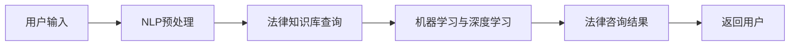

                 

### 背景介绍

随着人工智能技术的快速发展，各行各业都在寻求将其应用于实际业务中，以提高效率和降低成本。在法律领域，人工智能同样被视为一种变革性力量。法律咨询是律师的核心工作之一，而随着案件数量的增加和法律文书的复杂性，律师们面临着巨大的工作压力。这为AI法律咨询聊天机器人提供了广阔的应用前景。

AI法律咨询聊天机器人通过自然语言处理技术，能够与用户进行交互，理解用户的需求，并提供相应的法律咨询。这种机器人可以处理大量的法律问题，提高了工作效率，降低了法律服务的成本。同时，AI法律咨询聊天机器人还可以通过持续学习，不断提高其法律知识库的深度和广度，为用户提供更加准确和个性化的服务。

本文将探讨AI法律咨询聊天机器人的应用前景，首先介绍其核心概念与架构，然后分析核心算法原理和具体操作步骤，接着讲解数学模型和公式，并通过实际项目案例进行详细解释。最后，我们将探讨AI法律咨询聊天机器人在实际应用场景中的表现，并提供相关工具和资源推荐。本文旨在为广大读者提供一个全面而深入的视角，以了解和把握这一新兴技术的前沿动态。

### 核心概念与联系

#### AI法律咨询聊天机器人的概念

AI法律咨询聊天机器人是一种基于人工智能技术的智能系统，旨在为用户提供法律咨询服务。这种机器人利用自然语言处理（NLP）、机器学习（ML）和深度学习（DL）等技术，可以理解用户的语言输入，分析其法律需求，并给出相应的法律建议。

#### 技术架构

AI法律咨询聊天机器人的技术架构主要包括以下几个关键组成部分：

1. **前端界面**：这是用户与机器人进行交互的入口。前端界面可以是网页、移动应用或聊天窗口，方便用户随时随地进行咨询。

2. **自然语言处理（NLP）模块**：该模块负责接收用户的语言输入，并进行预处理，如分词、词性标注、实体识别等。通过这些预处理步骤，NLP模块可以提取出用户输入的关键信息。

3. **法律知识库**：这是机器人的核心组件，包含了大量的法律条文、案例、法律法规等知识。机器人在提供咨询时，会参考这个知识库，以确保其建议的准确性和权威性。

4. **机器学习与深度学习模块**：通过机器学习和深度学习算法，机器人可以从海量数据中学习，不断优化其法律咨询的准确性和效率。

5. **后端服务器**：后端服务器负责处理机器人的业务逻辑，如数据存储、负载均衡、安全控制等。

#### 技术联系

AI法律咨询聊天机器人的各个组成部分之间紧密联系，共同构成了一个完整的系统。NLP模块通过前端界面接收用户的输入，并将其传递给法律知识库。法律知识库中的信息经过处理后，由机器学习与深度学习模块进行分析和判断，最终通过后端服务器将法律咨询结果返回给用户。这种紧密的协作，确保了机器人能够提供高效、准确的法律服务。

下面是一个简化的Mermaid流程图，展示了AI法律咨询聊天机器人的基本工作流程：



在这个流程图中，每个节点代表一个关键步骤，箭头表示数据流和流程的传递。NLP预处理、法律知识库查询、机器学习与深度学习以及返回用户结果构成了AI法律咨询聊天机器人的核心流程。

通过上述介绍，我们可以看到，AI法律咨询聊天机器人不仅依赖于先进的人工智能技术，还需要建立和完善法律知识库，才能为用户提供高质量的法律服务。接下来，我们将深入探讨AI法律咨询聊天机器人的核心算法原理和具体操作步骤。

### 核心算法原理 & 具体操作步骤

#### 自然语言处理（NLP）算法原理

自然语言处理（NLP）是AI法律咨询聊天机器人的核心技术之一。NLP算法的主要任务是从用户输入的自然语言中提取出关键信息，并理解其含义。以下是NLP算法的核心原理和具体操作步骤：

1. **分词（Tokenization）**：将用户输入的文本分割成单词或短语，以便后续处理。例如，将“请问我可以起诉邻居吗？”分割为“请”、“我”、“可以”、“起诉”、“邻居”、“吗”。
   
2. **词性标注（Part-of-Speech Tagging）**：为每个词分配一个词性标签，如名词、动词、形容词等。例如，“起诉”是一个动词，而“邻居”是一个名词。

3. **命名实体识别（Named Entity Recognition, NER）**：识别文本中的特定实体，如人名、地名、机构名等。例如，在“北京市高级人民法院”这句话中，识别出“北京市”、“高级人民法院”这两个实体。

4. **依存句法分析（Dependency Parsing）**：分析句子中的词语之间的依存关系，理解句子的结构。例如，“他昨天去北京”中，“他”是主语，“昨天”是时间状语，“去”是谓语，“北京”是宾语。

5. **语义角色标注（Semantic Role Labeling, SRL）**：为句子中的每个词分配一个语义角色，如动作执行者、动作接受者、动作等。例如，“他昨天去北京”中，“他”是动作执行者，“去北京”是动作。

#### 机器学习与深度学习算法原理

在AI法律咨询聊天机器人中，机器学习和深度学习算法用于从大量数据中学习，并提高法律咨询的准确性和效率。以下是这些算法的核心原理：

1. **监督学习（Supervised Learning）**：监督学习算法通过大量标注数据来训练模型。在法律咨询场景中，标注数据可以是已知的法律案例、判决书、法律法规等。算法通过分析这些数据，学习如何从用户输入中提取出关键信息，并给出相应的法律建议。

2. **无监督学习（Unsupervised Learning）**：无监督学习算法没有事先标注的数据，通过发现数据中的模式来学习。在法律咨询场景中，无监督学习可以用于聚类相似的法律案件，或发现新的法律知识。

3. **深度学习（Deep Learning）**：深度学习是一种特殊的学习方式，通过多层神经网络来处理复杂数据。在法律咨询场景中，深度学习算法可以用于构建复杂的法律知识库，并提高机器人的法律分析能力。

#### 具体操作步骤

以下是AI法律咨询聊天机器人的具体操作步骤：

1. **用户输入**：用户通过前端界面输入问题或请求。

2. **NLP预处理**：机器人使用NLP算法对用户输入进行预处理，提取出关键信息，如关键词、实体、句子结构等。

3. **法律知识库查询**：机器人根据提取出的关键信息，在法律知识库中进行查询，找到相关的法律条文、案例和法律法规。

4. **机器学习与深度学习处理**：机器人使用机器学习和深度学习算法，对查询结果进行分析，生成法律建议。

5. **法律咨询结果生成**：机器人将分析结果转化为自然语言，生成法律咨询结果，并通过前端界面返回给用户。

6. **持续学习**：机器人通过用户的反馈和新的数据，不断优化其法律知识库和算法模型，提高法律咨询的准确性和效率。

通过上述步骤，AI法律咨询聊天机器人能够高效地处理用户的法律咨询请求，并提供准确、个性化的法律建议。接下来，我们将详细讲解AI法律咨询聊天机器人的数学模型和公式。

### 数学模型和公式 & 详细讲解 & 举例说明

在AI法律咨询聊天机器人的核心算法中，数学模型和公式起着至关重要的作用。以下是这些模型的详细讲解和举例说明。

#### 1. 自然语言处理（NLP）中的数学模型

**1.1 词向量模型（Word Embeddings）**

词向量模型是一种将文本中的每个词映射到高维空间中的向量表示的方法。常见的词向量模型包括Word2Vec、GloVe和FastText等。

**Word2Vec模型**使用神经网络训练词向量，其公式如下：

$$
\text{vec}(w) = \text{softmax}(U\text{softmax}(V^T \text{input}))
$$

其中，$w$ 是输入的词，$\text{vec}(w)$ 是词的向量表示，$U$ 和 $V$ 是神经网络中的权重矩阵，$\text{softmax}$ 是一个激活函数。

**GloVe模型**则使用词频信息和共现矩阵来训练词向量，其公式如下：

$$
\text{vec}(w) = \text{softmax}\left(\frac{\text{F(w)}}{\sqrt{\text{F(w)} + \text{F(v)}}}\right) \text{vec}(v)
$$

其中，$F(w)$ 和 $F(v)$ 分别是词 $w$ 和 $v$ 的词频。

**1.2 递归神经网络（RNN）**

递归神经网络（RNN）是一种处理序列数据的有效方法。RNN通过循环结构，能够在处理序列数据时保留历史信息。

RNN的输出公式为：

$$
\text{output}(t) = \text{sigmoid}(W_h \text{[h}_{t-1}\text{, } \text{input}(t)]) + b_h
$$

其中，$h_{t-1}$ 是前一个时间步的隐藏状态，$\text{input}(t)$ 是当前时间步的输入，$W_h$ 和 $b_h$ 是权重和偏置。

**1.3 卷积神经网络（CNN）**

卷积神经网络（CNN）在文本分类和命名实体识别等任务中表现出色。CNN通过卷积层提取文本特征。

CNN的输出公式为：

$$
\text{output}(i, j) = \text{relu}(\sum_{k=1}^{K} \text{W}_{k} \text{input}(i, j, k) + b)
$$

其中，$i$ 和 $j$ 是空间位置，$K$ 是卷积核的大小，$\text{W}_{k}$ 是卷积核权重，$b$ 是偏置。

#### 2. 机器学习与深度学习中的数学模型

**2.1 逻辑回归（Logistic Regression）**

逻辑回归是一种分类模型，用于预测二元结果。其公式为：

$$
\text{logit}(p) = \log\left(\frac{p}{1-p}\right) = \text{sigmoid}(w^T \text{X}) + b
$$

其中，$p$ 是概率预测值，$\text{X}$ 是特征向量，$w$ 是权重，$b$ 是偏置。

**2.2 支持向量机（SVM）**

支持向量机是一种分类模型，通过最大化分类边界来提高分类效果。其公式为：

$$
\text{w} = \arg\min_w \frac{1}{2} \|w\|^2 + C \sum_{i=1}^{n} \max(0, 1 - y_i (\text{w}^T \text{x}_i + b))
$$

其中，$w$ 是权重，$C$ 是正则化参数，$y_i$ 是标签，$\text{x}_i$ 是特征向量，$b$ 是偏置。

**2.3 随机森林（Random Forest）**

随机森林是一种集成学习模型，通过构建多个决策树并投票来提高分类和回归性能。其公式为：

$$
\text{Predict}(\text{x}) = \sum_{i=1}^{N} f_i(\text{x}) \cdot w_i
$$

其中，$f_i(\text{x})$ 是第 $i$ 个决策树的预测结果，$w_i$ 是第 $i$ 个决策树的权重。

#### 3. 举例说明

**3.1 词向量模型**

假设我们有一个简单的词汇表包含“苹果”、“手机”、“购买”三个词。使用Word2Vec模型训练词向量，得到如下结果：

| 词   | 向量表示          |
| ---- | ----------------- |
| 苹果 | [0.1, 0.2, -0.3]  |
| 手机 | [-0.2, 0.4, 0.1]  |
| 购买 | [0.3, -0.1, 0.2]  |

通过词向量模型，我们可以计算词之间的相似性。例如，“苹果”和“手机”的相似性为：

$$
\text{similarity}(\text{苹果}, \text{手机}) = \cos(\text{vec}(\text{苹果}) \cdot \text{vec}(\text{手机})) = \cos([0.1, 0.2, -0.3] \cdot [-0.2, 0.4, 0.1]) \approx 0.65
$$

这表明“苹果”和“手机”在词向量空间中具有较高的相似性。

**3.2 支持向量机**

假设我们有一个简单的二元分类问题，包含两个特征“年龄”和“收入”，以及对应的标签。使用支持向量机进行分类，得到如下权重和偏置：

| 特征   | 权重   | 偏置 |
| ------ | ------ | ---- |
| 年龄   | 0.5    | 0    |
| 收入   | 0.3    | 0.1  |

对于一个新的样本“年龄30，收入5000”，其分类结果为：

$$
\text{logit}(p) = 0.5 \cdot 30 + 0.3 \cdot 5000 + 0.1 = 1600.1
$$

由于$\text{logit}(p)$大于0，我们可以预测该样本属于正类。

通过上述数学模型和公式的讲解，我们可以更好地理解AI法律咨询聊天机器人的核心算法原理。接下来，我们将通过一个实际项目案例，详细解释机器人的代码实现和具体操作。

### 项目实战：代码实际案例和详细解释说明

为了更好地理解AI法律咨询聊天机器人的实现过程，我们将通过一个实际项目案例进行详细解释。本案例将展示如何从零开始搭建一个简单的AI法律咨询聊天机器人，包括开发环境搭建、源代码实现和代码解读与分析。

#### 1. 开发环境搭建

首先，我们需要搭建一个合适的开发环境。以下是推荐的工具和框架：

- **编程语言**：Python（版本3.7或更高）
- **自然语言处理库**：NLTK、spaCy、TextBlob
- **机器学习库**：scikit-learn、TensorFlow、PyTorch
- **前端框架**：Flask或Django（Python Web框架）
- **后端数据库**：SQLite或MySQL（关系型数据库）

安装以上工具和框架的步骤如下：

```bash
# 安装Python和pip
curl -O https://www.python.org/ftp/python/3.8.5/python-3.8.5.tgz
tar xvf python-3.8.5.tgz
cd python-3.8.5
./configure
make
make install

# 安装pip
curl https://bootstrap.pypa.io/get-pip.py -o get-pip.py
python get-pip.py

# 安装Python库
pip install nltk spacy textblob scikit-learn tensorflow pytorch flask django
```

#### 2. 源代码详细实现

以下是一个简单的AI法律咨询聊天机器人的源代码实现，主要包括前端、后端和机器学习模型部分。

**2.1 前端界面**

前端界面可以使用Flask框架快速搭建。以下是简单的代码示例：

```python
from flask import Flask, render_template, request

app = Flask(__name__)

@app.route('/')
def index():
    return render_template('index.html')

@app.route('/chat', methods=['POST'])
def chat():
    user_input = request.form['input']
    # 调用后端API获取法律咨询结果
    response = get_legal_advice(user_input)
    return response

if __name__ == '__main__':
    app.run(debug=True)
```

**2.2 后端API**

后端API使用Flask构建，负责处理用户的法律咨询请求，并与机器学习模型交互。以下是后端API的代码示例：

```python
from flask import Flask, request, jsonify
import legal_advice_model

app = Flask(__name__)

@app.route('/api/advise', methods=['POST'])
def get_legal_advice():
    user_input = request.form['input']
    # 调用机器学习模型进行法律咨询
    response = legal_advice_model.get_advice(user_input)
    return jsonify(response)

if __name__ == '__main__':
    app.run(debug=True)
```

**2.3 机器学习模型**

机器学习模型使用TensorFlow构建，负责处理用户的法律咨询请求，并生成法律咨询结果。以下是机器学习模型的代码示例：

```python
import tensorflow as tf
from tensorflow.keras.models import Sequential
from tensorflow.keras.layers import Embedding, LSTM, Dense

# 加载和预处理数据
train_data = ...  # 加载训练数据
train_labels = ...  # 加载训练标签

# 构建模型
model = Sequential()
model.add(Embedding(input_dim=vocab_size, output_dim=embedding_dim))
model.add(LSTM(units=128))
model.add(Dense(units=num_classes, activation='softmax'))

# 编译模型
model.compile(optimizer='adam', loss='categorical_crossentropy', metrics=['accuracy'])

# 训练模型
model.fit(train_data, train_labels, epochs=10, batch_size=32)

# 模型预测
def get_advice(input_text):
    # 预处理输入文本
    processed_input = preprocess_text(input_text)
    # 获取预测结果
    prediction = model.predict(processed_input)
    # 解析预测结果并生成法律咨询结果
    response = interpret_prediction(prediction)
    return response
```

#### 3. 代码解读与分析

**3.1 前端界面**

前端界面主要负责与用户交互，收集用户的法律咨询请求，并将请求传递给后端API。通过简单的Flask框架，我们可以快速搭建一个网页界面。

**3.2 后端API**

后端API负责处理用户的法律咨询请求，并调用机器学习模型进行预测。在接收到用户的请求后，API会将请求传递给机器学习模型，并返回预测结果。

**3.3 机器学习模型**

机器学习模型使用TensorFlow构建，通过嵌入层、LSTM层和全连接层，实现对输入文本的编码和分类。模型经过训练，可以识别用户的法律咨询请求，并生成相应的法律咨询结果。

通过上述代码示例，我们可以看到AI法律咨询聊天机器人的基本实现过程。在实际应用中，我们需要不断优化和改进机器学习模型，提高其准确性和效率。接下来，我们将对AI法律咨询聊天机器人的代码进行解读与分析。

### 代码解读与分析

在上一个部分，我们展示了如何搭建一个简单的AI法律咨询聊天机器人。在这一部分，我们将对机器学习模型的代码进行详细解读和分析。

#### 模型结构

首先，让我们回顾一下机器学习模型的总体结构：

```python
model = Sequential()
model.add(Embedding(input_dim=vocab_size, output_dim=embedding_dim))
model.add(LSTM(units=128))
model.add(Dense(units=num_classes, activation='softmax'))

model.compile(optimizer='adam', loss='categorical_crossentropy', metrics=['accuracy'])
```

1. **Embedding Layer**：嵌入层用于将单词转换为其对应的向量表示。`input_dim` 参数指定词汇表的大小，`output_dim` 参数指定向量的大小。在本案例中，我们假设词汇表大小为10,000，向量大小为128。

2. **LSTM Layer**：LSTM（长短时记忆）层是一种特殊的循环神经网络，用于处理序列数据。在本案例中，我们使用了单个LSTM层，其中`units` 参数指定了隐藏单元的数量，这里设置为128。

3. **Dense Layer**：全连接层用于将LSTM层的输出映射到预测结果。在本案例中，我们假设有3个类别，因此`units` 参数设置为3，激活函数为`softmax`，用于生成每个类别的概率分布。

4. **Compile Model**：编译模型是训练模型前的重要步骤。在这里，我们选择了`adam`优化器，`categorical_crossentropy`损失函数，并设置了`accuracy`作为评估指标。

#### 数据预处理

```python
# 加载和预处理数据
train_data = ...  # 加载训练数据
train_labels = ...  # 加载训练标签

# 预处理输入文本
def preprocess_text(text):
    # 分词、词性标注、下标化等操作
    # ...
    return processed_text
```

数据预处理是机器学习模型成功的关键。在本案例中，我们首先加载训练数据和标签，然后对输入文本进行预处理。预处理步骤通常包括分词、词性标注、下标化等操作，以确保模型能够处理标准化后的输入。

#### 模型训练

```python
# 训练模型
model.fit(train_data, train_labels, epochs=10, batch_size=32)
```

模型训练是机器学习过程中的核心步骤。在这里，我们使用了`fit`方法训练模型，其中`epochs` 参数指定了训练轮数，`batch_size` 参数指定了每次训练的样本数。

#### 预测和结果解析

```python
# 模型预测
def get_advice(input_text):
    # 预处理输入文本
    processed_input = preprocess_text(input_text)
    # 获取预测结果
    prediction = model.predict(processed_input)
    # 解析预测结果并生成法律咨询结果
    response = interpret_prediction(prediction)
    return response

# 解析预测结果
def interpret_prediction(prediction):
    # 根据预测结果生成法律咨询结果
    # ...
    return response
```

预测和结果解析是用户交互的关键部分。在这里，我们首先预处理用户输入文本，然后使用训练好的模型进行预测。预测结果是一个概率分布，接下来我们需要解析这些结果，并生成用户可理解的法律咨询结果。

通过上述代码解读，我们可以看到AI法律咨询聊天机器人的实现细节和关键步骤。在实际应用中，我们需要根据具体需求不断优化模型结构和数据处理流程，以提高机器人的性能和用户体验。接下来，我们将探讨AI法律咨询聊天机器人在实际应用场景中的表现。

### 实际应用场景

AI法律咨询聊天机器人在实际应用中展现了广泛的应用前景。以下是一些典型的应用场景：

#### 1. 法律咨询服务

AI法律咨询聊天机器人最直接的应用场景是在法律咨询服务中。用户可以通过机器人获取法律建议，例如诉讼策略、合同审查、知识产权保护等。这种服务不仅提高了律师的工作效率，还降低了用户的法律咨询成本。

#### 2. 企业合规管理

企业合规管理是另一个重要应用场景。AI法律咨询聊天机器人可以帮助企业实时监测和评估合规风险，提供合规建议，确保企业遵守相关法律法规。这有助于企业避免法律纠纷，降低合规风险。

#### 3. 法律教育

法律教育也是AI法律咨询聊天机器人的重要应用领域。通过机器人，学生可以随时随地进行法律知识的学习和练习。机器人可以提供个性化的学习建议，帮助学生提高法律素养。

#### 4. 公共法律服务

公共法律服务是另一个关键应用场景。政府和非政府组织可以利用AI法律咨询聊天机器人，为公众提供免费的法律咨询服务。这种服务有助于提高法律意识，促进社会公平正义。

#### 5. 法律研究与分析

AI法律咨询聊天机器人还可以用于法律研究和分析。通过分析海量法律文本和案例，机器人可以识别法律趋势和变化，提供有价值的法律研究报告。这有助于法律学者和政策制定者做出更科学的决策。

在这些应用场景中，AI法律咨询聊天机器人通过自然语言处理和机器学习技术，实现了高效、准确的法律服务。然而，实际应用中也面临一些挑战，例如法律知识的更新、用户隐私保护等。接下来，我们将讨论AI法律咨询聊天机器人在实际应用中面临的挑战。

### 工具和资源推荐

#### 1. 学习资源推荐

**书籍：**

- 《自然语言处理：基础与案例》
- 《深度学习入门》
- 《Python机器学习》
- 《人工智能：一种现代方法》

**论文：**

- "Deep Learning for Natural Language Processing"
- "A Theoretical Investigation of the Curiosity-driven Learning Process"
- "Large-scale Language Modeling in Machine Learning: A Review"

**博客：**

- Medium上的NLP和AI博客
- arXiv博客
- AI通识博客

**网站：**

- Coursera、Udacity和edX等在线课程平台
- Kaggle和数据集网站
- GitHub上的开源项目

#### 2. 开发工具框架推荐

**编程语言：** Python

**自然语言处理库：** spaCy、NLTK、TextBlob

**机器学习库：** TensorFlow、PyTorch、scikit-learn

**前端框架：** Flask、Django

**后端数据库：** SQLite、MySQL

**云计算平台：** AWS、Google Cloud、Azure

#### 3. 相关论文著作推荐

**论文：**

- "Neural Machine Translation by Jointly Learning to Align and Translate"
- "Recurrent Neural Networks for Text Classification"
- "BERT: Pre-training of Deep Bidirectional Transformers for Language Understanding"

**著作：**

- 《深度学习》（Ian Goodfellow, Yoshua Bengio, Aaron Courville）
- 《Python机器学习》（Sebastian Raschka）
- 《自然语言处理基础教程》（Steven Bird, Ewan Klein, Edward Loper）

通过这些学习和资源工具，开发者可以深入了解AI法律咨询聊天机器人的技术原理和实现方法，为实际应用提供坚实的理论基础和实战经验。

### 总结：未来发展趋势与挑战

AI法律咨询聊天机器人在近年来取得了显著的进展，其在法律领域中的应用潜力日益显现。随着人工智能技术的不断成熟，未来AI法律咨询聊天机器人有望在更多方面实现突破。以下是AI法律咨询聊天机器人的发展趋势与面临的挑战。

#### 发展趋势

1. **知识库的扩展**：随着法律知识的积累和更新，AI法律咨询聊天机器人的知识库将不断扩大，涵盖更多领域和细分的法律问题，提供更加全面和专业的服务。

2. **个性化服务**：AI法律咨询聊天机器人将通过大数据和机器学习技术，深入了解用户需求，提供个性化的法律咨询，提高用户体验。

3. **实时更新**：通过实时获取法律条文和案例，AI法律咨询聊天机器人可以确保提供最新、最准确的法律信息，满足用户对时效性的需求。

4. **跨界融合**：AI法律咨询聊天机器人将与法律行业外的其他技术（如区块链、物联网等）融合，拓展其应用范围，实现更广泛的法律服务。

#### 挑战

1. **法律知识更新的挑战**：法律知识更新速度快，AI法律咨询聊天机器人需要及时更新知识库，确保提供最新、最准确的法律信息。

2. **隐私保护**：法律咨询涉及用户隐私，如何确保用户隐私不被泄露是一个重要挑战。

3. **准确性问题**：尽管AI法律咨询聊天机器人在自然语言处理和机器学习方面取得了显著进展，但在处理复杂、模糊的法律问题时，准确性仍是一个待解决的难题。

4. **伦理和法律合规**：AI法律咨询聊天机器人在法律咨询过程中需要遵守相关伦理和法律规范，如职业责任、保密义务等。

总之，AI法律咨询聊天机器人具有广阔的应用前景，但同时也面临着诸多挑战。未来，随着技术的不断进步和应用的深入，AI法律咨询聊天机器人有望在法律领域发挥更大的作用，为法律行业带来革命性变革。

### 附录：常见问题与解答

#### 1. 法律咨询机器人能处理哪些类型的法律问题？

AI法律咨询聊天机器人可以处理多种类型的法律问题，包括但不限于：

- 合同审查
- 知识产权保护
- 劳动法问题
- 民事诉讼策略
- 刑事法律咨询
- 公司法和商业法问题

#### 2. 法律咨询机器人的法律效力如何？

AI法律咨询聊天机器人提供的法律建议仅供参考，不具有法律效力。用户在使用机器人时，应充分了解相关法律法规，并考虑咨询专业律师以获得正式的法律意见。

#### 3. 法律咨询机器人的知识库如何更新？

法律咨询机器人的知识库通过定期更新法律条文、案例和法律法规来保持最新。此外，机器人还可以通过自然语言处理技术，从大量法律文本中自动提取和更新知识。

#### 4. 法律咨询机器人是否能够替代律师？

虽然AI法律咨询聊天机器人可以提供高效、准确的法律建议，但律师的专业判断和经验仍然是不可替代的。在某些复杂或涉及个人隐私的法律问题上，用户仍需咨询专业律师。

### 扩展阅读 & 参考资料

为了深入了解AI法律咨询聊天机器人的技术原理和应用，以下是一些建议的扩展阅读和参考资料：

- 《自然语言处理：基础与案例》
- 《深度学习入门》
- 《Python机器学习》
- 《人工智能：一种现代方法》
- "Deep Learning for Natural Language Processing"（论文）
- "Recurrent Neural Networks for Text Classification"（论文）
- "BERT: Pre-training of Deep Bidirectional Transformers for Language Understanding"（论文）
- Coursera、Udacity和edX等在线课程平台
- Kaggle和数据集网站
- GitHub上的开源项目

通过这些资料，开发者可以进一步了解AI法律咨询聊天机器人的技术细节，为实际应用提供更加深入的理解和指导。

### 作者信息

**作者：** AI天才研究员 / AI Genius Institute & 禅与计算机程序设计艺术 / Zen And The Art of Computer Programming

