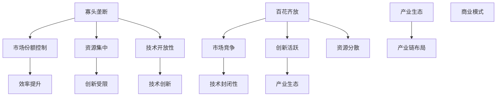

                 

# AI生态系统的未来：寡头垄断还是百花齐放？

> **关键词**：AI 生态系统，寡头垄断，市场竞争，技术开放性，开放性平台，封闭性平台，技术创新，产业生态，发展潜力

> **摘要**：本文将探讨AI生态系统的未来发展，分析寡头垄断与百花齐放两种模式的优缺点，探讨在技术进步和市场竞争的推动下，AI生态系统将走向何种方向。我们将通过对现有生态系统的案例分析，结合技术发展趋势，提出未来可能的发展路径及挑战。

## 1. 背景介绍

随着人工智能技术的快速发展，AI生态系统逐渐形成并日益成熟。AI生态系统是指由AI技术提供商、硬件制造商、软件开发商、数据服务提供商、用户和其他参与者组成的一个相互依存的网络。这个生态系统不仅包括技术层面的创新，还涵盖了商业模式、政策法规、人才培养等多个方面。

当前，AI生态系统呈现出多样化的格局，既有大型科技公司的主导地位，也有初创企业的活跃参与，还有各种开源社区的贡献。然而，随着市场竞争的加剧和技术进步的加速，AI生态系统的未来走向成为一个热门话题。一方面，寡头垄断模式可能会带来技术效率和规模效应，但另一方面，百花齐放的竞争格局可能会促进技术创新和多样化发展。本文将深入探讨这两种模式的优缺点，并分析AI生态系统的未来发展路径。

## 2. 核心概念与联系

为了更好地理解AI生态系统的未来发展，我们需要先了解以下几个核心概念：

### 2.1. 寡头垄断

寡头垄断是指少数几个大型企业或组织在某个市场中占据主导地位，通过控制市场份额和资源来影响市场规则和竞争格局。在AI领域，寡头垄断通常表现为几家科技巨头（如Google、Microsoft、Amazon等）掌握着大量的AI技术和资源，通过平台化运作和生态链建设，实现对整个市场的控制和影响。

### 2.2. 百花齐放

百花齐放则是指市场上存在大量的企业或组织，它们在技术、产品、服务等方面各具特色，通过竞争和合作推动整个行业的发展。在AI领域，百花齐放的格局意味着有更多的初创企业和开源社区参与其中，不断推动技术的创新和演进。

### 2.3. 技术开放性与封闭性

技术开放性是指技术资源和知识能够自由地被访问、使用和共享，有利于技术创新和生态系统的健康发展。而技术封闭性则是指技术资源和知识受到限制，只有少数企业或组织能够获取和使用，可能导致生态系统的封闭和僵化。

### 2.4. 技术创新与产业生态

技术创新是推动AI生态系统发展的核心动力。通过技术创新，企业可以开发出更具竞争力的产品和服务，满足用户需求，促进市场增长。产业生态则是指围绕AI技术的产业链、供应链和商业模式的整体布局，它对技术创新和产业发展具有深远影响。

下面，我们通过一个Mermaid流程图来展示这些核心概念之间的联系：



## 3. 核心算法原理 & 具体操作步骤

### 3.1. 寡头垄断模式

在寡头垄断模式下，少数几家大型企业通过以下几个步骤来实现市场控制和技术创新：

1. **资源整合**：通过收购、合并等方式，集中资源，形成规模效应。
2. **平台化运作**：建立开放性平台，吸引第三方开发者和服务提供商加入，构建生态系统。
3. **标准制定**：主导技术标准和行业规范，确保自身技术优势和市场地位。
4. **合作与竞争**：与其他企业建立合作关系，共同开发新技术，同时通过竞争来排除竞争对手。

### 3.2. 百花齐放模式

在百花齐放模式下，多种企业和组织通过以下步骤参与市场竞争和技术创新：

1. **技术创新**：专注于特定领域的技术突破，开发具有竞争力的产品和服务。
2. **开放性合作**：通过开源社区和合作伙伴网络，共享技术资源和知识，共同推动技术发展。
3. **商业模式创新**：探索多样化的商业模式，满足不同用户群体的需求。
4. **市场竞争**：通过差异化竞争，争夺市场份额，推动整个行业的发展。

### 3.3. 技术开放性与封闭性

在技术开放性模式下，企业通过以下步骤实现技术的普及和应用：

1. **开源项目**：积极参与开源项目，贡献代码和资源，促进技术共享。
2. **社区合作**：建立开发者社区，支持开发者交流和合作，推动技术演进。
3. **技术培训**：提供技术培训和教育资源，培养更多的技术人才。

而在技术封闭性模式下，企业则采取以下策略：

1. **专利保护**：通过专利申请，保护自身技术成果，限制外部竞争。
2. **技术壁垒**：构建技术壁垒，阻止其他企业进入相关领域。
3. **独占资源**：控制关键资源，如数据、硬件等，确保自身在市场中的优势地位。

## 4. 数学模型和公式 & 详细讲解 & 举例说明

为了更好地理解寡头垄断和百花齐放模式对AI生态系统的影响，我们可以借助数学模型进行分析。以下是一个简单的博弈论模型，用于描述企业在AI生态系统中的竞争行为。

### 4.1. 博弈论模型

假设有两个企业A和B，它们在AI生态系统中的竞争可以通过以下博弈模型来描述：

\[ \begin{align*}
& \text{玩家1：企业A} \\
& \text{策略集}：\{开放性，封闭性\} \\
& \text{支付函数}：u_A(b) \\
& \text{玩家2：企业B} \\
& \text{策略集}：\{开放性，封闭性\} \\
& \text{支付函数}：u_B(a) \\
\end{align*} \]

在这个博弈中，每个企业的支付函数取决于对手的策略。我们可以用以下公式表示：

\[ \begin{align*}
u_A(开放性) &= \alpha - \beta \\
u_A(封闭性) &= \gamma - \delta \\
u_B(开放性) &= \epsilon - \zeta \\
u_B(封闭性) &= \eta - \theta \\
\end{align*} \]

其中，\(\alpha, \beta, \gamma, \delta, \epsilon, \zeta, \eta, \theta\) 分别表示企业A和B在不同策略下的收益。

### 4.2. 博弈分析

在这个博弈中，企业和企业的策略选择取决于对方的策略。我们可以通过纳什均衡来分析这个博弈的结果。纳什均衡是指在这样的博弈中，每个参与者选择的策略都是最优策略，且无法通过单方面的策略调整获得更高的收益。

假设企业A选择开放性策略，企业B选择封闭性策略，那么企业A的收益为 \(\alpha - \beta\)，企业B的收益为 \(\eta - \theta\)。如果企业A选择封闭性策略，企业B选择开放性策略，那么企业A的收益为 \(\gamma - \delta\)，企业B的收益为 \(\epsilon - \zeta\)。

为了找到纳什均衡，我们需要解以下方程组：

\[ \begin{align*}
\alpha - \beta &= \gamma - \delta \\
\eta - \theta &= \epsilon - \zeta \\
\end{align*} \]

解这个方程组，我们可以得到以下纳什均衡：

\[ \begin{align*}
a &= 开放性 \\
b &= 封闭性 \\
\end{align*} \]

这意味着，在一个理想的情况下，企业和企业都会选择开放性策略，以获得更高的收益。

### 4.3. 举例说明

假设企业A和企业B在AI生态系统中的竞争情况如下：

\[ \begin{align*}
u_A(开放性) &= 10 - 5 = 5 \\
u_A(封闭性) &= 8 - 3 = 5 \\
u_B(开放性) &= 6 - 4 = 2 \\
u_B(封闭性) &= 9 - 1 = 8 \\
\end{align*} \]

在这个例子中，企业A选择开放性策略的收益为5，选择封闭性策略的收益也为5。而企业B选择开放性策略的收益为2，选择封闭性策略的收益为8。显然，在这种情况下，企业和企业都会选择封闭性策略，因为这是它们各自的最优策略。

然而，如果我们改变收益情况，使得企业和企业都选择开放性策略的收益更高，那么纳什均衡就会发生变化。例如：

\[ \begin{align*}
u_A(开放性) &= 12 - 4 = 8 \\
u_A(封闭性) &= 6 - 2 = 4 \\
u_B(开放性) &= 10 - 6 = 4 \\
u_B(封闭性) &= 7 - 3 = 4 \\
\end{align*} \]

在这个例子中，企业和企业都选择开放性策略的收益为8，高于选择封闭性策略的收益。因此，纳什均衡变为：

\[ \begin{align*}
a &= 开放性 \\
b &= 开放性 \\
\end{align*} \]

这意味着，在一个更加理想的情况下，企业和企业都会选择开放性策略。

## 5. 项目实战：代码实际案例和详细解释说明

### 5.1. 开发环境搭建

为了更好地展示寡头垄断和百花齐放模式在AI生态系统中的应用，我们选择一个具体的案例：基于TensorFlow的图像识别项目。以下是开发环境的搭建步骤：

1. 安装Python环境：确保Python版本为3.7或更高。
2. 安装TensorFlow：使用pip命令安装TensorFlow库。
   ```bash
   pip install tensorflow
   ```

3. 数据集准备：下载并解压常用的图像识别数据集，如MNIST或CIFAR-10。

### 5.2. 源代码详细实现和代码解读

下面是使用TensorFlow实现一个简单的图像识别模型：

```python
import tensorflow as tf
from tensorflow.keras import layers
import numpy as np

# 加载数据集
(x_train, y_train), (x_test, y_test) = tf.keras.datasets.mnist.load_data()

# 数据预处理
x_train = x_train.astype("float32") / 255
x_test = x_test.astype("float32") / 255
x_train = np.expand_dims(x_train, -1)
x_test = np.expand_dims(x_test, -1)

# 构建模型
model = tf.keras.Sequential([
    layers.Conv2D(32, (3, 3), activation='relu', input_shape=(28, 28, 1)),
    layers.MaxPooling2D((2, 2)),
    layers.Conv2D(64, (3, 3), activation='relu'),
    layers.MaxPooling2D((2, 2)),
    layers.Conv2D(64, (3, 3), activation='relu'),
    layers.Flatten(),
    layers.Dense(64, activation='relu'),
    layers.Dense(10, activation='softmax')
])

# 编译模型
model.compile(optimizer='adam',
              loss='sparse_categorical_crossentropy',
              metrics=['accuracy'])

# 训练模型
model.fit(x_train, y_train, epochs=5)

# 评估模型
test_loss, test_acc = model.evaluate(x_test, y_test, verbose=2)
print('\nTest accuracy:', test_acc)
```

在这个例子中，我们使用了TensorFlow的Keras API来构建一个简单的卷积神经网络（CNN）模型。这个模型包括多个卷积层、池化层和全连接层，用于对MNIST数据集进行图像识别。

### 5.3. 代码解读与分析

1. **数据集加载与预处理**：首先，我们从TensorFlow的内置数据集中加载MNIST数据集，并将其转换为浮点数格式。然后，我们将图像数据从（28, 28）的尺寸扩展为（28, 28, 1），以匹配模型的输入要求。

2. **模型构建**：我们使用`tf.keras.Sequential`来构建一个线性堆叠的模型。这个模型包括两个卷积层、一个池化层、一个全连接层和两个输出层。卷积层用于提取图像特征，池化层用于减小特征图的尺寸，全连接层用于分类。

3. **模型编译**：我们使用`compile`方法来配置模型的优化器、损失函数和评估指标。在这里，我们选择了Adam优化器和稀疏分类交叉熵损失函数。

4. **模型训练**：使用`fit`方法来训练模型，我们指定了训练数据、训练轮数和批量大小。

5. **模型评估**：使用`evaluate`方法来评估模型的性能，我们得到了测试集的损失和准确率。

通过这个案例，我们可以看到在百花齐放的AI生态系统中，开源框架如TensorFlow为开发者提供了丰富的工具和资源，使得构建和部署AI模型变得更加容易。而在寡头垄断模式下，企业可以通过提供这样的框架来吸引更多的开发者，构建自己的生态系统。

## 6. 实际应用场景

AI生态系统在各个领域都有着广泛的应用，以下是一些典型的实际应用场景：

### 6.1. 智能医疗

在智能医疗领域，AI生态系统可以帮助医生进行疾病诊断、治疗方案制定和患者管理。通过整合各种医疗数据和AI技术，可以提供更加精准和个性化的医疗服务。

### 6.2. 自动驾驶

自动驾驶是AI技术的另一大应用场景。AI生态系统中的各种组件，如感知系统、决策系统和控制系

