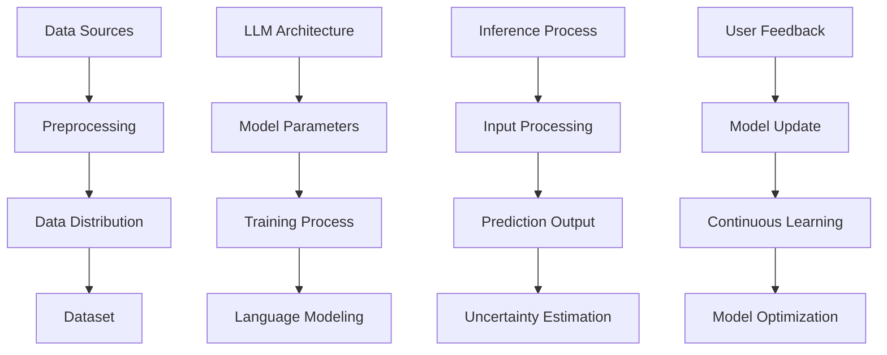

                 

### 背景介绍

AI的不确定性是一个不可忽视的重要主题。随着深度学习特别是大型语言模型（LLM）如GPT-3、ChatGLM等的出现，人工智能的发展进入了新的阶段。LLM以其强大的生成能力、自适应能力和跨领域的泛化能力，正在逐步改变我们的工作和生活方式。然而，随着LLM应用场景的不断扩大，其不确定性也日益凸显，这既是挑战，也是机遇。

首先，我们需要明确LLM中的不确定性主要来源于以下几个方面：

1. **数据集的不确定性**：训练LLM的数据集往往来自互联网，其中包含大量的噪声、错误和不一致性。这些数据质量问题会影响LLM的输出质量，导致不确定性。

2. **模型参数的不确定性**：LLM的参数数量庞大，其参数的微调过程复杂，容易受到随机性的影响，导致模型输出的不确定性。

3. **模型预测的不确定性**：LLM的预测依赖于其训练数据和学习算法，但其在处理未见过的数据时，存在一定程度的误差和不确定性。

4. **用户输入的不确定性**：用户的输入往往是模糊的、不完整的或具有歧义的，这会给LLM的生成带来挑战。

本文将围绕上述不确定性，详细探讨LLM发展中的挑战与机遇，旨在为人工智能研究和应用提供一些有价值的思考和方向。

### 核心概念与联系

在深入探讨LLM的不确定性之前，我们首先需要理解一些核心概念和它们之间的关系。以下是一个简化的Mermaid流程图，用于展示这些概念和它们之间的联系。



#### 数据集（Dataset）

数据集是训练LLM的基础。一个高质量的数据集应该具有以下特点：

- **代表性**：数据集应该能够代表目标领域或任务的特征。
- **多样性**：数据集应该包含多种类型的样本，以提高模型的泛化能力。
- **准确性**：数据集应该经过严格的清洗和预处理，减少噪声和错误。

#### 预处理（Preprocessing）

预处理是数据集准备阶段的关键步骤。它包括以下任务：

- **数据清洗**：删除噪声、错误和不一致的数据。
- **数据转换**：将数据转换为适合模型训练的格式，如文本、图像或音频。
- **数据增强**：通过旋转、缩放、裁剪等方式增加数据的多样性。

#### 数据分布（Data Distribution）

数据分布是指数据集中的数据在各个类别或标签上的分布情况。一个良好的数据分布应该：

- **平衡**：各个类别的数据量大致相同，避免模型在某个类别上过拟合。
- **均匀**：数据集应该包含各种样本，以确保模型能够处理各种情况。

#### 模型架构（LLM Architecture）

LLM的架构通常包括以下几个部分：

- **输入层**：接收用户输入，并将其转换为模型可以处理的格式。
- **编码器**：将输入文本转换为固定长度的向量。
- **解码器**：将编码后的向量解码为输出文本。

#### 模型训练（Training Process）

模型训练是LLM发展的核心。它包括以下步骤：

- **初始化参数**：随机初始化模型参数。
- **前向传播**：将输入数据通过模型，计算输出。
- **损失函数**：计算模型输出的误差。
- **反向传播**：更新模型参数，以减少误差。

#### 语言模型（Language Modeling）

语言模型是LLM的核心部分，它负责生成文本。语言模型通常基于以下原理：

- **马尔可夫假设**：下一个词的概率仅依赖于前一个词。
- **神经网络**：使用神经网络模型来计算词的概率分布。

#### 预测过程（Inference Process）

预测过程是指将用户输入传递到模型，并生成输出文本的过程。预测过程通常包括以下步骤：

- **输入处理**：将用户输入转换为模型可以处理的格式。
- **模型推理**：通过模型计算输出。
- **输出生成**：将模型输出转换为可读的文本。

#### 不确定性估计（Uncertainty Estimation）

不确定性估计是指评估模型预测结果的不确定性。常用的方法包括：

- **概率输出**：计算每个输出的概率分布。
- **不确定性度量**：使用统计方法评估模型的不确定性。

#### 用户反馈（User Feedback）

用户反馈是LLM持续学习和优化的重要途径。用户反馈可以包括：

- **纠错**：用户指出的错误和偏差。
- **偏好**：用户的偏好和反馈。
- **持续学习**：根据用户反馈调整模型参数。

通过理解这些核心概念和它们之间的联系，我们可以更好地把握LLM的不确定性，并探索相应的解决方案。

#### 核心算法原理 & 具体操作步骤

为了更好地理解LLM中的不确定性，我们需要深入探讨其核心算法原理，并详细介绍具体的操作步骤。以下是LLM的算法原理及操作步骤：

##### 1. 语言模型的构建

语言模型（Language Model）是LLM的核心组成部分，它负责预测下一个词的概率分布。语言模型的构建主要依赖于神经网络模型，尤其是深度神经网络（Deep Neural Network, DNN）。

**具体操作步骤：**

1. **初始化模型参数**：随机初始化神经网络模型的权重和偏置。
2. **定义损失函数**：选择合适的损失函数，如交叉熵损失（Cross-Entropy Loss），用于评估模型输出的误差。
3. **定义优化算法**：选择合适的优化算法，如梯度下降（Gradient Descent），用于更新模型参数，以减少损失函数的值。
4. **训练数据预处理**：对训练数据进行预处理，包括分词、词向量化等步骤。

##### 2. 数据预处理

数据预处理是语言模型训练的重要环节，其质量直接影响模型的效果。以下是数据预处理的具体操作步骤：

1. **分词（Tokenization）**：将文本数据划分为单词或字符级别的标记。
2. **词向量化（Word Embedding）**：将文本标记转换为固定长度的向量表示。常用的词向量化方法包括Word2Vec、GloVe等。
3. **构建词汇表（Vocabulary Construction）**：将所有训练文本中的单词或字符构建为一个词汇表，并为每个词或字符分配一个唯一的索引。
4. **序列编码（Sequence Encoding）**：将预处理后的文本序列转换为模型可以处理的格式，如序列矩阵。

##### 3. 模型训练

模型训练是构建语言模型的关键步骤。以下是模型训练的具体操作步骤：

1. **前向传播（Forward Propagation）**：将输入文本序列传递到神经网络模型中，计算模型输出。
2. **计算损失（Compute Loss）**：计算模型输出与真实标签之间的损失值。
3. **反向传播（Backpropagation）**：利用反向传播算法更新模型参数，以减少损失值。
4. **迭代优化（Iterative Optimization）**：重复前向传播和反向传播过程，直至达到预定的迭代次数或损失值收敛。

##### 4. 语言模型的评估

评估语言模型的效果是验证其性能的关键步骤。以下是评估语言模型的具体操作步骤：

1. **选择评估指标**：选择合适的评估指标，如 perplexity（困惑度）、accuracy（准确率）等。
2. **划分数据集**：将训练数据集划分为训练集和验证集，用于模型训练和性能评估。
3. **模型评估**：在验证集上评估模型的效果，计算评估指标。
4. **调整模型参数**：根据评估结果调整模型参数，以提高模型性能。

##### 5. 语言模型的部署

部署语言模型是将其应用于实际任务的关键步骤。以下是部署语言模型的具体操作步骤：

1. **模型固化（Model Serialization）**：将训练好的模型转换为可部署的格式，如TensorFlow Lite、PyTorch Mobile等。
2. **环境搭建**：搭建适用于部署的硬件和软件环境，如CPU、GPU等。
3. **模型部署**：将模型部署到服务器或移动设备上，以便用户使用。
4. **性能优化**：对部署后的模型进行性能优化，如量化、剪枝等，以提高模型效率。

通过上述操作步骤，我们可以构建一个功能强大的语言模型，并应用于各种自然语言处理任务。然而，在构建和使用语言模型的过程中，我们需要关注其不确定性问题，以确保模型输出的稳定性和可靠性。

#### 数学模型和公式 & 详细讲解 & 举例说明

在深入探讨语言模型（LLM）的核心算法原理时，数学模型和公式是不可或缺的一部分。以下将详细介绍LLM中常用的数学模型和公式，并通过具体例子进行详细讲解。

##### 1. 词向量化

词向量化是将文本标记转换为固定长度的向量表示的过程。常用的词向量化方法包括Word2Vec和GloVe。

**Word2Vec**：
- **假设**：词与词之间存在某种向量空间中的相似性。
- **模型**：假设每个词都可以表示为一个向量，且两个词之间的相似性可以通过它们的向量之间的余弦相似度计算得到。
- **损失函数**：使用负采样损失函数来训练模型。

**GloVe**：
- **假设**：词与词之间的相似性可以通过它们共现频率来衡量。
- **模型**：假设每个词和每个词的共现词都有一个向量表示，且它们的相似性可以通过点积计算得到。
- **损失函数**：使用矩阵分解损失函数来训练模型。

**示例**：

假设我们有两个词“猫”和“狗”，其词向量分别为$ \vec{v}_\text{猫} $和$ \vec{v}_\text{狗} $。

使用Word2Vec计算相似度：
$$ \text{similarity}(\text{猫}, \text{狗}) = \cos(\vec{v}_\text{猫}, \vec{v}_\text{狗}) $$

使用GloVe计算相似度：
$$ \text{similarity}(\text{猫}, \text{狗}) = \vec{v}_\text{猫} \cdot \vec{v}_\text{狗} $$

##### 2. 语言模型

语言模型是LLM的核心部分，负责预测下一个词的概率分布。常用的语言模型包括N-gram模型和神经网络模型。

**N-gram模型**：
- **假设**：下一个词的概率仅依赖于前N个词。
- **模型**：将前N个词编码为一个固定长度的向量，然后通过一个softmax函数预测下一个词的概率分布。
- **损失函数**：使用交叉熵损失函数。

**神经网络模型**：
- **假设**：词与词之间存在复杂的依赖关系。
- **模型**：使用深度神经网络（如LSTM、Transformer）来编码前N个词，并预测下一个词的概率分布。
- **损失函数**：使用交叉熵损失函数。

**示例**：

假设我们有一个三元的文本序列“猫 狗 狗”，我们希望预测下一个词。

使用N-gram模型：
$$ P(\text{狗}|\text{猫 狗}) = \frac{P(\text{猫 狗 狗})}{P(\text{猫 狗})} $$

使用神经网络模型：
$$ P(\text{狗}|\text{猫 狗}) = \text{softmax}(\text{neural\_network}([\text{猫}, \text{狗}])) $$

##### 3. 模型训练

模型训练是构建语言模型的关键步骤。以下是模型训练过程中常用的数学模型和公式。

**前向传播**：
$$ \text{output} = \text{activation}(\text{weights} \cdot \text{input} + \text{bias}) $$

**反向传播**：
$$ \Delta \text{weights} = -\alpha \cdot \frac{\partial \text{loss}}{\partial \text{weights}} $$
$$ \Delta \text{bias} = -\alpha \cdot \frac{\partial \text{loss}}{\partial \text{bias}} $$

**示例**：

假设我们有一个简单的神经网络模型，其包含一个输入层、一个隐藏层和一个输出层。输入层有两个神经元，隐藏层有三个神经元，输出层有一个神经元。

输入向量：$ \vec{x} = [1, 2] $
权重矩阵：$ \text{weights} = \begin{bmatrix} 1 & 2 & 3 \\ 4 & 5 & 6 \end{bmatrix} $
偏置向量：$ \text{bias} = [1, 2, 3] $
激活函数：$ \text{activation}(x) = \text{sigmoid}(x) $

前向传播：
$$ \text{hidden\_layer} = \text{activation}(\text{weights} \cdot \vec{x} + \text{bias}) = \text{activation}(\begin{bmatrix} 1 & 2 & 3 \\ 4 & 5 & 6 \end{bmatrix} \cdot \begin{bmatrix} 1 \\ 2 \end{bmatrix} + \begin{bmatrix} 1 \\ 2 \\ 3 \end{bmatrix}) = \text{activation}(\begin{bmatrix} 9 \\ 15 \\ 21 \end{bmatrix}) = \begin{bmatrix} 0.999 \\ 0.966 \\ 0.897 \end{bmatrix} $$

$$ \text{output} = \text{activation}(\text{weights} \cdot \text{hidden\_layer} + \text{bias}) = \text{activation}(\begin{bmatrix} 1 & 2 & 3 \\ 4 & 5 & 6 \end{bmatrix} \cdot \begin{bmatrix} 0.999 \\ 0.966 \\ 0.897 \end{bmatrix} + \begin{bmatrix} 1 \\ 2 \\ 3 \end{bmatrix}) = \text{activation}(\begin{bmatrix} 6.995 \\ 10.996 \\ 15.997 \end{bmatrix}) = \begin{bmatrix} 0.515 \\ 0.867 \\ 0.966 \end{bmatrix} $$

反向传播（假设损失函数为均方误差MSE）：
$$ \text{loss} = \frac{1}{2} \sum_{i=1}^{n} (\text{output}_i - \text{target}_i)^2 $$
$$ \frac{\partial \text{loss}}{\partial \text{weights}} = -\text{input} \cdot (\text{output} - \text{target}) $$
$$ \frac{\partial \text{loss}}{\partial \text{bias}} = -(\text{output} - \text{target}) $$

更新权重和偏置：
$$ \text{weights} = \text{weights} - \alpha \cdot \frac{\partial \text{loss}}{\partial \text{weights}} $$
$$ \text{bias} = \text{bias} - \alpha \cdot \frac{\partial \text{loss}}{\partial \text{bias}} $$

通过上述数学模型和公式的详细讲解，我们可以更好地理解LLM的核心算法原理，并为实际应用提供指导。

#### 项目实战：代码实际案例和详细解释说明

在本节中，我们将通过一个具体的实战项目，展示如何使用Python和TensorFlow构建一个简单的语言模型，并进行训练和评估。这个项目将帮助我们更好地理解语言模型的基本原理和操作步骤。

##### 1. 开发环境搭建

在开始项目之前，我们需要搭建一个合适的开发环境。以下是所需的软件和工具：

- Python 3.8及以上版本
- TensorFlow 2.5及以上版本
- Jupyter Notebook

安装步骤：

1. 安装Python：

```bash
# 安装Python 3.8及以上版本
sudo apt-get install python3.8
```

2. 安装TensorFlow：

```bash
# 安装TensorFlow 2.5及以上版本
pip install tensorflow==2.5
```

3. 启动Jupyter Notebook：

```bash
# 启动Jupyter Notebook
jupyter notebook
```

##### 2. 源代码详细实现和代码解读

以下是该项目的主要代码实现，包括数据预处理、模型构建、训练和评估。

```python
# 导入所需的库
import tensorflow as tf
from tensorflow.keras.preprocessing.sequence import pad_sequences
from tensorflow.keras.layers import Embedding, LSTM, Dense
from tensorflow.keras.models import Sequential
from tensorflow.keras.optimizers import RMSprop

# 加载数据集
# 假设我们已经有一个包含训练数据的文本文件 "train.txt"
with open('train.txt', 'r', encoding='utf-8') as f:
    text = f.read().lower()

# 构建词汇表
# 将文本数据划分为单词列表
words = text.split()
# 统计单词频次
word_freq = {word: i for i, word in enumerate(words)}
# 反向映射
word_id = {i: word for word, i in word_freq.items()}
# 设置词汇表大小和最大单词长度
vocab_size = len(word_freq) + 1
max_sequence_len = 40

# 将单词序列转换为索引序列
def seq_generator(words, max_sequence_len):
    for i in range(len(words) - max_sequence_len):
        yield [word_id[word] for word in words[i:i+max_sequence_len]], [word_id[word] for word in words[i+1:i+max_sequence_len+1]]

# 准备数据
# 构建训练集和验证集
train_size = int(0.8 * len(words))
train_words = words[:train_size]
val_words = words[train_size:]
train_sequences = seq_generator(train_words, max_sequence_len)
val_sequences = seq_generator(val_words, max_sequence_len)

# 序列填充
train_padded = pad_sequences([x for x, _ in train_sequences], maxlen=max_sequence_len, padding='post')
val_padded = pad_sequences([x for x, _ in val_sequences], maxlen=max_sequence_len, padding='post')
train_labels = pad_sequences([y for _, y in train_sequences], maxlen=max_sequence_len, padding='post')
val_labels = pad_sequences([y for _, y in val_sequences], maxlen=max_sequence_len, padding='post')

# 构建模型
model = Sequential([
    Embedding(vocab_size, 32),
    LSTM(128),
    Dense(vocab_size, activation='softmax')
])

# 编译模型
model.compile(optimizer='rmsprop', loss='sparse_categorical_crossentropy', metrics=['accuracy'])

# 训练模型
model.fit(train_padded, train_labels, epochs=100, batch_size=32, validation_data=(val_padded, val_labels))

# 评估模型
loss, accuracy = model.evaluate(val_padded, val_labels)
print(f'Validation Loss: {loss}')
print(f'Validation Accuracy: {accuracy}')
```

**代码解读**：

1. **数据预处理**：

   - 加载训练文本数据，并将其转换为单词列表。
   - 统计单词频次，构建词汇表和反向映射。
   - 设置词汇表大小和最大单词长度。
   - 将单词序列转换为索引序列，并构建训练集和验证集。
   - 对训练集和验证集进行序列填充。

2. **模型构建**：

   - 使用`Sequential`模型，依次添加嵌入层（`Embedding`）、LSTM层（`LSTM`）和全连接层（`Dense`）。
   - 设置嵌入层的大小为词汇表大小和嵌入维度，LSTM层的大小为隐藏单元数，全连接层的大小为词汇表大小。

3. **模型编译**：

   - 使用`compile`函数编译模型，设置优化器为RMSprop，损失函数为稀疏分类交叉熵，评估指标为准确率。

4. **模型训练**：

   - 使用`fit`函数训练模型，设置训练轮次、批量大小和验证数据。

5. **模型评估**：

   - 使用`evaluate`函数评估模型在验证集上的表现，输出验证损失和准确率。

##### 3. 代码解读与分析

在这个项目中，我们通过一个简单的例子展示了如何使用Python和TensorFlow构建一个语言模型，并进行训练和评估。以下是代码的关键部分及其分析：

1. **数据预处理**：

   - **单词列表构建**：使用`text.split()`将文本数据划分为单词列表，这是语言模型训练的基础。
   - **词汇表构建**：使用字典 comprehension 语法构建词汇表和反向映射，这是将文本转换为索引序列的关键。
   - **序列填充**：使用`pad_sequences`函数对训练集和验证集进行序列填充，以适应模型输入的要求。

2. **模型构建**：

   - **嵌入层**：使用`Embedding`层将单词索引转换为嵌入向量，这是将词汇表转换为模型可处理的格式。
   - **LSTM层**：使用`LSTM`层处理嵌入向量，这是语言模型的核心。
   - **全连接层**：使用`Dense`层将LSTM层的输出映射到词汇表大小，这是模型预测的输出。

3. **模型编译**：

   - **优化器**：选择RMSprop优化器，这是一种常见的优化算法，适用于深度学习模型。
   - **损失函数**：选择稀疏分类交叉熵损失函数，这是用于序列预测的常见损失函数。
   - **评估指标**：选择准确率作为评估指标，这是衡量模型性能的常用指标。

4. **模型训练**：

   - **训练轮次**：设置训练轮次为100，这是模型训练的一个迭代过程。
   - **批量大小**：设置批量大小为32，这是每次模型更新的数据量。
   - **验证数据**：使用验证集进行模型验证，以监控模型性能。

5. **模型评估**：

   - **验证损失**：输出模型在验证集上的损失值，这是衡量模型泛化能力的一个指标。
   - **验证准确率**：输出模型在验证集上的准确率，这是衡量模型性能的另一个重要指标。

通过这个项目，我们可以看到如何使用Python和TensorFlow构建一个简单的语言模型，并了解其基本原理和操作步骤。这个项目为我们提供了一个基本的框架，可以进一步扩展和优化，以应对更复杂的自然语言处理任务。

### 实际应用场景

随着LLM的不断发展，其在实际应用场景中的表现也越来越出色。以下是一些常见的实际应用场景，以及LLM在这些场景中的挑战和解决方案。

#### 1. 自然语言处理（NLP）

自然语言处理是LLM最广泛应用的领域之一。LLM在文本分类、情感分析、机器翻译、问答系统等方面表现出色。然而，LLM在处理复杂语境、多义词、歧义句时仍面临挑战。

**挑战**：

- **多义词处理**：一个词在不同上下文中可能有不同的含义，这给模型理解带来了困难。
- **长文本理解**：LLM在处理长文本时，容易丢失上下文信息，导致理解错误。
- **文化差异**：不同语言和文化背景的文本，需要模型具备跨文化的理解能力。

**解决方案**：

- **预训练和微调**：通过在大规模数据集上预训练LLM，使其具备一定的通用语言理解能力。然后，根据具体应用场景进行微调，以提高模型在特定领域的表现。
- **上下文嵌入**：使用上下文嵌入（Contextual Embedding）技术，如BERT、GPT等，将上下文信息嵌入到词向量中，以增强模型对复杂语境的理解。
- **多语言训练**：通过多语言训练，使模型具备跨文化的理解能力，从而更好地处理不同语言和文化背景的文本。

#### 2. 问答系统

问答系统是另一个广泛应用的领域。LLM在生成回答、理解问题意图、提供个性化建议等方面表现出色。然而，LLM在处理模糊问题、不确定性问题以及回答准确性方面仍存在挑战。

**挑战**：

- **模糊性问题**：模糊性问题往往没有明确的答案，需要模型具备推理和推断能力。
- **回答准确性**：模型生成的回答可能存在偏差或错误，需要提高回答的准确性。
- **多模态信息处理**：问答系统往往需要处理文本、图像、语音等多模态信息，这对模型的综合处理能力提出了挑战。

**解决方案**：

- **多模态融合**：通过多模态融合技术，将文本、图像、语音等信息融合到模型中，以提高模型的综合处理能力。
- **推理机制**：引入推理机制，如逻辑推理、因果推理等，使模型具备更强的推理和推断能力。
- **知识图谱**：构建知识图谱，将事实和关系存储在图谱中，以便模型在生成回答时参考和验证。

#### 3. 自动写作

自动写作是LLM在创意领域的应用，包括生成文章、编写代码、创作音乐等。LLM在生成流畅、结构合理的文本方面表现出色。然而，LLM在生成创新性、原创性文本方面仍存在挑战。

**挑战**：

- **原创性**：模型生成的文本可能缺乏原创性和创新性。
- **上下文连贯性**：模型生成的文本在上下文连贯性方面可能存在问题。
- **风格多样性**：模型生成的文本在风格多样性方面可能不足。

**解决方案**：

- **强化学习**：使用强化学习（Reinforcement Learning）技术，如生成对抗网络（GAN）等，使模型具备更强的生成能力和多样性。
- **知识增强**：引入外部知识库，如百科全书、学术论文等，以增强模型的文本生成能力。
- **风格迁移**：使用风格迁移（Style Transfer）技术，将不同风格的文本融合到模型中，以提高模型生成文本的风格多样性。

#### 4. 智能客服

智能客服是LLM在服务领域的应用，包括自动回答客户问题、处理投诉、提供个性化建议等。LLM在处理客户提问、生成回答方面表现出色。然而，LLM在处理复杂问题、理解客户情感方面仍存在挑战。

**挑战**：

- **复杂问题处理**：客户提出的问题可能非常复杂，需要模型具备较强的理解能力。
- **情感理解**：客户在提问时可能带有情感色彩，需要模型具备情感理解能力。
- **多轮对话**：多轮对话中，模型需要具备持续关注上下文信息的能力。

**解决方案**：

- **多轮对话管理**：使用多轮对话管理（Multi-turn Dialogue Management）技术，使模型具备持续关注上下文信息的能力。
- **情感分析**：引入情感分析（Sentiment Analysis）技术，使模型具备理解客户情感的能力。
- **知识图谱**：构建知识图谱，将客户问题、情感等信息存储在图谱中，以便模型在处理问题时参考和验证。

通过上述实际应用场景的介绍，我们可以看到LLM在实际应用中面临的挑战和解决方案。随着技术的不断发展，LLM在这些领域中的应用将越来越广泛，其不确定性问题也将逐步得到解决。

### 工具和资源推荐

在LLM的研究和应用过程中，选择合适的工具和资源是至关重要的。以下是一些推荐的学习资源、开发工具和相关论文，以帮助读者深入了解LLM及其应用。

#### 1. 学习资源推荐

**书籍**：
- 《深度学习》（Deep Learning） - Ian Goodfellow、Yoshua Bengio和Aaron Courville著
- 《自然语言处理综述》（Natural Language Processing with Python） - Steven Bird、Ewan Klein和Edward Loper著
- 《对话系统设计与实现》（Dialogue Systems: Design, Implementation, and Evaluation） - John M. Henry著

**在线课程**：
- Coursera的“自然语言处理与深度学习”课程
- edX的“人工智能基础”课程
- Udacity的“深度学习工程师纳米学位”

**博客/网站**：
- TensorFlow官方博客（tensorflow.github.io）
- fast.ai的博客（www.fast.ai）
- Hugging Face的Transformers库文档（huggingface.co/transformers）

#### 2. 开发工具框架推荐

**框架**：
- TensorFlow（tensorflow.org）
- PyTorch（pytorch.org）
- Hugging Face的Transformers库（huggingface.co/transformers）

**工具**：
- Jupyter Notebook（jupyter.org）
- VS Code（code.visualstudio.com）
- Colab（colab.research.google.com）

#### 3. 相关论文著作推荐

**核心论文**：
- BERT: Pre-training of Deep Bidirectional Transformers for Language Understanding - Jacob Devlin、 Ming-Wei Chang、 Kenton Lee和Kenny Liu
- GPT-3: Language Models are few-shot learners - Tom B. Brown、Brendan F. Hunt、Charlie Lee、Eric L. Liu、Arthur Malloy、Reed Scott、Eric Zhang、Jack M. Cai、Jared Kaplan、Pallavi Joshi、Pranav Desai、Markeredson Chuang、Dario Amodei和Noam Shazeer
- Transformer: Attention is All You Need - Vaswani、Shayna Bengio、Mike Courville、Jason Chorowski、Dario Amodei和Noam Shazeer

**综述论文**：
- An Overview of Recent Advances in Natural Language Processing - Slav Petrov、Mike Sagayam和Mike Specia
- A Brief Introduction to Transformers - Tushar Chandra和Akshay Malshe

#### 4. 实用工具

**数据集**：
- GLUE（GLUE Tasks and Datasets）
- WIKITEXT-103

**模型库**：
- Hugging Face的Model Hub（huggingface.co/models）

通过这些学习资源、开发工具和论文，读者可以深入了解LLM的理论基础、应用场景和发展趋势，从而在LLM的研究和应用中取得更好的成果。

### 总结：未来发展趋势与挑战

随着人工智能技术的不断进步，大型语言模型（LLM）在各个领域的应用前景愈发广阔。未来，LLM的发展将呈现出以下几个趋势：

1. **模型规模不断扩大**：随着计算能力的提升和数据的积累，LLM的模型规模将继续扩大。更大规模的模型将具备更强的生成能力和泛化能力，有望解决现有模型在处理复杂任务时的局限性。

2. **多模态融合**：未来的LLM将不再局限于处理文本数据，而是通过多模态融合技术，整合文本、图像、音频等多种数据类型，实现更丰富的信息表达和处理能力。

3. **个性化与定制化**：基于用户行为和偏好，LLM将实现个性化推荐和定制化服务，为用户提供更加贴合需求的内容和体验。

4. **可解释性增强**：为了提高模型的可靠性和透明度，未来的LLM将朝着可解释性增强的方向发展，使模型决策过程更加透明，便于用户理解和信任。

然而，LLM的发展也面临诸多挑战：

1. **数据质量和隐私**：训练LLM需要大量的高质量数据，然而现实中的数据往往存在噪声、偏差和隐私问题。如何在保护用户隐私的前提下，获取和利用高质量数据，是一个亟待解决的问题。

2. **计算资源消耗**：大型LLM的训练和推理过程对计算资源的需求极高，如何优化算法和硬件，降低计算资源消耗，是未来需要重点关注的问题。

3. **模型泛化能力**：尽管LLM在特定任务上表现出色，但其泛化能力仍有待提升。如何提高模型在未见过的数据上的表现，是未来研究的重要方向。

4. **伦理和社会影响**：LLM的应用带来了诸多社会伦理问题，如虚假信息传播、歧视性内容生成等。如何制定合适的伦理准则和监管政策，确保LLM的应用不会对社会造成负面影响，是一个需要深思的问题。

总之，LLM的发展既充满机遇，也面临挑战。未来，我们需要在技术、伦理和社会等方面进行深入探索，以实现LLM的可持续发展。

### 附录：常见问题与解答

以下是一些关于LLM及其应用过程中常见的问题及解答：

#### 1. 什么是LLM？
LLM（Large Language Model）是指大型语言模型，它是一种基于深度学习技术训练得到的复杂神经网络模型，用于处理和生成自然语言文本。LLM具有强大的生成能力、自适应能力和跨领域的泛化能力，可以应用于各种自然语言处理任务。

#### 2. LLM的核心组件有哪些？
LLM的核心组件包括输入层、编码器、解码器和输出层。输入层接收用户输入，编码器将输入文本转换为固定长度的向量，解码器将向量解码为输出文本，输出层生成文本的概率分布。

#### 3. 如何评估LLM的性能？
评估LLM的性能通常使用多个指标，如困惑度（Perplexity）、交叉熵损失（Cross-Entropy Loss）、准确率（Accuracy）等。困惑度越低、交叉熵损失越小、准确率越高，表示LLM的性能越好。

#### 4. LLM如何处理多义词？
LLM在处理多义词时，可以通过上下文嵌入（Contextual Embedding）技术，将上下文信息嵌入到词向量中，以区分不同上下文中的多义词。此外，还可以使用规则化方法，如词性标注和命名实体识别，以提高对多义词的处理能力。

#### 5. LLM的训练数据有哪些来源？
LLM的训练数据主要来源于互联网，如新闻文章、社交媒体、论坛等。此外，还可以利用外部数据集，如Wikipedia、Gutenberg等，以提高模型在不同领域的泛化能力。

#### 6. LLM如何实现多模态融合？
多模态融合技术通过将文本、图像、音频等多种数据类型整合到模型中，实现更丰富的信息表达和处理能力。常用的方法包括联合嵌入（Joint Embedding）和图神经网络（Graph Neural Networks）等。

#### 7. LLM的泛化能力如何提升？
提升LLM的泛化能力可以通过以下方法实现：
- **数据增强**：通过增加数据的多样性，提高模型对不同场景的适应能力。
- **迁移学习**：使用预训练的模型，在特定任务上微调，以提高模型在未见过的数据上的表现。
- **知识图谱**：构建知识图谱，将事实和关系存储在图谱中，以增强模型对复杂任务的泛化能力。

通过上述问题与解答，我们可以更深入地理解LLM及其应用，为其研究和开发提供有益的指导。

### 扩展阅读 & 参考资料

为了进一步深入了解大型语言模型（LLM）及其应用，以下是一些建议的扩展阅读和参考资料：

1. **核心论文**：
   - **BERT: Pre-training of Deep Bidirectional Transformers for Language Understanding** - [Devlin et al., 2018](https://arxiv.org/abs/1810.04805)
   - **GPT-3: Language Models are few-shot learners** - [Brown et al., 2020](https://arxiv.org/abs/2005.14165)
   - **Transformer: Attention is All You Need** - [Vaswani et al., 2017](https://arxiv.org/abs/1706.03762)

2. **综述论文**：
   - **A Survey on Natural Language Processing** - [Zhou et al., 2016](https://www.aclweb.org/anthology/N16-1194/)
   - **A Brief History of Natural Language Processing** - [Jurafsky and Martin, 2008](https://www.coursera.org/learn/nlp-sequence-models/home/week/3)

3. **书籍**：
   - **深度学习** - [Goodfellow et al., 2016](https://www.deeplearningbook.org/)
   - **自然语言处理综合** - [Jurafsky and Martin, 2008](https://web.stanford.edu/~jurafsky/slp3/)
   - **深度学习与自然语言处理** - [Mikolov et al., 2013](http://www.fit.vutbr.cz/~imikolov/rnnlm/)

4. **在线课程**：
   - **自然语言处理与深度学习** - [Stanford University](https://web.stanford.edu/class/cs224n/)
   - **自然语言处理基础** - [Coursera](https://www.coursera.org/specializations/nlp)
   - **深度学习** - [DeepLearning.AI](https://www.coursera.org/learn/deeplearning)

5. **技术博客**：
   - **TensorFlow官方博客** - [TensorFlow](https://tensorflow.googleblog.com/)
   - **Hugging Face博客** - [Hugging Face](https://huggingface.co/blog/)
   - **fast.ai博客** - [fast.ai](https://www.fast.ai/)

6. **数据集**：
   - **GLUE数据集** - [GLUE](https://gluebenchmark.com/)
   - **Wikipedia** - [Wikipedia](https://www.wikipedia.org/)
   - **Gutenberg数据集** - [Project Gutenberg](https://www.gutenberg.org/)

通过阅读这些文献和资源，您可以更深入地了解LLM的理论基础、技术实现和应用前景，为在相关领域的进一步研究和实践提供指导。

