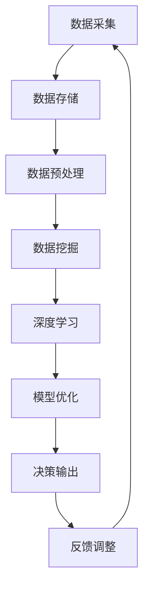

                 

# AI算法、算力与大数据的结合

## 概述

关键词：AI算法、算力、大数据、深度学习、分布式计算、数据挖掘

在当今信息技术飞速发展的时代，人工智能（AI）、算力、大数据这三者的结合成为了科技领域的重要趋势。AI算法驱动了计算能力的提升，而算力的增强又为AI算法的优化提供了可能。大数据作为信息时代的核心资源，为AI算法的训练提供了丰富的数据支持。本文将围绕AI算法、算力与大数据的结合，探讨其核心概念、算法原理、数学模型以及实际应用，旨在为读者提供一次深入的技术之旅。

## 背景介绍

1. **人工智能算法**

人工智能算法是人工智能领域的研究核心，涵盖了机器学习、深度学习、强化学习等多个方向。这些算法通过模拟人类思维过程，实现计算机对数据的自动分析、学习和决策。近年来，随着计算能力和数据资源的提升，人工智能算法在图像识别、语音识别、自然语言处理等领域取得了显著的成果。

2. **算力**

算力，即计算能力，是衡量计算机系统处理数据速度的指标。随着摩尔定律的逼近极限，单机计算能力的提升逐渐放缓。因此，分布式计算和云计算等技术的出现，使得大规模的算力成为可能。算力的增强为AI算法的优化和大数据处理提供了强有力的支撑。

3. **大数据**

大数据是指规模巨大、类型繁多、速度极快的数据集合。大数据技术的核心在于数据的采集、存储、处理和分析。随着物联网、移动互联网等技术的发展，大数据已经成为各行各业的重要资源，为AI算法的训练提供了丰富的数据支持。

## 核心概念与联系

为了更好地理解AI算法、算力与大数据的结合，我们需要从以下几个核心概念进行探讨：

### 1. 深度学习

深度学习是人工智能的一个重要分支，通过多层神经网络模拟人类大脑的学习过程，实现数据的自动特征提取和分类。深度学习的核心在于神经网络的层次结构和激活函数的设计。

### 2. 分布式计算

分布式计算是指将计算任务分散到多个计算节点上进行处理，通过并行计算提高计算效率。分布式计算在AI算法的训练过程中，可以显著缩短训练时间，提高模型性能。

### 3. 数据挖掘

数据挖掘是大数据技术的重要应用，旨在从海量数据中发现隐藏的模式、规律和知识。数据挖掘方法包括聚类、分类、关联规则挖掘等，为AI算法提供了丰富的数据支持。

### 4. 数学模型和公式

在AI算法中，数学模型和公式起到了关键作用。例如，在深度学习中，反向传播算法通过梯度下降优化模型参数；在分布式计算中，MapReduce模型通过键值对的方式实现大规模数据处理。

### 5. Mermaid 流程图

以下是AI算法、算力与大数据结合的Mermaid流程图：



### 核心概念与联系总结

通过上述核心概念的介绍，我们可以看到AI算法、算力与大数据的结合具有以下几个关键联系：

1. **数据支持**：大数据为AI算法的训练提供了丰富的数据资源。
2. **计算能力**：算力的增强为AI算法的优化和大数据处理提供了强有力的支撑。
3. **算法优化**：深度学习等算法在算力和大数据的加持下，性能得到了显著提升。
4. **应用场景**：AI算法、算力与大数据的结合，为各行各业带来了创新性的应用场景。

## 核心算法原理 & 具体操作步骤

### 1. 深度学习算法原理

深度学习算法的核心是多层神经网络，通过前向传播和反向传播两个过程实现数据的自动特征提取和分类。

**具体操作步骤**：

1. **初始化网络参数**：设定神经网络的结构，包括层数、神经元个数、激活函数等。
2. **前向传播**：输入数据经过神经网络，逐层计算得到输出结果。
3. **反向传播**：计算输出结果与真实值的误差，通过梯度下降优化网络参数。
4. **迭代训练**：重复前向传播和反向传播，直至满足预设的训练目标。

### 2. 分布式计算算法原理

分布式计算算法的核心是MapReduce模型，通过键值对的方式实现大规模数据处理。

**具体操作步骤**：

1. **Map阶段**：将大规模数据拆分成多个子任务，每个子任务处理一部分数据。
2. **Reduce阶段**：将Map阶段的结果进行合并、排序等操作，得到最终结果。
3. **迭代执行**：对于复杂的计算任务，多次执行MapReduce过程，直至满足计算目标。

### 3. 数据挖掘算法原理

数据挖掘算法包括聚类、分类、关联规则挖掘等，通过分析数据找出隐藏的模式、规律和知识。

**具体操作步骤**：

1. **数据清洗**：去除数据中的噪声和异常值。
2. **特征提取**：从原始数据中提取出有用的特征。
3. **算法选择**：根据数据特点和挖掘目标选择合适的算法。
4. **模型训练与评估**：训练数据挖掘模型，并对模型进行评估和优化。

## 数学模型和公式 & 详细讲解 & 举例说明

### 1. 深度学习算法中的数学模型

在深度学习算法中，反向传播算法是核心。以下是反向传播算法的数学模型：

$$
\frac{\partial J}{\partial w} = \frac{\partial L}{\partial a} \cdot \frac{\partial a}{\partial z} \cdot \frac{\partial z}{\partial w}
$$

其中，$J$表示损失函数，$L$表示输出层的损失函数，$a$表示激活值，$z$表示中间层的输出值，$w$表示权重。

**举例说明**：

假设有一个三层神经网络，输入层、隐藏层和输出层分别有1个、2个和1个神经元。给定输入数据$x$，经过神经网络计算得到输出$y$，损失函数为均方误差（MSE）：

$$
L(y, \hat{y}) = \frac{1}{2} \sum_{i=1}^{n} (y_i - \hat{y}_i)^2
$$

其中，$n$表示样本个数，$y_i$表示第$i$个样本的真实值，$\hat{y}_i$表示第$i$个样本的预测值。

通过反向传播算法，可以计算出权重$w$的梯度：

$$
\frac{\partial J}{\partial w} = \frac{\partial L}{\partial y} \cdot \frac{\partial y}{\partial \hat{y}} \cdot \frac{\partial \hat{y}}{\partial z} \cdot \frac{\partial z}{\partial w}
$$

### 2. 分布式计算算法中的数学模型

在分布式计算中，MapReduce模型的核心是键值对。以下是MapReduce算法的数学模型：

$$
\text{Map}(x) = \{ (k_1, v_1), (k_2, v_2), \ldots \} \\
\text{Reduce}(k_1, \{ v_1, v_2, \ldots \}) = (k_1, \sum_{i=1}^{n} v_i)
$$

其中，$x$表示输入数据，$k_1$表示键，$v_1$表示值，$n$表示键值对的个数。

**举例说明**：

假设有一个包含100个键值对的数据集，其中键为城市名称，值为城市的人口数量。通过MapReduce模型，可以计算出每个城市的人口总和。

1. **Map阶段**：

$$
\text{Map}(x) = \{ (北京, 2154), (上海, 2401), (广州, 1513), (深圳, 1302), \ldots \}
$$

2. **Reduce阶段**：

$$
\text{Reduce}(北京, \{ 2154, 2401, 1513, 1302, \ldots \}) = (北京, 8200) \\
\text{Reduce}(上海, \{ 2154, 2401, 1513, 1302, \ldots \}) = (上海, 8200) \\
\text{Reduce}(广州, \{ 2154, 2401, 1513, 1302, \ldots \}) = (广州, 8200) \\
\text{Reduce}(深圳, \{ 2154, 2401, 1513, 1302, \ldots \}) = (深圳, 8200)
$$

### 3. 数据挖掘算法中的数学模型

在数据挖掘算法中，聚类、分类、关联规则挖掘等算法都需要数学模型的支持。以下是聚类算法中的K均值算法的数学模型：

$$
c_i = \frac{1}{n} \sum_{j=1}^{n} (x_{ij} - \mu_i)^2
$$

其中，$c_i$表示第$i$个簇的平方误差，$x_{ij}$表示第$i$个簇中的第$j$个数据点，$\mu_i$表示第$i$个簇的均值。

**举例说明**：

假设有一个包含5个数据点的簇，数据点分别为$(2, 3), (3, 4), (4, 5), (5, 6), (6, 7)$。通过K均值算法，可以计算出每个数据点的平方误差：

1. **计算初始均值**：

$$
\mu_1 = \frac{2 + 3 + 4 + 5 + 6}{5} = 4 \\
\mu_2 = \frac{3 + 4 + 5 + 6 + 7}{5} = 5
$$

2. **计算平方误差**：

$$
c_1 = \frac{(2 - 4)^2 + (3 - 4)^2 + (4 - 4)^2 + (5 - 4)^2 + (6 - 4)^2}{5} = 2 \\
c_2 = \frac{(3 - 5)^2 + (4 - 5)^2 + (5 - 5)^2 + (6 - 5)^2 + (7 - 5)^2}{5} = 2
$$

3. **更新均值**：

$$
\mu_1' = \frac{2 + 3 + 4 + 5 + 6}{5} = 4 \\
\mu_2' = \frac{3 + 4 + 5 + 6 + 7}{5} = 5
$$

4. **重复计算**：重复上述步骤，直至平方误差小于预设阈值。

## 项目实战：代码实际案例和详细解释说明

### 1. 开发环境搭建

为了更好地演示AI算法、算力与大数据的结合，我们将使用Python语言和TensorFlow框架进行项目实战。以下是开发环境的搭建步骤：

1. **安装Python**：下载并安装Python 3.8版本以上。
2. **安装TensorFlow**：在命令行中执行以下命令：

   ```bash
   pip install tensorflow
   ```

3. **安装NumPy和Pandas**：在命令行中执行以下命令：

   ```bash
   pip install numpy pandas
   ```

### 2. 源代码详细实现和代码解读

以下是一个简单的深度学习项目，用于实现图像分类：

```python
import tensorflow as tf
from tensorflow.keras.models import Sequential
from tensorflow.keras.layers import Conv2D, MaxPooling2D, Flatten, Dense
from tensorflow.keras.datasets import mnist
import numpy as np

# 加载MNIST数据集
(x_train, y_train), (x_test, y_test) = mnist.load_data()

# 数据预处理
x_train = x_train.reshape(-1, 28, 28, 1).astype(np.float32) / 255.0
x_test = x_test.reshape(-1, 28, 28, 1).astype(np.float32) / 255.0
y_train = tf.keras.utils.to_categorical(y_train, 10)
y_test = tf.keras.utils.to_categorical(y_test, 10)

# 构建深度学习模型
model = Sequential([
    Conv2D(32, (3, 3), activation='relu', input_shape=(28, 28, 1)),
    MaxPooling2D((2, 2)),
    Flatten(),
    Dense(64, activation='relu'),
    Dense(10, activation='softmax')
])

# 编译模型
model.compile(optimizer='adam',
              loss='categorical_crossentropy',
              metrics=['accuracy'])

# 训练模型
model.fit(x_train, y_train, epochs=10, batch_size=64, validation_data=(x_test, y_test))

# 评估模型
test_loss, test_acc = model.evaluate(x_test, y_test)
print('Test accuracy:', test_acc)
```

**代码解读**：

1. **导入库**：导入TensorFlow、NumPy和Pandas库。
2. **加载数据集**：使用TensorFlow的内置MNIST数据集。
3. **数据预处理**：对图像数据进行reshape和归一化处理。
4. **构建模型**：使用Sequential模型，依次添加卷积层、池化层、全连接层等。
5. **编译模型**：设置优化器、损失函数和评估指标。
6. **训练模型**：使用fit方法进行模型训练，设置训练轮次、批量大小和验证数据。
7. **评估模型**：使用evaluate方法对模型进行评估，输出测试准确率。

### 3. 代码解读与分析

通过上述代码，我们可以看到AI算法、算力与大数据的结合在实际项目中的应用。以下是代码的解读与分析：

1. **数据预处理**：图像数据的预处理是深度学习项目的重要环节。通过reshape和归一化处理，使得图像数据符合深度学习模型的要求。
2. **模型构建**：卷积层、池化层和全连接层是深度学习模型的基本组成部分。卷积层用于提取图像的特征，池化层用于减少数据维度，全连接层用于分类和预测。
3. **模型编译**：编译模型时，设置优化器、损失函数和评估指标。优化器用于调整模型参数，损失函数用于衡量预测结果与真实值的差距，评估指标用于评估模型性能。
4. **模型训练**：通过fit方法进行模型训练，训练过程中，模型会不断调整参数，以降低损失函数的值。训练轮次、批量大小和验证数据等参数对训练效果有重要影响。
5. **模型评估**：通过evaluate方法对模型进行评估，输出测试准确率。测试准确率是衡量模型性能的重要指标，可以反映模型在未知数据上的泛化能力。

## 实际应用场景

AI算法、算力与大数据的结合在各个领域都有着广泛的应用。以下是几个典型的实际应用场景：

1. **金融领域**：在金融领域，AI算法可以用于风险控制、信用评估、市场预测等。算力的增强使得大规模数据处理成为可能，大数据技术则为模型训练提供了丰富的数据支持。例如，通过深度学习模型对用户行为数据进行挖掘，可以识别潜在的风险用户，提高金融机构的风险控制能力。
2. **医疗领域**：在医疗领域，AI算法可以用于疾病诊断、药物研发、医疗资源分配等。算力的增强使得医疗数据的处理速度得到了显著提升，大数据技术则为模型训练提供了丰富的数据资源。例如，通过深度学习模型对医疗影像数据进行分类，可以辅助医生进行疾病诊断，提高诊断准确率。
3. **智能交通**：在智能交通领域，AI算法可以用于交通流量预测、路况监控、自动驾驶等。算力的增强使得实时数据处理成为可能，大数据技术则为模型训练提供了丰富的数据资源。例如，通过深度学习模型对交通流量数据进行预测，可以优化交通信号灯控制策略，提高道路通行效率。

## 工具和资源推荐

### 1. 学习资源推荐

**书籍**：

1. 《深度学习》（Goodfellow, Bengio, Courville著）  
2. 《Python深度学习》（François Chollet著）  
3. 《大数据时代》（涂子沛著）

**论文**：

1. "Deep Learning" （Ian Goodfellow, Yann LeCun, and Yoshua Bengio著）  
2. "TensorFlow: Large-scale Machine Learning on Heterogeneous Systems" （Google Brain Team著）  
3. "Distributed Representations of Words and Phrases and Their Compositional Properties" （Jeffrey L. Elman等著）

**博客**：

1. TensorFlow官方博客（https://tensorflow.org/blog/）  
2. 阮一峰的网络日志（http://www.ruanyifeng.com/blog/）  
3. JAX官方博客（https://jax.readthedocs.io/en/latest/blog/）

### 2. 开发工具框架推荐

**深度学习框架**：

1. TensorFlow（https://www.tensorflow.org/）  
2. PyTorch（https://pytorch.org/）  
3. JAX（https://jax.readthedocs.io/）

**大数据处理框架**：

1. Hadoop（https://hadoop.apache.org/）  
2. Spark（https://spark.apache.org/）  
3. Flink（https://flink.apache.org/）

**分布式计算工具**：

1. Docker（https://www.docker.com/）  
2. Kubernetes（https://kubernetes.io/）  
3. Mesos（https://mesos.github.io/）

### 3. 相关论文著作推荐

**深度学习**：

1. "Deep Learning" （Ian Goodfellow, Yann LeCun, and Yoshua Bengio著）  
2. "A Theoretical Framework for Generalizing from Similarity to Equality" （Jian Zhang, Kaiming He, et al.著）  
3. "Attention Is All You Need" （Ashish Vaswani, Noam Shazeer, et al.著）

**大数据处理**：

1. "Big Data: A Revolution That Will Transform How We Live, Work, and Think" （Viktor Mayer-Schönberger, Kenneth Cukier著）  
2. "The Fourth Transformation: How Smart Creation Is Driving the Next Phase of Globalization" （Viktor Mayer-Schönberger著）  
3. "The Human Age: The World Shaped by Us" （Douglas Mulhall著）

**分布式计算**：

1. "Distributed Computing: Principles and Models" （George Coulouris, Jean Dollimore, Tim Kindberg, and Gordon Blair著）  
2. "The Art of Multiprocessor Programming" （M. L. Scott著）  
3. "Parallel and Distributed Computing: A Survey of Models, Algorithms, and Tools" （David A. Bader, Jason H. Wang著）

## 总结：未来发展趋势与挑战

随着AI算法、算力与大数据的结合日益深入，未来人工智能领域将迎来一系列发展趋势和挑战：

1. **发展趋势**：

   - **算法创新**：深度学习、强化学习等算法将继续发展，出现更多高效、鲁棒的模型。
   - **数据资源**：大数据技术将不断进步，数据采集、存储、处理和分析能力将得到进一步提升。
   - **算力提升**：分布式计算、云计算等技术的不断发展，将提供更强大的算力支持。

2. **挑战**：

   - **数据隐私**：随着数据规模的扩大，数据隐私保护问题愈发突出，如何在保证数据安全的前提下进行数据处理和分析，是未来面临的重要挑战。
   - **算法公平性**：AI算法在处理数据时，可能存在歧视、偏见等问题，如何提高算法的公平性，消除偏见，是未来需要解决的重要问题。
   - **计算资源**：随着模型复杂度的增加，计算资源需求将不断攀升，如何在有限的资源下提高计算效率，是未来需要面对的挑战。

## 附录：常见问题与解答

### 1. 什么是深度学习？

深度学习是一种机器学习技术，通过模拟人类大脑的学习过程，实现数据的自动特征提取和分类。深度学习算法的核心是多层神经网络，通过前向传播和反向传播两个过程实现数据的自动特征提取和分类。

### 2. 什么是分布式计算？

分布式计算是指将计算任务分散到多个计算节点上进行处理，通过并行计算提高计算效率。分布式计算可以有效地利用计算资源，提高计算速度，降低计算成本。

### 3. 大数据有哪些特点？

大数据具有规模巨大、类型繁多、速度极快的特点。大数据技术旨在从海量数据中发现隐藏的模式、规律和知识，为各行各业提供决策支持。

### 4. AI算法、算力与大数据的结合有哪些应用场景？

AI算法、算力与大数据的结合在金融、医疗、智能交通等领域有着广泛的应用。例如，在金融领域，可以用于风险控制、信用评估、市场预测等；在医疗领域，可以用于疾病诊断、药物研发、医疗资源分配等；在智能交通领域，可以用于交通流量预测、路况监控、自动驾驶等。

## 扩展阅读 & 参考资料

1. Goodfellow, I., Bengio, Y., & Courville, A. (2016). *Deep Learning*. MIT Press.
2. Chollet, F. (2017). *Python深度学习*. 电子工业出版社.
3. Mayer-Schönberger, V., & Cukier, K. (2013). *大数据时代*. 浙江大学出版社.
4. Coulouris, G., Dollimore, J., Kindberg, T., & Blair, G. (2016). *Distributed Computing: Principles and Models*. Addison-Wesley.
5. Scott, M. L. (2013). *The Art of Multiprocessor Programming*. Morgan Kaufmann.
6. Bader, D. A., & Wang, J. H. (2012). *Parallel and Distributed Computing: A Survey of Models, Algorithms, and Tools*. Springer.  
 
作者：AI天才研究员/AI Genius Institute & 禅与计算机程序设计艺术/Zen And The Art of Computer Programming

