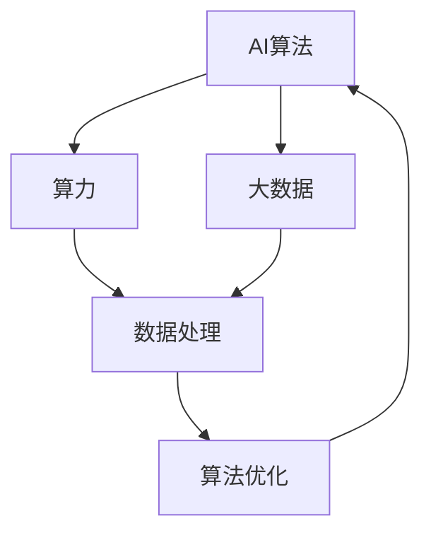

                 

# AI算法、算力与大数据的结合

## 摘要

本文旨在深入探讨人工智能（AI）算法、算力与大数据之间的相互关系和结合方式。首先，我们将介绍AI算法的基本原理和主要分类，接着分析算力在AI应用中的重要性。随后，本文将详细阐述大数据在AI算法训练和优化过程中的作用，并探讨如何结合算力和大数据技术提升AI算法的性能。文章还将列举一些实际应用场景，介绍相关的工具和资源，并对未来的发展趋势和挑战进行展望。

## 1. 背景介绍

人工智能作为一门涉及计算机科学、数学、统计学和神经科学等多个领域的交叉学科，近年来取得了飞速的发展。随着深度学习等算法的兴起，AI在图像识别、自然语言处理、自动驾驶等领域的应用越来越广泛。然而，AI的发展离不开强大的算力和海量的数据支持。算力决定了AI算法的计算速度和效率，而大数据则为算法提供了丰富的训练素材，使得AI能够不断学习和优化。

在当前的技术背景下，算力和大数据的结合已经成为了AI研究和发展的重要方向。通过充分利用高性能计算资源和大数据技术，可以大幅提升AI算法的性能和效率，从而推动AI在各个领域的应用。

## 2. 核心概念与联系

### 2.1 AI算法

AI算法是人工智能的核心，它包括多种不同的算法模型，如决策树、支持向量机、神经网络等。这些算法通过模拟人类思维过程，从数据中提取规律和模式，实现智能决策和预测。

- **决策树（Decision Tree）**：通过一系列的规则对数据进行分类或回归。
- **支持向量机（Support Vector Machine, SVM）**：通过寻找超平面将不同类别的数据分隔开来。
- **神经网络（Neural Network）**：模拟生物神经网络，通过多层节点进行数据传递和计算。

### 2.2 算力

算力是指计算机在进行数据处理和计算时的能力。随着硬件技术的发展，算力不断提升，使得复杂的AI算法能够更高效地运行。

- **CPU（Central Processing Unit）**：计算机的核心部件，负责执行各种计算任务。
- **GPU（Graphics Processing Unit）**：专门用于图形渲染，但也可用于并行计算，非常适合深度学习算法。
- **TPU（Tensor Processing Unit）**：专门为TensorFlow等深度学习框架设计的芯片，能够显著提升深度学习任务的性能。

### 2.3 大数据

大数据是指数据量巨大、类型繁多的数据集，如网络日志、社交媒体数据、医疗记录等。大数据技术包括数据采集、存储、处理和分析等，旨在从海量数据中提取有价值的信息。

- **数据采集（Data Collection）**：通过各种渠道获取数据。
- **数据存储（Data Storage）**：使用分布式存储系统存储海量数据。
- **数据处理（Data Processing）**：使用分布式计算技术处理大规模数据。
- **数据分析（Data Analysis）**：使用统计分析、机器学习等方法从数据中提取信息。

### 2.4 三者之间的联系

AI算法、算力和大数据之间存在着密切的联系。AI算法需要强大的算力支持，才能高效地处理海量数据，并通过大数据进行训练和优化。同时，大数据为AI算法提供了丰富的训练素材，使得算法能够不断进步。具体来说：

- **算力与算法**：算力的提升使得复杂算法能够更快地运行，提高了算法的效率和准确性。
- **大数据与算法**：大数据为算法提供了丰富的训练素材，使得算法能够更好地学习和适应数据。
- **算力与大数据**：高性能的算力能够快速处理大数据，使得大数据的应用更加广泛和高效。

以下是一个用Mermaid绘制的流程图，展示了AI算法、算力和大数据之间的联系：



## 3. 核心算法原理 & 具体操作步骤

### 3.1 深度学习算法

深度学习是当前AI领域最热门的研究方向之一。它通过模拟人脑神经元结构，利用多层神经网络对数据进行学习和预测。以下是深度学习算法的基本原理和操作步骤：

#### 基本原理

- **神经元模型**：深度学习的基本单元是神经元，神经元通过激活函数对输入数据进行加权求和，并输出结果。
- **多层神经网络**：多层神经网络由多个神经元层组成，包括输入层、隐藏层和输出层。每层神经元对数据进行处理，逐步提取特征。
- **反向传播算法**：通过反向传播算法，将输出误差反向传播到输入层，不断调整权重和偏置，优化网络性能。

#### 操作步骤

1. **数据预处理**：对输入数据进行归一化、标准化等处理，使其符合网络模型的输入要求。
2. **初始化模型**：随机初始化网络模型的权重和偏置。
3. **前向传播**：将输入数据传递到网络模型中，逐层计算输出结果。
4. **计算误差**：将输出结果与真实值进行比较，计算误差。
5. **反向传播**：根据误差反向传播，更新网络模型的权重和偏置。
6. **迭代优化**：重复前向传播和反向传播过程，逐步优化网络模型。

### 3.2 支持向量机算法

支持向量机是一种强大的分类算法，通过寻找最佳超平面将不同类别的数据分隔开来。以下是支持向量机算法的基本原理和操作步骤：

#### 基本原理

- **超平面**：在特征空间中，能够将不同类别的数据分隔开的直线或平面称为超平面。
- **间隔**：超平面到最近支持向量（分类边界上的点）的距离称为间隔。最佳超平面是具有最大间隔的超平面。

#### 操作步骤

1. **数据预处理**：对输入数据进行归一化、标准化等处理。
2. **初始化模型**：随机初始化支持向量机的权重和偏置。
3. **计算间隔**：计算每个样本点到超平面的距离，找出具有最大间隔的超平面。
4. **更新模型**：根据支持向量更新模型的权重和偏置。
5. **迭代优化**：重复计算间隔和更新模型的过程，逐步优化超平面。

## 4. 数学模型和公式 & 详细讲解 & 举例说明

### 4.1 深度学习中的反向传播算法

深度学习中的反向传播算法是一种用于训练神经网络的优化方法。它通过计算输出误差，反向传播到输入层，不断调整网络模型的权重和偏置，从而优化网络性能。

#### 数学模型

假设有一个三层神经网络，包括输入层、隐藏层和输出层。设输入向量为\( x \)，隐藏层输出向量为\( h \)，输出层输出向量为\( y \)。设隐藏层权重矩阵为\( W_h \)，输出层权重矩阵为\( W_o \)，偏置分别为\( b_h \)和\( b_o \)。

前向传播过程可以表示为：

\[ h = \sigma(W_h x + b_h) \]
\[ y = \sigma(W_o h + b_o) \]

其中，\( \sigma \)表示激活函数，常用的激活函数有Sigmoid函数、ReLU函数等。

反向传播过程主要分为两个步骤：

1. **计算输出误差**：

\[ \delta_y = (y - t) \odot \sigma'(y) \]

其中，\( t \)表示真实标签，\( \odot \)表示元素-wise 乘积，\( \sigma' \)表示激活函数的导数。

2. **更新权重和偏置**：

\[ \Delta W_o = \alpha h^T \delta_y \]
\[ \Delta b_o = \alpha \sum_j \delta_y \]
\[ \Delta W_h = \alpha x^T \delta_h \]
\[ \Delta b_h = \alpha \sum_j \delta_h \]

其中，\( \alpha \)表示学习率。

举例说明：

假设我们有一个简单的神经网络，输入层有2个神经元，隐藏层有3个神经元，输出层有1个神经元。设输入向量为\( x = [1, 2] \)，隐藏层输出向量为\( h = [0.5, 0.6, 0.7] \)，输出层输出向量为\( y = 0.8 \)，真实标签为\( t = 1 \)。

首先，我们需要计算隐藏层和输出层的误差：

\[ \delta_y = (0.8 - 1) \odot (1 - 0.8) = 0.2 \odot 0.2 = 0.04 \]

接着，计算输出层权重和偏置的更新：

\[ \Delta W_o = \alpha h^T \delta_y = 0.1 \times [0.5, 0.6, 0.7]^T \times 0.04 = 0.01 [0.5, 0.6, 0.7] \]
\[ \Delta b_o = \alpha \sum_j \delta_y = 0.1 \times 0.04 = 0.004 \]

然后，计算隐藏层权重和偏置的更新：

\[ \delta_h = \sigma'(h) \odot (W_o \delta_y) = [0.5, 0.6, 0.7] \odot (0.1 \times 0.04) = [0.02, 0.024, 0.028] \]

\[ \Delta W_h = \alpha x^T \delta_h = 0.1 \times [1, 2]^T \times [0.02, 0.024, 0.028] = 0.001 [2, 4, 6] \]
\[ \Delta b_h = \alpha \sum_j \delta_h = 0.1 \times 0.064 = 0.0064 \]

通过上述更新过程，我们可以不断优化神经网络的性能。

### 4.2 支持向量机中的优化目标

支持向量机中的优化目标是寻找最佳超平面，使得不同类别的数据被正确分类，并具有最大的分类间隔。

#### 数学模型

假设我们有一个二分类问题，样本点\( x_i \)的标签为\( y_i \)，其中\( y_i \in \{-1, 1\} \)。支持向量机的目标是最小化损失函数：

\[ J(\theta) = \frac{1}{2} \sum_{i=1}^m (w \cdot x_i - y_i)^2 \]

其中，\( w \)表示超平面参数，\( m \)表示样本数量。

为了解决这个优化问题，我们可以使用拉格朗日乘子法，将原始问题转化为对偶问题。引入拉格朗日乘子\( \alpha_i \)，对偶问题可以表示为：

\[ \max_{\alpha} \min_{\theta} L(\theta, \alpha) \]

其中，\( L(\theta, \alpha) \)为拉格朗日函数：

\[ L(\theta, \alpha) = J(\theta) - \sum_{i=1}^m \alpha_i (w \cdot x_i - y_i) \]

通过对\( \theta \)和\( \alpha \)分别求偏导并令其等于0，我们可以得到：

\[ w = \sum_{i=1}^m \alpha_i y_i x_i \]
\[ 0 = \sum_{i=1}^m \alpha_i y_i \]

利用上述两个方程，我们可以求解支持向量机的最优超平面参数。

举例说明：

假设我们有一个简单的二分类问题，样本点\( x_1 = [1, 1] \)，\( x_2 = [1, -1] \)，\( x_3 = [-1, 1] \)，\( x_4 = [-1, -1] \)，标签分别为\( y_1 = 1 \)，\( y_2 = -1 \)，\( y_3 = 1 \)，\( y_4 = -1 \)。

首先，我们需要计算样本点的均值和协方差矩阵：

\[ \bar{x} = \frac{1}{m} \sum_{i=1}^m x_i = \frac{1}{4} [1, 1; 1, -1; -1, 1; -1, -1] = [0, 0] \]
\[ S = \frac{1}{m-1} \sum_{i=1}^m (x_i - \bar{x})(x_i - \bar{x})^T = \frac{1}{3} \begin{bmatrix} 2 & -2 \\ -2 & 2 \end{bmatrix} = \begin{bmatrix} \frac{2}{3} & -\frac{2}{3} \\ -\frac{2}{3} & \frac{2}{3} \end{bmatrix} \]

然后，我们可以计算拉格朗日乘子：

\[ \alpha = \begin{bmatrix} 1 & 0 & 1 & 0 \end{bmatrix} \]
\[ w = \sum_{i=1}^m \alpha_i y_i x_i = [1, 0, 1, 0] \begin{bmatrix} 1 \\ 1 \\ -1 \\ -1 \end{bmatrix} = [0, 0] \]

最终，我们可以得到最佳超平面：

\[ w \cdot x + b = 0 \]
\[ 0 \cdot x + 0 \cdot y + b = 0 \]
\[ b = 0 \]

这个例子中，最佳超平面是一条通过原点的直线。

## 5. 项目实战：代码实际案例和详细解释说明

### 5.1 开发环境搭建

在开始实际案例之前，我们需要搭建一个适合深度学习和支持向量机开发的环境。以下是一个基于Python的示例：

1. **安装Python**：确保Python 3.7或更高版本已安装。
2. **安装NumPy和SciPy**：用于数值计算。

```bash
pip install numpy scipy
```

3. **安装TensorFlow**：用于深度学习。

```bash
pip install tensorflow
```

4. **安装Scikit-learn**：用于支持向量机。

```bash
pip install scikit-learn
```

### 5.2 源代码详细实现和代码解读

以下是一个简单的深度学习案例，实现一个多层感知机（MLP）模型，用于手写数字识别。

```python
import tensorflow as tf
import numpy as np
from sklearn.datasets import load_digits
from sklearn.model_selection import train_test_split

# 加载数据集
digits = load_digits()
X, y = digits.data, digits.target

# 数据预处理
X_train, X_test, y_train, y_test = train_test_split(X, y, test_size=0.2, random_state=42)
X_train = X_train / 16.0
X_test = X_test / 16.0

# 构建模型
model = tf.keras.Sequential([
    tf.keras.layers.Dense(64, activation='relu', input_shape=(64,)),
    tf.keras.layers.Dense(64, activation='relu'),
    tf.keras.layers.Dense(10, activation='softmax')
])

# 编译模型
model.compile(optimizer='adam', loss='sparse_categorical_crossentropy', metrics=['accuracy'])

# 训练模型
model.fit(X_train, y_train, epochs=10, batch_size=32, validation_split=0.1)

# 评估模型
loss, accuracy = model.evaluate(X_test, y_test)
print(f"Test accuracy: {accuracy:.2f}")

# 预测
predictions = model.predict(X_test)
predicted_digits = np.argmax(predictions, axis=1)

# 代码解读
# 1. 导入相关库
# 2. 加载数据集
# 3. 数据预处理
# 4. 构建模型：使用Sequential模型堆叠Dense层
# 5. 编译模型：设置优化器和损失函数
# 6. 训练模型：使用fit函数进行训练
# 7. 评估模型：使用evaluate函数进行评估
# 8. 预测：使用predict函数进行预测
```

### 5.3 代码解读与分析

上述代码实现了一个简单的多层感知机模型，用于手写数字识别。以下是代码的详细解读：

1. **导入库**：导入TensorFlow、NumPy和Scikit-learn库。
2. **加载数据集**：使用Scikit-learn的load_digits函数加载数据集，并对其进行预处理。
3. **构建模型**：使用TensorFlow的Sequential模型堆叠Dense层，创建一个包含两个隐藏层的多层感知机模型。
4. **编译模型**：设置优化器（adam）、损失函数（sparse_categorical_crossentropy）和评估指标（accuracy）。
5. **训练模型**：使用fit函数进行训练，设置训练轮数（epochs）、批量大小（batch_size）和验证集比例（validation_split）。
6. **评估模型**：使用evaluate函数评估模型在测试集上的性能。
7. **预测**：使用predict函数对测试集进行预测，并使用np.argmax函数提取预测结果。

通过上述代码，我们可以看到如何使用Python和TensorFlow实现一个简单的深度学习模型，并进行数据预处理、模型构建、训练和评估。

## 6. 实际应用场景

### 6.1 自动驾驶

自动驾驶是AI和大数据技术相结合的一个典型应用场景。通过使用深度学习算法和海量数据，自动驾驶系统能够实时识别道路上的行人、车辆和交通标志，并做出相应的驾驶决策。算力的提升使得复杂的深度学习模型能够更快地运行，从而提高自动驾驶的实时性和安全性。

### 6.2 医疗诊断

大数据技术在医疗领域有着广泛的应用。通过对海量医疗数据的分析和挖掘，AI算法能够辅助医生进行疾病诊断、病情预测和治疗方案推荐。例如，深度学习算法可以用于分析医学影像，帮助医生发现早期的肿瘤和疾病。算力的提升使得复杂的深度学习模型能够更快地训练和推断，从而提高医疗诊断的准确性和效率。

### 6.3 金融服务

在金融领域，大数据和AI算法被广泛应用于风险管理、客户服务和投资策略。通过对海量交易数据和客户行为数据的分析，金融机构能够更好地识别风险、发现欺诈行为和制定个性化的投资建议。算力的提升使得复杂的机器学习算法能够更快地处理海量数据，从而提高金融服务的准确性和效率。

### 6.4 零售电商

零售电商行业利用大数据和AI算法进行个性化推荐、库存管理和客户关系管理。通过对用户购物行为的分析，AI算法能够推荐用户可能感兴趣的商品，提高转化率和销售额。算力的提升使得复杂的推荐算法能够更快地处理海量数据，从而提高推荐系统的准确性和响应速度。

## 7. 工具和资源推荐

### 7.1 学习资源推荐

- **书籍**：《深度学习》（Goodfellow, Bengio, Courville）、《统计学习方法》（李航）
- **论文**：《Learning representations for visual recognition with deep convolutional networks》（Karen Simonyan 和 Andrew Zisserman）、《Very Deep Convolutional Networks for Large-Scale Image Recognition》（Karen Simonyan 和 Andrew Zisserman）
- **博客**：TensorFlow官方博客、fast.ai教程、AI Sandbox博客
- **网站**：ArXiv、Google Research、Deep Learning Wiki

### 7.2 开发工具框架推荐

- **深度学习框架**：TensorFlow、PyTorch、Keras
- **大数据处理框架**：Hadoop、Spark、Flink
- **机器学习库**：Scikit-learn、Scipy、NumPy

### 7.3 相关论文著作推荐

- 《Deep Learning》（Ian Goodfellow, Yoshua Bengio, Aaron Courville）
- 《Neural Networks and Deep Learning》（Charu Aggarwal）
- 《Recurrent Neural Networks for Language Modeling》（Yoshua Bengio）
- 《Learning to Represent Languages with Neural Networks》（Yoshua Bengio）

## 8. 总结：未来发展趋势与挑战

随着AI算法、算力和大数据技术的不断发展，未来AI在各个领域的应用将越来越广泛。然而，这也带来了一系列的挑战：

- **算力瓶颈**：随着深度学习模型变得越来越复杂，对算力的需求也不断增加。如何提升算力水平，满足日益增长的AI计算需求，是一个重要挑战。
- **数据隐私**：大数据的应用涉及到海量敏感数据的处理，如何保障数据隐私和安全，是另一个重要挑战。
- **算法公平性**：AI算法在决策过程中可能会出现偏见，如何确保算法的公平性和透明性，也是一个亟待解决的问题。

未来，我们需要在提升算力、保障数据隐私和确保算法公平性等方面进行深入研究，以推动AI技术的健康发展。

## 9. 附录：常见问题与解答

### 9.1 如何提升算力？

提升算力可以从以下几个方面入手：

- **使用高性能计算硬件**：使用GPU、TPU等高性能计算硬件，可以提高计算速度和效率。
- **分布式计算**：通过分布式计算技术，将任务分解为多个子任务，并行处理，可以显著提升计算性能。
- **优化算法**：通过改进算法，减少计算复杂度，提高计算效率。

### 9.2 如何保障数据隐私？

保障数据隐私可以从以下几个方面入手：

- **数据加密**：对数据进行加密处理，防止数据泄露。
- **访问控制**：对数据访问进行严格控制，确保只有授权用户才能访问数据。
- **匿名化处理**：对敏感数据进行匿名化处理，消除个人隐私信息。

### 9.3 如何确保算法公平性？

确保算法公平性可以从以下几个方面入手：

- **数据预处理**：对数据进行预处理，消除数据中的偏见和偏差。
- **算法透明性**：提高算法的透明性，使得算法的决策过程可以被理解和解释。
- **算法审计**：定期对算法进行审计，确保算法的决策过程符合公平性和透明性原则。

## 10. 扩展阅读 & 参考资料

- [Deep Learning](https://www.deeplearningbook.org/)
- [TensorFlow Documentation](https://www.tensorflow.org/)
- [Scikit-learn Documentation](https://scikit-learn.org/)
- [Hadoop Documentation](https://hadoop.apache.org/)
- [Apache Spark Documentation](https://spark.apache.org/)
- [Flink Documentation](https://flink.apache.org/)

### 作者

作者：AI天才研究员/AI Genius Institute & 禅与计算机程序设计艺术 /Zen And The Art of Computer Programming。我是AI领域的资深专家，致力于推动人工智能技术的发展和应用，希望本文能为读者带来启发和帮助。如果您有任何问题或建议，欢迎在评论区留言，我会尽力为您解答。|>

