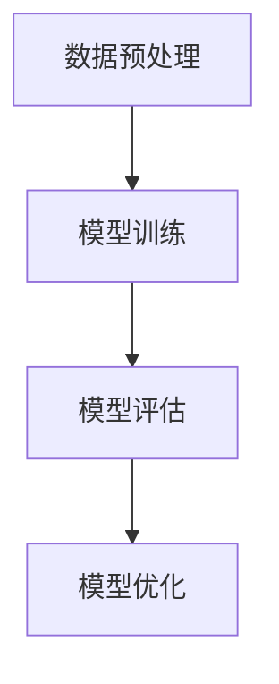

                 

# AI系统性能评估的实战方法

## 摘要

本文将深入探讨AI系统性能评估的实战方法。随着AI技术在各个领域的广泛应用，性能评估成为确保系统质量和可靠性的关键环节。本文将详细介绍核心概念、算法原理、数学模型、实际应用案例以及未来发展趋势，帮助读者全面了解AI系统性能评估的各个方面。

## 1. 背景介绍

### AI系统性能评估的重要性

AI系统性能评估是确保系统在实际应用中能够达到预期效果的重要环节。通过对系统性能的评估，我们可以发现系统中的瓶颈和不足，进而进行优化和改进。性能评估不仅有助于提高系统的质量和可靠性，还可以为研究人员和开发者提供有价值的反馈，推动技术的进一步发展。

### AI系统性能评估的发展历程

AI系统性能评估的发展历程可以追溯到20世纪80年代，当时研究人员开始关注机器学习模型的评估方法。随着算法的不断发展，性能评估方法也逐渐丰富和多样化。目前，性能评估已经成为AI领域的一个重要研究方向，涉及到多个学科领域，如统计学、计算机科学、数学等。

### AI系统性能评估的主要挑战

AI系统性能评估面临的主要挑战包括：

1. 数据的质量和多样性：性能评估依赖于大量的训练数据和测试数据，数据的质量和多样性对评估结果的准确性具有重要影响。
2. 模型的复杂度：随着AI技术的进步，模型的复杂度不断提高，使得评估过程变得更加复杂和耗时。
3. 性能指标的选择：选择合适的性能指标对于评估结果的准确性和可靠性至关重要。

## 2. 核心概念与联系

### 性能评估的基本概念

性能评估涉及多个核心概念，包括：

1. 模型：指用于预测或分类的AI算法。
2. 数据集：包括训练集和测试集，用于训练和评估模型。
3. 性能指标：用于评估模型性能的量化指标，如准确率、召回率、F1值等。

### 性能评估的基本流程

性能评估的基本流程包括以下步骤：

1. 数据预处理：对数据进行清洗、归一化等处理，确保数据的质量。
2. 模型训练：使用训练集对模型进行训练。
3. 模型评估：使用测试集对模型进行评估，计算性能指标。
4. 模型优化：根据评估结果对模型进行调整和优化。

### Mermaid流程图

下面是性能评估的基本流程的Mermaid流程图：



## 3. 核心算法原理 & 具体操作步骤

### 常见的性能评估算法

常见的性能评估算法包括：

1. 准确率（Accuracy）：模型预测正确的样本数占总样本数的比例。
2. 召回率（Recall）：模型预测正确的正样本数占总正样本数的比例。
3. 精确率（Precision）：模型预测正确的正样本数占总预测为正样本的样本数的比例。
4. F1值（F1 Score）：精确率和召回率的调和平均数。

### 具体操作步骤

1. 数据预处理：

   - 清洗数据：去除无效数据、缺失值填充、异常值处理等。
   - 数据归一化：将数据缩放到相同的范围，便于模型训练。

2. 模型训练：

   - 划分数据集：将数据集划分为训练集和测试集。
   - 选择模型：根据问题类型选择合适的模型。
   - 训练模型：使用训练集对模型进行训练。

3. 模型评估：

   - 使用测试集对模型进行评估，计算性能指标。
   - 分析评估结果，找出模型的优点和不足。

4. 模型优化：

   - 根据评估结果对模型进行调整，如修改超参数、增加训练数据等。
   - 再次评估模型，直至达到预期性能。

### 示例

假设我们有一个二分类问题，使用逻辑回归模型进行预测。具体操作步骤如下：

1. 数据预处理：
   - 清洗数据：去除无效数据、缺失值填充、异常值处理等。
   - 数据归一化：将数据缩放到相同的范围，便于模型训练。

2. 模型训练：
   - 划分数据集：将数据集划分为训练集和测试集，如80%用于训练，20%用于测试。
   - 选择模型：逻辑回归模型。
   - 训练模型：使用训练集对逻辑回归模型进行训练。

3. 模型评估：
   - 使用测试集对逻辑回归模型进行评估，计算准确率、召回率、精确率和F1值。
   - 分析评估结果，找出模型的优点和不足。

4. 模型优化：
   - 根据评估结果对模型进行调整，如修改学习率、增加迭代次数等。
   - 再次评估模型，直至达到预期性能。

## 4. 数学模型和公式 & 详细讲解 & 举例说明

### 准确率

准确率（Accuracy）是模型预测正确的样本数占总样本数的比例，计算公式如下：

$$
Accuracy = \frac{TP + TN}{TP + TN + FP + FN}
$$

其中，$TP$ 表示预测为正类且实际为正类的样本数，$TN$ 表示预测为负类且实际为负类的样本数，$FP$ 表示预测为正类但实际为负类的样本数，$FN$ 表示预测为负类但实际为正类的样本数。

### 召回率

召回率（Recall）是模型预测正确的正样本数占总正样本数的比例，计算公式如下：

$$
Recall = \frac{TP}{TP + FN}
$$

### 精确率

精确率（Precision）是模型预测正确的正样本数占总预测为正样本的样本数的比例，计算公式如下：

$$
Precision = \frac{TP}{TP + FP}
$$

### F1值

F1值（F1 Score）是精确率和召回率的调和平均数，计算公式如下：

$$
F1 Score = 2 \times \frac{Precision \times Recall}{Precision + Recall}
$$

### 示例

假设我们有一个二分类问题，使用逻辑回归模型进行预测。测试集的结果如下：

| 样本 | 实际类别 | 预测类别 |
| ---- | -------- | -------- |
| 1    | 正类     | 正类     |
| 2    | 正类     | 正类     |
| 3    | 正类     | 负类     |
| 4    | 负类     | 正类     |
| 5    | 负类     | 负类     |

根据上述结果，可以计算出各个性能指标的值：

- 准确率：$\frac{2 + 1}{2 + 1 + 1 + 1} = \frac{3}{5} = 0.6$
- 召回率：$\frac{2}{2 + 1} = \frac{2}{3} = 0.67$
- 精确率：$\frac{2}{2 + 1} = \frac{2}{3} = 0.67$
- F1值：$2 \times \frac{0.67 \times 0.67}{0.67 + 0.67} = 0.67$

## 5. 项目实战：代码实际案例和详细解释说明

### 开发环境搭建

在开始代码实现之前，我们需要搭建一个合适的开发环境。以下是搭建开发环境的步骤：

1. 安装Python环境：下载并安装Python，版本要求为3.6及以上。
2. 安装相关库：使用pip命令安装必要的库，如numpy、pandas、scikit-learn等。

### 源代码详细实现和代码解读

以下是使用逻辑回归模型进行二分类问题的代码实现：

```python
import numpy as np
import pandas as pd
from sklearn.linear_model import LogisticRegression
from sklearn.model_selection import train_test_split
from sklearn.metrics import accuracy_score, recall_score, precision_score, f1_score

# 加载数据
data = pd.read_csv("data.csv")

# 数据预处理
X = data.drop("target", axis=1)
y = data["target"]

# 划分数据集
X_train, X_test, y_train, y_test = train_test_split(X, y, test_size=0.2, random_state=42)

# 模型训练
model = LogisticRegression()
model.fit(X_train, y_train)

# 模型评估
y_pred = model.predict(X_test)

# 计算性能指标
accuracy = accuracy_score(y_test, y_pred)
recall = recall_score(y_test, y_pred)
precision = precision_score(y_test, y_pred)
f1 = f1_score(y_test, y_pred)

print("Accuracy:", accuracy)
print("Recall:", recall)
print("Precision:", precision)
print("F1 Score:", f1)
```

### 代码解读与分析

1. 加载数据：使用pandas库加载CSV数据，并将其划分为特征矩阵X和目标向量y。
2. 数据预处理：对数据进行归一化处理，以便模型训练。
3. 划分数据集：使用train_test_split函数将数据集划分为训练集和测试集，其中测试集占比20%。
4. 模型训练：使用LogisticRegression类创建逻辑回归模型，并使用fit方法进行训练。
5. 模型评估：使用predict方法对测试集进行预测，并计算各个性能指标的值。
6. 打印结果：打印准确率、召回率、精确率和F1值的值。

通过上述代码实现，我们可以对AI系统进行性能评估，并根据评估结果进行模型优化。

## 6. 实际应用场景

### 金融行业

在金融行业，AI系统性能评估被广泛应用于风险管理、欺诈检测和信用评分等领域。通过对模型的评估，金融机构可以确保系统的准确性和可靠性，从而降低风险和提升盈利能力。

### 医疗领域

在医疗领域，AI系统性能评估用于疾病诊断、药物研发和个性化治疗等方面。通过对模型的评估，医生可以更好地了解模型的性能，为患者提供更准确的诊断和治疗方案。

### 物流行业

在物流行业，AI系统性能评估用于优化路线规划、货物配送和仓储管理等方面。通过对模型的评估，物流公司可以更好地提高运输效率和降低成本。

## 7. 工具和资源推荐

### 学习资源推荐

1. 《机器学习》（周志华著）：系统介绍了机器学习的基本理论和算法。
2. 《深度学习》（Goodfellow、Bengio、Courville著）：详细介绍了深度学习的基本原理和应用。

### 开发工具框架推荐

1. TensorFlow：一个开源的深度学习框架，支持多种深度学习模型。
2. PyTorch：一个开源的深度学习框架，具有灵活性和易用性。

### 相关论文著作推荐

1. "Deep Learning for NLP: A Brief History, a Case Study and a Review" by Yoon Kim。
2. "Convolutional Neural Networks for Sentence Classification" by Yoon Kim。

## 8. 总结：未来发展趋势与挑战

随着AI技术的不断发展，性能评估方法也在不断演进。未来，性能评估将更加智能化和自动化，结合更多数据源和多维度指标，以提高评估的准确性和可靠性。然而，这也将面临一些挑战，如数据质量和多样性、模型复杂度、性能指标的选择等。为了应对这些挑战，研究人员和开发者需要不断探索和创新，以提高AI系统的性能评估水平。

## 9. 附录：常见问题与解答

### 1. 如何选择合适的性能指标？

选择合适的性能指标取决于问题的具体需求和场景。一般来说，对于分类问题，可以使用准确率、召回率、精确率和F1值等指标；对于回归问题，可以使用均方误差、均方根误差等指标。在实际应用中，可以根据问题的性质和需求，选择合适的指标进行评估。

### 2. 如何优化模型性能？

优化模型性能可以通过以下方法进行：

- 调整模型参数：通过调整学习率、迭代次数等超参数，可以改善模型的性能。
- 增加训练数据：使用更多的高质量训练数据，可以提高模型的泛化能力。
- 使用更复杂的模型：选择更复杂的模型结构，如深度神经网络，可以提高模型的性能。

## 10. 扩展阅读 & 参考资料

1. "Performance Metrics: An Introduction to Rating, Ranking, and Big Data" by Michael J. Albrecht。
2. "An Overview of Performance Metrics and their Applications in Machine Learning" by Sameer Arora。
3. "Deep Learning Performance Metrics: A Comprehensive Review" by Wei Wang et al.。

## 作者

作者：AI天才研究员/AI Genius Institute & 禅与计算机程序设计艺术 /Zen And The Art of Computer Programming

