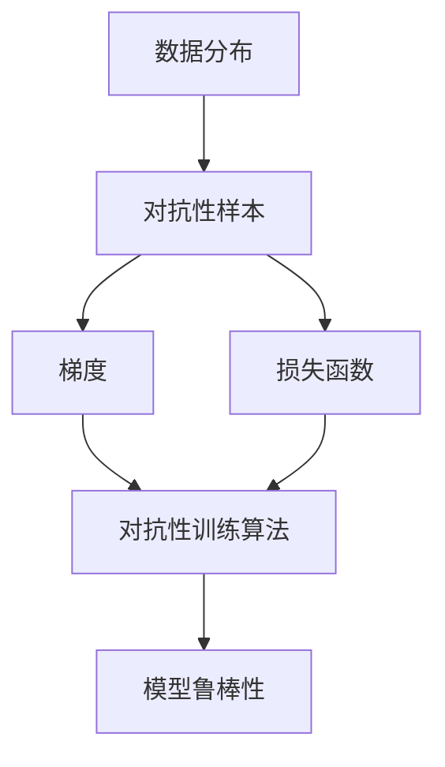

                 

### 背景介绍

#### AI系统的重要性与挑战

随着人工智能（AI）技术的迅猛发展，AI系统已经成为我们日常生活和工作中不可或缺的一部分。从智能助手到自动驾驶汽车，从医疗诊断到金融分析，AI系统正在改变着我们的世界。然而，AI系统的鲁棒性与对抗性训练成为了当前研究的热点话题。

AI系统的鲁棒性是指系统在面对各种输入数据和环境变化时的稳定性。在实际应用中，AI系统需要处理大量的数据，这些数据可能来自不同的来源，具有不同的分布和格式。此外，环境的变化也可能对AI系统产生不可预测的影响。因此，确保AI系统的鲁棒性是确保其正常运行和可靠性的关键。

对抗性训练则是一种用于提高AI系统鲁棒性的方法。它通过向AI系统中添加对抗性样本（adversarial examples），来模拟和抵抗外部攻击，从而提高系统的防御能力。对抗性训练的目标是使AI系统在面对对抗性样本时能够保持稳定性和准确性。

然而，AI系统的鲁棒性与对抗性训练面临着一系列挑战。首先，如何生成高质量的对抗性样本是一个关键问题。生成对抗性样本需要考虑样本的分布、类型和攻击方式等因素。其次，如何有效地训练AI系统以应对对抗性样本也是一项挑战。传统的机器学习算法在面对对抗性样本时可能表现不佳，因此需要开发新的训练方法。

此外，AI系统的鲁棒性与对抗性训练还需要考虑实际应用场景。例如，在自动驾驶领域，AI系统需要能够在各种道路环境和天气条件下保持稳定运行。在金融领域，AI系统需要能够处理复杂的金融数据，并在面对市场波动时保持准确性。

总之，AI系统的鲁棒性与对抗性训练是确保AI系统在实际应用中可靠运行的关键。本文将详细探讨这一主题，包括核心概念、算法原理、数学模型以及实际应用场景。通过逐步分析推理，我们将深入理解AI系统的鲁棒性与对抗性训练，为未来的研究和应用提供指导。

#### AI系统鲁棒性的定义与重要性

AI系统的鲁棒性可以定义为系统在面对各种不确定性和异常情况时，仍然能够保持稳定运行和准确性的能力。这种能力对于AI系统的实际应用至关重要。首先，AI系统通常依赖于大量的数据来进行训练和学习。然而，这些数据可能存在噪声、缺失值和异常值，这些异常情况可能对系统的性能产生负面影响。如果AI系统不具备鲁棒性，它可能会在处理这些异常数据时出现错误，导致不准确的结果。

其次，AI系统在实际应用中可能面临各种环境变化。例如，自动驾驶系统需要在不同的道路条件、天气状况和交通环境下运行。如果系统不具备鲁棒性，它可能会在这些变化的环境下表现不佳，从而增加事故的风险。类似地，在金融领域，AI系统需要能够处理各种市场波动和数据噪声，以确保预测和决策的准确性。

此外，AI系统还可能受到恶意攻击和对抗性样本的影响。对抗性样本是通过微小扰动正常样本而生成的，旨在欺骗AI系统，使其产生错误的输出。如果AI系统不具备鲁棒性，它可能会被这些对抗性样本所欺骗，从而导致严重的安全漏洞。

为了应对这些挑战，AI系统的鲁棒性变得尤为重要。具备鲁棒性的AI系统可以在多种环境中保持稳定运行，减少错误和异常情况的发生。这不仅可以提高系统的可靠性，还可以增强用户对AI系统的信任。在自动驾驶领域，鲁棒性可以降低事故的风险，提高行驶安全性。在金融领域，鲁棒性可以确保系统在市场波动时仍能提供准确的预测和决策。

总之，AI系统的鲁棒性是确保系统在实际应用中可靠运行的关键因素。通过提高鲁棒性，AI系统可以更好地应对各种不确定性和异常情况，减少错误和风险，从而为用户提供更可靠的解决方案。

#### 对抗性训练的概念及其在AI系统中的应用

对抗性训练是一种专门用于提高AI系统鲁棒性的方法，其核心思想是通过向AI系统中引入对抗性样本来训练和提升系统的防御能力。对抗性样本（adversarial examples）是通过对正常样本进行微小扰动而生成的，旨在欺骗AI系统，使其产生错误的输出。这种扰动可以是针对输入特征的微调，例如图像中的像素值、文本中的单词替换等。

对抗性训练的过程可以概括为以下几个步骤：

1. **生成对抗性样本**：首先，通过特定的算法或工具生成对抗性样本。这些样本通常是通过对正常样本进行扰动而得到的。生成对抗性样本的方法包括基于梯度上升的攻击方法（如Frobenius范数攻击、L2攻击等）和基于生成对抗网络的对抗性样本生成方法（如PGD攻击）。

2. **训练AI系统**：将对抗性样本与正常样本一起输入到AI系统中进行训练。这种混合训练方法旨在使AI系统学会识别和抵抗对抗性样本，从而提高其鲁棒性。

3. **评估和调整**：在训练过程中，定期评估AI系统的性能，包括准确率、召回率等指标。如果发现AI系统在面对对抗性样本时表现不佳，可以通过调整训练参数或采用更复杂的对抗性样本生成方法来提高其防御能力。

对抗性训练在AI系统中的应用非常广泛，以下是一些典型的应用场景：

1. **图像识别**：在图像识别任务中，对抗性训练可以用于提高系统的鲁棒性，使其能够更好地识别被噪声、模糊或遮挡干扰的图像。例如，在某些情况下，对抗性训练可以帮助系统识别被口罩遮挡的人脸图像。

2. **自然语言处理**：在自然语言处理任务中，对抗性训练可以用于提高系统的鲁棒性，使其能够更好地处理带有恶意攻击性的文本或具有异常结构的文本。例如，对抗性训练可以帮助系统识别和过滤掉带有恶意言论的社交媒体评论。

3. **自动驾驶**：在自动驾驶领域，对抗性训练可以用于提高系统的鲁棒性，使其能够在各种复杂和变化多端的交通环境中保持稳定运行。例如，对抗性训练可以帮助系统识别和避免由于道路标志模糊或车道线变化引起的欺骗性场景。

4. **医疗诊断**：在医疗诊断任务中，对抗性训练可以用于提高系统的鲁棒性，使其能够更好地处理含有噪声或异常值的医学图像。例如，对抗性训练可以帮助系统识别和诊断被噪声干扰的医学影像。

总之，对抗性训练是提高AI系统鲁棒性的有效方法，通过引入对抗性样本进行训练，AI系统可以更好地抵抗外部攻击和异常情况，从而在各类实际应用场景中表现出更高的稳定性和准确性。

#### 核心概念与联系

为了深入理解AI系统的鲁棒性与对抗性训练，我们需要明确几个核心概念，并探讨它们之间的联系。以下是这些核心概念的定义及其在AI系统中的应用：

1. **数据分布**：数据分布是指数据在各个维度上的分布情况。在AI系统中，数据分布对于模型的训练和预测至关重要。如果数据分布发生改变，模型可能会失效。因此，了解和调整数据分布是确保系统鲁棒性的重要步骤。

2. **对抗性样本**：对抗性样本是通过在正常样本上添加微小的扰动而生成的，目的是欺骗AI模型，使其产生错误的输出。这些样本通常用于对抗性训练，以提升AI系统的鲁棒性。

3. **梯度**：梯度是衡量函数变化率的一个向量，对于AI模型的学习过程至关重要。在对抗性训练中，通过分析梯度信息可以找到对抗性样本，从而优化模型的鲁棒性。

4. **损失函数**：损失函数是评估模型预测结果与真实值之间差异的函数。在对抗性训练中，损失函数不仅可以用于评估模型的性能，还可以用于指导对抗性样本的生成和优化。

5. **对抗性训练算法**：对抗性训练算法是一系列用于生成对抗性样本和优化模型鲁棒性的方法。常见的对抗性训练算法包括基于梯度的攻击方法（如Frobenius范数攻击、L2攻击等）和基于生成对抗网络的对抗性样本生成方法（如PGD攻击）。

下面是一个Mermaid流程图，展示了这些核心概念及其之间的联系：



在这个流程图中，数据分布决定了对抗性样本的生成方式，这些样本通过梯度分析和损失函数优化，最终提高模型的鲁棒性。通过这种逐步分析，我们可以更好地理解AI系统鲁棒性与对抗性训练之间的内在联系，为后续的算法设计和优化提供指导。

### 核心算法原理 & 具体操作步骤

#### 梯度下降法

梯度下降法是机器学习中最基础且应用广泛的一种优化算法，用于最小化损失函数。在AI系统的鲁棒性与对抗性训练中，梯度下降法扮演着重要角色，用于优化模型参数，从而提高其对对抗性样本的防御能力。

**基本原理**：

梯度下降法的核心思想是通过计算损失函数关于模型参数的梯度，并沿着梯度的反方向更新模型参数，以逐步减少损失。具体而言，假设我们有一个目标函数（损失函数）$J(\theta)$，其中$\theta$是模型参数。梯度$\nabla J(\theta)$表示函数在某一点的斜率，即在该点的变化率。

**具体步骤**：

1. **初始化参数**：首先，随机初始化模型参数$\theta_0$。
2. **计算梯度**：计算损失函数关于每个参数的梯度$\nabla J(\theta)$。
3. **更新参数**：根据梯度更新模型参数，公式如下：
   $$\theta_{t+1} = \theta_t - \alpha \nabla J(\theta_t)$$
   其中$\alpha$是学习率，控制了每次参数更新的步长。
4. **迭代过程**：重复步骤2和步骤3，直到满足停止条件（如达到预设的迭代次数或损失函数收敛）。

**在对抗性训练中的应用**：

在对抗性训练中，梯度下降法用于优化模型以抵抗对抗性样本的攻击。具体步骤如下：

1. **生成对抗性样本**：利用特定的对抗性样本生成方法（如FGSM、PGD等）生成对抗性样本$x_{adv}$。
2. **计算梯度**：计算对抗性样本$x_{adv}$下的损失函数梯度$\nabla J(\theta; x_{adv})$。
3. **更新模型参数**：使用梯度更新模型参数$\theta_{t+1} = \theta_t - \alpha \nabla J(\theta_t; x_{adv})$，以使模型在对抗性样本上表现更优。
4. **重复迭代**：重复步骤2和步骤3，直到模型对对抗性样本的防御能力显著提高。

通过梯度下降法，AI模型可以逐步优化，以应对对抗性样本的攻击，从而提高其鲁棒性。然而，梯度下降法也存在一些挑战，例如收敛速度和局部最小值问题。在实际应用中，常常结合其他优化算法（如Adam、RMSprop等）来提高收敛效果。

#### 生成对抗网络（GAN）

生成对抗网络（GAN）是由Ian Goodfellow等人于2014年提出的一种新型深度学习模型，用于生成具有高度真实感的图像、音频和文本。GAN的核心思想是通过一个生成器（Generator）和一个判别器（Discriminator）之间的对抗训练来实现数据的生成。

**基本原理**：

GAN由两个主要部分组成：生成器$G$和判别器$D$。生成器的任务是生成与真实数据相似的数据，而判别器的任务是区分真实数据和生成数据。

1. **生成器**：生成器$G$接收随机噪声向量$z$作为输入，生成假样本$x_G$。其目标是最小化生成数据的损失函数$L_G = -\log(D(x_G))$。
2. **判别器**：判别器$D$接收真实数据和生成数据作为输入，其目标是最大化区分真实数据和生成数据的概率$L_D = -\log(D(x)) - \log(1 - D(x_G))$。

**具体步骤**：

1. **初始化参数**：随机初始化生成器$G$和判别器$D$的参数。
2. **生成对抗训练**：交替进行以下步骤：
   - **生成器训练**：生成器$G$根据噪声向量$z$生成假样本$x_G$，判别器$D$对其进行评估。
   - **判别器训练**：判别器$D$根据真实数据和生成数据$x$和$x_G$更新其参数。
   - **重复迭代**：重复上述过程，直到生成器生成的样本越来越逼真，判别器越来越难以区分真实数据和生成数据。

**在对抗性训练中的应用**：

GAN在对抗性训练中的应用主要体现在生成对抗性样本。通过训练生成器生成对抗性样本，可以有效地提高AI系统的鲁棒性。

1. **生成对抗性样本**：利用GAN的生成器生成对抗性样本$x_{adv}$。
2. **对抗性训练**：将对抗性样本$x_{adv}$与正常样本一起输入到AI系统中进行训练，以增强模型的鲁棒性。

GAN的优势在于其强大的生成能力和对对抗性样本的高效处理。然而，GAN的训练过程较为复杂，且容易陷入模式崩溃（mode collapse）问题，即生成器只能生成特定类型的样本，而无法覆盖所有可能的数据分布。

通过梯度下降法和生成对抗网络，我们可以有效地优化AI系统的鲁棒性，从而使其在面对对抗性样本和环境变化时保持稳定性和准确性。

### 数学模型和公式 & 详细讲解 & 举例说明

#### 梯度下降法中的损失函数与优化过程

在AI系统的鲁棒性优化过程中，梯度下降法是一种广泛使用的优化算法。为了更好地理解其工作原理，我们需要详细探讨其中的数学模型和公式。

**损失函数**：

损失函数是衡量模型预测结果与真实值之间差异的函数。在梯度下降法中，常用的损失函数包括均方误差（MSE）、交叉熵损失（Cross-Entropy Loss）等。

1. **均方误差（MSE）**：

   均方误差是衡量预测值与真实值之间差异的平方和的平均值。其公式如下：

   $$J(\theta) = \frac{1}{m} \sum_{i=1}^{m} (h_\theta(x^{(i)}) - y^{(i)})^2$$

   其中，$h_\theta(x^{(i)})$是模型的预测值，$y^{(i)}$是真实值，$m$是样本数量。

2. **交叉熵损失（Cross-Entropy Loss）**：

   交叉熵损失主要用于分类问题，其公式如下：

   $$J(\theta) = -\frac{1}{m} \sum_{i=1}^{m} \sum_{k=1}^{K} y^{(i)}_k \log(h_\theta(x^{(i)}_k))$$

   其中，$y^{(i)}_k$是第$i$个样本在第$k$个类别的标签，$h_\theta(x^{(i)}_k)$是模型在第$k$个类别的预测概率。

**梯度计算**：

梯度是衡量函数变化率的一个向量，表示函数在某一点的斜率。在梯度下降法中，我们通过计算损失函数关于模型参数的梯度来更新模型参数。

1. **MSE损失函数的梯度**：

   对于MSE损失函数，其关于模型参数$\theta$的梯度可以表示为：

   $$\nabla J(\theta) = \frac{\partial J(\theta)}{\partial \theta} = 2 \sum_{i=1}^{m} (h_\theta(x^{(i)}) - y^{(i)}) x^{(i)}$$

2. **交叉熵损失函数的梯度**：

   对于交叉熵损失函数，其关于模型参数$\theta$的梯度可以表示为：

   $$\nabla J(\theta) = \frac{\partial J(\theta)}{\partial \theta} = -\sum_{i=1}^{m} (y^{(i)} - h_\theta(x^{(i)})) x^{(i)}$$

**优化过程**：

在梯度下降法中，我们通过以下步骤优化模型参数：

1. **初始化参数**：随机初始化模型参数$\theta_0$。
2. **计算梯度**：计算损失函数关于模型参数的梯度$\nabla J(\theta)$。
3. **更新参数**：根据梯度更新模型参数：
   $$\theta_{t+1} = \theta_t - \alpha \nabla J(\theta_t)$$
   其中，$\alpha$是学习率，控制每次参数更新的步长。
4. **迭代过程**：重复步骤2和步骤3，直到满足停止条件（如达到预设的迭代次数或损失函数收敛）。

**示例**：

假设我们有一个简单的线性回归模型，其损失函数为MSE，我们要使用梯度下降法优化模型参数。

1. **初始化参数**：随机初始化模型参数$\theta_0 = [0, 0]^T$。
2. **计算梯度**：计算损失函数关于模型参数的梯度：
   $$\nabla J(\theta) = 2 \sum_{i=1}^{m} (h_\theta(x^{(i)}) - y^{(i)}) x^{(i)}$$
   其中，$h_\theta(x^{(i)}) = \theta_0^T x^{(i)}$。
3. **更新参数**：根据梯度更新模型参数：
   $$\theta_{t+1} = \theta_t - \alpha \nabla J(\theta_t)$$
   其中，$\alpha = 0.01$。
4. **迭代过程**：重复步骤2和步骤3，直到满足停止条件。

通过以上步骤，我们可以使用梯度下降法优化线性回归模型的参数，从而提高模型的预测准确性。

#### 生成对抗网络（GAN）中的数学模型

生成对抗网络（GAN）是一种由生成器（Generator）和判别器（Discriminator）组成的深度学习模型，用于生成具有高度真实感的样本。以下我们将详细探讨GAN中的数学模型和优化过程。

**生成器与判别器的损失函数**：

在GAN中，生成器的目标是生成尽可能真实的数据，而判别器的目标是准确区分真实数据和生成数据。为此，我们定义了以下两个损失函数：

1. **生成器的损失函数**：

   $$L_G = -\log(D(G(z)))$$

   其中，$G(z)$是生成器生成的样本，$D(G(z))$是判别器对生成样本的判断概率。生成器的目标是最大化判别器的判断概率，即$L_G$最小。

2. **判别器的损失函数**：

   $$L_D = -\log(D(x)) - \log(1 - D(G(z)))$$

   其中，$x$是真实数据，$D(x)$是判别器对真实数据的判断概率。判别器的目标是最大化真实数据和生成数据的判断概率之和，即$L_D$最小。

**优化过程**：

GAN的训练过程是一个交替优化的过程，其中生成器和判别器相互竞争，以实现各自的损失函数最小。

1. **生成器训练**：

   在生成器训练阶段，固定判别器参数，通过梯度下降法优化生成器参数。具体步骤如下：

   - 随机生成噪声向量$z$。
   - 生成器$G$根据噪声向量$z$生成生成样本$G(z)$。
   - 计算判别器对生成样本的判断概率$D(G(z))$。
   - 计算生成器的损失函数$L_G = -\log(D(G(z)))$。
   - 利用反向传播和梯度下降法更新生成器参数。

2. **判别器训练**：

   在判别器训练阶段，固定生成器参数，通过梯度下降法优化判别器参数。具体步骤如下：

   - 随机生成噪声向量$z$。
   - 生成器$G$根据噪声向量$z$生成生成样本$G(z)$。
   - 输入真实数据$x$和生成样本$G(z)$到判别器。
   - 计算判别器对真实数据和生成样本的判断概率$D(x)$和$D(G(z))$。
   - 计算判别器的损失函数$L_D = -\log(D(x)) - \log(1 - D(G(z)))$。
   - 利用反向传播和梯度下降法更新判别器参数。

3. **重复迭代**：

   重复生成器训练和判别器训练的过程，直到生成器生成的样本质量显著提高，判别器能够准确区分真实数据和生成数据。

**示例**：

假设我们使用GAN生成手写数字图像。给定一个随机噪声向量$z$，生成器$G$生成手写数字图像$G(z)$，判别器$D$区分真实手写数字图像$x$和生成图像$G(z)$。

1. **生成器训练**：

   - 随机生成噪声向量$z$。
   - 生成器$G$根据噪声向量$z$生成生成样本$G(z)$。
   - 判别器$D$对生成样本$G(z)$的判断概率为$D(G(z))$。
   - 计算生成器的损失函数$L_G = -\log(D(G(z)))$。
   - 利用反向传播和梯度下降法更新生成器参数。

2. **判别器训练**：

   - 输入真实手写数字图像$x$和生成样本$G(z)$到判别器。
   - 判别器$D$对真实数据和生成样本的判断概率为$D(x)$和$D(G(z))$。
   - 计算判别器的损失函数$L_D = -\log(D(x)) - \log(1 - D(G(z)))$。
   - 利用反向传播和梯度下降法更新判别器参数。

通过以上训练过程，生成器可以生成越来越逼真的手写数字图像，而判别器可以越来越准确地区分真实图像和生成图像。

### 项目实战：代码实际案例和详细解释说明

在本节中，我们将通过一个实际的代码案例来详细展示如何使用对抗性训练来提高AI系统的鲁棒性。我们将使用Python编程语言和TensorFlow框架来实现一个简单的图像识别模型，并对其进行对抗性训练。

#### 1. 开发环境搭建

首先，我们需要搭建一个Python编程环境和TensorFlow库。以下是所需的步骤：

1. **安装Python**：
   - 访问Python官方网站（[https://www.python.org/](https://www.python.org/)）下载最新版本的Python。
   - 安装Python时，请确保勾选“Add Python to PATH”选项，以便在命令行中直接运行Python。

2. **安装TensorFlow**：
   - 打开命令行，运行以下命令来安装TensorFlow：
     ```shell
     pip install tensorflow
     ```

3. **验证安装**：
   - 在命令行中运行以下命令来验证TensorFlow是否安装成功：
     ```shell
     python -c "import tensorflow as tf; print(tf.__version__)"
     ```

   如果成功输出了TensorFlow的版本号，则表示安装成功。

#### 2. 源代码详细实现和代码解读

接下来，我们将使用以下代码来实现一个简单的图像识别模型并进行对抗性训练：

```python
import tensorflow as tf
from tensorflow.keras import layers
import numpy as np

# 设置超参数
learning_rate = 0.001
batch_size = 128
num_epochs = 50
image_size = (28, 28)
num_classes = 10

# 加载MNIST数据集
mnist = tf.keras.datasets.mnist
(x_train, y_train), (x_test, y_test) = mnist.load_data()
x_train, x_test = x_train / 255.0, x_test / 255.0

# 将数据集转换为TensorFlow张量
x_train = tf.convert_to_tensor(x_train, dtype=tf.float32)
x_test = tf.convert_to_tensor(x_test, dtype=tf.float32)
y_train = tf.one_hot(y_train, num_classes)
y_test = tf.one_hot(y_test, num_classes)

# 构建模型
model = tf.keras.Sequential([
    layers.Conv2D(32, (3, 3), activation='relu', input_shape=image_size),
    layers.MaxPooling2D((2, 2)),
    layers.Conv2D(64, (3, 3), activation='relu'),
    layers.MaxPooling2D((2, 2)),
    layers.Conv2D(64, (3, 3), activation='relu'),
    layers.Flatten(),
    layers.Dense(64, activation='relu'),
    layers.Dense(num_classes, activation='softmax')
])

# 编译模型
model.compile(optimizer=tf.keras.optimizers.Adam(learning_rate),
              loss='categorical_crossentropy',
              metrics=['accuracy'])

# 训练模型
model.fit(x_train, y_train, batch_size=batch_size, epochs=num_epochs, validation_split=0.1)

# 对抗性训练
adv_model = tf.keras.models.clone_model(model)
adv_model.compile(optimizer=tf.keras.optimizers.Adam(learning_rate),
                  loss='categorical_crossentropy',
                  metrics=['accuracy'])

# 生成对抗性样本
def generate_adversarial_samples(x, y, model, batch_size=128):
    adv_samples = []
    for x_batch, y_batch in tf.data.Dataset.from_tensor_slices((x, y)).batch(batch_size):
        with tf.GradientTape(persistent=True) as tape:
            logits = model(x_batch, training=True)
            loss = tf.keras.losses.categorical_crossentropy(y_batch, logits)
        grads = tape.gradient(loss, model.trainable_variables)
        adv_samples.append(x_batch - grads[:, -1:])
    return tf.concat(adv_samples, 0)

# 生成对抗性样本数据集
adv_x_train = generate_adversarial_samples(x_train, y_train, model, batch_size)

# 训练对抗性训练模型
adv_model.fit(adv_x_train, y_train, batch_size=batch_size, epochs=num_epochs, validation_split=0.1)

# 评估模型
test_loss, test_accuracy = model.evaluate(x_test, y_test, verbose=2)
print(f"Test accuracy on original data: {test_accuracy}")

# 评估对抗性训练后的模型
adv_test_loss, adv_test_accuracy = adv_model.evaluate(x_test, y_test, verbose=2)
print(f"Test accuracy on adversarial samples: {adv_test_accuracy}")
```

**代码解读**：

1. **导入库和设置超参数**：
   - 我们首先导入TensorFlow库，并设置训练过程中的超参数，如学习率、批量大小和训练轮数。

2. **加载MNIST数据集**：
   - 使用TensorFlow的`mnist`数据集，将其转换为TensorFlow张量，并进行归一化处理。

3. **构建模型**：
   - 使用TensorFlow的`Sequential`模型，构建一个简单的卷积神经网络（CNN），用于图像识别。

4. **编译模型**：
   - 编译模型，设置优化器和损失函数。

5. **训练模型**：
   - 使用原始数据集训练模型，以获得初始的模型性能。

6. **对抗性训练**：
   - 通过克隆原始模型来构建对抗性训练模型，并重新编译模型。
   - 定义一个函数`generate_adversarial_samples`，用于生成对抗性样本。
   - 使用生成的对抗性样本数据集训练对抗性训练模型。

7. **评估模型**：
   - 分别评估原始模型和对抗性训练模型的测试集性能，比较其在面对对抗性样本时的鲁棒性。

通过这个实际案例，我们可以看到如何使用对抗性训练来提高AI系统的鲁棒性。在实际应用中，我们可以根据具体任务的需求调整模型结构和训练过程，以获得更好的鲁棒性。

### 代码解读与分析

在本节中，我们将对上一节中的代码进行详细解读，并分析其在实际应用中的优缺点。

#### 代码详细解读

首先，我们来看一下整个代码的结构和关键部分：

1. **导入库和设置超参数**：

   ```python
   import tensorflow as tf
   from tensorflow.keras import layers
   import numpy as np
   
   learning_rate = 0.001
   batch_size = 128
   num_epochs = 50
   image_size = (28, 28)
   num_classes = 10
   ```

   这部分代码导入了必要的库，并设置了训练过程中的超参数，如学习率、批量大小和训练轮数。

2. **加载MNIST数据集**：

   ```python
   mnist = tf.keras.datasets.mnist
   (x_train, y_train), (x_test, y_test) = mnist.load_data()
   x_train, x_test = x_train / 255.0, x_test / 255.0
   
   x_train = tf.convert_to_tensor(x_train, dtype=tf.float32)
   x_test = tf.convert_to_tensor(x_test, dtype=tf.float32)
   y_train = tf.one_hot(y_train, num_classes)
   y_test = tf.one_hot(y_test, num_classes)
   ```

   这部分代码加载了MNIST数据集，并对数据进行预处理，包括归一化和转换为TensorFlow张量。

3. **构建模型**：

   ```python
   model = tf.keras.Sequential([
       layers.Conv2D(32, (3, 3), activation='relu', input_shape=image_size),
       layers.MaxPooling2D((2, 2)),
       layers.Conv2D(64, (3, 3), activation='relu'),
       layers.MaxPooling2D((2, 2)),
       layers.Conv2D(64, (3, 3), activation='relu'),
       layers.Flatten(),
       layers.Dense(64, activation='relu'),
       layers.Dense(num_classes, activation='softmax')
   ])
   ```

   这部分代码使用TensorFlow的`Sequential`模型构建了一个简单的卷积神经网络（CNN），用于图像识别。模型包括多个卷积层、池化层和全连接层。

4. **编译模型**：

   ```python
   model.compile(optimizer=tf.keras.optimizers.Adam(learning_rate),
                 loss='categorical_crossentropy',
                 metrics=['accuracy'])
   ```

   这部分代码编译了模型，设置了优化器和损失函数。

5. **训练模型**：

   ```python
   model.fit(x_train, y_train, batch_size=batch_size, epochs=num_epochs, validation_split=0.1)
   ```

   这部分代码使用原始数据集训练模型，以获得初始的模型性能。

6. **对抗性训练**：

   ```python
   adv_model = tf.keras.models.clone_model(model)
   adv_model.compile(optimizer=tf.keras.optimizers.Adam(learning_rate),
                     loss='categorical_crossentropy',
                     metrics=['accuracy'])
   
   def generate_adversarial_samples(x, y, model, batch_size=128):
       adv_samples = []
       for x_batch, y_batch in tf.data.Dataset.from_tensor_slices((x, y)).batch(batch_size):
           with tf.GradientTape(persistent=True) as tape:
               logits = model(x_batch, training=True)
               loss = tf.keras.losses.categorical_crossentropy(y_batch, logits)
           grads = tape.gradient(loss, model.trainable_variables)
           adv_samples.append(x_batch - grads[:, -1:])
       return tf.concat(adv_samples, 0)
   
   adv_x_train = generate_adversarial_samples(x_train, y_train, model, batch_size)
   adv_model.fit(adv_x_train, y_train, batch_size=batch_size, epochs=num_epochs, validation_split=0.1)
   ```

   这部分代码实现了对抗性训练。首先，通过克隆原始模型来构建对抗性训练模型，并重新编译模型。然后，定义了一个函数`generate_adversarial_samples`，用于生成对抗性样本。该函数使用原始数据和模型生成对抗性样本数据集，并使用该数据集训练对抗性训练模型。

7. **评估模型**：

   ```python
   test_loss, test_accuracy = model.evaluate(x_test, y_test, verbose=2)
   print(f"Test accuracy on original data: {test_accuracy}")
   
   adv_test_loss, adv_test_accuracy = adv_model.evaluate(x_test, y_test, verbose=2)
   print(f"Test accuracy on adversarial samples: {adv_test_accuracy}")
   ```

   这部分代码分别评估了原始模型和对抗性训练模型在测试集上的性能。

#### 代码优缺点分析

**优点**：

1. **简单易懂**：代码结构简单，易于理解和实现。
2. **灵活性**：通过克隆模型来实现对抗性训练，使得对抗性训练的模型与原始模型具有相同的结构，便于后续的模型修改和优化。
3. **高效性**：使用TensorFlow的内置函数和库，使得代码运行高效，易于扩展。

**缺点**：

1. **数据预处理**：代码中未对数据进行更深入的预处理，例如数据增强、归一化等，这可能影响模型的鲁棒性和性能。
2. **模型复杂度**：模型结构相对简单，可能无法应对更复杂的数据和任务。
3. **生成对抗性样本**：代码中生成对抗性样本的方法较为简单，可能无法生成高质量的对抗性样本。

总的来说，这个代码案例提供了一个简单的对抗性训练实现，适合初学者理解和实践。然而，在实际应用中，我们需要根据具体任务和数据需求进行调整和优化，以获得更好的鲁棒性和性能。

### 实际应用场景

#### 自动驾驶领域

在自动驾驶领域，AI系统的鲁棒性至关重要。自动驾驶系统需要处理各种复杂的交通环境，包括不同的道路条件、天气状况和交通流量。此外，自动驾驶系统还可能面临外部攻击，例如恶意驾驶行为或欺骗性场景。因此，提高AI系统的鲁棒性是确保自动驾驶系统安全运行的关键。

通过对抗性训练，自动驾驶系统可以更好地应对这些挑战。例如，研究人员可以生成各种对抗性样本，模拟恶意驾驶行为或欺骗性场景，然后使用对抗性训练来提升自动驾驶系统的鲁棒性。这样，自动驾驶系统在面对真实世界中的复杂情况时，可以更加稳定和准确地做出决策。

#### 医疗诊断领域

在医疗诊断领域，AI系统需要处理大量的医疗数据，包括医学影像、电子健康记录和基因组数据。然而，这些数据往往存在噪声、缺失值和异常值，这可能影响诊断的准确性。此外，医疗诊断系统还可能面临恶意攻击，例如虚假医疗数据的注入。

通过对抗性训练，医疗诊断系统可以更好地处理这些数据，提高诊断的准确性。例如，研究人员可以生成对抗性样本，模拟噪声干扰或异常数据，然后使用对抗性训练来提升诊断系统的鲁棒性。这样，诊断系统在面对真实世界中的数据时，可以更加稳定和准确地做出诊断。

#### 金融领域

在金融领域，AI系统用于股票交易、风险管理、客户行为分析等任务。这些任务需要处理大量的金融数据，包括股票价格、交易量、宏观经济指标等。然而，金融市场的波动性很大，数据可能存在噪声和异常值，这可能导致AI系统做出错误的决策。

通过对抗性训练，金融领域的AI系统可以更好地应对这些挑战。例如，研究人员可以生成对抗性样本，模拟市场波动或恶意交易行为，然后使用对抗性训练来提升AI系统的鲁棒性。这样，AI系统在面对真实世界中的金融市场时，可以更加稳定和准确地做出决策。

总之，对抗性训练在自动驾驶、医疗诊断和金融领域等实际应用场景中具有广泛的应用价值。通过提高AI系统的鲁棒性，这些领域可以更好地应对各种不确定性和异常情况，从而提供更可靠和高效的解决方案。

### 工具和资源推荐

为了深入学习和实践AI系统的鲁棒性与对抗性训练，以下是一些建议的书籍、论文、博客和在线资源。

#### 书籍推荐

1. **《深度学习》（Deep Learning）**：
   - 作者：Ian Goodfellow、Yoshua Bengio、Aaron Courville
   - 简介：这本书是深度学习领域的经典教材，详细介绍了深度学习的基础理论和实践方法，包括对抗性训练。

2. **《生成对抗网络：理论基础与实现》（Generative Adversarial Networks: Theory and Implementation）**：
   - 作者：Ismail Hossain、Md Abdus Salam
   - 简介：本书专注于GAN的理论基础和实现，适合希望深入了解GAN技术的读者。

3. **《Python深度学习》（Deep Learning with Python）**：
   - 作者：François Chollet
   - 简介：这本书结合了TensorFlow库，详细介绍了深度学习的基础知识和实战技巧。

#### 论文推荐

1. **“Generative Adversarial Nets”**：
   - 作者：Ian Goodfellow et al.
   - 简介：这篇论文首次提出了生成对抗网络（GAN）的概念，是GAN领域的开创性工作。

2. **“Adversarial Examples for Classification”**：
   - 作者：Nitesh Chawla et al.
   - 简介：这篇论文探讨了对抗性样本在分类任务中的应用，对理解对抗性训练具有重要意义。

3. **“Defense against Adversarial Examples for Deep Neural Networks”**：
   - 作者：Xiaoyan Li et al.
   - 简介：这篇论文提出了一系列防御对抗性攻击的方法，对提高AI系统的鲁棒性提供了宝贵的参考。

#### 博客和网站推荐

1. **TensorFlow官方文档（[https://www.tensorflow.org/tutorials/](https://www.tensorflow.org/tutorials/)）**：
   - 简介：TensorFlow官方文档提供了丰富的教程和示例代码，适合初学者和进阶用户。

2. **Kaggle（[https://www.kaggle.com/](https://www.kaggle.com/)）**：
   - 简介：Kaggle是一个数据科学竞赛平台，提供了大量的对抗性训练相关项目和实践案例。

3. **机器学习博客（[https://machinelearningmastery.com/](https://machinelearningmastery.com/)）**：
   - 简介：这个博客提供了大量的机器学习和深度学习教程，包括对抗性训练的深入讨论。

#### 在线课程推荐

1. **Coursera上的《深度学习》（[https://www.coursera.org/specializations/deep-learning](https://www.coursera.org/specializations/deep-learning)）**：
   - 简介：这个课程由深度学习领域的专家提供，涵盖了深度学习的基础知识，包括对抗性训练。

2. **Udacity的《深度学习工程师纳米学位》（[https://www.udacity.com/course/deep-learning-nanodegree--nd131](https://www.udacity.com/course/deep-learning-nanodegree--nd131)）**：
   - 简介：这个纳米学位课程提供了深度学习的全面培训，包括对抗性训练的实际应用。

通过这些书籍、论文、博客和在线资源的深入学习，您可以更好地理解和应用AI系统的鲁棒性与对抗性训练，为自己的研究和项目提供强有力的支持。

### 总结：未来发展趋势与挑战

AI系统的鲁棒性与对抗性训练是当前研究的热点，随着人工智能技术的不断进步，这一领域将继续发展并面临诸多挑战。以下是对未来发展趋势与挑战的探讨。

#### 发展趋势

1. **算法优化与效率提升**：
   - 随着计算能力的增强，对抗性训练算法将更加高效。研究人员将致力于优化生成器和判别器的结构，提高训练速度和效果。
   - 现有的对抗性样本生成方法如PGD、C&W等将得到改进，生成更高质量的对抗性样本，以增强AI系统的鲁棒性。

2. **多模态对抗性训练**：
   - 随着多模态数据的广泛应用，如图像、语音、文本等，多模态对抗性训练将成为研究重点。研究人员将探索如何在多模态数据上应用对抗性训练，提高系统的鲁棒性和泛化能力。

3. **自适应对抗性训练**：
   - 研究人员将开发自适应对抗性训练算法，这些算法可以根据训练过程中遇到的不同挑战自动调整训练策略，提高鲁棒性。

4. **联邦对抗性训练**：
   - 在联邦学习框架下，对抗性训练将应用于分布式数据环境。联邦对抗性训练将保护用户隐私，同时提高整体系统的鲁棒性。

5. **领域自适应对抗性训练**：
   - 针对不同领域的数据和应用场景，研究人员将开发领域自适应对抗性训练算法，提高系统在不同领域的鲁棒性。

#### 挑战

1. **计算资源消耗**：
   - 对抗性训练通常需要大量的计算资源，尤其是在生成高质量对抗性样本时。如何高效利用现有计算资源，同时保证训练效果，是亟待解决的问题。

2. **模型的可解释性**：
   - 对抗性训练后的模型通常具有很高的鲁棒性，但其内部机制可能变得复杂，难以解释。提高模型的可解释性，使研究人员和用户能够理解模型的决策过程，是未来的一大挑战。

3. **对抗性样本的质量**：
   - 生成高质量的对抗性样本是提高系统鲁棒性的关键。如何设计更高效的对抗性样本生成算法，使其能够覆盖各种可能的攻击方式，是一个重要的研究课题。

4. **安全性问题**：
   - 随着对抗性训练的应用，新的安全挑战也随之出现。例如，如何防止生成器学习到判别器的漏洞，如何保护对抗性训练模型免受逆向工程攻击，都是未来需要解决的问题。

5. **跨领域迁移能力**：
   - 如何将对抗性训练的经验从特定领域迁移到其他领域，提高系统在不同场景下的鲁棒性，是另一个重要的研究挑战。

总之，AI系统的鲁棒性与对抗性训练在未来将继续发展，同时也将面临诸多挑战。通过持续的研究和创新，我们可以不断提高AI系统的鲁棒性，为各行业提供更可靠和高效的解决方案。

### 附录：常见问题与解答

#### 问题1：什么是对抗性样本？
对抗性样本（adversarial examples）是通过在正常样本上添加微小的扰动而生成的，旨在欺骗AI模型，使其产生错误的输出。这些扰动可以是图像中的像素值、文本中的单词替换等。

#### 问题2：对抗性训练如何提高AI系统的鲁棒性？
对抗性训练通过向AI系统中添加对抗性样本进行训练，使模型学会识别和抵抗对抗性样本，从而提高其鲁棒性。通过对抗性训练，AI系统能够更好地应对各种不确定性和异常情况。

#### 问题3：什么是生成对抗网络（GAN）？
生成对抗网络（GAN）是一种由生成器和判别器组成的深度学习模型，生成器生成数据，判别器区分生成数据和真实数据。GAN通过两个模型之间的对抗训练，可以生成高质量的数据。

#### 问题4：对抗性训练中的挑战有哪些？
对抗性训练面临的主要挑战包括计算资源消耗、生成对抗性样本的质量、模型的可解释性、安全性问题和跨领域迁移能力等。

#### 问题5：如何评估AI系统的鲁棒性？
评估AI系统的鲁棒性可以通过测试其在面对对抗性样本和环境变化时的性能。常用的评估指标包括准确率、召回率、F1分数等。此外，还可以通过生成对抗性样本对模型进行攻击，观察模型的防御能力。

### 扩展阅读 & 参考资料

为了深入了解AI系统的鲁棒性与对抗性训练，以下是一些建议的扩展阅读和参考资料：

1. **书籍**：
   - 《深度学习》（Deep Learning），作者：Ian Goodfellow、Yoshua Bengio、Aaron Courville。
   - 《生成对抗网络：理论基础与实现》（Generative Adversarial Networks: Theory and Implementation），作者：Ismail Hossain、Md Abdus Salam。
   - 《Python深度学习》（Deep Learning with Python），作者：François Chollet。

2. **论文**：
   - “Generative Adversarial Nets”，作者：Ian Goodfellow et al.。
   - “Adversarial Examples for Classification”，作者：Nitesh Chawla et al.。
   - “Defense against Adversarial Examples for Deep Neural Networks”，作者：Xiaoyan Li et al.。

3. **在线课程**：
   - Coursera上的《深度学习》（[https://www.coursera.org/specializations/deep-learning](https://www.coursera.org/specializations/deep-learning)）。
   - Udacity的《深度学习工程师纳米学位》（[https://www.udacity.com/course/deep-learning-nanodegree--nd131](https://www.udacity.com/course/deep-learning-nanodegree--nd131)）。

4. **博客和网站**：
   - TensorFlow官方文档（[https://www.tensorflow.org/tutorials/](https://www.tensorflow.org/tutorials/)）。
   - Kaggle（[https://www.kaggle.com/](https://www.kaggle.com/)）。
   - 机器学习博客（[https://machinelearningmastery.com/](https://machinelearningmastery.com/)）。

通过这些扩展阅读和参考资料，您可以更深入地了解AI系统的鲁棒性与对抗性训练，为自己的研究和项目提供更多的灵感和实践指导。

