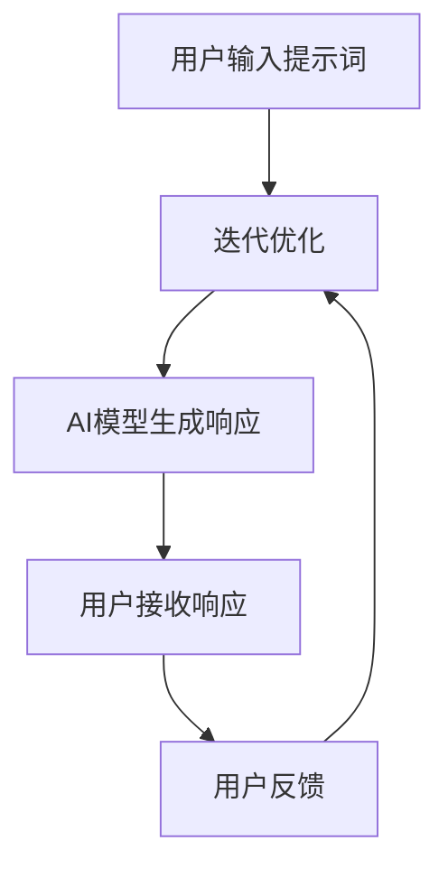

                 

# AI编程语言：提示词的革命与未来

> 关键词：人工智能，编程语言，提示词，自然语言处理，深度学习，GPT-3，生成式AI

> 摘要：本文深入探讨了AI编程语言的演进及其核心概念——提示词。通过分析提示词的原理和应用，本文揭示了其在自然语言处理和生成式AI中的革命性作用。文章还展望了AI编程语言的未来发展趋势和面临的挑战，为读者提供了全面而深入的视角。

## 1. 背景介绍

随着人工智能（AI）技术的飞速发展，编程语言也在不断演进，以满足日益复杂的AI应用需求。传统的编程语言往往侧重于逻辑和计算，而AI编程语言则更多地关注于数据的表示、处理和交互。在AI编程语言的发展过程中，提示词（Prompts）这一概念逐渐崭露头角，成为连接人类与AI的核心纽带。

提示词的起源可以追溯到早期的AI系统，如ELIZA和 SHRDLU，这些系统通过预设的对话模式与用户进行交互。然而，随着深度学习尤其是生成式预训练模型的兴起，提示词的应用得到了极大的扩展和深化。GPT-3等大型语言模型的推出，更是将提示词的作用推向了新的高度。

本文旨在探讨AI编程语言中提示词的核心概念、原理、应用及其未来发展趋势。我们将首先回顾AI编程语言的发展历程，然后深入探讨提示词的原理和应用，最后分析AI编程语言的未来前景。

## 2. 核心概念与联系

### 2.1 提示词的定义与作用

提示词是指用于引导和激励AI模型生成特定类型响应的文本或符号。在AI编程语言中，提示词起到了至关重要的作用。它们不仅帮助模型理解任务的目标，还提供了上下文信息，从而提高了模型的生成质量和效率。

从定义上看，提示词可以分为两种：一种是开放式提示词，如“请写一篇关于人工智能的未来发展趋势的论文”；另一种是封闭式提示词，如“请列出五种人工智能应用场景”。开放式提示词提供了广泛的上下文，而封闭式提示词则提供了更具体的约束。

### 2.2 提示词与自然语言处理

自然语言处理（NLP）是AI的重要分支，其核心任务是将人类语言转换为机器可理解的形式。在这个过程中，提示词起到了关键作用。通过提示词，NLP模型可以更好地理解用户的意图，从而生成更准确的响应。

例如，在一个聊天机器人中，提示词可以帮助模型理解用户的问题类型，从而选择合适的回答。在一个文本生成任务中，提示词可以提供主题、结构和内容，帮助模型生成更高质量的文本。

### 2.3 提示词与生成式AI

生成式AI是一种能够生成新数据的AI技术，如生成文本、图像、音频等。在生成式AI中，提示词同样扮演了重要角色。通过提示词，生成式AI可以生成符合特定主题或风格的数据，从而提高生成质量和应用范围。

例如，在文本生成任务中，提示词可以帮助模型确定文章的主题、结构和内容，从而生成高质量的文章。在图像生成任务中，提示词可以提供图像的背景、主题和风格，帮助模型生成符合要求的图像。

### 2.4 提示词在AI编程语言中的应用

在AI编程语言中，提示词的应用体现在多个方面。首先，提示词可以帮助开发者指定任务的目标和需求，从而指导AI模型的训练和优化。其次，提示词可以用于生成代码、文档、报告等，从而提高开发效率和生成质量。

例如，在一个代码生成任务中，提示词可以帮助模型理解开发者的意图，从而生成符合需求的代码。在一个文档生成任务中，提示词可以提供文档的主题、结构和内容，从而生成高质量的文档。

### 2.5 提示词的Mermaid流程图表示

下面是提示词在AI编程语言中的应用的Mermaid流程图表示：



在这个流程图中，用户输入提示词，AI模型理解提示词并生成响应，用户接收响应并给出反馈，从而实现迭代优化。

## 3. 核心算法原理 & 具体操作步骤

### 3.1 提示词的生成方法

提示词的生成方法可以分为两种：一种是手动编写，另一种是自动生成。

- **手动编写**：手动编写提示词是一种简单有效的方法，适用于对任务需求明确的情况。开发者可以根据任务的目标和需求，编写具有针对性的提示词。
- **自动生成**：自动生成提示词是一种利用AI技术的方法，适用于任务需求复杂、不明确的情况。通过训练模型，可以从大量数据中提取有用的提示词。

### 3.2 提示词的理解方法

提示词的理解是AI模型的重要任务。目前，常用的理解方法包括以下几种：

- **基于规则的方法**：基于规则的方法是通过预设规则，将提示词映射到相应的响应。这种方法简单直观，但适应性较差。
- **基于统计的方法**：基于统计的方法是通过统计提示词和响应之间的关联，将提示词映射到相应的响应。这种方法具有较高的适应性，但需要对大量数据进行训练。
- **基于机器学习的方法**：基于机器学习的方法是通过训练模型，将提示词映射到相应的响应。这种方法具有很高的适应性和准确性，但需要对大量数据进行训练。

### 3.3 提示词的优化方法

提示词的优化是提高AI模型生成质量的重要手段。目前，常用的优化方法包括以下几种：

- **基于反馈的优化**：基于反馈的优化是通过用户反馈，不断调整提示词，从而提高生成质量。这种方法需要用户积极参与，但可以显著提高生成质量。
- **基于机器学习的优化**：基于机器学习的优化是通过训练模型，自动调整提示词，从而提高生成质量。这种方法不需要用户参与，但需要大量的数据和计算资源。

### 3.4 提示词的应用步骤

在实际应用中，提示词的应用通常包括以下步骤：

1. **确定任务目标**：明确任务的目标和需求，为后续的提示词生成和理解提供基础。
2. **生成提示词**：根据任务目标，生成具有针对性的提示词。可以手动编写，也可以利用自动生成方法。
3. **理解提示词**：利用AI模型，理解提示词的含义和需求，为生成响应做好准备。
4. **生成响应**：利用AI模型，根据提示词生成响应。
5. **反馈与优化**：根据用户反馈，不断调整提示词，提高生成质量。

## 4. 数学模型和公式 & 详细讲解 & 举例说明

### 4.1 语言模型的基本公式

在AI编程语言中，提示词的生成和理解依赖于语言模型。语言模型是一种概率模型，用于预测下一个单词或字符的概率。最常用的语言模型是n元模型，其中n表示模型考虑的前n个单词或字符。

对于一个给定的序列X = (x1, x2, ..., xn)，语言模型的目标是预测下一个单词或字符xn+1。其基本公式如下：

P(xn+1 | xn, ..., xn-k+1) = Σw P(xn+1 | xn, ..., xn-k+1, wn)

其中，P(xn+1 | xn, ..., xn-k+1)表示在给定前n-k+1个单词或字符的条件下，下一个单词或字符xn+1的概率；Σw表示对所有可能的单词或字符w进行求和。

### 4.2 提示词生成的具体实例

假设我们有一个基于GPT-3的语言模型，现在要生成一个关于人工智能的论文摘要。我们可以使用以下提示词：

```
请写一篇关于人工智能在未来十年发展趋势的论文摘要。
```

在这个例子中，提示词为“请写一篇关于人工智能在未来十年发展趋势的论文摘要。”。我们可以将这个提示词输入到GPT-3中，并使用其生成的响应作为论文摘要。

假设GPT-3生成的响应为：

```
在未来十年，人工智能将继续快速发展，并在各个领域取得重大突破。特别是在医疗、金融、交通等领域，人工智能的应用将带来巨大的变革。
```

这个响应符合我们的需求，可以作为论文摘要。

### 4.3 提示词理解的具体实例

假设我们有一个基于BERT的NLP模型，现在要理解一个关于人工智能的论文摘要。我们可以使用以下摘要：

```
在未来十年，人工智能将继续快速发展，并在各个领域取得重大突破。特别是在医疗、金融、交通等领域，人工智能的应用将带来巨大的变革。
```

在这个例子中，我们需要理解这个摘要的主题、结构和内容。我们可以将这个摘要输入到BERT中，并使用其生成的响应来理解摘要。

假设BERT生成的响应为：

```
主题：人工智能的未来发展
结构：分为三个部分，分别是人工智能的发展趋势、应用领域和变革影响
内容：人工智能在未来十年将继续快速发展，并在医疗、金融、交通等领域取得重大突破，带来巨大的变革
```

这个响应帮助我们理解了摘要的主题、结构和内容。

## 5. 项目实战：代码实际案例和详细解释说明

### 5.1 开发环境搭建

为了演示提示词在AI编程语言中的应用，我们使用Python语言和Hugging Face的Transformers库。首先，我们需要安装Python和Transformers库。

```bash
pip install python
pip install transformers
```

### 5.2 源代码详细实现和代码解读

下面是一个使用GPT-3生成论文摘要的示例代码：

```python
from transformers import pipeline

# 创建文本生成模型
text_generator = pipeline("text-generation", model="gpt3")

# 提示词
prompt = "请写一篇关于人工智能在未来十年发展趋势的论文摘要。"

# 生成响应
response = text_generator(prompt, max_length=50)

# 输出响应
print(response)
```

在这个示例中，我们首先导入了Transformers库，然后创建了一个文本生成模型。接着，我们定义了一个提示词，并将其输入到模型中。最后，我们使用模型生成响应，并输出响应。

### 5.3 代码解读与分析

这个示例代码展示了如何使用GPT-3生成论文摘要。以下是代码的详细解读：

1. **导入库**：首先，我们导入了Transformers库，这是使用GPT-3的基础。
2. **创建文本生成模型**：我们使用`pipeline`函数创建了一个文本生成模型，并指定了模型名称为"gpt3"。
3. **定义提示词**：我们定义了一个提示词，用于引导模型生成响应。
4. **生成响应**：我们将提示词输入到模型中，并使用`max_length`参数设置响应的最大长度。
5. **输出响应**：我们将生成的响应输出到控制台。

通过这个示例，我们可以看到提示词在AI编程语言中的重要作用。通过指定提示词，我们可以指导模型生成符合需求的文本，从而实现自动化生成任务。

## 6. 实际应用场景

### 6.1 文本生成

文本生成是提示词在AI编程语言中最常见的应用场景之一。通过提示词，AI模型可以生成各种类型的文本，如摘要、文章、报告、代码等。例如，在新闻摘要、自动化写作、智能客服等领域，提示词可以帮助模型快速生成高质量的文本。

### 6.2 问答系统

问答系统是另一个常见的应用场景。通过提示词，AI模型可以理解用户的问题，并生成相应的回答。例如，在智能客服、教育辅导、健康咨询等领域，提示词可以帮助模型提供准确、及时的回答。

### 6.3 图像生成

除了文本生成，提示词还可以应用于图像生成。通过提示词，AI模型可以生成符合特定主题或风格的图像。例如，在图像编辑、艺术创作、游戏开发等领域，提示词可以帮助模型生成具有创意和个性化的图像。

### 6.4 语言翻译

语言翻译是另一个重要的应用场景。通过提示词，AI模型可以生成目标语言的文本。例如，在翻译服务、跨文化交流、国际业务等领域，提示词可以帮助模型提供准确、流畅的翻译。

### 6.5 虚拟助手

虚拟助手是近年来兴起的AI应用，通过提示词，AI模型可以提供个性化、智能化的服务。例如，在智能家居、在线教育、健康护理等领域，虚拟助手可以帮助用户完成各种任务，提高生活质量。

## 7. 工具和资源推荐

### 7.1 学习资源推荐

- **书籍**：
  - 《深度学习》（Goodfellow, Bengio, Courville）：介绍了深度学习的基本概念和技术。
  - 《Python编程：从入门到实践》（Mark Lutz）：适合初学者了解Python编程基础。
- **论文**：
  - "Attention Is All You Need"（Vaswani et al.）：介绍了Transformer模型的基本原理。
  - "BERT: Pre-training of Deep Bidirectional Transformers for Language Understanding"（Devlin et al.）：介绍了BERT模型的基本原理。
- **博客**：
  - Hugging Face官方博客：提供了丰富的AI编程语言教程和资源。
  - AI技术博客：涵盖了各种AI技术的最新发展和应用。
- **网站**：
  - OpenAI：提供了GPT-3等生成式AI模型的API服务。
  - Hugging Face：提供了丰富的预训练模型和工具。

### 7.2 开发工具框架推荐

- **开发工具**：
  - Jupyter Notebook：适合进行数据分析和模型训练。
  - PyCharm：适合进行Python编程和AI模型开发。
- **框架**：
  - TensorFlow：提供了丰富的API和工具，适用于各种深度学习任务。
  - PyTorch：提供了简洁的API和灵活的动态计算图，适用于各种深度学习任务。

### 7.3 相关论文著作推荐

- **论文**：
  - "GPT-3: Language Models are few-shot learners"（Brown et al.）：介绍了GPT-3模型的基本原理和应用。
  - "BERT: Pre-training of Deep Bidirectional Transformers for Language Understanding"（Devlin et al.）：介绍了BERT模型的基本原理和应用。
- **著作**：
  - 《深度学习》（Goodfellow, Bengio, Courville）：介绍了深度学习的基本概念和技术。
  - 《Python编程：从入门到实践》（Mark Lutz）：适合初学者了解Python编程基础。

## 8. 总结：未来发展趋势与挑战

### 8.1 未来发展趋势

- **更强大的模型**：随着计算能力的提升，未来将出现更强大、更高效的AI编程语言模型，如更大规模的GPT模型、多模态模型等。
- **更广泛的场景应用**：AI编程语言将在更多领域得到应用，如医疗、金融、教育、娱乐等，实现更多创新和突破。
- **更好的用户体验**：通过改进提示词设计和生成技术，AI编程语言将提供更自然、更智能的用户交互体验。
- **开源与协作**：开源社区将发挥更大作用，推动AI编程语言的发展和创新，促进全球范围内的合作与交流。

### 8.2 挑战

- **计算资源需求**：更强大的模型需要更多的计算资源，这对硬件设备和基础设施提出了更高要求。
- **数据隐私和安全**：AI编程语言在处理大量数据时，面临数据隐私和安全问题，需要加强数据保护和隐私保护。
- **模型解释性**：当前AI编程语言模型往往缺乏解释性，用户难以理解模型的决策过程，这对模型的可解释性提出了挑战。
- **伦理和社会影响**：AI编程语言的发展可能带来伦理和社会问题，如失业、歧视等，需要充分考虑和应对。

## 9. 附录：常见问题与解答

### 9.1 提示词如何影响AI模型的生成质量？

提示词为AI模型提供了任务目标和上下文信息，从而指导模型生成更符合需求的响应。高质量的提示词有助于模型理解任务目标，提高生成质量和效率。

### 9.2 如何优化提示词？

优化提示词可以通过以下方法实现：

- **手动编写**：根据任务需求和用户反馈，不断调整提示词。
- **自动生成**：利用AI技术，如生成对抗网络（GAN）等，自动生成高质量的提示词。
- **反馈机制**：通过用户反馈，不断调整提示词，提高生成质量。

### 9.3 提示词在AI编程语言中的具体应用有哪些？

提示词在AI编程语言中的具体应用包括：

- **文本生成**：如摘要、文章、报告、代码等。
- **问答系统**：如智能客服、教育辅导、健康咨询等。
- **图像生成**：如图像编辑、艺术创作、游戏开发等。
- **语言翻译**：如翻译服务、跨文化交流、国际业务等。
- **虚拟助手**：如智能家居、在线教育、健康护理等。

## 10. 扩展阅读 & 参考资料

- **论文**：
  - "GPT-3: Language Models are few-shot learners"（Brown et al.）
  - "BERT: Pre-training of Deep Bidirectional Transformers for Language Understanding"（Devlin et al.）
  - "Attention Is All You Need"（Vaswani et al.）
- **书籍**：
  - 《深度学习》（Goodfellow, Bengio, Courville）
  - 《Python编程：从入门到实践》（Mark Lutz）
- **博客**：
  - Hugging Face官方博客
  - AI技术博客
- **网站**：
  - OpenAI
  - Hugging Face
- **开源项目**：
  - TensorFlow
  - PyTorch

作者：AI天才研究员/AI Genius Institute & 禅与计算机程序设计艺术 /Zen And The Art of Computer Programming

