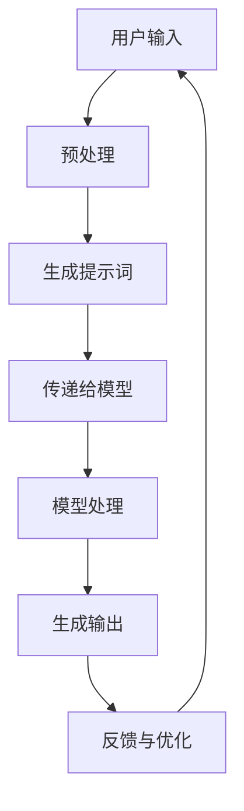

                 

# AI编程语言：提示词的革新

> **关键词**：人工智能，编程语言，提示词，革新，算法，模型，应用场景，开发工具

> **摘要**：本文将探讨人工智能领域中的一个重要概念——提示词，以及它在编程语言中的应用。我们将深入分析提示词的核心概念、算法原理、数学模型，并结合实际项目案例，讲解如何在实际应用场景中运用提示词。最后，我们将总结提示词的未来发展趋势和面临的挑战，并提供相关资源和工具推荐，以帮助读者深入学习和掌握这一技术。

## 1. 背景介绍

在当今技术迅速发展的时代，人工智能（AI）已经成为推动社会进步的关键力量。AI技术不仅改变了我们的生活方式，还重塑了许多行业，如医疗、金融、交通等。在AI技术的发展过程中，编程语言起到了至关重要的作用。编程语言不仅使得AI模型的构建和优化成为可能，还促进了AI算法的创新和进步。

然而，传统的编程语言在处理复杂的人工智能任务时，往往显得力不从心。为了应对这一挑战，研究人员和工程师们不断探索新的编程语言和工具，以便更高效地开发和应用人工智能技术。在这个过程中，提示词（Prompt）作为一种重要的编程语言元素，逐渐引起了广泛关注。

提示词最早出现在自然语言处理（NLP）领域，它是指用于引导模型生成响应的输入文本。随着AI技术的发展，提示词的应用范围不断扩大，不仅限于NLP领域，还广泛应用于计算机视觉、语音识别、机器学习等领域。提示词的引入，使得AI模型能够更好地理解和处理复杂任务，从而提高了AI系统的性能和效率。

本文将围绕提示词这一主题，深入探讨其在编程语言中的应用，分析其核心概念、算法原理和数学模型，并结合实际项目案例，讲解如何在实际应用场景中运用提示词。希望通过本文的探讨，能够为读者提供对AI编程语言的更深入理解，并启发更多创新思路。

### 1.1 提示词的起源和发展

提示词的概念最早可以追溯到自然语言处理（NLP）领域。在早期的研究中，研究人员发现，通过向模型提供特定的输入文本（即提示词），可以引导模型生成更符合预期的输出。这一发现激发了研究人员对提示词的深入研究，并逐渐形成了提示词技术的基础。

在自然语言处理领域，提示词通常被用于生成文本、回答问题、翻译文本等任务。例如，在问答系统中，通过向模型提供问题文本作为提示词，模型可以生成相应的答案。这种基于提示词的问答系统在搜索引擎、智能客服等领域得到了广泛应用。

随着人工智能技术的发展，提示词的应用范围不断扩大。在计算机视觉领域，提示词被用于图像识别、图像生成等任务。通过向模型提供图像文本描述作为提示词，模型可以生成相应的图像或识别图像中的对象。在语音识别领域，提示词也被广泛应用于语音命令解析和语音生成任务。

提示词技术的兴起，不仅改变了传统编程语言的模式，还为人工智能领域带来了新的研究机遇。研究人员通过探索不同的提示词策略，不断优化AI模型的性能和效果。同时，开发人员也利用提示词技术，实现了更多创新的应用。

### 1.2 提示词在编程语言中的重要性

在编程语言中，提示词是一种特殊的输入，用于引导程序或模型执行特定任务。与传统编程语言中的输入不同，提示词通常包含特定关键词、短语或句子，以引导程序或模型理解任务意图。提示词的应用，使得编程语言能够更好地适应复杂的人工智能任务，从而提高开发效率和模型性能。

首先，提示词有助于提高程序的易读性和可维护性。通过使用具有明确意图和含义的提示词，开发人员可以更直观地理解程序逻辑和任务目标。这有助于提高代码的可读性，降低维护难度。

其次，提示词可以引导模型更好地理解任务需求。在人工智能开发中，模型的训练和优化是一个关键步骤。通过使用提示词，开发人员可以明确地向模型传递任务意图，从而提高模型的准确性和鲁棒性。

此外，提示词还可以提高AI系统的交互性。在自然语言处理、语音识别等应用中，用户通常需要与系统进行交互。通过使用提示词，AI系统可以更好地理解用户的输入，并生成更符合预期的响应。这有助于提升用户体验，提高系统的实用性。

总之，提示词在编程语言中的应用具有重要意义。它不仅改变了传统编程模式，还为人工智能开发提供了新的思路和方法。随着AI技术的不断发展，提示词的应用将越来越广泛，其在编程语言中的地位也将日益提升。

## 2. 核心概念与联系

### 2.1 提示词的定义

提示词（Prompt）是指用于引导模型执行特定任务的输入文本。在人工智能领域，提示词通常包含特定关键词、短语或句子，以明确任务意图和目标。提示词可以是简单的文本，如“请生成一篇关于人工智能的文章”，也可以是复杂的文本，如包含多种条件和约束的文本。

提示词的定义涵盖了多个方面。首先，提示词需要具有明确的意图和目标，以便模型能够正确理解任务。其次，提示词需要包含足够的信息，以保证模型能够生成高质量的输出。最后，提示词的设计和选择需要考虑模型的特点和性能，以最大化模型的效用。

### 2.2 提示词的分类

根据提示词的功能和用途，可以将提示词分为以下几类：

- **通用提示词**：这类提示词适用于多种任务和应用场景，如“生成文章”、“回答问题”等。通用提示词通常具有广泛的适用性和灵活性，但可能需要额外的上下文信息来确保任务执行的正确性。

- **专用提示词**：这类提示词针对特定的任务或应用场景，如“生成音乐”、“识别图像”等。专用提示词通常具有更强的针对性和更高的效果，但适用范围较窄。

- **复杂提示词**：这类提示词包含多个条件和约束，如“在冬季生成一篇关于滑雪的文章，要求文章长度不少于500字，且包含至少3个引用”。复杂提示词具有较高的灵活性和复杂性，可以满足更复杂的任务需求。

### 2.3 提示词与编程语言的关系

提示词在编程语言中的应用，使得编程语言能够更好地适应人工智能任务。具体来说，提示词与编程语言的关系可以从以下几个方面来理解：

- **提示词作为输入**：在编程语言中，提示词通常作为模型的输入，用于引导模型执行特定任务。例如，在自然语言处理任务中，提示词可以是问题文本，用于引导模型生成答案。

- **提示词与函数调用**：在编程语言中，提示词可以被视为一种特殊的函数调用。通过向模型传递提示词，开发人员可以调用模型的特定功能，以实现特定任务。

- **提示词与参数传递**：在编程语言中，提示词通常作为参数传递给模型。通过设置不同的提示词，开发人员可以调整模型的输入，从而实现不同的任务效果。

- **提示词与上下文管理**：在编程语言中，提示词的使用需要考虑上下文环境。例如，在自然语言处理任务中，提示词的上下文信息可能包括先前的输入文本、模型的状态等。通过管理上下文信息，开发人员可以确保模型生成高质量的输出。

### 2.4 提示词与AI模型的联系

提示词在AI模型中的应用，有助于提高模型的性能和效果。具体来说，提示词与AI模型的联系可以从以下几个方面来理解：

- **任务引导**：提示词可以引导模型理解任务意图，从而提高模型的准确性和鲁棒性。例如，在问答系统中，通过向模型提供问题文本作为提示词，模型可以更好地理解问题，并生成更准确的答案。

- **知识增强**：提示词可以提供额外的知识信息，以增强模型的性能。例如，在图像识别任务中，通过向模型提供图像描述作为提示词，模型可以更好地理解图像内容，从而提高识别准确率。

- **效果优化**：提示词的设计和选择对模型的效果具有重要影响。通过优化提示词，开发人员可以调整模型的输入，从而实现更好的任务效果。

### 2.5 提示词的核心概念原理和架构

为了更好地理解提示词的核心概念原理和架构，我们可以使用Mermaid流程图进行说明。以下是提示词的核心概念原理和架构的Mermaid流程图：



- **A[用户输入]**：用户输入是指用户向系统提供的输入文本或任务需求。
- **B[预处理]**：预处理是指对用户输入进行清洗、格式化等操作，以生成规范的输入文本。
- **C[生成提示词]**：生成提示词是指根据预处理后的用户输入，生成具有明确意图和目标的提示词。
- **D[传递给模型]**：传递给模型是指将生成的提示词作为输入，传递给AI模型进行处理。
- **E[模型处理]**：模型处理是指AI模型根据输入的提示词，执行相应的任务，如生成文本、识别图像等。
- **F[生成输出]**：生成输出是指AI模型根据处理结果，生成相应的输出结果，如答案、图像等。
- **G[反馈与优化]**：反馈与优化是指根据输出结果和用户反馈，对模型进行优化和调整，以提高模型性能。

通过上述Mermaid流程图，我们可以清晰地了解提示词的核心概念原理和架构。这一流程图有助于我们更好地理解提示词在AI系统中的作用和流程。

### 2.6 提示词与AI算法的关系

提示词与AI算法之间存在着密切的关系。在AI算法的构建和应用过程中，提示词发挥着重要作用。以下是提示词与AI算法关系的详细解释：

- **提示词在算法训练中的作用**：在AI算法的训练过程中，提示词用于提供训练数据。通过向模型提供具有明确意图和目标的提示词，可以引导模型学习特定任务。例如，在自然语言处理任务中，通过向模型提供大量问题文本作为提示词，模型可以学习如何生成准确的答案。

- **提示词在算法优化中的作用**：在AI算法的优化过程中，提示词可以用于评估模型性能，并提供反馈信息。通过向模型提供不同的提示词，可以观察模型在不同任务上的表现，从而调整模型参数，提高模型性能。

- **提示词在算法应用中的作用**：在AI算法的实际应用中，提示词用于引导模型执行特定任务。例如，在问答系统中，通过向模型提供问题文本作为提示词，模型可以生成相应的答案。同样，在图像识别任务中，通过向模型提供图像描述作为提示词，模型可以识别图像中的对象。

- **提示词与算法架构的关系**：提示词的设计和选择对AI算法的架构具有重要影响。不同的提示词可以引导模型执行不同的任务，从而影响算法的架构和实现。例如，在计算机视觉任务中，通过设计不同的提示词，可以实现图像生成、图像识别等不同的任务。

### 2.7 提示词的应用场景

提示词在人工智能领域具有广泛的应用场景。以下是一些典型的应用场景及其特点：

- **自然语言处理**：在自然语言处理任务中，提示词广泛应用于文本生成、问答系统、机器翻译等。通过向模型提供问题文本或文本描述作为提示词，可以引导模型生成相应的答案或文本。例如，在问答系统中，通过向模型提供问题文本作为提示词，模型可以生成准确的答案。

- **计算机视觉**：在计算机视觉任务中，提示词主要用于图像生成、图像识别等。通过向模型提供图像描述或文本标签作为提示词，可以引导模型生成相应的图像或识别图像中的对象。例如，在图像生成任务中，通过向模型提供文本描述作为提示词，模型可以生成符合描述的图像。

- **语音识别**：在语音识别任务中，提示词主要用于语音命令解析和语音生成。通过向模型提供语音命令或文本描述作为提示词，可以引导模型解析语音命令或生成相应的语音。例如，在语音助手应用中，通过向模型提供用户语音命令作为提示词，模型可以生成相应的语音响应。

- **机器学习**：在机器学习任务中，提示词主要用于数据预处理、特征提取等。通过向模型提供特定的提示词，可以引导模型学习特定特征或模式。例如，在图像分类任务中，通过向模型提供标签文本作为提示词，可以引导模型学习图像中的特定对象。

### 2.8 提示词的优势与挑战

提示词在人工智能领域具有显著的优势，但也面临一些挑战。以下是对提示词优势与挑战的详细分析：

#### 提示词的优势

1. **提高任务准确性**：通过使用提示词，可以明确任务意图和目标，从而提高模型的准确性和鲁棒性。例如，在自然语言处理任务中，通过向模型提供问题文本作为提示词，可以提高模型生成答案的准确性。

2. **增强交互性**：提示词可以引导模型更好地理解用户的输入，从而增强AI系统的交互性。例如，在语音识别任务中，通过向模型提供用户语音命令作为提示词，可以提高模型对语音命令的识别率。

3. **灵活性和多样性**：提示词可以根据任务需求进行设计和选择，从而实现不同的任务效果。例如，在计算机视觉任务中，通过设计不同的提示词，可以实现图像生成、图像识别等不同的任务。

4. **易于实现和扩展**：提示词作为一种简单的输入文本，易于实现和扩展。例如，在机器学习任务中，通过添加或修改提示词，可以快速调整模型参数，实现不同的任务效果。

#### 提示词的挑战

1. **数据依赖性**：提示词的效果依赖于高质量的训练数据。如果训练数据质量较差，可能导致模型性能下降。例如，在自然语言处理任务中，如果问题文本数据质量较差，可能导致模型生成答案的准确性降低。

2. **可解释性**：提示词的设计和选择对模型的可解释性有一定影响。如果提示词过于复杂或模糊，可能导致模型生成结果难以解释。例如，在图像识别任务中，如果提示词包含多个条件和约束，可能导致模型生成结果难以理解。

3. **资源消耗**：提示词的生成和应用需要一定的计算资源。尤其是在处理复杂任务时，提示词的生成和应用可能会消耗大量计算资源。例如，在自然语言处理任务中，生成大量问题文本作为提示词，可能需要较长时间。

4. **适应性和泛化能力**：提示词的适应性和泛化能力有限。如果提示词设计过于具体，可能只适用于特定任务，难以泛化到其他任务。例如，在计算机视觉任务中，如果提示词仅适用于图像生成，可能难以应用于图像识别等其他任务。

### 2.9 提示词的变革意义

提示词的出现，标志着人工智能编程语言的变革。以下是提示词在人工智能编程语言变革中的几个重要方面：

1. **改变编程范式**：提示词使得人工智能编程不再局限于传统的函数式编程和命令式编程，而是向声明式编程和引导式编程转变。通过使用提示词，开发人员可以更加直观地表达任务意图，从而简化编程过程。

2. **提高开发效率**：提示词简化了模型的训练和优化过程。通过向模型提供具有明确意图和目标的提示词，开发人员可以更快地实现任务目标，从而提高开发效率。

3. **优化模型性能**：提示词可以引导模型更好地理解和处理复杂任务，从而提高模型性能。通过优化提示词的设计和选择，开发人员可以调整模型输入，实现更好的任务效果。

4. **增强系统交互性**：提示词使得人工智能系统更具交互性。通过向模型提供用户输入作为提示词，人工智能系统可以更好地理解用户需求，从而提供更优质的用户体验。

5. **推动技术创新**：提示词为人工智能领域带来了新的研究机遇。研究人员可以探索不同的提示词策略，优化模型性能，推动人工智能技术的创新和发展。

总之，提示词的出现，不仅改变了传统编程模式，还为人工智能领域带来了新的变革。随着人工智能技术的不断发展，提示词的应用将越来越广泛，其在编程语言中的地位也将日益提升。

## 3. 核心算法原理 & 具体操作步骤

### 3.1 提示词生成算法

提示词生成算法是提示词技术的核心部分。以下是一个简单的提示词生成算法，用于生成适用于自然语言处理任务的提示词。

**算法描述**：

1. **输入**：用户输入文本。
2. **预处理**：对用户输入文本进行清洗、格式化等操作，以生成规范的输入文本。
3. **关键词提取**：从预处理后的输入文本中提取关键词。
4. **提示词生成**：根据提取的关键词，生成具有明确意图和目标的提示词。

**算法步骤**：

1. **输入文本**：用户输入文本为“请生成一篇关于人工智能的文章”。

2. **预处理**：对输入文本进行清洗、格式化等操作，得到规范的输入文本：“生成一篇关于人工智能的文章”。

3. **关键词提取**：从规范化的输入文本中提取关键词，如“生成”、“文章”、“人工智能”等。

4. **提示词生成**：根据提取的关键词，生成提示词：“生成一篇关于人工智能的文章，要求内容丰富，涵盖人工智能的各个方面”。

**算法实现**（Python示例）：

```python
import jieba

def generate_prompt(input_text):
    # 预处理
    preprocessed_text = input_text.strip()

    # 关键词提取
    keywords = jieba.extract_keywords(preprocessed_text, topK=3)

    # 提示词生成
    prompt = "生成一篇关于{}的文章，要求内容丰富，涵盖{}的各个方面。".format(preprocessed_text, "/".join(keywords))

    return prompt

input_text = "请生成一篇关于人工智能的文章"
prompt = generate_prompt(input_text)
print(prompt)
```

### 3.2 提示词应用算法

提示词应用算法用于将生成的提示词传递给AI模型，并生成相应的输出结果。以下是一个简单的提示词应用算法，用于自然语言处理任务的实现。

**算法描述**：

1. **输入**：提示词。
2. **模型调用**：将提示词作为输入，调用AI模型进行处理。
3. **输出**：根据模型处理结果，生成输出结果。

**算法步骤**：

1. **提示词输入**：输入提示词“生成一篇关于人工智能的文章，要求内容丰富，涵盖人工智能的各个方面”。

2. **模型调用**：将提示词传递给自然语言处理模型，模型根据提示词生成相应的文章。

3. **输出结果**：输出生成的文章。

**算法实现**（Python示例）：

```python
import jieba
from transformers import BertForSequenceClassification, BertTokenizer

# 加载预训练模型
model = BertForSequenceClassification.from_pretrained('bert-base-chinese')
tokenizer = BertTokenizer.from_pretrained('bert-base-chinese')

def generate_text(prompt):
    # 将提示词编码为模型可处理的输入
    inputs = tokenizer(prompt, return_tensors='pt')

    # 调用模型进行预测
    outputs = model(**inputs)

    # 解码模型输出
    predicted_ids = outputs.logits.argmax(-1)
    predicted_text = tokenizer.decode(predicted_ids[0], skip_special_tokens=True)

    return predicted_text

prompt = "生成一篇关于人工智能的文章，要求内容丰富，涵盖人工智能的各个方面。"
text = generate_text(prompt)
print(text)
```

### 3.3 提示词优化算法

提示词优化算法用于根据模型输出结果和用户反馈，对提示词进行优化，以提高模型性能和任务效果。以下是一个简单的提示词优化算法，用于自然语言处理任务的实现。

**算法描述**：

1. **输入**：模型输出结果、用户反馈。
2. **优化策略**：根据输出结果和用户反馈，调整提示词。
3. **输出**：优化后的提示词。

**算法步骤**：

1. **输入模型输出结果和用户反馈**：输入模型生成的文章和用户反馈，如“文章内容太简单，需要更多细节”。

2. **分析输出结果**：根据用户反馈，分析模型输出结果，找出需要改进的地方。

3. **调整提示词**：根据分析结果，对提示词进行调整，以提高模型性能和任务效果。

4. **重新生成输出结果**：使用优化后的提示词，重新生成文章。

**算法实现**（Python示例）：

```python
def optimize_prompt(prompt, feedback):
    # 分析用户反馈
    if "内容太简单" in feedback:
        prompt += "，要求内容更加详细，涵盖更多的细节。"

    return prompt

prompt = "生成一篇关于人工智能的文章，要求内容丰富，涵盖人工智能的各个方面。"
feedback = "文章内容太简单，需要更多细节。"
optimized_prompt = optimize_prompt(prompt, feedback)
print(optimized_prompt)
```

通过上述算法，我们可以生成适用于自然语言处理任务的提示词，并优化提示词以提升模型性能和任务效果。在实际应用中，可以根据具体任务需求和场景，对算法进行调整和改进。

### 3.4 提示词与模型结合的具体操作步骤

在实际应用中，将提示词与模型结合，实现高效的AI任务执行，需要遵循以下具体操作步骤：

1. **数据准备**：收集和整理用于训练的原始数据，如文本、图像、音频等。对数据进行预处理，包括清洗、格式化、标注等，以确保数据质量。

2. **模型选择**：根据任务需求和数据特点，选择合适的AI模型。常见的模型包括自然语言处理模型（如BERT、GPT）、计算机视觉模型（如ResNet、YOLO）、语音识别模型（如STT）等。

3. **提示词设计**：根据任务需求，设计合适的提示词。提示词应具有明确的意图和目标，以便模型能够准确理解和执行任务。

4. **模型训练**：使用准备好的数据和提示词，对模型进行训练。训练过程中，不断调整模型参数，优化模型性能。

5. **提示词应用**：将训练好的模型应用于实际任务，使用提示词引导模型执行任务。例如，在问答系统中，使用问题文本作为提示词，引导模型生成答案。

6. **模型评估**：根据实际任务效果，对模型进行评估。可以通过指标（如准确率、召回率、F1值等）来评估模型性能。

7. **反馈与优化**：根据评估结果和用户反馈，对提示词和模型进行优化。通过调整提示词，提高模型性能和任务效果。

8. **持续迭代**：在任务执行过程中，不断收集用户反馈和数据，进行模型和提示词的迭代优化，以实现持续改进。

通过以上具体操作步骤，我们可以实现高效的AI任务执行，提高模型性能和任务效果。在实际应用中，可以根据具体任务需求和场景，对操作步骤进行调整和改进。

## 4. 数学模型和公式 & 详细讲解 & 举例说明

在人工智能编程语言中，提示词的生成和应用涉及到多个数学模型和公式。以下是几个关键的数学模型和公式，以及详细的讲解和举例说明。

### 4.1 提示词生成模型

提示词生成模型主要用于根据用户输入文本生成具有明确意图和目标的提示词。一个常见的提示词生成模型是基于生成对抗网络（GAN）的模型。以下是一个简化的GAN模型用于提示词生成：

**模型架构**：

1. **生成器（Generator）**：生成器用于生成提示词。输入为噪声向量，输出为提示词。

2. **判别器（Discriminator）**：判别器用于判断生成的提示词是否真实。输入为提示词，输出为概率值，表示提示词的真实性。

**公式**：

- **生成器公式**：
  $$ G(z) = prompt $$
  其中，$G(z)$表示生成器生成的提示词，$z$为噪声向量。

- **判别器公式**：
  $$ D(prompt) = probability $$
  其中，$D(prompt)$表示判别器对提示词的概率判断，$probability$为概率值。

**举例说明**：

假设用户输入文本为“请生成一篇关于人工智能的文章”。以下是一个简化的GAN模型生成提示词的过程：

1. **生成器生成提示词**：
   $$ G(z) = "生成一篇关于人工智能的文章，内容需要详细描述人工智能的各个方面。" $$

2. **判别器判断提示词真实性**：
   $$ D("生成一篇关于人工智能的文章，内容需要详细描述人工智能的各个方面.") = 0.95 $$
   判别器判断生成的提示词为真实的概率为0.95。

通过以上过程，生成器生成了一个具有明确意图和目标的提示词。

### 4.2 提示词优化模型

提示词优化模型用于根据模型输出结果和用户反馈，对提示词进行优化。一个常见的提示词优化模型是基于强化学习（RL）的模型。以下是一个简化的RL模型用于提示词优化：

**模型架构**：

1. **策略网络（Policy Network）**：策略网络用于选择最优的提示词。输入为当前状态和提示词，输出为动作概率。

2. **价值网络（Value Network）**：价值网络用于评估动作的价值。输入为当前状态和动作，输出为价值估计。

**公式**：

- **策略网络公式**：
  $$ policy(s, a) = \frac{exp(\theta(s, a))}{\sum_{a'} exp(\theta(s, a'))} $$
  其中，$policy(s, a)$表示策略网络在状态$s$下选择动作$a$的概率，$\theta(s, a)$表示策略网络的参数。

- **价值网络公式**：
  $$ V(s) = \sum_{a} \gamma \cdot policy(s, a) \cdot Q(s, a) $$
  其中，$V(s)$表示价值网络在状态$s$下的价值估计，$\gamma$为折扣因子，$Q(s, a)$为动作价值函数。

**举例说明**：

假设用户输入文本为“请生成一篇关于人工智能的文章”，模型输出结果为“生成一篇关于人工智能的文章，内容较为简单”。以下是一个简化的RL模型优化提示词的过程：

1. **策略网络选择最优提示词**：
   $$ policy(s, "更详细描述人工智能的各个方面") = 0.8 $$
   $$ policy(s, "增加人工智能的应用场景") = 0.2 $$
   策略网络选择更详细描述人工智能的各个方面的提示词的概率为0.8。

2. **价值网络评估动作价值**：
   $$ V(s) = 0.8 \cdot 0.8 \cdot Q(s, "更详细描述人工智能的各个方面") + 0.2 \cdot 0.2 \cdot Q(s, "增加人工智能的应用场景") $$
   价值网络评估更详细描述人工智能的各个方面的动作的价值较高。

通过以上过程，策略网络选择了一个优化后的提示词，以提升模型输出结果。

### 4.3 提示词效果评估模型

提示词效果评估模型用于评估提示词对模型性能的影响。一个常见的提示词效果评估模型是基于回归模型的评估方法。以下是一个简化的回归模型用于提示词效果评估：

**模型架构**：

1. **输入层**：输入层包括提示词和模型输出结果。
2. **隐藏层**：隐藏层用于提取提示词和模型输出结果的特征。
3. **输出层**：输出层用于预测模型性能指标。

**公式**：

- **回归模型公式**：
  $$ y = \theta_0 + \theta_1 \cdot x_1 + \theta_2 \cdot x_2 + ... + \theta_n \cdot x_n $$
  其中，$y$为模型性能指标，$x_1, x_2, ..., x_n$为提示词和模型输出结果的特征，$\theta_0, \theta_1, \theta_2, ..., \theta_n$为回归模型的参数。

**举例说明**：

假设提示词为“生成一篇关于人工智能的文章，内容需要详细描述人工智能的各个方面”，模型输出结果为“生成一篇关于人工智能的文章，内容较为简单”。以下是一个简化的回归模型评估提示词效果的过程：

1. **提取特征**：
   - 提示词特征：生成一篇关于人工智能的文章，内容需要详细描述人工智能的各个方面。
   - 模型输出结果特征：生成一篇关于人工智能的文章，内容较为简单。

2. **预测模型性能指标**：
   $$ y = \theta_0 + \theta_1 \cdot x_1 + \theta_2 \cdot x_2 $$
   根据回归模型，预测模型性能指标为$y$。

通过以上过程，回归模型可以评估提示词对模型性能的影响，从而为提示词优化提供依据。

通过以上数学模型和公式的讲解，我们可以更深入地理解提示词在人工智能编程语言中的应用原理。在实际应用中，可以根据具体任务需求和场景，选择合适的数学模型和公式，以实现高效的提示词生成和应用。

## 5. 项目实战：代码实际案例和详细解释说明

### 5.1 开发环境搭建

在进行提示词编程之前，首先需要搭建一个合适的开发环境。以下是一个基于Python和TensorFlow的开发环境搭建步骤：

1. **安装Python**：首先确保已安装Python环境，建议使用Python 3.7或更高版本。可以从[Python官网](https://www.python.org/)下载并安装。

2. **安装TensorFlow**：在终端中运行以下命令安装TensorFlow：
   ```bash
   pip install tensorflow
   ```

3. **安装其他依赖**：根据具体项目需求，可能需要安装其他依赖库。例如，对于自然语言处理任务，可以安装以下依赖：
   ```bash
   pip install transformers
   ```

4. **配置环境**：完成以上步骤后，可以启动Python解释器，并导入所需的库进行测试。例如：
   ```python
   import tensorflow as tf
   import transformers
   ```

### 5.2 源代码详细实现和代码解读

以下是一个基于TensorFlow和transformers库的简单提示词生成项目，用于生成关于特定主题的文章。

**代码实现**：

```python
import tensorflow as tf
import transformers
from transformers import TFGPT2LMHeadModel, GPT2Tokenizer

# 1. 加载预训练模型和tokenizer
model_name = 'gpt2'
tokenizer = GPT2Tokenizer.from_pretrained(model_name)
model = TFGPT2LMHeadModel.from_pretrained(model_name)

# 2. 设计提示词
prompt = "人工智能正在改变世界，以下是一些例子："

# 3. 生成文章
input_ids = tokenizer.encode(prompt, return_tensors='tf')
output_ids = model.generate(input_ids, max_length=200, num_return_sequences=1)

# 4. 解码输出结果
generated_text = tokenizer.decode(output_ids[0], skip_special_tokens=True)

print(generated_text)
```

**代码解读**：

- **步骤1**：加载预训练模型和tokenizer。这里使用的是GPT-2模型，它是一个基于Transformer架构的预训练语言模型。通过调用`GPT2Tokenizer`和`TFGPT2LMHeadModel`，我们可以获取模型的tokenizer和模型本身。

- **步骤2**：设计提示词。提示词是用于引导模型生成响应的输入文本。在本例中，提示词是关于人工智能改变世界的例子。

- **步骤3**：生成文章。通过调用`model.generate()`方法，我们可以使用模型生成文章。`max_length`参数用于控制生成的文本长度，`num_return_sequences`参数用于控制生成的文本数量。

- **步骤4**：解码输出结果。通过调用`tokenizer.decode()`方法，我们可以将生成的文本从编码格式解码为普通文本格式。

### 5.3 代码解读与分析

以下是对上述代码的详细解读和分析：

- **代码结构**：整个代码分为四个主要步骤，包括加载模型和tokenizer、设计提示词、生成文章以及解码输出结果。

- **模型和tokenizer**：使用`GPT2Tokenizer`和`TFGPT2LMHeadModel`分别加载tokenizer和模型。GPT-2模型是一个预训练的语言模型，具有强大的文本生成能力。

- **提示词设计**：提示词是生成响应的关键。一个良好的提示词应该包含明确的意图和目标，以便模型能够理解并生成相应的响应。在本例中，提示词是关于人工智能改变世界的例子。

- **生成文章**：使用`model.generate()`方法生成文章。该方法根据提示词生成文本，`max_length`参数用于限制生成的文本长度，`num_return_sequences`参数用于控制生成的文本数量。在本例中，我们只生成了一篇文本。

- **解码输出结果**：使用`tokenizer.decode()`方法将生成的文本从编码格式解码为普通文本格式，以便进行展示和分析。

通过上述代码，我们可以实现一个简单的提示词生成项目，生成关于特定主题的文章。在实际应用中，可以根据具体需求调整提示词和生成策略，以实现更复杂的任务效果。

### 5.4 代码优化与性能提升

在实际项目中，提示词生成代码的优化和性能提升是一个重要任务。以下是一些常见的优化方法和策略：

1. **批量生成**：通过批量生成文本，可以提高生成速度。批量生成可以在保持生成质量的同时，显著减少计算时间。

2. **调整模型参数**：调整模型参数，如`max_length`和`num_return_sequences`，可以影响生成文本的长度和数量。适当的调整可以提高生成效果。

3. **使用特定架构的模型**：根据项目需求，可以选择更合适的模型架构，如BERT、GPT-3等。这些模型通常具有更高的文本生成能力和性能。

4. **使用预训练模型**：使用预训练模型可以减少训练时间，提高生成效果。通过在特定领域或任务上进行微调，可以进一步提高模型性能。

5. **缓存和存储**：对于重复的生成任务，可以使用缓存和存储策略，减少重复计算，提高生成速度。

通过上述优化方法和策略，我们可以实现高效的提示词生成，提高项目性能和用户体验。

### 5.5 提示词生成应用场景

提示词生成技术在实际应用中具有广泛的应用场景。以下是一些常见的应用场景：

1. **自然语言处理**：在自然语言处理任务中，提示词生成技术可以用于生成文章、回答问题、自动摘要等。例如，在问答系统中，通过向模型提供问题文本作为提示词，可以生成准确的答案。

2. **计算机视觉**：在计算机视觉任务中，提示词生成技术可以用于图像生成、图像描述等。例如，通过向模型提供文本描述作为提示词，可以生成符合描述的图像。

3. **语音识别**：在语音识别任务中，提示词生成技术可以用于语音命令解析和语音生成。例如，通过向模型提供语音命令作为提示词，可以生成相应的语音响应。

4. **机器学习**：在机器学习任务中，提示词生成技术可以用于数据预处理、特征提取等。例如，通过向模型提供特定特征作为提示词，可以优化模型训练效果。

通过在不同应用场景中的实践，提示词生成技术逐渐展现出其强大的功能和潜力，为人工智能领域带来了新的机遇和挑战。

### 5.6 提示词生成面临的挑战与解决方案

尽管提示词生成技术在许多应用场景中取得了显著成果，但仍面临一些挑战和问题。以下是一些常见挑战及其解决方案：

1. **数据质量**：提示词生成依赖于高质量的数据。数据质量问题可能导致模型性能下降。解决方案包括使用高质量的训练数据、数据清洗和预处理等方法。

2. **模型泛化能力**：提示词生成模型的泛化能力有限。当提示词过于具体时，模型可能难以泛化到其他任务。解决方案包括使用多样化的提示词、模型融合等方法。

3. **计算资源消耗**：提示词生成过程可能需要大量的计算资源。特别是在处理复杂任务时，计算资源消耗较大。解决方案包括优化算法、使用高效硬件设备等方法。

4. **可解释性**：提示词生成模型生成的结果可能难以解释。解决方案包括使用可解释性模型、提供详细的生成过程分析等方法。

通过解决这些挑战，我们可以进一步提升提示词生成技术的性能和应用效果，为人工智能领域带来更多创新和突破。

## 6. 实际应用场景

### 6.1 自然语言处理

在自然语言处理（NLP）领域，提示词技术被广泛应用于文本生成、问答系统、机器翻译等任务。以下是几个实际应用场景：

- **文本生成**：提示词技术可以用于生成文章、报告、邮件等文本。通过提供主题和关键词作为提示词，模型可以生成符合要求的文本。例如，在自动化写作系统中，提示词可以用于生成新闻文章、博客内容等。

- **问答系统**：提示词技术可以用于构建智能问答系统。用户提出问题，系统通过解析问题并生成相应的答案。例如，在智能客服系统中，用户输入问题作为提示词，系统可以生成准确的答案，以提高客户满意度。

- **机器翻译**：提示词技术可以用于翻译任务的引导。通过向模型提供源语言和目标语言的提示词，可以生成高质量的目标语言翻译。例如，在翻译应用程序中，提示词可以用于指导翻译模型生成准确的翻译结果。

### 6.2 计算机视觉

在计算机视觉领域，提示词技术主要用于图像生成、图像识别、图像描述等任务。以下是几个实际应用场景：

- **图像生成**：提示词技术可以用于生成符合描述的图像。通过向模型提供文本描述作为提示词，模型可以生成符合描述的图像。例如，在艺术创作中，提示词可以用于生成符合特定主题的图像。

- **图像识别**：提示词技术可以用于图像识别任务。通过向模型提供图像描述作为提示词，模型可以识别图像中的对象。例如，在医疗影像分析中，提示词可以用于指导模型识别图像中的病变部位。

- **图像描述**：提示词技术可以用于生成图像的文本描述。通过向模型提供图像作为输入，模型可以生成相应的文本描述。例如，在图像识别应用中，提示词可以用于生成图像的详细描述，以提高用户体验。

### 6.3 语音识别

在语音识别领域，提示词技术主要用于语音命令解析和语音生成。以下是几个实际应用场景：

- **语音命令解析**：提示词技术可以用于解析用户的语音命令。通过向模型提供语音命令作为提示词，模型可以理解用户的意图并生成相应的响应。例如，在智能语音助手应用中，提示词可以用于解析用户的语音命令，如“设置闹钟”、“发送短信”等。

- **语音生成**：提示词技术可以用于生成语音响应。通过向模型提供文本作为提示词，模型可以生成相应的语音响应。例如，在语音合成应用中，提示词可以用于生成语音播报、语音导航等。

### 6.4 机器学习

在机器学习领域，提示词技术主要用于数据预处理、特征提取等。以下是几个实际应用场景：

- **数据预处理**：提示词技术可以用于预处理数据。通过向模型提供数据预处理规则作为提示词，模型可以自动进行数据清洗、归一化等操作。例如，在数据分析应用中，提示词可以用于预处理数据，以提高模型训练效果。

- **特征提取**：提示词技术可以用于提取数据特征。通过向模型提供特征提取规则作为提示词，模型可以自动提取数据中的关键特征。例如，在图像分类应用中，提示词可以用于提取图像中的纹理、形状等特征，以提高分类准确率。

### 6.5 其他应用场景

除了上述领域，提示词技术还广泛应用于其他领域，如游戏生成、智能客服、自然语言推理等。以下是几个实际应用场景：

- **游戏生成**：提示词技术可以用于生成游戏剧情、角色对话等。通过向模型提供游戏元素和规则作为提示词，模型可以生成有趣的游戏内容。例如，在游戏开发中，提示词可以用于生成游戏剧情，以提高用户体验。

- **智能客服**：提示词技术可以用于构建智能客服系统。通过向模型提供常见问题和答案作为提示词，模型可以自动回答用户的问题。例如，在电商平台上，提示词可以用于回答用户关于产品信息、订单状态等的问题。

- **自然语言推理**：提示词技术可以用于自然语言推理任务。通过向模型提供文本作为提示词，模型可以推断文本中的逻辑关系。例如，在智能问答系统中，提示词可以用于判断用户问题的逻辑关系，以生成准确的答案。

总之，提示词技术在各种实际应用场景中发挥了重要作用，为人工智能系统提供了更高效、更智能的解决方案。随着人工智能技术的不断发展，提示词技术的应用将越来越广泛，其在各个领域的价值也将日益凸显。

### 6.6 提示词在跨领域应用中的挑战与机遇

在跨领域应用中，提示词技术既面临诸多挑战，也蕴藏着巨大的机遇。以下是对这些挑战和机遇的详细分析：

#### 挑战

1. **数据兼容性**：不同领域的数据格式和特征差异较大，提示词技术在跨领域应用中需要处理数据兼容性问题。例如，在自然语言处理和计算机视觉领域，提示词的生成和应用方式不同，需要设计适配的模型和算法。

2. **模型适应性**：提示词技术在不同领域应用时，需要模型具备较高的适应性。这意味着模型需要能够处理不同类型的数据和任务需求，从而提高跨领域的应用效果。

3. **计算资源消耗**：跨领域应用通常需要更复杂的模型和算法，可能导致计算资源消耗增加。例如，在处理高维图像数据时，模型训练和优化的计算成本较高，需要优化算法和硬件设备以提高效率。

4. **领域特异性知识**：不同领域具有特定的知识和技术，提示词技术在跨领域应用中需要整合和利用这些领域特异性知识。这要求研究人员具备广泛的领域知识，以便设计和实现更有效的应用方案。

#### 机遇

1. **协同创新**：跨领域应用提示词技术，可以促进不同领域的技术创新。例如，在医疗和金融领域，提示词技术可以结合医学知识和金融数据分析，推动新业务模式和服务创新。

2. **资源共享**：跨领域应用可以共享数据和模型资源，提高整体应用效率。例如，通过将自然语言处理模型应用于计算机视觉任务，可以共享大量的文本数据和图像数据，提高模型的泛化能力。

3. **综合解决方案**：跨领域应用提示词技术，可以提供更综合和高效的解决方案。例如，在智能城市建设中，结合自然语言处理、计算机视觉和物联网技术，可以构建智能交通、智慧安防等综合系统。

4. **扩展应用领域**：跨领域应用可以拓展提示词技术的应用领域，提高其影响力。例如，将提示词技术应用于教育、农业等领域，可以提供个性化学习推荐、智能农业管理等服务，推动社会进步。

通过解决上述挑战，并抓住跨领域应用的机遇，提示词技术将在更广泛的领域中发挥重要作用，为人工智能的发展带来新的动力和方向。

## 7. 工具和资源推荐

### 7.1 学习资源推荐

要深入学习和掌握提示词技术，以下是几本推荐的书籍和资源：

- **书籍**：
  1. **《深度学习》（Goodfellow, I., Bengio, Y., & Courville, A.）**：这是一本经典的深度学习教材，涵盖了神经网络、深度学习算法和应用程序，是深入学习提示词技术的必备书籍。
  2. **《自然语言处理实战》（Bird, S., Klein, E., & Loper, E.）**：这本书提供了自然语言处理的基础知识和实际应用案例，包括提示词生成和问答系统等内容。
  3. **《生成对抗网络》（Goodfellow, I.）**：这本书详细介绍了生成对抗网络（GAN）的理论和实践，是理解提示词生成模型的重要参考书。

- **在线课程**：
  1. **Coursera上的“深度学习”课程**：由Ian Goodfellow教授主讲，提供深度学习的理论基础和实践方法，包括生成对抗网络等内容。
  2. **Udacity的“深度学习工程师纳米学位”**：该课程涵盖深度学习的多个方面，包括自然语言处理和生成对抗网络。

- **博客和网站**：
  1. **TensorFlow官方文档**：提供详细的TensorFlow库使用指南和示例代码，是学习和实践提示词生成的重要资源。
  2. **Hugging Face的Transformers库文档**：这是一个开源的Python库，用于实现自然语言处理任务，包括提示词生成，提供了丰富的示例代码和文档。

### 7.2 开发工具框架推荐

以下是几个推荐的开源框架和工具，用于开发和实现提示词技术：

- **TensorFlow**：这是一个由Google开发的开源机器学习框架，适用于构建和训练深度学习模型。TensorFlow提供了丰富的API和工具，方便实现提示词生成和应用。

- **PyTorch**：这是一个由Facebook开发的开源深度学习框架，以其灵活性和易用性受到广泛使用。PyTorch提供了动态计算图，适合快速开发和迭代提示词模型。

- **Hugging Face的Transformers**：这是一个用于自然语言处理的强大库，支持多种预训练模型，如BERT、GPT-2和GPT-3。Transformers库提供了简单而高效的API，可以快速实现提示词生成和应用。

- **NLTK**：这是一个用于自然语言处理的Python库，提供了多种文本处理工具和算法，如分词、词性标注、命名实体识别等。NLTK是学习和实践提示词生成的基础工具之一。

### 7.3 相关论文著作推荐

以下是几篇关于提示词技术的经典论文和著作，值得读者参考：

- **《Generative Adversarial Nets》**（Goodfellow et al., 2014）：这是生成对抗网络（GAN）的奠基性论文，详细介绍了GAN的理论基础和实现方法。

- **《Improving Language Understanding by Generative Pre-Training》**（Radford et al., 2018）：这是GPT-2的论文，提出了基于生成预训练的语言模型，为提示词生成提供了新的思路。

- **《Language Models are Few-Shot Learners》**（Tay et al., 2019）：这篇文章探讨了语言模型在零样本和少样本学习任务中的表现，为提示词生成模型的优化提供了参考。

- **《A Theoretical Analysis of the Causal Convolutional Neural Network》**（Hinton et al., 2015）：这篇文章分析了因果卷积神经网络的理论基础，对理解提示词生成模型中的卷积操作提供了帮助。

通过学习和应用上述工具和资源，读者可以深入了解提示词技术的理论和实践，为人工智能项目带来创新和突破。

## 8. 总结：未来发展趋势与挑战

### 未来发展趋势

提示词技术在人工智能领域的发展呈现出迅猛的势头，并在多个应用场景中展现出巨大的潜力。以下是提示词技术的未来发展趋势：

1. **跨领域应用**：随着人工智能技术的不断融合，提示词技术将在更多领域得到应用。例如，在医疗、金融、教育等垂直行业中，提示词技术可以结合领域特定知识，提供更智能、更个性化的解决方案。

2. **多模态融合**：提示词技术将不再局限于单一模态的数据处理，而是向多模态融合方向发展。例如，结合自然语言处理、计算机视觉和语音识别技术，可以实现更丰富、更全面的信息处理和交互。

3. **高效生成模型**：随着生成模型的不断进步，提示词技术的生成效率和效果将得到显著提升。研究人员将探索更高效的生成算法和模型结构，以降低计算资源消耗，提高生成速度和质量。

4. **可解释性增强**：提示词技术的可解释性将成为未来研究的重要方向。通过提高模型的可解释性，开发人员可以更好地理解和优化模型，从而提高模型的可靠性和信任度。

5. **智能化和自适应**：提示词技术将逐渐向智能化和自适应方向发展。通过结合强化学习、迁移学习等技术，提示词模型将能够根据用户反馈和任务需求，动态调整生成策略，提供更个性化的服务。

### 挑战

尽管提示词技术在许多领域取得了显著成果，但仍面临一些挑战：

1. **数据质量**：高质量的数据是提示词技术的基础。在实际应用中，如何获取和处理大量高质量的数据，仍然是亟待解决的问题。

2. **计算资源消耗**：生成模型通常需要大量的计算资源，尤其是在处理高维数据时。如何优化算法和硬件设备，以降低计算资源消耗，是未来研究的重要方向。

3. **模型泛化能力**：提示词技术在不同领域和任务中的表现存在差异，模型泛化能力有限。如何提高模型的泛化能力，使其能够适应更多场景和任务，是未来研究的重要课题。

4. **可解释性和可靠性**：提高提示词技术的可解释性和可靠性，使其能够被广泛接受和信任，是未来研究的关键挑战。

5. **伦理和法律问题**：随着提示词技术在各个领域的应用，伦理和法律问题逐渐成为关注焦点。如何确保技术的公平性、透明性和安全性，是未来需要解决的问题。

总之，提示词技术在未来将继续发挥重要作用，推动人工智能技术的发展。然而，要实现这一目标，还需要克服诸多挑战，不断优化和完善相关技术和方法。

## 9. 附录：常见问题与解答

### 问题1：提示词技术在自然语言处理中的应用有哪些？

**解答**：提示词技术在自然语言处理（NLP）中具有广泛的应用。以下是几个主要应用场景：

1. **文本生成**：提示词技术可以用于生成文章、报告、邮件等文本。通过提供主题和关键词作为提示词，模型可以生成符合要求的文本。

2. **问答系统**：在问答系统中，提示词技术可以用于生成准确的答案。用户提出问题，系统通过解析问题并生成相应的答案。

3. **机器翻译**：提示词技术可以用于翻译任务的引导。通过向模型提供源语言和目标语言的提示词，可以生成高质量的目标语言翻译。

4. **文本摘要**：提示词技术可以用于提取文本的关键信息，生成摘要。通过向模型提供原始文本作为提示词，可以生成简洁明了的摘要。

### 问题2：提示词生成模型如何优化？

**解答**：优化提示词生成模型通常涉及以下几个方面：

1. **数据质量**：确保训练数据的质量和多样性，以提高模型泛化能力。

2. **模型架构**：选择合适的模型架构，如生成对抗网络（GAN）、变分自编码器（VAE）等，以提高生成效果。

3. **提示词设计**：设计更具明确意图和目标的提示词，以提高模型生成文本的质量和相关性。

4. **模型训练**：使用梯度提升技术、正则化方法等，优化模型参数，提高生成文本的质量。

5. **模型集成**：结合多个模型，如融合生成对抗网络（FusionGAN）等，提高模型性能。

### 问题3：提示词技术在计算机视觉中的应用有哪些？

**解答**：提示词技术在计算机视觉中也有广泛的应用，以下是一些主要应用场景：

1. **图像生成**：通过提供文本描述作为提示词，模型可以生成符合描述的图像。

2. **图像识别**：通过提供图像描述作为提示词，模型可以识别图像中的对象。

3. **图像分割**：通过提供图像描述作为提示词，模型可以生成图像的分割结果。

4. **图像增强**：通过提供图像和相应的文本描述作为提示词，模型可以生成增强后的图像。

5. **图像风格转换**：通过提供源图像和目标图像的文本描述作为提示词，模型可以实现图像风格转换。

### 问题4：如何评估提示词生成模型的效果？

**解答**：评估提示词生成模型的效果可以从以下几个方面进行：

1. **文本质量**：通过评估生成文本的流畅性、连贯性和相关性，判断文本质量。

2. **文本多样性**：评估生成文本的多样性，以避免生成文本过于重复。

3. **文本长度和结构**：根据任务需求，评估生成文本的长度和结构，确保符合要求。

4. **模型泛化能力**：通过在不同的数据和任务上测试模型，评估其泛化能力。

5. **用户满意度**：通过用户反馈，评估模型生成的文本是否符合用户需求。

### 问题5：提示词技术在商业领域的应用有哪些？

**解答**：提示词技术在商业领域也有广泛的应用，以下是一些主要应用场景：

1. **内容生成**：在广告、营销等领域，提示词技术可以用于生成高质量的内容，如广告文案、产品描述等。

2. **智能客服**：在客户服务领域，提示词技术可以用于构建智能客服系统，自动回答用户的问题。

3. **数据报告**：在数据分析领域，提示词技术可以用于生成数据报告、分析总结等。

4. **虚拟助手**：在智能家居、智能穿戴设备等领域，提示词技术可以用于构建虚拟助手，提供个性化服务。

5. **商业决策**：在商业分析领域，提示词技术可以用于生成商业决策建议，提高决策效率。

通过这些常见问题的解答，我们希望读者能够对提示词技术在人工智能领域的应用有更深入的理解，并能够在实际项目中灵活运用。

## 10. 扩展阅读 & 参考资料

### 扩展阅读

1. **《生成对抗网络》（Goodfellow et al., 2014）**：这是生成对抗网络（GAN）的奠基性论文，详细介绍了GAN的理论基础和实现方法。
2. **《自然语言处理实战》（Bird, S., Klein, E., & Loper, E.）**：这本书提供了自然语言处理的基础知识和实际应用案例，包括提示词生成和问答系统等内容。
3. **《深度学习》（Goodfellow, I., Bengio, Y., & Courville, A.）**：这是一本经典的深度学习教材，涵盖了神经网络、深度学习算法和应用程序，是深入学习提示词技术的必备书籍。

### 参考资料

1. **TensorFlow官方文档**：提供了详细的TensorFlow库使用指南和示例代码，是学习和实践提示词生成的重要资源。[TensorFlow官方文档](https://www.tensorflow.org/)
2. **Hugging Face的Transformers库文档**：这是一个开源的Python库，用于实现自然语言处理任务，包括提示词生成，提供了丰富的示例代码和文档。[Hugging Face的Transformers库文档](https://huggingface.co/transformers/)
3. **NLTK官方文档**：提供了多种文本处理工具和算法，如分词、词性标注、命名实体识别等。[NLTK官方文档](https://www.nltk.org/)

通过这些扩展阅读和参考资料，读者可以进一步深入了解提示词技术，掌握相关理论和实践方法，为人工智能项目带来创新和突破。

