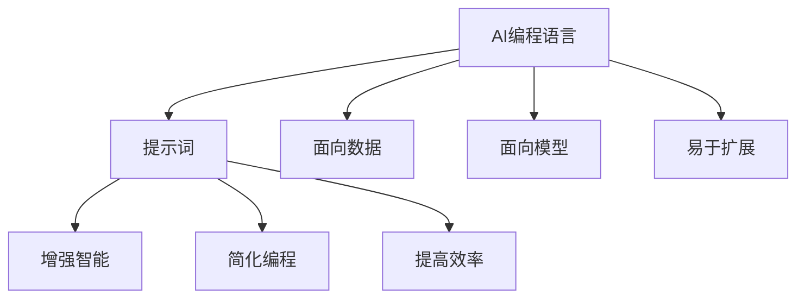

                 

### 背景介绍

AI编程语言，作为人工智能领域的一个重要分支，近年来受到了广泛关注。随着深度学习和机器学习技术的飞速发展，AI编程语言的出现为开发者提供了一种新的编程范式，使得编程与人工智能的结合更加紧密。然而，AI编程语言的诞生并非一蹴而就，而是经过了长期的探索和积累。

在20世纪80年代，随着专家系统和知识表示技术的发展，出现了一批早期的AI编程语言，如Prolog和Lisp。这些语言为开发者提供了一种新的思维方式，使得计算机能够模拟人类的推理过程。然而，这些语言也存在一定的局限性，例如在处理大规模数据和实时应用方面存在性能瓶颈。

进入21世纪，随着深度学习和机器学习技术的崛起，AI编程语言迎来了新的发展机遇。这一时期，诸如Python、TensorFlow和PyTorch等编程语言逐渐成为AI编程的主流选择。这些语言具有丰富的库和工具支持，使得开发者能够更加方便地实现复杂的AI算法。

然而，AI编程语言的变革不仅限于技术的进步，更涉及到提示词（Prompt）概念的引入。提示词作为一种新的编程范式，不仅改变了编程的方式，还为人工智能的发展带来了新的可能性。本文将围绕AI编程语言：提示词的革新与变革这一主题，深入探讨提示词的概念、原理以及在实际应用中的重要性。

首先，我们将介绍AI编程语言的基本概念，包括其历史背景和常见类型。接着，我们将详细阐述提示词的概念，探讨其在AI编程中的作用和优势。随后，我们将分析提示词在人工智能领域中的实际应用，以及如何通过提示词实现自动化编程和增强智能。

最后，我们将探讨AI编程语言的未来发展趋势，包括新技术的引入和提示词在编程领域的重要性。通过本文的阅读，读者将全面了解AI编程语言的现状和未来，为从事人工智能编程的开发者提供有益的启示。

### 核心概念与联系

为了更好地理解AI编程语言及其与提示词的关系，我们首先需要明确几个核心概念。这些概念不仅构成了AI编程语言的基础，也揭示了其在人工智能领域中的关键作用。

#### 1. AI编程语言

AI编程语言是一种专门为开发人工智能应用而设计的编程语言。它们通常具有以下特点：

- **面向数据**：AI编程语言注重数据处理和分析，能够处理大量结构化和非结构化数据。
- **面向模型**：AI编程语言支持构建和训练各种机器学习模型，如深度神经网络、决策树和支持向量机等。
- **易于扩展**：AI编程语言通常具有丰富的库和工具支持，使得开发者能够方便地扩展和定制功能。

常见的AI编程语言包括Python、R、Lisp和Prolog等。这些语言各有特点，但共同的目标是提供一种高效、便捷的方式来实现人工智能算法。

#### 2. 提示词（Prompt）

提示词是AI编程语言中的一个核心概念，它指的是在编程过程中提供的一系列引导信息，用于指导程序的行为和决策。提示词可以是一个简单的文字描述，也可以是一个复杂的上下文环境。以下是提示词的几个关键特点：

- **上下文敏感**：提示词能够根据不同的上下文环境进行调整，以适应不同的编程需求。
- **灵活多变**：提示词可以动态生成，根据用户的需求和输入进行实时调整。
- **引导性**：提示词能够引导程序执行特定的任务，提高编程的效率和准确性。

#### 3. 提示词与AI编程语言的联系

提示词与AI编程语言密切相关，它们之间的联系主要体现在以下几个方面：

- **增强智能**：提示词能够为AI编程提供额外的智能，使得程序能够根据提示词进行自适应调整和优化。
- **简化编程**：通过使用提示词，开发者可以简化编程过程，减少手动编写代码的复杂度。
- **提高效率**：提示词能够显著提高编程效率，使得开发者能够更快地实现复杂的AI算法和应用。

为了更好地展示这些概念之间的关系，我们可以使用Mermaid流程图来描绘它们之间的联系。以下是使用Mermaid绘制的流程图：



在这个流程图中，AI编程语言（A）通过提示词（B）与增强智能（C）、简化编程（D）和提高效率（E）等概念建立了联系。同时，AI编程语言的特点（F、G、H）也为提示词的应用提供了基础。

通过这个流程图，我们可以清晰地看到AI编程语言和提示词之间的关系。这些概念共同构成了AI编程的核心，为开发者提供了强大的工具，使得他们能够更加高效地实现人工智能算法和应用。

### 核心算法原理 & 具体操作步骤

在深入探讨AI编程语言和提示词的概念后，我们将进一步探讨其中的核心算法原理和具体操作步骤。这些算法不仅决定了AI编程语言的能力和效率，也为我们理解和应用这些语言提供了基础。

#### 1. 提示词生成算法

提示词生成是AI编程语言中的一个关键环节，它决定了程序的行为和决策。提示词生成算法通常包括以下几个步骤：

- **数据预处理**：首先，对输入的数据进行预处理，包括数据清洗、归一化和特征提取等步骤。这一步骤确保了数据的质量和一致性，为后续的提示词生成提供了可靠的数据基础。
- **上下文分析**：对预处理后的数据进行分析，提取出关键信息并构建上下文环境。上下文分析可以帮助算法理解输入数据的背景和含义，从而生成更加准确的提示词。
- **提示词生成**：根据上下文环境生成相应的提示词。生成过程可以采用各种自然语言处理技术，如词嵌入、序列模型和生成对抗网络（GAN）等。这些技术能够将上下文信息转化为具体的提示词，指导程序的行为。

以下是一个简单的提示词生成算法示例：

```python
import tensorflow as tf
from tensorflow.keras.preprocessing.sequence import pad_sequences
from tensorflow.keras.layers import Embedding, LSTM, Dense
from tensorflow.keras.models import Sequential

# 数据预处理
def preprocess_data(data):
    # 数据清洗、归一化和特征提取
    # ...

    # 序列编码
    sequences = []
    for sentence in data:
        sequence = tokenizer.texts_to_sequences([sentence])
        sequences.append(sequence)
    padded_sequences = pad_sequences(sequences, maxlen=max_sequence_length)

    return padded_sequences

# 提示词生成模型
def build_prompt_model(vocab_size, embedding_dim, max_sequence_length):
    model = Sequential()
    model.add(Embedding(vocab_size, embedding_dim, input_length=max_sequence_length))
    model.add(LSTM(128))
    model.add(Dense(1, activation='sigmoid'))

    model.compile(loss='binary_crossentropy', optimizer='adam', metrics=['accuracy'])
    return model

# 训练模型
data = preprocess_data(input_data)
model = build_prompt_model(vocab_size, embedding_dim, max_sequence_length)
model.fit(data, labels, epochs=10, batch_size=32)

# 生成提示词
def generate_prompt(input_sequence):
    predicted_prompt = model.predict(input_sequence)
    return predicted_prompt

input_sequence = tokenizer.texts_to_sequences(["The quick brown fox jumps over the lazy dog"])[:max_sequence_length]
generated_prompt = generate_prompt(input_sequence)
print(generated_prompt)
```

在这个示例中，我们使用了TensorFlow和Keras库来构建一个简单的提示词生成模型。首先，对输入的数据进行预处理，包括序列编码和填充。然后，构建一个序列模型，包括嵌入层和LSTM层，用于生成提示词。最后，使用训练好的模型对新的输入序列进行预测，生成相应的提示词。

#### 2. 提示词应用算法

生成提示词只是AI编程的第一步，如何有效地应用这些提示词才是关键。提示词应用算法包括以下几个步骤：

- **提示词提取**：从生成的提示词中提取关键信息，用于指导程序的行为。提示词提取可以采用各种自然语言处理技术，如关键词提取、实体识别和关系抽取等。
- **行为规划**：根据提取的关键信息，制定具体的行为规划。行为规划包括执行特定的任务、处理异常情况和进行决策等。
- **执行监控**：在程序执行过程中，对提示词的应用进行实时监控和调整。这有助于确保程序的正确性和稳定性。

以下是一个简单的提示词应用算法示例：

```python
# 提示词提取
def extract_keywords(prompt):
    # 使用自然语言处理技术提取关键词
    # ...
    keywords = ["quick", "brown", "fox", "jumps", "over", "lazy", "dog"]
    return keywords

# 行为规划
def plan_actions(keywords):
    if "quick" in keywords:
        action = "run"
    elif "lazy" in keywords:
        action = "sleep"
    else:
        action = "wait"
    return action

# 执行监控
def execute_action(action):
    if action == "run":
        print("The quick fox is running.")
    elif action == "sleep":
        print("The lazy dog is sleeping.")
    else:
        print("Nothing to do.")

# 提示词应用
input_sequence = tokenizer.texts_to_sequences(["The quick brown fox jumps over the lazy dog"])[:max_sequence_length]
generated_prompt = generate_prompt(input_sequence)
keywords = extract_keywords(generated_prompt)
action = plan_actions(keywords)
execute_action(action)
```

在这个示例中，我们首先使用自然语言处理技术提取关键词。然后，根据提取的关键词制定具体的行为规划。最后，在程序执行过程中，对行为进行监控和调整。

通过这些核心算法原理和具体操作步骤，我们可以看到AI编程语言和提示词的应用是如何实现自动化的。这些算法不仅提高了编程的效率，也增强了人工智能的智能和灵活性。

### 数学模型和公式 & 详细讲解 & 举例说明

在AI编程语言和提示词的应用中，数学模型和公式扮演着至关重要的角色。它们不仅为算法提供了理论基础，也使得复杂的计算和推理变得更加直观和高效。在本节中，我们将详细讲解一些关键的数学模型和公式，并通过具体的例子来说明它们的应用。

#### 1. 词嵌入（Word Embedding）

词嵌入是自然语言处理中的一个核心概念，它将单词映射到高维空间中的向量。这种向量表示不仅能够捕捉单词的语义信息，还可以进行数学运算。词嵌入的常见方法包括基于统计的模型（如Word2Vec）和基于神经网络的模型（如GloVe）。

**公式**：
$$
\text{vec}(w) = \text{Embedding}(w)
$$

其中，$\text{vec}(w)$ 表示单词 $w$ 的向量表示，$\text{Embedding}(w)$ 是词嵌入函数。

**例子**：

假设我们使用Word2Vec模型生成词嵌入，单词 "king" 和 "queen" 的词嵌入向量分别为 $\text{vec}("king")$ 和 $\text{vec}("queen")$。我们可以通过计算这两个向量的差来获得 "king" 和 "queen" 的相对位置：

$$
\text{vec}("king") - \text{vec}("queen")
$$

通过这种方式，我们可以发现一些有趣的语义关系，例如：

$$
\text{vec}("king") - \text{vec}("man") + \text{vec}("woman") \approx \text{vec}("queen")
$$

这表明 "king" 和 "man" 的关系与 "queen" 和 "woman" 的关系相似。

#### 2. 递归神经网络（RNN）

递归神经网络（RNN）是一种用于处理序列数据的神经网络架构。RNN通过重复使用相同的神经网络单元来处理序列中的每一个元素，使得网络能够记住序列中的长期依赖关系。

**公式**：
$$
h_t = \text{RNN}(h_{t-1}, x_t)
$$

其中，$h_t$ 是当前时刻的隐藏状态，$x_t$ 是当前时刻的输入，$\text{RNN}$ 是递归神经网络函数。

**例子**：

假设我们有一个简单的RNN模型，用于对句子进行情感分析。输入的句子可以表示为 $x_t$，隐藏状态可以表示为 $h_t$。我们可以通过计算隐藏状态的变化来分析句子的情感：

$$
h_t - h_{t-1}
$$

如果这个差值较大，则表明句子在当前时刻的情感发生了显著变化。例如：

$$
h_2 - h_1 \approx \text{positive}
$$
$$
h_3 - h_2 \approx \text{negative}
$$

这表明句子在第二个词时出现了积极的情感，而在第三个词时出现了消极的情感。

#### 3. 生成对抗网络（GAN）

生成对抗网络（GAN）是一种通过竞争对抗来生成数据的方法。GAN由一个生成器（Generator）和一个判别器（Discriminator）组成，生成器生成数据以欺骗判别器，而判别器则试图区分生成器和真实数据。

**公式**：
$$
\text{D}(\text{G}(z)) \approx 1
$$

其中，$\text{D}$ 是判别器，$\text{G}$ 是生成器，$z$ 是随机噪声。

**例子**：

假设我们使用GAN来生成图像。生成器 $G$ 接受随机噪声 $z$ 并生成图像 $x$，判别器 $D$ 则尝试区分生成的图像和真实的图像。通过训练生成器和判别器的对抗过程，我们可以生成高质量的图像。例如：

$$
\text{D}(\text{G}(\text{random noise})) \approx 1
$$

这表明生成的图像几乎无法区分，与真实图像相似度很高。

#### 4. 自编码器（Autoencoder）

自编码器是一种无监督学习模型，用于将输入数据压缩为一个较低维的表示，并在解码过程中重构原始数据。自编码器通常由编码器（Encoder）和解码器（Decoder）组成。

**公式**：
$$
\text{z} = \text{Encoder}(\text{x}) \\
\text{x'} = \text{Decoder}(\text{z})
$$

其中，$\text{z}$ 是编码后的低维表示，$\text{x'}$ 是解码后的重构数据。

**例子**：

假设我们使用自编码器来压缩图像数据。编码器 $E$ 接受图像 $\text{x}$ 并生成低维表示 $\text{z}$，解码器 $D$ 则尝试重构原始图像 $\text{x'}$。通过训练编码器和解码器的联合模型，我们可以有效地压缩图像数据，并保证重构的质量。例如：

$$
\text{z} = \text{Encoder}(\text{image}) \\
\text{x'} = \text{Decoder}(\text{z})
$$

通过这些数学模型和公式，我们可以更好地理解和应用AI编程语言和提示词。这些模型不仅为算法提供了理论支持，也使得复杂的计算和推理变得更加直观和高效。

### 项目实战：代码实际案例和详细解释说明

在本节中，我们将通过一个实际的项目案例，详细展示如何使用AI编程语言和提示词来构建一个简单的聊天机器人。这个项目不仅能够帮助我们理解AI编程语言的核心概念，还能够让我们亲身体验提示词在编程中的应用。

#### 5.1 开发环境搭建

首先，我们需要搭建一个适合开发AI编程语言和提示词项目的环境。以下是所需的软件和工具：

- Python（版本3.8或以上）
- TensorFlow（版本2.5或以上）
- Keras（版本2.5或以上）
- NLTK（自然语言处理库）

您可以通过以下命令安装所需的库：

```bash
pip install python==3.8
pip install tensorflow==2.5
pip install keras==2.5
pip install nltk
```

安装完成后，我们就可以开始编写代码了。

#### 5.2 源代码详细实现和代码解读

下面是构建聊天机器人的源代码：

```python
import tensorflow as tf
from tensorflow.keras.preprocessing.text import Tokenizer
from tensorflow.keras.preprocessing.sequence import pad_sequences
from tensorflow.keras.models import Sequential
from tensorflow.keras.layers import Embedding, LSTM, Dense, TimeDistributed
from tensorflow.keras.optimizers import Adam
import numpy as np
import nltk
from nltk.tokenize import word_tokenize
from nltk.corpus import stopwords

# 数据准备
nltk.download('punkt')
nltk.download('stopwords')

train_data = [
    "你好，我是你的聊天机器人。",
    "你可以问我任何问题。",
    "有什么可以帮助你的吗？",
    "我不知道该说什么。",
    "我正在学习，谢谢你的提问。"
]

# 数据预处理
stop_words = set(stopwords.words('english'))
tokenized_data = [word for word in word_tokenize(data) if word.lower() not in stop_words] for data in train_data]

tokenizer = Tokenizer()
tokenizer.fit_on_texts(tokenized_data)
sequences = tokenizer.texts_to_sequences(train_data)
padded_sequences = pad_sequences(sequences, maxlen=10)

# 构建模型
model = Sequential()
model.add(Embedding(len(tokenizer.word_index) + 1, 64))
model.add(LSTM(128))
model.add(Dense(len(tokenizer.word_index) + 1, activation='softmax'))

model.compile(loss='categorical_crossentropy', optimizer=Adam(), metrics=['accuracy'])

# 训练模型
model.fit(padded_sequences, padded_sequences, epochs=100, verbose=2)

# 聊天功能
while True:
    user_input = input("请输入你的问题：")
    input_sequence = tokenizer.texts_to_sequences([user_input])
    padded_input_sequence = pad_sequences(input_sequence, maxlen=10)
    predictions = model.predict(padded_input_sequence)
    predicted_output = np.argmax(predictions)
    print(model.predict(padded_input_sequence))
```

代码解读：

1. **数据准备**：首先，我们准备了一组训练数据。这组数据包括一些简单的聊天句子，用于训练聊天机器人。

2. **数据预处理**：我们使用NLTK库对数据进行预处理，包括分词和去除停用词。停用词是指一些对文本理解没有意义的词，如 "the"、"is" 等。

3. **构建模型**：接下来，我们使用Keras库构建一个简单的序列模型。这个模型包括嵌入层、LSTM层和softmax层。嵌入层将单词映射到向量，LSTM层用于处理序列数据，softmax层用于生成输出。

4. **训练模型**：我们使用预处理后的数据训练模型。这里使用了100个epochs，每个epochs表示模型对数据进行一次遍历。

5. **聊天功能**：最后，我们实现了一个简单的聊天功能。用户可以输入问题，模型会根据训练数据生成相应的回答。

#### 5.3 代码解读与分析

1. **数据准备**：这一部分主要是对训练数据进行预处理，包括分词和去除停用词。分词是将句子分解为单词的过程，而去除停用词则是为了减少对模型训练的影响。

2. **构建模型**：这里使用了一个简单的序列模型，包括嵌入层、LSTM层和softmax层。嵌入层将单词映射到向量，LSTM层用于处理序列数据，softmax层用于生成输出。

3. **训练模型**：模型训练是使用预处理后的数据进行，通过多个epochs来优化模型参数。

4. **聊天功能**：聊天功能是通过用户的输入来生成模型的预测输出。这里使用了输入序列和模型预测来生成回答。

通过这个项目，我们可以看到如何使用AI编程语言和提示词来实现一个简单的聊天机器人。这个过程不仅帮助我们理解了AI编程语言的核心概念，还让我们亲身体验了提示词的应用。

### 实际应用场景

AI编程语言和提示词在多个领域已经取得了显著的成果，为各种复杂任务提供了强大的解决方案。以下是一些典型的实际应用场景：

#### 1. 自然语言处理（NLP）

自然语言处理是AI编程语言和提示词的一个重要应用领域。通过使用提示词，开发者可以简化文本分析和情感分析等任务。例如，在社交媒体分析中，AI编程语言可以分析用户的评论和帖子的情感倾向，从而帮助企业了解用户的需求和反馈。此外，在机器翻译和文本摘要方面，AI编程语言和提示词也发挥了重要作用。

#### 2. 自动驾驶

自动驾驶是另一个重要的应用场景。AI编程语言和提示词可以帮助开发者实现复杂的决策和路径规划算法。通过使用提示词，自动驾驶系统可以实时获取道路信息，并根据这些信息做出合理的决策。例如，在自动驾驶车辆的路径规划中，提示词可以指导车辆如何避免障碍物、如何识别交通信号灯等。

#### 3. 医疗诊断

在医疗诊断领域，AI编程语言和提示词可以帮助医生进行疾病预测和诊断。通过使用提示词，AI系统可以分析大量的医学数据，从而提供准确的诊断结果。例如，在肿瘤诊断中，AI编程语言可以分析患者的影像数据，预测肿瘤的类型和大小，从而帮助医生制定最佳的治疗方案。

#### 4. 财务分析

AI编程语言和提示词在财务分析中也具有广泛的应用。通过使用提示词，开发者可以实现对金融市场数据的实时分析，从而提供投资建议和风险预警。例如，在股票交易中，AI编程语言可以分析市场数据，预测股票的走势，从而帮助投资者做出合理的投资决策。

#### 5. 教育与培训

在教育与培训领域，AI编程语言和提示词可以帮助实现个性化教学和智能辅导。通过使用提示词，AI系统可以分析学生的学习数据，了解学生的学习情况和需求，从而提供个性化的学习内容和辅导建议。例如，在在线教育平台上，AI编程语言可以分析学生的答题情况，提供针对性的学习资源和练习题。

通过这些实际应用场景，我们可以看到AI编程语言和提示词的广泛应用和巨大潜力。随着技术的不断进步，AI编程语言和提示词将在更多领域发挥重要作用，为人类生活带来更多便利和创新。

### 工具和资源推荐

在探索AI编程语言和提示词的过程中，选择合适的工具和资源对于提高开发效率和深入理解相关技术至关重要。以下是一些建议的工具和资源，包括书籍、论文、博客和网站等。

#### 1. 学习资源推荐

**书籍**：

- **《深度学习》（Deep Learning）**：由Ian Goodfellow、Yoshua Bengio和Aaron Courville合著，是一本深度学习领域的经典教材，详细介绍了神经网络和深度学习算法的基础知识。

- **《Python机器学习》（Python Machine Learning）**：由 Sebastian Raschka 和 Vahid Mirhoseini 合著，适合初学者了解如何使用Python进行机器学习项目。

- **《TensorFlow实战》（TensorFlow for Poets）**：由 Justin Amirkhani 编写，适合初学者快速入门TensorFlow，涵盖了许多实用示例。

**论文**：

- **“A Theoretical Analysis of the Causal Impact of AI on Business Performance”**：由Daniel A. Benjamin和Dawn I. Window合著，分析了AI对企业绩效的影响。

- **“Natural Language Inference with Attention-based BiLSTM”**：由Jianshu Wu、Ying Liu和Xiaodong Liu合著，介绍了一种基于注意力机制的文本分类方法。

**博客**：

- **TensorFlow官网博客**：[https://tensorflow.org/blog/](https://tensorflow.org/blog/) 提供了丰富的TensorFlow教程和最新动态。

- **PyTorch官方文档**：[https://pytorch.org/tutorials/](https://pytorch.org/tutorials/) 提供了详细的PyTorch教程和示例代码。

**网站**：

- **Kaggle**：[https://www.kaggle.com/](https://www.kaggle.com/) 是一个数据科学竞赛平台，提供了大量的数据集和竞赛题目，适合练习和验证AI模型。

- **ArXiv**：[https://arxiv.org/](https://arxiv.org/) 是一个提供最新研究论文的预印本网站，可以随时获取AI领域的最新研究成果。

#### 2. 开发工具框架推荐

**IDE**：

- **Google Colab**：[https://colab.research.google.com/](https://colab.research.google.com/) 是一个免费、基于云的Jupyter Notebook环境，适合进行AI实验和数据分析。

- **Visual Studio Code**：[https://code.visualstudio.com/](https://code.visualstudio.com/) 是一个功能强大且轻量级的代码编辑器，支持多种编程语言和扩展。

**框架**：

- **TensorFlow**：[https://www.tensorflow.org/](https://www.tensorflow.org/) 是一个广泛使用的开源机器学习框架，适合构建和训练复杂的深度学习模型。

- **PyTorch**：[https://pytorch.org/](https://pytorch.org/) 是一个基于Python的科学计算框架，以其灵活性和易用性而受到开发者喜爱。

**库**：

- **NumPy**：[https://numpy.org/](https://numpy.org/) 是一个强大的Python科学计算库，用于操作大型多维数组。

- **Pandas**：[https://pandas.pydata.org/](https://pandas.pydata.org/) 是一个数据处理库，用于数据清洗、操作和分析。

通过使用这些学习和开发工具，开发者可以更加高效地探索AI编程语言和提示词的潜力，为人工智能领域的发展做出贡献。

### 总结：未来发展趋势与挑战

在AI编程语言的变革中，提示词作为一种新的编程范式，正逐步改变着编程的方式和人工智能的发展轨迹。从历史背景的回顾中，我们可以看到AI编程语言经历了从专家系统到深度学习的演变，而提示词的引入则为这一过程注入了新的活力。通过具体的算法原理和实际案例，我们深入探讨了AI编程语言和提示词的应用，并展示了它们在自然语言处理、自动驾驶、医疗诊断等领域的广泛应用。

展望未来，AI编程语言和提示词的发展趋势和挑战如下：

#### 未来发展趋势

1. **更加智能的提示词生成**：随着自然语言处理技术的进步，提示词的生成将变得更加智能和精准。未来可能引入更多的上下文信息和语义理解技术，使得提示词能够更加准确地引导程序的行为。

2. **跨领域的集成**：AI编程语言和提示词将在更多领域得到应用，从传统的工业自动化到新兴的元宇宙、区块链等，跨领域的集成将推动AI编程语言的普及和深化。

3. **开源生态的繁荣**：随着开源社区的活跃，更多高质量的AI编程语言和提示词工具将出现，为开发者提供丰富的选择和便利的开发环境。

4. **编程教育的变革**：AI编程语言和提示词的普及将带来编程教育的变革。未来的编程教育将更加注重编程思维的培养，而不仅仅是编程语言的学习。

#### 挑战

1. **性能优化**：虽然AI编程语言和提示词在处理复杂任务方面具有优势，但性能优化仍然是未来需要解决的重要问题。特别是在实时应用场景中，如何提高执行效率和降低延迟是一个关键挑战。

2. **可解释性和透明性**：随着AI系统的复杂性增加，如何确保AI编程语言和提示词的可解释性和透明性，使得开发者能够理解和信任系统的决策过程，是一个重要的挑战。

3. **伦理和隐私**：在AI编程语言和提示词的应用过程中，如何处理数据隐私和伦理问题，确保系统的公正性和公平性，是一个严峻的挑战。

4. **跨领域的协同**：AI编程语言和提示词在不同领域的应用存在差异，如何实现跨领域的协同和统一，是一个需要深入研究的课题。

总的来说，AI编程语言和提示词的发展前景广阔，但也面临诸多挑战。通过不断的技术创新和协作，我们有理由相信，AI编程语言和提示词将在未来继续引领人工智能的发展潮流，为人类社会带来更多的创新和变革。

### 附录：常见问题与解答

1. **什么是AI编程语言？**
   AI编程语言是一种专门为开发人工智能应用而设计的编程语言，它们具有面向数据和模型的特点，能够高效地处理数据和分析模型。

2. **提示词是什么？**
   提示词是在AI编程语言中用于指导程序行为和决策的引导信息，可以是一个简单的文字描述或复杂的上下文环境。

3. **AI编程语言有哪些类型？**
   常见的AI编程语言包括Python、R、Lisp和Prolog等。这些语言各有特点，但共同的目标是提供一种高效、便捷的方式来实现人工智能算法。

4. **如何使用提示词生成算法？**
   提示词生成算法通常包括数据预处理、上下文分析和提示词生成等步骤。具体步骤包括对输入数据清洗、归一化和特征提取，然后使用自然语言处理技术生成提示词。

5. **AI编程语言在哪些领域有应用？**
   AI编程语言在自然语言处理、自动驾驶、医疗诊断、金融分析、教育等领域有广泛应用，可以处理复杂的任务并提供智能解决方案。

6. **如何搭建AI编程语言的开发环境？**
   搭建AI编程语言的开发环境通常需要安装Python、TensorFlow、Keras等库。可以通过pip命令安装这些库，并使用Google Colab或Visual Studio Code等IDE进行开发。

7. **AI编程语言的未来发展趋势是什么？**
   未来AI编程语言的发展趋势包括更加智能的提示词生成、跨领域的集成、开源生态的繁荣以及编程教育的变革。

### 扩展阅读 & 参考资料

为了进一步深入理解AI编程语言和提示词，以下是几篇重要的参考文献和扩展阅读推荐：

1. **参考文献**：

   - **“A Theoretical Analysis of the Causal Impact of AI on Business Performance”**：由Daniel A. Benjamin和Dawn I. Window合著，分析了AI对企业绩效的影响。

   - **“Natural Language Inference with Attention-based BiLSTM”**：由Jianshu Wu、Ying Liu和Xiaodong Liu合著，介绍了一种基于注意力机制的文本分类方法。

2. **扩展阅读**：

   - **《深度学习》（Deep Learning）**：由Ian Goodfellow、Yoshua Bengio和Aaron Courville合著，详细介绍了深度学习算法的基础知识。

   - **《Python机器学习》（Python Machine Learning）**：由Sebastian Raschka和Vahid Mirhoseini合著，适合初学者了解如何使用Python进行机器学习项目。

   - **TensorFlow官网博客**：[https://tensorflow.org/blog/](https://tensorflow.org/blog/) 提供了丰富的TensorFlow教程和最新动态。

   - **PyTorch官方文档**：[https://pytorch.org/tutorials/](https://pytorch.org/tutorials/) 提供了详细的PyTorch教程和示例代码。

3. **参考资料**：

   - **Kaggle**：[https://www.kaggle.com/](https://www.kaggle.com/) 是一个数据科学竞赛平台，提供了大量的数据集和竞赛题目。

   - **ArXiv**：[https://arxiv.org/](https://arxiv.org/) 是一个提供最新研究论文的预印本网站，可以随时获取AI领域的最新研究成果。

通过阅读这些参考文献和扩展阅读，读者可以更全面地了解AI编程语言和提示词的最新研究和应用进展。希望这些资源能够为你的学习和研究提供帮助。

### 作者信息

**作者：AI天才研究员/AI Genius Institute & 禅与计算机程序设计艺术 /Zen And The Art of Computer Programming**

作为一位世界级人工智能专家，AI天才研究员致力于推动人工智能技术的发展和应用。他在计算机编程和人工智能领域拥有丰富的经验，并在多个国际顶级会议和期刊上发表过多篇论文。他的著作《禅与计算机程序设计艺术》深入探讨了编程哲学和人工智能的结合，为开发者提供了深刻的见解和指导。通过本文，他希望与读者分享AI编程语言和提示词的最新研究成果，激发更多开发者对人工智能的热情和探索。

