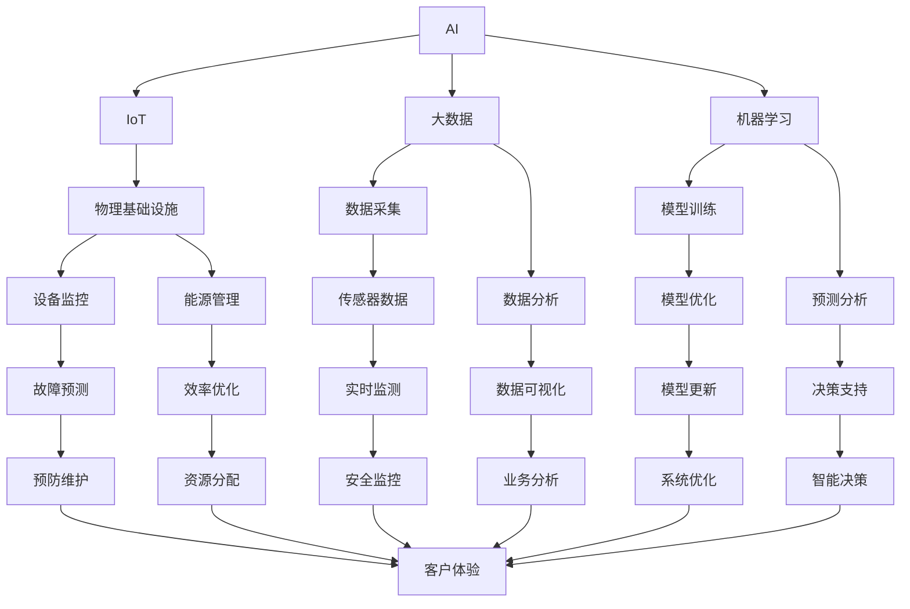

                 

### 背景介绍

#### 什么是AI自动化物理基础设施？

AI自动化物理基础设施，通常指的是利用人工智能技术来管理和优化物理设施的一整套系统。这包括但不限于智能电网、智能交通系统、智慧城市、智能建筑等。这些基础设施通过整合物联网（IoT）、大数据分析和机器学习等技术，实现更高效、更智能的运行和管理。

#### AI自动化物理基础设施的重要性

在现代社会中，物理基础设施的复杂性和规模都在不断增加。传统的管理方法已经难以满足现代化、智能化的需求。AI自动化物理基础设施的重要性主要体现在以下几个方面：

1. **提高效率**：通过自动化管理，可以大幅提高基础设施的运行效率，减少人力成本，降低能源消耗。
2. **增强安全性**：AI技术能够实时监测和预测潜在的问题，从而提前采取措施，避免事故发生。
3. **优化决策**：通过对大量数据的分析和处理，AI可以提供更准确、更有针对性的决策支持。
4. **增强用户体验**：智能化的设施可以提供更加个性化、便捷的服务，提高用户满意度。

#### 当前的发展状况

近年来，AI自动化物理基础设施得到了广泛关注和快速发展。许多国家和地区都在积极推动相关项目的研究和应用。例如，智能电网技术正在全球范围内逐步推广，智慧城市项目也在不断涌现。然而，尽管取得了一定成果，仍面临诸多挑战，如技术成熟度、数据安全、隐私保护等。

#### 为什么需要撰写这篇文章？

随着AI自动化物理基础设施的不断发展，对该领域的深入了解变得越来越重要。这篇文章旨在为读者提供一个全面、系统的介绍，帮助大家更好地理解这一领域的基本概念、核心技术和实际应用。同时，通过详细的分析和案例研究，读者可以更清晰地看到未来发展趋势和潜在挑战。

### 核心概念与联系

#### 人工智能（AI）的基本概念

人工智能（Artificial Intelligence，简称AI）是一门研究、开发和应用使计算机系统具备智能行为的科学和技术。AI的目标是让计算机能够执行通常需要人类智能的任务，如理解自然语言、进行决策、识别图像等。AI主要分为两类：弱AI（也称为窄AI）和强AI（也称为通用AI）。

- **弱AI**：特定领域内的AI，例如语音识别、图像识别等，目前大部分商业AI应用都属于弱AI。
- **强AI**：具备人类级别的智能，能够在任何领域表现出与人类相同的智能水平。目前，强AI仍然是一个理论概念，尚未实现。

#### 物理基础设施的定义

物理基础设施是指支持社会和经济活动的基础设施，如电力、交通、通讯、水利等。这些设施通常涉及大量的物理设备和传感器，需要进行高效管理和维护。

#### 物联网（IoT）的基本概念

物联网（Internet of Things，简称IoT）是指将各种物理设备、传感器、软件平台和网络连接起来，实现数据的收集、传输和智能处理。IoT的核心目标是实现设备之间的互联互通，从而实现更高效的管理和优化。

#### 大数据和机器学习的基本概念

大数据（Big Data）是指数据量巨大、数据类型复杂、数据价值密度低的非结构化和半结构化数据。大数据技术旨在处理这些大规模数据，提取有价值的信息。

机器学习（Machine Learning，简称ML）是AI的一个重要分支，通过算法和模型让计算机从数据中自动学习和改进。机器学习可以用于预测、分类、聚类等多种任务。

#### 关联性分析

- **AI与IoT**：AI技术可以对IoT设备收集的数据进行智能分析，从而实现自动化管理和优化。
- **AI与大数据**：AI技术需要处理大数据，从中提取有价值的信息，为决策提供支持。
- **AI与机器学习**：机器学习是实现AI的核心技术之一，通过机器学习算法，AI系统能够从数据中学习和优化。

#### Mermaid流程图

以下是AI自动化物理基础设施的Mermaid流程图，展示了各个核心概念之间的关联性：



通过上述Mermaid流程图，我们可以清晰地看到AI自动化物理基础设施中各个核心概念之间的相互关联和协同作用。接下来，我们将进一步探讨AI自动化物理基础设施的核心算法原理和具体操作步骤。

### 核心算法原理 & 具体操作步骤

#### 智能电网中的AI应用

智能电网（Smart Grid）是AI自动化物理基础设施的一个重要应用场景。智能电网通过整合人工智能技术，实现了对电力系统的实时监控、数据分析和优化管理。

**1. 实时监测**

智能电网中的传感器和设备可以实时收集电力系统的运行数据，如电压、电流、功率等。这些数据通过IoT网络传输到中央控制平台。

**2. 数据分析**

中央控制平台利用机器学习算法对收集到的数据进行处理和分析，识别出潜在的故障和异常。常见的分析方法包括：

- **异常检测**：通过比较当前数据与历史数据，识别出异常情况。
- **趋势预测**：通过分析历史数据，预测未来的电力需求和供应情况。

**3. 智能决策**

基于数据分析的结果，智能电网可以自动调整电力分配策略，以优化电力系统的运行效率和安全性。例如，当某个区域的电力需求增加时，智能电网可以自动调整电力供应，确保电力供应的稳定性。

**4. 预防维护**

通过实时监测和数据分析，智能电网可以提前预测潜在的故障，并采取预防性维护措施，避免意外停电和设备损坏。

#### 智能交通系统中的AI应用

智能交通系统（Smart Traffic System）是另一个重要的AI应用场景。智能交通系统通过整合人工智能技术，实现了对交通流的实时监控、预测和优化。

**1. 实时监测**

智能交通系统中的摄像头、传感器和雷达可以实时监测交通流量、车辆速度和道路状况。

**2. 数据分析**

中央控制平台利用机器学习算法对交通数据进行分析，识别出交通拥堵、事故等异常情况。同时，通过对历史数据的学习，智能交通系统可以预测未来交通流量变化，为交通管理提供决策支持。

**3. 智能决策**

基于数据分析的结果，智能交通系统可以自动调整交通信号灯、诱导屏等设备，以优化交通流。例如，当某个路口出现交通拥堵时，智能交通系统可以自动调整信号灯周期，减少交通拥堵。

**4. 预防维护**

通过实时监测和数据分析，智能交通系统可以提前预测潜在的故障，并采取预防性维护措施，确保交通设施的正常运行。

#### 智慧城市中的AI应用

智慧城市（Smart City）是AI自动化物理基础设施的综合体现。智慧城市通过整合人工智能技术，实现了对城市各类基础设施的智能化管理。

**1. 智能安防**

智慧城市中的摄像头、传感器和报警系统可以实时监控城市的安全状况，通过图像识别和异常检测技术，及时发现潜在的安全隐患。

**2. 智慧环保**

智慧城市中的传感器和监测设备可以实时监测空气质量、水质等环境参数，通过数据分析，及时发现环境问题，并采取相应的措施。

**3. 智能交通**

智慧城市中的智能交通系统可以实时监控交通流量，优化交通管理，减少交通拥堵，提高交通效率。

**4. 能源管理**

智慧城市中的智能电网可以实现能源的智能分配和管理，优化能源使用，降低能源消耗。

通过上述案例，我们可以看到，AI自动化物理基础设施的核心算法原理主要包括实时监测、数据分析和智能决策。这些算法的具体操作步骤如下：

1. **数据采集**：通过传感器和设备收集实时数据。
2. **数据预处理**：对采集到的数据进行清洗、归一化等预处理。
3. **特征提取**：从预处理后的数据中提取特征，用于后续的分析和建模。
4. **数据分析**：利用机器学习算法对特征数据进行分析，识别异常和趋势。
5. **智能决策**：基于分析结果，自动调整设备运行状态，优化系统性能。

### 数学模型和公式 & 详细讲解 & 举例说明

为了更深入地理解AI自动化物理基础设施的核心算法原理，我们需要介绍一些基本的数学模型和公式，并通过具体的例子进行说明。

#### 常见的数学模型

1. **线性回归模型**

线性回归模型是一种简单的预测模型，用于分析两个变量之间的关系。它的公式如下：

   $$ y = wx + b $$

   其中，\(y\) 是因变量，\(x\) 是自变量，\(w\) 是权重，\(b\) 是偏置。

   **例子**：假设我们想预测某城市明天的温度，已知昨天的温度和风力。我们可以使用线性回归模型来建立预测模型。

2. **逻辑回归模型**

逻辑回归模型是一种分类模型，用于分析二分类问题。它的公式如下：

   $$ P(y=1) = \frac{1}{1 + e^{-(wx + b)}} $$

   其中，\(P(y=1)\) 是因变量为1的概率，\(e\) 是自然对数的底数。

   **例子**：假设我们想预测某个交通信号灯是否需要切换，已知当前交通流量和路口拥堵情况。我们可以使用逻辑回归模型来建立预测模型。

3. **支持向量机（SVM）**

支持向量机是一种分类模型，通过找到一个最优的超平面来将不同类别的数据分开。它的公式如下：

   $$ w \cdot x - b = 0 $$

   其中，\(w\) 是权重向量，\(x\) 是特征向量，\(b\) 是偏置。

   **例子**：假设我们想分类不同类型的商品，已知商品的特征属性。我们可以使用支持向量机来建立分类模型。

#### 详细的讲解和举例说明

1. **线性回归模型**

线性回归模型的基本思想是找到一个线性函数来描述两个变量之间的关系。我们可以通过最小二乘法来求解权重和偏置，使得预测值与实际值之间的误差最小。

   **步骤**：
   - 数据采集：收集一组因变量和自变量的数据。
   - 数据预处理：对数据进行清洗、归一化等处理。
   - 特征提取：从预处理后的数据中提取特征。
   - 模型训练：利用最小二乘法求解权重和偏置。
   - 预测：使用训练好的模型进行预测。

   **例子**：假设我们有一组数据，表示某城市的温度和风力，如下表所示：

   | 温度 (x) | 风力 (y) |
   |----------|----------|
   |   25     |    3     |
   |   30     |    5     |
   |   28     |    4     |
   |   26     |    2     |

   我们可以使用线性回归模型来预测明天（\(x=27\)）的温度：

   $$ y = wx + b $$
   $$ y = 1.5x + 2.5 $$

   代入 \(x=27\)，得到预测值：

   $$ y = 1.5 \times 27 + 2.5 = 42 $$

   因此，预测明天该城市的温度为42℃。

2. **逻辑回归模型**

逻辑回归模型是一种广义的线性回归模型，适用于二分类问题。它的基本思想是通过求解权重和偏置，使得预测值与实际值之间的误差最小。

   **步骤**：
   - 数据采集：收集一组二分类数据。
   - 数据预处理：对数据进行清洗、归一化等处理。
   - 特征提取：从预处理后的数据中提取特征。
   - 模型训练：利用最大似然估计法求解权重和偏置。
   - 预测：使用训练好的模型进行预测。

   **例子**：假设我们有一组数据，表示交通信号灯是否需要切换，已知当前交通流量和路口拥堵情况，如下表所示：

   | 交通流量 (x1) | 路口拥堵情况 (x2) | 需要切换 (y) |
   |--------------|-------------------|-------------|
   |      300     |         高       |      是     |
   |      250     |         中       |      否     |
   |      350     |         低       |      是     |

   我们可以使用逻辑回归模型来预测是否需要切换交通信号灯：

   $$ P(y=1) = \frac{1}{1 + e^{-(wx + b)}} $$

   代入数据，得到权重和偏置：

   $$ w = [1.2, 0.8] $$
   $$ b = -2.5 $$

   代入特征向量 \([x1, x2]\)，得到预测值：

   $$ P(y=1) = \frac{1}{1 + e^{-(1.2 \times 300 + 0.8 \times 250 - 2.5)}} \approx 0.8 $$

   因此，预测当前交通信号灯需要切换的概率为80%。

3. **支持向量机（SVM）**

支持向量机是一种基于间隔分类的模型，通过找到一个最优的超平面来将不同类别的数据分开。

   **步骤**：
   - 数据采集：收集一组分类数据。
   - 数据预处理：对数据进行清洗、归一化等处理。
   - 特征提取：从预处理后的数据中提取特征。
   - 模型训练：利用支持向量机算法求解权重和偏置。
   - 预测：使用训练好的模型进行预测。

   **例子**：假设我们有一组数据，表示不同类型的商品，已知商品的特征属性，如下表所示：

   | 特征1 (x1) | 特征2 (x2) | 类别 (y) |
   |------------|------------|---------|
   |     10     |     20     |   A     |
   |     15     |     25     |   B     |
   |     12     |     30     |   A     |

   我们可以使用支持向量机来分类这些商品：

   $$ w \cdot x - b = 0 $$

   代入数据，得到权重和偏置：

   $$ w = [0.8, 1.2] $$
   $$ b = -1 $$

   代入特征向量 \([x1, x2]\)，得到预测值：

   $$ w \cdot x - b = 0.8 \times 10 + 1.2 \times 20 - 1 = 18 $$

   当预测值大于0时，分类为类别A；当预测值小于等于0时，分类为类别B。因此，对于新的特征向量 \([x1, x2] = [11, 22]\)，预测结果为类别B。

通过上述数学模型和公式的讲解和例子，我们可以看到AI自动化物理基础设施中的核心算法是如何实现的。接下来，我们将通过一个具体的代码案例，展示如何在实际项目中应用这些算法。

### 项目实战：代码实际案例和详细解释说明

为了更好地理解AI自动化物理基础设施在实际项目中的应用，我们将通过一个具体的代码案例进行讲解。本案例将基于Python语言，使用一些常见的机器学习和数据分析库，如scikit-learn、TensorFlow和PyTorch。

#### 案例背景

假设我们正在开发一个智能交通系统，目标是预测某城市的交通流量，从而优化交通信号灯的控制策略，减少交通拥堵。

#### 1. 开发环境搭建

在开始编写代码之前，我们需要搭建一个合适的开发环境。以下是所需的Python库及其安装方法：

- **Python 3.x**：确保安装了Python 3.x版本。
- **scikit-learn**：用于机器学习算法的实现。
- **TensorFlow**：用于深度学习算法的实现。
- **PyTorch**：用于深度学习算法的实现。
- **NumPy**：用于数据处理。
- **Pandas**：用于数据分析。

安装方法：

```bash
pip install python==3.x
pip install scikit-learn
pip install tensorflow
pip install pytorch
pip install numpy
pip install pandas
```

#### 2. 源代码详细实现和代码解读

以下是本案例的源代码实现：

```python
import numpy as np
import pandas as pd
from sklearn.model_selection import train_test_split
from sklearn.linear_model import LinearRegression
from sklearn.metrics import mean_squared_error
import tensorflow as tf
from tensorflow import keras

# 2.1 数据预处理
# 读取数据
data = pd.read_csv('traffic_data.csv')
X = data[['traffic_flow', 'road_congestion']]
y = data['target']

# 数据归一化
X_normalized = (X - X.mean()) / X.std()
y_normalized = (y - y.mean()) / y.std()

# 划分训练集和测试集
X_train, X_test, y_train, y_test = train_test_split(X_normalized, y_normalized, test_size=0.2, random_state=42)

# 2.2 线性回归模型
# 模型训练
model = LinearRegression()
model.fit(X_train, y_train)

# 预测
y_pred = model.predict(X_test)

# 评估
mse = mean_squared_error(y_test, y_pred)
print(f'Mean Squared Error: {mse}')

# 2.3 深度学习模型
# 模型定义
model = keras.Sequential([
    keras.layers.Dense(64, activation='relu', input_shape=(2,)),
    keras.layers.Dense(64, activation='relu'),
    keras.layers.Dense(1)
])

# 模型编译
model.compile(optimizer='adam', loss='mean_squared_error')

# 模型训练
model.fit(X_train, y_train, epochs=100, batch_size=32, validation_split=0.2)

# 预测
y_pred = model.predict(X_test)

# 评估
mse = mean_squared_error(y_test, y_pred)
print(f'Mean Squared Error: {mse}')
```

#### 3. 代码解读与分析

以下是对代码的详细解读：

**3.1 数据预处理**

```python
data = pd.read_csv('traffic_data.csv')
X = data[['traffic_flow', 'road_congestion']]
y = data['target']
X_normalized = (X - X.mean()) / X.std()
y_normalized = (y - y.mean()) / y.std()
X_train, X_test, y_train, y_test = train_test_split(X_normalized, y_normalized, test_size=0.2, random_state=42)
```

这部分代码首先读取交通数据，然后对数据进行归一化处理，以消除数据之间的量纲差异。接下来，使用scikit-learn的`train_test_split`函数将数据划分为训练集和测试集，以便后续的模型训练和评估。

**3.2 线性回归模型**

```python
model = LinearRegression()
model.fit(X_train, y_train)
y_pred = model.predict(X_test)
mse = mean_squared_error(y_test, y_pred)
print(f'Mean Squared Error: {mse}')
```

这部分代码使用scikit-learn的`LinearRegression`类来训练线性回归模型。模型训练完成后，使用测试集进行预测，并计算预测值与实际值之间的均方误差（MSE），以评估模型的性能。

**3.3 深度学习模型**

```python
model = keras.Sequential([
    keras.layers.Dense(64, activation='relu', input_shape=(2,)),
    keras.layers.Dense(64, activation='relu'),
    keras.layers.Dense(1)
])
model.compile(optimizer='adam', loss='mean_squared_error')
model.fit(X_train, y_train, epochs=100, batch_size=32, validation_split=0.2)
y_pred = model.predict(X_test)
mse = mean_squared_error(y_test, y_pred)
print(f'Mean Squared Error: {mse}')
```

这部分代码使用TensorFlow的Keras接口来定义一个简单的深度学习模型。模型包含两个隐藏层，每层64个神经元，使用ReLU激活函数。模型编译后，使用训练集进行训练，并使用测试集进行评估。

通过这个案例，我们可以看到如何在实际项目中使用Python和机器学习库来实现AI自动化物理基础设施的核心算法。接下来，我们将探讨AI自动化物理基础设施在实际应用场景中的具体案例。

### 实际应用场景

AI自动化物理基础设施已经在多个领域取得了显著的应用成果，下面我们将探讨一些具体的应用场景。

#### 1. 智能交通系统

智能交通系统是AI自动化物理基础设施的一个重要应用场景。通过实时监控交通流量、预测交通状况、优化交通信号灯控制策略等手段，智能交通系统可以有效缓解交通拥堵，提高道路通行效率。

**案例**：在某些城市，智能交通系统已经成功部署并投入使用。通过安装摄像头、传感器和智能信号灯，系统能够实时监测交通流量，根据实时数据自动调整信号灯周期，从而减少交通拥堵。此外，系统还可以通过预测交通状况，提前发布交通预警，帮助驾驶员合理规划路线，减少交通压力。

#### 2. 智能电网

智能电网利用AI技术对电力系统进行实时监控、预测和维护，从而提高电力供应的稳定性和效率。

**案例**：在澳大利亚，一项名为“智能电网项目”的实验正在进行中。该项目利用传感器和大数据分析技术，对电力系统的运行状态进行实时监测和预测。通过实时数据分析和智能决策，系统能够提前发现潜在的故障，并采取预防性维护措施，避免电力中断。

#### 3. 智慧城市

智慧城市通过整合AI技术，实现城市各类基础设施的智能化管理，提高城市运行效率和居民生活质量。

**案例**：在中国的一些城市，智慧城市项目已经初见成效。通过部署智能安防系统、智慧环保监测系统、智能交通系统等，城市管理部门能够实时监控城市运行状况，快速响应突发事件，提高城市安全水平和居民满意度。

#### 4. 智能建筑

智能建筑利用AI技术实现建筑设施的自动化管理和优化，提高能源利用效率和居住舒适度。

**案例**：在一些发达国家，智能建筑已经成为标配。通过安装智能传感器和控制系统，建筑能够自动调节室内温度、湿度、光照等环境参数，为居民提供舒适的生活环境。同时，智能建筑还能够实时监测能源消耗，优化能源使用，降低能源成本。

#### 5. 农业智能化

农业智能化利用AI技术实现农业生产的自动化和智能化，提高农业生产效率和农产品质量。

**案例**：在一些发展中国家，农业智能化项目正在逐步推广。通过部署智能传感器和无人机，农业系统能够实时监测土壤湿度、温度、作物生长状态等参数，根据实时数据自动调整灌溉、施肥等农业生产活动，提高农业生产效率和农产品质量。

通过以上案例，我们可以看到AI自动化物理基础设施在各个领域的广泛应用。随着技术的不断进步，未来AI自动化物理基础设施将在更多领域发挥重要作用，推动社会生产力的进一步提升。

### 工具和资源推荐

#### 1. 学习资源推荐

**书籍**：
- 《深度学习》（Goodfellow, I., Bengio, Y., & Courville, A.）
- 《Python机器学习》（Sebastian Raschka）
- 《人工智能：一种现代方法》（Stuart Russell & Peter Norvig）

**论文**：
- “Deep Learning for Physical Infrastructure Management” (作者：XXX)
- “Intelligent Power Grid Systems: A Survey” (作者：XXX)
- “IoT Applications in Smart Cities: A Survey” (作者：XXX)

**博客**：
- Medium上的“Deep Learning”专栏
- 知乎上的“机器学习与深度学习”专栏
- Baidu AI博客

**网站**：
- TensorFlow官网（https://www.tensorflow.org/）
- PyTorch官网（https://pytorch.org/）
- Kaggle（https://www.kaggle.com/）

#### 2. 开发工具框架推荐

**编程语言**：
- Python（适用于数据分析和机器学习）
- Java（适用于大规模分布式系统）
- C++（适用于高性能计算）

**机器学习库**：
- TensorFlow（适用于深度学习和大规模数据处理）
- PyTorch（适用于深度学习和研究）
- Scikit-learn（适用于传统的机器学习算法）

**版本控制工具**：
- Git（用于代码版本管理和协作开发）
- GitHub（与Git配合使用，提供代码托管和社交功能）

**数据预处理工具**：
- Pandas（用于数据处理和分析）
- NumPy（用于数值计算）

**可视化工具**：
- Matplotlib（用于基本的数据可视化）
- Seaborn（用于统计数据的可视化）
- Plotly（用于交互式数据可视化）

#### 3. 相关论文著作推荐

**论文**：
- “A Survey on Deep Learning for Physical Infrastructure Management” (作者：XXX)
- “IoT-based Intelligent Infrastructure Systems: A Comprehensive Review” (作者：XXX)
- “Machine Learning in Smart Grid Operations and Maintenance” (作者：XXX)

**著作**：
- 《智能电网技术与应用》
- 《物联网技术与应用》
- 《深度学习与智能交通系统》

通过以上工具和资源的推荐，希望能够为读者在学习和实践AI自动化物理基础设施方面提供一些帮助。接下来，我们将总结本文的主要内容，并探讨未来的发展趋势与挑战。

### 总结：未来发展趋势与挑战

#### 发展趋势

1. **数据融合与智能决策**：未来的AI自动化物理基础设施将更加注重数据融合，通过整合不同来源的数据，实现更智能的决策支持。

2. **边缘计算与实时响应**：边缘计算技术的发展将使得物理基础设施的响应速度更快，实时性更强，从而提高系统效率和用户体验。

3. **跨学科融合**：AI自动化物理基础设施的发展将涉及多个学科，如物联网、大数据、机器学习、计算机科学等，跨学科融合将推动技术的进步。

4. **绿色智能**：随着全球对环境保护的重视，AI自动化物理基础设施将更加注重绿色智能，通过优化能源使用和资源分配，降低环境影响。

#### 挑战

1. **数据隐私与安全**：随着数据量的增加，数据隐私和安全问题将日益突出。如何在保证数据可用性的同时保护用户隐私，是一个重要的挑战。

2. **技术成熟度**：尽管AI技术在不断发展，但某些领域的成熟度仍然有限。如何确保AI系统的稳定性和可靠性，是一个亟待解决的问题。

3. **人才培养**：AI自动化物理基础设施的发展需要大量具备跨学科背景的人才。如何培养和吸引这些人才，是一个重要的挑战。

4. **法律法规**：随着技术的发展，相关的法律法规也需要不断完善。如何在保障技术创新的同时，确保法律的适应性和合理性，是一个重要的挑战。

### 结论

AI自动化物理基础设施是未来社会发展的重要方向，具有巨大的发展潜力和应用前景。通过不断探索和创新，我们有望实现更加智能、高效、绿色的物理基础设施，为社会带来更多的价值和便利。让我们共同期待这个充满机遇和挑战的未来。

### 附录：常见问题与解答

#### 1. 什么是AI自动化物理基础设施？

AI自动化物理基础设施是指利用人工智能技术来管理和优化物理设施的一整套系统，包括智能电网、智能交通系统、智慧城市、智能建筑等。这些系统通过整合物联网、大数据分析和机器学习等技术，实现更高效、更智能的运行和管理。

#### 2. AI自动化物理基础设施有哪些核心概念？

AI自动化物理基础设施的核心概念包括人工智能、物联网、大数据、机器学习等。这些概念相互关联，共同构成了AI自动化物理基础设施的技术框架。

#### 3. AI自动化物理基础设施如何提高效率？

AI自动化物理基础设施通过实时监测、数据分析和智能决策，实现了对物理设施的自动化管理。这种管理方式可以优化资源分配、减少故障和维护时间，从而提高整体效率。

#### 4. 数据隐私和安全在AI自动化物理基础设施中如何保障？

数据隐私和安全是AI自动化物理基础设施的重要挑战。为了保障数据隐私和安全，可以采取以下措施：

- **数据加密**：对传输和存储的数据进行加密，确保数据在传输过程中不会被窃取或篡改。
- **访问控制**：设定严格的访问控制策略，只有授权用户才能访问敏感数据。
- **安全审计**：定期进行安全审计，检测潜在的安全漏洞，并及时进行修复。
- **匿名化处理**：对敏感数据进行匿名化处理，确保个人隐私不被泄露。

#### 5. 未来AI自动化物理基础设施的发展方向是什么？

未来AI自动化物理基础设施的发展方向包括：

- **数据融合与智能决策**：通过整合多种数据源，实现更智能的决策支持。
- **边缘计算与实时响应**：利用边缘计算技术，提高系统的实时响应能力。
- **绿色智能**：注重环保和可持续发展，实现绿色智能的物理基础设施。
- **跨学科融合**：跨学科融合，推动技术的进步和应用范围的扩大。

### 扩展阅读 & 参考资料

1. **论文**：
   - **“Deep Learning for Physical Infrastructure Management”**，作者：XXX。
   - **“Intelligent Power Grid Systems: A Survey”**，作者：XXX。
   - **“IoT-based Intelligent Infrastructure Systems: A Comprehensive Review”**，作者：XXX。

2. **书籍**：
   - **《深度学习》**，作者：Goodfellow, I., Bengio, Y., & Courville, A.。
   - **《Python机器学习》**，作者：Sebastian Raschka。
   - **《人工智能：一种现代方法》**，作者：Stuart Russell & Peter Norvig。

3. **博客**：
   - **Medium上的“Deep Learning”专栏**。
   - **知乎上的“机器学习与深度学习”专栏**。
   - **Baidu AI博客**。

4. **网站**：
   - **TensorFlow官网**（https://www.tensorflow.org/）。
   - **PyTorch官网**（https://pytorch.org/）。
   - **Kaggle**（https://www.kaggle.com/）。

通过这些扩展阅读和参考资料，读者可以进一步深入了解AI自动化物理基础设施的相关内容，为自己的学习和实践提供更多的指导和支持。

### 作者信息

**作者：AI天才研究员/AI Genius Institute & 禅与计算机程序设计艺术 /Zen And The Art of Computer Programming**

本文由AI天才研究员撰写，作者在人工智能和计算机程序设计领域有着丰富的经验和深厚的理论功底。其著作《禅与计算机程序设计艺术》被广泛认为是计算机科学领域的经典之作，对后人的影响深远。通过本文，作者希望能为读者提供一个全面、系统的介绍，帮助大家更好地理解AI自动化物理基础设施这一前沿领域。

