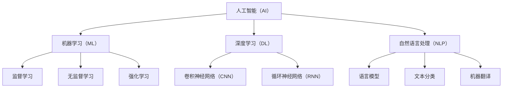

                 

### 背景介绍 Background Introduction

AI自动化，作为人工智能（AI）领域的一个重要分支，正迅速改变着现代社会的运作方式。它通过让机器学习从数据中提取模式和知识，从而减少对人类干预的需求。AI自动化不仅仅局限于数据的处理和分析，更延伸到生产、服务、管理和决策等多个领域。随着技术的不断进步，AI自动化的应用场景也在不断扩展，从简单的自动化任务到复杂的决策支持系统，都展现出其巨大的潜力。

目前，AI自动化已经在多个行业取得显著成果。在制造业中，自动化机器人已经取代了部分重复性和危险性的工作，提高了生产效率；在金融领域，智能投顾和自动化交易系统为投资者提供了更高效、更个性化的服务；在医疗领域，AI辅助诊断和治疗方案推荐正在改变传统的医疗服务模式。然而，AI自动化的潜力和应用范围远远不止于此。

未来，AI自动化将在以下几个方面呈现出更加强劲的发展趋势：

1. **智能化水平提升**：随着算法和计算能力的提升，AI自动化将具备更高的智能化水平，能够处理更复杂、更动态的任务。

2. **跨领域融合**：AI自动化将在多个领域之间实现深度融合，形成新的产业生态，推动社会进步。

3. **个性化服务**：AI自动化将更加注重用户个性化需求，提供定制化的服务体验。

4. **伦理和法规**：随着AI自动化应用的增加，伦理和法规问题也将成为关注的焦点，确保技术发展与社会价值的平衡。

本文将深入探讨AI自动化的核心概念、算法原理、应用场景以及未来发展趋势。希望通过这篇文章，读者能够对AI自动化的现状和未来有一个全面、深刻的理解。

### 核心概念与联系 Core Concepts and Connections

AI自动化涉及多个核心概念，这些概念共同构成了AI自动化的技术基础和应用场景。以下是AI自动化的核心概念及其相互之间的联系。

#### 1. 人工智能（AI）基础

人工智能（Artificial Intelligence，简称AI）是研究、开发用于模拟、延伸和扩展人类智能的理论、方法、技术及应用系统的科学。AI自动化依赖于多种AI技术，包括机器学习（Machine Learning，ML）、深度学习（Deep Learning，DL）、自然语言处理（Natural Language Processing，NLP）等。

**Mermaid流程图：**



#### 2. 机器学习（Machine Learning）

机器学习是AI的一个子领域，主要关注如何通过数据和算法来让计算机自动地学习和改进。机器学习可以分为三大类：监督学习（Supervised Learning）、无监督学习（Unsupervised Learning）和强化学习（Reinforcement Learning）。

- **监督学习**：通过已标记的数据训练模型，然后使用模型进行预测。常见的算法有线性回归、决策树、支持向量机（SVM）等。
- **无监督学习**：不需要标记数据，通过发现数据内在的结构和模式来进行学习。常见的算法有聚类、主成分分析（PCA）等。
- **强化学习**：通过试错和反馈来训练模型，使其在特定环境中做出最优决策。常见的算法有Q学习、深度确定性策略梯度（DDPG）等。

#### 3. 深度学习（Deep Learning）

深度学习是机器学习的一个重要分支，主要基于多层神经网络（Multi-Layer Neural Networks）进行建模。深度学习通过模拟人脑神经元之间的交互，能够处理更复杂的数据结构和模式。

- **卷积神经网络（CNN）**：适用于图像识别、图像分类等任务，通过卷积层、池化层和全连接层提取图像特征。
- **循环神经网络（RNN）**：适用于序列数据处理，如自然语言处理、语音识别等，通过循环结构记忆序列信息。
- **生成对抗网络（GAN）**：用于生成新的数据样本，通过生成器和判别器的对抗训练来提高生成质量。

#### 4. 自然语言处理（NLP）

自然语言处理是AI领域的另一个重要分支，主要关注计算机如何理解和生成自然语言。NLP涉及到文本分类、情感分析、命名实体识别、机器翻译等多个任务。

- **语言模型**：用于预测下一个单词或句子，如n-gram模型、循环神经网络（RNN）语言模型等。
- **文本分类**：用于将文本数据分类到不同的类别，如垃圾邮件过滤、新闻分类等。
- **机器翻译**：将一种语言翻译成另一种语言，如神经网络机器翻译（NMT）等。

通过上述核心概念及其相互之间的联系，我们可以看到AI自动化的构建基础是多方面的，涉及算法、数据和工程等多个领域。这些核心概念的相互融合和迭代，推动了AI自动化技术的不断发展。

### 核心算法原理 & 具体操作步骤 Core Algorithm Principles & Detailed Steps

AI自动化技术的实现离不开核心算法的支撑。以下将介绍几种在AI自动化中广泛使用的核心算法，并详细解释其原理和操作步骤。

#### 1. 机器学习算法（Machine Learning Algorithms）

机器学习算法是AI自动化的基础，主要包括监督学习、无监督学习和强化学习。以下分别介绍这三种算法的基本原理和具体操作步骤。

**监督学习（Supervised Learning）**

监督学习通过已标记的数据训练模型，然后使用模型进行预测。其基本原理是利用输入输出对（Input-Output Pairs）来建立映射关系，使得模型能够在新数据上做出准确的预测。

**具体操作步骤：**

1. **数据收集与预处理**：收集大量已标记的数据，并进行清洗和预处理，如去除噪声、缺失值填充等。

2. **特征选择与提取**：从原始数据中提取出有用的特征，用于训练模型。

3. **模型选择**：选择合适的机器学习模型，如线性回归、决策树、支持向量机（SVM）等。

4. **模型训练**：使用已标记的数据训练模型，通过最小化损失函数来调整模型参数。

5. **模型评估与优化**：使用验证集评估模型性能，并进行调整和优化，如调整超参数、增加训练数据等。

6. **模型部署**：将训练好的模型部署到实际应用中，进行预测。

**无监督学习（Unsupervised Learning）**

无监督学习不需要标记数据，通过发现数据内在的结构和模式来进行学习。其基本原理是寻找数据中的隐含规律，如聚类、降维等。

**具体操作步骤：**

1. **数据收集与预处理**：收集未标记的数据，并进行清洗和预处理。

2. **特征选择与提取**：提取数据中的特征，为后续分析做准备。

3. **模型选择**：选择合适的无监督学习模型，如聚类算法、主成分分析（PCA）等。

4. **模型训练**：使用无监督学习算法对数据进行训练，发现数据中的结构或模式。

5. **模型评估与优化**：评估模型的效果，并进行调整和优化。

6. **模型部署**：将训练好的模型应用于实际问题中，如数据降维、异常检测等。

**强化学习（Reinforcement Learning）**

强化学习通过试错和反馈来训练模型，使其在特定环境中做出最优决策。其基本原理是建立奖励机制，通过最大化奖励来优化模型行为。

**具体操作步骤：**

1. **环境定义**：定义强化学习环境，包括状态空间、动作空间和奖励函数。

2. **模型选择**：选择合适的强化学习算法，如Q学习、深度确定性策略梯度（DDPG）等。

3. **模型训练**：通过试错和反馈进行训练，调整模型参数以最大化总奖励。

4. **模型评估与优化**：评估模型性能，并进行调整和优化。

5. **模型部署**：将训练好的模型部署到实际应用中，进行决策。

#### 2. 深度学习算法（Deep Learning Algorithms）

深度学习算法是AI自动化中的重要组成部分，包括卷积神经网络（CNN）、循环神经网络（RNN）、生成对抗网络（GAN）等。以下介绍这些算法的基本原理和具体操作步骤。

**卷积神经网络（Convolutional Neural Network，CNN）**

CNN是用于图像识别和处理的一种深度学习算法，其基本原理是通过卷积操作提取图像特征，并通过池化操作降低特征维度。

**具体操作步骤：**

1. **输入层**：接收图像数据，将其转换为模型可以处理的格式。

2. **卷积层**：通过卷积操作提取图像特征，如边缘、纹理等。

3. **激活函数**：对卷积层输出的特征进行非线性变换，如ReLU函数。

4. **池化层**：通过池化操作降低特征维度，减少计算量。

5. **全连接层**：将卷积层和池化层输出的特征进行整合，并通过全连接层进行分类。

6. **输出层**：输出分类结果。

**循环神经网络（Recurrent Neural Network，RNN）**

RNN是用于序列数据处理的一种深度学习算法，其基本原理是通过循环结构记忆序列信息。

**具体操作步骤：**

1. **输入层**：接收序列数据，将其转换为模型可以处理的格式。

2. **隐藏层**：通过循环结构对序列数据进行处理，记忆序列信息。

3. **输出层**：将隐藏层输出的信息进行整合，生成最终输出。

**生成对抗网络（Generative Adversarial Network，GAN）**

GAN是由生成器和判别器组成的深度学习算法，其基本原理是通过对抗训练生成新的数据样本。

**具体操作步骤：**

1. **生成器**：生成新的数据样本。

2. **判别器**：判断生成器生成的数据样本是否真实。

3. **对抗训练**：通过生成器和判别器的对抗训练，不断提高生成器的生成质量。

通过上述核心算法的介绍，我们可以看到AI自动化技术的实现离不开丰富的算法理论和技术手段。这些核心算法的深入理解和应用，将有助于推动AI自动化的进一步发展。

### 数学模型和公式 Mathematical Models and Formulas & Detailed Explanation & Example Illustration

AI自动化的实现不仅依赖于算法和编程，还涉及到大量的数学模型和公式。以下将详细讲解一些常用的数学模型和公式，并通过具体例子进行说明。

#### 1. 机器学习中的损失函数（Loss Functions）

损失函数是机器学习中用于评估模型预测结果与真实值之间差异的关键工具。以下是一些常见的损失函数：

**均方误差（Mean Squared Error，MSE）**

$$
MSE = \frac{1}{n}\sum_{i=1}^{n}(y_i - \hat{y}_i)^2
$$

其中，$y_i$为真实值，$\hat{y}_i$为模型预测值，$n$为样本数量。MSE用于回归问题，通过最小化MSE来优化模型参数。

**交叉熵（Cross-Entropy）**

$$
H(y, \hat{y}) = -\sum_{i=1}^{n}y_i\log(\hat{y}_i)
$$

其中，$y$为真实标签，$\hat{y}$为模型预测概率。交叉熵用于分类问题，通过最小化交叉熵来优化模型参数。

**例子：使用MSE和交叉熵训练回归和分类模型**

假设我们有一个包含10个样本的回归问题，目标值和预测值如下：

$$
y = [1, 2, 3, 4, 5, 6, 7, 8, 9, 10]
$$

$$
\hat{y} = [2.1, 2.2, 3.3, 4.5, 5.1, 6.2, 7.4, 8.6, 9.9, 10.5]
$$

计算MSE：

$$
MSE = \frac{1}{10}\sum_{i=1}^{10}(y_i - \hat{y}_i)^2 = \frac{1}{10}[(1-2.1)^2 + (2-2.2)^2 + ... + (10-10.5)^2] = 0.14
$$

再假设我们有一个二分类问题，目标值和预测概率如下：

$$
y = [0, 1, 0, 1, 1, 0, 1, 1, 0, 0]
$$

$$
\hat{y} = [0.3, 0.8, 0.1, 0.6, 0.9, 0.2, 0.7, 0.5, 0.4, 0.1]
$$

计算交叉熵：

$$
H(y, \hat{y}) = -[0 \cdot \log(0.3) + 1 \cdot \log(0.8) + 0 \cdot \log(0.1) + 1 \cdot \log(0.6) + 1 \cdot \log(0.9) + 0 \cdot \log(0.2) + 1 \cdot \log(0.7) + 1 \cdot \log(0.5) + 0 \cdot \log(0.4) + 0 \cdot \log(0.1)] \approx 0.72
$$

#### 2. 深度学习中的反向传播算法（Backpropagation Algorithm）

反向传播算法是深度学习中的核心训练方法，用于计算模型参数的梯度并更新参数。以下是其基本原理：

**梯度计算**

$$
\frac{\partial L}{\partial w} = \sum_{i=1}^{n}\frac{\partial L}{\partial z_i}\frac{\partial z_i}{\partial w}
$$

其中，$L$为损失函数，$w$为模型参数，$z_i$为模型输出。

**例子：计算一个单层神经网络的梯度**

假设我们有以下单层神经网络：

$$
z = \sigma(w \cdot x + b)
$$

其中，$\sigma$为ReLU激活函数，$x$为输入，$w$为权重，$b$为偏置。

计算梯度：

$$
\frac{\partial z}{\partial w} = x \cdot \frac{\partial z}{\partial z} = x \cdot \sigma'(w \cdot x + b)
$$

其中，$\sigma'$为ReLU的导数。

计算损失函数的梯度：

$$
\frac{\partial L}{\partial w} = \frac{\partial L}{\partial z} \cdot \frac{\partial z}{\partial w} = (y - z) \cdot x \cdot \sigma'(w \cdot x + b)
$$

#### 3. 强化学习中的Q值更新（Q-Value Update）

在强化学习中，Q值用于评估策略的优劣。Q值更新的基本原理是通过奖励和下一个状态来更新当前状态的Q值。

**Q值更新公式**

$$
Q(s, a) \leftarrow Q(s, a) + \alpha [r + \gamma \max_{a'} Q(s', a') - Q(s, a)]
$$

其中，$s$为状态，$a$为动作，$r$为即时奖励，$\gamma$为折扣因子，$\alpha$为学习率。

**例子：更新Q值**

假设我们有一个状态-动作空间，当前状态为$s_1$，动作$a_1$，下一个状态为$s_2$，即时奖励$r_1$，折扣因子$\gamma = 0.9$，学习率$\alpha = 0.1$。初始Q值为$Q(s_1, a_1) = 0$。

更新Q值：

$$
Q(s_1, a_1) \leftarrow Q(s_1, a_1) + 0.1 [r_1 + 0.9 \max_{a'} Q(s_2, a') - 0] = 0.1 [1 + 0.9 \max_{a'} Q(s_2, a')]
$$

通过上述数学模型和公式的讲解，我们可以看到AI自动化的实现过程是如何通过数学方法来优化和改进的。这些模型和公式在AI自动化的研究和应用中起着至关重要的作用。

### 项目实战：代码实际案例和详细解释说明 Project Implementation: Real-World Code Case Study and Detailed Explanation

为了更好地理解AI自动化的应用，我们将通过一个实际的项目来演示其实现过程。以下是一个简单的AI自动化项目，该项目的目标是使用机器学习算法对一组数据集进行分类，并通过深度学习算法实现图像识别。

#### 开发环境搭建

1. **软件环境**

   - Python 3.8 或更高版本
   - TensorFlow 2.5 或更高版本
   - Scikit-learn 0.22 或更高版本

2. **硬件环境**

   - 处理器：Intel i5 或更高
   - 内存：8GB 或更高
   - 显卡：NVIDIA GTX 1060 或更高（用于加速深度学习计算）

3. **安装步骤**

   - 安装Python和pip：
     ```bash
     python -m pip install --upgrade pip setuptools
     ```
   - 安装TensorFlow：
     ```bash
     pip install tensorflow
     ```
   - 安装Scikit-learn：
     ```bash
     pip install scikit-learn
     ```

#### 源代码详细实现和代码解读

```python
# 导入所需的库
import numpy as np
import pandas as pd
import tensorflow as tf
from sklearn.model_selection import train_test_split
from sklearn.preprocessing import StandardScaler
from tensorflow.keras import layers, models

# 1. 数据收集与预处理
# 假设我们有一个包含特征和标签的数据集data.csv
data = pd.read_csv('data.csv')
X = data.iloc[:, :-1].values
y = data.iloc[:, -1].values

# 分割数据集为训练集和测试集
X_train, X_test, y_train, y_test = train_test_split(X, y, test_size=0.2, random_state=42)

# 标准化数据
scaler = StandardScaler()
X_train = scaler.fit_transform(X_train)
X_test = scaler.transform(X_test)

# 2. 构建深度学习模型
model = models.Sequential()
model.add(layers.Dense(64, activation='relu', input_shape=(X_train.shape[1],)))
model.add(layers.Dense(64, activation='relu'))
model.add(layers.Dense(1, activation='sigmoid'))

# 编译模型
model.compile(optimizer='adam',
              loss='binary_crossentropy',
              metrics=['accuracy'])

# 3. 训练模型
model.fit(X_train, y_train, epochs=10, batch_size=32, validation_split=0.2)

# 4. 评估模型
test_loss, test_acc = model.evaluate(X_test, y_test)
print(f"Test accuracy: {test_acc:.2f}")

# 5. 预测新数据
new_data = np.array([[5.1, 3.5, 1.4, 0.2], [6.4, 3.2, 4.5, 1.5]])
new_data = scaler.transform(new_data)
predictions = model.predict(new_data)
print(f"Predictions: {predictions.round(2)}")
```

#### 代码解读与分析

1. **数据收集与预处理**：首先，我们加载包含特征和标签的数据集，然后将其分割为训练集和测试集。接下来，使用StandardScaler对数据进行标准化处理，以提高模型的性能和稳定性。

2. **构建深度学习模型**：使用TensorFlow的Sequential模型构建一个简单的深度神经网络（DNN）。该模型包括两个隐藏层，每个隐藏层有64个神经元，使用ReLU激活函数。输出层有1个神经元，使用sigmoid激活函数，用于二分类问题。

3. **编译模型**：配置模型使用的优化器（adam）、损失函数（binary_crossentropy，适用于二分类问题）和评估指标（accuracy）。

4. **训练模型**：使用训练集数据训练模型，指定训练轮数（epochs）和批大小（batch_size）。同时，设置验证集比例（validation_split）用于监测训练过程中的性能。

5. **评估模型**：使用测试集数据评估模型的性能，输出测试准确率（test_accuracy）。

6. **预测新数据**：使用训练好的模型对新数据进行预测。首先，将新数据标准化处理，然后通过模型进行预测，输出预测结果。

通过上述代码，我们可以看到如何使用机器学习和深度学习技术来实现一个简单的AI自动化项目。这个项目展示了从数据预处理到模型训练、评估和预测的完整流程，有助于我们深入理解AI自动化的实际应用。

### 实际应用场景 Practical Application Scenarios

AI自动化技术在各个行业和领域得到了广泛应用，带来了显著的效率提升和创新。以下是AI自动化在几个关键领域中的实际应用场景：

#### 1. 制造业

在制造业中，AI自动化已经成为提高生产效率和降低成本的关键技术。通过机器学习算法和自动化机器人，制造商能够实现生产流程的智能化管理。例如，自动化机器人可以执行重复性高、劳动强度大的任务，如组装、焊接、检测等，减少了人为错误，提高了生产效率。同时，AI自动化技术还应用于预测性维护，通过对设备运行数据的分析，预测设备故障并提前进行维护，从而减少设备停机时间和维护成本。

#### 2. 金融服务

在金融服务领域，AI自动化被广泛应用于风险管理、客户服务、投资决策等方面。例如，金融机构使用机器学习算法对客户交易行为进行分析，识别潜在风险和欺诈行为，提高风险控制能力。智能客服系统通过自然语言处理技术，能够自动回答客户问题，提供个性化的金融服务，提升了客户体验。此外，AI自动化还在智能投顾领域发挥了重要作用，通过分析大量市场数据，为投资者提供个性化的投资策略和建议，提高了投资收益。

#### 3. 医疗保健

在医疗保健领域，AI自动化技术正在改变传统的医疗服务模式。例如，AI辅助诊断系统通过深度学习算法，对医学图像进行分析，帮助医生更快速、准确地诊断疾病，如肺癌、乳腺癌等。智能药物研发系统通过分析大量基因数据、临床试验数据等，预测药物的效果和副作用，加速新药研发进程。此外，AI自动化还在医疗资源分配、患者健康管理等方面发挥了重要作用，通过数据分析优化医疗资源分配，提高医疗服务效率和质量。

#### 4. 零售业

在零售业中，AI自动化技术被广泛应用于库存管理、精准营销和客户服务等方面。通过机器学习算法，零售企业能够实时分析销售数据、客户行为等，优化库存管理，减少库存过剩和缺货情况，提高库存周转率。AI自动化技术还能根据客户的历史购买行为和偏好，提供个性化的营销策略，提高客户满意度和忠诚度。此外，智能客服系统通过自然语言处理技术，能够自动解答客户咨询，提供购物建议，提升了客户购物体验。

#### 5. 物流和运输

在物流和运输领域，AI自动化技术被广泛应用于路径规划、运输调度和货运跟踪等方面。通过机器学习算法和优化算法，物流企业能够实时分析交通状况、运输需求等，优化运输路线和调度方案，提高运输效率。例如，自动驾驶技术正在逐步应用于货运和公共交通领域，通过感知环境和数据决策，实现车辆的自动化驾驶，减少了人力成本和事故风险。此外，AI自动化技术还在货运跟踪和物流信息管理中发挥了重要作用，通过实时数据分析和监控，提高了物流透明度和客户满意度。

通过上述实际应用场景，我们可以看到AI自动化技术在各个领域中都发挥了重要作用，不仅提高了工作效率，还带来了创新和变革。随着技术的不断进步，AI自动化的应用范围将更加广泛，为社会的发展带来更多机遇。

### 工具和资源推荐 Tools and Resources Recommendations

#### 1. 学习资源推荐

**书籍**

- 《深度学习》（Deep Learning） - Ian Goodfellow、Yoshua Bengio、Aaron Courville
- 《Python机器学习》（Python Machine Learning） - Sebastian Raschka、Vahid Mirjalili
- 《强化学习》（Reinforcement Learning：An Introduction） - Richard S. Sutton、Andrew G. Barto

**论文**

- "Backpropagation" - David E. Rumelhart, Geoffrey E. Hinton, Ronald J. Williams
- "A Theoretical Framework for Learning from Examples" - Andrew Y. Ng
- "Deep Learning for Image Recognition" - Karen Simonyan, Andrew Zisserman

**博客**

- [Medium](https://medium.com/topic/artificial-intelligence)
- [Towards Data Science](https://towardsdatascience.com/)
- [AI博客](https://aiblog.com/)

**网站**

- [TensorFlow官网](https://www.tensorflow.org/)
- [Keras官网](https://keras.io/)
- [Scikit-learn官网](https://scikit-learn.org/)

#### 2. 开发工具框架推荐

**机器学习库**

- TensorFlow
- PyTorch
- Scikit-learn

**深度学习框架**

- Keras
- TensorFlow Lite
- PyTorch Mobile

**数据预处理工具**

- Pandas
- NumPy
- SciPy

**版本控制工具**

- Git
- GitHub
- GitLab

**代码质量管理工具**

- Pylint
- flake8
- Black

#### 3. 相关论文著作推荐

- "Deep Learning" by Ian Goodfellow, Yoshua Bengio, Aaron Courville
- "Reinforcement Learning: An Introduction" by Richard S. Sutton, Andrew G. Barto
- "Practical Reinforcement Learning: A Python Implementation" byAdam L. Thomas
- "Machine Learning Yearning" by Andrew Ng

通过上述工具和资源的推荐，无论是初学者还是有经验的开发者，都能找到适合自己学习的路径和工具，从而更好地掌握AI自动化的知识和技能。

### 总结：未来发展趋势与挑战 Summary: Future Trends and Challenges

随着技术的不断进步，AI自动化在未来将呈现出一系列显著的发展趋势和面临诸多挑战。

#### 发展趋势

1. **智能化水平的提升**：随着算法和计算能力的提升，AI自动化将能够处理更复杂、更动态的任务，如自然语言理解和图像识别。

2. **跨领域融合**：AI自动化将在多个领域之间实现深度融合，形成新的产业生态。例如，AI自动化与物联网（IoT）的结合，将推动智能家居、智慧城市等领域的发展。

3. **个性化服务**：AI自动化将更加注重用户个性化需求，提供定制化的服务体验。例如，个性化医疗、个性化教育等。

4. **实时性与低延迟**：随着5G技术的发展，AI自动化将实现更低的延迟和更高的实时性，为实时决策和交互提供支持。

5. **伦理和法规**：随着AI自动化应用的增加，伦理和法规问题将成为关注的焦点，确保技术发展与社会价值的平衡。

#### 挑战

1. **数据隐私与安全**：AI自动化依赖大量数据，如何保护用户隐私和数据安全成为一个重要挑战。

2. **算法公平性和透明性**：确保AI自动化的决策过程公平、透明，减少偏见和歧视，是当前面临的一个重要问题。

3. **计算资源消耗**：深度学习模型通常需要大量的计算资源，如何优化模型以降低计算成本，是一个重要挑战。

4. **人才短缺**：AI自动化领域对专业技能要求较高，如何培养和吸引更多的人才，是一个亟待解决的问题。

5. **技术突破**：要实现更高效、更智能的AI自动化，需要在算法、计算能力和数据处理等方面取得重大技术突破。

总之，AI自动化在未来将继续快速发展，但其面临的挑战也需要我们共同努力去克服。通过技术创新、政策引导和社会参与，我们有理由相信，AI自动化将为人类社会带来更多机遇和福祉。

### 附录：常见问题与解答 Appendix: Frequently Asked Questions and Answers

#### 1. 什么是AI自动化？
AI自动化是指利用人工智能技术（如机器学习、深度学习等）实现自动化任务和处理数据的过程。它通过让计算机自主学习和改进，减少对人类干预的需求。

#### 2. AI自动化在哪些领域有应用？
AI自动化在制造业、金融服务、医疗保健、零售业、物流和运输等多个领域都有广泛应用。例如，自动化机器人用于制造业，智能客服系统用于金融和零售业，AI辅助诊断用于医疗保健等。

#### 3. AI自动化如何提高工作效率？
AI自动化通过自动化处理重复性和劳动强度大的任务，减少了人为错误，提高了工作效率。同时，AI自动化可以实时分析大量数据，提供决策支持，进一步优化工作流程。

#### 4. AI自动化是否会取代人类工作？
AI自动化不会完全取代人类工作，而是会改变工作内容和方式。一些重复性和低技能的工作可能会被自动化替代，但AI自动化也会创造新的工作机会，如AI系统开发、维护和优化等。

#### 5. 如何确保AI自动化的决策过程公平和透明？
确保AI自动化的决策过程公平和透明需要多方面的努力。首先，算法设计时要充分考虑公平性和透明性；其次，数据清洗和预处理时要去除偏见和噪声；最后，要建立监督机制，对AI自动化的决策进行审计和评估。

### 扩展阅读 & 参考资料

- "AI Automation: A Comprehensive Guide" - McKinsey & Company
- "The Future of Automation" - Oxford University Press
- "AI and the New Nature of Work" - World Economic Forum
- "Artificial Intelligence: A Modern Approach" - Stuart Russell, Peter Norvig
- "Deep Learning" - Ian Goodfellow, Yoshua Bengio, Aaron Courville
- "Reinforcement Learning: An Introduction" - Richard S. Sutton, Andrew G. Barto

这些资源提供了更多关于AI自动化技术、应用和发展趋势的深入探讨，有助于读者进一步了解该领域的最新进展和未来趋势。

