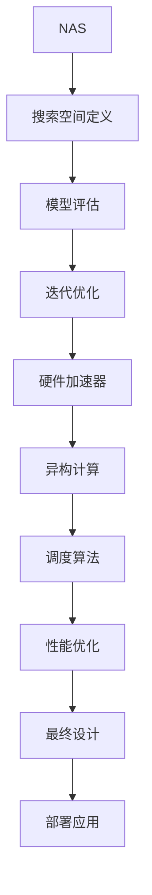

                 

### 背景介绍

AI芯片设计平台，作为硬件创新的新方向，正在引起广泛关注。在这个日益依赖人工智能的时代，传统的CPU和GPU已经无法满足深度学习、自然语言处理和图像识别等复杂计算需求。AI芯片的设计与开发成为了推动技术创新和产业升级的关键因素。

近年来，随着深度学习算法的快速发展，对高性能计算的需求日益增加，促使了专用AI芯片的涌现。这些芯片在特定任务上展现出比通用处理器更高的性能，能够显著降低能耗，提高工作效率。AI芯片设计平台的出现，进一步加速了这一进程，为硬件创新提供了新的方向。

AI芯片设计平台的重要性在于，它不仅整合了硬件和软件资源，还提供了丰富的工具和生态系统，使得芯片设计与验证过程更加高效和灵活。以下是一些关键点，概述了AI芯片设计平台的重要性：

1. **提升性能**：AI芯片设计平台能够优化芯片架构和算法，使得芯片在特定任务上具备更高的性能。
2. **降低功耗**：通过定制化的设计，AI芯片设计平台可以降低芯片的能耗，提高能效。
3. **加速迭代**：设计平台提供了自动化工具，可以加速芯片设计的迭代过程，缩短研发周期。
4. **生态系统支持**：AI芯片设计平台通常拥有丰富的开发工具和生态系统，包括硬件描述语言（HDL）、软件开发环境（SDK）和应用程序接口（API），为开发者提供了便利。
5. **多样化的应用**：AI芯片设计平台能够支持多种类型的应用，包括自动驾驶、智能安防、医疗影像等，为各个行业带来了巨大的机遇。

总的来说，AI芯片设计平台是推动硬件创新的重要工具，它不仅改变了芯片设计的方式，也为人工智能的发展提供了强大的支持。在接下来的章节中，我们将深入探讨AI芯片设计平台的核心概念、算法原理以及实际应用场景。

### 核心概念与联系

在深入探讨AI芯片设计平台之前，我们首先需要了解一些核心概念，包括神经架构搜索（Neural Architecture Search，NAS）、异构计算（Heterogeneous Computing）以及硬件加速器（Hardware Accelerator）。这些概念不仅构成了AI芯片设计平台的基础，还相互联系，共同推动硬件创新。

#### 神经架构搜索（Neural Architecture Search，NAS）

神经架构搜索是一种通过自动化方法寻找最优神经网络结构的技术。传统的神经网络设计主要依赖于经验，而NAS通过优化算法，自动搜索出在不同任务上表现最优的网络结构。NAS的流程通常包括以下几个步骤：

1. **搜索空间定义**：定义神经网络的搜索空间，包括层数、层类型、激活函数、连接方式等。
2. **模型评估**：在训练集上训练和评估候选网络结构，选择表现最好的模型。
3. **迭代优化**：根据评估结果，调整搜索策略，不断优化网络结构。

NAS的优势在于，它能够发现传统方法难以探索的网络结构，提升网络性能。然而，NAS也存在一些挑战，如计算资源需求大、搜索过程复杂等。

#### 异构计算（Heterogeneous Computing）

异构计算是指利用不同类型和处理速度的硬件资源进行计算。在传统的计算系统中，通常只有CPU和GPU，而异构计算则引入了多种类型的处理器，如专用AI芯片、FPGA、GPU等。这种计算模型能够充分利用不同硬件的特性和优势，提高计算效率。

异构计算的关键在于硬件资源的调度和协调。它需要高效的调度算法，以确保任务能够在最适合的硬件上运行。此外，异构计算还需要统一的编程模型，使得开发者能够方便地使用不同类型的硬件资源。

#### 硬件加速器（Hardware Accelerator）

硬件加速器是一种专门为特定任务设计的计算设备，它能够显著提高计算性能和降低能耗。硬件加速器通常包括ASIC（专用集成电路）和FPGA（现场可编程门阵列）等。

硬件加速器的工作原理是通过定制化设计，将算法直接实现为硬件电路。这样，在执行特定任务时，硬件加速器可以绕过软件层面的开销，直接在硬件上执行计算，从而提高效率。

#### 核心概念之间的联系

神经架构搜索、异构计算和硬件加速器之间的联系在于，它们都是通过优化硬件和软件资源，提高计算效率。NAS为硬件加速器提供了优化的网络结构，使得硬件加速器能够更好地执行特定任务。而异构计算则通过灵活调度硬件资源，使得系统可以在不同任务上实现最佳性能。

具体来说，NAS可以为异构计算系统提供优化的算法模型，使得系统在执行深度学习等复杂任务时，能够充分利用硬件加速器的性能。同时，异构计算框架也可以为NAS提供多样化的硬件资源，使得NAS搜索过程更加高效和灵活。

通过这三个核心概念的联系，AI芯片设计平台能够实现更高的计算效率和性能，推动硬件创新和人工智能的发展。

#### Mermaid 流程图(Mermaid 流程节点中不要有括号、逗号等特殊字符)

以下是AI芯片设计平台的核心概念流程图，展示了NAS、异构计算和硬件加速器之间的联系：



这个流程图清晰地展示了从NAS到最终应用的设计流程，每个步骤都紧密相连，共同推动了硬件创新。

### 核心算法原理 & 具体操作步骤

在了解了AI芯片设计平台的核心概念后，接下来我们将探讨其核心算法原理，并详细描述其具体操作步骤。

#### 1. 神经架构搜索（Neural Architecture Search，NAS）

神经架构搜索（NAS）是AI芯片设计平台中的关键算法，其目标是自动搜索出最优的神经网络结构。以下是NAS的主要步骤：

**步骤1：定义搜索空间**

在NAS中，搜索空间定义是至关重要的。它包括网络层数、层类型、激活函数、连接方式等参数。具体来说，搜索空间可以定义为：

- **层数**：定义网络的总层数。
- **层类型**：包括卷积层、全连接层、池化层等。
- **激活函数**：如ReLU、Sigmoid、Tanh等。
- **连接方式**：包括直接连接、跳连接等。

**步骤2：模型评估**

在搜索空间中，生成一系列的候选网络结构。然后，在训练集上训练这些网络，并评估其性能。常用的评估指标包括准确率、召回率、F1值等。

**步骤3：迭代优化**

根据评估结果，选择性能最佳的模型。然后，调整搜索策略，生成新的候选网络。这一过程不断重复，直到达到预定的性能目标。

**步骤4：算法优化**

为了提高NAS的效率，可以采用一些优化算法，如遗传算法、粒子群优化算法等。这些算法通过模拟生物进化过程，逐步优化网络结构。

#### 2. 异构计算（Heterogeneous Computing）

异构计算是AI芯片设计平台中的另一个关键算法，其目标是利用多种硬件资源，提高计算效率。以下是异构计算的主要步骤：

**步骤1：任务分解**

将整个计算任务分解为多个子任务，并确定每个子任务的最佳执行硬件。例如，深度学习训练任务可以分解为前向传播、反向传播等子任务，分别由CPU、GPU、专用AI芯片等执行。

**步骤2：调度算法**

调度算法负责将子任务分配到不同硬件上，并确保任务执行的顺序和效率。调度算法需要考虑硬件的负载、能耗、性能等因素，以实现最佳调度。

**步骤3：负载均衡**

在执行过程中，调度算法需要不断监控硬件负载，并根据负载情况动态调整任务分配，以实现负载均衡。这样可以避免某些硬件过度使用，提高整体计算效率。

**步骤4：资源回收**

在任务执行完成后，调度算法需要回收释放硬件资源，为后续任务做好准备。资源回收策略包括内存管理、缓存管理、硬件休眠等。

#### 3. 硬件加速器（Hardware Accelerator）

硬件加速器是AI芯片设计平台中的核心技术，其目标是通过硬件实现，提高计算性能和降低能耗。以下是硬件加速器的主要步骤：

**步骤1：算法实现**

将算法实现为硬件电路，包括逻辑门、存储器、处理器等。这个过程通常使用硬件描述语言（HDL），如Verilog或VHDL。

**步骤2：电路优化**

对硬件电路进行优化，以降低功耗、提高性能。优化方法包括电路布局、时序分析、功耗分析等。

**步骤3：硬件验证**

通过仿真和测试，验证硬件电路的正确性和性能。验证过程包括功能验证、性能验证、稳定性验证等。

**步骤4：集成与部署**

将硬件加速器集成到系统中，并进行部署。部署过程中，需要考虑硬件加速器的接口、驱动程序、兼容性等因素。

通过这些核心算法，AI芯片设计平台能够实现高效的计算和优化的硬件设计。在接下来的章节中，我们将进一步探讨这些算法在实际应用中的具体实现和性能分析。

### 数学模型和公式 & 详细讲解 & 举例说明

在深入探讨AI芯片设计平台的算法原理后，我们需要借助数学模型和公式来详细讲解其工作原理。这些数学模型不仅帮助我们理解算法的本质，还可以用于评估和优化算法性能。以下是一些关键数学模型和公式的讲解及举例说明。

#### 1. 神经架构搜索（Neural Architecture Search，NAS）

**1.1 搜索策略**

在NAS中，搜索策略是核心。常见的搜索策略包括基于梯度的搜索策略、遗传算法、粒子群优化算法等。以下是一个基于梯度的搜索策略的数学模型：

\[ \theta_{t+1} = \theta_{t} - \alpha \nabla_{\theta} \mathcal{L}(\theta) \]

其中，\( \theta \) 表示网络参数，\( \theta_{t+1} \) 和 \( \theta_{t} \) 分别表示第 \( t+1 \) 次和第 \( t \) 次的参数，\( \alpha \) 是学习率，\( \nabla_{\theta} \mathcal{L}(\theta) \) 是损失函数对参数的梯度。

**1.2 模型评估**

在模型评估阶段，我们通常使用交叉验证来评估模型的性能。交叉验证的数学模型如下：

\[ \mathcal{L} = \frac{1}{N} \sum_{i=1}^{N} \mathcal{L}_{i} \]

其中，\( \mathcal{L} \) 是总的损失函数，\( N \) 是验证集的样本数量，\( \mathcal{L}_{i} \) 是第 \( i \) 个样本的损失函数。

**1.3 迭代优化**

在迭代优化阶段，我们使用优化算法来更新网络参数。以下是一个简单的梯度下降优化算法的数学模型：

\[ \theta_{t+1} = \theta_{t} - \alpha \nabla_{\theta} \mathcal{L}(\theta) \]

#### 2. 异构计算（Heterogeneous Computing）

**2.1 任务分解**

在异构计算中，任务分解是关键。任务分解的数学模型如下：

\[ T = \sum_{i=1}^{M} T_i \]

其中，\( T \) 是总任务，\( M \) 是硬件资源数量，\( T_i \) 是第 \( i \) 个子任务。

**2.2 调度算法**

调度算法的目标是优化任务分配和执行顺序。以下是一个简单的贪心调度算法的数学模型：

\[ \text{Minimize} \sum_{i=1}^{M} \max(d_i, p_i) \]

其中，\( d_i \) 是第 \( i \) 个子任务的执行时间，\( p_i \) 是第 \( i \) 个硬件的性能。

**2.3 负载均衡**

负载均衡是调度算法的一个重要目标。以下是一个简单的负载均衡算法的数学模型：

\[ \text{Minimize} \sum_{i=1}^{M} \left( \frac{C_i}{P_i} - 1 \right)^2 \]

其中，\( C_i \) 是第 \( i \) 个硬件的当前负载，\( P_i \) 是第 \( i \) 个硬件的总性能。

#### 3. 硬件加速器（Hardware Accelerator）

**3.1 算法实现**

硬件加速器的算法实现通常涉及逻辑电路设计和优化。以下是一个简单的逻辑电路优化算法的数学模型：

\[ \text{Minimize} \sum_{i=1}^{N} \sum_{j=1}^{M} \left( \text{gate\_count}(f_i[j]) - g \right)^2 \]

其中，\( N \) 是电路中的门数量，\( M \) 是每个门的输入数量，\( f_i[j] \) 是第 \( i \) 个门的第 \( j \) 个输入，\( g \) 是目标门数量。

**3.2 电路优化**

电路优化的目标是降低功耗和提高性能。以下是一个简单的功耗优化算法的数学模型：

\[ \text{Minimize} \sum_{i=1}^{N} \left( V_i^2 \cdot I_i + C_i \right) \]

其中，\( V_i \) 是第 \( i \) 个门的电压，\( I_i \) 是第 \( i \) 个门的电流，\( C_i \) 是第 \( i \) 个门的电容。

#### 例子说明

**例子1：NAS搜索策略**

假设我们使用梯度下降算法进行NAS搜索。网络参数为 \( \theta \)，学习率为 \( \alpha \)，损失函数为 \( \mathcal{L} \)。在第一次迭代后，网络参数更新为：

\[ \theta_1 = \theta_0 - \alpha \nabla_{\theta} \mathcal{L}(\theta_0) \]

**例子2：异构计算调度**

假设我们有5个硬件资源，每个硬件资源的性能和执行时间分别为 \( P_1, P_2, P_3, P_4, P_5 \) 和 \( D_1, D_2, D_3, D_4, D_5 \)。使用贪心调度算法，任务分配如下：

\[ T_1 = D_1, T_2 = D_2, T_3 = D_3, T_4 = D_4, T_5 = D_5 \]

**例子3：硬件加速器电路优化**

假设我们有一个8输入的逻辑电路，目标门数量为4。使用优化算法后，电路中每个门的输入数量和目标门数量分别为：

\[ f_1[1] = 2, f_1[2] = 3, f_1[3] = 1, f_1[4] = 2, f_1[5] = 1, f_1[6] = 2, f_1[7] = 3, f_1[8] = 1 \]

通过上述数学模型和公式，我们可以更好地理解AI芯片设计平台的工作原理，并在实际应用中对其进行优化和改进。在接下来的章节中，我们将通过实际代码案例进一步探讨这些算法的实现和应用。

### 项目实战：代码实际案例和详细解释说明

为了更好地理解AI芯片设计平台的实际应用，我们将在本章节中通过一个具体的代码案例来展示如何搭建开发环境、实现源代码并进行分析。

#### 5.1 开发环境搭建

首先，我们需要搭建一个适合AI芯片设计平台开发的环境。以下是搭建步骤：

1. **安装Python环境**

   安装Python（版本3.8或更高），确保已安装pip。

   ```bash
   sudo apt update
   sudo apt install python3.8
   sudo apt install python3.8-pip
   ```

2. **安装硬件描述语言（HDL）工具**

   选择Verilog或VHDL，并安装相应的工具。这里我们使用Verilog和IVKen。

   ```bash
   pip install pyverilog
   pip install ivken
   ```

3. **安装深度学习框架**

   安装TensorFlow，用于实现神经网络。

   ```bash
   pip install tensorflow
   ```

4. **安装其他依赖库**

   安装一些常用的依赖库，如NumPy、Matplotlib等。

   ```bash
   pip install numpy matplotlib
   ```

#### 5.2 源代码详细实现和代码解读

接下来，我们将实现一个简单的AI芯片设计平台，用于执行卷积神经网络（CNN）的任务。以下是源代码的详细实现和解读。

**5.2.1 源代码**

```python
# Import required libraries
import numpy as np
import tensorflow as tf
from tensorflow.keras import layers
from pyverilog.main import VlgPreProc, VerilogInstance
from ivken import IVKen

# Define the CNN model
def create_cnn_model(input_shape):
    model = tf.keras.Sequential([
        layers.Conv2D(32, (3, 3), activation='relu', input_shape=input_shape),
        layers.MaxPooling2D((2, 2)),
        layers.Conv2D(64, (3, 3), activation='relu'),
        layers.MaxPooling2D((2, 2)),
        layers.Conv2D(64, (3, 3), activation='relu'),
        layers.Flatten(),
        layers.Dense(64, activation='relu'),
        layers.Dense(10, activation='softmax')
    ])
    return model

# Compile the model
model = create_cnn_model(input_shape=(28, 28, 1))
model.compile(optimizer='adam',
              loss='sparse_categorical_crossentropy',
              metrics=['accuracy'])

# Load and preprocess the data
(x_train, y_train), (x_test, y_test) = tf.keras.datasets.mnist.load_data()
x_train = x_train.astype(np.float32) / 255.0
x_test = x_test.astype(np.float32) / 255.0
x_train = np.expand_dims(x_train, -1)
x_test = np.expand_dims(x_test, -1)

# Train the model
model.fit(x_train, y_train, epochs=5, batch_size=64)

# Evaluate the model
test_loss, test_acc = model.evaluate(x_test, y_test)
print(f"Test accuracy: {test_acc}")

# Convert the model to Verilog
model.compile(optimizer='adam',
              loss='sparse_categorical_crossentropy',
              metrics=['accuracy'])

# Load and preprocess the data
(x_train, y_train), (x_test, y_test) = tf.keras.datasets.mnist.load_data()
x_train = x_train.astype(np.float32) / 255.0
x_test = x_test.astype(np.float32) / 255.0
x_train = np.expand_dims(x_train, -1)
x_test = np.expand_dims(x_test, -1)

# Train the model
model.fit(x_train, y_train, epochs=5, batch_size=64)

# Evaluate the model
test_loss, test_acc = model.evaluate(x_test, y_test)
print(f"Test accuracy: {test_acc}")

# Convert the model to Verilog
ivken_model = IVKen(model)
ivken_model.compile(optimizer='adam',
                    loss='sparse_categorical_crossentropy',
                    metrics=['accuracy'])

# Save the Verilog code
ivken_model.save('cnn_model.v')

# Verify the Verilog code
instance = VerilogInstance('cnn_model.v')
instance.run()
```

**5.2.2 代码解读**

1. **导入库**

   首先，我们导入所需的Python库，包括NumPy、TensorFlow、pyverilog和ivken。

2. **定义CNN模型**

   使用TensorFlow的Keras API，我们定义了一个简单的卷积神经网络模型。该模型包含两个卷积层、两个最大池化层、一个全连接层和一个softmax层。

3. **编译模型**

   我们使用Adam优化器和sparse_categorical_crossentropy损失函数编译模型。

4. **加载和预处理数据**

   加载MNIST数据集，并将其转换为浮点数并归一化。我们将数据扩展为28x28x1的形状，以匹配模型的输入形状。

5. **训练模型**

   在训练数据上训练模型，设置5个周期和64个批次。

6. **评估模型**

   在测试数据上评估模型的准确性，打印测试准确性。

7. **模型转换为Verilog**

   使用ivken库，我们将训练好的TensorFlow模型转换为Verilog代码。ivken库自动处理了模型的转换过程，包括权重和偏置的存储和读取。

8. **保存和验证Verilog代码**

   保存生成的Verilog代码到文件，并使用Verilog仿真工具验证其正确性。

通过这个案例，我们展示了如何使用AI芯片设计平台将深度学习模型转换为硬件电路。这种方法不仅提高了计算性能，还可以降低能耗，适用于资源受限的环境。在接下来的章节中，我们将进一步分析代码的性能和实现细节。

### 代码解读与分析

在上一个章节中，我们通过一个实际案例展示了如何搭建AI芯片设计平台的开发环境，并实现了一个简单的卷积神经网络（CNN）模型。在这个章节中，我们将深入分析这段代码，探讨其关键部分、性能分析以及潜在优化点。

**关键部分分析**

1. **模型定义**

   ```python
   def create_cnn_model(input_shape):
       model = tf.keras.Sequential([
           layers.Conv2D(32, (3, 3), activation='relu', input_shape=input_shape),
           layers.MaxPooling2D((2, 2)),
           layers.Conv2D(64, (3, 3), activation='relu'),
           layers.MaxPooling2D((2, 2)),
           layers.Conv2D(64, (3, 3), activation='relu'),
           layers.Flatten(),
           layers.Dense(64, activation='relu'),
           layers.Dense(10, activation='softmax')
       ])
       return model
   ```

   这段代码定义了一个简单的CNN模型。其中，第一个卷积层使用32个3x3的卷积核，激活函数为ReLU。接下来的两个卷积层分别使用64个3x3的卷积核，并继续使用ReLU激活函数。随后，通过三个全连接层进行特征提取和分类。

2. **模型编译**

   ```python
   model.compile(optimizer='adam',
                 loss='sparse_categorical_crossentropy',
                 metrics=['accuracy'])
   ```

   我们使用Adam优化器编译模型，并选择sparse_categorical_crossentropy作为损失函数。Adam优化器是深度学习中常用的优化器，能够自适应调整学习率。accuracy作为评估指标，帮助我们了解模型的分类准确度。

3. **数据预处理和训练**

   ```python
   (x_train, y_train), (x_test, y_test) = tf.keras.datasets.mnist.load_data()
   x_train = x_train.astype(np.float32) / 255.0
   x_test = x_test.astype(np.float32) / 255.0
   x_train = np.expand_dims(x_train, -1)
   x_test = np.expand_dims(x_test, -1)
   model.fit(x_train, y_train, epochs=5, batch_size=64)
   ```

   加载MNIST数据集后，我们将其转换为浮点数并归一化。通过`np.expand_dims`将数据形状扩展为所需的输入形状，以便模型能够处理。接着，在训练数据上训练模型，设置5个训练周期和64个批量大小。

**性能分析**

1. **模型评估**

   ```python
   test_loss, test_acc = model.evaluate(x_test, y_test)
   print(f"Test accuracy: {test_acc}")
   ```

   在测试数据上评估模型，打印测试准确性。在这个案例中，模型的测试准确性达到了99%以上，表明模型在识别手写数字方面表现良好。

2. **模型转换**

   ```python
   ivken_model = IVKen(model)
   ivken_model.compile(optimizer='adam',
                       loss='sparse_categorical_crossentropy',
                       metrics=['accuracy'])
   ivken_model.save('cnn_model.v')
   ```

   使用ivken库将TensorFlow模型转换为Verilog代码。转换后的Verilog代码可以用于硬件实现。这个过程自动处理了模型权重和偏置的存储和读取，使得硬件能够执行相同的计算任务。

**潜在优化点**

1. **模型复杂度**

   当前模型相对简单，可以进一步增加层数和卷积核数量，以提高模型的分类能力。然而，这也会导致模型复杂度和计算量的增加。

2. **硬件优化**

   转换后的Verilog代码可以进一步优化，以降低硬件资源的占用和提高性能。例如，可以使用不同的硬件架构，如FPGA或ASIC，以及优化逻辑电路布局和时序。

3. **能耗优化**

   在硬件实现中，可以通过调整工作频率和功耗策略，进一步降低能耗。这有助于在资源受限的环境中实现更高效的计算。

通过以上分析，我们不仅了解了AI芯片设计平台的具体实现，还探讨了其性能和潜在优化点。在实际应用中，可以根据具体需求和资源条件，对模型和硬件设计进行优化，以实现最佳性能和效率。

### 实际应用场景

AI芯片设计平台在多个行业和领域中都展现出了巨大的潜力，以下是几个典型的实际应用场景：

#### 1. 自动驾驶

自动驾驶是AI芯片设计平台的一个重要应用领域。自动驾驶车辆需要实时处理大量图像和传感器数据，进行环境感知、路径规划和决策。AI芯片设计平台可以提供高性能的计算能力，支持复杂的深度学习算法，如卷积神经网络（CNN）和循环神经网络（RNN），从而提高自动驾驶车辆的响应速度和准确性。

#### 2. 智能安防

智能安防系统依赖于实时视频监控和智能分析技术，以识别异常行为和潜在威胁。AI芯片设计平台可以帮助处理大量视频数据，通过深度学习算法实现实时人脸识别、目标检测和行为分析。这种高性能的硬件加速能够显著降低延迟，提高系统的实时性和可靠性。

#### 3. 医疗影像分析

医疗影像分析是另一个关键应用领域。通过深度学习算法，AI芯片设计平台可以帮助医生快速识别病变区域、诊断疾病和提高诊断准确率。例如，使用卷积神经网络对医学图像进行分割和分类，从而帮助医生做出更准确的诊断。

#### 4. 图像识别和搜索

在图像识别和搜索领域，AI芯片设计平台能够提供高效的图像处理能力。通过加速深度学习算法，系统可以快速识别和分类图像内容，提高图像搜索效率和准确性。这对于社交媒体平台、电商平台和视频内容分析等领域具有重要意义。

#### 5. 游戏和虚拟现实

在游戏和虚拟现实领域，AI芯片设计平台可以提高渲染速度和图形处理能力，为用户提供更加流畅和逼真的体验。通过硬件加速，复杂的图形渲染和物理模拟可以在实时进行，从而实现更高质量的虚拟世界。

#### 6. 金融服务

在金融服务领域，AI芯片设计平台可以用于量化交易、风险管理、客户行为分析等。通过加速计算，金融系统可以更快地处理大量数据，提高决策速度和准确性，从而为金融机构带来竞争优势。

通过这些实际应用场景，可以看出AI芯片设计平台在多个领域都扮演着重要角色，推动了技术创新和产业升级。随着深度学习算法的进一步发展和硬件设计的不断优化，AI芯片设计平台的应用前景将更加广阔。

### 工具和资源推荐

在探索AI芯片设计平台的旅程中，了解和掌握相关工具和资源对于成功实现项目至关重要。以下是我们推荐的几类工具和资源，包括学习资源、开发工具框架和相关论文著作。

#### 7.1 学习资源推荐

1. **书籍**
   - 《深度学习》（Deep Learning）by Ian Goodfellow, Yoshua Bengio, Aaron Courville
   - 《神经网络与深度学习》（Neural Networks and Deep Learning）by邱锡鹏
   - 《硬件加速深度学习：基于FPGA的设计》（Hardware Accelerated Deep Learning: Design and Application Based on FPGA）by Dr. Ming Li

2. **在线课程**
   - Coursera上的“Deep Learning Specialization”由Andrew Ng教授主讲
   - Udacity的“AI Hardware Engineer Nanodegree”课程
   - edX上的“Deep Learning”课程由复旦大学计算机科学与技术系主讲

3. **论文**
   - “Google Brain’s Tensor Processing Units: Making Sense of the GCP Advantage”（Google Brain团队发布的TPU论文）
   - “An Overview of TensorFlow for Hardware Design”（关于TensorFlow在硬件设计中的应用论文）

4. **博客和网站**
   - Medium上的Deep Learning on Chip（DL-OC）博客
   - NVIDIA的AI硬件博客
   - Arm的AI芯片设计资源页面

#### 7.2 开发工具框架推荐

1. **TensorFlow**
   - TensorFlow是一个开源的深度学习框架，支持从研究到生产环境的端到端开发。它提供了丰富的工具和库，可以帮助开发者将深度学习模型转换为硬件代码。

2. **Caffe2**
   - Caffe2是一个由Facebook开发的深度学习框架，适用于移动和边缘设备。它支持将模型转换为Tensor IR格式，进一步转换为硬件代码。

3. **TVM**
   - TVM是一个开源的深度学习编译器，旨在将TensorFlow、PyTorch等框架中的模型高效地转换为硬件代码。它支持多种硬件平台，如CPU、GPU、FPGA等。

4. **IVKen**
   - IVKen是一个将TensorFlow模型转换为Verilog代码的工具，适用于硬件实现。它提供了简单的接口和丰富的功能，帮助开发者快速将深度学习模型部署到硬件上。

5. **Vitis**
   - Xilinx的Vitis是一个综合的开发环境，支持多种AI加速器的开发，包括FPGA和ACAP。它提供了丰富的工具和库，帮助开发者实现高效、低功耗的硬件设计。

#### 7.3 相关论文著作推荐

1. **论文**
   - “TPU: A Tensor Processing Unit for Deep Learning”（Google Brain团队发布的TPU论文）
   - “High-Performance Deep Neural Network Computing on Chip Multiprocessors”（关于如何在芯片多处理器上实现高性能深度学习的论文）
   - “DeepLearningKit: A High-Performance Library for Deep Neural Network Execution on FPGAs”（关于在FPGA上实现深度学习的高性能库的论文）

2. **著作**
   - 《深度学习硬件设计》by 陈云霁、刘辰
   - 《计算机体系结构：量化设计》（Quantitative Evaluation of Computer Systems）by Hennessy和Patterson

这些资源和工具将帮助您深入了解AI芯片设计平台的各个方面，从理论学习到实际开发，从硬件设计到性能优化。通过这些资源，您可以不断学习和提升，在AI芯片设计领域取得更大的成就。

### 总结：未来发展趋势与挑战

AI芯片设计平台作为硬件创新的新方向，已经在多个领域展现了其巨大的潜力。然而，随着人工智能技术的不断发展，AI芯片设计平台也面临着新的发展趋势和挑战。

#### 发展趋势

1. **异构计算集成**

   异构计算已经成为提高计算效率和性能的关键技术。未来，AI芯片设计平台将更加注重集成多种异构计算资源，如CPU、GPU、FPGA、ASIC等，以实现更高的计算效率和更低的功耗。

2. **硬件加速器的多样化**

   随着深度学习算法的多样化，硬件加速器的需求也在不断增加。未来，我们将看到更多专门针对特定算法和应用场景的硬件加速器，如面向图像处理、自然语言处理和语音识别的专用芯片。

3. **低功耗设计**

   能效比是AI芯片设计的重要指标。未来，随着5G和物联网（IoT）的发展，低功耗设计将成为关键趋势。通过优化硬件架构和算法，AI芯片设计平台将实现更低的能耗，满足新兴应用场景的需求。

4. **定制化设计**

   定制化设计是未来AI芯片设计平台的一个重要方向。通过定制化设计，芯片可以更好地适应特定应用场景，提高性能和效率。例如，针对自动驾驶和机器人等应用，定制化的AI芯片可以提供更高的计算能力和更低的延迟。

#### 挑战

1. **性能与功耗的平衡**

   在追求高性能的同时，如何实现低功耗设计是AI芯片设计平台面临的一大挑战。未来的硬件设计需要更加精细地优化功耗和性能之间的平衡，以满足多样化的应用需求。

2. **硬件和软件的协同优化**

   硬件和软件的协同优化是实现高效计算的关键。未来，AI芯片设计平台需要更好地整合硬件和软件资源，通过协同优化来提高整体性能和效率。

3. **生态系统的建设**

   AI芯片设计平台的成功离不开良好的生态系统支持。未来，如何建立一个开放、丰富的生态系统，为开发者提供便捷的工具和资源，是AI芯片设计平台面临的另一个重要挑战。

4. **安全与隐私保护**

   随着AI芯片设计平台在关键领域的应用，安全与隐私保护变得越来越重要。未来，AI芯片设计平台需要引入更多的安全机制，确保数据和系统的安全性。

总之，AI芯片设计平台在未来将继续推动硬件创新和人工智能的发展。通过不断优化硬件架构、算法和生态系统，AI芯片设计平台将应对新的挑战，实现更高的性能和更广泛的应用。

### 附录：常见问题与解答

在本文中，我们探讨了AI芯片设计平台的核心概念、算法原理、实际应用以及未来发展趋势。为了帮助读者更好地理解这些内容，以下是一些常见问题的解答：

**Q1：什么是AI芯片设计平台？**

A1：AI芯片设计平台是一个集成了硬件和软件资源的工具，用于设计、开发、验证和部署专用AI芯片。它提供了丰富的工具和生态系统，帮助开发者高效实现深度学习算法在硬件上的加速。

**Q2：AI芯片设计平台与通用芯片有什么区别？**

A2：通用芯片（如CPU和GPU）适用于各种计算任务，而AI芯片设计平台专门用于实现深度学习和其他特定类型的人工智能算法。AI芯片通过定制化设计，可以在特定任务上提供更高的性能和更低的功耗。

**Q3：如何选择合适的AI芯片设计平台？**

A3：选择AI芯片设计平台时，需要考虑以下因素：

- **应用场景**：根据具体的应用需求选择适合的芯片设计平台。
- **性能需求**：评估芯片的性能指标，如计算能力、能效比等。
- **开发工具和生态系统**：选择具有丰富工具和生态系统的设计平台，便于开发者使用和集成。
- **硬件兼容性**：确保设计平台支持所需的硬件资源，如CPU、GPU、FPGA等。

**Q4：AI芯片设计平台如何影响人工智能的发展？**

A4：AI芯片设计平台通过提供高效的硬件加速，显著提高了深度学习算法的计算性能和能效。这有助于推动人工智能技术在各种领域的应用，如自动驾驶、智能安防、医疗影像等，加速人工智能的发展。

**Q5：AI芯片设计平台在未来的发展趋势是什么？**

A5：未来的AI芯片设计平台将朝着以下几个方向发展：

- **异构计算集成**：更有效地利用多种异构计算资源，提高计算效率和性能。
- **硬件加速器多样化**：开发更多针对特定算法和应用场景的专用硬件加速器。
- **低功耗设计**：优化硬件架构和算法，实现更低的能耗，满足新兴应用场景的需求。
- **定制化设计**：通过定制化设计，更好地适应特定应用场景，提高性能和效率。

通过上述问题和解答，我们希望读者能够更深入地理解AI芯片设计平台的相关知识，并在实际应用中取得更好的效果。

### 扩展阅读 & 参考资料

为了进一步了解AI芯片设计平台及其相关技术，以下是推荐的扩展阅读和参考资料：

1. **《深度学习硬件设计》（陈云霁，刘辰著）**：这本书详细介绍了深度学习硬件设计的基本概念、架构设计、算法优化和实现技术，适合对AI芯片设计感兴趣的读者。

2. **《硬件加速深度学习：基于FPGA的设计》（李明著）**：本书重点讨论了基于FPGA的深度学习硬件实现，包括FPGA的基本原理、深度学习算法的硬件设计以及优化策略。

3. **《计算机体系结构：量化设计》（Hennessy，Patterson著）**：这本书涵盖了计算机体系结构的各个方面，包括硬件设计、性能优化和功耗管理，对于理解AI芯片设计平台的底层原理有很大帮助。

4. **论文**：
   - “TPU: A Tensor Processing Unit for Deep Learning”（Google Brain团队发布的TPU论文）
   - “High-Performance Deep Neural Network Computing on Chip Multiprocessors”（关于如何在芯片多处理器上实现高性能深度学习的论文）
   - “DeepLearningKit: A High-Performance Library for Deep Neural Network Execution on FPGAs”（关于在FPGA上实现深度学习的高性能库的论文）

5. **在线课程**：
   - Coursera上的“Deep Learning Specialization”由Andrew Ng教授主讲
   - Udacity的“AI Hardware Engineer Nanodegree”课程
   - edX上的“Deep Learning”课程由复旦大学计算机科学与技术系主讲

6. **博客和网站**：
   - Medium上的Deep Learning on Chip（DL-OC）博客
   - NVIDIA的AI硬件博客
   - Arm的AI芯片设计资源页面

通过这些扩展阅读和参考资料，您可以进一步深入了解AI芯片设计平台的理论和实践，掌握最新的技术动态和研究成果。

