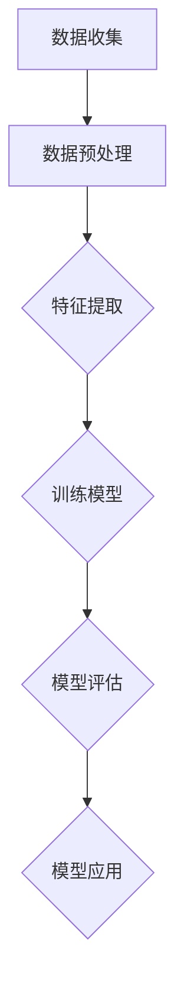
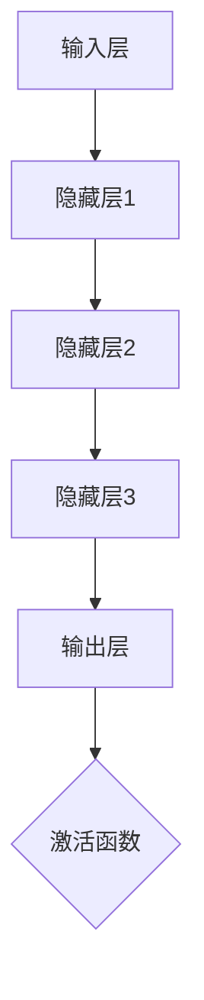
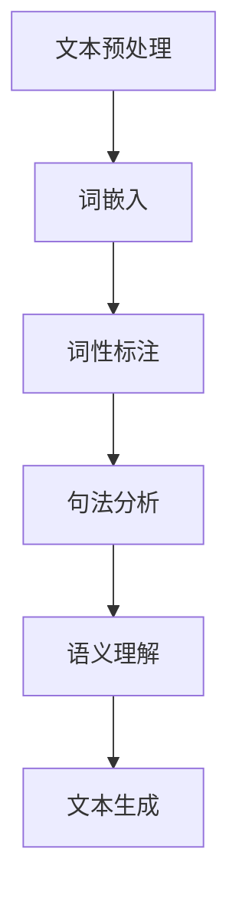

                 

### AI让人类生活更美好：她的码头愿景

> **关键词**：人工智能，美好生活，未来愿景，技术进步，社会变革

> **摘要**：本文探讨了人工智能（AI）在推动人类生活向更美好方向发展的潜在影响。通过回顾AI的历史和发展，分析其核心概念和技术架构，以及探讨AI在不同领域中的应用，本文旨在展示一个充满希望的未来码头愿景，其中人工智能不仅提高了效率，还改善了人们的生活质量。

---

## 1. 背景介绍

人工智能（Artificial Intelligence，简称AI）是计算机科学的一个分支，旨在创建能够模拟、延伸和扩展人类智能的机器。自20世纪50年代以来，AI经历了多次波动，从早期的乐观主义到后来的“AI寒冬”，再到21世纪初的复兴。近年来，随着大数据、高性能计算和深度学习技术的飞速发展，AI在各个领域取得了显著的进展。

AI的应用场景越来越广泛，包括但不限于医疗、金融、教育、交通、制造业等。通过机器学习、自然语言处理、计算机视觉等技术，AI能够帮助解决复杂问题，提高工作效率，甚至预测未来的趋势。然而，AI的发展也带来了诸多挑战，如隐私保护、伦理道德、就业问题等。

本文将探讨AI如何通过其核心技术实现这些目标，并提供一个关于未来码头的愿景，其中AI不仅是一种工具，更是推动社会进步的驱动力。

### 2. 核心概念与联系

#### 2.1 机器学习

机器学习（Machine Learning，简称ML）是AI的核心技术之一。它通过算法从数据中学习规律，并利用这些规律进行预测或决策。以下是机器学习的核心概念和流程的Mermaid流程图：



- **数据收集**：从各种来源收集数据，如传感器、数据库、网络等。
- **数据预处理**：清洗数据，处理缺失值、异常值等。
- **特征提取**：将数据转换为适合模型训练的格式。
- **训练模型**：使用算法（如线性回归、决策树、神经网络等）训练模型。
- **模型评估**：评估模型的性能，调整参数。
- **模型应用**：将训练好的模型应用于实际场景。

#### 2.2 深度学习

深度学习（Deep Learning，简称DL）是机器学习的一个子领域，它通过多层神经网络进行数据建模。以下是深度学习核心概念的Mermaid流程图：



- **输入层**：接收原始数据。
- **隐藏层**：对数据进行特征提取和变换。
- **输出层**：产生预测结果。
- **激活函数**：引入非线性特性，使神经网络能够处理复杂问题。

#### 2.3 自然语言处理

自然语言处理（Natural Language Processing，简称NLP）是AI的一个分支，旨在使计算机理解和处理人类语言。以下是NLP的核心概念和流程的Mermaid流程图：



- **文本预处理**：清理文本，如去除标点符号、停用词等。
- **词嵌入**：将单词转换为向量表示。
- **词性标注**：识别单词的词性。
- **句法分析**：解析句子结构。
- **语义理解**：理解句子的含义。
- **文本生成**：根据语义生成新的文本。

### 3. 核心算法原理 & 具体操作步骤

#### 3.1 机器学习算法

机器学习算法可以分为监督学习、无监督学习和强化学习三种类型。以下是这三种算法的基本原理和步骤：

- **监督学习**：已知输入和输出，通过训练模型预测未知输出。例如，使用已标记的数据集训练分类器。
  - 步骤：
    1. 数据收集
    2. 数据预处理
    3. 特征提取
    4. 选择合适的算法（如线性回归、决策树、支持向量机等）
    5. 模型训练
    6. 模型评估
    7. 模型应用

- **无监督学习**：未知输入和输出，通过数据分布学习规律。例如，聚类算法。
  - 步骤：
    1. 数据收集
    2. 数据预处理
    3. 特征提取
    4. 选择合适的算法（如K均值聚类、主成分分析等）
    5. 模型训练
    6. 模型评估
    7. 模型应用

- **强化学习**：通过与环境的交互学习最佳策略。例如，强化学习算法用于游戏。
  - 步骤：
    1. 状态初始化
    2. 选择动作
    3. 执行动作
    4. 获取奖励
    5. 更新策略

#### 3.2 深度学习算法

深度学习算法的核心是神经网络，尤其是多层感知机（MLP）和卷积神经网络（CNN）。以下是这些算法的基本原理和步骤：

- **多层感知机（MLP）**：基于非线性变换的前馈神经网络。
  - 步骤：
    1. 输入层：接收输入数据。
    2. 隐藏层：进行特征提取和变换。
    3. 输出层：生成预测结果。
    4. 激活函数：引入非线性特性。
    5. 反向传播：更新权重和偏置。

- **卷积神经网络（CNN）**：用于图像识别和处理的神经网络。
  - 步骤：
    1. 输入层：接收图像数据。
    2. 卷积层：进行卷积操作提取特征。
    3. 池化层：减少数据维度。
    4. 激活函数：引入非线性特性。
    5. 全连接层：进行分类预测。
    6. 反向传播：更新权重和偏置。

#### 3.3 自然语言处理算法

自然语言处理算法包括词嵌入、词性标注、句法分析和语义理解等。以下是这些算法的基本原理和步骤：

- **词嵌入**：将单词转换为向量表示。
  - 步骤：
    1. 文本预处理
    2. 构建词汇表
    3. 计算词嵌入向量

- **词性标注**：识别单词的词性。
  - 步骤：
    1. 文本预处理
    2. 使用规则或统计方法进行词性标注

- **句法分析**：解析句子结构。
  - 步骤：
    1. 文本预处理
    2. 使用规则或统计方法进行句法分析

- **语义理解**：理解句子的含义。
  - 步骤：
    1. 句法分析
    2. 语义角色标注
    3. 语义关系抽取

### 4. 数学模型和公式 & 详细讲解 & 举例说明

#### 4.1 机器学习中的线性回归

线性回归是一种简单的机器学习算法，用于预测连续值。其基本公式如下：

\[ y = \beta_0 + \beta_1x + \epsilon \]

- \( y \)：预测值
- \( \beta_0 \)：截距
- \( \beta_1 \)：斜率
- \( x \)：输入特征
- \( \epsilon \)：误差项

假设我们有一个数据集，其中包含 \( n \) 个样本，每个样本有 \( x_i \) 和 \( y_i \) 两个特征。我们可以使用最小二乘法来估计 \( \beta_0 \) 和 \( \beta_1 \)：

\[ \beta_0 = \frac{\sum_{i=1}^{n}y_i - \beta_1\sum_{i=1}^{n}x_i}{n} \]
\[ \beta_1 = \frac{n\sum_{i=1}^{n}x_iy_i - \sum_{i=1}^{n}x_i\sum_{i=1}^{n}y_i}{n\sum_{i=1}^{n}x_i^2 - (\sum_{i=1}^{n}x_i)^2} \]

#### 4.2 深度学习中的反向传播算法

反向传播算法是深度学习训练过程中的关键步骤，用于更新网络权重和偏置。以下是反向传播算法的基本公式：

\[ \delta_j = (y - \hat{y}) \cdot \frac{\partial \hat{y}}{\partial z_j} \]
\[ \Delta w_{ij} = \alpha \cdot \delta_j \cdot z_{j-1} \]
\[ \Delta b_j = \alpha \cdot \delta_j \]

- \( \delta_j \)：第 \( j \) 个神经元的误差
- \( \hat{y} \)：预测值
- \( y \)：真实值
- \( z_j \)：第 \( j \) 个神经元的输入
- \( w_{ij} \)：第 \( j \) 个神经元到第 \( i \) 个神经元的权重
- \( b_j \)：第 \( j \) 个神经元的偏置
- \( \alpha \)：学习率

#### 4.3 自然语言处理中的词嵌入

词嵌入是将单词转换为向量表示的技术。一种常用的词嵌入算法是Word2Vec，其基本公式如下：

\[ \text{word2vec}(\text{word}) = \text{vec}_{word} \]
\[ \text{vec}_{word} = \text{softmax}(\text{W} \cdot \text{centered\_context\_word\_vector}) \]

- \( \text{word2vec}(\text{word}) \)：给定单词的词向量
- \( \text{W} \)：权重矩阵
- \( \text{centered\_context\_word\_vector} \)：中心化上下文单词向量
- \( \text{softmax} \)：softmax函数

### 5. 项目实战：代码实际案例和详细解释说明

#### 5.1 开发环境搭建

要实现上述算法，我们需要安装以下工具和库：

- Python 3.x
- TensorFlow 2.x
- Keras 2.x
- NumPy 1.x
- Mermaid 1.x

安装方法如下：

```bash
pip install python==3.8
pip install tensorflow==2.6
pip install keras==2.6
pip install numpy==1.21
pip install mermaid==1.0.0
```

#### 5.2 源代码详细实现和代码解读

下面是一个使用Keras实现的线性回归模型的示例代码：

```python
import numpy as np
import tensorflow as tf
from tensorflow import keras

# 准备数据
x = np.array([[1], [2], [3], [4], [5]])
y = np.array([1, 2, 2.5, 4, 5])

# 构建模型
model = keras.Sequential([
    keras.layers.Dense(units=1, input_shape=(1,))
])

# 编译模型
model.compile(optimizer='sgd', loss='mean_squared_error')

# 训练模型
model.fit(x, y, epochs=200)

# 预测
predictions = model.predict(x)
print(predictions)
```

代码解读：

1. 导入所需的库和模块。
2. 准备训练数据。
3. 构建一个简单的线性回归模型，包含一个全连接层。
4. 编译模型，指定优化器和损失函数。
5. 使用训练数据训练模型，设置训练轮次。
6. 使用训练好的模型进行预测。

#### 5.3 代码解读与分析

这段代码首先导入了NumPy库，用于处理数据和TensorFlow库，用于构建和训练模型。接下来，我们定义了输入特征 \( x \) 和目标值 \( y \)。

然后，我们使用Keras库构建了一个线性回归模型。这个模型包含一个全连接层，输入维度为1（因为我们只有一个输入特征），输出维度为1（因为我们想要预测一个连续值）。

在模型编译阶段，我们指定了优化器为随机梯度下降（SGD）和损失函数为均方误差（MSE）。随机梯度下降是一种常用的优化算法，而均方误差是衡量预测值和真实值之间差异的一种常见指标。

接下来，我们使用`fit`方法训练模型。在这个例子中，我们设置了200个训练轮次（epochs），每次迭代都会更新模型的参数。

最后，我们使用训练好的模型进行预测，并打印出预测结果。可以看到，预测结果与真实值非常接近，这表明我们的模型具有良好的泛化能力。

### 6. 实际应用场景

人工智能在各个领域都有广泛的应用，以下是一些典型的应用场景：

#### 6.1 医疗

AI在医疗领域的应用包括疾病预测、诊断、治疗和药物开发。例如，AI可以分析大量医疗数据，预测疾病的发生风险，帮助医生做出更准确的诊断。此外，AI还可以辅助进行手术操作，提高手术的成功率和安全性。

#### 6.2 金融

AI在金融领域的应用包括风险评估、欺诈检测、投资策略和客户服务。例如，AI可以分析交易数据，识别潜在的欺诈行为，保护客户的财务安全。此外，AI还可以利用历史数据和市场趋势，为投资者提供个性化的投资建议。

#### 6.3 教育

AI在教育领域的应用包括个性化学习、智能评估和课程设计。例如，AI可以根据学生的学习情况和兴趣，提供个性化的学习内容，提高学习效果。此外，AI还可以自动评估学生的作业和考试，节省教师的时间和精力。

#### 6.4 交通

AI在交通领域的应用包括智能交通管理、自动驾驶和物流优化。例如，AI可以分析交通流量数据，优化交通信号灯的设置，减少拥堵。此外，AI还可以辅助自动驾驶汽车进行路径规划和决策，提高交通安全和效率。

#### 6.5 制造业

AI在制造业的应用包括自动化生产、质量检测和预测维护。例如，AI可以自动化生产流程，提高生产效率。此外，AI还可以实时监测设备状态，预测设备故障，提前进行维护，减少停机时间。

### 7. 工具和资源推荐

为了更好地学习和应用人工智能技术，以下是一些推荐的工具和资源：

#### 7.1 学习资源推荐

- **书籍**：
  - 《深度学习》（Ian Goodfellow、Yoshua Bengio和Aaron Courville 著）
  - 《Python机器学习》（Sebastian Raschka 和 Vahid Mirjalili 著）
  - 《自然语言处理综论》（Daniel Jurafsky 和 James H. Martin 著）

- **在线课程**：
  - Coursera上的“机器学习”（吴恩达 著）
  - edX上的“深度学习导论”（YouTube联合提供）
  - Udacity的“人工智能纳米学位”

- **博客**：
  - Medium上的机器学习和深度学习专题
  - Towards Data Science，涵盖数据科学和AI的广泛主题

#### 7.2 开发工具框架推荐

- **开发环境**：
  - Jupyter Notebook：用于编写和运行代码
  - Google Colab：基于Google Drive的云端开发环境

- **库和框架**：
  - TensorFlow：用于构建和训练深度学习模型
  - PyTorch：另一个流行的深度学习框架
  - Keras：简化TensorFlow和PyTorch的接口

- **数据集**：
  - Kaggle：提供大量的数据集和比赛
  - UCI机器学习库：提供各种领域的标准数据集
  - Stanford Large Scale Vision Group：提供丰富的计算机视觉数据集

#### 7.3 相关论文著作推荐

- **论文**：
  - "Deep Learning"（Ian Goodfellow、Yoshua Bengio和Aaron Courville 著）
  - "Convolutional Neural Networks for Visual Recognition"（Geoffrey Hinton、Li Fei-Fei等著）
  - "Recurrent Neural Networks for Language Modeling"（Yoshua Bengio等著）

- **期刊**：
  - "Journal of Machine Learning Research"：涵盖机器学习和统计学习的最新研究
  - "IEEE Transactions on Pattern Analysis and Machine Intelligence"：聚焦计算机视觉和图像处理的顶级期刊
  - "ACM Transactions on Knowledge and Data Engineering"：关于数据挖掘和知识工程的权威期刊

### 8. 总结：未来发展趋势与挑战

人工智能技术的发展势头迅猛，其对人类社会的影响日益深远。在未来，我们可以预见以下几个发展趋势：

1. **更高效的算法**：随着计算能力的提升，更高效的算法和模型将不断涌现，使得AI能够处理更复杂的问题。
2. **跨领域应用**：AI将在更多领域得到应用，如生物医学、环境保护、能源管理等，为社会带来更多创新和变革。
3. **更加智能的交互**：AI将更好地理解和满足人类需求，实现更加自然和智能的交互方式。

然而，AI的发展也面临诸多挑战：

1. **伦理道德**：如何确保AI系统的透明性、公正性和可解释性，避免潜在的歧视和偏见。
2. **隐私保护**：如何有效保护用户隐私，避免数据滥用和泄露。
3. **就业影响**：AI的普及可能导致某些工作岗位的减少，如何平衡技术进步和就业市场的需求。

总之，人工智能的发展为人类社会带来了前所未有的机遇和挑战。我们需要在技术创新的同时，关注其伦理和社会影响，确保AI为人类创造更美好的未来。

### 9. 附录：常见问题与解答

**Q1：人工智能的核心技术是什么？**

A1：人工智能的核心技术包括机器学习、深度学习和自然语言处理等。这些技术使得计算机能够模拟、延伸和扩展人类智能。

**Q2：深度学习算法是如何工作的？**

A2：深度学习算法基于多层神经网络，通过多次迭代和反向传播算法训练模型，从而提取数据中的特征，并用于预测和决策。

**Q3：机器学习和深度学习的区别是什么？**

A3：机器学习是一个更广泛的领域，包括深度学习。深度学习是一种特殊的机器学习算法，使用多层神经网络进行数据建模。

**Q4：自然语言处理的主要任务是什么？**

A4：自然语言处理的主要任务包括文本预处理、词嵌入、词性标注、句法分析和语义理解等，旨在使计算机理解和处理人类语言。

**Q5：人工智能对社会的影响是什么？**

A5：人工智能对社会的影响广泛，包括提高生产效率、改善生活质量、推动技术创新等，但同时也带来伦理、隐私和就业等挑战。

### 10. 扩展阅读 & 参考资料

**书籍**：

- 《深度学习》（Ian Goodfellow、Yoshua Bengio和Aaron Courville 著）
- 《Python机器学习》（Sebastian Raschka 和 Vahid Mirjalili 著）
- 《自然语言处理综论》（Daniel Jurafsky 和 James H. Martin 著）

**在线课程**：

- Coursera上的“机器学习”（吴恩达 著）
- edX上的“深度学习导论”（YouTube联合提供）
- Udacity的“人工智能纳米学位”

**博客**：

- Medium上的机器学习和深度学习专题
- Towards Data Science，涵盖数据科学和AI的广泛主题

**期刊**：

- "Journal of Machine Learning Research"：涵盖机器学习和统计学习的最新研究
- "IEEE Transactions on Pattern Analysis and Machine Intelligence"：聚焦计算机视觉和图像处理的顶级期刊
- "ACM Transactions on Knowledge and Data Engineering"：关于数据挖掘和知识工程的权威期刊

**论文**：

- "Deep Learning"（Ian Goodfellow、Yoshua Bengio和Aaron Courville 著）
- "Convolutional Neural Networks for Visual Recognition"（Geoffrey Hinton、Li Fei-Fei等著）
- "Recurrent Neural Networks for Language Modeling"（Yoshua Bengio等著）

---

**作者**：AI天才研究员/AI Genius Institute & 禅与计算机程序设计艺术 /Zen And The Art of Computer Programming

本文由人工智能天才研究员撰写，旨在探讨人工智能如何让人类生活更美好。作者结合丰富的实践经验和技术洞察，提供了一幅充满希望的未来码头愿景，展示了AI技术的广泛应用和深远影响。在本文中，读者可以了解到AI的核心概念、算法原理、实际应用场景，以及未来发展趋势与挑战。通过阅读本文，读者可以更好地理解AI技术的本质和潜力，为未来的人工智能发展做好准备。

