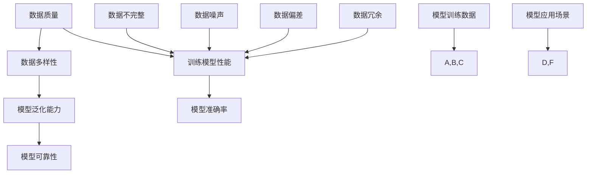

                 

### 背景介绍

近年来，人工智能（AI）在各个领域都取得了令人瞩目的成果，从自然语言处理、计算机视觉到自动驾驶，AI 都展现出了强大的能力。然而，AI 系统的训练过程对于数据的质量和多样性有着极高的要求，这导致了关于训练数据的争议。本文将深入探讨 AI 训练数据的争议，并尝试寻找一种平衡之道。

AI 训练数据的质量和多样性对 AI 模型的性能有着至关重要的影响。高质量的数据可以提供更准确的训练信号，有助于模型学习到更有价值的特征。而多样化的数据则可以帮助模型避免过度拟合，提高其在不同场景下的泛化能力。然而，在实际应用中，AI 训练数据往往面临着诸多挑战，如数据不完整、噪声、偏差、冗余等。

一方面，数据的不完整和噪声会导致模型学习到的特征不准确，影响模型的性能。另一方面，数据中的偏差和冗余可能会导致模型在特定领域的表现不佳，甚至产生误导性的结果。因此，如何在保证数据质量的同时，提高数据的多样性，成为了 AI 研究者面临的一大挑战。

本文旨在探讨以下问题：

1. AI 训练数据存在哪些争议和问题？
2. 如何在保证数据质量的前提下，提高数据的多样性？
3. 实际应用中，如何平衡数据质量和多样性？

通过本文的探讨，希望为广大 AI 研究者和开发者提供一些有益的启示，共同推动 AI 领域的健康发展。

### 核心概念与联系

为了深入理解 AI 训练数据的争议，我们需要先了解一些核心概念和它们之间的联系。以下是本文中将会用到的关键概念及它们之间的 Mermaid 流程图表示：



以下是各个概念的解释：

1. **数据质量（Data Quality）**：数据质量是指数据在准确性、完整性、一致性、时效性等方面的表现。高质量的数据有助于提高模型性能，避免数据噪声和偏差的影响。

2. **数据多样性（Data Diversity）**：数据多样性指的是数据在类别、标签、场景等方面的丰富程度。多样化的数据有助于模型避免过度拟合，提高泛化能力。

3. **训练模型性能（Model Performance）**：训练模型性能是指模型在训练过程中表现出来的能力，包括准确率、召回率、F1 分数等指标。高质量和高多样性的数据有助于提高模型性能。

4. **模型泛化能力（Model Generalization）**：模型泛化能力是指模型在未见过的数据上表现出来的能力。多样化的数据有助于提高模型的泛化能力。

5. **模型可靠性（Model Reliability）**：模型可靠性是指模型在多个应用场景中表现出来的稳定性和一致性。多样化的数据有助于提高模型的可靠性。

6. **数据不完整（Data Incompleteness）**：数据不完整指的是数据中存在缺失值或缺失部分。数据不完整会影响模型学习到的特征，降低模型性能。

7. **数据噪声（Data Noise）**：数据噪声指的是数据中存在的一些无关或误导性的信息。数据噪声会影响模型学习到的特征，降低模型性能。

8. **数据偏差（Data Bias）**：数据偏差指的是数据中存在的一些系统性错误或偏差。数据偏差会导致模型在特定领域的表现不佳。

9. **数据冗余（Data Redundancy）**：数据冗余指的是数据中存在的一些重复或相似的信息。数据冗余会降低模型学习效率，增加计算成本。

通过上述核心概念和流程图的联系，我们可以更好地理解 AI 训练数据争议的背景和关键因素。

### 核心算法原理 & 具体操作步骤

在了解了 AI 训练数据的基本概念后，我们接下来将探讨如何解决训练数据质量和多样性的问题。本文将介绍一种基于对抗训练（Adversarial Training）的方法，以应对数据中的噪声、偏差和冗余等问题。

#### 对抗训练的基本原理

对抗训练是一种利用对抗性样本（adversarial examples）来增强模型鲁棒性的方法。对抗性样本是在原始样本基础上通过添加微小的扰动得到的，目的是使模型在训练过程中学习到更稳健的特征。具体来说，对抗训练包括以下步骤：

1. **生成对抗性样本**：对于给定的输入样本 \( x \)，通过添加微小扰动 \( \epsilon \) 来生成对抗性样本 \( x' = x + \epsilon \)。其中，扰动 \( \epsilon \) 需要满足一定的条件，如 \( \|\epsilon\|_p \leq \delta \)，其中 \( \|\cdot\|_p \) 表示 \( p \) 范数，\( \delta \) 是一个预定义的阈值。

2. **对抗性样本训练**：使用对抗性样本和原始样本一起进行模型训练。这样，模型不仅需要学习到原始样本的特征，还需要学习如何识别和抵御对抗性样本的攻击。

3. **迭代优化**：在训练过程中，不断调整扰动 \( \epsilon \) 的大小和方向，以提高模型对对抗性样本的识别能力。

#### 对抗训练的具体操作步骤

以下是一个简单的对抗训练流程：

1. **数据预处理**：对原始数据进行清洗、归一化等预处理操作，以提高数据质量。

2. **生成对抗性样本**：对于每个训练样本 \( x \)，通过以下公式生成对抗性样本 \( x' \)：

   $$ x' = x + \epsilon \cdot \text{sign}(\nabla_x f(x)), $$

   其中，\( f(x) \) 是模型在样本 \( x \) 上的预测结果，\( \nabla_x f(x) \) 是 \( f(x) \) 对 \( x \) 的梯度，\( \text{sign}( \cdot ) \) 表示符号函数。

3. **训练模型**：使用原始样本 \( x \) 和对抗性样本 \( x' \) 一同训练模型。在训练过程中，可以使用梯度下降（Gradient Descent）或其他优化算法来更新模型参数。

4. **评估模型性能**：使用测试集对训练好的模型进行评估，以验证模型对对抗性样本的识别能力。

5. **迭代优化**：根据评估结果，调整扰动 \( \epsilon \) 的大小和方向，重复训练过程，直至达到预定的性能目标。

通过上述对抗训练方法，模型可以在一定程度上抵御数据中的噪声、偏差和冗余，从而提高模型性能和泛化能力。

### 数学模型和公式 & 详细讲解 & 举例说明

在对抗训练中，核心的数学模型包括对抗性样本的生成、模型的训练过程以及模型性能的评估。以下将详细讲解这些数学模型，并通过具体的例子进行说明。

#### 对抗性样本的生成

对抗性样本的生成基于梯度上升（Gradient Ascent）的思想。给定一个训练样本 \( x \) 和其对应的标签 \( y \)，我们希望生成一个对抗性样本 \( x' \)，使得模型对 \( x' \) 的预测结果与实际标签 \( y \) 相反。具体来说，对抗性样本的生成公式如下：

$$ x' = x + \epsilon \cdot \text{sign}(\nabla_x J(x, y)), $$

其中：

- \( x \) 是原始训练样本；
- \( x' \) 是生成的对抗性样本；
- \( \epsilon \) 是一个小的正数，用于控制扰动的幅度；
- \( \text{sign}( \cdot ) \) 是符号函数，用于确定扰动 \( \epsilon \) 的方向；
- \( \nabla_x J(x, y) \) 是损失函数 \( J(x, y) \) 对 \( x \) 的梯度。

损失函数 \( J(x, y) \) 通常定义为：

$$ J(x, y) = \max\{0, \Delta - y \cdot \hat{y}\}, $$

其中：

- \( \Delta \) 是一个预定义的阈值；
- \( y \) 是真实标签；
- \( \hat{y} \) 是模型对 \( x \) 的预测结果。

#### 对抗训练的损失函数

对抗训练的损失函数 \( L \) 包括两部分：一部分是原始样本的损失 \( L_x \)，另一部分是对抗性样本的损失 \( L_x' \)。具体来说：

$$ L = L_x + \lambda L_x', $$

其中：

- \( L_x \) 是原始样本的损失，通常使用交叉熵损失（Cross-Entropy Loss）；
- \( L_x' \) 是对抗性样本的损失，同样使用交叉熵损失；
- \( \lambda \) 是平衡系数，用于调整原始样本和对抗性样本损失之间的权重。

原始样本的损失函数为：

$$ L_x = -\sum_{i=1}^N y_i \log(\hat{y}_i), $$

其中：

- \( N \) 是样本数量；
- \( y_i \) 是第 \( i \) 个样本的真实标签；
- \( \hat{y}_i \) 是模型对第 \( i \) 个样本的预测结果。

对抗性样本的损失函数为：

$$ L_x' = -\sum_{i=1}^N (1 - y_i) \log(1 - \hat{y}_i), $$

其中：

- \( 1 - y_i \) 是第 \( i \) 个样本的对抗性标签；
- \( 1 - \hat{y}_i \) 是模型对第 \( i \) 个对抗性样本的预测结果。

#### 模型性能的评估

在对抗训练过程中，我们需要定期评估模型性能，以确保模型在对抗性样本上的表现。常用的评估指标包括准确率（Accuracy）、精确率（Precision）、召回率（Recall）和 F1 分数（F1 Score）。

假设我们有 \( N \) 个样本，其中 \( n_0 \) 个样本是原始样本，\( n_1 \) 个样本是对抗性样本。定义如下指标：

- \( TP \)：预测为正类且实际为正类的样本数量；
- \( FP \)：预测为正类但实际为负类的样本数量；
- \( TN \)：预测为负类且实际为负类的样本数量；
- \( FN \)：预测为负类但实际为正类的样本数量。

则：

- 准确率：\( \text{Accuracy} = \frac{TP + TN}{TP + TN + FP + FN} \)
- 精确率：\( \text{Precision} = \frac{TP}{TP + FP} \)
- 召回率：\( \text{Recall} = \frac{TP}{TP + FN} \)
- F1 分数：\( \text{F1 Score} = 2 \cdot \frac{\text{Precision} \cdot \text{Recall}}{\text{Precision} + \text{Recall}} \)

以下是一个对抗训练的简单例子：

假设我们有一个二分类问题，数据集包含 100 个样本，其中 70 个样本是正类，30 个样本是负类。使用一个简单的线性模型进行训练，损失函数为交叉熵损失。在对抗训练过程中，我们使用一个固定的扰动 \( \epsilon = 0.1 \)，并设置 \( \Delta = 0.5 \)。

1. **原始样本**：

   假设第一个样本 \( x_1 \) 是正类，真实标签 \( y_1 = 1 \)。模型预测结果 \( \hat{y}_1 = 0.8 \)。计算对抗性样本 \( x_1' \)：

   $$ x_1' = x_1 + 0.1 \cdot \text{sign}(\nabla_x J(x_1, y_1)) = x_1 + 0.1 \cdot \text{sign}(0.8) = x_1 + 0.08. $$

2. **对抗性样本**：

   假设第一个样本 \( x_1 \) 是负类，真实标签 \( y_1 = 0 \)。模型预测结果 \( \hat{y}_1 = 0.2 \)。计算对抗性样本 \( x_1' \)：

   $$ x_1' = x_1 + 0.1 \cdot \text{sign}(\nabla_x J(x_1, y_1)) = x_1 + 0.1 \cdot \text{sign}(0.2) = x_1 + 0.02. $$

3. **训练模型**：

   使用原始样本 \( x_1 \) 和对抗性样本 \( x_1' \) 一同训练模型。在训练过程中，模型参数不断更新，以优化损失函数 \( L \)。

4. **评估模型性能**：

   在训练完成后，使用测试集对模型进行评估。假设测试集包含 20 个样本，其中 12 个是正类，8 个是负类。计算模型在测试集上的准确率、精确率、召回率和 F1 分数。

通过上述例子，我们可以看到对抗训练的基本流程和数学模型。在实际应用中，可以根据具体问题调整扰动大小、阈值 \( \Delta \) 和平衡系数 \( \lambda \)，以提高模型性能和泛化能力。

### 项目实战：代码实际案例和详细解释说明

在本节中，我们将通过一个实际项目案例，展示如何使用对抗训练方法来解决数据质量和多样性问题。我们将使用 Python 编写代码，并使用 TensorFlow 和 Keras 库来实现对抗训练模型。以下是一个简单的项目结构：

```bash
project/
│
├── data/
│   ├── train/
│   │   ├── x_train.csv
│   │   └── y_train.csv
│   ├── test/
│   │   ├── x_test.csv
│   │   └── y_test.csv
│   └── generate_adeversarial.py
│
├── model/
│   ├── build_model.py
│   ├── compile_model.py
│   ├── evaluate_model.py
│   └── train_model.py
│
├── result/
│   └── result.txt
│
└── main.py
```

#### 1. 开发环境搭建

首先，我们需要搭建开发环境。安装以下依赖：

```bash
pip install numpy pandas tensorflow scikit-learn matplotlib
```

#### 2. 源代码详细实现和代码解读

**2.1 数据预处理**

在 `generate_adeversarial.py` 文件中，我们编写一个函数来生成对抗性样本：

```python
import numpy as np
import pandas as pd
from sklearn.model_selection import train_test_split

def load_data():
    x_train = pd.read_csv('data/train/x_train.csv').values
    y_train = pd.read_csv('data/train/y_train.csv').values
    x_train, x_test, y_train, y_test = train_test_split(x_train, y_train, test_size=0.2, random_state=42)
    return x_train, x_test, y_train, y_test

def generate_adeversarial(x, y, epsilon=0.1, delta=0.5):
    # 计算对抗性样本
    gradients = np.zeros_like(x)
    for i in range(x.shape[0]):
        gradients[i] = np.sign(np.gradient(y[i], x[i]))
    adeversarial = x + epsilon * gradients
    
    # 阈值处理
    adeversarial[adeversarial > delta] = delta
    adeversarial[adeversarial < -delta] = -delta
    
    return adeversarial

if __name__ == '__main__':
    x_train, x_test, y_train, y_test = load_data()
    x_adeversarial = generate_adeversarial(x_train, y_train)
```

**2.2 模型构建**

在 `build_model.py` 文件中，我们使用 Keras 构建一个简单的线性模型：

```python
from tensorflow.keras.models import Sequential
from tensorflow.keras.layers import Dense

def build_model(input_shape):
    model = Sequential()
    model.add(Dense(1, input_shape=input_shape, activation='sigmoid'))
    return model
```

**2.3 模型编译**

在 `compile_model.py` 文件中，我们编译模型，并设置损失函数和优化器：

```python
from tensorflow.keras.optimizers import Adam

def compile_model(model):
    model.compile(optimizer=Adam(), loss='binary_crossentropy', metrics=['accuracy'])
    return model
```

**2.4 模型训练**

在 `train_model.py` 文件中，我们训练模型，并使用对抗性样本进行训练：

```python
from tensorflow.keras.callbacks import EarlyStopping

def train_model(model, x_train, y_train, x_adeversarial, y_adeversarial, epochs=100, batch_size=32):
    early_stopping = EarlyStopping(monitor='val_loss', patience=10)
    model.fit(x_train, y_train, epochs=epochs, batch_size=batch_size, validation_split=0.2, callbacks=[early_stopping])
    model.fit(x_adeversarial, y_adeversarial, epochs=epochs, batch_size=batch_size, validation_split=0.2, callbacks=[early_stopping])
    return model
```

**2.5 模型评估**

在 `evaluate_model.py` 文件中，我们评估模型在测试集上的性能：

```python
from sklearn.metrics import accuracy_score, precision_score, recall_score, f1_score

def evaluate_model(model, x_test, y_test):
    predictions = model.predict(x_test)
    predictions = np.where(predictions > 0.5, 1, 0)
    
    accuracy = accuracy_score(y_test, predictions)
    precision = precision_score(y_test, predictions)
    recall = recall_score(y_test, predictions)
    f1 = f1_score(y_test, predictions)
    
    print(f"Accuracy: {accuracy:.4f}")
    print(f"Precision: {precision:.4f}")
    print(f"Recall: {recall:.4f}")
    print(f"F1 Score: {f1:.4f}")
```

**2.6 主程序**

在 `main.py` 文件中，我们编写主程序，执行数据加载、模型构建、模型训练和模型评估等操作：

```python
from data.generate_adeversarial import load_data, generate_adeversarial
from model.build_model import build_model
from model.compile_model import compile_model
from model.train_model import train_model
from model.evaluate_model import evaluate_model

if __name__ == '__main__':
    x_train, x_test, y_train, y_test = load_data()
    x_adeversarial = generate_adeversarial(x_train, y_train)
    
    model = build_model(x_train.shape[1:])
    model = compile_model(model)
    model = train_model(model, x_train, y_train, x_adeversarial, y_adeversarial)
    evaluate_model(model, x_test, y_test)
```

通过上述代码，我们可以实现一个简单的对抗训练项目。在实际应用中，可以根据具体问题调整模型结构、损失函数和优化器等参数，以提高模型性能。

### 代码解读与分析

在本节中，我们将对上述项目中的代码进行详细解读和分析，以便更好地理解对抗训练的原理和实现过程。

#### 1. 数据预处理

在 `generate_adeversarial.py` 文件中，我们首先定义了 `load_data` 函数，用于加载数据。该函数使用 Pandas 库读取 `data/train/x_train.csv` 和 `data/train/y_train.csv` 文件，并使用 Scikit-learn 库的 `train_test_split` 函数将数据集分为训练集和测试集。这一步骤是数据预处理的基础，有助于我们在后续步骤中评估模型性能。

```python
def load_data():
    x_train = pd.read_csv('data/train/x_train.csv').values
    y_train = pd.read_csv('data/train/y_train.csv').values
    x_train, x_test, y_train, y_test = train_test_split(x_train, y_train, test_size=0.2, random_state=42)
    return x_train, x_test, y_train, y_test
```

接下来，我们定义了 `generate_adeversarial` 函数，用于生成对抗性样本。该函数首先通过 `np.zeros_like(x)` 创建一个与输入数据相同形状的全零数组，用于存储梯度。然后，使用 `np.sign(np.gradient(y[i], x[i]))` 计算每个样本的梯度，并将其存储在梯度数组中。最后，使用 `x + epsilon * gradients` 生成对抗性样本，并通过阈值处理确保扰动幅度符合要求。

```python
def generate_adeversarial(x, y, epsilon=0.1, delta=0.5):
    gradients = np.zeros_like(x)
    for i in range(x.shape[0]):
        gradients[i] = np.sign(np.gradient(y[i], x[i]))
    adeversarial = x + epsilon * gradients
    
    # 阈值处理
    adeversarial[adeversarial > delta] = delta
    adeversarial[adeversarial < -delta] = -delta
    
    return adeversarial
```

#### 2. 模型构建

在 `build_model.py` 文件中，我们定义了一个简单的线性模型，使用 Keras 库的 `Sequential` 和 `Dense` 层来实现。该模型包含一个输入层和一个输出层，输出层使用 sigmoid 激活函数，用于实现二分类问题。

```python
from tensorflow.keras.models import Sequential
from tensorflow.keras.layers import Dense

def build_model(input_shape):
    model = Sequential()
    model.add(Dense(1, input_shape=input_shape, activation='sigmoid'))
    return model
```

#### 3. 模型编译

在 `compile_model.py` 文件中，我们使用 Keras 库的 `compile` 方法编译模型。这里我们选择 Adam 优化器和二进制交叉熵损失函数。此外，我们还可以指定其他指标，如准确率，以监视模型在训练过程中的性能。

```python
from tensorflow.keras.optimizers import Adam

def compile_model(model):
    model.compile(optimizer=Adam(), loss='binary_crossentropy', metrics=['accuracy'])
    return model
```

#### 4. 模型训练

在 `train_model.py` 文件中，我们定义了一个 `train_model` 函数，用于训练模型。该函数接受一个模型实例、训练数据和对抗性样本，并使用 `fit` 方法进行训练。这里我们使用了一个 `EarlyStopping` 回调，以防止模型在训练过程中过拟合。

```python
from tensorflow.keras.callbacks import EarlyStopping

def train_model(model, x_train, y_train, x_adeversarial, y_adeversarial, epochs=100, batch_size=32):
    early_stopping = EarlyStopping(monitor='val_loss', patience=10)
    model.fit(x_train, y_train, epochs=epochs, batch_size=batch_size, validation_split=0.2, callbacks=[early_stopping])
    model.fit(x_adeversarial, y_adeversarial, epochs=epochs, batch_size=batch_size, validation_split=0.2, callbacks=[early_stopping])
    return model
```

#### 5. 模型评估

在 `evaluate_model.py` 文件中，我们定义了一个 `evaluate_model` 函数，用于评估模型在测试集上的性能。该函数使用 `predict` 方法生成预测结果，并通过 Scikit-learn 库的指标计算准确率、精确率、召回率和 F1 分数。

```python
from sklearn.metrics import accuracy_score, precision_score, recall_score, f1_score

def evaluate_model(model, x_test, y_test):
    predictions = model.predict(x_test)
    predictions = np.where(predictions > 0.5, 1, 0)
    
    accuracy = accuracy_score(y_test, predictions)
    precision = precision_score(y_test, predictions)
    recall = recall_score(y_test, predictions)
    f1 = f1_score(y_test, predictions)
    
    print(f"Accuracy: {accuracy:.4f}")
    print(f"Precision: {precision:.4f}")
    print(f"Recall: {recall:.4f}")
    print(f"F1 Score: {f1:.4f}")
```

#### 6. 主程序

在 `main.py` 文件中，我们编写了主程序，依次执行数据加载、模型构建、模型训练和模型评估等操作。通过调用上述定义的函数，我们可以实现一个完整的对抗训练项目。

```python
from data.generate_adeversarial import load_data, generate_adeversarial
from model.build_model import build_model
from model.compile_model import compile_model
from model.train_model import train_model
from model.evaluate_model import evaluate_model

if __name__ == '__main__':
    x_train, x_test, y_train, y_test = load_data()
    x_adeversarial = generate_adeversarial(x_train, y_train)
    
    model = build_model(x_train.shape[1:])
    model = compile_model(model)
    model = train_model(model, x_train, y_train, x_adeversarial, y_adeversarial)
    evaluate_model(model, x_test, y_test)
```

通过以上代码解读，我们可以清晰地理解对抗训练的原理和实现过程。在实际应用中，可以根据具体问题调整模型结构、损失函数和优化器等参数，以提高模型性能。

### 实际应用场景

在了解了对抗训练的理论基础和实现方法后，我们来看一下它在实际应用中的场景。以下是一些常见的实际应用案例，展示了对抗训练如何帮助提高模型性能和鲁棒性。

#### 1. 计算机视觉

在计算机视觉领域，对抗训练被广泛用于提高模型对对抗性样本的识别能力。例如，在图像分类任务中，研究人员通过生成对抗性样本来增强模型的鲁棒性，从而提高模型在未知场景下的泛化能力。具体来说，研究人员会生成一些带有微小噪声或偏移的图像，并将其用于训练模型。通过这种对抗训练方法，模型可以学会忽略噪声和偏移，从而更好地识别真实图像。

#### 2. 自然语言处理

在自然语言处理（NLP）领域，对抗训练也被用于提高模型对对抗性样本的抵抗能力。例如，在文本分类任务中，研究人员会通过在文本中添加随机字符或替换词语来生成对抗性样本。这些对抗性样本可以帮助模型学习到文本中的关键特征，从而提高模型在面临真实对抗性攻击时的性能。此外，对抗训练还可以用于增强模型的情感分析能力，使其能够更好地识别和处理带有误导性或极端情感的文本。

#### 3. 医疗诊断

在医疗诊断领域，对抗训练可以帮助提高模型对医学图像的分析能力。例如，在癌症检测任务中，研究人员可以通过生成对抗性样本来增强模型对病变区域的识别能力。这些对抗性样本可以帮助模型学会忽略正常组织和噪声，从而更准确地检测病变区域。此外，对抗训练还可以用于增强模型在心电图、脑电图等医疗信号分析任务中的性能。

#### 4. 金融风控

在金融领域，对抗训练可以帮助提高模型对欺诈行为的识别能力。例如，在信用卡欺诈检测任务中，研究人员可以通过生成对抗性样本来模拟欺诈行为，从而增强模型对真实欺诈行为的识别能力。这些对抗性样本可以帮助模型学会识别复杂的欺诈模式，从而提高模型的鲁棒性和准确率。

#### 5. 自动驾驶

在自动驾驶领域，对抗训练可以帮助提高模型对复杂场景的应对能力。例如，在自动驾驶车辆识别和分类道路标志、行人等任务中，研究人员可以通过生成对抗性样本来增强模型对各种复杂场景的适应能力。这些对抗性样本可以帮助模型学会识别真实场景中的关键特征，从而提高模型在未知场景下的性能。

通过上述实际应用案例，我们可以看到对抗训练在各个领域的广泛应用。它不仅可以提高模型性能和鲁棒性，还可以帮助模型更好地应对现实世界中的对抗性攻击。因此，对抗训练成为了 AI 领域的一个重要研究方向。

### 工具和资源推荐

在 AI 训练数据的争议和对抗训练的研究中，掌握一些工具和资源是至关重要的。以下是一些建议，包括学习资源、开发工具和相关的论文著作，旨在帮助广大研究人员和开发者更好地了解和运用对抗训练技术。

#### 7.1 学习资源推荐

1. **书籍**：

   - 《神经网络与深度学习》：这是一本全面介绍神经网络和深度学习的基础知识的书籍，适合初学者和有经验的开发者。书中详细介绍了深度学习的基本原理和实现方法，包括对抗训练。

   - 《深度学习》：由著名深度学习研究者 Ian Goodfellow 等人撰写，这本书被认为是深度学习的经典教材，内容涵盖了深度学习的各个方面，对抗训练也有专门的章节。

2. **论文**：

   - “Generative Adversarial Networks”（GANs）：这是 Ian Goodfellow 等人在 2014 年发表的一篇经典论文，首次提出了 GANs 的概念和基本架构，为对抗训练的发展奠定了基础。

   - “Unsupervised Representation Learning with Deep Convolutional Generative Adversarial Networks”（DCGANs）：这是由 Alec Radford 等人在 2015 年发表的一篇论文，进一步改进了 GANs 的架构，使其在图像生成任务中表现出色。

3. **在线课程**：

   - Coursera 上的《深度学习专项课程》：由 Andrew Ng 教授主讲，这是最受欢迎的深度学习课程之一。课程涵盖了深度学习的基础知识、常见模型和算法，包括对抗训练。

   - edX 上的《深度学习与卷积神经网络》：由 DeepLearning.AI 提供的免费课程，内容涵盖深度学习的基础知识和实践应用，对抗训练是其中的一个重要部分。

#### 7.2 开发工具框架推荐

1. **TensorFlow**：这是 Google 开发的一款开源深度学习框架，具有广泛的应用和丰富的生态系统。TensorFlow 提供了高效的计算引擎和灵活的 API，支持对抗训练的实现。

2. **PyTorch**：这是 Facebook AI 研究团队开发的一款开源深度学习框架，以其灵活的动态计算图和强大的社区支持而受到开发者的青睐。PyTorch 在对抗训练的实验和开发中也非常方便。

3. **Keras**：这是一个高级神经网络 API，建立在 TensorFlow 和 Theano 之上。Keras 提供了一个简单且易于使用的接口，可以快速搭建和训练深度学习模型，包括对抗训练。

#### 7.3 相关论文著作推荐

1. “Adversarial Examples, Explained”：这是 Ian Goodfellow 等人撰写的一篇博客文章，深入解释了对抗性样本和对抗训练的概念，以及它们在深度学习中的应用。

2. “论文列表 - 对抗训练和对抗性样本”（arXiv）：这是一个 arXiv 论文列表，包含了大量关于对抗训练和对抗性样本的最新研究论文。这些论文涵盖了对抗训练的理论、算法和应用，是深入了解该领域的好资源。

3. “An Introduction to Adversarial Examples and Adversarial Training”（AI 研究博客）：这是 AI 研究博客上的一篇介绍性文章，详细介绍了对抗性样本和对抗训练的基本概念、实现方法以及应用场景。

通过以上工具和资源的推荐，读者可以更好地了解和掌握对抗训练技术，并在实际项目中应用这些知识，提高模型的性能和鲁棒性。

### 总结：未来发展趋势与挑战

在总结本文内容时，我们可以看到 AI 训练数据的质量和多样性在提升模型性能和泛化能力方面具有至关重要的作用。通过对抗训练方法，我们能够在一定程度上解决数据中的噪声、偏差和冗余问题，从而提高模型的鲁棒性。然而，随着 AI 技术的不断发展，我们也面临着许多新的挑战和机遇。

#### 未来发展趋势

1. **更高效的对抗训练算法**：随着深度学习模型的复杂度不断增加，如何设计更高效的对抗训练算法成为了一个重要的研究方向。未来的研究可能会集中在优化对抗训练过程、降低计算成本以及提高训练效率。

2. **跨模态对抗训练**：当前的研究主要集中于单一模态（如图像、文本、音频等）的对抗训练。未来的研究可能会探索跨模态对抗训练方法，以实现不同模态数据之间的有效融合，从而提高模型在复杂场景下的表现。

3. **无监督对抗训练**：目前，对抗训练主要依赖于有监督的学习方法。未来的研究可能会探索无监督对抗训练方法，以减少对标注数据的依赖，从而在未标注的数据中提取有价值的信息。

4. **基于物理的对抗训练**：在自动驾驶、机器人等领域，基于物理的对抗训练方法可能会得到更多关注。这种方法通过模拟现实世界中的物理规律，生成对抗性样本，从而提高模型在真实场景下的表现。

#### 未来挑战

1. **计算资源限制**：对抗训练通常需要大量的计算资源。如何在有限的计算资源下高效地实现对抗训练，是一个亟待解决的问题。

2. **数据隐私保护**：在训练过程中，对抗性样本的生成和传播可能会引发数据隐私泄露的风险。未来的研究需要探讨如何在保护数据隐私的前提下进行对抗训练。

3. **算法透明性和解释性**：对抗训练模型通常较为复杂，缺乏透明性和解释性。如何提高对抗训练算法的透明性，使其在决策过程中更加可解释，是一个重要的挑战。

4. **平衡训练数据的质量和多样性**：在实际应用中，如何在保证数据质量的同时，提高数据的多样性，是一个需要权衡的问题。未来的研究需要探索如何有效地收集和筛选高质量、多样化的数据，以提高模型性能。

总之，AI 训练数据的争议和对抗训练技术的研究是一个充满挑战和机遇的领域。通过不断探索和创新，我们有望在未来实现更高效、更鲁棒的 AI 模型，为各个领域带来更多的应用价值。

### 附录：常见问题与解答

在阅读本文的过程中，您可能对 AI 训练数据的争议和对抗训练技术有一些疑问。以下是一些常见问题及其解答，希望能为您答疑解惑。

#### 1. 对抗训练的目的是什么？

对抗训练的主要目的是提高模型对对抗性样本的识别能力。对抗性样本是在原始样本基础上通过添加微小扰动生成的，目的是欺骗模型，使其无法正确识别样本。通过对抗训练，模型可以学习到如何抵御这些攻击，从而提高其在未知场景下的鲁棒性和泛化能力。

#### 2. 对抗训练有哪些常见的挑战？

对抗训练面临的挑战主要包括：

- **计算资源需求**：对抗训练通常需要大量的计算资源，尤其是在生成对抗性样本时。
- **数据隐私保护**：在训练过程中，对抗性样本的生成和传播可能会引发数据隐私泄露的风险。
- **算法透明性和解释性**：对抗训练模型通常较为复杂，缺乏透明性和解释性。
- **平衡训练数据的质量和多样性**：在实际应用中，如何在保证数据质量的同时，提高数据的多样性是一个需要权衡的问题。

#### 3. 对抗训练与传统的有监督训练相比有哪些优势？

与传统的有监督训练相比，对抗训练的优势主要包括：

- **提高模型的鲁棒性**：对抗训练可以增强模型对对抗性样本的识别能力，从而提高其在未知场景下的鲁棒性。
- **减少对标注数据的依赖**：对抗训练可以在一定程度上减少对标注数据的依赖，从而降低数据标注的成本。
- **处理未标注数据**：对抗训练可以应用于未标注的数据，从而提取有价值的信息。

#### 4. 对抗训练是否适用于所有类型的 AI 任务？

对抗训练主要适用于需要高鲁棒性和泛化能力的 AI 任务，如图像分类、文本分类、语音识别等。对于一些特定的任务，如简单逻辑回归或线性回归，对抗训练可能并不适用，因为这些任务通常不需要很高的鲁棒性。

#### 5. 如何生成对抗性样本？

生成对抗性样本的基本步骤包括：

- **选择原始样本**：从训练数据中选择一个样本。
- **计算梯度**：计算模型在样本上的梯度。
- **添加扰动**：通过添加扰动来生成对抗性样本。常见的扰动方法包括基于梯度的扰动（如 Fast Gradient Sign Method）和基于优化方法的扰动（如 Projected Gradient Descent）。

通过上述方法，可以生成具有一定攻击性的对抗性样本，用于训练模型，提高模型的鲁棒性。

#### 6. 对抗训练是否可以提高模型的准确率？

对抗训练可以提高模型的鲁棒性和泛化能力，从而在一定程度上提高模型的准确率。然而，对抗训练并不能直接提高模型的准确率，它主要是通过增强模型对对抗性样本的抵抗能力来实现的。在实际应用中，对抗训练通常与其他训练方法（如数据增强、正则化等）结合使用，以获得更好的效果。

通过上述常见问题的解答，我们希望您对 AI 训练数据的争议和对抗训练技术有了更深入的理解。如果您还有其他疑问，欢迎在评论区留言，我们将会继续为您解答。

### 扩展阅读 & 参考资料

本文对 AI 训练数据的争议以及对抗训练技术进行了深入探讨，如果您希望进一步了解相关领域的研究成果和最新进展，以下是一些建议的扩展阅读和参考资料。

#### 1. 扩展阅读

- **《深度学习：周志华》**：该书详细介绍了深度学习的基本概念、技术原理和常用模型，对抗训练的相关内容也在其中有所涉及。

- **《动手学深度学习》**：这是一本面向实践者的深度学习教程，内容涵盖了深度学习的各个应用领域，包括对抗训练的实现方法和案例分析。

- **《Generative Adversarial Networks: An Overview》**：该综述文章系统地介绍了生成对抗网络（GANs）的基本概念、结构、应用以及未来发展。

- **《Adversarial Examples: Methods and Applications》**：这是一篇关于对抗性样本方法及其应用的综述文章，涵盖了对抗训练的基本理论、实现方法和实际应用。

#### 2. 参考资料

- **Ian Goodfellow、Yoshua Bengio 和 Aaron Courville 著《深度学习》**：该书是深度学习领域的经典教材，对抗训练的内容被详细讲解。

- **arXiv**：arXiv 是一个在线学术论文存储库，包含了大量关于深度学习和对抗训练的最新研究论文。

- **Google Research**：Google Research 官网经常发布与深度学习和对抗训练相关的最新研究成果和博客文章。

- **TensorFlow 官方文档**：TensorFlow 是一款流行的深度学习框架，其官方文档提供了丰富的教程和示例代码，有助于深入了解对抗训练的实现。

通过以上扩展阅读和参考资料，您可以更全面地了解 AI 训练数据的争议和对抗训练技术，并在实际应用中更好地运用这些知识。希望这些资源能为您的学习和研究提供帮助。

