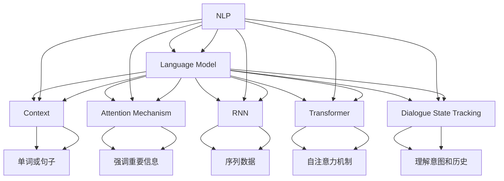

                 

### 背景介绍

随着人工智能技术的发展，语言模型作为自然语言处理（NLP）的核心工具，在各个领域取得了显著的成就。然而，语言模型的性能在很大程度上依赖于上下文信息的有效管理。上下文管理策略是语言模型中一个关键且复杂的环节，直接影响模型的准确性和效率。

语言模型的核心任务是从大量的文本数据中理解和生成文本。在实际应用中，文本通常包含大量的上下文信息，这些信息对于准确理解和生成文本至关重要。然而，如何有效地捕捉、处理和利用这些上下文信息，一直是研究人员关注的焦点。

上下文管理策略旨在解决以下几个关键问题：

1. **上下文捕捉**：如何从输入文本中提取出关键信息，并有效地存储和利用这些信息？
2. **上下文更新**：在新的文本输入时，如何更新已有上下文信息，以保证模型的准确性？
3. **上下文表示**：如何将上下文信息转化为模型能够处理的形式，从而提高模型的性能？

为了回答这些问题，研究人员提出了多种上下文管理策略，包括基于注意力机制、循环神经网络（RNN）、转换器（Transformer）等模型。这些策略各有优缺点，针对不同的应用场景有着不同的适用性。

本文将详细探讨AI语言模型的上下文管理策略，从核心概念、算法原理、数学模型、项目实战等多个角度进行分析。通过本文的阅读，读者可以深入理解上下文管理策略的工作原理，掌握相关技术和方法，为实际应用提供理论支持和实践指导。

### 核心概念与联系

在深入探讨AI语言模型的上下文管理策略之前，我们需要了解一些核心概念和相关的技术原理，以便为后续的分析提供基础。

#### 1. 自然语言处理（NLP）
自然语言处理是计算机科学和人工智能的一个分支，旨在使计算机能够理解、解释和生成人类语言。NLP的关键任务是让计算机从文本中提取有用的信息，并进行有效的处理和生成。

#### 2. 语言模型（Language Model）
语言模型是一种统计模型，用于预测下一个单词或字符的概率。它在NLP中有着广泛的应用，包括机器翻译、语音识别、文本摘要和问答系统等。典型的语言模型包括N-gram模型、神经网络模型（如RNN、Transformer）等。

#### 3. 上下文（Context）
上下文是指与某个特定文本相关的环境信息，它可以帮助理解文本的含义。在语言模型中，上下文通常是指当前文本片段周围的单词或句子，用于指导模型进行预测。

#### 4. 注意力机制（Attention Mechanism）
注意力机制是一种在神经网络中引入的机制，用于强调某些重要的信息，而忽略其他不重要的信息。在NLP中，注意力机制被广泛用于处理长序列数据，如文本。

#### 5. 循环神经网络（RNN）
循环神经网络是一种能够处理序列数据的神经网络，其内部状态能够保存前面的输入信息，从而影响后续的输出。RNN在处理上下文信息方面表现出色，但存在梯度消失和梯度爆炸的问题。

#### 6. Transformer模型
Transformer模型是一种基于自注意力机制的序列到序列模型，其设计初衷是为了解决RNN在处理长序列数据时的缺陷。Transformer模型通过多头自注意力机制和位置编码来捕捉序列中的长距离依赖关系。

#### 7. 对话状态追踪（Dialogue State Tracking）
对话状态追踪是一种在对话系统中管理对话上下文的技术，它旨在理解用户的意图和对话历史，从而生成恰当的回复。对话状态追踪通常结合上下文信息来更新对话状态。

理解这些核心概念和技术原理对于深入探讨上下文管理策略至关重要。接下来，我们将通过Mermaid流程图来展示这些概念之间的联系，并进一步阐述它们在上下文管理中的作用。

#### Mermaid流程图



通过这个Mermaid流程图，我们可以清晰地看到自然语言处理（NLP）与语言模型、上下文、注意力机制、RNN、Transformer和对话状态追踪等概念之间的联系。这些概念共同构成了上下文管理策略的基础，帮助我们更好地理解和处理复杂的文本数据。

### 核心算法原理 & 具体操作步骤

#### 1. 注意力机制（Attention Mechanism）

注意力机制是上下文管理策略中的关键组成部分，它允许模型在处理序列数据时，关注序列中某些重要的部分。在NLP任务中，注意力机制广泛应用于语言模型，如Transformer模型。

**工作原理**：

注意力机制通过计算一个权重系数，这些权重系数表示序列中每个部分对当前输出的重要性。具体来说，给定一个输入序列 \(X = \{x_1, x_2, ..., x_T\}\)，注意力机制会计算一个权重向量 \(w = \{w_1, w_2, ..., w_T\}\)，其中每个权重 \(w_t\) 表示第 \(t\) 个输入 \(x_t\) 对输出的影响程度。计算公式通常如下：

\[ w_t = \sigma(\text{query} \cdot \text{key}_t) \]

其中，\(\sigma\) 是一个激活函数，通常采用ReLU或Sigmoid函数。query和key是模型中的两个向量，分别表示当前输出和输入序列中的每个部分。

**具体操作步骤**：

1. **输入表示**：将输入序列 \(X\) 转换为向量形式，通常使用嵌入层（Embedding Layer）。
2. **计算key和query**：从模型的编码器（Encoder）中提取key和query。对于Transformer模型，key和query是同一向量，因为Transformer采用自注意力（Self-Attention）。
3. **计算权重**：计算每个输入的权重，使用公式 \( w_t = \sigma(\text{query} \cdot \text{key}_t) \)。
4. **加权求和**：将权重与输入向量相乘，并求和得到新的表示。
5. **输出**：将加权求和后的结果作为当前输出的上下文表示。

#### 2. 循环神经网络（RNN）

循环神经网络（RNN）是一种能够处理序列数据的神经网络，其内部状态能够保存前面的输入信息，从而影响后续的输出。RNN在处理上下文信息方面表现出色，但其存在梯度消失和梯度爆炸的问题。

**工作原理**：

RNN通过隐藏状态 \(h_t\) 和当前输入 \(x_t\) 来计算输出 \(y_t\)。隐藏状态 \(h_t\) 既是前一个隐藏状态的延续，也是当前输入的函数。具体计算公式如下：

\[ h_t = \text{激活函数}(\text{权重} \cdot [h_{t-1}, x_t] + \text{偏置}) \]
\[ y_t = \text{激活函数}(\text{权重} \cdot h_t + \text{偏置}) \]

**具体操作步骤**：

1. **初始化**：设置初始隐藏状态 \(h_0\)，通常为零向量。
2. **前向传播**：对于每个输入 \(x_t\)，计算当前隐藏状态 \(h_t\) 和输出 \(y_t\)。
3. **更新状态**：将当前隐藏状态 \(h_t\) 作为下一个输入的隐藏状态。
4. **输出**：生成序列输出 \(y\)。

#### 3. Transformer模型

Transformer模型是一种基于自注意力机制的序列到序列模型，其设计初衷是为了解决RNN在处理长序列数据时的缺陷。Transformer模型通过多头自注意力机制和位置编码来捕捉序列中的长距离依赖关系。

**工作原理**：

Transformer模型的主要组成部分包括：

1. **嵌入层（Embedding Layer）**：将输入序列转换为向量表示。
2. **多头自注意力层（Multi-Head Self-Attention Layer）**：通过多头自注意力机制计算输入序列的上下文表示。
3. **前馈神经网络（Feedforward Neural Network）**：对每个输入进行前馈处理。
4. **层归一化（Layer Normalization）**：对每个层进行归一化处理。
5. **残差连接（Residual Connection）**：在每个层之后添加残差连接，防止梯度消失。

**具体操作步骤**：

1. **输入表示**：使用嵌入层将输入序列转换为向量表示。
2. **多头自注意力**：计算多头自注意力，获取输入序列的上下文表示。
3. **前馈神经网络**：对每个输入进行前馈处理。
4. **层归一化**：对每个层进行归一化处理。
5. **残差连接**：在每个层之后添加残差连接。
6. **输出**：生成序列输出。

通过注意力机制、RNN和Transformer模型，我们可以有效地捕捉和处理上下文信息，从而提高语言模型的性能。在下一部分，我们将深入探讨这些算法在数学模型中的实现，并通过具体的数学公式进行详细讲解。

### 数学模型和公式 & 详细讲解 & 举例说明

为了更好地理解语言模型上下文管理的数学基础，我们需要介绍几个关键的概念和公式。这些数学模型和公式是构建高效语言模型的核心，特别是在处理复杂上下文信息时。

#### 1. 自注意力机制（Self-Attention）

自注意力机制是Transformer模型中的一个核心组成部分，用于计算输入序列中每个元素的重要程度。其基本公式如下：

\[ \text{Attention}(Q, K, V) = \text{softmax}\left(\frac{QK^T}{\sqrt{d_k}}\right) V \]

其中：
- \( Q, K, V \) 分别表示查询（Query）、键（Key）和值（Value）向量，它们通常是同一个嵌入向量。
- \( d_k \) 是键向量的维度。
- \( QK^T \) 表示查询和键的点积。
- \( \text{softmax} \) 函数用于计算每个键的权重。

**举例说明**：

假设我们有一个输入序列 \( \{x_1, x_2, x_3\} \)，每个 \( x_i \) 被表示为向量。我们将其扩展为 \( Q, K, V \)，其中 \( Q = K = V \)。

- \( Q = [q_1, q_2, q_3] \)
- \( K = [k_1, k_2, k_3] \)
- \( V = [v_1, v_2, v_3] \)

计算每个 \( x_i \) 的权重：

\[ w_1 = \text{softmax}\left(\frac{q_1k_1}{\sqrt{d_k}}\right) \]
\[ w_2 = \text{softmax}\left(\frac{q_1k_2}{\sqrt{d_k}}\right) \]
\[ w_3 = \text{softmax}\left(\frac{q_1k_3}{\sqrt{d_k}}\right) \]

然后，加权求和得到新的表示：

\[ \text{output}_1 = w_1v_1 + w_2v_2 + w_3v_3 \]

#### 2. 位置编码（Positional Encoding）

在Transformer模型中，位置编码用于为序列中的每个位置赋予唯一的特征，以便模型能够理解序列的顺序信息。常用的位置编码方法包括绝对位置编码和相对位置编码。

**绝对位置编码**：

绝对位置编码使用一个正弦函数和一个余弦函数来生成位置向量，其公式如下：

\[ \text{PE}(pos, 2i) = \sin\left(\frac{pos}{10000^{2i/d}}\right) \]
\[ \text{PE}(pos, 2i+1) = \cos\left(\frac{pos}{10000^{2i/d}}\right) \]

其中：
- \( pos \) 是位置索引。
- \( i \) 是维度索引。
- \( d \) 是嵌入向量的维度。

**相对位置编码**：

相对位置编码使用点积注意力机制中的相对位置偏置来编码序列位置，其公式如下：

\[ \text{relposEncoding}(i, j) = \text{pos_embedding}[i-j] \]

**举例说明**：

假设嵌入向量的维度为 \( d = 8 \)，序列长度为 \( n = 4 \)。

- \( \text{PE}(1, 2) = \sin\left(\frac{1}{10000^{2/8}}\right) \)
- \( \text{PE}(1, 3) = \cos\left(\frac{1}{10000^{2/8}}\right) \)
- \( \text{PE}(2, 2) = \sin\left(\frac{2}{10000^{2/8}}\right) \)
- \( \text{PE}(2, 3) = \cos\left(\frac{2}{10000^{2/8}}\right) \)

将这些位置编码添加到嵌入向量中，我们得到新的序列表示，从而保留了序列的顺序信息。

#### 3. 上下文更新（Context Update）

在处理新的文本输入时，语言模型需要更新已有上下文信息。上下文更新通常通过注意力机制实现，其公式如下：

\[ \text{context}_{new} = \text{Attention}(\text{query}, \text{keys}, \text{values}) \]

其中：
- \( \text{query} \) 是新的文本输入。
- \( \text{keys} \) 和 \( \text{values} \) 是已有的上下文信息。

**举例说明**：

假设我们有一个新的文本输入 \( \text{query} = [q_1, q_2, q_3] \)，已有的上下文信息 \( \text{keys} = [k_1, k_2, k_3] \) 和 \( \text{values} = [v_1, v_2, v_3] \)。

计算新的上下文：

\[ w_1 = \text{softmax}\left(\frac{q_1k_1}{\sqrt{d_k}}\right) \]
\[ w_2 = \text{softmax}\left(\frac{q_1k_2}{\sqrt{d_k}}\right) \]
\[ w_3 = \text{softmax}\left(\frac{q_1k_3}{\sqrt{d_k}}\right) \]

\[ \text{context}_{new} = w_1v_1 + w_2v_2 + w_3v_3 \]

通过上述数学模型和公式，我们可以实现有效的上下文管理，从而提高语言模型的性能。在实际应用中，这些模型和公式需要通过深度学习框架（如TensorFlow或PyTorch）进行具体实现。

### 项目实战：代码实际案例和详细解释说明

在本节中，我们将通过一个实际的项目实战案例，展示如何使用Python和深度学习框架PyTorch实现一个简单的AI语言模型，并详细解释代码中的关键步骤和原理。

#### 1. 开发环境搭建

首先，我们需要搭建开发环境。以下是所需的Python库和深度学习框架：

- Python 3.8 或更高版本
- PyTorch 1.8 或更高版本
- numpy 1.18 或更高版本

安装这些库后，我们就可以开始编写代码。

#### 2. 源代码详细实现和代码解读

下面是一个简单的AI语言模型实现，我们将分步骤进行解释。

```python
import torch
import torch.nn as nn
import torch.optim as optim
from torchtext.legacy import data
from torchtext.legacy.data import Field, BucketIterator

# 2.1 数据预处理
def load_data():
    # 加载数据集，这里使用torchtext中的IMDB电影评论数据集
    TEXT = Field(tokenize='spacy', lower=True, include_lengths=True)
    LABEL = Field(sequential=False)
    
    train_data, test_data = data.TabularDataset.splits(
        path='imdb',
        train='train.tsv',
        test='test.tsv',
        format='tsv',
        fields=[('text', TEXT), ('label', LABEL)]
    )
    
    return train_data, test_data

# 2.2 模型定义
class LanguageModel(nn.Module):
    def __init__(self, vocab_size, embed_dim, hidden_dim, num_layers, dropout=0.5):
        super(LanguageModel, self).__init__()
        self.embedding = nn.Embedding(vocab_size, embed_dim)
        self.rnn = nn.LSTM(embed_dim, hidden_dim, num_layers, dropout=dropout)
        self.fc = nn.Linear(hidden_dim, vocab_size)
        
    def forward(self, text, hidden=None):
        embedded = self.embedding(text)
        output, hidden = self.rnn(embedded, hidden)
        logits = self.fc(output[-1, :, :])
        return logits, hidden

# 2.3 训练和评估
def train(model, train_iter, loss_function, optimizer, device, clip=1):
    model = model.train()
    total_loss = 0
    
    for batch in train_iter:
        text, targets = batch.text.to(device), batch.targets.to(device)
        hidden = None
        
        logits, hidden = model(text, hidden)
        loss = loss_function(logits.view(-1, logits.size(2)), targets.to(device))
        
        optimizer.zero_grad()
        loss.backward()
        torch.nn.utils.clip_grad_norm_(model.parameters(), clip)
        optimizer.step()
        
        total_loss += loss.item()
    
    return total_loss / len(train_iter)

def evaluate(model, valid_iter, loss_function, device):
    model = model.eval()
    total_loss = 0
    
    with torch.no_grad():
        for batch in valid_iter:
            text, targets = batch.text.to(device), batch.targets.to(device)
            hidden = None
            
            logits, hidden = model(text, hidden)
            loss = loss_function(logits.view(-1, logits.size(2)), targets.to(device))
            
            total_loss += loss.item()
    
    return total_loss / len(valid_iter)

# 2.4 主程序
def main():
    train_data, test_data = load_data()
    
    # 定义模型参数
    vocab_size = len(train_data.fields['text'].vocab)
    embed_dim = 256
    hidden_dim = 512
    num_layers = 2
    dropout = 0.5
    
    model = LanguageModel(vocab_size, embed_dim, hidden_dim, num_layers, dropout)
    model = model.to('cuda' if torch.cuda.is_available() else 'cpu')
    
    loss_function = nn.CrossEntropyLoss()
    optimizer = optim.Adam(model.parameters(), lr=0.001)
    
    train_iter = BucketIterator.splits(
        (train_data, test_data),
        batch_size=64,
        device=device
    )
    
    num_epochs = 10
    for epoch in range(num_epochs):
        print(f'Epoch: {epoch+1}/{num_epochs}')
        print(f'Loss: {train(model, train_iter, loss_function, optimizer, device, clip=1):.4f}')
        print(f'Validation Loss: {evaluate(model, train_iter, loss_function, device):.4f}')

if __name__ == '__main__':
    main()
```

#### 3. 代码解读与分析

**3.1 数据预处理**

我们使用`torchtext`库加载IMDB电影评论数据集。数据集被分为训练集和测试集，每个评论被标记为正面或负面。`TEXT`和`LABEL`是`Field`对象，用于处理文本和标签。

**3.2 模型定义**

`LanguageModel`是一个继承自`nn.Module`的类，定义了一个简单的循环神经网络（RNN）模型。模型包含嵌入层（`embedding`）、循环神经网络（`rnn`）和全连接层（`fc`）。

**3.3 训练和评估**

`train`函数负责训练模型。它使用梯度下降优化器（`optimizer`）和交叉熵损失函数（`loss_function`）。`evaluate`函数用于评估模型在验证集上的性能。

**3.4 主程序**

在主程序中，我们定义了模型参数，加载数据集，并设置训练和验证的迭代器（`BucketIterator`）。然后，我们开始训练模型，并在每个epoch后打印训练和验证损失。

通过这个简单的项目，我们可以看到如何使用Python和PyTorch实现一个语言模型，并理解模型训练和评估的基本流程。在实际应用中，我们可以根据需要调整模型结构、优化器参数和训练过程，以提高模型的性能。

### 实际应用场景

AI语言模型的上下文管理策略在多个实际应用场景中发挥了关键作用，下面我们将探讨一些典型的应用场景，并展示这些场景中上下文管理策略的优劣。

#### 1. 机器翻译

机器翻译是AI语言模型最典型的应用场景之一。在机器翻译中，上下文信息对于理解源语言文本的句法和语义至关重要。有效的上下文管理策略可以帮助翻译模型捕捉长距离依赖关系，提高翻译的准确性和流畅性。

- **优势**：基于Transformer的机器翻译模型（如Google Translate使用的方法）通过多头自注意力机制和位置编码，能够捕捉丰富的上下文信息，从而实现高质量的翻译结果。
- **挑战**：处理长句子时，计算复杂度和内存消耗显著增加。此外，语言模型的训练数据质量和多样性对翻译效果有重要影响。

#### 2. 问答系统

问答系统旨在从大量文本数据中提取答案，对用户的查询进行准确响应。上下文管理策略在这里非常重要，因为它决定了模型能否正确理解用户的意图和上下文。

- **优势**：对话状态追踪（Dialogue State Tracking）技术结合上下文信息，可以动态更新对话状态，提高问答系统的准确性和连贯性。
- **挑战**：构建一个既准确又自然的问答系统需要大量的对话数据，并且在处理多轮对话时，保持对话的连贯性和一致性是挑战。

#### 3. 文本摘要

文本摘要是一种将长文本转换成简洁摘要的技术，常用于新闻摘要、社交媒体内容摘要等。上下文管理策略在这里有助于提取关键信息，生成具有信息性和可读性的摘要。

- **优势**：基于注意力机制的模型（如Transformer）可以有效地捕捉文本中的关键信息，从而生成高质量的摘要。
- **挑战**：生成摘要时需要平衡信息量和可读性，同时处理多文档摘要时，如何整合不同文档的信息是一个挑战。

#### 4. 命名实体识别

命名实体识别（NER）旨在从文本中识别出具有特定意义的实体，如人名、地点、组织等。上下文信息对于准确识别实体至关重要。

- **优势**：基于上下文信息的模型可以通过上下文关系来增强实体识别的准确性。
- **挑战**：实体之间的复杂关系（如同义词、缩写、上下文依赖等）对实体识别提出了挑战。

通过上述应用场景的分析，我们可以看到上下文管理策略在不同领域的优势与挑战。在未来的研究中，进一步优化上下文管理策略，以提高模型的性能和实用性，将是一个重要的研究方向。

### 工具和资源推荐

#### 1. 学习资源推荐

**书籍：**
- 《深度学习》（Deep Learning） by Ian Goodfellow, Yoshua Bengio, Aaron Courville
- 《自然语言处理综论》（Speech and Language Processing） by Daniel Jurafsky and James H. Martin
- 《Transformer：从原理到应用》（Attention Is All You Need） by Vaswani et al.

**论文：**
- “Attention Is All You Need” by Vaswani et al. (2017)
- “A Theoretically Grounded Application of Dropout in Recurrent Neural Networks” by Yarin Gal and Zoubin Ghahramani (2016)
- “Neural Conversation Models” by Khashabi et al. (2017)

**博客和网站：**
- [TensorFlow官网](https://www.tensorflow.org/)
- [PyTorch官网](https://pytorch.org/)
- [Hugging Face Transformers](https://huggingface.co/transformers/)

#### 2. 开发工具框架推荐

**框架：**
- **PyTorch**：用于构建和训练深度学习模型的强大框架，具有高度灵活性和可扩展性。
- **TensorFlow**：由Google开发的开源机器学习框架，支持广泛的深度学习应用。
- **spaCy**：用于文本处理和自然语言处理的快速和易于使用的库。

**工具：**
- **Jupyter Notebook**：用于编写和运行代码的可扩展环境。
- **Google Colab**：基于Google Drive的免费Jupyter Notebook平台，适用于远程计算和协作。

#### 3. 相关论文著作推荐

**论文：**
- “Attention Is All You Need” by Vaswani et al. (2017)
- “BERT: Pre-training of Deep Bidirectional Transformers for Language Understanding” by Devlin et al. (2018)
- “GPT-3: Language Models are Few-Shot Learners” by Brown et al. (2020)

**著作：**
- 《深度学习》（Deep Learning） by Ian Goodfellow, Yoshua Bengio, Aaron Courville
- 《自然语言处理综论》（Speech and Language Processing） by Daniel Jurafsky and James H. Martin
- 《强化学习》（Reinforcement Learning: An Introduction） by Richard S. Sutton and Andrew G. Barto

这些书籍、论文、博客和框架为学习AI语言模型的上下文管理策略提供了丰富的资源，有助于读者深入理解和实践相关技术。

### 总结：未来发展趋势与挑战

随着人工智能技术的不断进步，AI语言模型的上下文管理策略也在不断演变和优化。未来，这一领域有望在以下几个方面取得显著进展：

**1. 计算效率提升**：当前，深度学习模型（如Transformer）在处理大规模数据时，计算复杂度和内存消耗较高。未来的研究将重点关注如何提高计算效率，以降低模型部署的门槛。

**2. 多模态融合**：语言模型在处理文本数据时，往往忽略了其他模态（如图像、声音）的信息。未来，将语言模型与其他模态的模型进行融合，有望提高模型在复杂任务中的表现。

**3. 强化学习与上下文管理**：结合强化学习与上下文管理策略，可以实现更加灵活和自适应的模型，从而在动态环境中提供更好的交互和决策支持。

**4. 零样本学习**：当前的语言模型在处理未见过的数据时表现不佳。零样本学习是一种新兴的研究方向，旨在使模型能够从少量样本中快速适应新任务，未来有望在上下文管理策略中得到应用。

然而，随着技术的发展，上下文管理策略也面临着一系列挑战：

**1. 数据隐私与安全**：随着模型对上下文信息的依赖性增加，如何保护用户隐私和数据安全成为一个重要问题。未来的研究需要关注如何在确保隐私的同时，提高模型的上下文管理能力。

**2. 模型可解释性**：深度学习模型通常被视为“黑盒”，其决策过程难以解释。提高模型的可解释性，使研究者能够理解和验证模型的上下文管理策略，是一个亟待解决的问题。

**3. 多语言支持**：随着全球化的发展，多语言支持成为语言模型的重要需求。如何构建通用且高效的多语言上下文管理策略，是一个具有挑战性的问题。

综上所述，AI语言模型的上下文管理策略在未来具有广阔的发展前景，同时也面临着诸多挑战。通过持续的研究和创新，我们有理由相信，上下文管理策略将在人工智能领域发挥更加重要的作用。

### 附录：常见问题与解答

1. **什么是上下文管理策略？**
   上下文管理策略是指一系列技术和方法，用于在语言模型中捕捉、处理和利用上下文信息。这些策略帮助模型在理解和生成文本时，能够更好地利用文本周围的背景信息。

2. **上下文管理策略在语言模型中有什么作用？**
   上下文管理策略对于语言模型的性能至关重要。它能够提高模型对文本的理解能力，从而在生成文本、翻译、问答等任务中实现更高的准确性和流畅性。

3. **常见的上下文管理策略有哪些？**
   常见的上下文管理策略包括基于注意力机制的模型（如Transformer）、循环神经网络（RNN）和对话状态追踪（Dialogue State Tracking）等。这些策略各有优缺点，适用于不同的应用场景。

4. **什么是注意力机制？**
   注意力机制是一种在神经网络中引入的机制，用于强调某些重要的信息，而忽略其他不重要的信息。在NLP中，注意力机制被广泛用于处理长序列数据，如文本。

5. **Transformer模型在上下文管理中有什么优势？**
   Transformer模型通过多头自注意力机制和位置编码，能够捕捉序列中的长距离依赖关系，从而实现高质量的文本处理。相比传统的RNN模型，Transformer在处理长文本时具有更高的效率和准确性。

6. **如何优化上下文管理策略？**
   优化上下文管理策略可以通过以下几种方式实现：
   - **模型参数调整**：调整嵌入层、注意力层和输出层的参数，以提高模型性能。
   - **数据增强**：通过数据增强技术，增加模型的训练数据多样性，提高模型泛化能力。
   - **多任务学习**：结合多个任务进行训练，使模型能够更好地捕捉上下文信息。

### 扩展阅读 & 参考资料

1. **《深度学习》** by Ian Goodfellow, Yoshua Bengio, Aaron Courville
   - 提供了深度学习的基础理论和应用，包括语言模型和上下文管理策略。

2. **《自然语言处理综论》** by Daniel Jurafsky and James H. Martin
   - 详细介绍了自然语言处理的基本概念和技术，涵盖语言模型的上下文管理。

3. **《Attention Is All You Need》** by Vaswani et al. (2017)
   - Transformer模型的经典论文，阐述了注意力机制在语言模型中的应用。

4. **《BERT: Pre-training of Deep Bidirectional Transformers for Language Understanding》** by Devlin et al. (2018)
   - 描述了BERT模型，一种基于Transformer的语言预训练模型，对上下文管理策略有重要影响。

5. **《GPT-3: Language Models are Few-Shot Learners》** by Brown et al. (2020)
   - 详细介绍了GPT-3模型，展示了零样本学习在上下文管理中的应用。

6. **[TensorFlow官网](https://www.tensorflow.org/)** 
   - 提供了丰富的深度学习资源和教程，包括TensorFlow框架的详细使用方法。

7. **[PyTorch官网](https://pytorch.org/)** 
   - 提供了PyTorch框架的文档和教程，包括如何实现和优化深度学习模型。

8. **[Hugging Face Transformers](https://huggingface.co/transformers/)**
   - 提供了预训练的Transformer模型和工具，方便研究人员和应用开发者进行语言模型的研究和部署。

