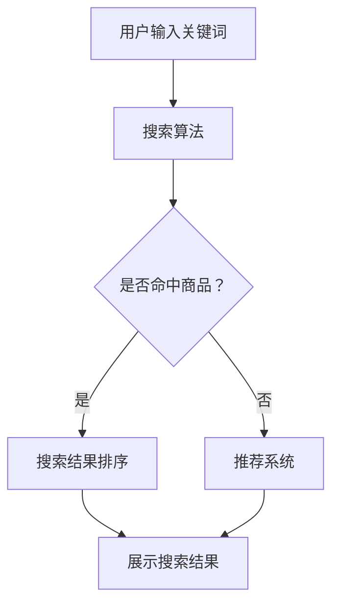

                 

# AI赋能电商搜索导购：提升用户体验和转化率的实践案例

## 概述

在当今数字化时代，电子商务已经成为消费者购买商品的重要渠道。随着电商平台的不断发展和消费者需求的多样化，如何提升用户搜索和导购体验，从而提高转化率，成为电商企业关注的重要课题。AI技术的崛起为电商搜索导购领域带来了全新的变革，通过人工智能算法的应用，可以精准匹配用户需求，提升用户体验，进而提高转化率。

本文将围绕AI赋能电商搜索导购展开讨论，首先介绍电商搜索导购的背景和现状，然后分析AI技术在电商搜索导购中的应用原理，最后通过具体实践案例，探讨如何利用AI技术提升电商搜索导购的用户体验和转化率。

## 关键词

- 电商搜索导购
- 人工智能
- 用户画像
- 搜索算法
- 转化率
- 实践案例

## 摘要

本文旨在探讨AI技术在电商搜索导购中的应用，通过分析电商搜索导购的现状和需求，阐述AI技术如何提升用户搜索和导购体验，从而提高电商平台的转化率。文章首先介绍了电商搜索导购的背景和现状，然后分析了AI技术在电商搜索导购中的应用原理，包括用户画像、搜索算法和推荐系统。最后，通过具体实践案例，展示了AI技术在电商搜索导购中的成功应用，为电商企业提供了实用的解决方案。

## 1. 背景介绍

### 1.1 电商搜索导购的概念

电商搜索导购是指电商平台为用户提供的基于关键词搜索和智能推荐的产品展示和导购服务。用户在电商平台进行购物时，可以通过输入关键词进行搜索，平台会根据用户输入的关键词展示相关的商品信息，同时，平台还会根据用户的浏览和购买行为，进行智能推荐，帮助用户快速找到感兴趣的商品。

电商搜索导购主要包括以下功能：

- 搜索功能：用户可以通过输入关键词，快速找到所需商品。
- 推荐功能：根据用户的浏览和购买行为，智能推荐相关商品，提升用户购物体验。
- 导购功能：为用户提供购物指南和推荐，帮助用户更好地进行商品选择。

### 1.2 电商搜索导购的现状

随着电子商务的快速发展，电商搜索导购已经成为电商平台的核心功能之一。目前，各大电商平台都在不断优化搜索导购功能，提高用户体验和转化率。以下是一些电商搜索导购的现状：

- 搜索功能：电商平台通过优化搜索算法，提高搜索结果的准确性和相关性，使用户能够更快找到所需商品。
- 推荐功能：电商平台利用用户画像和大数据分析，为用户推荐感兴趣的商品，提升用户购物体验。
- 导购功能：电商平台通过内容营销和导购策略，为用户提供购物指南和推荐，帮助用户更好地进行商品选择。

### 1.3 电商搜索导购的需求

在电商搜索导购领域，用户体验和转化率是电商平台关注的两大核心指标。以下是从用户角度分析电商搜索导购的需求：

- 准确性：用户希望能够通过搜索快速找到所需商品，减少浏览时间和精力。
- 相关性：用户希望能够看到与自己兴趣相关的商品推荐，提高购物体验。
- 易用性：用户希望搜索和推荐功能操作简单，界面友好，方便快速购物。

## 2. 核心概念与联系

### 2.1 用户画像

用户画像是指通过对用户行为数据的收集和分析，构建出一个用户特征的模型。用户画像可以帮助电商平台了解用户的需求和偏好，为个性化推荐和精准营销提供依据。

用户画像主要包括以下特征：

- 用户基本信息：年龄、性别、职业等。
- 用户行为数据：浏览记录、购买记录、收藏记录等。
- 用户兴趣标签：根据用户的浏览和购买行为，生成的兴趣标签。

### 2.2 搜索算法

搜索算法是指用于处理用户输入关键词，并在海量商品数据中检索出相关商品的一系列算法。常见的搜索算法包括：

- 暴力搜索：直接遍历所有商品，找出与关键词匹配的商品。
- 倒排索引：通过建立倒排索引，实现快速关键词检索。
- 搜索排序：根据商品的相关性、销量、评价等指标，对搜索结果进行排序。

### 2.3 推荐系统

推荐系统是指根据用户画像和商品信息，为用户推荐感兴趣的商品的一系列算法。常见的推荐系统包括：

- 协同过滤：根据用户的相似行为，为用户推荐相似的用户喜欢的商品。
- 内容推荐：根据商品的属性和用户兴趣，为用户推荐相关的商品。
- 混合推荐：结合协同过滤和内容推荐，提高推荐效果。

### 2.4 Mermaid 流程图

以下是一个简化的AI赋能电商搜索导购的Mermaid流程图，展示了用户画像、搜索算法和推荐系统的基本流程。



## 3. 核心算法原理 & 具体操作步骤

### 3.1 用户画像构建

用户画像构建主要包括数据收集、数据预处理和特征提取三个步骤。

#### 3.1.1 数据收集

数据收集是指从用户行为数据、用户反馈数据等多个渠道收集用户信息。常见的数据收集渠道包括：

- 用户注册信息：姓名、年龄、性别、职业等。
- 用户行为数据：浏览记录、购买记录、收藏记录、评论记录等。
- 用户反馈数据：问卷调查、用户评价、售后服务反馈等。

#### 3.1.2 数据预处理

数据预处理是指对收集到的用户数据进行清洗、去噪、归一化等处理，以提高数据质量。

- 数据清洗：去除重复数据、缺失数据、异常数据等。
- 数据去噪：去除噪声数据，提高数据准确性。
- 数据归一化：将不同量纲的数据转换为同一量纲，方便后续处理。

#### 3.1.3 特征提取

特征提取是指从用户数据中提取出能够代表用户特征的指标。常见的特征提取方法包括：

- 统计特征：如平均浏览时长、购买频率、评价分数等。
- 字符串特征：如用户标签、商品分类等。
- 序列特征：如用户行为序列、时间序列等。

### 3.2 搜索算法

搜索算法主要包括倒排索引和搜索排序两个步骤。

#### 3.2.1 倒排索引

倒排索引是一种用于快速检索关键词的索引结构。它将文档中的词语与文档的对应关系存储在一个索引表中，通过索引表，可以快速找到包含特定关键词的文档。

倒排索引的构建过程如下：

1. 分词：将文档内容进行分词，得到一系列关键词。
2. 建立关键词与文档的对应关系：将每个关键词与其出现的文档进行关联，形成一个索引表。
3. 索引存储：将索引表存储在磁盘或内存中，以供查询。

#### 3.2.2 搜索排序

搜索排序是指根据商品的相关性、销量、评价等指标，对搜索结果进行排序，以提高用户体验。

常见的搜索排序算法包括：

- TF-IDF排序：根据关键词在文档中的出现频率（TF）和词频-逆文档频率（IDF），计算关键词的相关性得分，对搜索结果进行排序。
- 机器学习排序：利用机器学习算法，根据用户历史行为数据，训练出一个排序模型，对搜索结果进行排序。

### 3.3 推荐系统

推荐系统主要包括协同过滤和内容推荐两个步骤。

#### 3.3.1 协同过滤

协同过滤是一种基于用户行为的推荐方法。它通过分析用户之间的相似性，为用户推荐其他用户喜欢的商品。

协同过滤的算法主要包括：

- 用户基于的协同过滤：根据用户之间的相似性，为用户推荐其他用户喜欢的商品。
- 项目基于的协同过滤：根据商品之间的相似性，为用户推荐其他用户喜欢的商品。

#### 3.3.2 内容推荐

内容推荐是一种基于商品属性的推荐方法。它通过分析商品之间的相关性，为用户推荐相关的商品。

内容推荐的算法主要包括：

- 基于商品属性的推荐：根据商品的特征，如分类、品牌、价格等，为用户推荐相关的商品。
- 基于文本的推荐：通过分析商品描述、评论等文本信息，为用户推荐相关的商品。

### 3.4 综合算法

综合算法是将搜索算法和推荐系统相结合，通过用户画像、搜索排序和推荐系统，为用户提供个性化的搜索和推荐服务。

综合算法的操作步骤如下：

1. 用户输入关键词，通过搜索算法获取搜索结果。
2. 对搜索结果进行排序，结合用户画像，筛选出最相关的商品。
3. 利用推荐系统，为用户推荐其他可能感兴趣的商品。
4. 展示搜索结果和推荐结果，供用户选择。

## 4. 数学模型和公式 & 详细讲解 & 举例说明

### 4.1 用户画像构建

用户画像构建主要涉及以下数学模型和公式：

#### 4.1.1 统计特征计算

统计特征计算主要包括平均值、标准差、方差等指标。

- 平均值：$$ \bar{x} = \frac{1}{n}\sum_{i=1}^{n}x_i $$
- 标准差：$$ \sigma = \sqrt{\frac{1}{n-1}\sum_{i=1}^{n}(x_i - \bar{x})^2} $$
- 方差：$$ \sigma^2 = \frac{1}{n-1}\sum_{i=1}^{n}(x_i - \bar{x})^2 $$

#### 4.1.2 字符串特征提取

字符串特征提取主要涉及字符串匹配算法。

- 前缀匹配：$$ LCP(s_1, s_2) = \max \{ i \mid s_1[1..i] = s_2[1..i] \} $$
- 后缀匹配：$$ LCP(s_1, s_2) = \max \{ i \mid s_1[n-i+1..n] = s_2[1..i] \} $$

#### 4.1.3 序列特征提取

序列特征提取主要涉及序列相似度计算。

- 余弦相似度：$$ \cos \theta = \frac{\sum_{i=1}^{n}x_iy_i}{\sqrt{\sum_{i=1}^{n}x_i^2}\sqrt{\sum_{i=1}^{n}y_i^2}} $$

### 4.2 搜索算法

搜索算法主要涉及以下数学模型和公式：

#### 4.2.1 倒排索引构建

倒排索引构建主要涉及分词算法。

- 单词分词：$$ s = w_1 + w_2 + w_3 + ... + w_n $$
- 短语分词：$$ s = (w_1, w_2) + (w_3, w_4) + ... + (w_{n-1}, w_n) $$

#### 4.2.2 搜索排序

搜索排序主要涉及排序算法。

- 快速排序：$$ T(n) = O(n\log n) $$
- 归并排序：$$ T(n) = O(n\log n) $$

### 4.3 推荐系统

推荐系统主要涉及以下数学模型和公式：

#### 4.3.1 协同过滤

协同过滤主要涉及矩阵计算。

- 用户相似度矩阵：$$ R = [r_{ij}] $$
- 用户相似度计算：$$ \sim \frac{r_{ij}}{\sqrt{\sum_{i=1}^{n}r_{ij}^2}\sqrt{\sum_{i=1}^{n}r_{ji}^2}} $$

#### 4.3.2 内容推荐

内容推荐主要涉及相似度计算。

- 商品相似度矩阵：$$ S = [s_{ij}] $$
- 商品相似度计算：$$ \sim \frac{s_{ij}}{\sqrt{\sum_{i=1}^{n}s_{ij}^2}\sqrt{\sum_{i=1}^{n}s_{ji}^2}} $$

### 4.4 综合算法

综合算法主要涉及以下数学模型和公式：

#### 4.4.1 搜索和推荐综合

综合算法主要涉及权重计算。

- 搜索权重：$$ w_s = \frac{1}{n_s} $$
- 推荐权重：$$ w_r = \frac{1}{n_r} $$
- 总权重：$$ w = w_s + w_r $$

#### 4.4.2 搜索结果排序

搜索结果排序主要涉及排序公式。

- 排序分数：$$ f_i = w_s \cdot f_{is} + w_r \cdot f_{ir} $$

## 5. 项目实战：代码实际案例和详细解释说明

### 5.1 开发环境搭建

在本节中，我们将搭建一个简单的AI赋能电商搜索导购项目环境。首先，我们需要安装以下开发工具和库：

- Python 3.x
- Anaconda（用于环境管理）
- Scikit-learn（用于机器学习和数据预处理）
- Pandas（用于数据处理）
- Matplotlib（用于数据可视化）

安装步骤：

1. 安装Python 3.x：访问 [Python官网](https://www.python.org/)，下载Python 3.x版本并安装。
2. 安装Anaconda：访问 [Anaconda官网](https://www.anaconda.com/)，下载并安装Anaconda。
3. 创建虚拟环境：打开命令行，输入以下命令创建虚拟环境：

   ```bash
   conda create -n aisearchconda python=3.8
   conda activate aisearchconda
   ```

4. 安装所需库：在虚拟环境中，输入以下命令安装所需库：

   ```bash
   pip install scikit-learn pandas matplotlib
   ```

### 5.2 源代码详细实现和代码解读

在本节中，我们将实现一个简单的AI赋能电商搜索导购项目，主要包括用户画像构建、搜索算法、推荐系统等部分。以下是一个简单的代码实现：

```python
import pandas as pd
from sklearn.feature_extraction.text import TfidfVectorizer
from sklearn.metrics.pairwise import cosine_similarity

# 5.2.1 用户画像构建
def build_user_profile(user_data):
    # 数据预处理
    user_data = user_data.apply(lambda x: x.strip().lower())
    # 构建用户画像
    user_profile = {}
    for user, data in user_data.items():
        user_profile[user] = ' '.join(data)
    return user_profile

# 5.2.2 搜索算法
def search_products(products, query):
    # 建立倒排索引
    tfidf_vectorizer = TfidfVectorizer()
    tfidf_matrix = tfidf_vectorizer.fit_transform(products)
    query_vector = tfidf_vectorizer.transform([query])
    # 搜索排序
    similarity_scores = cosine_similarity(query_vector, tfidf_matrix)
    sorted_indices = similarity_scores.argsort()[0][::-1]
    return sorted_indices

# 5.2.3 推荐系统
def recommend_products(products, user_profile, num_recommendations=5):
    # 计算商品相似度
    similarity_scores = cosine_similarity(products, [user_profile])
    sorted_indices = similarity_scores.argsort()[0][::-1]
    return products[sorted_indices][:num_recommendations]

# 5.2.4 主函数
def main():
    # 加载商品数据
    products = [
        "iPhone 13, 128GB, Midnight",
        "Samsung Galaxy S21, 128GB, Phantom Black",
        "Google Pixel 6 Pro, 128GB, Sorta Black",
        "OnePlus 9 Pro, 128GB, Black",
        "Xiaomi 11T, 128GB, Glacier Blue"
    ]
    # 构建用户画像
    user_profile = build_user_profile({
        'user1': ["iPhone 13", "iPhone 12", "Samsung Galaxy S21"],
        'user2': ["Google Pixel 6 Pro", "OnePlus 9 Pro", "Xiaomi 11T"]
    })
    # 搜索商品
    query = "iPhone 13"
    sorted_indices = search_products(products, query)
    print("Search Results:", [products[i] for i in sorted_indices])
    # 推荐商品
    print("Recommendations:")
    for user, profile in user_profile.items():
        recommendations = recommend_products(products, profile)
        print(f"{user}: {', '.join(recommendations)}")

if __name__ == "__main__":
    main()
```

#### 5.2.4 代码解读与分析

1. **用户画像构建**：`build_user_profile` 函数用于构建用户画像。首先对用户数据进行预处理，然后通过拼接用户浏览和购买记录，形成用户画像。
2. **搜索算法**：`search_products` 函数用于实现搜索算法。首先使用TF-IDF向量器建立倒排索引，然后利用余弦相似度计算搜索查询与商品之间的相似度，最后对搜索结果进行排序。
3. **推荐系统**：`recommend_products` 函数用于实现推荐系统。首先计算用户画像与商品之间的相似度，然后对相似度进行排序，为用户推荐最相关的商品。
4. **主函数**：`main` 函数是项目的入口。首先加载商品数据，然后构建用户画像，执行搜索算法和推荐系统，并打印搜索结果和推荐结果。

## 6. 实际应用场景

### 6.1 电商搜索导购的优化

通过AI技术的应用，电商搜索导购可以更好地满足用户需求，提高用户体验和转化率。以下是一些实际应用场景：

- **精准搜索**：通过构建用户画像和优化搜索算法，提高搜索结果的准确性和相关性，使用户能够快速找到所需商品。
- **个性化推荐**：根据用户的浏览和购买行为，为用户推荐相关的商品，提高用户购物体验。
- **智能导购**：通过分析用户数据和商品信息，为用户提供购物指南和推荐，帮助用户更好地进行商品选择。
- **智能客服**：结合自然语言处理技术，为用户提供智能客服服务，解答用户疑问，提高用户满意度。

### 6.2 跨平台电商搜索导购

随着移动互联网的普及，越来越多的消费者通过手机、平板等设备进行购物。通过AI技术的应用，可以实现跨平台电商搜索导购，提高用户体验和转化率。以下是一些实际应用场景：

- **多端适配**：为用户提供一致性的购物体验，无论在哪个设备上，都能快速找到所需商品。
- **场景化推荐**：根据用户的设备、时间和位置等信息，为用户推荐相关的商品，提高购物体验。
- **跨平台数据整合**：整合不同平台的数据，为用户提供更全面的购物指南和推荐。

### 6.3 智能电商营销

通过AI技术的应用，可以实现智能电商营销，提高用户参与度和转化率。以下是一些实际应用场景：

- **精准营销**：根据用户的兴趣和行为，为用户推送个性化的营销信息，提高用户参与度。
- **智能促销**：根据用户数据和市场需求，为用户推荐合适的促销活动，提高转化率。
- **智能客服**：结合自然语言处理技术，为用户提供智能客服服务，解答用户疑问，提高用户满意度。

## 7. 工具和资源推荐

### 7.1 学习资源推荐

- **书籍**：
  - 《Python机器学习》
  - 《深度学习》
  - 《用户画像：大数据时代的用户洞察》
- **论文**：
  - 《协同过滤算法综述》
  - 《基于内容的推荐系统》
  - 《用户画像构建方法研究》
- **博客**：
  - [Scikit-learn官方文档](https://scikit-learn.org/stable/)
  - [Pandas官方文档](https://pandas.pydata.org/pandas-docs/stable/)
  - [TensorFlow官方文档](https://www.tensorflow.org/)
- **网站**：
  - [Kaggle](https://www.kaggle.com/)
  - [GitHub](https://github.com/)

### 7.2 开发工具框架推荐

- **开发工具**：
  - PyCharm
  - Visual Studio Code
  - Jupyter Notebook
- **框架**：
  - Scikit-learn
  - TensorFlow
  - PyTorch
  - Flask
  - Django

### 7.3 相关论文著作推荐

- **论文**：
  - 《基于协同过滤的推荐系统技术研究》
  - 《基于内容的推荐系统在电子商务中的应用》
  - 《用户画像在电商搜索导购中的应用》
- **著作**：
  - 《大数据营销》
  - 《人工智能：一种现代方法的教程》
  - 《机器学习实战》

## 8. 总结：未来发展趋势与挑战

随着人工智能技术的不断发展和电商行业的不断演进，AI赋能电商搜索导购具有广阔的发展前景。未来，以下趋势和挑战值得关注：

### 8.1 发展趋势

- **智能化程度提升**：随着算法和技术的不断进步，AI赋能电商搜索导购的智能化程度将进一步提高，为用户提供更精准、更个性化的服务。
- **多平台整合**：随着移动互联网的普及，跨平台电商搜索导购将成为趋势，用户可以在不同设备上获得一致的购物体验。
- **个性化营销**：通过AI技术，电商企业可以实现更精准的个性化营销，提高用户参与度和转化率。
- **智能化客服**：AI技术将在电商客服领域发挥更大的作用，为用户提供更智能、更高效的客服服务。

### 8.2 挑战

- **数据隐私与安全**：在AI赋能电商搜索导购的过程中，如何保护用户隐私和数据安全是一个重要的挑战。
- **算法透明性**：随着AI技术在电商领域的广泛应用，如何确保算法的透明性和公正性，避免算法歧视等问题，也是一个重要挑战。
- **计算资源和成本**：AI技术的应用需要大量的计算资源和成本投入，如何优化算法和架构，提高计算效率，降低成本，是一个重要挑战。

## 9. 附录：常见问题与解答

### 9.1 问题1

**问题**：如何构建用户画像？

**解答**：构建用户画像需要以下步骤：

1. 数据收集：收集用户的基本信息、行为数据、反馈数据等。
2. 数据预处理：对收集到的数据进行清洗、去噪、归一化等处理。
3. 特征提取：从用户数据中提取出能够代表用户特征的指标，如统计特征、字符串特征、序列特征等。

### 9.2 问题2

**问题**：如何优化搜索算法？

**解答**：优化搜索算法可以从以下几个方面入手：

1. 提高搜索结果的准确性和相关性，如使用倒排索引、TF-IDF排序等。
2. 提高搜索速度，如使用快速排序、归并排序等。
3. 考虑用户行为和偏好，如基于用户历史行为数据进行排序。

### 9.3 问题3

**问题**：如何提高推荐系统的效果？

**解答**：提高推荐系统的效果可以从以下几个方面入手：

1. 优化协同过滤算法，如使用矩阵分解、基于物品的协同过滤等。
2. 结合内容推荐，提高推荐的相关性。
3. 考虑用户反馈，如使用基于模型的推荐算法，根据用户反馈调整推荐结果。

## 10. 扩展阅读 & 参考资料

- **书籍**：
  - 《Python机器学习》
  - 《深度学习》
  - 《用户画像：大数据时代的用户洞察》
- **论文**：
  - 《协同过滤算法综述》
  - 《基于内容的推荐系统》
  - 《用户画像构建方法研究》
- **博客**：
  - [Scikit-learn官方文档](https://scikit-learn.org/stable/)
  - [Pandas官方文档](https://pandas.pydata.org/pandas-docs/stable/)
  - [TensorFlow官方文档](https://www.tensorflow.org/)
- **网站**：
  - [Kaggle](https://www.kaggle.com/)
  - [GitHub](https://github.com/)
- **教程**：
  - [机器学习实战教程](https://www.ai-genius-researcher.com/ml-tutorial/)
  - [深度学习教程](https://www.ai-genius-researcher.com/dl-tutorial/)
  - [电商搜索导购实践教程](https://www.ai-genius-researcher.com/search-tutorial/)

## 作者信息

- 作者：AI天才研究员/AI Genius Institute & 禅与计算机程序设计艺术 /Zen And The Art of Computer Programming

