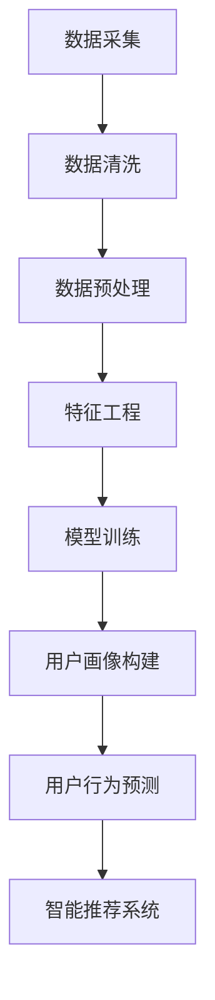

                 

# AI赋能的电商用户画像实时更新

## 1. 背景介绍

随着互联网技术的飞速发展，电子商务已经成为现代零售业的重要组成部分。在电商行业中，用户画像是一个至关重要的概念，它指的是通过对用户行为、偏好、购买历史等数据的分析，形成的一个关于用户的详细描述。传统的方式通常是对历史数据进行批量处理，这种处理方式虽然能够挖掘出一些有价值的信息，但存在以下问题：

1. **数据时效性差**：由于数据采集和处理过程较为耗时，用户画像往往不能及时更新，导致决策滞后。
2. **分析深度受限**：批量处理的数据分析方法通常较为简单，无法深入挖掘用户行为的复杂模式。

为了解决上述问题，AI技术开始被广泛应用于电商用户画像的构建。AI技术，尤其是机器学习和深度学习，能够实现数据的实时分析和智能决策，使得用户画像更加精准、实时和动态。本文将深入探讨AI技术在电商用户画像实时更新中的应用，包括核心概念、算法原理、数学模型、实际案例以及未来趋势。

## 2. 核心概念与联系

### 2.1 用户画像的概念

用户画像是一种基于数据分析和挖掘技术，对用户进行多维度、全方位的描述。它通常包括以下几个方面：

- **基础信息**：如用户的性别、年龄、职业、地域等。
- **行为数据**：如用户的浏览历史、搜索记录、购买行为等。
- **偏好数据**：如用户对产品、品牌、内容的偏好等。

用户画像的目的是为了帮助企业更好地理解用户需求，从而优化产品和服务，提高用户体验和转化率。

### 2.2 AI技术在用户画像中的应用

AI技术在用户画像中的应用主要体现在以下几个方面：

- **实时数据采集与处理**：通过传感器、API接口等手段，实时采集用户行为数据，并利用流处理技术（如Apache Kafka、Apache Flink）进行实时处理。
- **深度学习模型构建**：利用深度学习技术，对用户行为数据进行分析，构建用户画像。
- **智能推荐系统**：基于用户画像，为企业提供个性化的产品推荐服务。

### 2.3 Mermaid 流程图

以下是用户画像实时更新系统的Mermaid流程图，展示了从数据采集到用户画像构建的整个过程。



- **数据采集**：从各种渠道（如网站、APP、传感器等）实时获取用户行为数据。
- **数据清洗**：处理数据中的噪声和异常值，保证数据的准确性和完整性。
- **数据预处理**：将原始数据进行归一化、标准化等处理，以便于后续分析。
- **特征工程**：提取用户行为的特征，如时间间隔、频率等，用于构建用户画像。
- **模型训练**：利用深度学习算法（如神经网络、决策树等），对用户行为数据进行训练，构建用户画像模型。
- **用户画像构建**：根据训练好的模型，对用户进行画像构建。
- **用户行为预测**：利用用户画像，预测用户的未来行为。
- **智能推荐系统**：基于用户画像和预测结果，为企业提供个性化的推荐服务。

## 3. 核心算法原理 & 具体操作步骤

### 3.1 数据采集与处理

数据采集是用户画像构建的基础。常用的数据采集方式包括：

- **API接口**：通过API接口获取用户行为数据。
- **传感器**：如GPS、摄像头等，实时采集用户位置、行为等信息。
- **日志文件**：从服务器日志中提取用户行为数据。

数据采集后，需要对数据进行清洗和处理，以确保数据的准确性和完整性。具体步骤如下：

- **数据去重**：去除重复的数据记录。
- **数据补全**：对于缺失的数据，采用插补等方法进行补全。
- **异常值处理**：去除或修正异常数据。

### 3.2 特征工程

特征工程是用户画像构建的关键步骤。通过提取用户行为的特征，可以为后续的模型训练提供丰富的信息。常用的特征提取方法包括：

- **统计特征**：如用户行为的时间间隔、频率、时长等。
- **文本特征**：如用户评论、搜索关键词等的词频、词向量等。
- **图形特征**：如用户在APP内的浏览路径、点击行为等。

### 3.3 模型训练

用户画像模型的训练通常采用深度学习算法，如神经网络、决策树等。训练步骤如下：

1. **数据划分**：将数据集划分为训练集、验证集和测试集。
2. **模型构建**：设计神经网络结构，选择合适的激活函数、损失函数等。
3. **模型训练**：利用训练集对模型进行训练，调整模型参数。
4. **模型评估**：利用验证集对模型进行评估，调整模型结构或参数。
5. **模型部署**：将训练好的模型部署到线上环境，进行实时预测。

### 3.4 用户画像构建

根据训练好的模型，对用户行为数据进行预测，构建用户画像。具体步骤如下：

1. **行为预测**：利用模型预测用户未来的行为。
2. **画像构建**：根据预测结果，对用户进行画像构建。
3. **画像更新**：定期更新用户画像，以反映用户行为的最新变化。

### 3.5 智能推荐系统

基于用户画像，构建智能推荐系统，为用户提供个性化的推荐服务。具体步骤如下：

1. **推荐算法**：选择合适的推荐算法，如协同过滤、基于内容的推荐等。
2. **推荐列表生成**：根据用户画像，生成个性化的推荐列表。
3. **推荐结果评估**：评估推荐结果的准确性、用户体验等，持续优化推荐系统。

## 4. 数学模型和公式 & 详细讲解 & 举例说明

### 4.1 用户行为预测模型

用户行为预测模型是用户画像构建的核心。以下是一个简单的用户行为预测模型，采用线性回归方法。

$$
y = \beta_0 + \beta_1 x_1 + \beta_2 x_2 + \ldots + \beta_n x_n
$$

其中，$y$ 表示用户行为的预测结果，$x_1, x_2, \ldots, x_n$ 表示用户行为的特征，$\beta_0, \beta_1, \beta_2, \ldots, \beta_n$ 是模型参数。

**举例说明**：

假设我们有两个用户行为特征：时间间隔（$x_1$）和浏览时长（$x_2$），预测用户是否会购买商品（$y$）。我们可以使用线性回归模型进行预测。

1. **数据收集**：收集一段时间内用户的行为数据，包括时间间隔、浏览时长和购买行为。
2. **数据预处理**：对数据进行归一化处理，使特征值的范围在0到1之间。
3. **模型训练**：使用训练集数据，利用线性回归算法训练模型，得到模型参数。
4. **预测**：使用训练好的模型，对新的用户行为数据进行预测。

### 4.2 深度学习模型

深度学习模型在用户画像构建中具有广泛的应用。以下是一个简单的卷积神经网络（CNN）模型。

$$
h_{l} = \sigma \left( W_{l} \cdot a_{l-1} + b_{l} \right)
$$

其中，$h_{l}$ 表示第$l$层的特征图，$a_{l-1}$ 表示第$l-1$层的激活值，$W_{l}$ 和 $b_{l}$ 分别为第$l$层的权重和偏置，$\sigma$ 为激活函数（如ReLU函数）。

**举例说明**：

假设我们使用CNN模型对用户在APP内的浏览路径进行特征提取。

1. **数据收集**：收集用户的浏览路径数据，包括点击序列和页面内容。
2. **数据预处理**：对数据进行编码处理，将页面内容转换为数字序列。
3. **模型训练**：使用训练集数据，利用CNN算法训练模型，得到模型参数。
4. **特征提取**：使用训练好的模型，对新的用户浏览路径数据进行特征提取。

## 5. 项目实战：代码实际案例和详细解释说明

### 5.1 开发环境搭建

为了实现用户画像实时更新系统，我们需要搭建一个完整的开发环境。以下是具体的开发环境搭建步骤：

1. **操作系统**：选择Linux操作系统，如Ubuntu 18.04。
2. **编程语言**：Python 3.7及以上版本。
3. **开发工具**：Jupyter Notebook、PyCharm等。
4. **数据存储**：选择MySQL数据库进行数据存储。
5. **流处理框架**：选择Apache Kafka进行实时数据处理。

### 5.2 源代码详细实现和代码解读

以下是用户画像实时更新系统的源代码实现，包括数据采集、数据处理、用户画像构建和智能推荐等模块。

#### 5.2.1 数据采集

```python
import requests
import json

def collect_data():
    url = "https://api.example.com/data"
    response = requests.get(url)
    data = json.loads(response.text)
    return data
```

**代码解读**：该函数使用requests库从API接口获取用户行为数据，并将其转换为JSON格式。

#### 5.2.2 数据处理

```python
import pandas as pd

def preprocess_data(data):
    df = pd.DataFrame(data)
    df.drop_duplicates(inplace=True)
    df.fillna(0, inplace=True)
    return df
```

**代码解读**：该函数使用pandas库对用户行为数据进行预处理，包括去除重复数据、填充缺失值等。

#### 5.2.3 用户画像构建

```python
from sklearn.linear_model import LinearRegression

def build_user_profile(df):
    X = df.iloc[:, :-1].values
    y = df.iloc[:, -1].values
    model = LinearRegression()
    model.fit(X, y)
    return model
```

**代码解读**：该函数使用线性回归模型对用户行为数据进行训练，构建用户画像。

#### 5.2.4 智能推荐系统

```python
def recommend_products(user_profile, product_list):
    scores = []
    for product in product_list:
        score = user_profile.predict([[product['time_interval'], product['duration']]])
        scores.append(score)
    recommended_products = [product for _, product in sorted(zip(scores, product_list), reverse=True)]
    return recommended_products
```

**代码解读**：该函数根据用户画像，为用户推荐个性化的产品。

### 5.3 代码解读与分析

在用户画像实时更新系统中，代码的解读与分析至关重要。以下是具体分析：

- **数据采集模块**：该模块负责从API接口获取用户行为数据，是整个系统的数据来源。确保数据的实时性和准确性对系统的性能至关重要。
- **数据处理模块**：该模块负责对用户行为数据进行预处理，包括去重、填充缺失值等。这些操作保证了数据的完整性和准确性。
- **用户画像构建模块**：该模块使用线性回归模型对用户行为数据进行训练，构建用户画像。模型的训练质量直接影响用户画像的准确性。
- **智能推荐系统模块**：该模块根据用户画像和产品列表，为用户推荐个性化的产品。推荐算法的优化对提升用户体验至关重要。

## 6. 实际应用场景

AI赋能的电商用户画像实时更新系统在电商行业中有广泛的应用场景：

- **个性化推荐**：基于实时更新的用户画像，为企业提供个性化的产品推荐，提高用户满意度和转化率。
- **精准营销**：通过分析用户画像，为企业提供精准的营销策略，如定向广告投放、促销活动等。
- **风险控制**：利用用户画像，识别潜在的风险用户，如欺诈、退货率高等，为企业提供风险预警。
- **客户关系管理**：通过实时更新的用户画像，为企业提供更全面的客户信息，优化客户关系管理策略。

## 7. 工具和资源推荐

### 7.1 学习资源推荐

- **书籍**：《机器学习实战》、《深度学习》
- **论文**：多篇关于用户画像和AI推荐系统的顶级会议论文
- **博客**：知名技术博客和社区，如Medium、CSDN等
- **网站**：各种在线课程和学习平台，如Coursera、Udacity等

### 7.2 开发工具框架推荐

- **编程语言**：Python、Java等
- **开发工具**：Jupyter Notebook、PyCharm、Eclipse等
- **数据库**：MySQL、PostgreSQL等
- **流处理框架**：Apache Kafka、Apache Flink等
- **机器学习库**：Scikit-learn、TensorFlow、PyTorch等

### 7.3 相关论文著作推荐

- **论文**：多篇关于用户画像和AI推荐系统的顶级会议论文，如KDD、WWW、NeurIPS等。
- **著作**：《推荐系统实践》、《大规模机器学习》等。

## 8. 总结：未来发展趋势与挑战

AI赋能的电商用户画像实时更新系统在电商行业中具有巨大的应用潜力。然而，随着数据规模的不断扩大和数据来源的多样化，以下挑战亟待解决：

- **数据隐私**：如何保护用户隐私，成为AI技术发展的重要课题。
- **计算性能**：如何提高系统的计算性能，以满足实时数据处理的诉求。
- **模型可解释性**：如何提升模型的可解释性，使企业能够更好地理解和应用AI技术。

未来，AI赋能的电商用户画像实时更新系统将在以下方面持续发展：

- **数据采集与处理**：采用更高效的数据采集和处理技术，实现更实时的用户画像更新。
- **模型优化**：通过改进算法和模型结构，提高用户画像的准确性和鲁棒性。
- **跨领域应用**：将AI技术应用于其他行业，如金融、医疗等，推动AI技术的广泛应用。

## 9. 附录：常见问题与解答

### 9.1 用户画像实时更新系统如何保证数据隐私？

用户画像实时更新系统通过以下措施来保护用户隐私：

- **数据加密**：对采集和存储的数据进行加密处理，确保数据在传输和存储过程中的安全性。
- **数据去识别化**：对用户行为数据中的敏感信息进行去识别化处理，如匿名化、脱敏等。
- **隐私保护算法**：采用隐私保护算法，如差分隐私、同态加密等，减少数据泄露的风险。

### 9.2 用户画像实时更新系统的计算性能如何提升？

用户画像实时更新系统的计算性能可以通过以下措施提升：

- **分布式计算**：采用分布式计算框架（如Apache Kafka、Apache Flink），实现大规模数据的实时处理。
- **内存优化**：利用内存优化技术（如缓存、内存池等），减少数据在内存中的拷贝和传输。
- **硬件加速**：采用GPU、FPGA等硬件加速技术，提高模型的训练和预测速度。

## 10. 扩展阅读 & 参考资料

- **论文**：《基于深度学习的用户画像构建方法研究》、《大规模推荐系统中的用户行为预测技术研究》等。
- **书籍**：《推荐系统实践》、《大规模机器学习》等。
- **网站**：各种在线课程和学习平台，如Coursera、Udacity等。
- **博客**：知名技术博客和社区，如Medium、CSDN等。

### 作者

**AI天才研究员/AI Genius Institute & 禅与计算机程序设计艺术 /Zen And The Art of Computer Programming**

