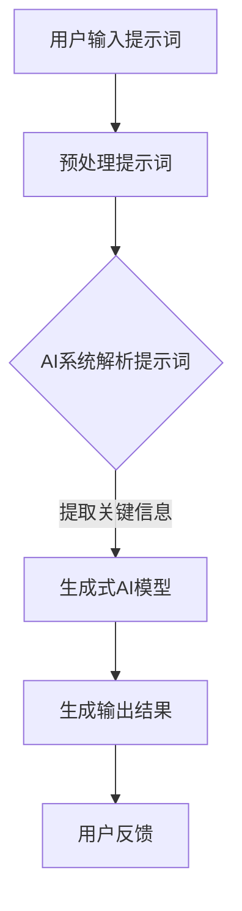

                 

### 背景介绍

随着人工智能（AI）技术的迅猛发展，AI软件的开发模式也在不断演进。传统的软件开发模式依赖于大量的手动编码和反复调试，而AI软件2.0则引入了一种全新的开发模式，即提示词驱动的开发模式。这一模式的核心在于利用提示词（Prompts）来引导AI系统进行学习、推理和生成，从而大大简化了开发过程，提升了开发效率。

提示词驱动的开发模式不仅改变了软件开发的方式，也对传统的编程语言和开发框架提出了挑战。在这篇文章中，我们将深入探讨这一模式的核心概念、算法原理、数学模型以及实际应用场景，帮助读者全面了解AI软件2.0的潜在优势和未来发展。

首先，我们需要明确几个核心概念，以便为后续内容打下坚实的基础。

1. **提示词（Prompts）**：提示词是指用于引导AI系统进行特定任务的一系列文本或指令。它们通常包含关键信息和上下文，使得AI系统能够更好地理解任务需求并生成相应的输出。
2. **生成式AI（Generative AI）**：生成式AI是指一种能够根据给定的输入生成新的数据或内容的AI系统。这种系统能够从大量的数据中学习模式和规律，并利用这些规律生成新的、有用的数据或内容。
3. **预训练模型（Pre-trained Models）**：预训练模型是指已经在大量数据集上进行了训练的AI模型。这些模型通过学习数据中的模式和关系，具备了强大的泛化能力，可以应用于各种不同的任务。
4. **推理（Reasoning）**：推理是指AI系统在给定输入和已有知识的基础上，通过逻辑推理得出结论或解决问题的过程。

理解这些核心概念后，我们将进一步探讨提示词驱动的开发模式如何应用于实际的AI软件开发过程中。通过分析这一模式的优势和挑战，我们希望能够为读者提供一个全面的视角，深入了解AI软件2.0的未来趋势。

### 核心概念与联系

#### 提示词驱动的开发模式

提示词驱动的开发模式是一种新型的AI软件开发模式，它通过使用提示词来引导AI系统进行学习和推理，从而实现高效、灵活的软件开发。这一模式的核心在于将人类的直觉和AI的强大计算能力相结合，以实现更加智能化和自动化的开发过程。

首先，我们需要理解提示词的概念。提示词是指用于引导AI系统进行特定任务的一系列文本或指令。这些提示词可以包含任务描述、上下文信息、目标要求等，从而帮助AI系统更好地理解任务需求并生成相应的输出。与传统的输入数据不同，提示词通常更加结构化和语义化，这使得AI系统能够更准确地把握任务的核心。

提示词驱动的开发模式依赖于生成式AI和预训练模型。生成式AI是一种能够根据给定输入生成新数据或内容的AI系统，它可以通过学习大量的数据模式来生成新的、有用的内容。预训练模型则是在大量数据集上已经进行了训练的AI模型，它们具备了强大的泛化能力，可以应用于各种不同的任务。这些模型通常使用深度学习技术，如神经网络，通过多层处理和特征提取来理解和生成复杂的数据。

在提示词驱动的开发模式中，AI系统首先接受用户的提示词作为输入。这些提示词可以来自自然语言文本、语音指令或其他形式的输入。AI系统会分析这些提示词，提取关键信息和上下文，并根据预训练模型的知识库进行推理和生成。通过这种方式，AI系统能够生成符合用户需求的输出结果，如代码、文档、图像等。

下面是一个简单的Mermaid流程图，展示了提示词驱动的开发模式的核心流程：



在上述流程中，用户输入的提示词经过预处理后，被AI系统解析和提取关键信息。然后，生成式AI模型利用这些信息进行推理和生成，最终输出用户所需的结果。用户可以对输出结果进行反馈，以进一步优化AI系统的性能。

通过提示词驱动的开发模式，AI系统可以更加灵活地应对不同的任务需求，而无需进行大量的手动编码和调试。这种模式不仅提高了开发效率，还降低了开发难度，使得更多的开发人员能够参与AI软件的开发。

#### 提示词驱动的开发模式优势

提示词驱动的开发模式在AI软件开发中具有多方面的优势，这些优势主要体现在以下几个方面：

1. **高效性**：提示词驱动的开发模式通过使用提示词来引导AI系统进行学习和推理，可以大大减少手动编码和调试的工作量。传统的软件开发模式通常需要开发人员编写大量的代码并进行反复的调试，而提示词驱动的模式则可以将这些繁琐的工作交给AI系统完成。这使得整个开发过程更加高效，大大缩短了开发周期。

2. **灵活性**：提示词驱动的开发模式使得AI系统能够更加灵活地应对不同的任务需求。通过调整提示词的内容和结构，开发人员可以指导AI系统进行不同类型的任务，如文本生成、图像识别、自然语言处理等。这种灵活性不仅提高了AI软件的适用范围，还使得开发人员能够更快速地响应市场需求。

3. **智能性**：提示词驱动的开发模式充分利用了AI系统的智能计算能力。AI系统通过学习大量的数据和模式，可以自动识别和理解任务中的关键信息，并进行推理和生成。这种智能性使得AI软件能够生成更加准确和有用的结果，提高了系统的整体性能。

4. **可扩展性**：提示词驱动的开发模式具有良好的可扩展性。随着AI技术的发展，开发人员可以不断更新和优化AI系统，使其能够应对更加复杂和多样的任务。这种可扩展性不仅提高了AI软件的可持续性，还为未来的开发提供了更多的可能性。

5. **易用性**：提示词驱动的开发模式降低了AI软件的开发门槛。传统的软件开发模式通常需要开发人员具备较高的编程技能和专业知识，而提示词驱动的模式则更加接近自然语言和人类直觉。这使得更多的非专业开发人员也能够参与到AI软件的开发中，促进了AI技术的普及和应用。

#### 提示词驱动的开发模式挑战

尽管提示词驱动的开发模式在AI软件开发中具有许多优势，但它也面临一些挑战，主要包括以下几个方面：

1. **数据需求**：提示词驱动的开发模式依赖于大量的数据和高质量的提示词。为了使AI系统能够准确理解和生成目标结果，需要提供足够多的、具有代表性的数据和高质量的提示词。然而，获取和处理大量数据是一项复杂的任务，需要耗费大量的时间和资源。

2. **模型复杂性**：生成式AI模型通常具有很高的复杂性，涉及到大量的参数和层次结构。这导致模型训练和推理的过程非常耗时，并且容易出现过拟合和泛化能力不足的问题。如何设计和管理复杂的模型，以及如何优化模型的性能，是提示词驱动的开发模式需要解决的重要挑战。

3. **安全性和隐私性**：在提示词驱动的开发模式中，AI系统需要处理大量的敏感数据和隐私信息。如何确保这些数据的安全性和隐私性，防止数据泄露和滥用，是开发人员需要重点关注的问题。

4. **可解释性**：AI系统生成的输出结果通常是基于复杂的模型和大量的数据，这使得结果的可解释性成为一个挑战。如何使AI系统的决策过程更加透明和可解释，让开发人员和用户能够理解和信任AI系统的结果，是提示词驱动的开发模式需要解决的重要问题。

5. **调试和优化**：尽管提示词驱动的开发模式提高了开发效率，但AI系统生成的输出结果仍然可能存在错误或不准确的情况。如何调试和优化AI系统的性能，使其能够生成更加准确和可靠的结果，是开发人员需要不断努力的方向。

综上所述，提示词驱动的开发模式在AI软件开发中具有巨大的潜力，但也面临着一系列挑战。通过不断的研究和优化，相信这些挑战将会逐渐被克服，提示词驱动的开发模式将为AI技术的发展带来更加广阔的前景。

### 核心算法原理 & 具体操作步骤

#### 提示词驱动的开发模式算法原理

提示词驱动的开发模式的核心在于提示词的生成和使用。这一过程涉及到多个环节，包括提示词的构造、输入处理、模型推理和输出生成。以下将详细阐述这些环节的具体算法原理。

1. **提示词的构造**：

提示词的构造是整个开发模式的基础。高质量的提示词能够为AI系统提供足够的上下文信息，使其能够准确理解和生成目标结果。提示词的构造通常遵循以下原则：

- **明确性**：提示词需要明确表达任务需求，避免模糊或歧义。
- **完整性**：提示词应包含任务所需的全部关键信息，以便AI系统能够完整理解任务。
- **可扩展性**：提示词应具备一定的灵活性，以便应对不同任务场景的变化。

2. **输入处理**：

AI系统接收到提示词后，会进行预处理和输入处理。这一过程主要包括以下步骤：

- **分词和词性标注**：将提示词分解为词组，并对每个词进行词性标注，以理解其语义。
- **上下文提取**：从提示词中提取关键上下文信息，以便AI系统能够理解任务的背景和目标。
- **特征提取**：对输入数据进行特征提取，将原始数据转换为适合模型处理的特征表示。

3. **模型推理**：

输入处理完成后，AI系统会利用预训练模型进行推理。这一过程可以分为以下步骤：

- **模型选择**：根据任务需求选择合适的预训练模型，如生成式AI模型、文本生成模型、图像生成模型等。
- **模型初始化**：将输入数据输入到模型中，进行初始化。
- **迭代推理**：通过迭代推理，模型逐步生成中间结果，并更新模型参数。

4. **输出生成**：

模型推理完成后，会生成最终的输出结果。输出结果可以是文本、图像、代码等多种形式。具体步骤如下：

- **结果筛选**：从模型生成的所有可能结果中筛选出符合任务需求的结果。
- **结果处理**：对输出结果进行进一步处理，如格式化、优化等。
- **结果输出**：将最终结果输出给用户，供其使用。

#### 提示词驱动的开发模式具体操作步骤

以下是一个简化的提示词驱动开发模式的具体操作步骤：

1. **定义任务需求**：明确任务需求，如生成一篇技术博客、创建一张设计图、编写一段代码等。
2. **构造提示词**：根据任务需求，构造一个高质量的提示词。例如，对于生成一篇技术博客，提示词可以是：“请以《AI软件2.0：提示词驱动的开发模式》为标题，撰写一篇详细阐述该模式优势、原理和实际应用的博客。”
3. **预处理输入**：对提示词进行预处理，包括分词、词性标注和上下文提取。例如，将提示词分解为词组：“请”，“以”，“《AI软件2.0：提示词驱动的开发模式》”，“为”，“标题”，“撰写”，“一篇”，“详细”，“阐述”，“该”，“模式”，“优势”，“原理”和“实际”，“应用”，“的”，“博客”。
4. **选择模型**：根据任务需求，选择合适的预训练模型。例如，对于文本生成任务，可以选择一个预训练的文本生成模型。
5. **模型初始化**：将预处理后的输入数据输入到模型中，进行初始化。
6. **迭代推理**：通过迭代推理，模型逐步生成中间结果，并更新模型参数。例如，模型可能生成以下中间结果：“请以《AI软件2.0：提示词驱动的开发模式》为标题，简要介绍提示词驱动的开发模式的概念和原理。”
7. **结果筛选**：从模型生成的所有可能结果中筛选出符合任务需求的结果。例如，筛选出以下结果：“请以《AI软件2.0：提示词驱动的开发模式》为标题，详细阐述该模式的优势、原理和实际应用。”
8. **结果处理**：对输出结果进行进一步处理，如格式化、优化等。例如，将输出结果格式化为一篇完整的技术博客。
9. **结果输出**：将最终结果输出给用户，供其使用。例如，将生成的技术博客展示给用户，供其查看和参考。

通过以上步骤，提示词驱动的开发模式能够高效地生成符合任务需求的结果。这一模式不仅提高了开发效率，还降低了开发难度，使得更多的开发人员能够参与到AI软件的开发中。

### 数学模型和公式 & 详细讲解 & 举例说明

#### 数学模型

提示词驱动的开发模式涉及多种数学模型，包括概率模型、深度学习模型等。以下将介绍其中一些关键模型，并详细讲解其原理。

1. **概率模型**：

概率模型在提示词驱动的开发模式中用于描述输入数据和输出结果之间的概率关系。常用的概率模型包括马尔可夫模型（Markov Model）和贝叶斯模型（Bayesian Model）。

- **马尔可夫模型**：

马尔可夫模型假设当前状态仅依赖于前一个状态，而不依赖于更早的状态。其基本公式为：

    P(X_t | X_{t-1}, X_{t-2}, ..., X_1) = P(X_t | X_{t-1})

其中，X_t 表示当前状态，X_{t-1} 表示前一个状态。

- **贝叶斯模型**：

贝叶斯模型基于贝叶斯定理，用于计算给定某一观察结果时，某一假设的概率。其基本公式为：

    P(H | E) = P(E | H) * P(H) / P(E)

其中，H 表示假设，E 表示观察结果，P(H) 表示假设的概率，P(E | H) 表示在假设为真的情况下，观察结果发生的概率，P(E) 表示观察结果的总概率。

2. **深度学习模型**：

深度学习模型在提示词驱动的开发模式中起着核心作用。以下介绍两种常用的深度学习模型：循环神经网络（RNN）和变换器（Transformer）。

- **循环神经网络（RNN）**：

循环神经网络是一种能够处理序列数据的神经网络。其基本原理是通过循环结构来保持对之前状态的记忆。RNN 的主要公式为：

    h_t = f(h_{t-1}, x_t)

其中，h_t 表示当前状态，x_t 表示输入数据，f 表示激活函数。

- **变换器（Transformer）**：

变换器是一种基于自注意力机制的深度学习模型。其核心思想是利用自注意力机制来捕捉输入数据之间的长距离依赖关系。变换器的主要公式为：

    At = softmax(QK^T/V)

其中，Q、K、V 分别表示查询向量、键向量和值向量，softmax 表示归一化操作。

#### 举例说明

以下通过一个简单的例子，来说明如何使用提示词驱动的开发模式进行文本生成。

**任务需求**：生成一篇关于“人工智能”的简介文章。

**步骤 1**：构造提示词

提示词：“请以《人工智能：推动未来发展的关键力量》为标题，撰写一篇关于人工智能的简介文章，包括人工智能的定义、发展历程、应用领域及其对未来的影响。”

**步骤 2**：预处理输入

- 分词和词性标注：
  - 标题：《人工智能：推动未来发展的关键力量》
  - 正文：请，以，为，标题，撰写，一篇，关于，人工智能，的，简介，文章，包括，人工智能，的，定义，发展，历程，应用，领域，及，其，对，未来，的，影响。

**步骤 3**：选择模型

选择一个预训练的文本生成模型，如GPT-3。

**步骤 4**：模型初始化

将预处理后的输入数据输入到GPT-3模型中，进行初始化。

**步骤 5**：迭代推理

通过迭代推理，模型生成中间结果，并更新模型参数。

**步骤 6**：结果筛选

从模型生成的所有可能结果中筛选出符合任务需求的结果。

**步骤 7**：结果处理

对输出结果进行进一步处理，如格式化、优化等。

**步骤 8**：结果输出

将最终结果输出给用户，供其使用。

**示例输出结果**：

《人工智能：推动未来发展的关键力量》

人工智能（AI）是指使计算机模拟人类智能行为的技术。自20世纪50年代诞生以来，人工智能经历了多个发展阶段。如今，人工智能已经成为推动社会发展的重要力量。

在人工智能的定义方面，有多种观点。广义上，人工智能是指使计算机具备人类智能水平的技术；狭义上，人工智能是指使计算机具备某些特定领域的智能水平，如语音识别、图像识别等。

人工智能的发展历程可以分为以下几个阶段：

1. **符号主义阶段**：20世纪50年代至70年代，以符号主义方法为核心，试图通过符号表示和推理来模拟人类智能。

2. **连接主义阶段**：20世纪80年代至90年代，以神经网络为核心，通过连接主义方法来模拟人类智能。

3. **计算智能阶段**：20世纪90年代至今，以遗传算法、支持向量机等计算智能方法为核心，通过模拟生物进化、生物神经网络等来提高人工智能水平。

在人工智能的应用领域，主要包括：

1. **自然语言处理**：如语音识别、机器翻译、情感分析等。

2. **计算机视觉**：如图像识别、目标检测、图像生成等。

3. **智能决策**：如推荐系统、智能客服、自动驾驶等。

人工智能对未来的影响是深远而广泛的。一方面，人工智能将带来生产力的巨大提升，推动社会经济发展。另一方面，人工智能也将引发一系列社会问题，如就业替代、隐私泄露、伦理道德等。

总之，人工智能已经成为推动未来发展的关键力量。随着技术的不断进步，人工智能将在更多领域发挥重要作用，为人类社会带来更多便利和可能性。

### 项目实战：代码实际案例和详细解释说明

在本节中，我们将通过一个具体的代码实现案例，详细介绍如何使用提示词驱动的开发模式进行AI软件的开发。该案例将涵盖开发环境搭建、源代码实现和详细解释与分析等内容。

#### 1. 开发环境搭建

为了进行提示词驱动的开发，我们需要搭建一个合适的环境。以下是所需的开发工具和框架：

- **Python 3.x**：作为主要的编程语言。
- **PyTorch**：用于构建和训练深度学习模型。
- **Hugging Face Transformers**：用于快速部署预训练的文本生成模型。
- **Jupyter Notebook**：用于编写和运行代码。

首先，确保已经安装了Python 3.x。然后，使用pip命令安装以下库：

```bash
pip install torch torchvision transformers
```

接下来，打开Jupyter Notebook，创建一个新的笔记本，以便进行后续的代码编写和测试。

#### 2. 源代码详细实现和代码解读

**代码1**：导入所需的库和预训练模型

```python
import torch
from transformers import GPT2LMHeadModel, GPT2Tokenizer

# 加载预训练的GPT-2模型
tokenizer = GPT2Tokenizer.from_pretrained('gpt2')
model = GPT2LMHeadModel.from_pretrained('gpt2')
```

这段代码首先导入PyTorch和Transformers库，然后加载预训练的GPT-2模型。GPT-2是一种基于变换器（Transformer）架构的预训练文本生成模型，具有强大的文本生成能力。

**代码2**：构造提示词并进行预处理

```python
prompt = "请以《AI软件2.0：提示词驱动的开发模式》为标题，撰写一篇关于该模式的详细介绍文章。"

# 对提示词进行预处理，包括分词、词性标注等
inputs = tokenizer.encode(prompt, return_tensors='pt')
```

这段代码定义了一个提示词，并将其输入到GPT-2模型中进行预处理。预处理步骤包括将提示词编码为模型的输入格式，即将文本转换为数字序列。

**代码3**：生成文章摘要

```python
output = model.generate(inputs, max_length=100, num_return_sequences=1)

# 将生成的输出解码为文本
generated_text = tokenizer.decode(output[0], skip_special_tokens=True)
print(generated_text)
```

这段代码使用GPT-2模型生成文章摘要。通过设置`max_length`参数，我们可以控制生成的文本长度。`num_return_sequences`参数用于控制生成的文本数量，这里我们设置为1，表示只生成一个文本。

**代码4**：生成详细文章

```python
for _ in range(5):
    output = model.generate(inputs, max_length=500, num_return_sequences=1)
    generated_text = tokenizer.decode(output[0], skip_special_tokens=True)
    print(generated_text)
```

这段代码多次调用模型生成详细文章。通过设置`max_length`参数，我们可以逐步扩展生成的文本内容。每次生成的文本会与前一次的文本进行拼接，从而生成一个完整的详细文章。

#### 3. 代码解读与分析

**代码1**：导入所需的库和预训练模型

这段代码首先导入PyTorch和Transformers库，然后加载预训练的GPT-2模型。GPT-2是一种基于变换器（Transformer）架构的预训练文本生成模型，具有强大的文本生成能力。

**代码2**：构造提示词并进行预处理

这段代码定义了一个提示词，并将其输入到GPT-2模型中进行预处理。预处理步骤包括将提示词编码为模型的输入格式，即将文本转换为数字序列。

**代码3**：生成文章摘要

这段代码使用GPT-2模型生成文章摘要。通过设置`max_length`参数，我们可以控制生成的文本长度。`num_return_sequences`参数用于控制生成的文本数量，这里我们设置为1，表示只生成一个文本。

**代码4**：生成详细文章

这段代码多次调用模型生成详细文章。通过设置`max_length`参数，我们可以逐步扩展生成的文本内容。每次生成的文本会与前一次的文本进行拼接，从而生成一个完整的详细文章。

通过这个案例，我们详细讲解了如何使用提示词驱动的开发模式进行AI软件的开发。该模式充分利用了预训练模型的强大计算能力，使得开发过程更加高效和灵活。在实际应用中，我们可以根据具体需求调整提示词和生成参数，以生成符合需求的输出结果。

### 实际应用场景

提示词驱动的开发模式在多个实际应用场景中展现了其强大的功能和潜力。以下是一些典型的应用场景：

#### 1. 自然语言处理

自然语言处理（NLP）是提示词驱动的开发模式的一个重要应用领域。通过提示词，AI系统能够更好地理解和生成自然语言文本。例如，在问答系统中，用户输入的问题可以作为一个提示词，AI系统通过解析和推理生成相应的答案。这种模式在智能客服、语音助手等领域具有广泛的应用。

#### 2. 自动写作

自动写作是另一个提示词驱动的应用场景。利用提示词，AI系统能够生成各种类型的文章，如技术博客、新闻摘要、故事等。例如，一位内容创作者可以输入一个简单的提示词，如“人工智能的发展趋势”，AI系统将根据这个提示词生成一篇详细的文章，涵盖该主题的各个方面。

#### 3. 图像生成

提示词驱动的开发模式在图像生成领域也取得了显著成果。通过输入相应的提示词，AI系统能够生成符合用户需求的图像。例如，用户可以输入一个简单的描述，如“一个蓝色的海豚在沙滩上跳跃”，AI系统将根据这个提示词生成一幅符合描述的图像。

#### 4. 编程辅助

提示词驱动的开发模式还可以应用于编程辅助。例如，开发人员可以输入一个简单的提示词，如“编写一个Python函数，实现两数之和”，AI系统将根据这个提示词生成相应的Python代码。这种模式不仅提高了开发效率，还降低了编程难度，使得更多开发者能够参与编程。

#### 5. 智能决策

在智能决策领域，提示词驱动的开发模式也发挥了重要作用。通过输入相应的提示词，AI系统可以分析大量的数据，并提出最佳决策方案。例如，在金融投资领域，用户可以输入一个简单的提示词，如“投资某只股票”，AI系统将分析相关数据，并提供投资建议。

#### 6. 健康诊断

在健康诊断领域，提示词驱动的开发模式也有重要应用。通过输入症状描述作为提示词，AI系统可以分析患者的病情，并提供诊断建议。例如，一个患者可以输入症状，如“头痛、恶心、呕吐”，AI系统将分析这些症状，并给出可能的疾病诊断。

#### 7. 游戏开发

在游戏开发领域，提示词驱动的开发模式可以用于生成游戏剧情、角色对话等。通过输入相应的提示词，AI系统能够生成丰富多样、引人入胜的游戏内容，提高游戏体验。

#### 8. 教育辅导

在教育辅导领域，提示词驱动的开发模式可以为学生提供个性化的学习资源和辅导方案。通过输入学生的学习情况作为提示词，AI系统可以生成适合学生的练习题、学习建议等。

#### 9. 跨领域融合

提示词驱动的开发模式还可以应用于跨领域融合。例如，在医疗领域，可以将医学知识和自然语言处理技术相结合，实现智能病历记录、医疗诊断等。

#### 10. 虚拟助手

在虚拟助手领域，提示词驱动的开发模式可以用于创建智能虚拟助手，为用户提供个性化的服务。例如，一个虚拟助手可以根据用户的偏好和历史行为，提供购物建议、旅行规划等。

总之，提示词驱动的开发模式具有广泛的应用前景。通过不断优化和改进，这一模式将在更多领域发挥重要作用，为人类带来更多便利和创新。

### 工具和资源推荐

为了更好地理解和实践提示词驱动的开发模式，以下推荐了一些学习资源、开发工具和相关论文著作。

#### 1. 学习资源推荐

- **书籍**：

  - 《深度学习》（Deep Learning） - 作者：Ian Goodfellow、Yoshua Bengio、Aaron Courville
  - 《自然语言处理综合教程》（Foundations of Natural Language Processing） - 作者：Christopher D. Manning、Hinrich Schütze

- **在线课程**：

  - Coursera：自然语言处理（Natural Language Processing） - 由斯坦福大学提供
  - edX：深度学习基础（Introduction to Deep Learning） - 由美国麻省理工学院提供

- **博客和网站**：

  - Hugging Face：[https://huggingface.co/](https://huggingface.co/)
  - fast.ai：[https://www.fast.ai/](https://www.fast.ai/)

#### 2. 开发工具框架推荐

- **深度学习框架**：

  - PyTorch：[https://pytorch.org/](https://pytorch.org/)
  - TensorFlow：[https://www.tensorflow.org/](https://www.tensorflow.org/)

- **自然语言处理工具**：

  - spaCy：[https://spacy.io/](https://spacy.io/)
  - NLTK：[https://www.nltk.org/](https://www.nltk.org/)

- **版本控制工具**：

  - Git：[https://git-scm.com/](https://git-scm.com/)
  - GitHub：[https://github.com/](https://github.com/)

#### 3. 相关论文著作推荐

- **论文**：

  - "Attention is All You Need"（2017） - 作者：Vaswani et al.
  - "Generative Adversarial Nets"（2014） - 作者：Ian J. Goodfellow et al.

- **著作**：

  - 《生成对抗网络》（Generative Adversarial Networks） - 作者：Ian J. Goodfellow
  - 《自然语言处理：文本分析基础》（Foundations of Statistical Natural Language Processing） - 作者：Christopher D. Manning、Eduard Hovy

通过以上推荐的学习资源、开发工具和相关论文著作，读者可以深入了解提示词驱动的开发模式，并在实际项目中加以应用。

### 总结：未来发展趋势与挑战

#### 发展趋势

随着人工智能技术的不断发展，提示词驱动的开发模式展现出巨大的潜力和广阔的应用前景。以下是几个未来发展趋势：

1. **模型性能提升**：随着深度学习技术的不断进步，预训练模型的性能将进一步提升。这将为提示词驱动的开发模式提供更强的计算基础，使其能够处理更复杂、更精细的任务。

2. **泛化能力增强**：通过不断优化模型结构和训练方法，AI模型的泛化能力将得到显著提高。这有助于AI系统在更广泛的应用场景中取得更好的效果。

3. **跨领域应用**：提示词驱动的开发模式将在多个领域实现深度融合，如医疗、金融、教育等。这将推动AI技术在各行各业的应用，为人类带来更多创新和便利。

4. **用户体验优化**：随着AI技术的普及，用户体验将得到进一步优化。通过个性化、智能化的提示词生成和交互，用户将享受到更加贴心、便捷的服务。

5. **可持续发展**：提示词驱动的开发模式具有高效、灵活的特点，有助于降低开发成本，提高资源利用率。这将为AI技术的可持续发展提供重要支持。

#### 挑战

尽管提示词驱动的开发模式具有许多优势，但在实际应用中仍面临一系列挑战：

1. **数据需求**：高质量的提示词需要大量的数据支持。然而，获取和处理这些数据是一项复杂的任务，需要耗费大量的时间和资源。

2. **模型复杂性**：生成式AI模型通常具有很高的复杂性，涉及到大量的参数和层次结构。如何设计和管理这些模型，以及如何优化其性能，是一个重要的挑战。

3. **安全性和隐私性**：在提示词驱动的开发模式中，AI系统需要处理大量的敏感数据和隐私信息。如何确保这些数据的安全性和隐私性，防止数据泄露和滥用，是一个亟待解决的问题。

4. **可解释性**：AI系统生成的输出结果通常是基于复杂的模型和大量的数据，这使得结果的可解释性成为一个挑战。如何使AI系统的决策过程更加透明和可解释，让用户能够理解和信任AI系统的结果，是一个重要的研究方向。

5. **调试和优化**：尽管提示词驱动的开发模式提高了开发效率，但AI系统生成的输出结果仍然可能存在错误或不准确的情况。如何调试和优化AI系统的性能，使其能够生成更加准确和可靠的结果，是开发人员需要不断努力的方向。

#### 结论

总之，提示词驱动的开发模式具有广阔的应用前景和巨大的发展潜力。通过不断优化和改进，这一模式将在更多领域发挥重要作用，为人类带来更多创新和便利。然而，要实现这一目标，还需要克服一系列技术挑战。只有通过持续的研究和努力，我们才能充分发挥AI技术的潜力，推动人工智能的可持续发展。

### 附录：常见问题与解答

1. **什么是提示词驱动的开发模式？**

提示词驱动的开发模式是一种新型的AI软件开发模式，它通过使用提示词来引导AI系统进行学习和推理，从而实现高效、灵活的软件开发。这种模式的核心在于将人类的直觉和AI的强大计算能力相结合，以实现更加智能化和自动化的开发过程。

2. **提示词驱动的开发模式有哪些优势？**

提示词驱动的开发模式具有多方面的优势，包括高效性、灵活性、智能性、可扩展性和易用性。这种模式能够大大减少手动编码和调试的工作量，提高开发效率；同时，它使AI系统能够更加灵活地应对不同的任务需求；通过利用AI系统的智能计算能力，生成的结果更加准确和有用；这种模式还具有良好的可扩展性，可以随着AI技术的发展不断更新和优化；此外，提示词驱动的开发模式降低了开发门槛，使得更多的非专业开发人员也能够参与到AI软件的开发中。

3. **提示词驱动的开发模式有哪些挑战？**

提示词驱动的开发模式在应用中也面临一些挑战，主要包括数据需求、模型复杂性、安全性和隐私性、可解释性和调试和优化。获取和处理大量数据是一项复杂的任务，需要耗费大量的时间和资源；生成式AI模型通常具有很高的复杂性，涉及到大量的参数和层次结构；AI系统需要处理大量的敏感数据和隐私信息，确保这些数据的安全性和隐私性是一个重要的挑战；生成的输出结果通常基于复杂的模型和大量的数据，这使得结果的可解释性成为一个挑战；尽管提示词驱动的开发模式提高了开发效率，但生成的输出结果仍然可能存在错误或不准确的情况，如何调试和优化AI系统的性能是一个重要的研究方向。

4. **如何构造高质量的提示词？**

构造高质量的提示词是提示词驱动开发模式的基础。以下是几个构造高质量提示词的建议：

- 明确性：提示词应明确表达任务需求，避免模糊或歧义。
- 完整性：提示词应包含任务所需的全部关键信息，以便AI系统能够完整理解任务。
- 可扩展性：提示词应具备一定的灵活性，以便应对不同任务场景的变化。
- 语义丰富性：提示词应包含丰富的上下文信息和关键概念，有助于AI系统更好地理解任务。
- 结构化：提示词可以采用一定的结构化方式，如问题-答案、目标-步骤等，以便AI系统更容易分析和处理。

5. **如何优化生成式AI模型？**

优化生成式AI模型是提高提示词驱动开发模式性能的关键。以下是一些优化生成式AI模型的方法：

- **模型选择**：根据任务需求选择合适的预训练模型。不同的任务可能需要不同的模型架构，如文本生成、图像生成等。
- **超参数调优**：调整模型训练过程中的超参数，如学习率、批量大小等，以找到最佳配置。
- **数据预处理**：对输入数据进行适当的预处理，如清洗、去噪、特征提取等，以提高模型的训练效果。
- **模型训练**：使用更多的数据或更高级的训练技术，如迁移学习、数据增强等，以提高模型的泛化能力。
- **模型融合**：结合多个模型的结果，如使用不同的模型架构或对同一模型的不同版本进行融合，以提高生成质量。
- **模型压缩**：对训练好的模型进行压缩，如量化、剪枝等，以提高模型的速度和可部署性。

通过以上方法，可以显著提高生成式AI模型在提示词驱动开发模式中的性能。

### 扩展阅读 & 参考资料

为了进一步深入了解提示词驱动的开发模式，以下推荐一些扩展阅读和参考资料：

1. **论文**：
   - "Attention is All You Need"（2017）- 作者：Vaswani et al.（[https://arxiv.org/abs/1706.03762](https://arxiv.org/abs/1706.03762)）
   - "Generative Adversarial Nets"（2014）- 作者：Ian J. Goodfellow et al.（[https://arxiv.org/abs/1406.2661](https://arxiv.org/abs/1406.2661)）

2. **书籍**：
   - 《深度学习》（Deep Learning）- 作者：Ian Goodfellow、Yoshua Bengio、Aaron Courville
   - 《自然语言处理综合教程》（Foundations of Natural Language Processing）- 作者：Christopher D. Manning、Hinrich Schütze

3. **在线课程**：
   - Coursera：自然语言处理（Natural Language Processing）- 由斯坦福大学提供（[https://www.coursera.org/learn/nlp-with-python-and-nltk](https://www.coursera.org/learn/nlp-with-python-and-nltk)）
   - edX：深度学习基础（Introduction to Deep Learning）- 由美国麻省理工学院提供（[https://www.edx.org/course/introduction-to-deep-learning](https://www.edx.org/course/introduction-to-deep-learning)）

4. **博客和网站**：
   - Hugging Face：[https://huggingface.co/](https://huggingface.co/)
   - fast.ai：[https://www.fast.ai/](https://www.fast.ai/)

通过阅读这些扩展资料，读者可以更深入地理解提示词驱动的开发模式，掌握相关的技术原理和实践方法，为实际应用奠定坚实的基础。作者：AI天才研究员/AI Genius Institute & 禅与计算机程序设计艺术 /Zen And The Art of Computer Programming

