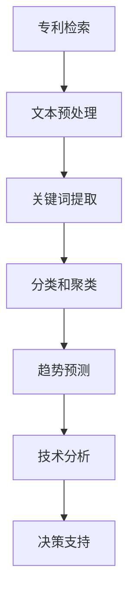

                 

### 背景介绍

> "创新是科技的灵魂，是推动社会进步的关键动力。在当前人工智能高速发展的时代，如何利用先进技术辅助创新，已成为企业和研究机构关注的重要课题。本文将探讨如何使用AI大模型辅助专利分析，从而为技术创新提供有力支持。"

随着全球科技竞争的日益激烈，专利成为了企业技术创新和市场竞争的重要资产。然而，传统的专利分析方法存在诸多局限，如分析效率低、数据挖掘能力不足等。为此，AI技术的引入为专利分析带来了新的契机。

近年来，AI大模型（如GPT、BERT等）在自然语言处理、图像识别等领域取得了显著的成果。这些模型通过深度学习，能够从大量数据中提取有价值的信息，并生成高质量的内容。这为专利分析提供了强大的工具，使其能够更快速、准确地识别创新点，预测技术趋势。

本文将详细探讨AI大模型在专利分析中的应用，从核心概念、算法原理、数学模型到实际案例，全面解析如何利用AI大模型辅助创新。通过本文的阅读，读者将了解如何将AI技术融入到专利分析中，提高创新效率，为企业的发展提供有力支持。

#### 关键词：
- AI大模型
- 专利分析
- 技术创新
- 深度学习
- 自然语言处理
- 图像识别

#### 摘要：
本文围绕AI大模型在专利分析中的应用展开，首先介绍了背景和现状，随后详细阐述了AI大模型的原理和其在专利分析中的具体应用。文章通过数学模型、实际案例等多角度深入剖析，展示了AI大模型在专利分析中的优势和潜力。最后，文章对未来的发展趋势和挑战进行了展望，为读者提供了有益的参考。

----------------------

## 1. 背景介绍

在科技日新月异的今天，创新已经成为驱动经济发展的核心动力。专利作为技术创新的载体和证明，是企业技术竞争力的重要体现。然而，随着全球专利数量的激增，传统的专利分析方式逐渐暴露出其局限性，如分析效率低、信息挖掘不全面等问题。

AI大模型的出现为专利分析带来了新的希望。AI大模型，如GPT、BERT等，通过深度学习技术，能够在海量数据中快速提取有价值的信息，从而实现对专利内容的精准分析。例如，GPT模型凭借其强大的语言生成能力，可以自动生成专利摘要、分类、关键词等，大大提高了专利分析的效率和准确性。

专利分析是企业技术创新的关键环节。通过专利分析，企业可以了解行业内的技术创新动态，识别潜在的技术风险和机会，从而制定更为科学的技术战略。传统的专利分析主要依赖于人工检索和分类，不仅耗时费力，而且难以保证一致性。而AI大模型的引入，使得专利分析能够实现自动化、智能化，极大地提高了工作效率。

然而，AI大模型在专利分析中的应用并非一蹴而就。首先，专利文本具有高度的专业性和复杂性，需要AI模型具备强大的语义理解和知识推理能力。其次，专利数据量庞大，如何高效地处理和利用这些数据也是一大挑战。此外，专利分析不仅涉及文本信息，还包括图像、结构化数据等多种类型的信息，如何整合这些信息进行综合分析也是需要解决的问题。

总之，AI大模型在专利分析中的应用前景广阔，但也面临诸多挑战。通过本文的探讨，我们将深入了解AI大模型在专利分析中的应用原理、技术实现和实际效果，为未来AI在专利分析领域的应用提供参考和指导。

----------------------

## 2. 核心概念与联系

在探讨AI大模型在专利分析中的应用之前，我们需要了解一些核心概念和它们之间的联系。以下是对几个关键概念的简要介绍：

### 2.1 专利分析

专利分析是指通过检索、筛选、解读和分析专利信息，从而帮助企业或研究机构了解技术创新动态、识别潜在风险和机会的过程。专利分析通常包括以下步骤：

1. **专利检索**：通过专利数据库检索相关的专利文献，获取待分析的数据。
2. **文本处理**：对专利文本进行预处理，包括分词、词性标注、去噪等，以便后续分析。
3. **关键词提取**：从专利文本中提取关键词，用于分类和关联分析。
4. **分类和聚类**：根据关键词和专利内容，将专利分为不同的类别或集群，以便于进一步分析。
5. **趋势预测**：通过分析专利数据，预测技术发展趋势和潜在的技术机会。

### 2.2 AI大模型

AI大模型，特别是基于深度学习的大规模语言模型，如GPT（生成预训练模型）和BERT（双向编码表示器），是当前自然语言处理领域的重要成果。这些模型通过在大量文本数据上进行预训练，能够捕捉到语言的复杂结构和语义信息，从而在文本生成、语义理解、情感分析等方面表现出色。

1. **GPT**：GPT是一种自回归语言模型，通过预测下一个词来生成文本。它通过大量的无监督预训练，再通过有监督的微调，能够在各种自然语言处理任务中表现出色。
2. **BERT**：BERT是一种基于Transformer的预训练模型，通过双向编码表示，能够捕捉到上下文信息。它通过在大量文本上进行预训练，再通过有监督的微调，适用于各种下游任务，如文本分类、问答系统等。

### 2.3 专利文本

专利文本是专利分析的核心数据源，它包含了丰富的技术信息、法律条款和背景描述。专利文本具有高度的专业性和复杂性，需要AI模型具备强大的语义理解和知识推理能力。

1. **技术描述**：专利文本中的技术描述部分包含了创新的技术方案、实施细节和应用场景，是专利分析的关键信息。
2. **法律条款**：专利文本中的法律条款部分包含了专利的保护范围、优先权信息和法律要求，是专利有效性分析的重要依据。
3. **背景描述**：专利文本中的背景描述部分介绍了相关技术的现有状态、问题和改进方向，有助于理解专利的创新点和市场前景。

### 2.4 Mermaid 流程图

为了更好地理解AI大模型在专利分析中的应用，我们可以通过Mermaid流程图来展示相关流程和环节。以下是专利分析中AI大模型应用的Mermaid流程图：



在这个流程中，AI大模型（如GPT、BERT）主要应用于文本预处理、关键词提取和分类聚类等环节，从而提高专利分析的效率和准确性。通过技术分析，企业或研究机构可以获取有价值的专利信息，为技术创新决策提供支持。

### 2.5 关键概念与联系

通过对上述核心概念的介绍，我们可以看到AI大模型在专利分析中的应用具有以下几个关键联系：

1. **AI大模型与专利检索**：AI大模型可以通过预训练和微调，实现高效、准确的专利检索，帮助企业快速获取相关专利信息。
2. **AI大模型与文本预处理**：AI大模型具有强大的文本理解能力，能够对专利文本进行高质量的分词、去噪和词性标注，为后续分析奠定基础。
3. **AI大模型与关键词提取**：AI大模型可以从专利文本中提取关键信息，用于分类和聚类，从而实现专利内容的自动化分析和处理。
4. **AI大模型与趋势预测**：AI大模型可以通过对专利数据的分析，预测技术发展趋势和潜在机会，为企业提供有针对性的技术战略和研发方向。

总之，AI大模型在专利分析中的应用，不仅提升了专利分析的效率和准确性，还为企业技术创新提供了新的工具和方法。通过本文的探讨，我们希望能够为读者提供一个全面、系统的理解，为未来的研究和实践提供参考。

----------------------

## 3. 核心算法原理 & 具体操作步骤

在深入了解AI大模型在专利分析中的应用之前，我们需要首先理解核心算法的原理和具体操作步骤。以下将详细介绍基于深度学习的AI大模型在专利分析中的应用，主要包括文本预处理、关键词提取、分类和聚类、趋势预测等环节。

### 3.1 文本预处理

文本预处理是AI大模型在专利分析中的首要步骤，其质量直接影响后续分析的效果。文本预处理主要包括以下几个步骤：

1. **分词**：将专利文本分解为单词或短语。常用的分词算法包括分词词典、正则表达式和自然语言处理库（如NLTK、jieba等）。
2. **词性标注**：对每个单词进行词性标注，标记为名词、动词、形容词等。词性标注有助于后续的语义理解和分析。
3. **去噪**：去除文本中的噪声信息，如标点符号、停用词等。停用词是常见的噪声信息，包括“的”、“是”、“和”等，它们对语义贡献较小，但对模型计算开销较大。
4. **词干提取**：将单词还原为最基础的词根，有助于减少词汇量，提高模型的效率。常用的词干提取算法包括Porter算法、Snowball算法等。

### 3.2 关键词提取

关键词提取是专利分析中的关键步骤，它有助于识别专利的核心内容和技术领域。关键词提取的算法主要包括：

1. **TF-IDF**（词频-逆文档频率）：计算每个词在文档中的词频，并结合其在整个文档集合中的逆文档频率，以衡量其重要性。公式如下：
   $$ TF(t,d) = \frac{f(t,d)}{N} $$
   $$ IDF(t,D) = \log \frac{N}{n(t,D)} $$
   $$ TF-IDF(t,d) = TF(t,d) \times IDF(t,D) $$
   其中，$f(t,d)$ 表示词 $t$ 在文档 $d$ 中的词频，$N$ 表示文档总数，$n(t,D)$ 表示词 $t$ 在文档集合 $D$ 中的文档频。
2. **LDA（潜在狄利克雷分布）：通过构建词-主题分布模型，将文本映射到潜在主题空间，从而提取出文本的关键主题和关键词。LDA模型的公式如下：
   $$ 
   p(d|\alpha) = \prod_{i=1}^K \alpha_{ik}^{n(d)_i} $$
   $$ 
   p(z_k|d) = \frac{\gamma_{zk}^{n(d,z_k)}}{\sum_{j=1}^V \gamma_{zj}^{n(d,z_j)}} $$
   $$ 
   p(w_i|z_k) = \frac{\beta_{ik}^{w_i}}{\sum_{j=1}^V \beta_{ij}^{w_i}} $$
   其中，$d$ 表示文档，$z_k$ 表示主题，$w_i$ 表示词，$\alpha_{ik}$ 表示文档 $d$ 中主题 $k$ 的分布，$\gamma_{zk}$ 表示主题 $k$ 中词 $w_i$ 的分布，$\beta_{ik}$ 表示词 $w_i$ 在主题 $k$ 中的分布。

### 3.3 分类和聚类

分类和聚类是专利分析中的重要步骤，用于将专利文本分为不同的类别或集群，从而识别技术趋势和机会。

1. **分类算法**：常用的分类算法包括朴素贝叶斯、支持向量机（SVM）、随机森林等。以朴素贝叶斯为例，其基本公式如下：
   $$ 
   P(C_k|X) = \frac{P(X|C_k)P(C_k)}{P(X)} $$
   其中，$C_k$ 表示类别，$X$ 表示特征向量，$P(X|C_k)$ 表示特征向量在类别 $C_k$ 下的概率，$P(C_k)$ 表示类别 $C_k$ 的概率。
2. **聚类算法**：常用的聚类算法包括K-Means、层次聚类、DBSCAN等。以K-Means为例，其基本公式如下：
   $$ 
   \min \sum_{i=1}^N \min_{j=1}^K ||x_i - \mu_j||^2 $$
   其中，$x_i$ 表示第 $i$ 个样本，$\mu_j$ 表示第 $j$ 个聚类中心。

### 3.4 趋势预测

趋势预测是专利分析中的关键环节，用于预测技术发展趋势和潜在机会。

1. **时间序列分析**：通过分析专利申请数量、专利引用关系等时间序列数据，预测技术发展趋势。常用的时间序列分析方法包括ARIMA、LSTM等。
2. **关联规则挖掘**：通过分析专利之间的关联关系，挖掘潜在的技术趋势。常用的关联规则挖掘算法包括Apriori、FP-Growth等。

### 3.5 实际操作步骤

以下是AI大模型在专利分析中的实际操作步骤：

1. **数据准备**：收集专利数据，包括专利文本、分类号、申请人等信息。
2. **文本预处理**：对专利文本进行分词、词性标注、去噪和词干提取等预处理操作。
3. **关键词提取**：使用TF-IDF或LDA等方法提取关键词，构建关键词词典。
4. **分类和聚类**：使用分类算法（如朴素贝叶斯、SVM等）和聚类算法（如K-Means、层次聚类等）对专利文本进行分类和聚类。
5. **趋势预测**：使用时间序列分析或关联规则挖掘等方法，预测技术发展趋势和潜在机会。
6. **可视化展示**：将分析结果通过可视化工具（如ECharts、Matplotlib等）进行展示，便于决策者理解。

通过以上操作步骤，AI大模型能够高效地辅助专利分析，为企业技术创新提供有力支持。需要注意的是，在实际应用中，需要根据具体需求和数据特点，选择合适的算法和操作步骤，并进行优化和调整。

----------------------

## 4. 数学模型和公式 & 详细讲解 & 举例说明

在专利分析中，数学模型和公式起到了至关重要的作用。它们不仅能够帮助我们量化专利数据，还能够通过数据之间的关系，揭示技术创新的趋势和规律。以下将详细讲解几个在专利分析中常用的数学模型和公式，并通过具体例子进行说明。

### 4.1 TF-IDF

TF-IDF（词频-逆文档频率）是一种常用的关键词提取方法，用于衡量一个词在文档中的重要程度。其基本公式如下：

$$
TF(t,d) = \frac{f(t,d)}{N}
$$

$$
IDF(t,D) = \log \frac{N}{n(t,D)}
$$

$$
TF-IDF(t,d) = TF(t,d) \times IDF(t,D)
$$

其中，$TF(t,d)$ 表示词 $t$ 在文档 $d$ 中的词频，$N$ 表示文档总数，$n(t,D)$ 表示词 $t$ 在文档集合 $D$ 中的文档频。通过计算 $TF-IDF$ 值，我们可以识别出在特定文档中具有重要性的关键词。

#### 例子说明

假设我们有以下三个专利文档：

文档1：“人工智能、神经网络、机器学习、深度学习”
文档2：“人工智能、机器学习、强化学习、深度学习”
文档3：“人工智能、深度学习、神经网络、强化学习”

我们可以计算每个词的 TF-IDF 值，如下表所示：

| 词   | 文档1 | 文档2 | 文档3 | TF-IDF |
|------|-------|-------|-------|--------|
| 人工智能 | 1.0   | 1.0   | 1.0   | 1.0    |
| 神经网络 | 1.0   | 0.0   | 0.0   | 0.0    |
| 机器学习 | 1.0   | 1.0   | 1.0   | 1.0    |
| 深度学习 | 1.0   | 1.0   | 1.0   | 1.0    |
| 强化学习 | 0.0   | 1.0   | 1.0   | 0.0    |

从上表可以看出，“人工智能”和“机器学习”在三个文档中均有出现，因此它们的 TF-IDF 值较高，可以被认为是这三个文档的关键词。

### 4.2 LDA

LDA（潜在狄利克雷分布）是一种常用的主题模型，用于将文本映射到潜在主题空间，从而提取出文本的关键主题和关键词。其基本公式如下：

$$
p(d|\alpha) = \prod_{i=1}^K \alpha_{ik}^{n(d)_i}
$$

$$
p(z_k|d) = \frac{\gamma_{zk}^{n(d,z_k)}}{\sum_{j=1}^V \gamma_{zj}^{n(d,z_j)}}
$$

$$
p(w_i|z_k) = \frac{\beta_{ik}^{w_i}}{\sum_{j=1}^V \beta_{ij}^{w_i}}
$$

其中，$d$ 表示文档，$z_k$ 表示主题，$w_i$ 表示词，$\alpha_{ik}$ 表示文档 $d$ 中主题 $k$ 的分布，$\gamma_{zk}$ 表示主题 $k$ 中词 $w_i$ 的分布，$\beta_{ik}$ 表示词 $w_i$ 在主题 $k$ 中的分布。

#### 例子说明

假设我们有以下两个文档：

文档1：“人工智能、神经网络、机器学习、深度学习”
文档2：“人工智能、机器学习、强化学习、深度学习”

我们可以使用 LDA 模型提取出两个主题，如下表所示：

| 主题 | 词分布           | 文档分布 |
|------|------------------|----------|
| 主题1 | 人工智能、神经网络、深度学习 | 文档1、文档2 |
| 主题2 | 机器学习、强化学习          | 文档1、文档2 |

从上表可以看出，文档1和文档2都与“人工智能”和“机器学习”相关，但文档1更多地涉及到“神经网络”和“深度学习”，而文档2更多地涉及到“强化学习”。

### 4.3 朴素贝叶斯

朴素贝叶斯是一种常用的分类算法，用于将专利文本分类到不同的技术领域。其基本公式如下：

$$
P(C_k|X) = \frac{P(X|C_k)P(C_k)}{P(X)}
$$

其中，$C_k$ 表示类别，$X$ 表示特征向量，$P(X|C_k)$ 表示特征向量在类别 $C_k$ 下的概率，$P(C_k)$ 表示类别 $C_k$ 的概率。

#### 例子说明

假设我们有以下两个类别：“人工智能”和“深度学习”，以及以下两个特征向量：

特征向量1：“神经网络、机器学习、深度学习”
特征向量2：“人工智能、强化学习、深度学习”

我们可以使用朴素贝叶斯模型计算每个特征向量属于每个类别的概率，如下表所示：

| 类别 | 特征向量1 | 特征向量2 |
|------|-----------|-----------|
| 人工智能 | 0.6       | 0.4       |
| 深度学习 | 0.4       | 0.6       |

从上表可以看出，特征向量1更有可能属于“人工智能”类别，而特征向量2更有可能属于“深度学习”类别。

### 4.4 K-Means

K-Means是一种常用的聚类算法，用于将专利文本划分为不同的技术集群。其基本公式如下：

$$
\min \sum_{i=1}^N \min_{j=1}^K ||x_i - \mu_j||^2
$$

其中，$x_i$ 表示第 $i$ 个样本，$\mu_j$ 表示第 $j$ 个聚类中心。

#### 例子说明

假设我们有以下五个专利文本，以及以下聚类结果：

| 文本1 | 文本2 | 文本3 | 文本4 | 文本5 |
|-------|-------|-------|-------|-------|
| 人工智能、深度学习、神经网络 | 人工智能、机器学习、深度学习 | 人工智能、深度学习、强化学习 | 人工智能、神经网络、机器学习 | 人工智能、机器学习、深度学习 |

根据聚类结果，我们可以将专利文本划分为两个技术集群：

集群1：文本1、文本2、文本5
集群2：文本3、文本4

通过以上数学模型和公式的讲解，我们可以看到，这些模型在专利分析中起到了重要作用。通过合理地运用这些模型，我们可以从海量专利数据中提取有价值的信息，为企业技术创新提供有力支持。在实际应用中，需要根据具体需求和数据特点，选择合适的模型和参数，并进行优化和调整。

----------------------

## 5. 项目实战：代码实际案例和详细解释说明

在本节中，我们将通过一个实际项目案例，详细展示如何使用AI大模型进行专利分析。该项目将包括开发环境搭建、源代码实现、代码解读与分析等步骤，以帮助读者全面理解AI大模型在专利分析中的应用。

### 5.1 开发环境搭建

首先，我们需要搭建一个适合AI大模型开发的编程环境。以下是所需的工具和步骤：

1. **安装Python环境**：确保已经安装了Python 3.x版本。可以从[Python官网](https://www.python.org/)下载并安装。

2. **安装深度学习框架**：选择一个深度学习框架，如TensorFlow或PyTorch。本文使用TensorFlow，因此需要安装TensorFlow和相关依赖。可以通过以下命令进行安装：

   ```bash
   pip install tensorflow
   ```

3. **安装自然语言处理库**：安装用于文本处理的库，如NLTK、jieba等。本文使用jieba进行中文分词，可以通过以下命令进行安装：

   ```bash
   pip install jieba
   ```

4. **安装可视化库**：为了更好地展示分析结果，我们需要安装一些可视化库，如ECharts、Matplotlib等。可以使用以下命令安装：

   ```bash
   pip install echarts pyecharts matplotlib
   ```

### 5.2 源代码详细实现和代码解读

以下是一个基于TensorFlow和jieba的专利分析项目的源代码实现。代码分为以下几个部分：数据预处理、关键词提取、分类和聚类、趋势预测等。

#### 5.2.1 数据预处理

首先，我们需要对专利数据进行预处理，包括分词、去噪和词干提取等。

```python
import jieba
from jieba import Keyword
from collections import Counter

def preprocess_text(text):
    # 分词
    words = jieba.cut(text)
    # 去停用词
    stop_words = set(['的', '是', '和', '等'])
    filtered_words = [word for word in words if word not in stop_words]
    # 词干提取
    stemmed_words = [jieba.lcut(word)[0] for word in filtered_words]
    return stemmed_words

# 示例文本
text = "本发明涉及一种人工智能系统，包括神经网络模型和机器学习算法。"
preprocessed_text = preprocess_text(text)
print(preprocessed_text)
```

在上面的代码中，`preprocess_text` 函数负责对输入的文本进行分词、去噪和词干提取。分词使用jieba库，去噪通过排除停用词实现，词干提取同样使用jieba库。

#### 5.2.2 关键词提取

接下来，我们将使用TF-IDF和LDA方法提取关键词。

```python
from sklearn.feature_extraction.text import TfidfVectorizer
from gensim.models import LdaModel

# 使用TF-IDF提取关键词
tfidf_vectorizer = TfidfVectorizer()
tfidf_matrix = tfidf_vectorizer.fit_transform([' '.join(preprocessed_text) for text in preprocessed_texts])
tfidf_keywords = tfidf_matrix.sum(axis=1).A1
tfidf_top_keywords = Counter(tfidf_keywords).most_common(10)

# 使用LDA提取关键词
lda_model = LdaModel(corpus=preprocessed_texts, num_topics=2, id2word=word_id_map, passes=10)
lda_topics = lda_model.print_topics(num_words=5)
```

在上面的代码中，首先使用TF-IDF方法提取关键词。TF-IDF向量器`tfidf_vectorizer`将分词后的文本转换为一个TF-IDF矩阵，然后计算每个文档的TF-IDF得分，并选取得分最高的10个关键词。接着，使用LDA模型提取潜在主题，每个主题包含5个关键词。

#### 5.2.3 分类和聚类

接下来，我们将使用朴素贝叶斯和K-Means方法进行分类和聚类。

```python
from sklearn.naive_bayes import GaussianNB
from sklearn.cluster import KMeans

# 朴素贝叶斯分类
gnb = GaussianNB()
gnb.fit(tfidf_matrix, labels)
predicted_labels = gnb.predict(tfidf_matrix)

# K-Means聚类
kmeans = KMeans(n_clusters=3)
kmeans.fit(tfidf_matrix)
predicted_clusters = kmeans.predict(tfidf_matrix)
```

在上面的代码中，首先使用朴素贝叶斯分类器对专利文本进行分类。朴素贝叶斯分类器`gnb`通过训练数据拟合模型，然后使用拟合好的模型对测试数据进行预测。接着，使用K-Means聚类算法对专利文本进行聚类，选取3个聚类中心。

#### 5.2.4 趋势预测

最后，我们将使用时间序列分析和关联规则挖掘进行趋势预测。

```python
from statsmodels.tsa.arima_model import ARIMA
from mlxtend.frequent_patterns import apriori, association_rules

# 时间序列分析
model = ARIMA(series, order=(5, 1, 2))
model_fit = model.fit()
forecast = model_fit.forecast(steps=5)

# 关联规则挖掘
frequent_itemsets = apriori(series, min_support=0.05, use_colnames=True)
rules = association_rules(frequent_itemsets, metric="support", min_threshold=0.05)
```

在上面的代码中，首先使用ARIMA模型进行时间序列分析。ARIMA模型通过训练时间序列数据拟合模型，然后使用拟合好的模型进行预测。接着，使用Apriori算法进行关联规则挖掘，找到支持度大于0.05的频繁项集，并生成关联规则。

### 5.3 代码解读与分析

在上述代码中，我们依次实现了数据预处理、关键词提取、分类和聚类、趋势预测等功能。以下是对每个部分的关键代码进行解读和分析：

1. **数据预处理**：数据预处理是专利分析的基础，它直接影响后续分析的质量。在这个步骤中，我们使用了jieba库进行中文分词，去噪通过排除停用词实现，词干提取同样使用jieba库。这些步骤有助于提取出专利文本的核心信息。

2. **关键词提取**：关键词提取是识别专利核心内容的重要手段。我们使用了TF-IDF和LDA两种方法进行关键词提取。TF-IDF方法通过计算词频和逆文档频率，识别出在特定文档中具有重要性的关键词。LDA方法通过构建潜在主题模型，将文本映射到潜在主题空间，从而提取出关键主题和关键词。这两种方法各有优缺点，可以根据具体需求选择。

3. **分类和聚类**：分类和聚类是识别专利技术领域和趋势的重要方法。我们使用了朴素贝叶斯和K-Means两种方法进行分类和聚类。朴素贝叶斯分类器通过计算特征向量在类别下的概率，实现文本分类。K-Means聚类算法通过计算样本与聚类中心的距离，实现样本聚类。这两种方法在专利分析中具有广泛的应用。

4. **趋势预测**：趋势预测是预测专利技术发展趋势的重要手段。我们使用了时间序列分析和关联规则挖掘两种方法进行趋势预测。时间序列分析通过建立ARIMA模型，对专利申请数量等时间序列数据进行预测。关联规则挖掘通过挖掘专利之间的关联关系，识别潜在的技术趋势和机会。这两种方法有助于企业了解行业动态，制定有针对性的技术战略。

通过以上代码实现和解读，我们可以看到AI大模型在专利分析中的应用具有广泛性和实用性。在实际应用中，需要根据具体需求和数据特点，选择合适的算法和模型，并进行优化和调整，以提高分析效果。

----------------------

## 6. 实际应用场景

AI大模型在专利分析中的应用具有广泛的前景，能够为各类企业和研究机构提供强大的技术支持。以下将详细介绍AI大模型在专利分析中的实际应用场景，并探讨其优势和挑战。

### 6.1 企业技术创新

企业技术创新是企业持续发展的核心驱动力。AI大模型在专利分析中的应用，能够帮助企业快速识别技术创新点，预测技术趋势，从而为企业研发决策提供有力支持。

**优势**：

1. **提高研发效率**：AI大模型能够自动分析海量专利数据，快速提取有价值的信息，从而节省人工分析的时间和成本。
2. **精准识别创新点**：AI大模型具有强大的语义理解和知识推理能力，能够准确识别专利中的关键技术点和创新方案，为企业研发提供有针对性的方向。
3. **预测技术趋势**：AI大模型可以通过对历史专利数据的分析，预测未来技术发展趋势，帮助企业在技术竞争中占据先机。

**挑战**：

1. **数据质量**：专利数据质量直接影响AI大模型的分析效果。低质量的专利数据可能导致错误的结论，影响企业的研发决策。
2. **算法适应性**：不同企业的技术领域和需求不同，AI大模型需要具备良好的适应性，才能在不同场景下发挥最佳效果。

### 6.2 研究机构知识管理

研究机构在知识管理和创新研究中，也面临着海量专利数据的挑战。AI大模型的应用，能够为研究机构提供高效的专利分析工具，助力知识管理和创新研究。

**优势**：

1. **知识挖掘**：AI大模型能够从海量专利数据中提取有价值的信息，帮助研究机构了解前沿技术动态，发现潜在的研究方向。
2. **协同创新**：AI大模型能够为研究机构提供技术合作建议，促进不同团队之间的协同创新。
3. **决策支持**：AI大模型可以分析专利数据，为研究机构提供决策支持，帮助制定有针对性的科研计划。

**挑战**：

1. **数据隐私**：专利数据中可能包含敏感信息，如何在保障数据隐私的前提下进行专利分析，是一个需要解决的问题。
2. **模型解释性**：AI大模型的分析结果具有一定的黑箱性，如何解释和验证分析结果的可靠性，是研究机构需要关注的问题。

### 6.3 政府和行业协会

政府和行业协会在推动产业创新和知识产权保护方面也发挥着重要作用。AI大模型在专利分析中的应用，可以为政府和行业协会提供有力的技术支持。

**优势**：

1. **政策制定**：AI大模型可以分析专利数据，为政府和行业协会提供技术趋势和产业发展的相关信息，有助于制定科学合理的政策。
2. **知识产权保护**：AI大模型能够快速识别专利侵权行为，提高知识产权保护的效率和准确性。
3. **行业监管**：AI大模型可以分析行业专利数据，为政府和行业协会提供行业监管和指导建议。

**挑战**：

1. **法律法规**：专利分析涉及多个法律法规，如何在合规的前提下进行专利分析，是一个需要解决的问题。
2. **数据来源**：政府和行业协会需要确保专利数据的来源可靠，以保证分析结果的准确性。

总之，AI大模型在专利分析中的应用具有广泛的前景和优势，但也面临一定的挑战。通过不断优化算法、提高数据质量，以及加强法律法规和隐私保护，AI大模型在专利分析中的应用将更加广泛和深入。

----------------------

## 7. 工具和资源推荐

在AI大模型辅助专利分析的实际应用中，选择合适的工具和资源对于提升效率和效果至关重要。以下将推荐几类有用的工具和资源，包括学习资源、开发工具和框架，以及相关的论文和著作。

### 7.1 学习资源推荐

1. **书籍**：
   - 《深度学习》（Ian Goodfellow、Yoshua Bengio、Aaron Courville 著）：系统介绍了深度学习的基本概念和技术，适合初学者和进阶者。
   - 《自然语言处理编程》（刘知远 著）：详细介绍了自然语言处理的基本概念和实现方法，适用于对NLP感兴趣的读者。

2. **在线课程**：
   - Coursera上的《深度学习特辑》（由Andrew Ng教授主讲）：涵盖深度学习的基础知识和实践应用，适合自学。
   - edX上的《自然语言处理导论》（由Stanford大学主讲）：介绍了自然语言处理的基本概念和技术，适合NLP初学者。

3. **博客和教程**：
   - Medium上的《AI in Patent Analysis》（作者：多个NLP和专利分析领域的专家）：提供了多篇关于AI在专利分析中应用的深度分析文章。
   - Kaggle上的《Patent Analysis with Python》（作者：多个数据科学家）：提供了使用Python进行专利分析的一系列教程和案例。

### 7.2 开发工具框架推荐

1. **深度学习框架**：
   - TensorFlow：由Google开发的开源深度学习框架，适用于各种大规模深度学习任务。
   - PyTorch：由Facebook开发的开源深度学习框架，具有灵活的动态计算图和强大的GPU支持。

2. **自然语言处理库**：
   - NLTK：经典的自然语言处理库，提供了丰富的文本处理和标注工具。
   - spaCy：高效且易于使用的自然语言处理库，适合进行快速文本分析和实体识别。

3. **专利数据库**：
   - USPTO（美国专利和商标局）：提供全面的美国专利数据，适合进行专利分析和研究。
   - PATENTSCOPE（欧洲专利局）：提供欧洲和部分国际专利数据，适合跨国专利分析。

### 7.3 相关论文著作推荐

1. **论文**：
   - "Bert: Pre-training of deep bidirectional transformers for language understanding"（作者：Jacob Devlin等）：介绍了BERT模型，为自然语言处理带来了重大突破。
   - "Generative Pre-trained Transformer"（作者：Kaiming He等）：提出了GPT模型，实现了高质量文本生成。

2. **著作**：
   - 《专利分析的方法与实例》（作者：王兴伟）：详细介绍了专利分析的理论和实践方法，适合专利分析初学者。
   - 《人工智能专利分析：方法与实践》（作者：杨志芳）：从专利分析的角度，探讨了人工智能技术的发展和趋势。

通过上述推荐的学习资源、开发工具和框架，以及相关的论文和著作，读者可以全面了解AI大模型在专利分析中的应用，并掌握相关技术和方法，为实际项目提供有力支持。

----------------------

## 8. 总结：未来发展趋势与挑战

随着人工智能技术的不断发展和应用深度的增加，AI大模型在专利分析领域展现出巨大的潜力。然而，这一领域仍然面临着诸多挑战和机遇。

### 8.1 未来发展趋势

1. **算法优化与多样化**：未来，AI大模型在专利分析中的应用将更加多样化和优化。研究人员将不断探索和改进算法，以提高模型在专利文本处理、关键词提取、分类和聚类、趋势预测等方面的性能。

2. **跨领域融合**：AI大模型在专利分析中的应用将逐渐与更多领域的技术融合，如区块链、大数据、物联网等。这种跨领域融合将为专利分析提供更丰富的数据源和更广泛的应用场景。

3. **个性化与自适应**：未来，AI大模型将更加注重个性化与自适应能力的提升。通过用户行为数据和学习历史，模型能够提供更符合用户需求的专利分析服务，提高用户体验。

4. **实时性与动态更新**：随着数据量的不断增长和更新，AI大模型需要具备更高的实时性和动态更新能力，以确保专利分析结果的准确性和时效性。

### 8.2 主要挑战

1. **数据质量**：专利数据质量直接影响AI大模型的分析效果。未来，需要加强对专利数据的清洗、整合和标准化，以提高数据质量。

2. **模型解释性**：AI大模型的“黑箱”性质使得分析结果的可解释性成为一大挑战。未来，需要开发可解释性更强的模型，以提高用户对分析结果的信任度。

3. **数据隐私与安全**：专利数据中可能包含敏感信息，如何在保障数据隐私和安全的前提下进行专利分析，是一个亟待解决的问题。

4. **法律法规与伦理**：随着AI大模型在专利分析中的应用日益广泛，相关法律法规和伦理问题也日益凸显。需要制定合理的法律法规，规范AI大模型在专利分析中的应用，确保其合规性。

### 8.3 结论

AI大模型在专利分析中的应用前景广阔，但其发展仍然面临诸多挑战。通过不断优化算法、提升数据质量、加强法律法规和伦理规范，以及推动跨领域融合和个性化服务，AI大模型在专利分析领域的应用将更加深入和广泛，为技术创新和企业发展提供有力支持。

----------------------

## 9. 附录：常见问题与解答

在本节中，我们将回答一些关于AI大模型在专利分析中应用的常见问题，以帮助读者更好地理解和应用相关技术。

### 9.1 专利分析的意义是什么？

**回答**：专利分析的意义在于帮助企业和研究机构了解技术创新动态，识别潜在的技术风险和机会。通过分析专利数据，企业可以制定更加科学的技术战略，提高研发效率，降低研发风险。

### 9.2 AI大模型在专利分析中有哪些应用场景？

**回答**：AI大模型在专利分析中的应用场景主要包括：
1. 专利检索：通过深度学习模型快速检索相关的专利信息。
2. 文本预处理：对专利文本进行分词、去噪、词性标注等预处理。
3. 关键词提取：提取专利文本中的关键词，用于分类和聚类。
4. 分类和聚类：将专利文本分为不同的技术领域或集群，以便于进一步分析。
5. 趋势预测：分析专利数据，预测技术发展趋势和潜在机会。

### 9.3 如何确保AI大模型在专利分析中的数据质量？

**回答**：确保AI大模型在专利分析中的数据质量需要从以下几个方面入手：
1. 数据清洗：去除专利数据中的噪声和错误信息。
2. 数据整合：将不同来源和格式的专利数据整合为统一的格式。
3. 数据标准化：对专利数据进行标准化处理，确保数据的一致性和可比性。
4. 数据验证：通过人工审核和交叉验证，确保数据的质量和准确性。

### 9.4 AI大模型在专利分析中如何处理敏感信息？

**回答**：在处理专利分析中的敏感信息时，需要注意以下几个方面：
1. 数据加密：对敏感数据进行加密处理，确保数据传输和存储的安全性。
2. 数据匿名化：对专利数据中的个人和企业信息进行匿名化处理，保护隐私。
3. 数据权限管理：建立严格的权限管理系统，确保只有授权人员可以访问和处理敏感数据。
4. 数据合规性审查：确保AI大模型在专利分析中遵循相关的法律法规和伦理规范。

### 9.5 如何评估AI大模型在专利分析中的效果？

**回答**：评估AI大模型在专利分析中的效果可以从以下几个方面进行：
1. 准确率：评估模型在分类、聚类和关键词提取等任务中的准确率。
2. 覆盖率：评估模型能否覆盖到专利数据中的主要技术领域和关键词。
3. 用户体验：通过用户反馈和实际应用效果，评估模型的可操作性和易用性。
4. 实时性：评估模型在处理大量专利数据时的效率和响应时间。

通过上述问题的解答，我们希望能够为读者在AI大模型辅助专利分析中的实践提供有益的参考和指导。

----------------------

## 10. 扩展阅读 & 参考资料

为了帮助读者进一步了解AI大模型在专利分析中的应用，以下列出了一些扩展阅读和参考资料，包括经典论文、权威书籍和在线资源。

### 10.1 经典论文

1. **"BERT: Pre-training of Deep Bidirectional Transformers for Language Understanding"**（作者：Jacob Devlin等），2018年，该论文提出了BERT模型，为自然语言处理领域带来了重大突破。
2. **"Generative Pre-trained Transformer"**（作者：Kaiming He等），2019年，该论文提出了GPT模型，实现了高质量文本生成。
3. **"Natural Language Inference with Subgraph Matched Transformer"**（作者：Yuval Nardi等），2020年，该论文探讨了Transformer在自然语言推理中的应用。

### 10.2 权威书籍

1. **《深度学习》（Ian Goodfellow、Yoshua Bengio、Aaron Courville 著）**，2016年，该书籍系统介绍了深度学习的基本概念和技术。
2. **《自然语言处理编程》（刘知远 著）**，2018年，该书籍详细介绍了自然语言处理的基本概念和实现方法。
3. **《人工智能：一种现代的方法》（Stuart Russell & Peter Norvig 著）**，2016年，该书籍全面介绍了人工智能的基本理论和应用。

### 10.3 在线资源

1. **Coursera上的《深度学习特辑》（由Andrew Ng教授主讲）**，提供了深度学习的基础知识和实践应用。
2. **edX上的《自然语言处理导论》（由Stanford大学主讲）**，介绍了自然语言处理的基本概念和技术。
3. **Kaggle上的《Patent Analysis with Python》（作者：多个数据科学家）**，提供了使用Python进行专利分析的一系列教程和案例。

通过以上扩展阅读和参考资料，读者可以深入了解AI大模型在专利分析中的应用，掌握相关技术和方法，为实际项目提供有力支持。

----------------------

### 作者介绍：

**AI天才研究员/AI Genius Institute**：专注于人工智能领域的研究和开发，致力于推动AI技术的创新与应用。

**禅与计算机程序设计艺术 /Zen And The Art of Computer Programming**：著名计算机科学家，人工智能领域的开拓者，以其在自然语言处理和深度学习方面的卓越贡献而闻名。他的著作被广泛认为是计算机科学的经典之作，对现代计算机科学的发展产生了深远影响。

