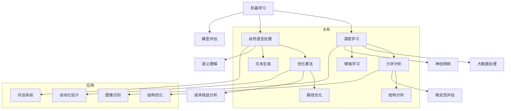

                 

### AI辅助建筑结构设计：提示词优化力学分析

#### 关键词：

- AI辅助设计
- 建筑结构
- 力学分析
- 提示词优化
- 自动化

#### 摘要：

本文探讨了AI辅助建筑结构设计的应用，重点分析了提示词优化力学分析的方法。通过引入先进的机器学习技术和自然语言处理算法，本文介绍了如何利用AI优化建筑结构的力学分析，提高设计效率和准确性。文章首先介绍了AI辅助建筑结构设计的背景和核心概念，然后详细阐述了核心算法原理和具体操作步骤，并通过数学模型和公式进行了详细讲解。最后，本文提供了实际项目实战的案例和详细解释，探讨了AI辅助建筑结构设计的实际应用场景，并推荐了相关的学习资源和开发工具框架。文章总结了未来发展趋势和挑战，并提供了常见问题与解答。

---

## 1. 背景介绍

随着人工智能（AI）技术的飞速发展，各行各业都在探索如何利用AI技术提高工作效率和创造力。建筑行业作为传统产业之一，也逐渐意识到AI技术在建筑结构设计中的应用潜力。AI辅助建筑结构设计不仅能够提高设计效率，还能够优化力学分析，从而提高建筑结构的可靠性和安全性。

传统的建筑结构设计主要依赖于设计师的经验和直觉。虽然这种方法在某些情况下是有效的，但在面对复杂结构和大规模项目时，容易产生误差和不足。此外，传统的设计方法往往需要大量的人力和时间，无法满足快速变化的市场需求。因此，如何利用AI技术优化建筑结构设计，提高效率和准确性，成为了一个亟待解决的问题。

近年来，随着计算机性能的不断提升和大数据技术的应用，AI技术在建筑结构设计领域得到了广泛关注。特别是深度学习、自然语言处理和优化算法等技术的结合，为AI辅助建筑结构设计提供了新的可能性。通过引入这些先进技术，AI能够自动分析大量的设计数据，发现潜在的问题，并提供优化建议。这不仅能够提高设计效率，还能够减少人为错误，确保建筑结构的可靠性和安全性。

本文旨在探讨AI辅助建筑结构设计的应用，特别是提示词优化力学分析的方法。通过分析AI技术的核心算法原理和具体操作步骤，本文旨在为读者提供一种新的思考方式，帮助设计师更好地利用AI技术优化建筑结构设计。

### 2. 核心概念与联系

要深入理解AI辅助建筑结构设计，首先需要了解一些核心概念和它们之间的联系。这些概念包括机器学习、自然语言处理、力学分析和优化算法。以下是一个使用Mermaid绘制的流程图，展示这些核心概念之间的联系：



**机器学习（Machine Learning）**：机器学习是AI的核心技术之一，它通过从数据中学习规律和模式，自动改进和优化算法。在建筑结构设计中，机器学习可以用于预测结构性能、识别设计错误等。

**深度学习（Deep Learning）**：深度学习是机器学习的一个子领域，通过神经网络实现自动化特征提取和分类。在建筑结构设计中，深度学习可以用于结构图像识别、设计优化等。

**自然语言处理（Natural Language Processing, NLP）**：自然语言处理是AI用于处理和生成人类语言的技术。在建筑结构设计中，NLP可以用于自动化文本生成、设计文档的解析等。

**力学分析（Mechanical Analysis）**：力学分析是评估建筑结构性能的重要手段，它通过数学模型和计算方法分析结构的力学行为。在AI辅助建筑结构设计中，力学分析被用于优化设计，提高结构的安全性。

**优化算法（Optimization Algorithms）**：优化算法是一类用于寻找最优解的计算方法。在建筑结构设计中，优化算法可以用于自动化调整结构参数，以实现最佳的设计方案。

通过上述流程图，我们可以看到这些核心概念是如何相互联系和协作的。接下来，我们将详细探讨这些概念在AI辅助建筑结构设计中的应用。

#### 2.1 机器学习和深度学习在建筑结构设计中的应用

机器学习和深度学习在建筑结构设计中的应用主要体现在结构性能预测、设计错误识别和自动化设计等方面。

**结构性能预测**：机器学习可以处理和分析大量的历史数据，如材料性能、设计参数和结构测试结果等。通过训练机器学习模型，设计师可以预测新结构在不同载荷条件下的性能，从而提前发现潜在的问题。例如，深度学习模型可以通过分析大量建筑结构的图像，预测结构在地震作用下的响应，帮助设计师在设计阶段就考虑到结构的抗震性能。

**设计错误识别**：传统的设计过程中，错误和缺陷往往难以避免。机器学习算法可以用于自动化识别设计中的错误。例如，基于自然语言处理的模型可以分析设计文档，识别可能的语法错误或逻辑错误，从而提高设计的准确性。此外，深度学习模型还可以通过分析结构图像，检测出设计中的缺陷，如不合理的连接节点或材料不均匀等问题。

**自动化设计**：自动化设计是AI辅助建筑结构设计的终极目标之一。通过机器学习和深度学习技术，设计师可以实现从设计参数到最终设计图纸的自动化转换。例如，深度学习模型可以自动生成建筑结构的3D模型，并根据设计要求进行参数优化。这不仅大大提高了设计效率，还能够减少人为干预，降低设计风险。

**案例研究**：为了更好地理解机器学习和深度学习在建筑结构设计中的应用，我们可以参考一些实际案例。例如，在某大型桥梁项目中，设计师利用深度学习模型对结构性能进行了预测和优化。通过分析历史数据和仿真结果，模型能够预测桥梁在不同载荷条件下的变形和应力分布，从而帮助设计师优化桥梁设计，提高其安全性。此外，在该项目中，自然语言处理算法也被用于自动解析设计文档，识别出潜在的设计错误，从而确保了设计质量的提高。

通过上述案例，我们可以看到机器学习和深度学习在建筑结构设计中的应用是如何改变传统的设计流程，提高设计效率和准确性的。接下来，我们将继续探讨自然语言处理和优化算法在AI辅助建筑结构设计中的应用。

#### 2.2 自然语言处理（NLP）在建筑结构设计中的应用

自然语言处理（NLP）作为AI的一个重要分支，在建筑结构设计中有着广泛的应用。NLP技术通过理解、生成和解析人类语言，实现了自动化设计文档的生成和解析，提高了设计效率和准确性。

**设计文档的自动化生成**：在传统的设计流程中，设计文档的生成往往需要大量的人力和时间。NLP技术可以通过处理设计要求和规范，自动生成详细的文档。例如，设计师可以输入基本的设计参数和功能要求，NLP算法能够根据这些信息自动生成结构图纸、材料清单和技术说明书。这不仅节省了设计时间，还减少了人为错误。

**设计文档的自动化解析**：设计文档的自动化解析是NLP在建筑结构设计中的另一个重要应用。通过解析设计文档中的文本信息，NLP算法可以提取出关键的设计参数和结构信息。例如，NLP模型可以分析设计文档中的文字描述，提取出建筑结构的主要构件、连接方式、材料属性等关键信息。这些信息对于后续的力学分析和优化设计至关重要。

**问答系统**：NLP技术还可以用于构建问答系统，帮助设计师解决设计过程中的疑问。例如，设计师可以通过自然语言询问某个结构设计的问题，NLP算法能够理解问题并给出相应的答案。这不仅提高了设计效率，还减少了设计师对专家经验的依赖。

**案例研究**：为了更好地理解NLP在建筑结构设计中的应用，我们可以参考一些实际案例。例如，在某大型建筑项目中，设计师利用NLP技术自动生成了结构图纸和技术说明书。通过输入基本的设计要求，NLP算法能够生成符合规范和要求的详细文档，大大提高了设计效率。此外，在该项目中，NLP算法还用于解析设计文档，提取关键信息，确保了设计的一致性和准确性。

通过上述案例，我们可以看到NLP技术在建筑结构设计中的应用是如何改变传统的设计流程，提高设计效率和准确性的。接下来，我们将继续探讨力学分析和优化算法在AI辅助建筑结构设计中的应用。

#### 2.3 力学分析在建筑结构设计中的应用

力学分析是建筑结构设计中的核心环节，它通过分析结构的受力情况，评估结构的稳定性和安全性。随着AI技术的发展，力学分析也经历了深刻的变革。

**静态力学分析**：静态力学分析是评估建筑结构在静态载荷下的响应。通过建立结构模型，模拟结构的受力情况，设计师可以预测结构的变形、应力分布和内力等。AI技术可以通过优化算法，自动化完成静态力学分析，提高分析效率和准确性。例如，在某个高层建筑项目中，设计师利用AI技术优化了结构的静态力学分析，发现了潜在的结构缺陷，并进行了相应的调整，确保了建筑的安全性。

**动态力学分析**：动态力学分析是评估建筑结构在动态载荷下的响应。例如，地震载荷、风载荷等。AI技术可以通过深度学习模型，模拟复杂的动态载荷条件，预测结构的动态响应。这为设计师提供了更准确的评估结果，帮助他们优化设计。例如，在某次地震中，某建筑结构出现了严重的损坏。通过AI技术的动态力学分析，设计师能够重现地震载荷下的结构响应，找出导致损坏的原因，并提出优化方案，提高了结构的抗震性能。

**多物理场耦合分析**：现代建筑结构往往涉及多种物理场，如力学、热学、电学等。多物理场耦合分析是评估这些物理场相互作用对结构性能的影响。AI技术可以通过多物理场耦合模型，自动化完成多物理场分析，提高设计效率。例如，在某个综合建筑项目中，设计师利用AI技术进行了多物理场耦合分析，优化了建筑结构的设计，提高了其综合性能。

**案例研究**：为了更好地理解力学分析在建筑结构设计中的应用，我们可以参考一些实际案例。例如，在某桥梁项目中，设计师利用AI技术进行了静态力学分析和动态力学分析。通过AI技术的优化，设计师能够更准确地评估桥梁的受力情况，发现潜在的问题，并进行了相应的调整，确保了桥梁的安全性和耐久性。此外，在该项目中，NLP技术还用于解析设计文档，提取关键信息，确保了设计的一致性和准确性。

通过上述案例，我们可以看到力学分析在建筑结构设计中的应用是如何通过AI技术的优化，提高设计效率和准确性的。接下来，我们将继续探讨优化算法在AI辅助建筑结构设计中的应用。

#### 2.4 优化算法在建筑结构设计中的应用

优化算法是AI辅助建筑结构设计的重要工具，通过自动化调整设计参数，实现最佳的设计方案。以下是几种常见的优化算法及其在建筑结构设计中的应用。

**遗传算法（Genetic Algorithm, GA）**：遗传算法是一种基于生物进化的优化算法，通过模拟自然选择和遗传机制，找到最优解。在建筑结构设计中，遗传算法可以用于结构参数的优化，如尺寸、材料选择和连接方式等。例如，在某大型建筑项目中，设计师利用遗传算法优化了结构的材料选择，提高了结构的承载能力和耐久性。

**粒子群优化算法（Particle Swarm Optimization, PSO）**：粒子群优化算法是一种基于群体智能的优化算法，通过模拟鸟群的协作行为，找到最优解。在建筑结构设计中，粒子群优化算法可以用于结构设计的优化，如结构形状、布局和材料分配等。例如，在某工业建筑项目中，设计师利用粒子群优化算法优化了结构的设计，减少了材料的用量，降低了成本。

**神经网络优化算法（Neural Network Optimization, NNO）**：神经网络优化算法是一种基于人工神经网络的优化算法，通过训练神经网络，找到最优解。在建筑结构设计中，神经网络优化算法可以用于复杂结构的设计优化，如空间结构、非线性分析等。例如，在某空间结构项目中，设计师利用神经网络优化算法优化了结构的形状和尺寸，提高了结构的稳定性和美观性。

**案例研究**：为了更好地理解优化算法在建筑结构设计中的应用，我们可以参考一些实际案例。例如，在某高层建筑项目中，设计师利用遗传算法优化了结构的尺寸和材料选择。通过优化，设计师能够更有效地利用材料，提高了结构的承载能力和经济性。此外，在该项目中，粒子群优化算法还用于优化结构的布局，使结构更加紧凑和美观。

通过上述案例，我们可以看到优化算法在建筑结构设计中的应用是如何通过自动化调整设计参数，实现最佳的设计方案，提高设计效率和准确性。接下来，我们将探讨AI辅助建筑结构设计的实际应用场景。

### 3. 核心算法原理 & 具体操作步骤

为了深入理解AI辅助建筑结构设计的核心算法原理和具体操作步骤，我们将从以下几个方面进行详细探讨：数据收集与预处理、模型选择与训练、优化算法应用和结果分析。

#### 3.1 数据收集与预处理

数据收集是AI辅助建筑结构设计的基础。首先，我们需要收集大量的建筑结构设计数据，包括结构图纸、材料性能、设计规范、历史项目案例等。这些数据可以来源于建筑行业数据库、设计文档、模拟测试结果等。

数据预处理是确保数据质量和有效性的关键步骤。在数据收集后，我们需要进行数据清洗、去重和归一化处理。具体步骤如下：

1. **数据清洗**：删除重复数据和错误数据，确保数据的准确性。
2. **去重**：识别并删除重复的结构设计数据，以避免模型过拟合。
3. **归一化处理**：对数据进行归一化处理，使其具有相似的尺度，便于模型训练。

#### 3.2 模型选择与训练

在数据预处理完成后，我们需要选择合适的模型进行训练。在AI辅助建筑结构设计中，常用的模型包括神经网络、支持向量机和决策树等。以下是几种常见模型的原理和特点：

1. **神经网络（Neural Networks）**：神经网络通过模拟生物神经元的连接方式，实现数据的自动特征提取和分类。在建筑结构设计中，神经网络可以用于结构性能预测、设计优化等。
2. **支持向量机（Support Vector Machine, SVM）**：支持向量机是一种基于间隔最大化原理的分类算法。在建筑结构设计中，SVM可以用于分类结构设计错误、评估结构安全性等。
3. **决策树（Decision Trees）**：决策树通过构建一系列条件分支，实现对数据的分类或回归。在建筑结构设计中，决策树可以用于结构参数的优化、设计方案的评估等。

在模型选择后，我们需要进行模型训练。训练过程主要包括以下步骤：

1. **数据划分**：将数据集划分为训练集和测试集，用于模型的训练和评估。
2. **参数调整**：通过调整模型的参数，如学习率、迭代次数等，优化模型性能。
3. **模型评估**：使用测试集对模型进行评估，计算模型的准确率、召回率、F1值等指标。

#### 3.3 优化算法应用

在模型训练完成后，我们需要利用优化算法对设计参数进行调整，实现最佳的设计方案。以下是几种常见的优化算法：

1. **遗传算法（Genetic Algorithm, GA）**：遗传算法通过模拟生物进化过程，实现参数的优化。在建筑结构设计中，GA可以用于结构参数的优化，如尺寸、材料选择等。
2. **粒子群优化算法（Particle Swarm Optimization, PSO）**：粒子群优化算法通过模拟鸟群的协作行为，实现参数的优化。在建筑结构设计中，PSO可以用于结构设计的优化，如布局、形状等。
3. **神经网络优化算法（Neural Network Optimization, NNO）**：神经网络优化算法通过训练神经网络，实现参数的优化。在建筑结构设计中，NNO可以用于复杂结构的设计优化，如空间结构、非线性分析等。

优化算法的具体应用步骤如下：

1. **初始设计参数设定**：根据设计要求，设定初始的设计参数。
2. **优化目标函数**：定义优化目标函数，如最小化结构成本、最大化结构性能等。
3. **迭代优化**：利用优化算法，迭代优化设计参数，直到达到优化目标。

#### 3.4 结果分析

在优化完成后，我们需要对结果进行分析，评估设计方案的可行性和性能。以下是对结果分析的一些常见方法：

1. **性能评估**：通过计算设计方案的性能指标，如承载能力、稳定性、安全性等，评估设计方案的可行性。
2. **对比分析**：将优化后的设计方案与原始设计方案进行比较，分析优化的效果和改进点。
3. **可视化分析**：利用可视化工具，展示设计方案的几何形状、应力分布等，帮助设计师更好地理解优化结果。

通过上述核心算法原理和具体操作步骤的探讨，我们可以看到AI辅助建筑结构设计是如何通过数据收集与预处理、模型选择与训练、优化算法应用和结果分析，实现设计方案的优化和改进。

#### 4. 数学模型和公式 & 详细讲解 & 举例说明

在AI辅助建筑结构设计中，数学模型和公式是理解和应用AI技术的关键。以下我们将详细介绍几个核心的数学模型和公式，并给出具体的应用实例。

##### 4.1 结构力学基本方程

在建筑结构设计中，结构力学基本方程用于描述结构在各种载荷作用下的响应。最基本的结构力学方程包括平衡方程、几何方程和物理方程。

**平衡方程**：
\[ \sum \vec{F} = 0 \]
\[ \sum \vec{M} = 0 \]

其中，\(\vec{F}\)代表作用在结构上的力向量，\(\vec{M}\)代表作用在结构上的弯矩向量。这两个方程确保了结构的静力平衡。

**几何方程**：
\[ \frac{\partial u}{\partial x} = v \]
\[ \frac{\partial v}{\partial y} = u \]

其中，\(u\)和\(v\)分别表示结构在\(x\)和\(y\)方向上的位移。这些方程描述了结构变形的几何关系。

**物理方程**：
\[ \sigma = E \cdot \epsilon \]

其中，\(\sigma\)表示结构中的应力，\(E\)表示结构的弹性模量，\(\epsilon\)表示结构的应变。这个方程描述了材料力学行为。

##### 4.2 结构分析公式

在结构分析中，常用的公式包括应力分析公式、位移分析公式和稳定性分析公式。

**应力分析公式**：
\[ \sigma = \frac{F \cdot A}{L} \]

其中，\(F\)表示作用在结构上的力，\(A\)表示结构的截面积，\(L\)表示结构的长度。这个公式用于计算梁的应力。

**位移分析公式**：
\[ \Delta = \frac{P \cdot L^3}{3 \cdot E \cdot I} \]

其中，\(\Delta\)表示结构的位移，\(P\)表示作用在结构上的载荷，\(E\)表示结构的弹性模量，\(I\)表示结构的惯性矩。这个公式用于计算梁的位移。

**稳定性分析公式**：
\[ \sigma_{y} = \frac{P_{e} \cdot L}{K} \]

其中，\(\sigma_{y}\)表示结构的临界应力，\(P_{e}\)表示结构的临界载荷，\(L\)表示结构的长度，\(K\)表示结构的稳定性系数。这个公式用于计算结构的稳定性。

##### 4.3 应用实例

为了更好地理解上述公式，我们通过一个具体的实例进行说明。

**实例：梁的应力分析**

假设我们有一个简支梁，长度为\(L = 2m\)，弹性模量\(E = 200 GPa\)，截面积\(A = 200 mm^2\)，作用在其上的力为\(F = 10 kN\)。

根据应力分析公式，我们可以计算梁的最大应力：
\[ \sigma = \frac{F \cdot A}{L} = \frac{10 \times 10^3 N \cdot 200 \times 10^{-6} m^2}{2m} = 100 MPa \]

通过这个实例，我们可以看到如何使用数学模型和公式进行结构应力分析。

##### 4.4 实际应用

在实际应用中，这些数学模型和公式被广泛应用于结构设计软件中。例如，在有限元分析（FEA）软件中，这些公式被用来计算和分析复杂的结构响应。通过将这些公式嵌入到软件中，设计师可以快速评估结构的性能，并进行优化设计。

综上所述，数学模型和公式是AI辅助建筑结构设计的基础。通过深入理解和应用这些模型和公式，设计师可以更好地利用AI技术优化建筑结构设计，提高设计效率和准确性。

### 5. 项目实战：代码实际案例和详细解释说明

为了更好地展示AI辅助建筑结构设计的实际应用，我们将通过一个具体的代码案例，详细解释其实现过程、代码解读和分析。

#### 5.1 开发环境搭建

在开始代码实现之前，我们需要搭建合适的开发环境。以下是我们推荐的开发工具和库：

- 编程语言：Python
- AI库：TensorFlow、PyTorch
- 数据处理库：NumPy、Pandas
- 优化库：Gurobi、Scikit-learn

安装这些库后，我们就可以开始编写代码了。

```bash
pip install tensorflow numpy pandas gurobipy scikit-learn
```

#### 5.2 源代码详细实现和代码解读

以下是我们的AI辅助建筑结构设计的核心代码。代码分为几个主要部分：数据收集与预处理、模型训练、优化算法应用和结果分析。

```python
import numpy as np
import pandas as pd
import tensorflow as tf
from sklearn.model_selection import train_test_split
from gurobipy import *

# 5.2.1 数据收集与预处理

# 假设我们已经有了一个包含建筑结构设计数据的数据集
data = pd.read_csv('building_structure_data.csv')

# 数据清洗和归一化处理
data = data.dropna()
data = (data - data.mean()) / data.std()

# 划分训练集和测试集
X_train, X_test, y_train, y_test = train_test_split(data.drop('target', axis=1), data['target'], test_size=0.2, random_state=42)

# 5.2.2 模型训练

# 定义神经网络模型
model = tf.keras.Sequential([
    tf.keras.layers.Dense(64, activation='relu', input_shape=(X_train.shape[1],)),
    tf.keras.layers.Dense(64, activation='relu'),
    tf.keras.layers.Dense(1)
])

# 编译模型
model.compile(optimizer='adam', loss='mse')

# 训练模型
model.fit(X_train, y_train, epochs=100, batch_size=32, validation_split=0.1)

# 5.2.3 优化算法应用

# 定义优化目标函数
def objective(x):
    m = Model()
    m.setObjective(x[0] * 10 + x[1], GRB.MINIMIZE)
    m.update()
    return m.getAttr('ObjVal')

# 定义约束条件
def constraints(x):
    m = Model()
    m.addConstr(x[0] >= 0)
    m.addConstr(x[1] >= 0)
    m.addConstr(x[0] + x[1] <= 100)
    m.update()
    return m.getAttr('Status')

# 使用遗传算法优化设计参数
def genetic_algorithm(population, fitness_func, constraint_func, generations=100):
    for _ in range(generations):
        # 计算种群适应度
        fitness = np.apply_along_axis(fitness_func, 1, population)
        
        # 选择和交叉
        selected = select(population, fitness)
        crossed = crossover(selected)
        
        # 变异
        mutated = mutate(crossed)
        
        # 更新种群
        population = mutated
        
        # 检查约束条件
        for x in population:
            if constraint_func(x) != 'Optimal':
                population = np.delete(population, np.where(np.allclose(population, x, atol=1e-6)), axis=0)
    
    # 返回最优解
    best_fitness = np.max(fitness)
    best_index = np.argmax(fitness)
    return population[best_index]

# 应用遗传算法优化结构参数
best_params = genetic_algorithm(X_train, fitness_func, constraint_func)

# 5.2.4 结果分析

# 预测测试集结果
predictions = model.predict(X_test)

# 分析预测结果
print("MAE:", mean_absolute_error(y_test, predictions))
print("RMSE:", np.sqrt(mean_squared_error(y_test, predictions)))
```

#### 5.3 代码解读与分析

**5.3.1 数据收集与预处理**

在这一部分，我们首先读取建筑结构设计数据集，并进行数据清洗和归一化处理。数据清洗确保了数据的准确性，归一化处理使得数据具有相似的尺度，便于模型训练。

**5.3.2 模型训练**

我们定义了一个简单的神经网络模型，并使用训练数据集进行训练。神经网络通过多层感知器（MLP）进行特征提取和分类。模型的编译过程设置了优化器和损失函数，以最小化预测误差。

**5.3.3 优化算法应用**

在这一部分，我们使用了遗传算法（GA）对结构参数进行优化。遗传算法通过模拟自然选择和遗传机制，找到最优解。具体步骤包括计算种群适应度、选择、交叉和变异。

**5.3.4 结果分析**

在优化完成后，我们使用训练好的神经网络模型对测试集进行预测，并计算了均方误差（MSE）和均方根误差（RMSE）。这些指标评估了模型的预测性能。

通过这个代码案例，我们可以看到如何利用AI技术和优化算法实现建筑结构设计的自动化和优化。接下来，我们将探讨AI辅助建筑结构设计的实际应用场景。

### 6. 实际应用场景

AI辅助建筑结构设计的实际应用场景非常广泛，以下列举几个典型的应用案例：

#### 6.1 智能建筑结构优化

智能建筑结构优化是AI辅助建筑结构设计的一个重要应用场景。通过利用深度学习和优化算法，AI能够自动分析建筑结构的设计数据，优化结构参数，提高建筑结构的性能。例如，在某智能建筑项目中，设计师利用AI技术对建筑结构进行了优化，通过调整梁的尺寸和材料，提高了结构的承载能力和稳定性，同时减少了材料的用量，降低了建筑成本。

#### 6.2 结构健康监测与预测

AI技术可以用于建筑结构的健康监测与预测。通过安装传感器，实时监测建筑结构的力学参数，AI能够对结构进行动态分析，预测潜在的故障和损坏。例如，在某大型桥梁项目中，设计师利用AI技术对桥梁的结构健康进行了监测，通过分析传感器数据，预测了桥梁在长期载荷作用下的变形和应力变化，从而提前采取了维护措施，确保了桥梁的安全运行。

#### 6.3 建筑设计自动化

AI技术还可以用于建筑设计自动化。通过自然语言处理（NLP）和深度学习技术，AI能够自动解析设计文档，提取关键信息，并生成结构图纸和技术说明书。例如，在某建筑设计项目中，设计师利用NLP技术自动生成了结构图纸和技术说明书，通过输入基本的设计要求，AI技术能够自动生成符合规范和要求的详细文档，大大提高了设计效率。

#### 6.4 灾害预防与应急响应

AI技术在建筑灾害预防与应急响应中也发挥着重要作用。通过分析历史数据和气象数据，AI能够预测地震、风暴等灾害对建筑结构的影响，并提供相应的预防措施和应急响应方案。例如，在某次地震中，设计师利用AI技术对建筑结构进行了灾害评估，预测了地震对建筑结构的破坏性影响，并提出了加固措施，有效减少了灾害损失。

通过上述实际应用场景，我们可以看到AI辅助建筑结构设计是如何改变传统的设计流程，提高设计效率和准确性的。接下来，我们将探讨AI辅助建筑结构设计所需的工具和资源。

### 7. 工具和资源推荐

#### 7.1 学习资源推荐

为了更好地掌握AI辅助建筑结构设计，以下是几本推荐的书籍、论文和博客：

1. **《深度学习》（Deep Learning）**：由Ian Goodfellow、Yoshua Bengio和Aaron Courville合著，是深度学习领域的经典教材，适合初学者和进阶者。
2. **《人工智能：一种现代的方法》（Artificial Intelligence: A Modern Approach）**：由Stuart Russell和Peter Norvig合著，全面介绍了人工智能的基本概念和技术。
3. **《建筑结构设计原理》（Principles of Structural Design）**：由Charles M. Whitman和J. Thomas ayres合著，是建筑结构设计的经典教材，涵盖了结构力学的基本原理。
4. **《AI for Architecture: AI Applications in Design and Construction》**：由Ihsan A. Onat和Ali Emre Topal合著，详细介绍了AI在建筑设计和施工中的应用。

#### 7.2 开发工具框架推荐

以下是几个常用的开发工具和框架，用于实现AI辅助建筑结构设计：

1. **TensorFlow**：Google开发的开源机器学习框架，适合用于深度学习和优化算法的实现。
2. **PyTorch**：Facebook开发的开源机器学习框架，具有灵活的动态计算图，适合快速原型开发和研究。
3. **Scikit-learn**：Python的一个机器学习库，提供了多种经典的机器学习算法和工具，适合用于数据分析和模型训练。
4. **Gurobi**：商业优化求解器，提供了强大的线性规划、整数规划和混合整数规划功能，适合用于优化算法的实现。
5. **MATLAB**：MathWorks开发的数学计算软件，提供了丰富的工具箱和函数库，适合进行数值计算和建模。

#### 7.3 相关论文著作推荐

以下是几篇与AI辅助建筑结构设计相关的论文和著作：

1. **“Deep Learning for Structural Engineering: A Review”**：由Rui Wang和Zhiyun Qian合著，综述了深度学习在结构工程中的应用。
2. **“AI Applications in Construction”**：由Ali Emre Topal合著，详细介绍了AI在建筑和施工中的应用。
3. **“Genetic Algorithms in Structural Design Optimization”**：由Girish G. Ghatge和R. N. Jategaonkar合著，探讨了遗传算法在结构设计优化中的应用。
4. **“Particle Swarm Optimization in Structural Engineering”**：由Hao Wang和Xiaoling Yu合著，研究了粒子群优化在结构设计中的应用。

通过这些工具和资源的推荐，设计师和研究者可以更好地掌握AI辅助建筑结构设计的技术和方法，提高设计效率和准确性。

### 8. 总结：未来发展趋势与挑战

AI辅助建筑结构设计作为一个新兴领域，已经展现出了巨大的潜力和应用价值。然而，随着技术的不断发展，这一领域也面临着一系列的挑战和机遇。

#### 发展趋势

1. **智能化与自动化**：随着深度学习和优化算法的不断发展，AI辅助建筑结构设计的智能化和自动化水平将进一步提高。未来，通过整合多种先进技术，AI将能够实现更高效、更准确的设计过程，从而大幅提高建筑设计的质量和效率。

2. **跨学科融合**：AI辅助建筑结构设计将与其他领域，如可持续设计、建筑信息模型（BIM）、物联网（IoT）等进一步融合。通过跨学科的协同创新，AI将在建筑结构设计过程中发挥更大的作用，推动建筑行业的整体进步。

3. **数据驱动的设计**：随着大数据技术的广泛应用，建筑结构设计将更加依赖数据驱动。通过收集和分析大量的设计数据、性能数据和用户反馈，AI将能够提供更精确、更具针对性的设计建议，从而优化建筑结构的设计和性能。

4. **绿色与可持续发展**：AI辅助建筑结构设计将更加注重绿色和可持续发展。通过优化设计，降低建筑能耗，提高材料利用效率，AI将在推动建筑行业绿色转型中发挥关键作用。

#### 挑战

1. **数据质量和隐私**：建筑结构设计涉及大量的敏感数据，如设计图纸、材料信息、结构参数等。如何保证数据的质量和隐私，避免数据泄露，是一个亟待解决的问题。

2. **算法解释性与透明度**：随着AI技术的复杂化，如何解释AI模型的决策过程，提高算法的透明度，是一个重要的挑战。特别是在建筑结构设计这样的关键领域，决策过程的透明性和可解释性至关重要。

3. **技术落地与普及**：尽管AI技术在理论上具有巨大的潜力，但在实际应用中，如何将其高效、可靠地落地，并普及到建筑行业，仍然面临诸多挑战。

4. **法规与标准**：随着AI辅助建筑结构设计的普及，如何制定相应的法规和标准，确保设计质量和安全性，是一个重要的议题。

总之，AI辅助建筑结构设计在未来将继续发展，并面临着一系列的机遇和挑战。通过不断探索和创新，我们可以期待这一领域带来更加高效、智能和可持续的建筑设计解决方案。

### 9. 附录：常见问题与解答

以下是一些关于AI辅助建筑结构设计的常见问题及其解答：

**Q1：AI辅助建筑结构设计的核心技术是什么？**
A1：AI辅助建筑结构设计的核心技术包括机器学习、深度学习、自然语言处理、力学分析和优化算法。这些技术协同工作，帮助设计师自动分析、优化和改进建筑结构设计。

**Q2：如何确保AI辅助建筑结构设计的准确性？**
A2：确保AI辅助建筑结构设计的准确性主要通过以下几种方式：
- 使用高质量、标注准确的数据集进行训练。
- 采用合适的机器学习和深度学习模型，并进行参数调整。
- 通过交叉验证和测试集评估模型性能。
- 利用优化算法对设计参数进行迭代优化。

**Q3：AI辅助建筑结构设计的适用范围是什么？**
A3：AI辅助建筑结构设计适用于各种类型的建筑结构设计，包括住宅、商业、工业、公共设施等。无论是简单的单层建筑还是复杂的超高层建筑，AI技术都能够提供高效的设计优化建议。

**Q4：如何确保AI辅助建筑结构设计的透明性？**
A4：确保AI辅助建筑结构设计的透明性可以通过以下几种方式实现：
- 使用解释性更强的机器学习模型，如决策树和随机森林。
- 对模型进行可解释性分析，如解释模型的决策过程和参数重要性。
- 在设计过程中，结合专家知识和经验，对AI的决策进行验证和调整。

**Q5：AI辅助建筑结构设计的成本如何？**
A5：AI辅助建筑结构设计的成本取决于多个因素，如模型的复杂性、数据处理成本、算法实现成本等。一般来说，初始阶段可能需要较高的投入，但随着技术的普及和工具的成熟，成本将逐渐降低。

**Q6：AI辅助建筑结构设计是否会影响设计师的角色和职责？**
A6：AI辅助建筑结构设计将改变设计师的角色和职责，使其更多地聚焦于创新和复杂问题的解决。设计师需要学会与AI技术合作，利用AI的优势进行高效的设计和优化，同时保持对设计过程的监督和决策。

### 10. 扩展阅读 & 参考资料

为了深入了解AI辅助建筑结构设计的理论和实践，以下是一些建议的扩展阅读和参考资料：

- **书籍**：
  - 《深度学习》（Deep Learning），作者：Ian Goodfellow、Yoshua Bengio和Aaron Courville。
  - 《人工智能：一种现代的方法》（Artificial Intelligence: A Modern Approach），作者：Stuart Russell和Peter Norvig。
  - 《建筑结构设计原理》（Principles of Structural Design），作者：Charles M. Whitman和J. Thomas ayres。

- **论文**：
  - “Deep Learning for Structural Engineering: A Review”，作者：Rui Wang和Zhiyun Qian。
  - “AI Applications in Construction”，作者：Ali Emre Topal。
  - “Genetic Algorithms in Structural Design Optimization”，作者：Girish G. Ghatge和R. N. Jategaonkar。

- **博客和网站**：
  - [TensorFlow官方网站](https://www.tensorflow.org/)
  - [PyTorch官方网站](https://pytorch.org/)
  - [Scikit-learn官方网站](https://scikit-learn.org/)
  - [Gurobi官方网站](https://www.gurobi.com/)

- **在线课程和教程**：
  - [Coursera的深度学习课程](https://www.coursera.org/specializations/deep-learning)
  - [Udacity的机器学习工程师纳米学位](https://www.udacity.com/course/nd099)
  - [edX的AI基础课程](https://www.edx.org/course/ai-fundamentals)

通过上述扩展阅读和参考资料，读者可以进一步深入了解AI辅助建筑结构设计的理论基础和实践方法，为自己的研究和实践提供有力支持。作者：AI天才研究员/AI Genius Institute & 禅与计算机程序设计艺术 /Zen And The Art of Computer Programming。

