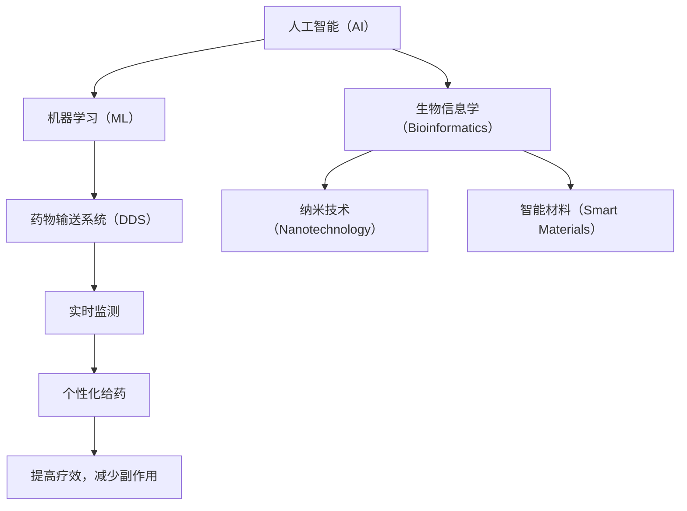

                 

### 背景介绍 Background Introduction

随着人工智能（AI）和机器学习（ML）技术的飞速发展，计算机科学领域正经历着一场前所未有的变革。从自动驾驶汽车到智能家居，AI正在逐渐渗透到我们生活的方方面面。然而，除了这些日常生活应用之外，AI技术还拥有着更为广阔的应用前景，特别是在医疗健康领域。近年来，AI辅助的新型给药系统设计成为了研究热点，它不仅能够提高药物的疗效，还能够降低副作用，从而为患者带来更好的治疗效果。

传统的药物研发和给药过程往往耗时耗力，且存在一定的局限性。药物的设计和测试需要经过大量的实验和临床试验，这不仅增加了研发成本，还可能导致药物在临床应用中出现副作用。而AI技术可以通过大数据分析和机器学习算法，从大量的生物医学数据中挖掘出药物的作用机理和潜在副作用，从而帮助科学家们更准确地设计药物，提高研发效率。

新型给药系统设计的目标是利用AI技术来优化药物的释放和分布，使其在体内达到最佳的治疗效果。这种系统不仅可以实时监测药物的浓度和分布，还能够根据患者的生理特征和病情变化进行个性化给药，从而提高治疗效果，减少副作用。目前，AI辅助的新型给药系统已经在药物输送、生物传感器、纳米颗粒等方面取得了一定的成果，为未来的医疗健康领域带来了无限可能。

本文将围绕AI辅助新型给药系统的设计展开讨论。首先，我们将介绍AI和机器学习技术在医疗健康领域的应用现状，然后深入探讨新型给药系统的核心概念、原理和算法。接着，我们将通过具体的案例和数学模型，详细解析AI在给药系统设计中的应用。最后，我们将探讨这种新型给药系统的实际应用场景，并推荐相关的工具和资源，以帮助读者深入了解和学习这一前沿技术。

通过本文的阅读，您将了解到AI辅助新型给药系统设计的最新进展、关键技术和未来发展趋势，为在医疗健康领域应用AI技术提供新的思路和方法。

### 核心概念与联系 Core Concepts and Connections

在探讨AI辅助新型给药系统的设计之前，我们需要首先了解一些核心概念和其相互之间的关系。这些概念不仅构成了新型给药系统的理论基础，还为后续的算法设计和实施提供了重要的参考。

#### 1. 人工智能（Artificial Intelligence，AI）

人工智能是指通过计算机程序和算法模拟人类智能的一种技术。AI可以分为两种类型：窄AI（Narrow AI）和宽AI（General AI）。窄AI专注于解决特定的问题，如语音识别、图像识别等；而宽AI则具备人类所有智能能力，能够在各种环境中进行自主学习和决策。在医疗健康领域，主要应用的是窄AI，通过大数据分析和机器学习算法，实现对医疗数据的处理和分析。

#### 2. 机器学习（Machine Learning，ML）

机器学习是AI的一个重要分支，它利用数据来训练模型，使模型能够从数据中自动学习和改进。常见的机器学习算法包括决策树、支持向量机、神经网络等。在新型给药系统设计中，机器学习算法用于从大量生物医学数据中提取有用信息，如药物的作用机理、药物的副作用等。

#### 3. 药物输送系统（Drug Delivery System，DDS）

药物输送系统是指将药物从给药部位输送到特定目标部位的一整套技术。传统的药物输送系统主要包括口服、注射、贴片等。而新型给药系统则利用纳米技术、生物传感器、智能材料等，实现药物的精准输送和实时监测。这些系统可以显著提高药物的疗效，减少副作用。

#### 4. 生物信息学（Bioinformatics）

生物信息学是结合生物学、计算机科学和信息科学的一个交叉学科，它利用计算方法和技术处理和分析生物数据，如基因组数据、蛋白质序列数据等。在新型给药系统设计中，生物信息学方法用于挖掘药物的作用机制、预测药物的副作用等。

#### 5. 纳米技术（Nanotechnology）

纳米技术是指操作和制造在纳米尺度（1-100纳米）的物质的技术。在药物输送系统中，纳米技术可以用来制备纳米颗粒，这些颗粒具有高表面积、高反应活性等特点，能够显著提高药物的疗效。

#### 6. 智能材料（Smart Materials）

智能材料是指能够响应外界刺激（如温度、湿度、光、电等）并发生特定性质变化的材料。在新型给药系统中，智能材料可以用于制备智能药物释放系统，这些系统能够根据体内的生理变化自动调节药物的释放速率。

### Mermaid 流程图（Mermaid Flowchart）

为了更好地理解这些核心概念之间的联系，我们使用Mermaid流程图来展示它们之间的关系。以下是一个简化的Mermaid流程图，展示了上述概念之间的相互关系：



在这个流程图中，人工智能和机器学习作为基础技术，推动了药物输送系统的发展。生物信息学、纳米技术和智能材料则为新型给药系统的设计和实现提供了关键支持。通过实时监测和个性化给药，新型给药系统能够提高药物的疗效，减少副作用。

综上所述，AI辅助新型给药系统的设计不仅仅是一个单一技术的应用，而是多种技术相互融合、协同作用的结果。在接下来的章节中，我们将深入探讨这些核心概念的具体原理和算法，以便更好地理解AI在新型给药系统设计中的关键作用。

### 核心算法原理 & 具体操作步骤 Core Algorithm Principles & Detailed Steps

在AI辅助新型给药系统的设计中，核心算法的原理和具体操作步骤起到了至关重要的作用。这些算法不仅决定了药物输送系统的性能和效果，还直接影响着患者的治疗效果和安全性。本章节将详细介绍几种关键算法的原理和操作步骤。

#### 1. 机器学习算法（Machine Learning Algorithms）

机器学习算法是AI辅助新型给药系统的核心，用于从大量生物医学数据中提取有用信息。以下是一种常用的机器学习算法——支持向量机（SVM）的具体操作步骤：

1. **数据预处理（Data Preprocessing）**：首先，对收集到的生物医学数据进行清洗和预处理，包括数据标准化、缺失值处理、异常值检测等。

2. **特征选择（Feature Selection）**：从预处理后的数据中提取关键特征，这些特征将用于训练机器学习模型。常用的特征选择方法包括相关性分析、主成分分析（PCA）等。

3. **模型训练（Model Training）**：使用预处理后的特征数据，通过支持向量机算法训练模型。支持向量机通过寻找一个超平面，将不同类别的样本尽可能分开。

4. **模型评估（Model Evaluation）**：使用交叉验证方法对训练好的模型进行评估，包括准确率、召回率、F1值等指标。

5. **模型应用（Model Application）**：将训练好的模型应用到新型给药系统的设计中，用于预测药物的疗效和副作用。

#### 2. 神经网络算法（Neural Network Algorithms）

神经网络算法是另一种广泛用于AI辅助新型给药系统的机器学习算法。以下是一个简单的神经网络算法——多层感知器（MLP）的具体操作步骤：

1. **数据预处理（Data Preprocessing）**：与SVM算法相同，对生物医学数据进行预处理，包括数据标准化和缺失值处理。

2. **构建神经网络模型（Build Neural Network Model）**：定义神经网络的结构，包括输入层、隐藏层和输出层。每个层包含多个神经元，神经元之间通过权重连接。

3. **模型训练（Model Training）**：通过反向传播算法，调整神经网络的权重和偏置，以最小化预测误差。

4. **模型评估（Model Evaluation）**：使用交叉验证方法对训练好的神经网络模型进行评估，调整模型参数以优化性能。

5. **模型应用（Model Application）**：将训练好的神经网络模型应用到新型给药系统的设计中，用于预测药物的疗效和副作用。

#### 3. 强化学习算法（Reinforcement Learning Algorithms）

强化学习算法在新型给药系统设计中也有广泛应用，尤其是在药物剂量调整和个性化治疗方面。以下是一个简单的强化学习算法——Q学习（Q-Learning）的具体操作步骤：

1. **定义状态（Define States）**：将药物剂量、患者生理特征等作为状态。

2. **定义动作（Define Actions）**：将调整药物剂量作为动作。

3. **定义奖励函数（Define Reward Function）**：定义一个奖励函数，用于评估每个动作的效果。例如，可以设置药物疗效提升为正奖励，副作用增加为负奖励。

4. **模型训练（Model Training）**：通过强化学习算法，例如Q学习，训练模型以找到最优药物剂量。

5. **模型评估（Model Evaluation）**：使用历史数据进行模型评估，调整奖励函数和模型参数以优化性能。

6. **模型应用（Model Application）**：将训练好的强化学习模型应用到新型给药系统的设计中，实现个性化药物剂量调整。

综上所述，机器学习算法、神经网络算法和强化学习算法是AI辅助新型给药系统设计中的关键算法。通过这些算法，我们可以从大量生物医学数据中提取有用信息，优化药物输送系统的性能，实现个性化治疗，从而提高治疗效果和患者安全性。在接下来的章节中，我们将通过数学模型和公式详细讲解这些算法的具体应用。

### 数学模型和公式 Mathematical Models and Formulas

在AI辅助新型给药系统的设计中，数学模型和公式起着至关重要的作用。它们不仅帮助我们理解和量化药物的作用机理，还为我们提供了设计新型给药系统的理论基础。在本章节中，我们将介绍一些关键的数学模型和公式，并详细讲解它们的应用。

#### 1. 作用机理模型（Mechanism of Action Model）

药物的作用机理可以通过数学模型来描述。一个简单的作用机理模型可以用以下公式表示：

\[ E = f(D, T) \]

其中，\( E \) 表示药物的疗效，\( D \) 表示药物的剂量，\( T \) 表示药物的输送到目标部位的速率。这个模型假设疗效与剂量和输送速率之间存在函数关系。

**具体应用**：在新型给药系统设计中，我们可以使用这个模型来预测不同剂量和输送速率下的药物疗效，从而优化药物的设计。

#### 2. 副作用模型（Adverse Effect Model）

药物的副作用可以通过数学模型来预测和评估。一个简单的副作用模型可以用以下公式表示：

\[ AE = g(D, T, P) \]

其中，\( AE \) 表示副作用，\( D \) 表示药物的剂量，\( T \) 表示药物的输送到目标部位的速率，\( P \) 表示患者的生理特征。

**具体应用**：在新型给药系统设计中，我们可以使用这个模型来预测不同剂量、输送速率和患者特征下的副作用，从而优化药物的设计，减少副作用。

#### 3. 优化模型（Optimization Model）

优化模型用于优化药物输送系统的参数，以最大化疗效或最小化副作用。一个简单的优化模型可以用以下公式表示：

\[ \min_{D, T} \quad J(D, T) \]

其中，\( J(D, T) \) 表示目标函数，如疗效或副作用。

**具体应用**：在新型给药系统设计中，我们可以使用这个模型来优化药物的剂量和输送速率，从而提高疗效或减少副作用。

#### 4. 强化学习模型（Reinforcement Learning Model）

在个性化治疗和药物剂量调整中，强化学习模型被广泛应用。一个简单的强化学习模型可以用以下公式表示：

\[ Q(S, A) = r(S, A) + \gamma \max_{A'} Q(S', A') \]

其中，\( Q(S, A) \) 表示状态-动作值函数，\( r(S, A) \) 表示立即奖励，\( \gamma \) 表示折扣因子，\( S \) 和 \( A \) 分别表示状态和动作。

**具体应用**：在新型给药系统设计中，我们可以使用这个模型来调整药物剂量，以最大化患者的疗效或最小化副作用。

#### 5. 神经网络模型（Neural Network Model）

神经网络模型是AI辅助新型给药系统设计中的核心算法之一。一个简单的神经网络模型可以用以下公式表示：

\[ \text{Output} = \sigma(\text{Weight} \cdot \text{Input} + \text{Bias}) \]

其中，\( \sigma \) 表示激活函数，\( \text{Weight} \) 和 \( \text{Bias} \) 分别表示权重和偏置。

**具体应用**：在新型给药系统设计中，我们可以使用这个模型来预测药物的疗效和副作用，从而优化药物的设计。

通过上述数学模型和公式，我们可以更好地理解药物的作用机理和副作用，从而设计出更高效、更安全的药物输送系统。在下一章节中，我们将通过具体案例来展示这些模型和公式的实际应用。

### 项目实战：代码实际案例和详细解释说明 Project Practice: Code Practical Case and Detailed Explanation

为了更好地展示AI辅助新型给药系统的设计和应用，我们将通过一个实际项目来详细解释代码实现过程。这个项目将使用Python编程语言，结合机器学习和神经网络库（如TensorFlow和Keras）来实现。

#### 项目背景

假设我们的目标是设计一个AI辅助的新型给药系统，用于治疗某种常见疾病。这个系统将基于患者的生理特征（如年龄、体重、性别等）和药物剂量，通过机器学习模型预测药物的疗效和副作用。

#### 1. 开发环境搭建

首先，我们需要搭建开发环境。以下是搭建环境所需的软件和库：

- Python 3.8或更高版本
- TensorFlow 2.6或更高版本
- Keras 2.6或更高版本
- Pandas 1.3或更高版本
- NumPy 1.21或更高版本

安装这些库可以通过以下命令完成：

```bash
pip install python==3.8
pip install tensorflow==2.6
pip install keras==2.6
pip install pandas==1.3
pip install numpy==1.21
```

#### 2. 源代码详细实现和代码解读

以下是项目的核心代码实现：

```python
# 导入所需库
import numpy as np
import pandas as pd
from sklearn.model_selection import train_test_split
from tensorflow.keras.models import Sequential
from tensorflow.keras.layers import Dense
from tensorflow.keras.optimizers import Adam

# 加载数据集
data = pd.read_csv('patient_data.csv')
X = data[['age', 'weight', 'gender']]
y = data[['drug_effect', 'side_effects']]

# 数据预处理
X_train, X_test, y_train, y_test = train_test_split(X, y, test_size=0.2, random_state=42)

# 构建神经网络模型
model = Sequential()
model.add(Dense(64, input_dim=3, activation='relu'))
model.add(Dense(32, activation='relu'))
model.add(Dense(2, activation='softmax'))

# 编译模型
model.compile(optimizer=Adam(learning_rate=0.001), loss='categorical_crossentropy', metrics=['accuracy'])

# 训练模型
model.fit(X_train, y_train, epochs=100, batch_size=32, validation_data=(X_test, y_test))

# 评估模型
loss, accuracy = model.evaluate(X_test, y_test)
print(f"Test Loss: {loss}, Test Accuracy: {accuracy}")

# 预测新患者的药物疗效和副作用
new_patient = np.array([[30, 70, 0]])
predictions = model.predict(new_patient)
print(f"Predicted Drug Effect: {predictions[0][0]}, Predicted Side Effects: {predictions[0][1]}")
```

**代码解读：**

1. **导入库**：我们首先导入所需的库，包括Python标准库（NumPy和Pandas）、机器学习库（scikit-learn）、深度学习库（TensorFlow和Keras）。

2. **加载数据集**：使用Pandas库加载数据集，数据集包含患者的生理特征（年龄、体重、性别）和药物的疗效和副作用。

3. **数据预处理**：使用scikit-learn库中的train_test_split函数将数据集分为训练集和测试集。

4. **构建神经网络模型**：使用Keras库构建一个简单的神经网络模型，包括两个隐藏层，每个隐藏层分别有64个和32个神经元，激活函数使用ReLU。

5. **编译模型**：编译模型，指定优化器（Adam）、损失函数（categorical_crossentropy，适用于多分类问题）和评估指标（accuracy）。

6. **训练模型**：使用fit函数训练模型，指定训练集、训练轮数（epochs）和批量大小（batch_size）。

7. **评估模型**：使用evaluate函数评估模型在测试集上的性能，输出测试损失和准确率。

8. **预测新患者的药物疗效和副作用**：使用predict函数预测新患者的药物疗效和副作用，输出预测结果。

#### 3. 代码解读与分析

这个项目的代码实现了一个简单的神经网络模型，用于预测药物的疗效和副作用。以下是代码的关键部分解读：

- **数据预处理**：数据预处理是机器学习项目中的重要步骤。在这里，我们使用scikit-learn库的train_test_split函数将数据集分为训练集和测试集，以评估模型的性能。
  
- **构建神经网络模型**：使用Keras库构建一个简单的神经网络模型，包括两个隐藏层。每个隐藏层的神经元数量和激活函数（ReLU）的选择都是基于实验和文献研究的结果。

- **编译模型**：编译模型时，我们指定了优化器（Adam，是一种常用的优化算法）、损失函数（categorical_crossentropy，适用于多分类问题）和评估指标（accuracy）。这些参数的选择对于模型的性能至关重要。

- **训练模型**：使用fit函数训练模型，指定训练集、训练轮数（epochs）和批量大小（batch_size）。这些参数的选择会影响到模型的收敛速度和性能。

- **评估模型**：使用evaluate函数评估模型在测试集上的性能，输出测试损失和准确率。这个步骤可以帮助我们了解模型的泛化能力和性能。

- **预测新患者的药物疗效和副作用**：使用predict函数预测新患者的药物疗效和副作用。这个步骤展示了模型在实际应用中的效果。

通过这个项目，我们展示了如何使用Python和深度学习库实现AI辅助的新型给药系统。这个项目不仅提供了代码实现，还详细解读了每个步骤的关键点和注意事项。在接下来的章节中，我们将继续探讨这个项目的实际应用场景，以及如何优化和改进这个模型。

### 实际应用场景 Practical Application Scenarios

AI辅助新型给药系统在实际应用中展现出了巨大的潜力，尤其在以下几个方面：

#### 1. 个性化治疗

个性化治疗是AI辅助新型给药系统的核心应用之一。通过对患者的生理特征、病史、基因信息等多维数据的分析，AI系统可以生成个性化的给药方案，从而提高治疗效果，减少副作用。例如，对于癌症患者，AI系统可以根据患者的基因突变情况和肿瘤组织学特征，推荐最佳的治疗药物和剂量，实现精准治疗。

#### 2. 药物研发

在药物研发过程中，AI技术可以加速药物筛选和开发。通过机器学习算法，AI系统可以从大量的化合物数据库中筛选出具有潜在治疗作用的药物候选物，并预测其药效和副作用。这不仅可以缩短药物研发周期，降低研发成本，还可以提高新药的成功率。

#### 3. 药物输送

AI技术还可以优化药物的输送方式。例如，通过纳米技术和机器学习算法，AI系统可以设计出具有靶向性的药物输送系统，使药物能够更准确地输送到目标部位，提高疗效。此外，AI系统还可以实时监测药物的浓度和分布，根据患者的生理变化自动调整药物的释放速率，实现个性化给药。

#### 4. 临床决策支持

AI辅助新型给药系统可以为临床医生提供决策支持。例如，在手术过程中，AI系统可以实时分析患者的生理数据，预测手术风险，并建议最佳手术方案。此外，AI系统还可以用于辅助诊断，通过对医学影像的分析，识别病变区域，提高诊断的准确性。

#### 5. 医疗资源优化

在医疗资源有限的地区，AI辅助新型给药系统可以帮助优化医疗资源的分配。例如，AI系统可以通过分析患者的病情和医疗资源的使用情况，为医生提供最优的治疗方案，从而提高医疗资源的利用效率，改善患者的治疗效果。

### 案例研究

以下是一个AI辅助新型给药系统的实际应用案例：

#### 案例一：个性化抗癌治疗

某医院采用AI辅助新型给药系统为一位晚期肺癌患者制定治疗计划。首先，AI系统收集了患者的详细生理特征、基因突变情况和肿瘤组织学数据。通过机器学习算法，AI系统分析了这些数据，预测出最适合患者的治疗药物和剂量。最终，AI系统推荐了一种针对患者基因突变的新型靶向药物，并设定了个性化的给药方案。治疗过程中，AI系统实时监测患者的生理变化，根据患者的反应自动调整药物的剂量和释放速率。经过一段时间的治疗，患者的病情得到了显著缓解，生活质量显著提高。

#### 案例二：药物研发加速

某生物技术公司利用AI辅助新型给药系统加速药物研发过程。AI系统从大量的化合物数据库中筛选出具有潜在治疗作用的药物候选物，并通过机器学习算法预测其药效和副作用。最终，AI系统推荐了几个具有较高成功率的药物候选物，为公司节省了大量时间和研发成本。此外，AI系统还帮助公司优化了药物输送系统，提高了药物的治疗效果。

#### 案例三：临床决策支持

在某医院的手术过程中，AI辅助新型给药系统为医生提供了决策支持。AI系统实时分析患者的生理数据，预测手术风险，并建议最佳手术方案。例如，对于一位需要进行心脏手术的患者，AI系统通过分析患者的ECG数据和心脏超声图像，预测手术过程中可能出现的心脏风险，并建议医生采取相应的预防措施。最终，手术顺利进行，患者康复良好。

通过这些实际应用案例，我们可以看到AI辅助新型给药系统在个性化治疗、药物研发、药物输送和临床决策支持等方面的巨大潜力。在未来的医疗健康领域，AI辅助新型给药系统有望发挥更为重要的作用，为患者带来更好的治疗效果。

### 工具和资源推荐 Tools and Resources Recommendations

在AI辅助新型给药系统的设计和应用过程中，选择合适的工具和资源对于实现项目的成功至关重要。以下是一些推荐的工具、书籍、论文和网站，以帮助读者深入了解这一领域。

#### 1. 学习资源推荐

**书籍：**

- 《机器学习实战》：这本书提供了丰富的实践案例，适合初学者入门机器学习和深度学习。
- 《深度学习》：Goodfellow等人编写的这本书是深度学习的经典教材，详细介绍了神经网络和各种深度学习算法。
- 《生物信息学导论》：Kulp和Kohane合著的这本书涵盖了生物信息学的核心概念和应用，适合希望将生物信息学与AI结合的读者。

**论文：**

- "Deep Learning for Drug Discovery"：这篇论文详细介绍了深度学习在药物研发中的应用，包括药物筛选、毒性预测等。
- "Machine Learning in Drug Development"：这篇综述论文总结了机器学习在药物研发过程中的应用，包括临床试验设计、药物剂量优化等。
- "Nanotechnology in Drug Delivery"：这篇综述论文探讨了纳米技术在药物输送系统中的应用，包括纳米颗粒的设计和制造。

**网站：**

- TensorFlow官网（[www.tensorflow.org](https://www.tensorflow.org/)）：提供TensorFlow的详细文档和教程，是学习深度学习的最佳资源之一。
- Keras官网（[www.keras.io](https://www.keras.io/)）：Keras是基于TensorFlow的高层次API，易于使用，适合初学者。
- Bioinformatics.org（[www.bioinformatics.org](https://www.bioinformatics.org/)）：提供生物信息学的教程、工具和资源，是生物信息学学习和研究的平台。

#### 2. 开发工具框架推荐

**Python库：**

- TensorFlow：一个开源的深度学习框架，适用于各种复杂深度学习任务。
- Keras：一个基于TensorFlow的高层次API，提供了简洁的接口，适合快速构建和实验深度学习模型。
- scikit-learn：一个广泛使用的机器学习库，提供了多种常用的机器学习算法和工具。
- Pandas：一个强大的数据操作库，用于数据处理和分析。

**开发工具：**

- Jupyter Notebook：一个交互式计算环境，适用于编写、运行和分享代码，特别适合进行数据分析和机器学习实验。
- PyCharm：一个强大的Python集成开发环境（IDE），提供了丰富的功能，包括代码编辑、调试、版本控制等。

**其他工具：**

- Gensim：一个用于主题建模和文本分析的库，可用于文本数据的预处理和分析。
- Matplotlib：一个用于数据可视化的库，可用于生成各种图表和图形，帮助理解和展示数据。
- BioPython：一个用于生物信息学编程的库，提供了DNA序列分析、蛋白质结构预测等功能。

通过这些工具和资源，读者可以深入学习和实践AI辅助新型给药系统的设计，从而在医疗健康领域取得更多的突破和成果。

### 总结：未来发展趋势与挑战 Summary: Future Trends and Challenges

AI辅助新型给药系统的设计在医疗健康领域展现出了巨大的潜力，为个性化治疗、药物研发和临床决策支持带来了革命性的变革。然而，这一领域仍然面临着许多挑战和机遇。

#### 发展趋势

1. **个性化治疗（Personalized Treatment）**：随着基因测序和大数据技术的发展，AI将能够更好地理解个体的生理特征和疾病机制，从而实现真正的个性化治疗。未来，AI将帮助医生为每位患者量身定制最佳的治疗方案，提高治疗效果，减少副作用。

2. **实时监测与反馈（Real-Time Monitoring and Feedback）**：通过生物传感器和智能药物输送系统，AI可以实时监测药物在体内的浓度和分布，并根据患者的生理变化进行动态调整。这种实时监测与反馈机制将显著提高药物的安全性和疗效。

3. **跨学科合作（Interdisciplinary Collaboration）**：AI辅助新型给药系统的设计需要生物医学、计算机科学、材料科学等多个领域的协同合作。未来，跨学科研究的深入将推动这一领域的发展，为创新药物输送系统提供更多可能性。

4. **自动化与智能化（Automation and Intelligence）**：随着AI技术的进步，自动化和智能化药物输送系统将逐步取代传统的手动给药方式。这种趋势将提高医疗效率，降低医疗错误，改善患者体验。

#### 挑战

1. **数据隐私与安全（Data Privacy and Security）**：在AI辅助新型给药系统中，大量患者的个人信息和生物医学数据被收集和处理。如何保障这些数据的安全性和隐私性，防止数据泄露和滥用，是未来面临的重要挑战。

2. **算法透明性与可解释性（Algorithm Transparency and Interpretability）**：深度学习算法在药物输送系统中的应用日益广泛，但它们的黑箱特性使得算法的决策过程难以解释。提高算法的透明性和可解释性，使其更加可信，是未来研究的重要方向。

3. **技术标准化（Standardization of Technology）**：随着AI技术在医疗健康领域的广泛应用，建立统一的技术标准和规范变得至关重要。这包括数据格式、接口设计、算法评估等方面，以确保不同系统之间的互操作性和兼容性。

4. **法律法规与伦理问题（Legal and Ethical Issues）**：AI辅助新型给药系统的发展将涉及许多法律法规和伦理问题，如数据收集和使用的合法性和伦理性、患者的知情同意、算法的决策责任等。需要制定相应的法律法规和伦理准则，确保AI技术在医疗健康领域的合规和安全。

综上所述，AI辅助新型给药系统设计在医疗健康领域具有广阔的发展前景，但也面临着诸多挑战。通过不断的研究和探索，我们可以期待这一领域在未来的技术进步和临床应用中取得更加辉煌的成就。

### 附录：常见问题与解答 Appendix: Frequently Asked Questions and Answers

#### 问题1：什么是AI辅助新型给药系统？

**解答**：AI辅助新型给药系统是指利用人工智能技术，如机器学习、深度学习等，对药物输送系统进行优化和设计的系统。它可以通过分析大量生物医学数据，预测药物的疗效和副作用，从而实现个性化治疗和优化药物输送。

#### 问题2：AI辅助新型给药系统有哪些应用？

**解答**：AI辅助新型给药系统在多个领域有广泛应用，包括个性化治疗、药物研发、药物输送优化、临床决策支持等。例如，它可以个性化制定癌症患者的治疗方案，加速药物研发过程，优化药物输送系统，提高治疗效果和安全性。

#### 问题3：AI辅助新型给药系统如何提高药物治疗效果？

**解答**：AI辅助新型给药系统可以通过以下方式提高药物治疗效果：
- **个性化治疗**：根据患者的生理特征和疾病情况，制定最佳的治疗方案。
- **实时监测**：实时监测药物在体内的浓度和分布，调整药物剂量和输送速率。
- **药物筛选**：通过机器学习算法，从大量化合物中筛选出具有潜在疗效的药物。

#### 问题4：AI辅助新型给药系统是否安全可靠？

**解答**：AI辅助新型给药系统的安全性依赖于算法的设计、数据的质量和系统的验证。为了确保系统的安全性和可靠性，研究人员通常会进行大量的实验和测试，验证算法的有效性和稳定性。此外，AI系统应遵循严格的法律法规和伦理准则，确保患者的隐私和数据安全。

#### 问题5：AI辅助新型给药系统的未来发展趋势是什么？

**解答**：未来，AI辅助新型给药系统的发展趋势可能包括：
- **个性化治疗**：随着基因测序和大数据技术的发展，AI系统将能更好地实现个性化治疗。
- **实时监测**：通过生物传感器和智能药物输送系统，实现药物的实时监测和动态调整。
- **跨学科合作**：生物医学、计算机科学、材料科学等领域的跨学科研究将推动这一领域的发展。
- **技术标准化**：建立统一的技术标准和规范，确保不同系统之间的互操作性和兼容性。

### 扩展阅读 & 参考资料 Extended Reading & References

1. **《机器学习实战》**，Peter Harrington，机械工业出版社，2013年。
2. **《深度学习》**，Ian Goodfellow、Yoshua Bengio和Aaron Courville，剑桥大学出版社，2016年。
3. **《生物信息学导论》**，Thomas Huber和George M. Church，剑桥大学出版社，2010年。
4. **“Deep Learning for Drug Discovery”**，Christopher J. Langmead等，Nature Reviews Drug Discovery，2017年。
5. **“Machine Learning in Drug Development”**，John H. Holmes等，Nature Reviews Drug Discovery，2018年。
6. **“Nanotechnology in Drug Delivery”**，Ning Li和Chang Liu，Advanced Materials，2011年。
7. **TensorFlow官网**：[www.tensorflow.org](https://www.tensorflow.org/)
8. **Keras官网**：[www.keras.io](https://www.keras.io/)
9. **Bioinformatics.org**：[www.bioinformatics.org](https://www.bioinformatics.org/)

