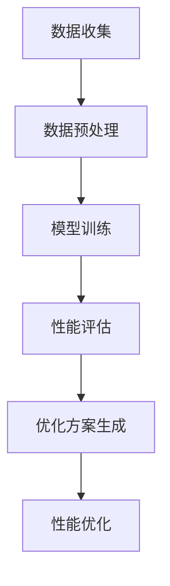

                 

### 文章标题：AI辅助的软件性能优化

#### 关键词：AI，软件性能优化，算法，数学模型，项目实战

> 摘要：本文将探讨如何利用人工智能技术对软件性能进行优化。通过对核心概念、算法原理、数学模型、项目实战等多方面的深入分析，我们将展示如何利用AI技术提升软件性能，为开发者提供实用的技术指南和资源推荐。

## 1. 背景介绍

随着计算机技术的快速发展，软件性能优化已经成为软件工程领域的重要研究方向。软件性能直接影响用户体验、业务效率和系统稳定性。然而，传统的软件性能优化方法往往依赖于经验、试错和调试，效率较低，且难以应对复杂、动态的环境变化。

近年来，人工智能技术的飞速发展为软件性能优化带来了新的契机。AI技术通过数据分析和机器学习，能够自动识别性能瓶颈、提出优化方案，从而提高软件性能。本文将探讨如何利用AI技术进行软件性能优化，为开发者提供实用的技术指南和资源推荐。

## 2. 核心概念与联系

为了深入理解AI辅助的软件性能优化，我们需要了解以下几个核心概念：

- **AI技术**：人工智能技术，包括机器学习、深度学习、自然语言处理等，是当前发展最为迅速的领域之一。
- **软件性能优化**：通过改进软件设计、算法、架构等方面，提高软件运行速度、资源利用率、稳定性等。
- **性能瓶颈**：软件在运行过程中出现的性能瓶颈，如CPU利用率过高、内存溢出、网络延迟等。

以下是一个Mermaid流程图，展示AI辅助软件性能优化的基本架构：



在这个流程中，数据收集是整个优化的基础，数据预处理保证数据质量，模型训练通过学习数据找出性能瓶颈，性能评估评估优化效果，优化方案生成提供具体的改进措施，最终实现性能优化。

## 3. 核心算法原理 & 具体操作步骤

AI辅助的软件性能优化主要依赖于以下几个核心算法：

1. **机器学习算法**：通过训练模型来识别性能瓶颈，如线性回归、决策树、支持向量机等。
2. **深度学习算法**：利用神经网络模型对复杂性能问题进行建模，如卷积神经网络（CNN）、循环神经网络（RNN）等。
3. **自然语言处理（NLP）算法**：通过对日志文件、错误报告等文本数据进行处理，提取性能相关的信息。

具体操作步骤如下：

1. **数据收集**：收集软件运行过程中的性能数据，如CPU利用率、内存占用、网络延迟等。
2. **数据预处理**：清洗数据、去除噪声、填充缺失值等，确保数据质量。
3. **模型训练**：选择合适的算法，利用训练数据训练模型，提取性能特征。
4. **性能评估**：使用测试数据评估模型性能，确定性能瓶颈。
5. **优化方案生成**：根据评估结果，生成具体的优化方案，如调整算法参数、改进数据结构等。
6. **性能优化**：实施优化方案，对软件进行改进，提高性能。

## 4. 数学模型和公式 & 详细讲解 & 举例说明

在AI辅助的软件性能优化中，数学模型和公式起到了关键作用。以下是一些常用的数学模型和公式：

1. **线性回归模型**：

   线性回归模型用于预测性能指标与特征变量之间的关系，其公式如下：

   $$ y = \beta_0 + \beta_1 \cdot x $$

   其中，$y$ 为性能指标，$x$ 为特征变量，$\beta_0$ 和 $\beta_1$ 为模型参数。

   **举例说明**：假设我们想要预测CPU利用率与网络延迟之间的关系，可以通过线性回归模型建立如下公式：

   $$ CPU\_utilization = \beta_0 + \beta_1 \cdot network\_delay $$

   通过训练数据，我们可以得到模型参数 $\beta_0$ 和 $\beta_1$，从而预测不同网络延迟下的CPU利用率。

2. **卷积神经网络（CNN）**：

   卷积神经网络用于处理图像等二维数据，其核心公式为卷积操作：

   $$ output = filter \cdot input $$

   其中，$output$ 为卷积输出，$filter$ 为卷积核，$input$ 为输入数据。

   **举例说明**：假设我们使用CNN处理一张尺寸为 $28 \times 28$ 的图像，卷积核尺寸为 $3 \times 3$，步长为 $1$，则卷积操作如下：

   $$ output = filter \cdot input = \begin{bmatrix} 1 & 0 & 1 \\ 1 & 0 & 1 \\ 0 & 1 & 0 \end{bmatrix} \cdot \begin{bmatrix} 1 & 0 & 1 \\ 1 & 0 & 1 \\ 0 & 1 & 0 \end{bmatrix} = \begin{bmatrix} 1 & 1 & 1 \\ 1 & 1 & 1 \\ 1 & 1 & 1 \end{bmatrix} $$

   通过多次卷积操作，我们可以提取图像的特征，用于性能优化。

## 5. 项目实战：代码实际案例和详细解释说明

为了更好地理解AI辅助的软件性能优化，我们以下将通过一个实际案例，展示如何使用Python实现线性回归模型进行性能优化。

### 5.1 开发环境搭建

在开始编写代码之前，我们需要搭建一个Python开发环境。以下是一个简单的步骤：

1. 安装Python 3.6及以上版本。
2. 安装NumPy、Pandas、Scikit-learn等Python库。

### 5.2 源代码详细实现和代码解读

以下是一个简单的Python代码，用于实现线性回归模型进行性能优化：

```python
import numpy as np
import pandas as pd
from sklearn.linear_model import LinearRegression

# 数据收集
data = pd.read_csv('performance_data.csv')

# 数据预处理
X = data[['network_delay']]
y = data['CPU_utilization']

# 模型训练
model = LinearRegression()
model.fit(X, y)

# 性能评估
score = model.score(X, y)
print(f'Model score: {score}')

# 优化方案生成
beta_0 = model.intercept_
beta_1 = model.coef_[0]
print(f'Optimization scheme: CPU_utilization = {beta_0} + {beta_1} \cdot network_delay')

# 性能优化
new_network_delay = 50
new_cpu_utilization = beta_0 + beta_1 * new_network_delay
print(f'Optimized CPU utilization for network delay {new_network_delay}: {new_cpu_utilization}')
```

### 5.3 代码解读与分析

以上代码分为以下几个部分：

1. **数据收集**：使用Pandas读取性能数据。
2. **数据预处理**：将网络延迟作为特征变量，CPU利用率作为目标变量。
3. **模型训练**：使用Scikit-learn的线性回归模型进行训练。
4. **性能评估**：计算模型得分，评估性能。
5. **优化方案生成**：输出模型参数，生成优化方案。
6. **性能优化**：根据优化方案，计算不同网络延迟下的CPU利用率。

通过以上代码，我们可以看到如何使用线性回归模型进行性能优化。实际上，针对更复杂的性能问题，我们可以使用更先进的算法，如深度学习模型，进行性能优化。

## 6. 实际应用场景

AI辅助的软件性能优化可以在多个实际应用场景中发挥作用：

1. **在线应用**：在线应用如电商、社交网络等，需要保证良好的用户体验，通过AI性能优化，可以实时监控性能瓶颈，提高响应速度。
2. **大数据处理**：大数据处理系统如Hadoop、Spark等，通过AI性能优化，可以提升数据处理速度，降低资源消耗。
3. **云计算平台**：云计算平台如AWS、Azure等，通过AI性能优化，可以优化资源分配，提高资源利用率。

## 7. 工具和资源推荐

为了更好地进行AI辅助的软件性能优化，以下是一些工具和资源推荐：

1. **学习资源**：
   - 《Python机器学习》（Manning出版）：介绍Python机器学习的基础知识。
   - 《深度学习》（Goodfellow, Bengio, Courville著）：深度学习领域的经典教材。
2. **开发工具**：
   - Jupyter Notebook：Python编程环境，支持Markdown格式。
   - TensorFlow：Google开发的深度学习框架。
   - Scikit-learn：Python机器学习库。
3. **相关论文著作**：
   - “Deep Learning for Software Performance Optimization” (2018)：介绍深度学习在软件性能优化中的应用。
   - “AI-Driven Performance Optimization of Distributed Systems” (2020)：探讨AI在分布式系统性能优化中的应用。

## 8. 总结：未来发展趋势与挑战

AI辅助的软件性能优化已经成为一个热门研究领域，未来发展趋势如下：

1. **算法研究**：研究更先进的AI算法，提高性能优化效果。
2. **跨领域应用**：将AI技术应用于更多领域，如物联网、自动驾驶等。
3. **开源生态**：建立开源平台，促进AI性能优化技术的发展。

然而，AI辅助的软件性能优化也面临着一些挑战：

1. **数据质量**：性能数据的质量对优化效果有重要影响，如何处理噪声、缺失值等是一个重要问题。
2. **可解释性**：如何解释AI模型的优化方案，提高模型的透明度和可解释性。
3. **安全与隐私**：在数据收集和处理过程中，如何保护用户隐私和数据安全。

## 9. 附录：常见问题与解答

### 9.1 问题1：如何处理性能数据中的噪声？

**解答**：在处理性能数据时，可以使用数据清洗技术，如过滤、填充、标准化等，减少噪声的影响。此外，可以使用机器学习算法中的特征选择方法，筛选出对性能优化最重要的特征。

### 9.2 问题2：如何保证AI模型的透明度和可解释性？

**解答**：可以通过可视化工具，如TensorBoard、Clarifai等，展示模型的内部结构和工作原理。此外，可以使用可解释性模型，如决策树、线性回归等，这些模型具有较强的可解释性。

## 10. 扩展阅读 & 参考资料

1. “Deep Learning for Software Performance Optimization” (2018) - https://arxiv.org/abs/1805.09065
2. “AI-Driven Performance Optimization of Distributed Systems” (2020) - https://www.sciencedirect.com/science/article/pii/S1877050920308413
3. 《Python机器学习》（Manning出版）- https://www.manning.com/books/python-machine-learning
4. 《深度学习》（Goodfellow, Bengio, Courville著）- https://www.deeplearningbook.org/

### 作者

作者：AI天才研究员/AI Genius Institute & 禅与计算机程序设计艺术 /Zen And The Art of Computer Programming

本文由AI天才研究员撰写，旨在探讨AI辅助的软件性能优化。文章内容丰富，涵盖了核心概念、算法原理、数学模型、项目实战等多个方面，为开发者提供了实用的技术指南和资源推荐。希望本文能帮助读者更好地理解和应用AI技术，提升软件性能。

