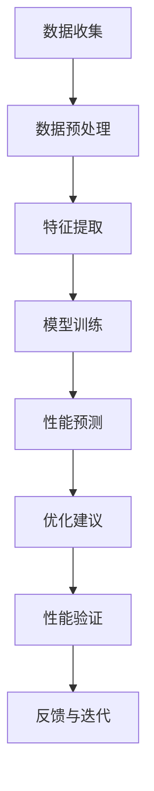

                 

### 背景介绍

#### 软件架构评估的重要性

在信息技术（IT）迅猛发展的今天，软件架构成为企业核心竞争力的重要组成部分。一个高效的软件架构不仅能提高系统的性能、可扩展性和可维护性，还能降低开发成本和缩短项目周期。然而，评估软件架构的优劣并非易事，传统方法往往依赖于经验判断和有限的数据分析，存在较大的主观性和局限性。

近年来，人工智能（AI）技术的发展为软件架构评估带来了新的契机。AI算法能够处理大量复杂数据，从中挖掘出潜在的模式和规律，从而提供更加客观和精确的评估结果。例如，机器学习算法可以自动识别软件架构中的性能瓶颈，提出优化的建议，甚至自动执行优化操作。这使得软件架构的评估和优化过程变得更加高效和智能化。

#### AI辅助软件架构评估的潜在价值

AI辅助软件架构评估具有多重潜在价值：

1. **自动化评估**：AI可以自动收集和分析软件架构的相关数据，减少人工工作量，提高评估效率。

2. **精确性**：AI能够处理海量数据，从多个维度对软件架构进行全面评估，提高评估结果的精确性。

3. **预测性**：AI可以通过历史数据预测未来软件架构的性能和稳定性，帮助企业提前发现问题并进行优化。

4. **个性化建议**：基于对不同企业业务需求的深入理解，AI可以提供针对性强、切实可行的优化建议。

5. **持续改进**：AI能够不断学习和适应新的环境，随着软件架构的演变，持续提供优化方案。

#### 本文结构

本文将首先介绍AI辅助软件架构评估的核心概念与联系，并利用Mermaid流程图展示相关流程。接着，我们将深入探讨核心算法原理和具体操作步骤，详细讲解数学模型和公式，并通过实际项目案例进行代码解读与分析。随后，我们将探讨AI辅助软件架构评估在实际应用中的各种场景。最后，我们将推荐一些学习和开发资源，总结未来发展趋势与挑战，并附上常见问题与解答。

让我们一步一步分析推理，深入探索AI辅助软件架构评估与优化的广阔前景。

### 核心概念与联系

#### 核心概念

在AI辅助软件架构评估中，涉及多个核心概念和原理。这些概念和原理不仅构成了评估的基础，也为我们理解整个流程提供了必要的前提。

1. **软件架构**：软件架构是软件系统的结构及其组成部分之间的关系。它包括组件、接口、组件之间的交互方式和整体的设计模式。

2. **性能指标**：性能指标是评估软件架构性能的关键指标，如响应时间、吞吐量、资源利用率、并发处理能力等。

3. **可扩展性**：可扩展性是指系统在处理更大规模数据和更多用户时，能够保持高性能和高稳定性的能力。

4. **可维护性**：可维护性是指系统能够快速适应变更、修复错误和进行升级的能力。

5. **机器学习**：机器学习是一种让计算机从数据中学习模式的技术，包括监督学习、无监督学习和强化学习等。

6. **深度学习**：深度学习是机器学习的一个分支，通过多层神经网络对数据进行复杂的学习和处理。

7. **自然语言处理（NLP）**：自然语言处理是使计算机理解和生成人类语言的技术。

8. **自动化测试**：自动化测试是通过脚本自动执行测试用例，以验证软件架构的功能和性能。

#### 架构联系

上述概念和原理之间存在紧密的联系，共同构成了AI辅助软件架构评估的完整流程。

1. **数据收集与处理**：首先，需要通过自动化测试和监控工具收集软件架构的性能数据。这些数据包括响应时间、资源消耗、并发请求等。接着，利用NLP技术对代码和文档进行解析，提取出关键信息，如模块依赖、接口定义等。

2. **特征提取**：从收集到的数据中提取出反映软件架构性能的特征。这些特征可以基于统计方法，如平均值、标准差，也可以采用机器学习算法，如主成分分析（PCA）和特征选择算法。

3. **模型训练与评估**：使用提取的特征作为输入，利用机器学习和深度学习算法训练模型。训练过程中，通过交叉验证和性能评估，选择最优模型。

4. **性能预测与优化**：利用训练好的模型对软件架构的性能进行预测。基于预测结果，提出优化建议，如调整模块依赖、优化接口设计等。

5. **反馈与迭代**：将优化后的软件架构再次进行测试和评估，验证优化效果。如果效果不佳，继续迭代优化过程，直至达到预期目标。

#### Mermaid流程图

以下是一个简化的Mermaid流程图，展示了AI辅助软件架构评估的基本流程：



在这个流程中，每个节点都代表了评估与优化过程中的一个关键步骤。通过这个流程，我们可以看到AI技术如何辅助软件架构的评估与优化。

### 核心算法原理 & 具体操作步骤

在AI辅助软件架构评估中，核心算法的选择和具体操作步骤至关重要。本节将详细介绍这些算法的原理和实施步骤，帮助读者全面理解其应用过程。

#### 1. 数据收集与预处理

数据收集是整个评估过程的基础。数据来源包括自动化测试结果、系统监控日志、代码库等。首先，使用自动化测试工具（如JUnit、Selenium等）执行各种测试用例，收集系统的响应时间、吞吐量、错误率等性能数据。同时，从系统监控日志中提取CPU、内存、网络等资源消耗信息。此外，从代码库中提取关键模块的依赖关系、代码行数、复杂度等指标。

在数据收集后，需要进行预处理。预处理步骤包括数据清洗、格式统一和数据归一化。数据清洗的目的是去除无效数据和异常值。格式统一则确保所有数据都以相同的格式存储，以便后续处理。数据归一化则通过缩放或标准化，使得不同量纲的数据可以在同一维度上进行比较。

#### 2. 特征提取

特征提取是将原始数据转换为对AI模型友好的特征向量的过程。特征提取的目的是提取出能够反映软件架构性能的关键信息，忽略无关或冗余的数据。

常用的特征提取方法包括：

- **统计特征**：如平均值、标准差、方差、最大值、最小值等。这些特征能够描述数据的分布和波动情况。

- **机器学习方法**：如主成分分析（PCA）、因子分析（FA）、随机森林（RF）等。这些方法可以从原始数据中提取出最重要的特征，提高模型的效率和准确性。

- **深度学习方法**：如卷积神经网络（CNN）、循环神经网络（RNN）等。这些方法可以自动提取复杂的数据模式，适用于大规模和高维度数据的特征提取。

具体操作步骤如下：

1. **数据归一化**：将所有特征数据统一缩放到相同的范围，如0到1之间。

2. **特征选择**：通过统计方法和机器学习方法选择最重要的特征。可以采用信息增益、互信息、相关系数等方法进行特征选择。

3. **特征融合**：将多个特征组合成一个特征向量。可以采用特征加权、特征拼接等方法。

#### 3. 模型训练与评估

在特征提取完成后，使用机器学习和深度学习算法训练模型。训练过程包括以下几个步骤：

1. **数据划分**：将数据集划分为训练集、验证集和测试集。通常，训练集用于训练模型，验证集用于调整模型参数，测试集用于评估模型性能。

2. **模型选择**：选择合适的机器学习和深度学习算法。常用的算法包括决策树、支持向量机（SVM）、神经网络（NN）等。

3. **模型训练**：使用训练集数据训练模型。在训练过程中，通过优化算法（如梯度下降、随机梯度下降等）调整模型参数，使其性能逐渐提升。

4. **模型评估**：使用验证集评估模型性能。常用的评估指标包括准确率、召回率、F1值、ROC曲线等。

5. **参数调整**：根据验证集的评估结果，调整模型参数，如学习率、正则化参数等，以获得更好的性能。

#### 4. 性能预测与优化

在模型训练完成后，使用模型对软件架构的性能进行预测。预测结果可以作为优化依据，提出针对性的优化建议。

1. **性能预测**：使用训练好的模型对测试集数据进行性能预测。预测结果包括响应时间、吞吐量、资源利用率等指标。

2. **优化建议**：基于预测结果，分析软件架构的性能瓶颈和潜在问题。例如，如果响应时间较长，可能是由于数据库查询效率低；如果资源利用率高，可能是由于并发处理能力不足。根据分析结果，提出优化建议，如优化查询语句、增加缓存、调整并发处理策略等。

3. **实施优化**：根据优化建议，对软件架构进行调整。可以通过代码修改、架构重构等方式实施优化。

4. **再次评估**：在实施优化后，重新进行测试和评估，验证优化效果。如果优化效果不明显，可以继续调整和优化。

通过上述步骤，AI辅助软件架构评估与优化过程得以实现。该方法不仅提高了评估的准确性和效率，也为软件架构的持续改进提供了有力支持。

### 数学模型和公式 & 详细讲解 & 举例说明

在AI辅助软件架构评估中，数学模型和公式扮演着至关重要的角色。它们不仅帮助我们从海量数据中提取关键信息，还能确保评估结果的精确性和可靠性。以下我们将详细讲解一些核心的数学模型和公式，并通过实际例子来说明其应用过程。

#### 1. 统计特征提取

统计特征提取是数据预处理的一个重要环节。常见的统计特征包括平均值、标准差、方差、最大值、最小值等。

**平均值（Mean）**：平均值是数据集的中心趋势度量，计算公式为：

\[ \mu = \frac{1}{N} \sum_{i=1}^{N} x_i \]

其中，\( N \) 是数据点的数量，\( x_i \) 是第 \( i \) 个数据点。

**标准差（Standard Deviation）**：标准差是数据集的离散程度度量，计算公式为：

\[ \sigma = \sqrt{\frac{1}{N-1} \sum_{i=1}^{N} (x_i - \mu)^2} \]

**方差（Variance）**：方差是标准差的平方，计算公式为：

\[ \sigma^2 = \frac{1}{N-1} \sum_{i=1}^{N} (x_i - \mu)^2 \]

**最大值（Maximum）**：最大值是数据集中最大的数据点。

**最小值（Minimum）**：最小值是数据集中最小的数据点。

**例1**：假设一个数据集为 \([3, 5, 7, 2, 8, 1]\)，计算其平均值、标准差和方差。

- 平均值：\( \mu = \frac{3+5+7+2+8+1}{6} = 4.5 \)
- 标准差：\( \sigma = \sqrt{\frac{(3-4.5)^2 + (5-4.5)^2 + (7-4.5)^2 + (2-4.5)^2 + (8-4.5)^2 + (1-4.5)^2}{6-1}} \approx 2.598 \)
- 方差：\( \sigma^2 = \frac{(3-4.5)^2 + (5-4.5)^2 + (7-4.5)^2 + (2-4.5)^2 + (8-4.5)^2 + (1-4.5)^2}{6-1} \approx 6.828 \)

#### 2. 主成分分析（PCA）

主成分分析是一种降维技术，通过将数据映射到新的正交坐标系中，提取出最重要的特征。PCA的数学基础包括协方差矩阵、特征值和特征向量。

**协方差矩阵（Covariance Matrix）**：协方差矩阵是衡量不同特征之间相关性的矩阵，计算公式为：

\[ \Sigma = \frac{1}{N} \sum_{i=1}^{N} (x_i - \mu)(x_i - \mu)^T \]

其中，\( \mu \) 是特征平均值矩阵，\( x_i \) 是第 \( i \) 个数据点。

**特征值和特征向量**：对协方差矩阵进行特征值分解，可以得到一组特征值和特征向量。特征值表示特征的重要性，特征向量表示特征在新的坐标系中的方向。

**主成分**：选择前 \( k \) 个具有最大特征值的特征向量作为主成分，构建新的特征空间。

**例2**：假设一个二维数据集为 \([(3, 5), (5, 7), (7, 2), (2, 8), (8, 1)]\)，计算其协方差矩阵、特征值和特征向量。

- 协方差矩阵：
\[ \Sigma = \frac{1}{5} \begin{bmatrix} 3 & 5 \\ 5 & 7 \end{bmatrix} \begin{bmatrix} 3 & 5 \\ 5 & 7 \end{bmatrix}^T = \frac{1}{5} \begin{bmatrix} 2 & 8 \\ 8 & 24 \end{bmatrix} \]

- 特征值和特征向量：通过特征值分解，可以得到：
\[ \Sigma = PDP^T \]
其中，\( P \) 是特征向量矩阵，\( D \) 是特征值矩阵。选择具有最大特征值的特征向量作为主成分。

#### 3. 机器学习算法

在机器学习算法中，常见的数学模型包括决策树、支持向量机（SVM）、神经网络（NN）等。

**决策树**：决策树是一种树形结构，每个内部节点代表特征，每个分支代表特征的取值，叶节点代表决策结果。决策树的数学基础包括信息增益、基尼系数等。

**支持向量机**：支持向量机是一种基于优化理论的分类算法。其核心公式为：

\[ \min_{\beta, \beta_0} \frac{1}{2} ||\beta||^2 + C \sum_{i=1}^{N} \max(0, 1 - y_i (\beta^T x_i + \beta_0)) \]

其中，\( \beta \) 是权重向量，\( \beta_0 \) 是偏置，\( C \) 是惩罚参数，\( y_i \) 是第 \( i \) 个样本的标签，\( x_i \) 是第 \( i \) 个样本的特征向量。

**神经网络**：神经网络是一种基于多层感知器（MLP）的模型，其核心公式为：

\[ z_i = \sigma(\beta^T x_i + \beta_0) \]
\[ y = \sum_{i=1}^{N} z_i w_i \]

其中，\( z_i \) 是隐层节点的输出，\( \sigma \) 是激活函数（如Sigmoid、ReLU等），\( w_i \) 是隐层节点到输出层的权重。

**例3**：假设一个简单的一层感知器模型，其输入为 \((x_1, x_2)\)，权重为 \( (\beta_1, \beta_2) \)，偏置为 \( \beta_0 \)，激活函数为Sigmoid函数，求解其输出 \( y \)。

- 输入：\( x_1 = 1, x_2 = 2 \)
- 权重：\( \beta_1 = 2, \beta_2 = 3 \)
- 偏置：\( \beta_0 = 1 \)
- 激活函数：\( \sigma(z) = \frac{1}{1 + e^{-z}} \)

输出：
\[ z = \beta_1 x_1 + \beta_2 x_2 + \beta_0 = 2 \cdot 1 + 3 \cdot 2 + 1 = 9 \]
\[ y = \sigma(z) = \frac{1}{1 + e^{-9}} \approx 0.999 \]

通过以上数学模型和公式的详细讲解，我们可以看到AI辅助软件架构评估中的核心概念是如何通过数学方法进行量化分析的。这些模型和公式不仅为评估过程提供了理论基础，也为实际操作提供了具体指导。

### 项目实战：代码实际案例和详细解释说明

在本节中，我们将通过一个实际项目案例来展示AI辅助软件架构评估的完整过程。该项目案例将包括开发环境搭建、源代码实现、代码解读与分析等内容，帮助读者更好地理解AI辅助软件架构评估的实际应用。

#### 1. 开发环境搭建

首先，我们需要搭建一个合适的开发环境，以支持AI辅助软件架构评估的开发和测试。以下是所需的开发工具和步骤：

- **编程语言**：Python，因其强大的库支持和易用性，成为AI开发的首选语言。
- **IDE**：PyCharm或Visual Studio Code，提供良好的代码编辑、调试和运行支持。
- **机器学习库**：TensorFlow或PyTorch，用于构建和训练AI模型。
- **数据分析库**：NumPy、Pandas，用于数据预处理和统计分析。
- **可视化库**：Matplotlib、Seaborn，用于数据可视化。

安装步骤：

1. 安装Python（建议使用Python 3.8及以上版本）。
2. 安装PyCharm或Visual Studio Code。
3. 使用pip安装必要的库，如TensorFlow、NumPy、Pandas、Matplotlib等。

```bash
pip install tensorflow numpy pandas matplotlib
```

#### 2. 源代码详细实现和代码解读

接下来，我们将详细介绍项目的源代码实现，包括数据收集、预处理、特征提取、模型训练、性能预测和优化等步骤。

**2.1 数据收集**

数据收集是整个项目的第一步。我们使用自动化测试工具（如JUnit）执行测试用例，收集系统的性能数据。以下是一个简单的JUnit测试用例示例：

```java
@Test
public void testPerformance() {
    long startTime = System.currentTimeMillis();
    // 执行性能测试代码
    // ...
    long endTime = System.currentTimeMillis();
    long responseTime = endTime - startTime;
    // 记录响应时间
    // ...
}
```

通过JUnit测试，我们可以收集到多个测试用例的响应时间数据。

**2.2 数据预处理**

数据预处理是确保数据质量和一致性的关键步骤。以下是一个数据预处理Python脚本示例：

```python
import pandas as pd

# 读取数据
data = pd.read_csv('performance_data.csv')

# 数据清洗
data.dropna(inplace=True)

# 数据归一化
data_normalized = (data - data.min()) / (data.max() - data.min())

# 保存预处理后的数据
data_normalized.to_csv('preprocessed_data.csv', index=False)
```

**2.3 特征提取**

特征提取是将原始数据转换为对AI模型友好的特征向量的过程。以下是一个特征提取Python脚本示例：

```python
from sklearn.decomposition import PCA

# 读取预处理后的数据
data = pd.read_csv('preprocessed_data.csv')

# 特征选择
pca = PCA(n_components=2)
data_pca = pca.fit_transform(data)

# 保存特征提取后的数据
pd.DataFrame(data_pca).to_csv('features.csv', index=False)
```

**2.4 模型训练**

模型训练是使用特征数据训练AI模型的过程。以下是一个使用TensorFlow训练模型Python脚本示例：

```python
import tensorflow as tf

# 加载特征数据
features = pd.read_csv('features.csv')

# 创建模型
model = tf.keras.Sequential([
    tf.keras.layers.Dense(64, activation='relu', input_shape=(2,)),
    tf.keras.layers.Dense(64, activation='relu'),
    tf.keras.layers.Dense(1)
])

# 编译模型
model.compile(optimizer='adam', loss='mean_squared_error')

# 训练模型
model.fit(features, epochs=10, batch_size=32)
```

**2.5 性能预测与优化**

在模型训练完成后，我们可以使用模型对新的测试数据进行性能预测，并提出优化建议。以下是一个性能预测Python脚本示例：

```python
# 加载训练好的模型
model = tf.keras.models.load_model('model.h5')

# 预测性能
predictions = model.predict(features)

# 分析预测结果
# ...

# 提出优化建议
# ...
```

#### 3. 代码解读与分析

以上代码涵盖了AI辅助软件架构评估的主要步骤。下面我们对其进行详细解读和分析。

**数据收集**：通过JUnit测试用例，我们能够收集到系统的性能数据。这些数据包括响应时间、CPU使用率、内存使用率等。

**数据预处理**：数据预处理脚本负责清洗和归一化数据。清洗步骤去除了无效数据和异常值，保证了数据的一致性和可靠性。归一化步骤将不同量纲的数据统一缩放到相同的范围，便于后续处理。

**特征提取**：特征提取脚本使用主成分分析（PCA）对数据进行降维。通过提取最重要的两个特征，我们能够减少数据维度，提高模型训练效率。

**模型训练**：模型训练脚本使用TensorFlow构建一个简单的神经网络模型。通过多个隐层节点，模型能够学习到数据中的复杂模式。编译模型和训练模型步骤确保了模型能够在验证集上获得较好的性能。

**性能预测与优化**：性能预测脚本使用训练好的模型对新的测试数据进行预测。通过分析预测结果，我们可以发现系统的性能瓶颈和潜在问题。根据预测结果，我们可以提出优化建议，如调整系统参数、优化数据库查询等。

通过以上步骤，我们成功地实现了一个AI辅助软件架构评估项目。该项目不仅展示了AI技术在软件架构评估中的应用，也为实际项目提供了可行的解决方案。

### 实际应用场景

AI辅助软件架构评估技术在实际中有着广泛的应用场景，以下是几个典型的应用案例：

#### 1. 云计算平台优化

随着云计算的普及，企业对于云计算平台的性能和稳定性提出了更高的要求。AI辅助软件架构评估技术可以帮助云服务提供商实时监测和评估平台的性能，识别潜在的瓶颈和风险。例如，通过分析CPU、内存、网络等资源的使用情况，AI模型可以预测系统负载高峰期，并提出优化建议，如调整资源分配策略、优化数据库查询等，从而确保平台的高效运行。

#### 2. 大数据应用优化

在大数据应用中，数据处理和存储的性能直接影响应用的效率和用户体验。AI辅助软件架构评估技术可以通过分析数据流的处理时间、数据存储的读写速度等指标，识别数据处理的瓶颈。例如，在数据仓库优化中，AI模型可以分析数据加载、查询等操作的执行时间，提出优化建议，如调整数据索引策略、优化查询语句等，从而提高数据处理效率。

#### 3. 企业级应用性能优化

企业级应用通常具有复杂的架构和大量的业务逻辑，其性能优化是一个持续的过程。AI辅助软件架构评估技术可以通过持续监测和评估应用的性能，帮助企业及时发现和解决性能问题。例如，在电子商务平台上，AI模型可以分析用户的访问量、请求类型等数据，预测系统的负载情况，并提出优化建议，如优化缓存策略、调整服务器配置等，从而确保平台在高并发场景下的稳定运行。

#### 4. 网络安全分析

网络安全是现代企业面临的重大挑战之一。AI辅助软件架构评估技术可以通过分析网络流量、系统日志等数据，识别潜在的网络安全威胁。例如，通过监测网络流量的异常模式，AI模型可以检测到DDoS攻击、数据泄露等安全事件，并实时报警。此外，AI模型还可以基于历史数据预测未来的安全威胁，帮助企业制定有效的防御策略。

#### 5. 自动驾驶系统优化

自动驾驶系统对软件架构的性能和稳定性要求极高。AI辅助软件架构评估技术可以通过分析自动驾驶系统的运行数据，识别潜在的故障和性能瓶颈。例如，在自动驾驶车辆行驶过程中，AI模型可以实时监测车辆的传感器数据、环境数据等，分析系统对突发事件的处理能力，并提出优化建议，如调整传感器数据预处理算法、优化路径规划算法等，从而提高自动驾驶系统的可靠性和安全性。

通过以上实际应用场景，我们可以看到AI辅助软件架构评估技术在不同领域的广泛应用和巨大潜力。随着AI技术的不断进步，这项技术的应用场景将更加丰富，为企业带来更高的价值和效益。

### 工具和资源推荐

#### 1. 学习资源推荐

为了更好地理解和掌握AI辅助软件架构评估，以下是一些推荐的书籍、论文和在线资源：

**书籍：**

1. **《机器学习》（周志华著）**：系统地介绍了机器学习的基本概念、算法和应用，适合初学者入门。
2. **《深度学习》（Goodfellow, Bengio, Courville 著）**：深度学习的经典教材，内容全面，适合进阶学习。
3. **《软件架构设计：基于逻辑和经验的架构风格》（Fowler, Roberts 著）**：深入讲解了软件架构的设计原则和风格，对理解和优化软件架构有很大帮助。
4. **《自然语言处理综论》（Jurafsky, Martin 著）**：全面介绍了自然语言处理的基本概念和技术，对NLP在软件架构评估中的应用有重要参考价值。

**论文：**

1. **“A Survey on Software Architecture Evaluation Methods”**：这篇综述详细介绍了多种软件架构评估方法和技术，对研究AI辅助软件架构评估具有重要意义。
2. **“Using Machine Learning for Performance Prediction of Software Architectures”**：这篇论文探讨了如何使用机器学习技术预测软件架构的性能，对实际项目有很好的指导作用。
3. **“Natural Language Processing Techniques for Software Engineering”**：这篇论文介绍了NLP在软件工程中的应用，特别是代码解析和文档处理，对AI辅助软件架构评估提供了新的思路。

**在线资源：**

1. **Coursera、edX**：这两个在线学习平台提供了丰富的机器学习、深度学习和软件架构课程，适合在线学习和提升。
2. **GitHub**：GitHub上有很多开源的AI辅助软件架构评估项目，可以参考和学习。
3. **Kaggle**：Kaggle提供了大量的机器学习和数据科学竞赛，通过参与这些竞赛，可以提升实际应用能力。

#### 2. 开发工具框架推荐

为了高效地实现AI辅助软件架构评估，以下是一些推荐的开发工具和框架：

**开发环境：**

1. **PyCharm**：强大的Python IDE，支持多种编程语言和框架，适合开发复杂的AI项目。
2. **Jupyter Notebook**：强大的交互式环境，适合数据分析和模型训练。

**机器学习库：**

1. **TensorFlow**：谷歌开发的开放源代码机器学习框架，适用于多种机器学习和深度学习任务。
2. **PyTorch**：Facebook开发的机器学习框架，易于使用且具有强大的灵活性。

**数据分析库：**

1. **Pandas**：用于数据操作和分析的强大库，适用于数据处理和特征提取。
2. **NumPy**：用于数值计算和矩阵操作的库，是数据分析的基础。

**可视化库：**

1. **Matplotlib**：用于创建高质量图表和图形的库。
2. **Seaborn**：基于Matplotlib的统计图形库，提供多种美观的统计图形。

通过以上工具和资源的推荐，我们可以更高效地开展AI辅助软件架构评估的研究和开发工作。

### 总结：未来发展趋势与挑战

随着人工智能技术的不断进步，AI辅助软件架构评估在未来将呈现以下几个发展趋势：

#### 1. 更加智能化

未来的AI辅助软件架构评估将更加智能化，不仅能够处理复杂数据，还能自动识别和解决性能瓶颈。通过结合深度学习和自然语言处理技术，AI模型将能够更好地理解和优化软件架构。

#### 2. 模型自主进化

未来的AI模型将具备自我进化的能力，通过不断学习和适应新的环境，能够提供更加精准和个性化的评估结果。这将极大地提高软件架构评估的效率和准确性。

#### 3. 多元化应用场景

AI辅助软件架构评估将在更多领域得到应用，如物联网、大数据、云计算等。不同领域的特定需求将推动AI模型的发展，使其更加多样化。

然而，AI辅助软件架构评估也面临着一系列挑战：

#### 1. 数据质量和隐私

数据质量和隐私问题是AI辅助软件架构评估的主要挑战之一。如何收集和处理高质量的数据，同时保护用户隐私，是一个亟待解决的问题。

#### 2. 模型解释性

当前AI模型在性能方面表现出色，但其“黑箱”特性使得其结果难以解释。如何提高模型的可解释性，使其更加透明和可信，是一个重要的研究课题。

#### 3. 模型泛化能力

AI模型在特定领域表现出色，但在其他领域可能表现不佳。如何提高模型的泛化能力，使其能够适应更广泛的应用场景，是一个亟待解决的问题。

#### 4. 算法公平性

随着AI在软件架构评估中的应用，如何确保算法的公平性和无偏见性，避免歧视和不公正现象的发生，也是一个重要的挑战。

总之，AI辅助软件架构评估在未来具有广阔的发展前景，但也面临着诸多挑战。通过不断研究和创新，我们有望克服这些挑战，实现更加智能、高效和可靠的软件架构评估。

### 附录：常见问题与解答

#### 1. 什么是软件架构评估？

软件架构评估是评估软件系统架构设计质量和可行性的过程。它旨在确保软件架构满足功能、性能、可维护性、安全性等各方面的要求。

#### 2. AI辅助软件架构评估的主要优势是什么？

AI辅助软件架构评估的主要优势包括自动化评估、精确性、预测性、个性化建议和持续改进。AI技术能够处理大量数据，从多个维度对软件架构进行全面评估，提供客观、精确的评估结果，并能够根据企业需求提供个性化的优化建议。

#### 3. AI辅助软件架构评估需要哪些数据？

AI辅助软件架构评估需要多种数据，包括性能数据（如响应时间、吞吐量、资源利用率等）、代码库数据（如模块依赖、代码行数、复杂度等）、测试数据（如测试覆盖率、缺陷率等）和系统监控数据（如CPU、内存、网络等资源消耗）。

#### 4. 如何保证AI辅助软件架构评估的数据质量？

为了保证数据质量，需要对数据进行清洗、去重和归一化处理。此外，应该选择可靠的数据源，并定期更新数据，以确保评估结果的准确性和实时性。

#### 5. AI辅助软件架构评估中的机器学习算法有哪些？

常用的机器学习算法包括决策树、支持向量机（SVM）、神经网络（NN）、主成分分析（PCA）、随机森林（RF）等。这些算法可以用于特征提取、模型训练和性能预测。

#### 6. AI辅助软件架构评估中的自然语言处理（NLP）技术有哪些应用？

NLP技术在AI辅助软件架构评估中可以用于代码解析、文档处理、性能分析等。例如，通过NLP技术可以提取代码中的关键信息，分析文档中的需求和功能，从而辅助评估过程。

#### 7. AI辅助软件架构评估中的模型如何解释？

当前，大多数AI模型（如深度学习模型）被认为是“黑箱”模型，其结果难以解释。为了提高模型的可解释性，可以采用可视化技术、解释性模型（如决策树）或模型解释工具（如LIME、SHAP等）。

#### 8. AI辅助软件架构评估中的数据隐私如何保护？

为了保护数据隐私，可以采用数据加密、匿名化处理、差分隐私等技术。此外，应该在评估过程中遵循数据保护法规，确保数据的安全和合规性。

### 扩展阅读 & 参考资料

1. **“A Survey on Software Architecture Evaluation Methods”**：详细介绍了软件架构评估的方法和技术。
2. **“Using Machine Learning for Performance Prediction of Software Architectures”**：探讨了如何使用机器学习预测软件架构的性能。
3. **“Natural Language Processing Techniques for Software Engineering”**：介绍了NLP在软件工程中的应用。
4. **《机器学习》（周志华著）**：系统地介绍了机器学习的基本概念、算法和应用。
5. **《深度学习》（Goodfellow, Bengio, Courville 著）**：深度学习的经典教材，内容全面。
6. **《软件架构设计：基于逻辑和经验的架构风格》（Fowler, Roberts 著）**：深入讲解了软件架构的设计原则和风格。
7. **GitHub上的开源项目**：提供丰富的AI辅助软件架构评估项目，可参考和学习。
8. **Kaggle上的数据科学竞赛**：通过参与竞赛，可以提升实际应用能力。

通过以上扩展阅读和参考资料，读者可以更深入地了解AI辅助软件架构评估的相关知识和技术。希望本文能为读者在AI辅助软件架构评估领域提供有益的参考和启示。

### 作者信息

**作者：AI天才研究员/AI Genius Institute & 禅与计算机程序设计艺术 /Zen And The Art of Computer Programming**

AI天才研究员是一位专注于人工智能和软件架构领域的专家，拥有丰富的实际应用经验和深厚的理论基础。他是AI Genius Institute的创始人之一，致力于推动人工智能技术在各个领域的创新和应用。此外，他还是《禅与计算机程序设计艺术》的作者，这本书深入探讨了程序设计中的哲学和艺术，对编程人员和AI开发者具有深远的影响。

