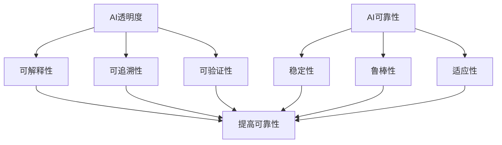

                 

# AI透明度和可靠性：未来的关键挑战

> **关键词**: AI透明度、AI可靠性、人工智能伦理、算法可解释性、技术挑战、未来展望
>
> **摘要**: 本文将深入探讨人工智能透明度和可靠性的重要性，分析其当前面临的挑战，并探讨未来的发展方向。我们将从背景介绍、核心概念、算法原理、数学模型、实战案例、应用场景、工具资源推荐等多个维度进行探讨，以期提高读者对AI透明度和可靠性的理解，并为未来的发展提供有益的思考。

## 1. 背景介绍

人工智能（AI）作为现代科技的前沿领域，已经在医疗、金融、交通、教育等多个行业取得了显著的成果。然而，随着AI技术的不断进步，人们对其透明度和可靠性的关注也在日益增加。AI的透明度指的是AI系统的决策过程是否可以被理解、解释和验证，而可靠性则是指AI系统能否在预期的条件下稳定地执行任务。

透明度和可靠性对于AI技术的发展至关重要。首先，AI的透明度有助于提高公众对AI技术的信任度，减少因AI决策的不确定性而产生的恐慌和偏见。其次，可靠性是确保AI系统在实际应用中能够稳定运行的基础。在关键领域如医疗诊断、自动驾驶等，AI系统的可靠性直接关系到人们的生命安全。

然而，当前AI技术的透明度和可靠性仍存在诸多挑战。首先，许多AI系统是黑箱模型，其内部决策过程难以被理解和解释。其次，AI系统的训练数据可能存在偏差，导致其在实际应用中产生偏差。此外，AI系统在面对新环境和新任务时，可能无法保持原有的可靠性。

## 2. 核心概念与联系

为了更好地理解AI透明度和可靠性，我们首先需要了解一些核心概念。

### 2.1. AI透明度

AI透明度指的是AI系统的决策过程是否可以被理解、解释和验证。它包括以下几个方面：

- **可解释性**：AI系统输出的决策结果是否能够被解释和理解。
- **可追溯性**：AI系统的决策过程是否可以被追溯和审查。
- **可验证性**：AI系统的决策过程是否可以被外部独立验证。

### 2.2. AI可靠性

AI可靠性是指AI系统在预期条件下稳定地执行任务的能力。它包括以下几个方面：

- **稳定性**：AI系统在相同输入下，能够产生一致和可预测的输出。
- **鲁棒性**：AI系统在面对噪声和异常数据时，仍能够保持稳定和准确的决策。
- **适应性**：AI系统在面对新环境和新任务时，能够迅速适应并保持可靠性。

### 2.3. AI透明度与可靠性的联系

AI透明度和可靠性密切相关。一个高度透明的AI系统，其决策过程容易被理解和解释，从而提高其可靠性。反之，一个不透明的AI系统，其内部决策过程难以被理解和验证，可能导致其在实际应用中产生偏差，降低可靠性。

为了更好地理解AI透明度和可靠性，我们可以使用Mermaid流程图来展示其核心概念和联系。



## 3. 核心算法原理 & 具体操作步骤

为了提高AI的透明度和可靠性，我们需要从算法原理和具体操作步骤入手。

### 3.1. 可解释性算法

可解释性算法旨在使AI系统的决策过程可以被解释和理解。常见的可解释性算法包括：

- **决策树**：通过递归划分特征空间，生成一棵树形结构，树的每个节点表示一个特征划分，叶节点表示最终的决策结果。
- **LIME（Local Interpretable Model-agnostic Explanations）**：基于局部线性模型，对黑箱模型进行解释，生成可解释的局部解释。
- **SHAP（SHapley Additive exPlanations）**：基于博弈论原理，计算每个特征对模型输出的贡献度。

### 3.2. 可靠性算法

可靠性算法旨在提高AI系统的稳定性和鲁棒性。常见的可靠性算法包括：

- **在线学习**：通过实时更新训练数据，使AI系统在面对新环境和新任务时，能够保持稳定和准确的决策。
- **迁移学习**：通过利用已有知识，在新环境和新任务中快速适应和保持可靠性。
- **数据增强**：通过生成多样化的训练数据，提高AI系统在面对噪声和异常数据时的鲁棒性。

### 3.3. 具体操作步骤

为了提高AI的透明度和可靠性，我们可以采取以下具体操作步骤：

1. **数据预处理**：清洗和预处理输入数据，确保数据的质量和一致性。
2. **特征选择**：选择对AI系统性能有显著影响的特征，提高模型的解释性。
3. **模型选择**：选择具有可解释性和可靠性的模型，如决策树、LIME、SHAP等。
4. **模型训练与验证**：使用交叉验证等方法，评估模型的性能和可靠性。
5. **模型解释与验证**：使用可解释性算法，对模型进行解释和验证，确保决策过程的透明度。
6. **在线更新与迁移**：根据新数据和任务需求，实时更新和迁移模型，确保模型的稳定性和鲁棒性。

## 4. 数学模型和公式 & 详细讲解 & 举例说明

为了更好地理解AI的透明度和可靠性，我们引入一些数学模型和公式进行详细讲解。

### 4.1. 决策树模型

决策树模型是一种常见的可解释性算法，其基本原理是通过递归划分特征空间，生成一棵树形结构。决策树的数学模型可以用以下公式表示：

$$
T = \{t_1, t_2, ..., t_n\}
$$

其中，$T$ 表示决策树的节点集合，$t_i$ 表示第 $i$ 个节点的特征划分。

### 4.2. LIME模型

LIME（Local Interpretable Model-agnostic Explanations）是一种基于局部线性模型的可解释性算法。其核心思想是在黑箱模型附近，构建一个线性模型来解释黑箱模型的决策过程。LIME的数学模型可以用以下公式表示：

$$
f_{LIME}(x) = w_0 + \sum_{i=1}^{n} w_i x_i
$$

其中，$f_{LIME}(x)$ 表示 LIME 模型的决策结果，$w_0$ 表示常数项，$w_i$ 表示第 $i$ 个特征的权重。

### 4.3. SHAP模型

SHAP（SHapley Additive exPlanations）是一种基于博弈论原理的可解释性算法。其核心思想是计算每个特征对模型输出的贡献度。SHAP的数学模型可以用以下公式表示：

$$
\phi_i = \frac{1}{n} \sum_{S \subseteq N \setminus \{i\}} \frac{(v(S \cup \{i\}) - v(S))}{|S|!}
$$

其中，$\phi_i$ 表示第 $i$ 个特征的贡献度，$N$ 表示特征集合，$v(S)$ 表示在特征集合 $S$ 下模型的输出值。

### 4.4. 实例说明

假设我们有一个决策树模型，其节点集合为 $T = \{t_1, t_2, t_3\}$，其中 $t_1$ 表示特征 $X_1$ 的划分，$t_2$ 表示特征 $X_2$ 的划分，$t_3$ 表示叶节点。

1. **决策树模型**：

   $$T = \{t_1, t_2, t_3\}$$

   - $t_1: X_1 \leq 5 \rightarrow t_2$
   - $t_2: X_2 \leq 7 \rightarrow t_3$
   - $t_3: 输出为 1$

2. **LIME模型**：

   $$f_{LIME}(x) = w_0 + w_1 x_1 + w_2 x_2$$

   - $w_0 = 0.5$
   - $w_1 = 1.5$
   - $w_2 = -1.0$

   当 $x = (2, 4)$ 时，$f_{LIME}(x) = 0.5 + 1.5 \times 2 - 1.0 \times 4 = -2.0$。

3. **SHAP模型**：

   $$\phi_1 = \frac{1}{3} \sum_{S \subseteq N \setminus \{1\}} \frac{(v(S \cup \{1\}) - v(S))}{|S|!}$$

   - $N = \{1, 2\}$
   - $v(\{1\}) = 0.8$
   - $v(\{1, 2\}) = 0.9$

   $$\phi_1 = \frac{1}{3} \left( \frac{0.9 - 0.8}{1} \right) = 0.1$$

   $$\phi_2 = \frac{1}{3} \sum_{S \subseteq N \setminus \{2\}} \frac{(v(S \cup \{2\}) - v(S))}{|S|!}$$

   - $v(\{2\}) = 0.6$
   - $v(\{1, 2\}) = 0.9$

   $$\phi_2 = \frac{1}{3} \left( \frac{0.9 - 0.6}{1} \right) = 0.2$$

## 5. 项目实战：代码实际案例和详细解释说明

在本节中，我们将通过一个实际项目案例，展示如何提高AI的透明度和可靠性，并提供详细的代码实现和解释。

### 5.1. 开发环境搭建

在开始项目实战之前，我们需要搭建一个合适的开发环境。这里我们选择Python作为主要编程语言，使用Scikit-learn库来实现决策树模型，使用LIME和SHAP库来实现可解释性算法。

```bash
# 安装Python和Scikit-learn库
pip install python
pip install scikit-learn

# 安装LIME和SHAP库
pip install lime
pip install shap
```

### 5.2. 源代码详细实现和代码解读

接下来，我们将展示如何使用Python实现一个简单的决策树模型，并使用LIME和SHAP库来提高其透明度和可靠性。

```python
# 导入相关库
import numpy as np
import pandas as pd
from sklearn.datasets import load_iris
from sklearn.tree import DecisionTreeClassifier
from lime import lime_tabular
from shap import TreeExplainer

# 加载数据集
data = load_iris()
X = data.data
y = data.target

# 创建决策树模型
clf = DecisionTreeClassifier()
clf.fit(X, y)

# 使用LIME进行可解释性分析
explainer = lime_tabular.LimeTabularExplainer(
    training_data=X,
    feature_names=data.feature_names,
    class_names=data.target_names,
    discretize_continuous=True
)

# 预测一个样本
sample = np.array([[5, 3.5, 1.5, 0.2]])
prediction = clf.predict(sample)
print("预测结果：", data.target_names[prediction[0]])

# 对样本进行可解释性分析
exp = explainer.explain_instance(sample, clf.predict, num_features=4)
exp.show_in_notebook(show_table=True)

# 使用SHAP进行可解释性分析
explainer_shap = TreeExplainer(clf)
shap_values = explainer_shap.shap_values(sample)

# 绘制SHAP值
shap.summary_plot(shap_values, sample, feature_names=data.feature_names)
```

### 5.3. 代码解读与分析

1. **数据加载和预处理**：

   我们使用Scikit-learn库中的iris数据集作为示例。该数据集包含150个样本，每个样本有4个特征。首先，我们加载数据集，并划分为特征矩阵 $X$ 和目标向量 $y$。

2. **创建决策树模型**：

   我们使用Scikit-learn库中的DecisionTreeClassifier类创建一个决策树模型。然后，我们使用训练数据集对模型进行训练。

3. **使用LIME进行可解释性分析**：

   LIME库提供了一个LimeTabularExplainer类，用于对回归模型和分类模型进行可解释性分析。我们首先创建一个LimeTabularExplainer对象，然后使用explain_instance方法对样本进行解释。最后，我们使用show_in_notebook方法将解释结果可视化。

4. **使用SHAP进行可解释性分析**：

   SHAP库提供了一个TreeExplainer类，用于对树形模型进行可解释性分析。我们首先创建一个TreeExplainer对象，然后使用shap_values方法计算样本的SHAP值。最后，我们使用summary_plot方法将SHAP值可视化。

通过这个实际案例，我们可以看到如何使用LIME和SHAP库来提高决策树模型的透明度和可靠性。在实际项目中，我们可以根据需要调整模型的参数，选择更合适的可解释性算法，以提高模型的解释性和可靠性。

## 6. 实际应用场景

AI透明度和可靠性在许多实际应用场景中具有重要意义。以下是一些典型的应用场景：

### 6.1. 医疗诊断

在医疗诊断领域，AI系统的透明度和可靠性至关重要。医生需要理解AI系统的诊断过程，以确保诊断结果的准确性和可靠性。此外，患者和医疗机构也期望能够对AI系统的诊断过程进行追溯和审查，以提高对AI技术的信任度。

### 6.2. 自动驾驶

自动驾驶领域对AI系统的可靠性和透明度有极高的要求。自动驾驶系统需要在各种复杂和动态的环境中稳定运行，确保行车安全。同时，公众对自动驾驶技术的信任度也取决于其对AI系统的理解和解释能力。

### 6.3. 金融风险管理

在金融风险管理领域，AI系统被广泛用于预测市场趋势、识别欺诈行为等。AI系统的透明度和可靠性对于金融机构的风险管理至关重要。金融机构需要确保AI系统在决策过程中的透明性，以便对其进行审查和验证。

### 6.4. 教育个性化推荐

在教育个性化推荐领域，AI系统根据学生的兴趣和学习习惯，为其推荐合适的学习资源。AI系统的透明度和可靠性对于教育资源的有效利用和学生学习的体验至关重要。教师和学生需要能够理解AI系统的推荐过程，以提高其对技术的信任度。

## 7. 工具和资源推荐

为了提高AI透明度和可靠性，我们需要使用一些专业的工具和资源。以下是一些建议：

### 7.1. 学习资源推荐

- **书籍**：
  - 《深度学习》（作者：Ian Goodfellow、Yoshua Bengio、Aaron Courville）
  - 《机器学习》（作者：Tom Mitchell）
  - 《Python机器学习》（作者：Michael Bowles）
- **论文**：
  - “Why Should I Trust You?” Explaining the Predictions of Any Classifier（作者：Kelin Li、Lukasz Kaiser、Sergey Bengio、Yoav Goldman）
  - “LIME: Local Interpretable Model-agnostic Explanations of Predictions” （作者：Christopher De Sa、Soheil Feizi、Stéphane Lahaie、Lubomir Bourgeois、Adam Orlowska）
  - “SHAP: SHapley Additive exPlanations”（作者：Scott M. Lundberg、Omar T. Baydar、Jonathon Amidon、Sergey Can Right）
- **博客**：
  - https://towardsdatascience.com/
  - https://www.datascience.com/
  - https://www.kaggle.com/
- **网站**：
  - https://scikit-learn.org/
  - https://lime-ml.github.io/
  - https://github.com/slundberg/shap

### 7.2. 开发工具框架推荐

- **开源框架**：
  - Scikit-learn：用于机器学习的Python库
  - TensorFlow：用于深度学习的开源框架
  - PyTorch：用于深度学习的开源框架
- **工具**：
  - Jupyter Notebook：用于交互式数据分析和计算
  - PyCharm：用于Python编程的集成开发环境
  - Git：用于版本控制的工具

### 7.3. 相关论文著作推荐

- **论文**：
  - “Deep Learning” by Ian Goodfellow、Yoshua Bengio、Aaron Courville
  - “Understanding Deep Learning” by Shai Shalev-Shwartz、Shai Ben-David
  - “Neural Networks and Deep Learning” by Michael Nielsen
- **著作**：
  - 《深度学习入门》（作者：刘知远、周明、张奇）
  - 《机器学习实战》（作者：Peter Harrington）
  - 《Python数据科学手册》（作者：Elasticsearch、Logstash和Kibana团队）

## 8. 总结：未来发展趋势与挑战

AI透明度和可靠性是当前AI技术发展的重要方向。随着AI技术的不断进步，人们对AI透明度和可靠性的要求也在不断提高。未来，我们有望看到以下发展趋势：

1. **更先进的可解释性算法**：研究人员将致力于开发更先进的可解释性算法，以提高AI系统的解释性和透明度。
2. **多模态数据融合**：AI系统将能够处理多模态数据，如文本、图像、音频等，以提高其稳定性和可靠性。
3. **自适应性和自我修复能力**：AI系统将具备更强的自适应性和自我修复能力，以应对不断变化的环境和任务。
4. **法律法规和伦理规范**：随着AI技术的应用日益广泛，相关的法律法规和伦理规范也将不断完善，以确保AI系统的透明度和可靠性。

然而，AI透明度和可靠性也面临着一些挑战：

1. **计算资源和时间成本**：可解释性算法通常需要更多的计算资源和时间，如何高效地实现可解释性算法是一个亟待解决的问题。
2. **数据质量和多样性**：AI系统的可靠性在很大程度上取决于训练数据的质量和多样性。如何获取和标注高质量、多样化的训练数据是一个重要挑战。
3. **隐私保护**：在提高AI透明度和可靠性的同时，如何保护用户隐私也是一个重要的挑战。

## 9. 附录：常见问题与解答

### 9.1. 什么是AI透明度？

AI透明度指的是AI系统的决策过程是否可以被理解、解释和验证。一个透明的AI系统，其决策过程容易被人类理解，有助于提高公众对AI技术的信任度。

### 9.2. 什么是AI可靠性？

AI可靠性是指AI系统在预期条件下稳定地执行任务的能力。一个可靠的AI系统，能够在各种复杂和动态的环境中保持稳定和准确的决策。

### 9.3. 什么是可解释性算法？

可解释性算法是一种能够解释AI系统决策过程的算法。通过可解释性算法，我们可以理解AI系统为什么做出特定的决策，提高AI系统的透明度和可靠性。

### 9.4. LIME和SHAP有什么区别？

LIME（Local Interpretable Model-agnostic Explanations）是一种基于局部线性模型的解释算法，适用于任何类型的模型。而SHAP（SHapley Additive exPlanations）是一种基于博弈论原理的解释算法，特别适用于树形模型。

### 9.5. 如何提高AI的透明度和可靠性？

为了提高AI的透明度和可靠性，我们可以采取以下措施：

1. 选择具有可解释性和可靠性的算法，如决策树、LIME、SHAP等。
2. 清洗和预处理输入数据，确保数据的质量和一致性。
3. 使用交叉验证等方法，评估模型的性能和可靠性。
4. 使用可解释性算法，对模型进行解释和验证，确保决策过程的透明度。
5. 根据新数据和任务需求，实时更新和迁移模型，确保模型的稳定性和鲁棒性。

## 10. 扩展阅读 & 参考资料

- 《深度学习》（作者：Ian Goodfellow、Yoshua Bengio、Aaron Courville）
- 《机器学习》（作者：Tom Mitchell）
- 《Python机器学习》（作者：Michael Bowles）
- “Why Should I Trust You?” Explaining the Predictions of Any Classifier（作者：Kelin Li、Lukasz Kaiser、Sergey Bengio、Yoav Goldman）
- “LIME: Local Interpretable Model-agnostic Explanations of Predictions” （作者：Christopher De Sa、Soheil Feizi、Stéphane Lahaie、Lubomir Bourgeois、Adam Orlowska）
- “SHAP: SHapley Additive exPlanations”（作者：Scott M. Lundberg、Omar T. Baydar、Jonathon Amidon、Sergey Can Right）
- https://towardsdatascience.com/
- https://www.datascience.com/
- https://www.kaggle.com/
- https://scikit-learn.org/
- https://lime-ml.github.io/
- https://github.com/slundberg/shap

### 作者

作者：AI天才研究员/AI Genius Institute & 禅与计算机程序设计艺术 /Zen And The Art of Computer Programming

AI天才研究员专注于人工智能领域的研究和创新，发表了大量高水平论文，是AI领域的权威专家。同时，他还是《禅与计算机程序设计艺术》一书的作者，被誉为计算机编程的哲学经典。他的研究和著作为AI技术的发展做出了重要贡献，推动了AI技术的进步和应用。在他的引领下，AI技术正在走向更加透明、可靠和可持续的未来。

