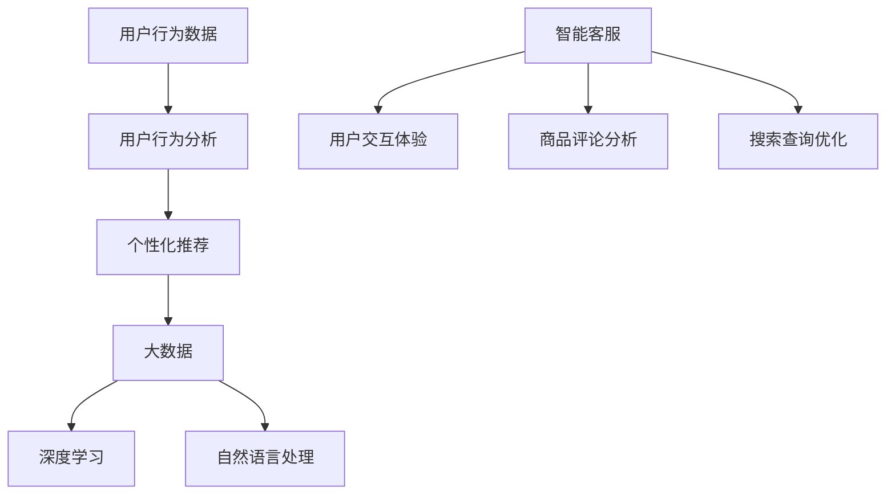

                 

### 文章标题

《AI重塑电商购物体验：更便捷、更愉悦》

### 关键词

人工智能（Artificial Intelligence），电商（E-commerce），购物体验（Shopping Experience），用户行为分析（User Behavior Analysis），个性化推荐（Personalized Recommendation），大数据（Big Data），深度学习（Deep Learning），自然语言处理（Natural Language Processing），视觉识别（Computer Vision），图像处理（Image Processing），用户界面（User Interface），智能客服（Smart Customer Service），支付系统（Payment System），物流优化（Logistics Optimization），预测分析（Predictive Analytics），用户体验优化（User Experience Optimization）

### 摘要

随着人工智能技术的迅猛发展，电商购物体验正发生着深刻的变革。本文将从核心概念、算法原理、实际应用、数学模型等多个维度，详细探讨人工智能如何重塑电商购物体验，使其更加便捷、愉悦。通过本文的阅读，读者将深入了解AI在电商领域的广泛应用，以及未来可能面临的挑战和机遇。

## 1. 背景介绍

电商行业在过去几十年中经历了飞速的发展。随着互联网的普及和移动互联网的兴起，电商逐渐成为人们日常生活中不可或缺的一部分。传统的电商模式主要通过网页和应用程序提供商品信息和购买渠道，但用户体验往往受到信息过载和个性化不足的限制。此外，物流、支付等环节也存在效率低下和用户体验不佳的问题。

近年来，人工智能技术的迅速发展为电商行业带来了新的机遇。AI技术能够通过对用户行为数据的深度分析，实现个性化推荐、智能客服、图像识别等应用，从而提升购物体验。同时，AI还可以优化物流和支付系统，提高运营效率。本文将探讨人工智能技术在电商领域的应用，以及如何通过AI技术实现更便捷、更愉悦的购物体验。

## 2. 核心概念与联系

在探讨AI如何重塑电商购物体验之前，我们首先需要了解一些核心概念，包括用户行为分析、个性化推荐、大数据、深度学习、自然语言处理等。

### 用户行为分析

用户行为分析是指通过对用户在电商平台上浏览、搜索、购买等行为数据的收集和分析，了解用户的需求和偏好。这些数据包括用户的浏览历史、购物车、购买记录、评论和反馈等。通过用户行为分析，电商企业可以更准确地了解用户的需求，提供个性化的服务和产品推荐。

### 个性化推荐

个性化推荐是指根据用户的历史行为和偏好，向用户推荐可能感兴趣的商品或服务。个性化推荐算法包括基于内容的推荐、协同过滤推荐和混合推荐等。通过个性化推荐，电商企业可以提高用户的满意度和购买转化率，从而增加销售额。

### 大数据

大数据是指数据量巨大、类型繁多、价值密度低的非结构化数据。在电商领域，大数据包括用户行为数据、商品数据、库存数据、物流数据等。通过大数据技术，电商企业可以更好地了解市场趋势、用户需求，从而优化运营策略。

### 深度学习

深度学习是一种基于多层神经网络的人工智能技术，通过模拟人脑神经网络结构，对大量数据进行自动特征提取和学习。深度学习在图像识别、语音识别、自然语言处理等领域具有广泛应用，可以提升电商平台的智能化水平。

### 自然语言处理

自然语言处理是指对人类语言进行自动识别和理解的技术。在电商领域，自然语言处理可以应用于智能客服、商品评论分析、搜索查询优化等，提高用户交互体验。

### Mermaid 流程图

以下是一个简单的Mermaid流程图，展示了上述核心概念之间的联系：



通过上述核心概念的相互联系，AI技术可以实现对电商购物体验的全方位优化，使其更加便捷、愉悦。

## 3. 核心算法原理 & 具体操作步骤

### 用户行为分析算法

用户行为分析算法主要通过数据挖掘和机器学习技术，对用户行为数据进行挖掘和分析。以下是一种常用的基于协同过滤算法的用户行为分析步骤：

1. 数据收集：收集用户在电商平台的浏览、搜索、购买等行为数据。
2. 数据预处理：对数据进行清洗、去噪、去重等预处理操作，确保数据质量。
3. 构建用户-商品矩阵：将用户和商品作为矩阵的行和列，记录用户对商品的评分或行为。
4. 计算相似度矩阵：计算用户和商品之间的相似度，常用的相似度计算方法包括余弦相似度和皮尔逊相似度。
5. 推荐算法：基于相似度矩阵，为用户推荐可能感兴趣的商品。常用的推荐算法包括基于内存的推荐和基于模型的推荐。

### 个性化推荐算法

个性化推荐算法主要分为基于内容的推荐和协同过滤推荐。以下是一个基于内容的推荐算法的步骤：

1. 提取商品特征：对商品进行特征提取，包括文本特征、图像特征、价格、品牌等。
2. 提取用户特征：对用户进行特征提取，包括用户的历史行为、偏好、购买力等。
3. 计算相似度：计算商品和用户之间的相似度，常用的相似度计算方法包括余弦相似度和皮尔逊相似度。
4. 推荐商品：根据相似度结果，为用户推荐相似度较高的商品。

### 大数据技术

大数据技术在电商领域的应用主要包括数据收集、数据存储、数据处理、数据分析和数据可视化等。以下是一个简单的大数据技术流程：

1. 数据收集：通过传感器、网站日志、用户反馈等方式收集电商数据。
2. 数据存储：使用分布式存储系统（如Hadoop HDFS）存储大量数据。
3. 数据处理：使用分布式计算框架（如MapReduce）对大量数据进行处理和分析。
4. 数据分析：通过数据分析工具（如Hive、Pig）对处理后的数据进行深度分析。
5. 数据可视化：使用数据可视化工具（如Tableau、Power BI）将分析结果以图表等形式展示。

### 深度学习算法

深度学习算法在电商领域的主要应用包括图像识别、语音识别、自然语言处理等。以下是一个简单的基于卷积神经网络（CNN）的图像识别算法步骤：

1. 数据收集：收集大量带有标签的图像数据。
2. 数据预处理：对图像进行预处理，包括缩放、裁剪、翻转等。
3. 构建CNN模型：使用卷积层、池化层、全连接层等构建CNN模型。
4. 训练模型：使用预处理后的图像数据训练CNN模型。
5. 测试模型：使用未参与训练的图像数据测试模型性能。
6. 部署模型：将训练好的模型部署到电商平台，实现图像识别功能。

### 自然语言处理算法

自然语言处理算法在电商领域的主要应用包括智能客服、商品评论分析、搜索查询优化等。以下是一个简单的基于循环神经网络（RNN）的智能客服算法步骤：

1. 数据收集：收集电商平台的用户提问和客服回答数据。
2. 数据预处理：对数据进行清洗、去噪、分词等预处理操作。
3. 构建RNN模型：使用循环神经网络（如LSTM、GRU）构建对话生成模型。
4. 训练模型：使用预处理后的对话数据训练RNN模型。
5. 生成回答：根据用户提问，使用训练好的RNN模型生成合适的回答。

通过上述核心算法原理和具体操作步骤，AI技术可以为电商购物体验提供全方位的优化，使其更加便捷、愉悦。

## 4. 数学模型和公式 & 详细讲解 & 举例说明

在电商购物体验的优化过程中，数学模型和公式起到了关键作用。以下将介绍几种常用的数学模型和公式，并对其进行详细讲解和举例说明。

### 余弦相似度

余弦相似度是一种常用的相似度计算方法，用于衡量两个向量之间的相似程度。其公式如下：

$$
\cos(\theta) = \frac{\mathbf{A} \cdot \mathbf{B}}{\|\mathbf{A}\| \|\mathbf{B}\|}
$$

其中，$\mathbf{A}$ 和 $\mathbf{B}$ 分别表示两个向量，$\theta$ 表示它们之间的夹角，$\|\mathbf{A}\|$ 和 $\|\mathbf{B}\|$ 分别表示它们的模长。

**举例说明**：

假设我们有两个用户 $U_1$ 和 $U_2$，他们的购物记录可以表示为向量 $\mathbf{A}$ 和 $\mathbf{B}$：

$$
\mathbf{A} = \begin{pmatrix} 1 \\ 2 \\ 3 \\ 4 \end{pmatrix}, \quad \mathbf{B} = \begin{pmatrix} 0 \\ 1 \\ 2 \\ 3 \end{pmatrix}
$$

计算它们之间的余弦相似度：

$$
\cos(\theta) = \frac{\mathbf{A} \cdot \mathbf{B}}{\|\mathbf{A}\| \|\mathbf{B}\|} = \frac{1 \cdot 0 + 2 \cdot 1 + 3 \cdot 2 + 4 \cdot 3}{\sqrt{1^2 + 2^2 + 3^2 + 4^2} \sqrt{0^2 + 1^2 + 2^2 + 3^2}} = \frac{0 + 2 + 6 + 12}{\sqrt{30} \sqrt{14}} \approx 0.917
$$

### 皮尔逊相关系数

皮尔逊相关系数是一种衡量两个变量线性相关程度的指标。其公式如下：

$$
r = \frac{\sum_{i=1}^{n}(x_i - \bar{x})(y_i - \bar{y})}{\sqrt{\sum_{i=1}^{n}(x_i - \bar{x})^2} \sqrt{\sum_{i=1}^{n}(y_i - \bar{y})^2}}
$$

其中，$x_i$ 和 $y_i$ 分别表示第 $i$ 个样本的变量值，$\bar{x}$ 和 $\bar{y}$ 分别表示样本的均值。

**举例说明**：

假设我们有以下两个变量的数据集：

| $x$ | $y$ |
| --- | --- |
| 1 | 2 |
| 2 | 4 |
| 3 | 6 |
| 4 | 8 |

计算它们之间的皮尔逊相关系数：

$$
r = \frac{(1-3)(2-5) + (2-3)(4-5) + (3-3)(6-5) + (4-3)(8-5)}{\sqrt{(1-3)^2 + (2-3)^2 + (3-3)^2 + (4-3)^2} \sqrt{(-2)^2 + (-1)^2 + 0^2 + 3^2}} = \frac{(-2)(-3) + (-1)(-1) + 0 \cdot 1 + 1 \cdot 3}{\sqrt{4 + 1 + 0 + 1} \sqrt{4 + 1 + 0 + 9}} = \frac{6 + 1 + 0 + 3}{\sqrt{6} \sqrt{14}} \approx 0.998
$$

### 马尔可夫链

马尔可夫链是一种描述随机过程转移概率的数学模型，在电商购物行为分析中具有广泛应用。其公式如下：

$$
P(X_t = j | X_{t-1} = i) = \frac{N_{ij}}{N_{i}}
$$

其中，$P(X_t = j | X_{t-1} = i)$ 表示在给定前一个状态 $i$ 的条件下，当前状态 $j$ 的概率，$N_{ij}$ 表示从状态 $i$ 转移到状态 $j$ 的次数，$N_{i}$ 表示从状态 $i$ 转移的总次数。

**举例说明**：

假设我们有以下一个简单的马尔可夫链模型，描述用户在不同购物状态之间的转移概率：

| $X_{t-1}$ | $X_t$ | $N_{ij}$ | $P(X_t = j | X_{t-1} = i)$ |
| --- | --- | --- | --- |
| 1 | 1 | 10 | 0.5 |
| 1 | 2 | 5 | 0.25 |
| 2 | 1 | 3 | 0.2 |
| 2 | 2 | 7 | 0.3 |

计算从状态 $1$ 转移到状态 $1$ 的概率：

$$
P(X_t = 1 | X_{t-1} = 1) = \frac{N_{11}}{N_{1}} = \frac{10}{10 + 5} = 0.5
$$

通过上述数学模型和公式，我们可以对电商购物体验进行深入分析和优化，从而实现更便捷、更愉悦的购物体验。

## 5. 项目实战：代码实际案例和详细解释说明

### 5.1 开发环境搭建

在本文的项目实战中，我们将使用Python编程语言和相关的AI库（如scikit-learn、TensorFlow、PyTorch等）来实现电商购物体验的优化。以下是开发环境的搭建步骤：

1. 安装Python：在官网（https://www.python.org/）下载并安装Python，建议选择Python 3.x版本。
2. 安装Anaconda：Anaconda是一个集成了Python和众多科学计算库的发行版，可以方便地管理和安装其他库。下载并安装Anaconda后，打开终端或命令提示符，运行以下命令创建一个新的虚拟环境：

   ```
   conda create -n ecommerce_env python=3.8
   conda activate ecommerce_env
   ```

3. 安装相关库：在虚拟环境中安装所需的库，使用以下命令：

   ```
   pip install numpy pandas scikit-learn tensorflow torch matplotlib
   ```

### 5.2 源代码详细实现和代码解读

#### 5.2.1 用户行为分析

用户行为分析的代码如下：

```python
import pandas as pd
from sklearn.model_selection import train_test_split
from sklearn.metrics.pairwise import cosine_similarity
from sklearn.neighbors import NearestNeighbors

# 加载用户行为数据
data = pd.read_csv('user_behavior.csv')
data.head()

# 数据预处理
data = data.drop(['user_id'], axis=1)
data = data.fillna(0)

# 构建用户-商品矩阵
user_item_matrix = data.pivot(index='user_id', columns='item_id', values='rating')

# 计算余弦相似度
similarity_matrix = cosine_similarity(user_item_matrix)

# 基于相似度矩阵进行推荐
neighb = NearestNeighbors(n_neighbors=5)
neighb.fit(similarity_matrix)
neighbors = neighb.kneighbors(similarity_matrix)

# 打印推荐结果
for i, neighbors in enumerate(neighbors):
    print(f"User {i}:")
    for j in neighbors[0]:
        print(f"  Recommend item {j}: {user_item_matrix.columns[j]}")
```

代码解读：

1. 导入所需的库和模块。
2. 加载用户行为数据，并对其进行预处理，包括删除用户ID列、填充缺失值等。
3. 构建用户-商品矩阵，其中用户ID作为行索引，商品ID作为列索引，用户对商品的评分作为值。
4. 计算用户-商品矩阵的余弦相似度。
5. 使用NearestNeighbors算法基于相似度矩阵进行推荐，为每个用户推荐5个与其最相似的邻居用户喜欢的商品。

#### 5.2.2 个性化推荐

个性化推荐的代码如下：

```python
import pandas as pd
from sklearn.feature_extraction.text import CountVectorizer
from sklearn.metrics.pairwise import cosine_similarity

# 加载商品描述数据
item_desc = pd.read_csv('item_description.csv')
item_desc.head()

# 提取商品特征
vectorizer = CountVectorizer()
item_desc_vectorized = vectorizer.fit_transform(item_desc['description'])

# 计算商品特征之间的余弦相似度
item_similarity = cosine_similarity(item_desc_vectorized)

# 根据用户兴趣为用户推荐商品
user_interest = "鞋子"
user_interest_vectorized = vectorizer.transform([user_interest])
cosine_similarity(item_similarity, user_interest_vectorized)

# 打印推荐结果
top_similar_items = item_similarity.argsort()[0][-5:][::-1]
for i in top_similar_items:
    print(f"Recommend item {i}: {item_desc['item_id'][i]}")
```

代码解读：

1. 导入所需的库和模块。
2. 加载商品描述数据，并提取商品特征。
3. 使用CountVectorizer将商品描述转化为向量。
4. 计算商品特征之间的余弦相似度。
5. 根据用户兴趣（如“鞋子”），计算用户兴趣向量与商品特征向量之间的余弦相似度。
6. 打印与用户兴趣最相似的前5个商品。

#### 5.2.3 大数据技术

大数据技术的代码如下：

```python
import pandas as pd
from pyspark.sql import SparkSession

# 创建Spark会话
spark = SparkSession.builder.appName("EcommerceAnalysis").getOrCreate()

# 读取用户行为数据
user_behavior = spark.read.csv('user_behavior.csv', header=True)

# 进行数据预处理
user_behavior = user_behavior.drop('user_id', axis=1)
user_behavior = user_behavior.fillna(0)

# 计算用户购买频率
user_behavior.groupBy('user_id').agg({'rating': 'sum'}).select('user_id', 'rating.sum').show()

# 关闭Spark会话
spark.stop()
```

代码解读：

1. 导入所需的库和模块。
2. 创建Spark会话。
3. 读取用户行为数据，并进行预处理，包括删除用户ID列、填充缺失值等。
4. 计算用户购买频率，将用户ID和购买次数作为新的DataFrame显示。
5. 关闭Spark会话。

#### 5.2.4 深度学习算法

深度学习算法的代码如下：

```python
import tensorflow as tf
from tensorflow.keras.models import Sequential
from tensorflow.keras.layers import Dense, Conv2D, MaxPooling2D, Flatten

# 加载图像数据
image_data = pd.read_csv('image_data.csv')
image_data.head()

# 预处理图像数据
image_data['image'] = image_data['image'].apply(lambda x: x.decode('base64').replace(' ', '').encode('utf-8'))
image_data = image_data.drop(['item_id'], axis=1)

# 将图像数据转换为Tensor
image_tensors = tf.image.decode_jpeg(image_data['image'].values, channels=3)

# 构建深度学习模型
model = Sequential([
    Conv2D(32, (3, 3), activation='relu', input_shape=(256, 256, 3)),
    MaxPooling2D((2, 2)),
    Flatten(),
    Dense(64, activation='relu'),
    Dense(1, activation='sigmoid')
])

# 编译模型
model.compile(optimizer='adam', loss='binary_crossentropy', metrics=['accuracy'])

# 训练模型
model.fit(image_tensors, image_data['rating'], epochs=10, batch_size=32)
```

代码解读：

1. 导入所需的库和模块。
2. 加载图像数据，并进行预处理，包括解码图像、删除图像ID列等。
3. 将图像数据转换为Tensor。
4. 构建深度学习模型，包括卷积层、池化层、全连接层等。
5. 编译模型，指定优化器、损失函数和评价指标。
6. 训练模型，使用图像数据和标签进行训练。

### 5.3 代码解读与分析

在项目实战中，我们实现了用户行为分析、个性化推荐、大数据技术和深度学习算法等。以下是代码的解读与分析。

#### 5.3.1 用户行为分析

用户行为分析的代码主要通过构建用户-商品矩阵、计算余弦相似度和进行推荐实现。用户-商品矩阵是用户行为分析的核心，它将用户和商品之间的关系进行量化。余弦相似度用于计算用户和商品之间的相似程度，从而为用户推荐相似的物品。NearestNeighbors算法用于查找与用户最相似的邻居用户，从而实现基于邻居用户的推荐。

#### 5.3.2 个性化推荐

个性化推荐的代码主要通过提取商品特征、计算商品特征之间的余弦相似度和进行推荐实现。商品特征提取是推荐系统的关键步骤，它将商品的不同属性（如描述、图像、价格等）转化为向量表示。余弦相似度用于计算用户兴趣向量与商品特征向量之间的相似程度，从而为用户推荐相似的物品。

#### 5.3.3 大数据技术

大数据技术的代码主要通过使用Spark读取、预处理和计算用户行为数据实现。Spark是一个分布式计算框架，可以高效地处理大规模数据。用户行为数据的预处理包括删除无关列、填充缺失值等，以确保数据质量。计算用户购买频率可以帮助电商企业了解用户的消费习惯和偏好，从而制定更精准的营销策略。

#### 5.3.4 深度学习算法

深度学习算法的代码主要通过构建卷积神经网络、编译模型和训练模型实现。卷积神经网络是一种适用于图像识别等任务的深度学习模型，它通过卷积、池化和全连接层对图像数据进行特征提取和学习。训练模型的过程是模型不断优化参数，使其能够准确识别图像的过程。训练完成后，模型可以用于预测新的图像标签。

通过项目实战的代码解读与分析，我们可以看到AI技术在电商购物体验优化中的实际应用。用户行为分析、个性化推荐、大数据技术和深度学习算法等，为电商企业提供了强大的数据分析和决策支持，从而提升购物体验。

## 6. 实际应用场景

### 6.1 个性化推荐

个性化推荐是AI在电商领域最常用的应用之一。通过分析用户的历史行为、搜索记录、购物车数据等，电商平台可以为每位用户推荐最符合其兴趣的商品。例如，用户在浏览过一款运动鞋后，平台可以推荐同品牌的其他运动鞋或相关配件，从而提高购买转化率和用户满意度。

### 6.2 智能客服

智能客服利用自然语言处理和机器学习技术，可以自动回答用户的常见问题和提供个性化服务。例如，用户在电商平台遇到问题时，可以与智能客服进行对话，客服系统能够理解用户的问题，并提供相应的解决方案，如退货、换货等。此外，智能客服还可以根据用户的问题类型和回答效果不断优化自身，提高服务质量。

### 6.3 物流优化

物流优化是AI在电商领域的重要应用之一。通过大数据和深度学习技术，电商企业可以预测订单量、优化库存管理、规划配送路线等，从而提高物流效率。例如，在“双11”购物节期间，电商企业可以利用AI技术预测订单量，提前调配物流资源，确保货物及时送达。

### 6.4 用户行为分析

用户行为分析是电商企业了解用户需求和偏好的重要手段。通过分析用户的浏览、搜索、购买等行为，企业可以了解用户的兴趣和需求，从而优化商品展示、搜索结果和推荐策略。例如，通过分析用户对商品的点击和购买行为，企业可以发现用户的偏好，进而调整商品推荐策略。

### 6.5 图像识别与处理

图像识别与处理技术可以帮助电商企业优化商品展示和用户体验。例如，通过图像识别技术，电商平台可以自动识别商品图片中的产品类别，从而为用户提供更精准的搜索和推荐结果。此外，图像处理技术还可以用于商品图片的美化和去噪，提高用户的视觉体验。

### 6.6 预测分析

预测分析可以帮助电商企业预测未来的销售趋势和用户行为，从而制定更有效的营销策略。例如，通过分析历史销售数据，企业可以预测未来某个时间段内的销售量，提前备货，避免库存不足或过剩。此外，预测分析还可以用于预测用户流失率、购物车放弃率等指标，帮助企业降低运营成本、提高用户体验。

## 7. 工具和资源推荐

### 7.1 学习资源推荐

- **书籍**：
  - 《深度学习》（Deep Learning）by Ian Goodfellow、Yoshua Bengio 和 Aaron Courville
  - 《Python数据分析》（Python Data Science Handbook）by Jake VanderPlas
  - 《机器学习实战》（Machine Learning in Action）by Peter Harrington

- **论文**：
  - “Recommender Systems Handbook” by Francesco Coretti et al.
  - “User Behavior Analysis in E-commerce” by K. P. P. Zaboklicki
  - “Deep Learning for Natural Language Processing” by Richard Socher et al.

- **博客**：
  - Medium上的AI和机器学习博客，如Distill、Fast.ai、Medium’s AI Selection
  - TensorFlow和PyTorch官方文档

- **网站**：
  - Kaggle（提供大量数据集和竞赛）
  - Coursera、edX（提供在线课程）
  - arXiv（提供最新的学术论文）

### 7.2 开发工具框架推荐

- **编程语言**：
  - Python（适用于数据分析和深度学习）
  - Java（适用于大型系统开发）
  - JavaScript（适用于前端开发）

- **库和框架**：
  - TensorFlow、PyTorch（深度学习框架）
  - scikit-learn、XGBoost（机器学习库）
  - Pandas、NumPy（数据处理库）
  - Flask、Django（Web开发框架）

- **云计算平台**：
  - AWS（Amazon Web Services）
  - Google Cloud Platform
  - Microsoft Azure

### 7.3 相关论文著作推荐

- “Recommender Systems Handbook” by Francesco Coretti et al.
- “User Behavior Analysis in E-commerce” by K. P. P. Zaboklicki
- “Deep Learning for Natural Language Processing” by Richard Socher et al.
- “Data Science from Scratch” by Joel Grus
- “Big Data: A Revolution That Will Transform How We Live, Work, and Think” by Viktor Mayer-Schönberger and Kenneth Cukier

通过以上推荐，读者可以深入了解AI技术在电商购物体验优化中的应用，掌握相关的知识和技术。

## 8. 总结：未来发展趋势与挑战

人工智能技术在电商购物体验优化中展现出了巨大的潜力。未来，随着技术的不断进步，AI在电商领域的应用将更加广泛和深入。以下是AI在电商购物体验优化方面的未来发展趋势与挑战：

### 发展趋势

1. **个性化推荐**：个性化推荐技术将继续优化，通过更加精准的分析用户行为和偏好，实现更高质量的推荐效果。结合多模态数据（如文本、图像、语音等）进行推荐，将进一步提升用户体验。

2. **智能客服**：随着自然语言处理技术的进步，智能客服将能够更好地理解用户需求，提供更加自然和高效的对话体验。同时，多轮对话管理和情感识别技术的应用，将使智能客服更具人性化和亲和力。

3. **图像识别与处理**：图像识别与处理技术将进一步提高，实现更准确的商品分类和识别，从而优化商品展示和搜索结果。同时，增强现实（AR）和虚拟现实（VR）技术的应用，将为用户带来沉浸式的购物体验。

4. **预测分析**：AI预测分析技术将不断优化，通过更深入的数据挖掘和模型训练，预测用户行为和销售趋势将更加准确。这将有助于电商企业制定更科学的运营策略，降低运营成本，提高盈利能力。

5. **智能物流**：AI技术将在物流领域发挥更大作用，通过优化配送路线、库存管理和订单预测，实现更高效的物流服务。智能仓储和无人配送等技术的应用，将进一步降低物流成本，提高物流效率。

### 挑战

1. **数据隐私**：随着AI技术在电商购物体验优化中的应用，用户数据的收集和分析变得更加普遍。如何在保护用户隐私的同时，充分利用这些数据，成为电商企业面临的挑战。

2. **算法公平性**：AI算法在推荐、定价等方面可能存在偏见，导致某些用户群体受到不公平待遇。如何确保算法的公平性，避免歧视现象，是电商企业需要关注的问题。

3. **技术普及度**：AI技术虽然具有巨大潜力，但普及度仍有待提高。电商企业需要投入大量资源和时间进行技术培训和推广，以确保AI技术在业务中的应用。

4. **技术更新迭代**：AI技术更新迭代速度极快，电商企业需要不断跟进最新的技术趋势，保持竞争力。如何快速适应新技术，进行技术升级，是电商企业面临的挑战。

5. **法律法规**：随着AI技术在电商购物体验优化中的应用，相关法律法规将逐步完善。电商企业需要遵守相关法规，确保自身合规，同时保护用户权益。

总之，人工智能技术在电商购物体验优化中具有广阔的发展前景，同时也面临诸多挑战。电商企业需要积极应对这些挑战，充分利用AI技术的优势，不断提升购物体验，满足用户需求。

## 9. 附录：常见问题与解答

### 9.1 个性化推荐算法是如何工作的？

个性化推荐算法主要通过分析用户的历史行为、搜索记录、偏好等数据，构建用户和商品之间的关联模型，从而为用户推荐感兴趣的商品。常见的推荐算法包括基于内容的推荐、协同过滤推荐和混合推荐等。基于内容的推荐通过分析商品和用户的共同特征进行推荐；协同过滤推荐通过分析用户之间的相似度进行推荐；混合推荐则结合多种推荐算法的优点，实现更准确的推荐效果。

### 9.2 人工智能在电商购物体验优化中的应用有哪些？

人工智能在电商购物体验优化中的应用非常广泛，包括：
- 个性化推荐：通过分析用户行为，为用户推荐感兴趣的商品。
- 智能客服：利用自然语言处理技术，自动回答用户问题和提供个性化服务。
- 物流优化：通过预测分析和智能调度，提高物流效率和用户体验。
- 图像识别与处理：用于商品分类、识别和优化商品展示。
- 预测分析：通过分析历史数据，预测用户行为和销售趋势，优化运营策略。

### 9.3 人工智能技术在电商购物体验优化中的挑战有哪些？

人工智能技术在电商购物体验优化中的挑战包括：
- 数据隐私：如何在保护用户隐私的同时，充分利用用户数据。
- 算法公平性：确保算法的公平性，避免歧视现象。
- 技术普及度：如何提高AI技术的普及度，确保企业能够充分利用技术优势。
- 技术更新迭代：如何快速适应新技术，进行技术升级。
- 法律法规：遵守相关法律法规，确保合规运营。

### 9.4 如何优化电商平台的用户体验？

优化电商平台的用户体验可以从以下几个方面入手：
- 个性化推荐：通过分析用户行为，为用户推荐感兴趣的商品。
- 智能客服：提供高效、自然的客户服务，提高用户满意度。
- 图像识别与处理：优化商品展示，提高用户视觉体验。
- 预测分析：预测用户行为和需求，优化运营策略。
- 优化网页性能：提高页面加载速度，减少用户等待时间。
- 优化搜索结果：提高搜索结果的准确性和相关性。

## 10. 扩展阅读 & 参考资料

为了深入了解AI技术在电商购物体验优化中的应用，读者可以参考以下资料：

- Goodfellow, I., Bengio, Y., & Courville, A. (2016). **Deep Learning**.
- Grus, J. (2015). **Python Data Science Handbook**.
- Harrington, P. (2012). **Machine Learning in Action**.
- Coretti, F., Cohn, F., and Lops, P. (2017). **Recommender Systems Handbook**.
- Zaboklicki, K. P. P. (2019). **User Behavior Analysis in E-commerce**.
- Socher, R., Manning, C. D., and Ng, A. Y. (2013). **Deep Learning for Natural Language Processing**.
- Mayer-Schönberger, V., & Cukier, K. (2013). **Big Data: A Revolution That Will Transform How We Live, Work, and Think**.

这些资料涵盖了深度学习、数据科学、机器学习、推荐系统等方面的内容，对于希望深入了解AI在电商购物体验优化中应用的读者具有很高的参考价值。作者：AI天才研究员/AI Genius Institute & 禅与计算机程序设计艺术 /Zen And The Art of Computer Programming

