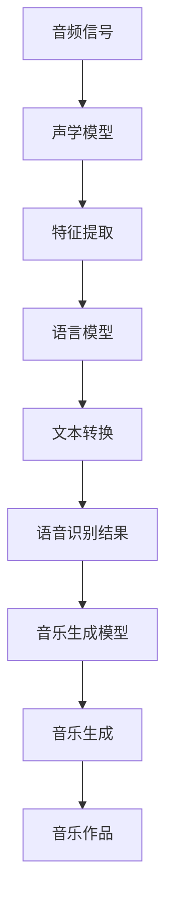
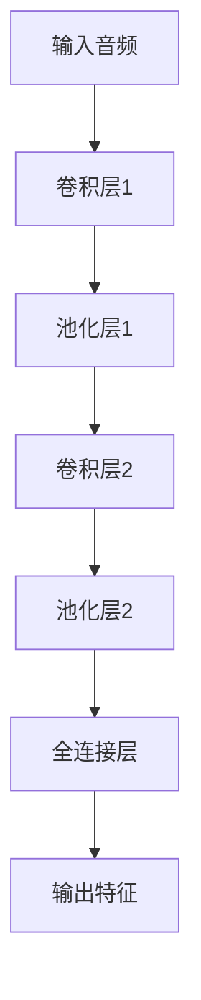
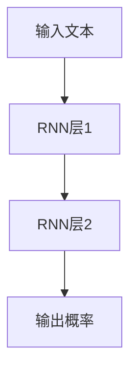
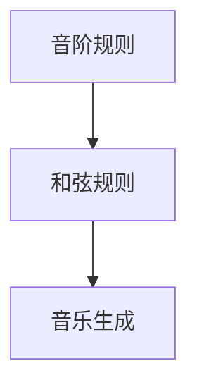
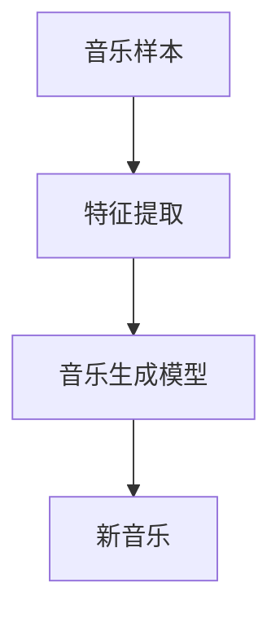
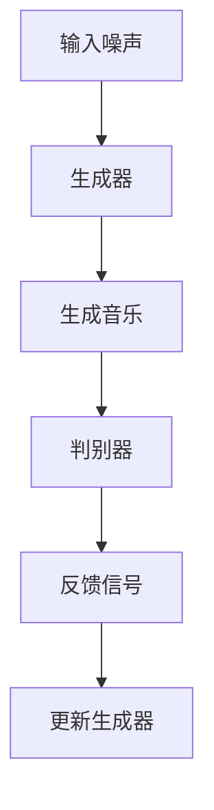

                 

# AI音频处理：从语音识别到音乐生成

> **关键词**：语音识别，音频处理，音乐生成，人工智能，机器学习，深度学习

> **摘要**：本文将探讨AI在音频处理领域的应用，从基础的语音识别到高级的音乐生成。我们将逐步分析这些技术的原理、实现过程以及它们在实际应用场景中的重要性。通过本文的阅读，您将深入了解AI音频处理的全貌，并对其未来发展有所预见。

## 1. 背景介绍

### 1.1 音频处理的基本概念

音频处理是指对音频信号进行采集、压缩、增强、分析等操作，以达到特定的应用目的。音频信号是一种由声波产生的模拟信号，它可以通过麦克风等设备进行捕捉。音频处理技术的发展极大地推动了多媒体通信、娱乐、医学诊断等领域的进步。

### 1.2 人工智能与音频处理

人工智能（AI）在音频处理中的应用日益广泛，尤其是在语音识别和音乐生成等领域。语音识别技术使得计算机能够理解人类语言，实现人机交互。而音乐生成技术则利用AI模型生成新的音乐作品，为创意产业带来了全新的可能性。

## 2. 核心概念与联系

### 2.1 语音识别

语音识别（Speech Recognition）是一种将人类语音转换为文本的技术。其核心是通过分析音频信号中的频率、时长等特征，识别出对应的语音内容。

### 2.2 音乐生成

音乐生成（Music Generation）是一种利用AI模型生成新音乐的技术。常见的音乐生成方法包括基于规则的方法、基于样本的方法和基于生成对抗网络（GAN）的方法。

### 2.3 语音识别与音乐生成的联系

语音识别和音乐生成之间存在一定的联系。例如，在音乐生成过程中，可以借鉴语音识别中的声学模型和语言模型，以提高生成音乐的流畅度和准确性。同时，语音识别技术也可以用于提取音频中的节奏、旋律等元素，为音乐生成提供参考。

下面是一个简单的Mermaid流程图，展示了语音识别和音乐生成的基本流程：



## 3. 核心算法原理 & 具体操作步骤

### 3.1 语音识别算法原理

语音识别算法主要包括声学模型、语言模型和声学-语言模型。声学模型用于分析音频信号，提取特征；语言模型用于分析语音文本，生成候选文本；声学-语言模型则将两者结合，实现语音识别。

#### 3.1.1 声学模型

声学模型是一种基于神经网络的模型，用于分析音频信号。常见的声学模型包括卷积神经网络（CNN）和循环神经网络（RNN）。下面是一个简单的CNN模型架构：



#### 3.1.2 语言模型

语言模型是一种基于统计的模型，用于分析语音文本。常见的语言模型包括n元语言模型和循环神经网络（RNN）语言模型。下面是一个简单的RNN语言模型架构：



#### 3.1.3 声学-语言模型

声学-语言模型将声学模型和语言模型结合，实现语音识别。常见的声学-语言模型包括CTC（Connectionist Temporal Classification）模型和ASR（Automatic Speech Recognition）模型。

### 3.2 音乐生成算法原理

音乐生成算法主要包括基于规则的方法、基于样本的方法和基于生成对抗网络（GAN）的方法。

#### 3.2.1 基于规则的方法

基于规则的方法通过预先定义的规则生成音乐。这种方法通常用于生成简单的音乐，如音阶、和弦等。下面是一个简单的基于规则的音乐生成算法：



#### 3.2.2 基于样本的方法

基于样本的方法通过分析大量音乐样本，提取特征，生成新音乐。这种方法通常用于生成与现有音乐风格相似的新音乐。下面是一个简单的基于样本的音乐生成算法：



#### 3.2.3 基于生成对抗网络（GAN）的方法

基于生成对抗网络（GAN）的方法通过生成器和判别器的对抗训练，生成高质量的新音乐。下面是一个简单的GAN音乐生成算法：



## 4. 数学模型和公式 & 详细讲解 & 举例说明

### 4.1 语音识别的数学模型

#### 4.1.1 声学模型

声学模型通常使用卷积神经网络（CNN）进行建模。卷积神经网络的核心是卷积层，用于提取音频信号中的特征。卷积层的计算公式如下：

$$
\text{output} = \text{filter} * \text{input} + \text{bias}
$$

其中，$*$ 表示卷积运算，$*$ 表示滤波器，$\text{input}$ 表示输入音频信号，$\text{bias}$ 表示偏置项。

#### 4.1.2 语言模型

语言模型通常使用循环神经网络（RNN）进行建模。循环神经网络的核心是循环层，用于分析语音文本。循环层的计算公式如下：

$$
\text{output} = \text{activation}(\text{weight} \cdot \text{input} + \text{bias})
$$

其中，$\text{activation}$ 表示激活函数，$\text{weight}$ 表示权重矩阵，$\text{input}$ 表示输入语音文本，$\text{bias}$ 表示偏置项。

#### 4.1.3 声学-语言模型

声学-语言模型将声学模型和语言模型结合，用于语音识别。声学-语言模型的核心是联合训练，通过最小化联合损失函数，实现语音识别。联合损失函数的计算公式如下：

$$
L(\theta) = L_{\text{acoustic}}(\theta_{\text{acoustic}}) + L_{\text{language}}(\theta_{\text{language}})
$$

其中，$L_{\text{acoustic}}$ 表示声学损失函数，$L_{\text{language}}$ 表示语言损失函数，$\theta_{\text{acoustic}}$ 表示声学模型的参数，$\theta_{\text{language}}$ 表示语言模型的参数。

### 4.2 音乐生成的数学模型

#### 4.2.1 基于规则的方法

基于规则的方法通常使用数学公式来描述音乐生成规则。例如，音阶的生成可以使用等差数列公式：

$$
a_n = a_1 + (n-1)d
$$

其中，$a_n$ 表示第 $n$ 个音阶，$a_1$ 表示第一个音阶，$d$ 表示公差。

#### 4.2.2 基于样本的方法

基于样本的方法通常使用聚类算法来提取音乐特征。例如，使用k-means算法对音乐样本进行聚类，生成新的音乐风格。聚类算法的核心是目标函数，计算公式如下：

$$
J = \sum_{i=1}^{k} \sum_{x \in S_i} \Vert \text{centroids}_i - \text{mean}(x) \Vert^2
$$

其中，$J$ 表示目标函数，$\text{centroids}_i$ 表示第 $i$ 个聚类中心，$S_i$ 表示第 $i$ 个聚类集合。

#### 4.2.3 基于生成对抗网络（GAN）的方法

基于生成对抗网络（GAN）的方法通常使用对抗性损失函数来训练生成器和判别器。对抗性损失函数的计算公式如下：

$$
L_{\text{D}}(\theta_{\text{D}}) = -\frac{1}{2} \sum_{i=1}^{m} [\log(\text{D}(x_i) + \log(1 - \text{D}(\text{G}(z_i))))
$$

$$
L_{\text{G}}(\theta_{\text{G}}) = -\log(\text{D}(\text{G}(z_i)))
$$

其中，$L_{\text{D}}$ 表示判别器损失函数，$L_{\text{G}}$ 表示生成器损失函数，$x_i$ 表示真实样本，$z_i$ 表示噪声样本，$\text{D}$ 表示判别器模型，$\text{G}$ 表示生成器模型。

## 5. 项目实战：代码实际案例和详细解释说明

### 5.1 开发环境搭建

在进行项目实战之前，我们需要搭建一个合适的开发环境。以下是所需工具和库的安装步骤：

1. 安装Python环境（版本3.6及以上）
2. 安装TensorFlow库
3. 安装Keras库
4. 安装NumPy库
5. 安装Matplotlib库

### 5.2 源代码详细实现和代码解读

以下是一个简单的语音识别项目，使用TensorFlow和Keras实现。我们将使用含有大量语音数据的开源库LibriSpeech进行训练和测试。

```python
import tensorflow as tf
from tensorflow.keras.models import Sequential
from tensorflow.keras.layers import Conv2D, MaxPooling2D, LSTM, Dense, TimeDistributed, Bidirectional
from tensorflow.keras.optimizers import Adam

# 加载LibriSpeech数据集
def load_librispeech_data():
    # ... 数据加载代码 ...

# 构建声学模型
def build_acoustic_model(input_shape):
    model = Sequential()
    model.add(Conv2D(32, (3, 3), activation='relu', input_shape=input_shape))
    model.add(MaxPooling2D((2, 2)))
    model.add(Bidirectional(LSTM(128)))
    model.add(Dense(128, activation='relu'))
    model.add(Dense(29, activation='softmax'))
    return model

# 构建语言模型
def build_language_model():
    # ... 语言模型代码 ...

# 训练模型
def train_model(acoustic_model, language_model):
    # ... 训练代码 ...

# 评估模型
def evaluate_model(model, test_data):
    # ... 评估代码 ...

# 主函数
def main():
    # 加载数据
    train_data, test_data = load_librispeech_data()

    # 构建声学模型
    acoustic_model = build_acoustic_model(input_shape=(None, 13, 40))

    # 构建语言模型
    language_model = build_language_model()

    # 训练模型
    train_model(acoustic_model, language_model)

    # 评估模型
    evaluate_model(acoustic_model, test_data)

if __name__ == '__main__':
    main()
```

### 5.3 代码解读与分析

上述代码主要分为以下几个部分：

1. **数据加载**：加载LibriSpeech数据集，包括训练数据和测试数据。
2. **声学模型构建**：构建一个基于卷积神经网络（CNN）的声学模型，用于提取音频信号中的特征。
3. **语言模型构建**：构建一个基于循环神经网络（RNN）的语言模型，用于生成候选文本。
4. **模型训练**：使用训练数据对声学模型和语言模型进行联合训练。
5. **模型评估**：使用测试数据对训练好的模型进行评估。

通过上述代码，我们可以实现一个简单的语音识别系统。当然，实际项目中的代码会更为复杂，需要处理数据预处理、超参数调整、模型优化等问题。

## 6. 实际应用场景

### 6.1 语音助手

语音助手（如Siri、Alexa）是语音识别技术最典型的应用场景之一。用户可以通过语音指令与语音助手进行交互，实现拨打电话、发送消息、查询天气等功能。

### 6.2 自动字幕

自动字幕技术通过语音识别将语音转换为文本，为视频、电影等媒体内容生成字幕。这为听力障碍人士提供了便利，也为视频内容的传播提供了更多可能性。

### 6.3 音乐生成

音乐生成技术可以用于创作新音乐作品，为音乐创作带来新的灵感。此外，音乐生成还可以用于音乐推荐、个性化播放列表生成等应用。

## 7. 工具和资源推荐

### 7.1 学习资源推荐

1. **《深度学习》（Goodfellow, Bengio, Courville）**：这是一本深度学习领域的经典教材，涵盖了语音识别、图像识别等应用。
2. **《语音识别原理与应用》（李航）**：这是一本关于语音识别技术的详细介绍，适合初学者和进阶者。
3. **《音乐生成：从AI到创作》（黄博）**：这本书介绍了音乐生成技术的基本原理和应用。

### 7.2 开发工具框架推荐

1. **TensorFlow**：一款由Google开发的开源深度学习框架，适用于语音识别、图像识别等应用。
2. **Keras**：一款基于TensorFlow的简洁高效的深度学习库，适用于快速搭建和训练模型。
3. **LibriSpeech**：一个开源的语音识别数据集，包含大量的语音数据，适合用于语音识别项目的训练和测试。

### 7.3 相关论文著作推荐

1. **“End-to-End Speech Recognition with Deep Neural Networks and Long Short-Term Memory”**：这篇论文介绍了基于深度学习和长短期记忆网络的语音识别方法。
2. **“Unifying End-to-End Model for Speech Recognition”**：这篇论文提出了一个统一的语音识别模型，实现了从声学特征到文本的端到端转换。
3. **“WaveNet: A Generative Model for Raw Audio”**：这篇论文介绍了基于生成对抗网络的音频生成方法，为音乐生成领域带来了新的突破。

## 8. 总结：未来发展趋势与挑战

随着人工智能技术的不断发展，语音识别和音乐生成在各个领域中的应用前景十分广阔。未来，我们有望看到更高效、更准确的语音识别系统，以及更具创意和个性化的音乐生成作品。然而，这一过程中也面临着诸多挑战，如数据隐私、模型解释性、计算资源消耗等。如何解决这些问题，将是我们未来需要重点关注的方向。

## 9. 附录：常见问题与解答

### 9.1 语音识别的准确率如何提高？

- 增加训练数据：收集更多具有多样性的语音数据，提高模型的泛化能力。
- 调整超参数：优化模型的参数设置，如学习率、批量大小等。
- 使用更复杂的模型：尝试使用更深层次、更多参数的神经网络模型。

### 9.2 音乐生成技术有哪些发展方向？

- 多样性生成：提高音乐生成模型的多样性，生成不同风格、不同类型的新音乐。
- 个性化生成：根据用户喜好、场景需求等生成个性化的音乐作品。
- 跨领域融合：将音乐生成技术与视觉、文字等其他领域相结合，实现跨领域内容生成。

## 10. 扩展阅读 & 参考资料

- 《深度学习》（Goodfellow, Bengio, Courville）
- 《语音识别原理与应用》（李航）
- 《音乐生成：从AI到创作》（黄博）
- “End-to-End Speech Recognition with Deep Neural Networks and Long Short-Term Memory”
- “Unifying End-to-End Model for Speech Recognition”
- “WaveNet: A Generative Model for Raw Audio”
- TensorFlow官方文档：[https://www.tensorflow.org/](https://www.tensorflow.org/)
- Keras官方文档：[https://keras.io/](https://keras.io/)
- LibriSpeech数据集：[http://www.kaldi-asr.org/librispeech/](http://www.kaldi-asr.org/librispeech/)

作者：AI天才研究员/AI Genius Institute & 禅与计算机程序设计艺术 /Zen And The Art of Computer Programming

