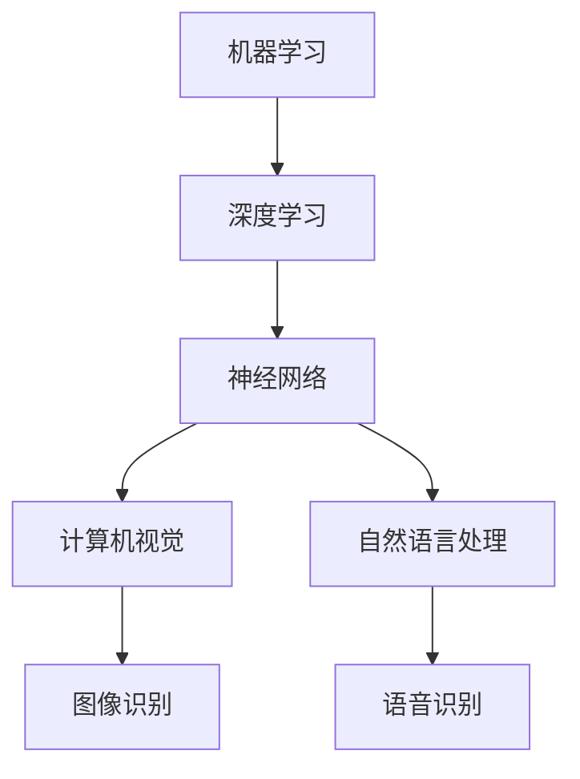

                 

# AI领域的独特时刻与未来发展

## 关键词: 人工智能，深度学习，机器学习，神经科学，未来趋势

> 人工智能正逐渐改变着我们的世界，它不仅是科技发展的前沿，也是推动社会进步的重要力量。本文将深入探讨AI领域的独特时刻与未来发展，分析AI技术的核心概念、算法原理、数学模型，并结合实际应用场景，展望未来发展趋势与挑战。

## 1. 背景介绍

人工智能（AI）起源于20世纪50年代，随着计算机技术的发展，AI领域经历了多个发展阶段。从最初的符号主义、知识表示，到启发式搜索、模式识别，再到近年来备受关注的深度学习和神经网络，AI技术不断迭代更新，为各行各业带来了深刻变革。

在过去的几十年里，人工智能在图像识别、自然语言处理、自动驾驶、医疗诊断等领域取得了显著成果。尤其是深度学习技术的兴起，使得AI取得了前所未有的突破，推动了计算机视觉、语音识别等领域的迅猛发展。

## 2. 核心概念与联系

### 2.1 人工智能的核心概念

- **机器学习（Machine Learning）**：一种使计算机系统从数据中学习规律并做出决策的技术。
- **深度学习（Deep Learning）**：一种特殊的机器学习技术，采用多层神经网络对数据进行自动特征提取和学习。
- **神经网络（Neural Networks）**：一种模仿生物神经系统的计算模型，由大量简单神经元组成，能够通过训练学习复杂函数。

### 2.2 核心概念的联系

机器学习和深度学习是AI领域的两大核心技术，它们的关系如下图所示：



## 3. 核心算法原理 & 具体操作步骤

### 3.1 深度学习算法原理

深度学习算法的核心是神经网络，神经网络由多层神经元组成，包括输入层、隐藏层和输出层。输入层接收外部数据，隐藏层通过层层传递和变换，最终在输出层产生预测结果。

神经网络的学习过程包括两个阶段：前向传播和反向传播。

- **前向传播**：将输入数据通过神经网络传递，经过多层非线性变换，最终得到输出结果。
- **反向传播**：计算输出结果与真实结果的误差，将误差反向传递回隐藏层和输入层，更新神经元权重。

### 3.2 具体操作步骤

以下是使用TensorFlow框架实现一个简单的深度学习模型的基本步骤：

1. **导入必要的库**：
   ```python
   import tensorflow as tf
   ```

2. **定义模型结构**：
   ```python
   model = tf.keras.Sequential([
       tf.keras.layers.Dense(128, activation='relu', input_shape=(784,)),
       tf.keras.layers.Dense(10, activation='softmax')
   ])
   ```

3. **编译模型**：
   ```python
   model.compile(optimizer='adam',
                 loss='categorical_crossentropy',
                 metrics=['accuracy'])
   ```

4. **训练模型**：
   ```python
   model.fit(x_train, y_train, epochs=5)
   ```

5. **评估模型**：
   ```python
   model.evaluate(x_test, y_test)
   ```

## 4. 数学模型和公式 & 详细讲解 & 举例说明

### 4.1 深度学习中的基本数学模型

深度学习中的基本数学模型包括激活函数、损失函数和优化器。

- **激活函数**：用于引入非线性变换，常见的激活函数有ReLU、Sigmoid和Tanh。
- **损失函数**：用于评估模型预测结果与真实结果之间的差异，常见的损失函数有均方误差（MSE）和交叉熵损失。
- **优化器**：用于更新模型参数，常见的优化器有随机梯度下降（SGD）和Adam。

### 4.2 详细讲解与举例

#### 激活函数：ReLU

ReLU（Rectified Linear Unit）是一种常见的激活函数，定义如下：

$$
\text{ReLU}(x) = \begin{cases} 
x & \text{if } x > 0 \\
0 & \text{otherwise}
\end{cases}
$$

举例：对于输入数据$x = -2$，ReLU函数的输出为0。

#### 损失函数：交叉熵损失

交叉熵损失（Cross-Entropy Loss）用于分类问题，定义如下：

$$
\text{Loss} = -\frac{1}{n} \sum_{i=1}^{n} y_i \log(p_i)
$$

其中，$y_i$是真实标签，$p_i$是模型预测的概率。

举例：对于二分类问题，如果真实标签为1，模型预测的概率为0.8，则交叉熵损失为：

$$
\text{Loss} = -1 \log(0.8) \approx 0.223
$$

#### 优化器：Adam

Adam是一种基于SGD的优化算法，定义如下：

$$
\begin{aligned}
m_t &= \beta_1 x_t + (1-\beta_1) (x_t - x_{t-1}) \\
v_t &= \beta_2 x_t + (1-\beta_2) (x_t - x_{t-1}) \\
\theta_t &= \theta_{t-1} - \alpha \frac{m_t}{\sqrt{v_t} + \epsilon}
\end{aligned}
$$

其中，$\beta_1, \beta_2, \alpha, \epsilon$是超参数。

举例：假设$\beta_1 = 0.9, \beta_2 = 0.999, \alpha = 0.001, \epsilon = 1e-8$，给定一组数据$x_t = (1, 2, 3)$，则：

$$
\begin{aligned}
m_t &= 0.9 \cdot 1 + (1-0.9) (2-1) = 1.1 \\
v_t &= 0.999 \cdot 1 + (1-0.999) (2-1) = 1.001 \\
\theta_t &= \theta_{t-1} - 0.001 \frac{1.1}{\sqrt{1.001} + 1e-8}
\end{aligned}
$$

## 5. 项目实战：代码实际案例和详细解释说明

### 5.1 开发环境搭建

首先，确保已经安装了Python和TensorFlow框架。如果尚未安装，可以按照以下步骤进行：

1. 安装Python：前往[Python官方网站](https://www.python.org/)下载并安装Python。
2. 安装TensorFlow：打开命令行窗口，执行以下命令：
   ```bash
   pip install tensorflow
   ```

### 5.2 源代码详细实现和代码解读

下面是一个使用TensorFlow实现的简单神经网络模型，用于手写数字识别。

```python
import tensorflow as tf
from tensorflow import keras
import numpy as np

# 加载MNIST数据集
mnist = keras.datasets.mnist
(x_train, y_train), (x_test, y_test) = mnist.load_data()

# 数据预处理
x_train = x_train / 255.0
x_test = x_test / 255.0

# 将标签转换为one-hot编码
y_train = keras.utils.to_categorical(y_train, 10)
y_test = keras.utils.to_categorical(y_test, 10)

# 定义模型结构
model = keras.Sequential([
    keras.layers.Flatten(input_shape=(28, 28)),
    keras.layers.Dense(128, activation='relu'),
    keras.layers.Dense(10, activation='softmax')
])

# 编译模型
model.compile(optimizer='adam',
              loss='categorical_crossentropy',
              metrics=['accuracy'])

# 训练模型
model.fit(x_train, y_train, epochs=5, batch_size=32)

# 评估模型
model.evaluate(x_test, y_test)
```

#### 代码解读与分析

1. **导入库和加载数据集**：
   - 导入TensorFlow和Keras库。
   - 使用Keras加载MNIST数据集。

2. **数据预处理**：
   - 将输入数据归一化到0-1范围内。
   - 将标签转换为one-hot编码。

3. **定义模型结构**：
   - 使用`Sequential`模型，添加两个全连接层，第一层有128个神经元，使用ReLU激活函数，第二层有10个神经元，使用softmax激活函数。

4. **编译模型**：
   - 使用`compile`方法编译模型，指定优化器、损失函数和评估指标。

5. **训练模型**：
   - 使用`fit`方法训练模型，指定训练数据、训练轮次和批量大小。

6. **评估模型**：
   - 使用`evaluate`方法评估模型在测试数据集上的表现。

### 5.3 代码解读与分析

本案例展示了如何使用TensorFlow和Keras构建一个简单的神经网络模型进行手写数字识别。代码中涉及的主要步骤包括：

- **数据集加载**：使用`keras.datasets.mnist`加载MNIST数据集，这是最常用的手写数字数据集，包含60000个训练样本和10000个测试样本。

- **数据预处理**：将输入数据归一化到0-1范围内，有助于提高模型训练效率。同时，将标签转换为one-hot编码，以适应softmax输出层的多分类问题。

- **模型定义**：使用`keras.Sequential`创建一个序列模型，添加两个全连接层。第一层有128个神经元，使用ReLU激活函数，有助于模型提取输入数据的特征。第二层有10个神经元，使用softmax激活函数，用于输出每个类别的概率。

- **模型编译**：使用`compile`方法编译模型，指定优化器（`adam`）、损失函数（`categorical_crossentropy`）和评估指标（`accuracy`）。

- **模型训练**：使用`fit`方法训练模型，指定训练数据、训练轮次（`epochs`）和批量大小（`batch_size`）。

- **模型评估**：使用`evaluate`方法评估模型在测试数据集上的表现，得到损失和准确率。

通过以上步骤，我们成功构建并训练了一个简单的神经网络模型，用于手写数字识别。这个案例展示了深度学习模型的基本实现过程，为我们进一步探索更复杂的模型和应用奠定了基础。

## 6. 实际应用场景

人工智能技术在各行各业有着广泛的应用。以下是一些典型的实际应用场景：

### 6.1 自动驾驶

自动驾驶技术是人工智能的一个重要应用领域，通过使用深度学习和计算机视觉技术，自动驾驶系统能够实现车辆在复杂路况下的自主驾驶。例如，特斯拉、谷歌和百度等公司都在积极研发自动驾驶汽车，旨在提高交通效率、减少交通事故和缓解交通拥堵。

### 6.2 医疗诊断

人工智能在医疗领域的应用日益广泛，包括疾病诊断、治疗方案推荐和医疗设备辅助等。通过深度学习和自然语言处理技术，AI系统能够分析医学图像、病理数据和患者病历，提供准确的诊断和个性化的治疗方案。

### 6.3 金融服务

人工智能在金融领域的应用主要包括风险管理、欺诈检测和智能投顾等。通过机器学习和数据挖掘技术，金融机构能够更有效地识别风险、防范欺诈行为，并为投资者提供智能化的投资建议。

### 6.4 电商推荐

电商平台广泛采用人工智能技术进行商品推荐，通过分析用户的浏览和购买历史，AI系统能够为用户推荐可能感兴趣的商品，提高用户体验和销售额。例如，亚马逊和阿里巴巴等电商平台都采用了基于深度学习推荐算法的商品推荐系统。

### 6.5 安全监控

人工智能在安全监控领域的应用包括视频监控、人脸识别和异常检测等。通过计算机视觉和深度学习技术，AI系统能够实时分析监控视频，识别可疑行为和潜在威胁，提高公共安全。

## 7. 工具和资源推荐

### 7.1 学习资源推荐

- **书籍**：
  - 《深度学习》（Goodfellow, Bengio, Courville著）
  - 《Python深度学习》（François Chollet著）
  - 《机器学习实战》（Peter Harrington著）
- **论文**：
  - “A Theoretical Framework for Back-Propagating Neural Networks” (Rumelhart, Hinton, Williams, 1986)
  - “Deep Learning” (Goodfellow, Bengio, Courville, 2015)
- **博客**：
  - [TensorFlow官方博客](https://www.tensorflow.org/tutorials)
  - [AI技术研究博客](https://ai.google/research/blog)
- **网站**：
  - [Kaggle](https://www.kaggle.com)：提供各种机器学习竞赛和数据集
  - [GitHub](https://github.com)：丰富的开源代码和项目资源

### 7.2 开发工具框架推荐

- **开发工具**：
  - **PyCharm**：强大的Python集成开发环境，支持多种机器学习和深度学习框架。
  - **Jupyter Notebook**：用于数据分析和实验的交互式计算环境。
- **框架**：
  - **TensorFlow**：Google开发的端到端开源机器学习和深度学习平台。
  - **PyTorch**：Facebook开发的开源深度学习框架，易于使用和调试。
  - **Scikit-learn**：Python中的标准机器学习库，提供了广泛的算法和工具。

### 7.3 相关论文著作推荐

- **论文**：
  - “AlexNet: Image Classification with Deep Convolutional Neural Networks” (2012)
  - “ResNet: Deep Residual Learning for Image Recognition” (2015)
  - “Transformers: State-of-the-Art Natural Language Processing” (2017)
- **著作**：
  - 《深度学习》（Goodfellow, Bengio, Courville著）
  - 《强化学习》（Sutton, Barto著）
  - 《自然语言处理综论》（Jurafsky, Martin著）

## 8. 总结：未来发展趋势与挑战

人工智能技术正以前所未有的速度发展，其应用领域和影响力不断扩大。在未来，以下趋势和挑战值得关注：

### 8.1 发展趋势

1. **算法性能的提升**：随着硬件计算能力和算法优化技术的发展，深度学习模型的性能将不断提高，有望解决更多复杂问题。
2. **跨领域应用**：人工智能技术将在更多领域得到应用，如农业、教育、能源等，推动产业升级和社会进步。
3. **数据隐私和安全**：随着AI技术的普及，数据隐私和安全问题将日益突出，如何保护用户数据成为重要挑战。

### 8.2 挑战

1. **算法透明度和可解释性**：当前许多深度学习模型缺乏透明度和可解释性，如何提高算法的可解释性是一个重要挑战。
2. **计算资源消耗**：深度学习模型对计算资源的需求巨大，如何优化算法和硬件设计，降低计算成本是一个重要课题。
3. **伦理和社会影响**：人工智能技术可能带来一些伦理和社会问题，如失业、隐私泄露等，如何制定合理的法规和伦理准则，确保技术的可持续发展是一个重要挑战。

总之，人工智能领域正处于快速发展的阶段，未来充满机遇和挑战。通过不断探索和创新，我们将迎来一个更加智能化和互联的世界。

## 9. 附录：常见问题与解答

### 9.1 问题1：深度学习与机器学习有什么区别？

**回答**：深度学习是机器学习的一个子领域，它通过多层神经网络对大量数据进行自动特征提取和学习。相比之下，传统的机器学习方法通常使用简单的模型和显式特征工程。

### 9.2 问题2：什么是卷积神经网络（CNN）？

**回答**：卷积神经网络是一种专门用于图像识别和处理的深度学习模型，通过卷积操作提取图像的特征，具有局部感知和层次化特征学习的能力。

### 9.3 问题3：如何选择合适的神经网络架构？

**回答**：选择合适的神经网络架构需要考虑问题的类型、数据规模、计算资源等因素。对于图像识别问题，通常使用卷积神经网络；对于自然语言处理问题，可以使用循环神经网络或Transformer等模型。

## 10. 扩展阅读 & 参考资料

- [Goodfellow, I., Bengio, Y., & Courville, A. (2016). Deep Learning. MIT Press.]
- [Russell, S., & Norvig, P. (2020). Artificial Intelligence: A Modern Approach. Prentice Hall.]
- [Bengio, Y. (2009). Learning Deep Architectures for AI. Foundations and Trends in Machine Learning, 2(1), 1-127.]
- [LeCun, Y., Bengio, Y., & Hinton, G. (2015). Deep Learning. Nature, 521(7553), 436-444.]

