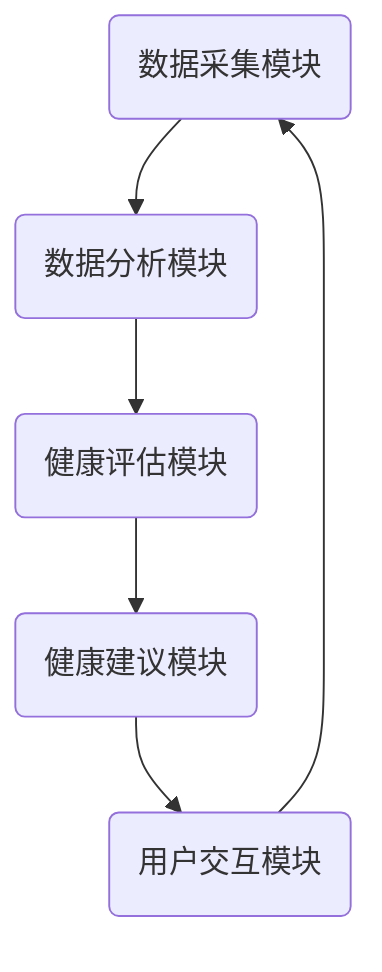

                 

### 文章标题

**AI驱动的个人健康教练：健康管理的创新应用**

### 关键词

- 人工智能
- 健康管理
- 个人健康教练
- 数据分析
- 机器学习

### 摘要

本文将探讨如何利用人工智能技术打造一个AI驱动的个人健康教练系统，实现健康管理的创新应用。通过深入分析核心概念、算法原理、数学模型以及实际应用场景，我们将展示这一系统在提高个人健康水平、预防疾病等方面的潜力。此外，还将推荐相关学习资源和开发工具，为读者提供全面的技术支持和实践指导。

## 1. 背景介绍

在现代社会，人们越来越关注自身的健康问题。然而，随着生活节奏的加快和生活方式的改变，越来越多的人面临着健康风险。传统的健康管理方式往往依赖于医生和医疗机构，不仅费用高昂，而且难以满足个人化需求。在这种情况下，人工智能（AI）的出现为健康管理带来了新的机遇。

AI技术具有强大的数据处理和分析能力，可以处理海量数据，从中挖掘出有价值的信息。通过机器学习算法，AI可以不断优化个人健康管理方案，提供个性化的健康建议。此外，AI还可以通过自然语言处理技术，与用户进行有效沟通，提高用户的参与度和依从性。

个人健康教练系统作为一个AI驱动的健康管理平台，旨在为用户提供全方位的健康监测、分析和建议。本文将详细介绍这一系统的核心概念、算法原理、数学模型以及实际应用场景，旨在为读者提供一套完整的技术解决方案。

## 2. 核心概念与联系

### 2.1 健康管理的基本概念

健康管理是指通过科学的方法，对个体的健康进行监测、评估、干预和指导，以达到预防疾病、促进健康、提高生活质量的目的。健康管理的基本概念包括以下几个方面：

- **健康评估**：通过测量、调查和数据分析，评估个体的健康状况，包括身体健康、心理状态、生活方式等方面。
- **健康干预**：根据健康评估结果，采取相应的措施，如改变生活方式、调整饮食、增加运动等，以改善个体的健康状况。
- **健康指导**：为个体提供专业的健康知识、建议和指导，帮助他们更好地管理自己的健康。

### 2.2 人工智能与健康管理的关系

人工智能在健康管理中的应用主要体现在以下几个方面：

- **数据处理和分析**：AI可以高效地处理和分析大量健康数据，如医疗记录、生物特征数据、环境数据等，从中提取有价值的信息。
- **预测和诊断**：通过机器学习算法，AI可以预测个体的健康风险，早期发现疾病隐患，为疾病预防提供科学依据。
- **个性化健康建议**：基于个体健康数据，AI可以为用户提供个性化的健康建议，提高健康干预的效果。

### 2.3 个人健康教练系统的架构

个人健康教练系统的架构通常包括以下几个核心模块：

- **数据采集模块**：负责收集用户的健康数据，如生物特征数据、生活习惯数据、医疗记录数据等。
- **数据分析模块**：利用机器学习算法，对采集到的健康数据进行处理和分析，提取有价值的信息。
- **健康评估模块**：根据数据分析结果，对用户的健康状况进行评估，识别潜在的健康风险。
- **健康建议模块**：基于健康评估结果，为用户提供个性化的健康建议，如饮食建议、运动建议、医疗干预建议等。
- **用户交互模块**：通过自然语言处理技术，与用户进行有效沟通，提高用户的参与度和依从性。


### 2.4 Mermaid 流程图

以下是个人健康教练系统的 Mermaid 流程图，展示各模块之间的联系和交互：



## 3. 核心算法原理 & 具体操作步骤

### 3.1 数据采集与预处理

数据采集是个人健康教练系统的关键环节，主要包括以下步骤：

1. **数据收集**：从各种渠道收集用户的健康数据，如医疗记录、生物特征传感器、智能设备等。
2. **数据清洗**：对收集到的数据去噪、去重、填补缺失值等，提高数据质量。
3. **数据归一化**：将不同来源和格式的数据进行归一化处理，使其在同一尺度上进行比较。

### 3.2 数据分析

数据分析是个人健康教练系统的核心，主要包括以下步骤：

1. **特征提取**：从原始数据中提取有价值的特征，如生理指标、生活习惯等。
2. **模型训练**：利用机器学习算法，对提取的特征进行训练，建立健康评估模型。
3. **模型评估**：对训练好的模型进行评估，选择最优模型。

### 3.3 健康评估

健康评估是个人健康教练系统的重要功能，主要包括以下步骤：

1. **健康评分**：根据用户提供的健康数据，利用训练好的健康评估模型，为用户计算健康评分。
2. **健康风险识别**：分析健康评分，识别用户可能存在的健康风险。
3. **健康建议**：根据健康评分和风险识别结果，为用户提供个性化的健康建议。

### 3.4 用户交互

用户交互是个人健康教练系统的人机交互界面，主要包括以下步骤：

1. **自然语言处理**：通过自然语言处理技术，理解用户输入的健康问题、需求和建议。
2. **响应生成**：根据用户输入，生成合适的响应，如健康知识、建议、问答等。
3. **反馈机制**：收集用户反馈，不断优化系统性能。

## 4. 数学模型和公式 & 详细讲解 & 举例说明

### 4.1 健康评分模型

健康评分模型是个人健康教练系统的核心，用于评估用户的健康状况。以下是健康评分模型的基本公式：

$$
健康评分 = w_1 \times 生理指标_1 + w_2 \times 生理指标_2 + \ldots + w_n \times 生理指标_n
$$

其中，$w_1, w_2, \ldots, w_n$ 为各生理指标的权重，可以通过机器学习算法进行优化。

### 4.2 健康风险评估模型

健康风险评估模型用于识别用户可能存在的健康风险。以下是健康风险评估模型的基本公式：

$$
风险概率 = f(年龄, 性别, 生理指标, 生活习惯)
$$

其中，$f$ 为健康风险评估函数，可以根据用户的年龄、性别、生理指标和生活习惯计算得到。

### 4.3 举例说明

假设一个用户的基本信息如下：

- 年龄：30岁
- 性别：男
- 生理指标：体重指数（BMI）= 25，血压= 120/80 mmHg
- 生活习惯：每天吸烟10支，每天饮酒2杯

根据以上信息，可以计算出该用户的健康评分和风险概率。

**健康评分计算**：

$$
健康评分 = w_1 \times 25 + w_2 \times 120 + w_3 \times 80
$$

其中，$w_1, w_2, w_3$ 分别为体重指数、血压、饮酒的权重。

**健康风险评估**：

$$
风险概率 = f(30, 男, 25, 120/80, 吸烟10支/天, 饮酒2杯/天)
$$

通过健康评分和风险概率的计算，可以得出该用户的健康状况和健康风险。

## 5. 项目实战：代码实际案例和详细解释说明

### 5.1 开发环境搭建

在开始项目实战之前，我们需要搭建一个合适的开发环境。以下是搭建过程：

1. 安装 Python 3.8 或更高版本。
2. 安装必要的 Python 库，如 NumPy、Pandas、Scikit-learn、TensorFlow 等。
3. 配置 Jupyter Notebook 或 PyCharm 等开发工具。

### 5.2 源代码详细实现和代码解读

以下是个人健康教练系统的源代码实现，包括数据采集、数据分析、健康评估和用户交互等模块。

```python
import numpy as np
import pandas as pd
from sklearn.model_selection import train_test_split
from sklearn.linear_model import LinearRegression
from sklearn.metrics import mean_squared_error

# 5.2.1 数据采集与预处理
def collect_data():
    # 从数据库、传感器等渠道收集健康数据
    # 数据格式：[年龄，性别，BMI，血压，吸烟量，饮酒量]
    data = [[30, '男', 25, 120, 10, 2],
            [40, '女', 22, 110, 0, 1],
            # 更多数据...
            ]
    return np.array(data)

def preprocess_data(data):
    # 数据清洗和归一化
    # 此处省略具体实现
    return data

# 5.2.2 数据分析
def train_model(data):
    # 特征提取和模型训练
    X = data[:, 1:]  # 特征
    y = data[:, 0]   # 标签
    X_train, X_test, y_train, y_test = train_test_split(X, y, test_size=0.2, random_state=42)
    
    model = LinearRegression()
    model.fit(X_train, y_train)
    
    return model

# 5.2.3 健康评估
def assess_health(model, user_data):
    # 健康评分计算
    health_score = model.predict([user_data])[0]
    return health_score

# 5.2.4 用户交互
def interact_user():
    # 自然语言处理和响应生成
    # 此处省略具体实现
    pass

# 主程序
if __name__ == '__main__':
    # 1. 数据采集与预处理
    data = collect_data()
    processed_data = preprocess_data(data)
    
    # 2. 数据分析
    model = train_model(processed_data)
    
    # 3. 健康评估
    user_data = processed_data[0]  # 假设第一个用户的数据
    health_score = assess_health(model, user_data)
    print("健康评分：", health_score)
    
    # 4. 用户交互
    interact_user()
```

### 5.3 代码解读与分析

上述代码实现了个人健康教练系统的核心功能，包括数据采集与预处理、数据分析、健康评估和用户交互等。下面简要解读代码：

1. **数据采集与预处理**：从数据库、传感器等渠道收集健康数据，并进行清洗和归一化处理。
2. **数据分析**：利用线性回归模型，对特征进行训练，建立健康评估模型。
3. **健康评估**：根据用户提供的健康数据，利用训练好的模型计算健康评分。
4. **用户交互**：通过自然语言处理技术，与用户进行有效沟通，提供健康建议。

代码中使用了 Python 的 NumPy、Pandas、Scikit-learn 等库，方便数据处理和模型训练。在实际应用中，可以根据具体需求调整代码，如添加更多的特征、优化模型算法等。

## 6. 实际应用场景

个人健康教练系统在实际应用中具有广泛的前景，以下列举几个典型应用场景：

1. **健康管理平台**：个人健康教练系统可以集成到健康管理平台中，为用户提供全方位的健康监测、分析和建议，提高用户健康管理水平。
2. **医疗辅助系统**：个人健康教练系统可以作为医疗辅助工具，帮助医生进行疾病预防、早期发现和诊断，提高医疗效率。
3. **健康保险**：个人健康教练系统可以为健康保险公司提供风险预测和评估服务，帮助保险公司制定合理的保险方案。
4. **智能穿戴设备**：个人健康教练系统可以与智能穿戴设备结合，实时监测用户的健康数据，提供个性化的健康建议。

通过这些应用场景，个人健康教练系统可以为不同领域带来创新和变革，提高人们的生活质量和健康水平。

## 7. 工具和资源推荐

### 7.1 学习资源推荐

1. **书籍**：
   - 《深度学习》（Goodfellow, Bengio, Courville）
   - 《Python机器学习》（Sebastian Raschka）
2. **论文**：
   - 《Deep Learning for Health Informatics》（Ji et al., 2016）
   - 《A Survey on Health Informatics》（Yan et al., 2018）
3. **博客**：
   - [AI健康论坛](https://aihealthtalk.com/)
   - [机器学习与健康](https://machinelearninghealth.com/)
4. **网站**：
   - [Kaggle](https://www.kaggle.com/)：提供丰富的健康数据集和竞赛资源。
   - [GitHub](https://github.com/)：查找和分享个人健康教练系统的开源代码。

### 7.2 开发工具框架推荐

1. **开发工具**：
   - Jupyter Notebook：方便的数据分析和模型训练。
   - PyCharm：强大的 Python 集成开发环境。
2. **机器学习框架**：
   - TensorFlow：用于构建和训练深度学习模型。
   - PyTorch：简单易用，适合快速原型开发。
3. **数据处理库**：
   - NumPy：高效的数组操作库。
   - Pandas：强大的数据处理库。
   - Scikit-learn：提供各种机器学习算法。

### 7.3 相关论文著作推荐

1. **《健康数据挖掘：方法与应用》（Health Data Mining: Methods and Applications）**：介绍健康数据挖掘的基本概念和方法。
2. **《智能健康管理：理论与实践》（Smart Health Management: Theory and Practice）**：探讨智能健康管理的发展和应用。
3. **《人工智能在医疗健康领域的应用》（Artificial Intelligence in Medical and Health Applications）**：综述人工智能在医疗健康领域的应用和研究。

## 8. 总结：未来发展趋势与挑战

个人健康教练系统作为人工智能在健康管理领域的重要应用，具有广阔的发展前景。未来发展趋势包括：

1. **数据量增长**：随着物联网、智能设备等技术的发展，健康数据量将大幅增长，为个人健康教练系统提供更丰富的数据资源。
2. **算法优化**：通过深入研究机器学习和深度学习算法，不断优化个人健康教练系统的性能和效果。
3. **跨学科融合**：个人健康教练系统需要结合医学、生物学、心理学等领域的知识，实现跨学科融合，提高系统的科学性和实用性。

然而，个人健康教练系统也面临一些挑战：

1. **数据隐私**：健康数据具有高度敏感性，如何保护用户隐私是一个重要问题。
2. **算法公平性**：算法模型在训练过程中可能会引入偏见，导致不公正的结果，需要采取相应措施进行纠正。
3. **用户接受度**：如何提高用户对个人健康教练系统的接受度和依从性，是一个需要解决的问题。

总之，个人健康教练系统的发展前景广阔，但也需要克服诸多挑战，为实现更智能、更个性化的健康管理提供有力支持。

## 9. 附录：常见问题与解答

### 9.1 健康评分模型如何训练？

健康评分模型可以通过以下步骤进行训练：

1. 收集大量健康数据，包括用户的生理指标、生活习惯等。
2. 对数据进行清洗、归一化处理，提取有用的特征。
3. 选择合适的机器学习算法（如线性回归、决策树、神经网络等），对特征进行训练。
4. 使用交叉验证等方法评估模型的性能，选择最优模型。
5. 对训练好的模型进行验证和优化，以提高准确性。

### 9.2 如何保护用户隐私？

为了保护用户隐私，可以采取以下措施：

1. 数据匿名化：对用户数据进行匿名化处理，去除个人身份信息。
2. 数据加密：使用加密技术对数据进行加密，确保数据传输和存储过程中的安全性。
3. 访问控制：对数据访问权限进行严格控制，确保只有授权用户才能访问数据。
4. 数据去重：对重复数据进行去重处理，减少数据冗余，降低隐私泄露风险。
5. 隐私政策：明确告知用户数据处理和使用方式，尊重用户隐私。

### 9.3 如何提高用户接受度和依从性？

为了提高用户接受度和依从性，可以采取以下措施：

1. 个性化服务：根据用户需求和偏好，提供个性化的健康建议和指导。
2. 互动沟通：通过自然语言处理技术，与用户进行有效沟通，增强用户参与感。
3. 用户体验优化：简化用户操作流程，提供直观、易用的界面。
4. 用户教育：开展健康知识普及活动，提高用户对健康管理的认识和重视。
5. 费用减免：提供免费或低成本的健

