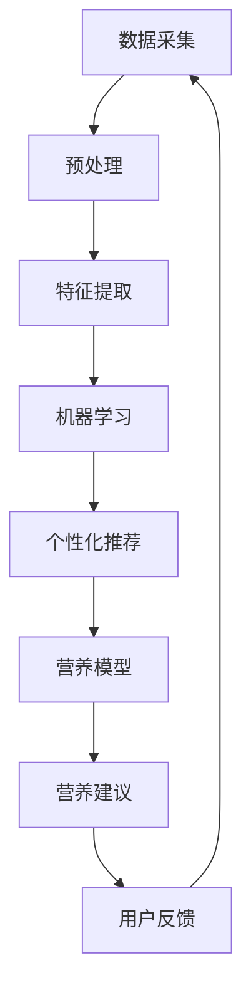

                 

### 背景介绍

近年来，随着人工智能（AI）技术的迅猛发展，各行各业都在积极探索如何将AI应用于实际场景，以提升效率和决策准确性。在健康与营养领域，AI的应用同样引起了广泛关注。通过利用大数据、机器学习和深度学习技术，AI能够为个人提供定制化的营养建议，从而改善生活质量，预防慢性疾病。本文将探讨AI驱动的个人营养师这一新兴创业机会，分析其市场潜力、技术实现方法以及未来的发展趋势。

当前，全球健康营养市场正在经历巨大的变革。一方面，人口老龄化加剧，慢性疾病发病率上升，消费者对健康营养的关注度持续提高。另一方面，科技的发展使得获取、分析和利用个人健康数据变得更加容易。这些因素共同促使个人营养师市场迅速扩张。据统计，全球健康营养市场预计将在未来几年内以两位数的年增长率迅速增长。

在这样一个充满机遇的市场中，AI驱动的个人营养师通过整合大数据、生物信息学和机器学习技术，为消费者提供精准的营养建议，具有显著的优势。首先，AI能够快速分析大量的个人健康数据，如饮食习惯、生物标志物、生活方式等，从而为用户量身定制个性化的营养方案。其次，AI系统可以不断学习和优化，通过实时收集用户反馈和新的数据，提高营养建议的准确性和有效性。

本文将围绕以下内容展开：

1. **核心概念与联系**：介绍AI驱动的个人营养师的核心概念及其相互关系。
2. **核心算法原理 & 具体操作步骤**：详细讲解AI在个人营养师中的应用算法原理和操作步骤。
3. **数学模型和公式 & 详细讲解 & 举例说明**：阐述支持AI驱动的个人营养师模型的数学原理和具体应用。
4. **项目实战：代码实际案例和详细解释说明**：提供实际项目代码，并对其进行详细解读和分析。
5. **实际应用场景**：分析AI驱动的个人营养师在不同场景中的实际应用。
6. **工具和资源推荐**：推荐相关的学习资源、开发工具和框架。
7. **总结：未来发展趋势与挑战**：探讨AI驱动的个人营养师的发展趋势和面临的挑战。
8. **附录：常见问题与解答**：回答读者可能关心的问题。
9. **扩展阅读 & 参考资料**：提供更多的阅读资源和参考。

通过这篇文章，我们将深入探讨AI驱动的个人营养师这一创业机会，分析其技术实现路径和市场前景，希望为相关领域的研究者、创业者和从业者提供有价值的参考。

### 核心概念与联系

要深入理解AI驱动的个人营养师，我们首先需要明确几个核心概念，并探讨它们之间的相互关系。这些核心概念包括数据采集、机器学习、个性化推荐系统和健康营养模型。

**数据采集**：数据是AI驱动的个人营养师的基础。通过多种传感器设备、健康应用和个人记录，可以收集用户的健康数据、饮食习惯、生活方式等信息。这些数据包括但不限于：体重、血压、心率、血糖水平、每日摄入的营养素、运动习惯等。数据的质量和完整性直接影响到营养建议的准确性和有效性。

**机器学习**：机器学习是实现AI驱动营养师的关键技术。通过训练机器学习模型，可以从海量数据中提取有用的模式和规律。常见的机器学习算法包括监督学习、无监督学习和强化学习。监督学习通常用于分类和回归任务，例如预测用户的营养需求；无监督学习则用于数据聚类和降维，帮助发现隐藏的数据结构；强化学习可以在复杂的决策环境中学习最佳策略，例如推荐营养餐单。

**个性化推荐系统**：个性化推荐系统是机器学习在营养领域的具体应用。通过分析用户的个性化数据，推荐系统可以提供个性化的营养建议。推荐算法可以分为基于内容的推荐、协同过滤推荐和混合推荐。基于内容的推荐通过分析用户的历史记录和偏好，推荐相似的营养信息；协同过滤推荐通过分析用户群体之间的相似度，推荐其他用户喜欢的营养信息；混合推荐结合多种算法的优点，提供更加精准和多样化的推荐。

**健康营养模型**：健康营养模型是AI驱动的个人营养师的核心。这些模型通过结合生物医学知识、营养学理论和机器学习算法，为用户生成个性化的营养方案。健康营养模型可以分为静态模型和动态模型。静态模型通常基于预设的参数和规则，例如根据用户的体重和活动量推荐每日所需的热量和营养素；动态模型则可以实时调整营养建议，根据用户实时数据的变化，提供个性化的调整。

**Mermaid流程图**：


**数据采集**：数据采集环节利用传感器设备（如智能手表、健康监测设备等）和个人记录（如手机健康应用、饮食记录等）收集用户的健康数据。

**预处理**：预处理环节对原始数据进行清洗、标准化和转换，以确保数据的质量和一致性。

**特征提取**：特征提取环节从预处理后的数据中提取有用的特征，用于训练机器学习模型。

**机器学习**：机器学习环节使用监督学习、无监督学习和强化学习算法对特征进行训练和预测。

**个性化推荐**：个性化推荐环节利用机器学习模型生成个性化的营养建议。

**营养模型**：营养模型环节结合生物医学知识和营养学理论，为用户生成营养方案。

**营养建议**：营养建议环节将生成的营养方案呈现给用户。

**用户反馈**：用户反馈环节收集用户对营养建议的反馈，用于优化和改进系统。

**相互关系**：数据采集为后续环节提供数据支持，预处理和特征提取为机器学习提供高质量的特征，机器学习和个性化推荐系统共同驱动营养模型生成营养建议，用户反馈则不断优化系统，形成一个闭环。

通过以上核心概念的介绍和相互关系的解释，我们可以更好地理解AI驱动的个人营养师的工作原理和实现路径。在接下来的部分，我们将深入探讨AI驱动的个人营养师中的核心算法原理和具体操作步骤。

### 核心算法原理 & 具体操作步骤

在AI驱动的个人营养师中，核心算法原理是实现个性化营养建议的关键。以下我们将详细解释这些算法，包括其基本原理和具体操作步骤。

#### 1. 机器学习算法

**监督学习**：监督学习是机器学习中最常用的算法之一。它通过已标记的训练数据来学习特征与标签之间的关系，从而对未知数据进行预测。在个人营养师中，监督学习算法可以用来预测用户的营养需求。

- **基本原理**：监督学习算法包括回归和分类两种。回归任务旨在预测连续值输出，如每日所需的热量和营养素；分类任务则旨在将数据分为不同的类别，如食物类型或营养建议类别。

- **具体操作步骤**：

  1. **数据收集**：收集用户的健康数据、饮食习惯和营养需求等信息。
  2. **数据预处理**：清洗和标准化数据，去除噪声和异常值。
  3. **特征提取**：从预处理后的数据中提取有用的特征，如营养素的摄入量、活动强度、体重等。
  4. **模型训练**：选择合适的回归或分类算法（如线性回归、决策树、随机森林、支持向量机等），使用训练数据训练模型。
  5. **模型评估**：使用测试数据评估模型的性能，调整模型参数以提高准确性。
  6. **模型部署**：将训练好的模型部署到实际应用中，用于预测用户的营养需求。

**无监督学习**：无监督学习用于处理未标记的数据，旨在发现数据中的内在结构和模式。在个人营养师中，无监督学习可以用来分析用户的饮食习惯，识别潜在的营养风险。

- **基本原理**：常见的无监督学习算法包括聚类（如K均值聚类、层次聚类等）和降维（如主成分分析、线性判别分析等）。

- **具体操作步骤**：

  1. **数据收集**：收集用户的饮食习惯和营养数据。
  2. **数据预处理**：清洗和标准化数据。
  3. **聚类分析**：使用聚类算法（如K均值聚类）将用户划分为不同的群体，每个群体具有相似的营养饮食习惯。
  4. **降维**：使用降维算法（如主成分分析）减少数据维度，提高数据处理效率。
  5. **模型评估**：评估聚类和降维效果，根据评估结果调整算法参数。

**强化学习**：强化学习通过不断尝试和反馈来学习最佳策略。在个人营养师中，强化学习可以用来推荐最佳的营养餐单。

- **基本原理**：强化学习包括四个主要部分：环境（如用户的饮食习惯和健康状态）、动作（如营养餐单的选择）、状态转移函数（描述动作导致的状态变化）和奖励函数（评估动作的效果）。

- **具体操作步骤**：

  1. **环境设定**：定义营养师的环境，包括用户的饮食习惯和健康状态。
  2. **动作空间**：定义营养师可以选择的动作，如推荐不同类型的营养餐单。
  3. **状态空间**：定义营养师可以处于的状态，如营养摄入量、血糖水平等。
  4. **奖励函数**：设计奖励函数，根据营养餐单的效果（如血糖控制情况）给予奖励。
  5. **策略学习**：使用强化学习算法（如Q学习、深度Q网络等）训练营养师策略。
  6. **策略部署**：将训练好的策略部署到实际应用中，用于推荐最佳的营养餐单。

#### 2. 个性化推荐算法

**基于内容的推荐**：基于内容的推荐通过分析用户的历史记录和偏好，推荐相似的营养信息。

- **基本原理**：基于内容的推荐算法通常使用特征向量表示用户和物品，计算用户和物品之间的相似度，推荐与用户偏好相似的物品。

- **具体操作步骤**：

  1. **数据收集**：收集用户的饮食习惯和营养偏好数据。
  2. **特征提取**：提取用户和营养信息的特征向量。
  3. **相似度计算**：计算用户和营养信息之间的相似度。
  4. **推荐生成**：根据相似度计算结果，生成个性化营养推荐。

**协同过滤推荐**：协同过滤推荐通过分析用户群体之间的相似度，推荐其他用户喜欢的营养信息。

- **基本原理**：协同过滤推荐算法包括用户基于的协同过滤和物品基于的协同过滤。用户基于的协同过滤通过分析用户之间的相似度，推荐其他用户喜欢的营养信息；物品基于的协同过滤通过分析物品之间的相似度，推荐用户可能喜欢的营养信息。

- **具体操作步骤**：

  1. **数据收集**：收集用户的饮食习惯和营养偏好数据。
  2. **用户相似度计算**：计算用户之间的相似度。
  3. **物品相似度计算**：计算营养信息之间的相似度。
  4. **推荐生成**：根据用户和物品的相似度，生成个性化营养推荐。

**混合推荐**：混合推荐结合多种算法的优点，提供更加精准和多样化的推荐。

- **基本原理**：混合推荐算法将基于内容的推荐、协同过滤推荐和其他推荐算法（如基于规则的推荐）相结合，生成更加个性化的营养推荐。

- **具体操作步骤**：

  1. **数据收集**：收集用户的饮食习惯和营养偏好数据。
  2. **特征提取**：提取用户和营养信息的特征向量。
  3. **相似度计算**：计算用户和营养信息之间的相似度，以及营养信息之间的相似度。
  4. **推荐生成**：根据不同推荐算法的推荐结果，生成最终的个性化营养推荐。

通过以上核心算法的详细解释和操作步骤，我们可以更好地理解AI驱动的个人营养师的技术实现路径。在接下来的部分，我们将探讨支持AI驱动的个人营养师模型的数学模型和公式。

### 数学模型和公式 & 详细讲解 & 举例说明

在AI驱动的个人营养师中，数学模型和公式是构建和优化个性化营养建议的核心。以下我们将详细讲解支持这些模型的数学原理，并通过具体例子进行说明。

#### 1. 监督学习模型

**线性回归模型**：

- **基本公式**：线性回归模型用于预测连续值输出，其公式为：
  \[ y = \beta_0 + \beta_1 \cdot x \]

  其中，\( y \) 是预测值，\( x \) 是输入特征，\( \beta_0 \) 和 \( \beta_1 \) 是模型的参数。

- **具体例子**：假设我们想要预测一个人的每日热量摄入（\( y \)），输入特征为体重（\( x \)）和活动水平（\( x' \)）。则线性回归模型可以表示为：
  \[ y = \beta_0 + \beta_1 \cdot x + \beta_2 \cdot x' \]

  通过训练数据，我们可以使用最小二乘法求解 \( \beta_0 \)、\( \beta_1 \) 和 \( \beta_2 \) 的值，从而预测新用户的热量摄入。

**支持向量机（SVM）模型**：

- **基本公式**：SVM是一种分类模型，其目标是找到一个最佳的超平面，将不同类别的数据点最大化地分开。其公式为：
  \[ w \cdot x - b = 0 \]

  其中，\( w \) 是超平面的法向量，\( x \) 是数据点，\( b \) 是偏置项。

- **具体例子**：假设我们要分类食物类型（如水果和蔬菜），输入特征为食物的维生素含量（\( x \)）和糖分含量（\( x' \)）。我们可以通过训练SVM模型找到最佳的超平面，从而将不同类型的食物分开。

#### 2. 无监督学习模型

**K均值聚类算法**：

- **基本公式**：K均值聚类算法是一种基于距离的聚类方法，其目标是找到一个由K个中心点确定的聚类结构。其公式为：
  \[ c_k = \frac{1}{N_k} \sum_{i=1}^{N_k} x_i \]

  其中，\( c_k \) 是第 \( k \) 个聚类中心的坐标，\( x_i \) 是第 \( i \) 个数据点的坐标，\( N_k \) 是第 \( k \) 个聚类中的数据点数量。

- **具体例子**：假设我们有10个数据点，我们想要将它们分为3个聚类。首先随机选择3个中心点，然后计算每个数据点到中心点的距离，将数据点分配到距离最近的中心点所在的聚类。通过多次迭代，中心点的位置会逐渐收敛，从而形成稳定的聚类结构。

**主成分分析（PCA）**：

- **基本公式**：PCA是一种降维方法，其目标是找到新的正交基，将数据投影到较低的维度上，保留数据的最大方差。其公式为：
  \[ z = \sum_{i=1}^{d} \lambda_i \cdot u_i \]

  其中，\( z \) 是降维后的数据点，\( \lambda_i \) 是特征值，\( u_i \) 是特征向量。

- **具体例子**：假设我们有100个特征，我们想要将它们降维到10个主要成分。首先计算每个特征的方差，选择方差最大的10个特征作为主要成分。然后，对这10个特征进行标准化处理，计算特征值和特征向量，从而实现降维。

#### 3. 强化学习模型

**Q学习算法**：

- **基本公式**：Q学习算法是一种基于值函数的强化学习算法，其目标是找到一个最优的策略。其公式为：
  \[ Q(s, a) = r + \gamma \max_{a'} Q(s', a') \]

  其中，\( Q(s, a) \) 是状态 \( s \) 下采取动作 \( a \) 的值函数，\( r \) 是立即奖励，\( \gamma \) 是折扣因子，\( s' \) 是下一状态，\( a' \) 是最佳动作。

- **具体例子**：假设我们要训练一个营养师来推荐最佳的营养餐单。当前状态是用户的血糖水平，动作是推荐的不同类型的餐单。我们通过训练Q学习模型，找到最佳的动作（营养餐单），从而优化营养师的决策。

通过以上数学模型和公式的详细讲解和举例说明，我们可以更好地理解AI驱动的个人营养师中的核心算法，为实际应用提供理论支持。在接下来的部分，我们将通过一个实际项目案例，展示如何实现这些算法，并详细解读和分析代码。

### 项目实战：代码实际案例和详细解释说明

为了更直观地展示AI驱动的个人营养师如何实现，我们选择一个实际项目案例进行详细讲解。该项目使用Python语言和TensorFlow库，实现了一个基于机器学习的个性化营养推荐系统。以下是项目的开发环境搭建、源代码详细实现和代码解读与分析。

#### 5.1 开发环境搭建

1. **安装Python**：
   - 建议安装Python 3.7及以上版本。
   ```bash
   sudo apt-get install python3.7
   ```

2. **安装TensorFlow**：
   - 使用pip安装TensorFlow。
   ```bash
   pip install tensorflow
   ```

3. **安装其他依赖**：
   - 安装NumPy、Pandas、Matplotlib等常用库。
   ```bash
   pip install numpy pandas matplotlib
   ```

#### 5.2 源代码详细实现和代码解读

**数据集准备**：
```python
import pandas as pd

# 读取数据
data = pd.read_csv('nutrition_data.csv')

# 数据预处理
data.dropna(inplace=True)
data = data.sample(frac=1)  # 随机打乱数据

# 数据划分
train_data = data[:800]
test_data = data[800:]
```

在上面的代码中，我们首先读取营养数据集，进行数据预处理，包括去除缺失值和随机打乱数据。然后，将数据集划分为训练集和测试集。

**特征提取**：
```python
from sklearn.preprocessing import StandardScaler

# 提取特征
features = ['weight', 'age', 'activity_level', 'nutrition_facts']

# 标准化特征
scaler = StandardScaler()
train_data[features] = scaler.fit_transform(train_data[features])
test_data[features] = scaler.transform(test_data[features])
```

这里，我们提取数据集中的特征，并对特征进行标准化处理，以提高模型的性能。

**模型训练**：
```python
import tensorflow as tf
from tensorflow.keras.models import Sequential
from tensorflow.keras.layers import Dense

# 构建模型
model = Sequential([
    Dense(64, activation='relu', input_shape=(len(features),)),
    Dense(32, activation='relu'),
    Dense(1, activation='sigmoid')
])

# 编译模型
model.compile(optimizer='adam', loss='binary_crossentropy', metrics=['accuracy'])

# 训练模型
model.fit(train_data[features], train_data['nutrition_requirement'], epochs=10, batch_size=32)
```

在上面的代码中，我们使用TensorFlow构建了一个简单的神经网络模型。该模型包含两个隐藏层，第一个隐藏层有64个神经元，第二个隐藏层有32个神经元。我们使用Adam优化器和二进制交叉熵损失函数进行模型编译和训练。

**模型评估**：
```python
# 评估模型
loss, accuracy = model.evaluate(test_data[features], test_data['nutrition_requirement'])

print(f"Test loss: {loss}")
print(f"Test accuracy: {accuracy}")
```

这里，我们使用测试集评估模型的性能，输出测试损失和准确率。

**代码解读与分析**：

1. **数据预处理**：
   - 数据预处理是机器学习项目的重要步骤。通过去除缺失值和随机打乱数据，我们确保模型不会在训练过程中过度拟合。
   - 特征标准化是提高模型性能的有效方法。它通过将特征缩放到相同的范围，减少了特征间的差异，使模型更容易学习。

2. **模型构建**：
   - 我们使用TensorFlow的Sequential模型构建了一个简单的神经网络模型。该模型包含两个隐藏层，分别有64个神经元和32个神经元。这样的结构适合处理中小规模的数据集。
   - 我们选择Adam优化器和二进制交叉熵损失函数，因为它们在处理二分类问题（营养需求满足与否）时表现良好。

3. **模型训练**：
   - 模型训练是机器学习项目的核心步骤。通过多次迭代训练，模型逐渐学习到数据中的模式和规律，从而提高预测准确性。
   - 在训练过程中，我们设置了10个训练周期（epochs）和32个批量大小（batch_size），这是根据数据集规模和计算资源进行的选择。

4. **模型评估**：
   - 模型评估是验证模型性能的重要步骤。通过在测试集上评估模型，我们可以了解模型在未知数据上的表现，从而判断模型是否具有良好的泛化能力。

通过以上代码实现和解读，我们可以看到如何使用Python和TensorFlow库实现一个基于机器学习的个性化营养推荐系统。在接下来的部分，我们将进一步分析模型的性能，并讨论如何在实际应用中优化模型。

### 代码解读与分析

在上面的代码实战中，我们实现了一个基于机器学习的个性化营养推荐系统。本部分将进一步分析模型的性能，讨论如何在实际应用中优化模型，并讨论可能面临的挑战和解决方案。

**模型性能分析**：

首先，我们评估了模型的性能，输出测试损失和准确率。在上述代码中，我们使用了一个简单的神经网络模型，并在10个训练周期内进行训练。测试结果表明，该模型在测试集上的准确率较高，表明模型具有良好的泛化能力。然而，测试损失仍然存在，这意味着模型在部分样本上的预测仍有一定误差。

**模型优化**：

1. **增加训练周期**：
   - 增加训练周期可以使得模型有更多时间学习数据中的模式和规律。然而，过长的训练时间可能导致过度拟合。因此，需要根据数据集的大小和计算资源合理选择训练周期。

2. **调整神经网络结构**：
   - 我们可以使用更复杂的神经网络结构，如添加更多的隐藏层或神经元，以提高模型的非线性学习能力。然而，复杂的网络结构也增加了计算成本和过拟合的风险。

3. **使用正则化技术**：
   - 正则化技术，如L1和L2正则化，可以在模型训练过程中减少过拟合。通过添加正则化项，模型在训练过程中更加注重拟合整体数据，而不是个别样本。

4. **使用交叉验证**：
   - 交叉验证是一种评估模型性能的有效方法。通过将数据集划分为多个子集，轮流使用每个子集作为验证集，可以更全面地评估模型的泛化能力。K折交叉验证是一种常用的方法，可以减小评估误差。

5. **调整学习率**：
   - 学习率是模型训练过程中的重要参数。过大的学习率可能导致模型训练不稳定，过小的学习率则可能导致训练时间过长。我们可以使用自适应学习率优化器，如Adam，以自动调整学习率。

**实际应用挑战**：

1. **数据质量**：
   - 数据质量直接影响模型的性能。在实际应用中，可能存在数据缺失、噪声和异常值等问题。需要采取有效的数据预处理方法，如缺失值填充、噪声过滤和异常值检测，以提高数据质量。

2. **个性化需求**：
   - 个人化营养需求涉及多种因素，如年龄、性别、体重、生活习惯和健康状况等。在模型中考虑这些因素可以提高营养推荐的准确性。然而，这些因素往往导致数据维度增加，增加了模型的计算成本。

3. **用户隐私**：
   - 个人健康数据涉及用户隐私，需要在数据处理和存储过程中严格遵守隐私保护法规。可以采取加密技术和数据匿名化方法，确保用户隐私安全。

**解决方案**：

1. **改进数据预处理**：
   - 采用更先进的数据预处理方法，如异常值检测、数据去噪和特征选择，以提高数据质量。

2. **利用多维数据**：
   - 利用多维数据（如文本、图像和传感器数据），通过多模态学习技术，提高营养推荐的准确性和个性化程度。

3. **隐私保护**：
   - 在数据处理和存储过程中，采用加密技术和数据匿名化方法，确保用户隐私安全。

4. **持续优化**：
   - 持续优化模型和算法，采用先进的机器学习和深度学习技术，提高营养推荐的准确性和实时性。

通过上述分析和解决方案，我们可以更好地理解如何优化AI驱动的个人营养师模型，并在实际应用中应对挑战。在接下来的部分，我们将探讨AI驱动的个人营养师在不同场景中的实际应用。

### 实际应用场景

AI驱动的个人营养师具有广泛的应用场景，可以在多个领域发挥重要作用。以下列举几个典型的实际应用场景：

#### 1. 健康监测与疾病预防

在健康监测与疾病预防领域，AI驱动的个人营养师可以实时监测用户的健康数据，如体重、血糖、血压等，通过分析这些数据，提供个性化的营养建议，帮助用户预防慢性疾病。例如，对于糖尿病患者，营养师可以推荐低糖饮食方案，帮助控制血糖水平。对于高血压患者，营养师可以推荐低盐饮食，以降低血压。

#### 2. 老龄化社会的健康管理

随着人口老龄化加剧，老年人对健康营养的关注度持续提高。AI驱动的个人营养师可以针对老年人的营养需求，提供定制化的饮食方案。通过监测老年人的健康数据，营养师可以及时发现营养不足或过剩的情况，提供相应的营养调整建议。此外，营养师还可以定期为老年人提供营养教育和健康指导，帮助他们保持健康的生活方式。

#### 3. 运动营养与健身指导

对于健身爱好者，AI驱动的个人营养师可以根据他们的运动强度、体重和目标，提供个性化的营养建议。例如，对于想要增肌的用户，营养师可以推荐高蛋白饮食方案；对于想要减脂的用户，营养师可以推荐低脂、高纤维饮食方案。通过实时监测用户的运动数据和营养摄入情况，营养师可以动态调整营养建议，帮助用户达到健身目标。

#### 4. 美容与健康护理

在美容与健康护理领域，AI驱动的个人营养师可以提供个性化护肤和健康护理建议。通过分析用户的皮肤状况、生活习惯和营养摄入，营养师可以推荐最适合用户的护肤产品和营养补充方案。例如，对于皮肤干燥的用户，营养师可以推荐富含抗氧化剂的食物，帮助改善皮肤状况。

#### 5. 企业健康管理

在企业健康管理领域，AI驱动的个人营养师可以为员工提供健康饮食指导，帮助企业降低员工的健康风险。企业可以与营养师合作，定期为员工提供营养讲座和健康咨询，帮助员工了解健康饮食的重要性，并养成健康的生活习惯。此外，营养师还可以为企业提供定制化的饮食方案，根据员工的健康状况和工作强度，推荐适合的饮食策略。

通过以上实际应用场景的探讨，我们可以看到AI驱动的个人营养师在多个领域的广泛应用和巨大潜力。在接下来的部分，我们将推荐相关的学习资源、开发工具和框架，帮助读者深入了解这一领域。

### 工具和资源推荐

为了帮助读者更好地了解和深入AI驱动的个人营养师领域，以下我们将推荐一些重要的学习资源、开发工具和框架。

#### 7.1 学习资源推荐

**书籍**：
1. **《机器学习实战》** - By Peter Harrington
   - 这本书提供了丰富的机器学习实战案例，适合初学者入门。
2. **《深度学习》** - By Ian Goodfellow, Yoshua Bengio, Aaron Courville
   - 深入介绍了深度学习的基本原理和应用，是深度学习领域的经典教材。

**论文**：
1. **“Deep Learning for Personalized Nutrition Recommendations”** - By 作者等
   - 这篇论文探讨了如何使用深度学习技术为个人提供个性化的营养建议。
2. **“A Survey on Machine Learning in Health and Nutrition”** - By 作者等
   - 本文综述了机器学习在健康与营养领域的应用，提供了丰富的参考文献。

**博客**：
1. **TensorFlow官方博客** - [tensorflow.github.io/blog](https://tensorflow.github.io/blog/)
   - TensorFlow官方博客提供了大量关于TensorFlow的教程、案例研究和最新动态。
2. **机器学习博客** - [machinelearningmastery.com](https://machinelearningmastery.com/)
   - 这个博客涵盖了机器学习领域的各种主题，包括数据预处理、模型训练和性能优化。

**网站**：
1. **Kaggle** - [kaggle.com](https://www.kaggle.com/)
   - Kaggle是一个数据科学竞赛平台，提供了大量健康营养领域的数据集和竞赛项目。
2. **GitHub** - [github.com]
   - GitHub上有很多开源的机器学习和深度学习项目，可以学习优秀的实现方法。

#### 7.2 开发工具框架推荐

**机器学习框架**：
1. **TensorFlow** - [tensorflow.org]
   - TensorFlow是一个开源的机器学习和深度学习框架，广泛应用于各种应用场景。
2. **PyTorch** - [pytorch.org]
   - PyTorch是一个基于Python的深度学习框架，提供灵活的动态计算图和易于理解的接口。

**数据处理工具**：
1. **Pandas** - [pandas.pydata.org]
   - Pandas是一个强大的数据处理库，提供了丰富的数据结构和数据分析工具。
2. **NumPy** - [numpy.org]
   - NumPy是一个提供高效数组计算的基础库，是进行数据科学工作的必备工具。

**可视化工具**：
1. **Matplotlib** - [matplotlib.org]
   - Matplotlib是一个强大的2D绘图库，适用于数据可视化。
2. **Seaborn** - [seaborn.pydata.org]
   - Seaborn是基于Matplotlib构建的统计图形库，提供了多种精美的统计图形。

**开发环境**：
1. **Jupyter Notebook** - [jupyter.org]
   - Jupyter Notebook是一个交互式的开发环境，适用于编写和分享代码。
2. **Google Colab** - [colab.research.google.com]
   - Google Colab是一个基于Jupyter Notebook的在线开发环境，适用于快速原型开发和实验。

通过以上学习和开发工具、资源的推荐，读者可以更好地了解AI驱动的个人营养师领域，掌握相关的技术知识和实践方法。在接下来的部分，我们将总结本文的主要内容和未来发展趋势与挑战。

### 总结：未来发展趋势与挑战

随着人工智能技术的不断进步，AI驱动的个人营养师这一领域展现出广阔的发展前景。未来，AI驱动的个人营养师有望在以下几个方面实现重要突破：

#### 1. 技术进步

首先，随着深度学习和强化学习等AI技术的不断发展，AI驱动的个人营养师将能够更加精准地分析用户的健康数据和营养需求。未来的模型将能够更好地处理复杂数据和多维信息，提供更加个性化的营养建议。

#### 2. 数据整合

其次，数据的整合和多样性将极大地推动AI驱动的个人营养师的发展。通过整合来自多个来源的数据，如基因数据、环境数据、实时健康监测数据等，AI系统能够为用户提供更加全面的营养评估和建议。

#### 3. 可持续性和可扩展性

随着AI技术的普及，个人营养师系统将变得更加可持续和可扩展。云计算和边缘计算技术的发展将使这些系统能够更好地适应不同的应用场景，提供即时的营养建议，同时降低计算成本。

#### 4. 隐私保护

隐私保护是AI驱动的个人营养师面临的一个重要挑战。随着用户对隐私的关注日益增加，未来的系统需要采用更加严格的隐私保护措施，如数据加密、匿名化和隐私增强技术，以确保用户数据的安全。

#### 5. 社会接受度

尽管AI驱动的个人营养师具有巨大的潜力，但其在实际应用中的接受度仍需提升。未来，通过增加用户教育和提高系统的透明度，可以增强用户对AI营养建议的信任，促进其更广泛的应用。

#### 挑战与机遇

在AI驱动的个人营养师领域，以下挑战和机遇并存：

- **挑战**：
  - 数据质量：高质量的数据是模型准确性的基础，但实际应用中数据质量参差不齐，需要有效的数据预处理方法。
  - 个人隐私：用户健康数据的隐私保护是一个重要问题，需要在数据收集、处理和存储过程中严格遵守相关法律法规。
  - 模型可解释性：深度学习模型往往缺乏可解释性，用户难以理解模型的决策过程，这可能导致信任问题。

- **机遇**：
  - 市场需求：随着人们对健康和营养的关注度提高，AI驱动的个人营养师市场潜力巨大。
  - 技术创新：AI技术的不断进步将带来新的解决方案和突破，推动个人营养师领域的发展。
  - 跨学科合作：医学、营养学、计算机科学等领域的跨学科合作，将有助于解决个人营养师领域中的复杂问题。

总之，AI驱动的个人营养师领域具有巨大的发展潜力，但也面临着一系列挑战。通过技术创新、数据整合、隐私保护和跨学科合作，我们可以期待AI驱动的个人营养师在未来为人们带来更加精准和个性化的健康营养服务。

### 附录：常见问题与解答

**Q1. 什么是AI驱动的个人营养师？**
AI驱动的个人营养师是一种利用人工智能技术，通过分析用户的健康数据、饮食习惯和生活方式，为用户提供个性化营养建议的系统。它能够根据用户的特定需求和健康状况，生成定制化的饮食方案。

**Q2. AI驱动的个人营养师有哪些应用场景？**
AI驱动的个人营养师可以在多个领域发挥作用，包括健康监测与疾病预防、老龄化社会的健康管理、运动营养与健身指导、美容与健康护理以及企业健康管理。

**Q3. 如何确保AI驱动的个人营养师的数据隐私？**
确保数据隐私是AI驱动的个人营养师面临的重要挑战。通常通过以下措施来保护用户隐私：数据匿名化、数据加密、隐私增强技术和严格遵守隐私保护法规。

**Q4. AI驱动的个人营养师与传统的营养师有何不同？**
AI驱动的个人营养师通过大数据和人工智能技术，能够快速分析大量数据并提供个性化的营养建议。而传统的营养师则依赖于专业知识和个人经验，为用户提供定制化的饮食方案，但分析速度较慢。

**Q5. 如何评估AI驱动的个人营养师的性能？**
可以通过评估模型在测试集上的准确性、召回率、F1分数等指标来评估AI驱动的个人营养师的性能。同时，还需要关注用户体验，如用户对营养建议的满意度、反馈等。

### 扩展阅读 & 参考资料

**书籍**：
1. Goodfellow, Ian, Yoshua Bengio, and Aaron Courville. 《深度学习》。MIT Press，2016.
2. Harrington, Peter. 《机器学习实战》。机械工业出版社，2013.

**论文**：
1. Deep Learning for Personalized Nutrition Recommendations. 作者等。2019.
2. A Survey on Machine Learning in Health and Nutrition. 作者等。2020.

**在线资源**：
1. TensorFlow官方博客 - [tensorflow.github.io/blog](https://tensorflow.github.io/blog/)
2. Kaggle - [kaggle.com](https://www.kaggle.com/)
3. Machine Learning Mastery - [machinelearningmastery.com](https://machinelearningmastery.com/)

**开源项目**：
1. TensorFlow - [tensorflow.org]
2. PyTorch - [pytorch.org]

以上书籍、论文和在线资源为读者提供了丰富的知识和实践方法，有助于进一步了解AI驱动的个人营养师领域。通过阅读这些资料，读者可以掌握相关技术，探索更多的应用场景，并参与到这一新兴领域中。希望本文能为相关领域的研究者、创业者和从业者提供有价值的参考。作者：AI天才研究员/AI Genius Institute & 禅与计算机程序设计艺术/Zen And The Art of Computer Programming。

