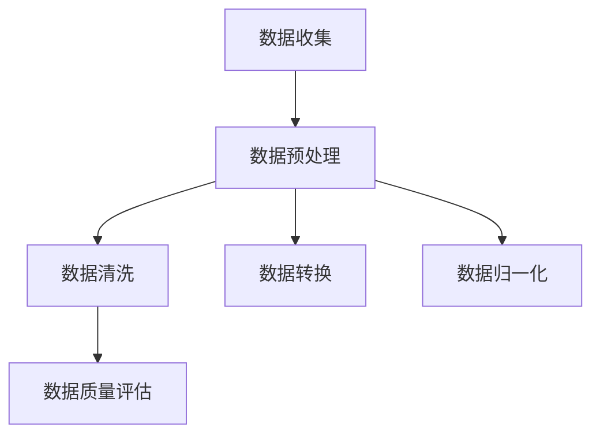
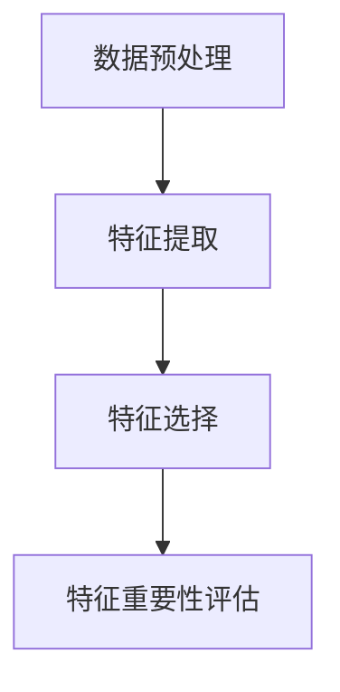
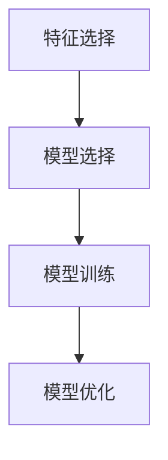
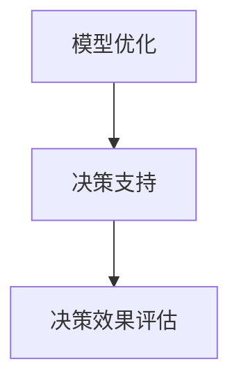
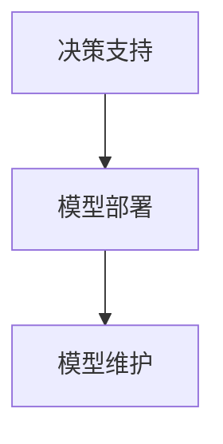

                 

### 背景介绍

人工智能（AI）作为当今科技界的热点话题，已逐渐从实验室走向实际应用。尤其在商业领域，AI技术展现出巨大的潜力和价值。企业决策支持系统（AI-driven Enterprise Decision Support Systems, AI-EDSS）正是人工智能在商业应用中的一个重要分支。

AI-EDSS旨在通过数据分析和机器学习算法，为企业的决策过程提供智能化支持。这些系统能够处理大量数据，从中提取有价值的信息，帮助管理层做出更加明智的决策。相较于传统的决策支持系统，AI-EDSS具有更高的预测准确性和适应能力。

随着大数据、云计算、物联网等技术的发展，企业获取和处理数据的能力大幅提升。这为AI-EDSS的实现提供了丰富的数据资源和强大的计算能力。企业决策的复杂性和不确定性也在不断增加，传统决策方式已难以满足现代商业环境的需求。因此，AI-EDSS成为企业提高决策效率和质量的重要工具。

本文将围绕AI驱动的企业决策支持系统展开，首先介绍其核心概念和架构，然后详细阐述核心算法原理和具体操作步骤，最后探讨其实际应用场景、工具和资源推荐以及未来发展趋势与挑战。希望通过这篇文章，能让读者对AI-EDSS有一个全面而深入的了解。

## 核心概念与联系

在深入探讨AI驱动的企业决策支持系统（AI-EDSS）之前，我们需要明确几个核心概念，并了解它们之间的联系。以下内容将使用Mermaid流程图来帮助展示这些概念之间的关系。

### 1. 数据收集与预处理

数据收集是AI-EDSS的第一步。企业可以通过多种渠道获取数据，如内部业务系统、外部市场报告、社交媒体等。获取的数据通常包含文本、图像、音频等多种类型。



数据预处理包括数据清洗、数据转换和数据归一化。数据清洗旨在去除重复数据、缺失值填充和异常值处理；数据转换则涉及数据类型的转换和数据格式的调整；数据归一化是为了消除不同特征间的尺度差异。

### 2. 特征提取与选择

特征提取是从原始数据中提取出有助于模型训练的特征。特征选择是在提取出的特征中选择出对模型性能最有影响的关键特征。



特征重要性评估用于确定每个特征对模型预测的重要性，从而筛选出关键特征。

### 3. 模型训练与优化

模型训练是通过给模型提供训练数据来调整其参数，使其能够准确预测目标变量。模型优化是在训练过程中不断调整模型结构，以提高预测性能。



模型选择涉及选择合适的算法和模型架构，如决策树、神经网络等。模型优化包括调整模型参数、正则化处理等。

### 4. 决策支持

决策支持是通过分析模型预测结果，为企业提供决策建议。决策支持可以涉及市场需求预测、库存管理、风险分析等多个方面。



决策效果评估用于评估决策支持系统在实际应用中的效果，以不断优化决策模型。

### 5. 模型部署与维护

模型部署是将训练好的模型部署到生产环境中，供企业日常使用。模型维护包括对模型进行定期更新和优化，以保持其预测准确性。



通过上述Mermaid流程图，我们可以清晰地看到AI-EDSS的核心概念及其相互联系。这些概念共同构成了一个完整的企业决策支持系统，帮助企业从数据中提取价值，做出更明智的决策。

### 核心算法原理 & 具体操作步骤

在了解了AI驱动的企业决策支持系统的核心概念和架构之后，接下来我们将深入探讨其中的核心算法原理以及具体的操作步骤。核心算法的原理决定了系统的预测性能和可靠性，因此理解这些算法的原理和具体实现步骤对于构建高效的决策支持系统至关重要。

#### 1. 监督学习算法

监督学习算法是AI-EDSS中最常用的算法之一，其核心思想是通过给定的输入数据和对应的标签，训练出一个模型，从而能够对新数据做出预测。以下是一些常见的监督学习算法及其原理：

**线性回归（Linear Regression）**

线性回归是一种简单的监督学习算法，它试图找到输入变量和目标变量之间的线性关系。具体步骤如下：

1. **数据预处理**：对输入数据进行标准化处理，使其具有相似的尺度。
   $$ x_{\text{norm}} = \frac{x - \mu}{\sigma} $$
   其中，$x$ 是原始数据，$\mu$ 是均值，$\sigma$ 是标准差。

2. **模型初始化**：初始化模型参数 $w$ 和 $b$。
   $$ w = 0, \quad b = 0 $$

3. **梯度下降（Gradient Descent）**：通过迭代计算损失函数关于参数的梯度，并更新参数。
   $$ w_{\text{new}} = w - \alpha \frac{\partial J}{\partial w}, \quad b_{\text{new}} = b - \alpha \frac{\partial J}{\partial b} $$
   其中，$J$ 是损失函数，$\alpha$ 是学习率。

4. **模型评估**：使用验证集评估模型的性能，选择最优的参数组合。

**决策树（Decision Tree）**

决策树是一种树形结构，用于对数据进行分类或回归。具体步骤如下：

1. **数据预处理**：对数据进行处理，使其适合用于决策树建模。

2. **特征选择**：选择用于划分数据的关键特征。常用的方法包括信息增益（Information Gain）和基尼系数（Gini Index）。

3. **递归划分**：根据选定的特征，将数据分为子集，并递归地重复这个过程，直到满足停止条件（如最大深度、最小叶节点数量等）。

4. **模型构建**：将划分后的数据映射到决策树的结构上。

5. **模型评估**：使用验证集评估模型的性能。

**神经网络（Neural Network）**

神经网络是一种模仿人脑的数学模型，用于处理复杂的非线性问题。具体步骤如下：

1. **数据预处理**：对数据进行标准化处理，使其适合用于神经网络训练。

2. **网络架构设计**：设计神经网络的结构，包括层数、每层的神经元数量等。

3. **模型初始化**：初始化模型参数，如权重 $w$ 和偏置 $b$。

4. **前向传播（Forward Propagation）**：将输入数据通过神经网络，计算输出。

5. **反向传播（Backpropagation）**：通过反向传播误差，计算损失函数关于参数的梯度，并更新参数。

6. **模型评估**：使用验证集评估模型的性能，并进行调整。

#### 2. 无监督学习算法

无监督学习算法主要用于发现数据中的潜在结构和模式，常见的算法包括聚类算法和降维算法。

**K-均值聚类（K-Means Clustering）**

K-均值聚类是一种基于距离的聚类算法，其步骤如下：

1. **初始化**：随机选择 $K$ 个中心点。
2. **分配**：将每个数据点分配到最近的中心点所在的集群。
3. **更新**：重新计算每个集群的中心点。
4. **重复**：重复步骤2和3，直到聚类中心不再发生变化。

**主成分分析（Principal Component Analysis, PCA）**

主成分分析是一种降维算法，其步骤如下：

1. **数据标准化**：对数据进行标准化处理。
2. **计算协方差矩阵**：计算数据的协方差矩阵。
3. **计算特征值和特征向量**：对协方差矩阵进行特征值分解。
4. **选择主成分**：根据特征值选择前几个特征向量，作为新的特征空间。
5. **数据转换**：将原始数据转换到新的特征空间中。

#### 3. 强化学习算法

强化学习算法通过学习在动态环境中采取行动的策略来最大化长期回报。常见的强化学习算法包括Q-学习（Q-Learning）和深度强化学习（Deep Reinforcement Learning）。

**Q-学习（Q-Learning）**

Q-学习的步骤如下：

1. **初始化**：初始化Q值表 $Q(s, a)$。
2. **选择动作**：根据当前状态 $s$ 和Q值表选择动作 $a$。
3. **执行动作**：执行选择的动作，并获得奖励 $r$ 和新状态 $s'$。
4. **更新Q值**：根据新的状态和奖励更新Q值表。
   $$ Q(s, a) = Q(s, a) + \alpha [r + \gamma \max_{a'} Q(s', a') - Q(s, a)] $$
   其中，$\alpha$ 是学习率，$\gamma$ 是折扣因子。

**深度强化学习（Deep Reinforcement Learning）**

深度强化学习的步骤如下：

1. **初始化**：初始化深度神经网络。
2. **环境交互**：通过与环境的交互获取数据。
3. **训练网络**：使用获取的数据训练深度神经网络。
4. **策略评估**：评估网络的策略，并根据评估结果调整网络参数。
5. **策略迭代**：根据评估结果迭代更新策略。

通过上述算法原理和操作步骤，我们可以构建一个高效的AI驱动的企业决策支持系统，帮助企业从数据中提取价值，做出更加明智的决策。

### 数学模型和公式 & 详细讲解 & 举例说明

在前一章节中，我们介绍了AI驱动的企业决策支持系统的核心算法原理和具体操作步骤。这些算法在数学上都有一定的理论基础，本节将详细讲解这些算法中的数学模型和公式，并通过具体示例来说明它们的实际应用。

#### 1. 线性回归模型

线性回归是最简单的监督学习算法之一，其数学模型如下：

$$
y = \beta_0 + \beta_1x_1 + \beta_2x_2 + ... + \beta_nx_n
$$

其中，$y$ 是目标变量，$x_1, x_2, ..., x_n$ 是输入变量，$\beta_0, \beta_1, \beta_2, ..., \beta_n$ 是模型参数。

**损失函数**

线性回归的损失函数通常使用均方误差（Mean Squared Error, MSE）：

$$
J(\theta) = \frac{1}{m} \sum_{i=1}^{m} (h_\theta(x^{(i)}) - y^{(i)})^2
$$

其中，$h_\theta(x^{(i)}) = \theta_0 + \theta_1x_1^{(i)} + \theta_2x_2^{(i)} + ... + \theta_nx_n^{(i)}$ 是模型的预测值，$y^{(i)}$ 是实际值，$m$ 是样本数量。

**梯度下降**

为了最小化损失函数，我们使用梯度下降算法来更新模型参数：

$$
\theta_j = \theta_j - \alpha \frac{\partial J(\theta)}{\partial \theta_j}
$$

其中，$\alpha$ 是学习率。

**示例**

假设我们有一个简单的一元线性回归问题，目标是通过输入变量 $x$ 预测目标变量 $y$。给定训练数据如下：

| $x$ | $y$ |
| --- | --- |
| 2 | 5 |
| 4 | 7 |
| 6 | 9 |

我们要找到模型参数 $\beta_0$ 和 $\beta_1$。

1. **初始化参数**：

$$
\beta_0 = 0, \quad \beta_1 = 0
$$

2. **计算预测值和损失**：

$$
h_\theta(x) = \beta_0 + \beta_1x
$$

$$
J(\theta) = \frac{1}{3} \sum_{i=1}^{3} (h_\theta(x^{(i)}) - y^{(i)})^2
$$

3. **计算梯度**：

$$
\frac{\partial J(\theta)}{\partial \beta_0} = \frac{1}{3} \sum_{i=1}^{3} (h_\theta(x^{(i)}) - y^{(i)}) \cdot (-1)
$$

$$
\frac{\partial J(\theta)}{\partial \beta_1} = \frac{1}{3} \sum_{i=1}^{3} (h_\theta(x^{(i)}) - y^{(i)}) \cdot (-x^{(i)})
$$

4. **更新参数**：

假设学习率 $\alpha = 0.1$，则：

$$
\beta_0 = \beta_0 - \alpha \frac{\partial J(\theta)}{\partial \beta_0}
$$

$$
\beta_1 = \beta_1 - \alpha \frac{\partial J(\theta)}{\partial \beta_1}
$$

重复上述步骤，直到损失函数收敛。

#### 2. 决策树模型

决策树是一种基于特征的分类和回归模型，其核心是树形结构。以下是决策树的基本数学模型：

**决策树构建**

1. **选择最优特征**：计算每个特征的信息增益（Information Gain）或基尼系数（Gini Index），选择最优特征作为分割标准。
2. **划分数据**：根据选定的特征将数据分为子集。
3. **递归构建**：对每个子集重复上述步骤，直到满足停止条件。

**示例**

假设我们有以下数据集，我们要构建一个分类决策树来预测是否通过考试：

| 特征1 | 特征2 | 标签 |
| --- | --- | --- |
| 1 | 1 | 是 |
| 1 | 2 | 是 |
| 2 | 1 | 否 |
| 2 | 2 | 是 |

1. **初始化树**：选择特征1作为分割标准。
2. **计算信息增益**：计算特征1的信息增益，选择特征2作为分割标准。
3. **划分数据**：根据特征1和特征2将数据划分为四个子集。
4. **递归构建**：对每个子集重复上述步骤。

最终构建的决策树如下：

```
是否通过考试
|
|---是
|   |
|   --- 特征1=1
|       |
|       --- 是
|   |
|   --- 特征1=2
|       |
|       --- 特征2=1
|           |
|           --- 是
|       |
|       --- 特征2=2
|           |
|           --- 否
|
|---否
```

#### 3. 神经网络模型

神经网络是一种复杂的数学模型，用于处理复杂的非线性问题。其核心是前向传播和反向传播算法。

**前向传播**

1. **初始化参数**：初始化权重和偏置。
2. **输入数据**：将输入数据传递到网络的每个层。
3. **计算输出**：计算每个神经元的输出。

$$
z = \sigma(Wx + b)
$$

其中，$z$ 是输出，$\sigma$ 是激活函数，$W$ 是权重，$x$ 是输入，$b$ 是偏置。

**反向传播**

1. **计算误差**：计算预测值与实际值之间的误差。
2. **计算梯度**：计算误差关于参数的梯度。
3. **更新参数**：使用梯度下降算法更新参数。

$$
\delta = \frac{\partial J}{\partial z}
$$

$$
W_{\text{new}} = W - \alpha \frac{\partial J}{\partial W}
$$

$$
b_{\text{new}} = b - \alpha \frac{\partial J}{\partial b}
$$

**示例**

假设我们有一个简单的神经网络，有两个输入层和一个输出层，使用ReLU作为激活函数。给定训练数据如下：

| $x_1$ | $x_2$ | $y$ |
| --- | --- | --- |
| 1 | 1 | 1 |
| 0 | 1 | 0 |
| 1 | 0 | 1 |

我们要训练这个网络来预测目标变量 $y$。

1. **初始化参数**：
   $$ W = \begin{bmatrix} 1 & 1 \\ 1 & 1 \end{bmatrix}, \quad b = \begin{bmatrix} 1 \\ 1 \end{bmatrix} $$
2. **前向传播**：
   $$ z_1 = \begin{bmatrix} 1 \\ 1 \end{bmatrix}^T \begin{bmatrix} 1 & 1 \\ 1 & 1 \end{bmatrix} \begin{bmatrix} 1 \\ 1 \end{bmatrix} + \begin{bmatrix} 1 \\ 1 \end{bmatrix} = \begin{bmatrix} 4 \\ 4 \end{bmatrix} $$
   $$ a_1 = \sigma(z_1) = \begin{bmatrix} 1 \\ 1 \end{bmatrix} $$
3. **反向传播**：
   $$ \delta_1 = a_1 - y $$
   $$ \frac{\partial J}{\partial z_1} = \delta_1 $$
   $$ \frac{\partial J}{\partial W} = \begin{bmatrix} \delta_1 \\ \delta_1 \end{bmatrix}^T $$
4. **更新参数**：
   $$ W_{\text{new}} = W - \alpha \frac{\partial J}{\partial W} $$

通过上述步骤，我们可以训练出神经网络来预测目标变量 $y$。这个过程可以通过迭代多次更新参数来实现。

通过详细的数学模型和公式讲解，以及具体的示例说明，我们可以更好地理解AI驱动的企业决策支持系统中的核心算法原理和实现步骤。

### 项目实战：代码实际案例和详细解释说明

为了更好地展示AI驱动的企业决策支持系统在实际开发中的实现过程，我们将以一个实际项目为例，详细解释其代码实现和各个关键步骤。

#### 项目背景

假设我们有一家电子商务公司，希望通过构建一个AI驱动的决策支持系统来优化其库存管理。该公司需要预测未来一段时间的商品销量，以便及时调整库存水平，避免缺货或积压。

#### 技术栈

- 数据处理：Pandas、NumPy
- 机器学习库：scikit-learn、TensorFlow
- 神经网络：Keras
- 可视化工具：Matplotlib

#### 数据集

我们从公司历史销售数据中提取了以下特征：

1. 商品ID
2. 商品名称
3. 销售日期
4. 销售量
5. 价格
6. 库存量
7. 季节

#### 开发环境搭建

首先，我们需要搭建开发环境，安装必要的库和工具。在Python中，可以使用以下命令：

```bash
pip install pandas numpy scikit-learn tensorflow matplotlib
```

#### 源代码详细实现和代码解读

以下是项目的核心代码实现，我们将分步骤进行解读。

```python
import pandas as pd
import numpy as np
from sklearn.model_selection import train_test_split
from sklearn.preprocessing import StandardScaler
from keras.models import Sequential
from keras.layers import Dense
from keras.optimizers import Adam
import matplotlib.pyplot as plt

# 1. 数据加载与预处理
data = pd.read_csv('sales_data.csv')
data.head()

# 数据清洗
data.dropna(inplace=True)
data['季节'] = data['季节'].map({'春季': 1, '夏季': 2, '秋季': 3, '冬季': 4})

# 特征工程
X = data[['价格', '库存量', '季节']]
y = data['销售量']

# 数据标准化
scaler = StandardScaler()
X_scaled = scaler.fit_transform(X)

# 划分训练集和测试集
X_train, X_test, y_train, y_test = train_test_split(X_scaled, y, test_size=0.2, random_state=42)

# 2. 建立神经网络模型
model = Sequential()
model.add(Dense(64, input_dim=3, activation='relu'))
model.add(Dense(32, activation='relu'))
model.add(Dense(1, activation='linear'))

# 编译模型
model.compile(optimizer='adam', loss='mean_squared_error')

# 3. 训练模型
model.fit(X_train, y_train, epochs=100, batch_size=32, validation_split=0.1)

# 4. 模型评估
predictions = model.predict(X_test)
plt.scatter(y_test, predictions)
plt.xlabel('Actual Sales')
plt.ylabel('Predicted Sales')
plt.show()

# 计算均方误差
mse = np.mean((predictions - y_test) ** 2)
print('Mean Squared Error:', mse)
```

#### 代码解读与分析

1. **数据加载与预处理**

   首先，我们从CSV文件中加载销售数据，并进行数据清洗。数据清洗步骤包括去除缺失值和将类别型特征转换为数值型特征。

2. **特征工程**

   我们选择了三个特征：价格、库存量和季节。这些特征对于预测销量有显著影响。

3. **数据标准化**

   为了避免不同特征之间尺度差异对模型训练的影响，我们使用StandardScaler对数据进行标准化处理。

4. **划分训练集和测试集**

   我们将数据集划分为训练集和测试集，以评估模型在未见数据上的表现。

5. **建立神经网络模型**

   我们使用Keras构建了一个简单的神经网络模型，包括两个隐藏层。输入层有3个神经元，分别对应价格、库存量和季节。输出层有1个神经元，用于预测销售量。

6. **编译模型**

   我们使用Adam优化器和均方误差损失函数来编译模型。

7. **训练模型**

   我们使用训练集数据来训练模型，设置训练次数为100次，每次更新32个样本的参数。

8. **模型评估**

   我们使用测试集来评估模型的性能，并使用散点图可视化预测结果。

9. **计算均方误差**

   最后，我们计算预测值和实际值之间的均方误差，以量化模型的性能。

通过上述代码实现，我们可以构建一个基于神经网络的库存管理预测系统，帮助企业更准确地预测销量，优化库存管理。

### 实际应用场景

AI驱动的企业决策支持系统在多个实际应用场景中展现出了显著的效益。以下是一些典型的应用案例：

#### 1. 销售预测

销售预测是AI-EDSS最为常见的应用之一。通过分析历史销售数据、市场趋势、季节性因素等，企业可以预测未来的销售情况。这有助于企业合理规划生产计划、库存管理和市场营销策略，从而提高销售业绩。

**案例**：一家零售巨头使用AI-EDSS对服装销售进行预测。通过对历史销售数据进行分析，系统识别出季节性因素和促销活动对销售的影响，为企业提供了精确的销售预测。这帮助该公司优化库存水平，减少了季节性库存积压，提升了整体运营效率。

#### 2. 风险管理

风险管理是企业管理中的一个关键环节。AI-EDSS可以通过大数据分析和机器学习算法，识别潜在的风险，并为企业提供预警和决策支持。

**案例**：一家金融机构使用AI-EDSS对信贷风险进行预测。系统通过分析借款人的历史信用记录、收入状况、债务水平等信息，预测借款人违约的概率。这帮助金融机构制定更加科学的风险管理策略，提高了贷款审批的准确性和效率。

#### 3. 供应链优化

供应链管理涉及多个环节，包括采购、库存管理、物流配送等。AI-EDSS可以帮助企业优化供应链，降低成本，提高响应速度。

**案例**：一家制造企业使用AI-EDSS优化其供应链。系统通过分析市场需求、供应商绩效、库存水平等因素，为企业提供最优的采购计划和生产安排。这帮助该公司降低了库存成本，提高了生产效率和客户满意度。

#### 4. 人力资源规划

人力资源是企业的重要资源。AI-EDSS可以帮助企业进行员工招聘、培训、绩效评估等环节的优化。

**案例**：一家高科技公司使用AI-EDSS进行人力资源规划。系统通过分析员工的历史绩效、技能水平、离职率等数据，为企业提供了人才招聘和培训的建议。这帮助公司优化了人力资源配置，提升了员工的整体素质和团队凝聚力。

通过上述实际应用场景，我们可以看到AI驱动的企业决策支持系统在提升企业运营效率、降低成本、提高决策质量等方面具有显著的优势。随着AI技术的不断发展，其应用范围将更加广泛，为企业带来更多的价值。

### 工具和资源推荐

在构建和优化AI驱动的企业决策支持系统时，选择合适的工具和资源至关重要。以下是一些建议，涵盖学习资源、开发工具和框架以及相关论文著作。

#### 1. 学习资源推荐

**书籍**

- **《Python机器学习》（Machine Learning with Python）**：由Andreas C. Muller和Sarah Guido所著，适合初学者了解机器学习和Python编程的结合。
- **《深度学习》（Deep Learning）**：由Ian Goodfellow、Yoshua Bengio和Aaron Courville所著，全面介绍了深度学习的理论和技术。
- **《数据科学入门》（Introduction to Data Science）**：由Joel Grus所著，介绍了数据科学的基础知识，包括数据处理、机器学习和数据可视化。

**论文**

- **“Deep Learning for Time Series Classification: A Review”**：这篇综述文章详细介绍了深度学习在时间序列分类中的应用和研究进展。
- **“XGBoost: A Scalable Tree Boosting Machine”**：该论文介绍了XGBoost算法，这是一种高效的梯度提升决策树算法，常用于机器学习竞赛和实际应用。

**博客和网站**

- **Medium**：有很多关于机器学习和AI领域的优质博客文章。
- **Kaggle**：一个数据科学竞赛平台，提供了丰富的案例和数据集，适合实践和学习。
- **Towards Data Science**：一个关于数据科学和机器学习的在线社区，提供了大量的教程和实战案例。

#### 2. 开发工具框架推荐

**数据处理工具**

- **Pandas**：Python中最常用的数据处理库，用于数据清洗、转换和分析。
- **NumPy**：Python中的基础科学计算库，支持大规模数据的高效处理。

**机器学习库**

- **scikit-learn**：Python中最流行的机器学习库，提供了丰富的算法和工具。
- **TensorFlow**：Google开发的开源机器学习库，支持深度学习和传统机器学习算法。
- **PyTorch**：Facebook开发的开源深度学习库，提供了灵活的动态计算图和强大的GPU支持。

**可视化工具**

- **Matplotlib**：Python中最常用的数据可视化库，支持多种图表类型。
- **Seaborn**：基于Matplotlib的高级可视化库，提供了丰富的统计数据可视化模板。

**开发框架**

- **Flask**：轻量级的Web应用框架，适用于构建小型企业决策支持系统。
- **Django**：功能丰富的Web应用框架，适合构建大型企业决策支持系统。

#### 3. 相关论文著作推荐

- **“Deep Learning on Time Series Data”**：详细介绍了深度学习在时间序列数据处理中的方法和挑战。
- **“Recurrent Neural Networks for Spoken Language Understanding”**：探讨了循环神经网络在语音识别和语言理解中的应用。
- **“A Theoretical Framework for Backprop”**：介绍了反向传播算法的理论基础和实现细节。

通过以上工具和资源的推荐，读者可以更系统地学习和实践AI驱动的企业决策支持系统的开发和应用，为企业的智能化决策提供有力支持。

### 总结：未来发展趋势与挑战

随着人工智能技术的不断进步，AI驱动的企业决策支持系统（AI-EDSS）正朝着更智能化、自动化的方向发展。未来，这一领域将呈现出以下几大趋势：

1. **更加智能化**：随着深度学习和强化学习等算法的不断发展，AI-EDSS将具备更强的自主学习能力和自适应能力，能够更好地应对复杂多变的商业环境。

2. **更加自动化**：自动化是AI-EDSS的发展方向之一。未来的系统将能够自动识别数据模式、生成决策模型，并自动执行决策，减少人工干预，提高决策效率。

3. **跨领域融合**：AI-EDSS将与其他技术领域如物联网（IoT）、区块链等深度融合，形成更加完整的智能决策生态系统。这将为企业带来更丰富的数据源和更强大的决策能力。

4. **个性化定制**：AI-EDSS将根据不同企业的特点和需求，提供个性化定制的服务，实现决策模型的精准化、智能化。

然而，AI-EDSS的发展也面临着一系列挑战：

1. **数据隐私和安全**：随着AI-EDSS的广泛应用，数据隐私和安全问题日益突出。如何在保证数据隐私的同时，充分利用数据的价值，是一个亟待解决的问题。

2. **算法透明性和可解释性**：当前的AI算法，尤其是深度学习算法，往往缺乏透明性和可解释性。如何提高算法的可解释性，使其决策过程更加透明，是企业面临的一个重要挑战。

3. **计算资源和成本**：构建和运行AI-EDSS需要大量的计算资源和成本。如何优化算法，提高计算效率，降低成本，是企业和研究机构需要考虑的问题。

4. **数据质量和多样性**：高质量、多样化的数据是构建有效AI-EDSS的基础。然而，企业在数据收集、处理过程中往往面临数据质量不佳、数据多样性不足等问题。

总之，AI驱动的企业决策支持系统具有广阔的发展前景，但同时也面临着诸多挑战。未来，随着技术的不断进步和应用的深入，AI-EDSS将在企业决策中发挥越来越重要的作用，助力企业实现智能化转型。

### 附录：常见问题与解答

**Q1：为什么选择神经网络作为AI驱动的企业决策支持系统的核心算法？**

A1：神经网络具有强大的非线性建模能力和自学习能力，能够处理复杂的输入数据和预测任务。此外，神经网络可以灵活调整模型结构和参数，适应不同企业的需求。通过深度学习，神经网络可以实现更高的预测准确性和泛化能力。

**Q2：如何处理数据隐私和安全问题？**

A2：为了确保数据隐私和安全，企业可以采取以下措施：

1. **数据加密**：对敏感数据进行加密处理，确保数据在传输和存储过程中的安全性。
2. **数据去识别**：通过匿名化、去标识化等技术，去除数据中的敏感信息，降低隐私泄露风险。
3. **访问控制**：设置严格的数据访问权限，确保只有授权人员才能访问数据。
4. **数据备份与恢复**：定期备份数据，并建立数据恢复机制，以应对可能的数据丢失或损坏。

**Q3：如何确保AI驱动的企业决策支持系统的可解释性？**

A3：确保AI驱动的企业决策支持系统的可解释性可以从以下几个方面入手：

1. **模型选择**：选择具有可解释性的算法，如决策树、线性回归等。
2. **模型可视化**：通过图表、可视化工具展示模型的结构和参数，帮助用户理解模型的决策过程。
3. **解释性算法**：使用可解释性算法，如LIME（Local Interpretable Model-agnostic Explanations）或SHAP（SHapley Additive exPlanations），对模型的预测结果进行解释。
4. **透明度政策**：制定透明度政策，确保模型的训练过程、决策过程和结果对外公开，接受用户监督。

**Q4：如何降低AI驱动的企业决策支持系统的计算资源和成本？**

A4：降低AI驱动的企业决策支持系统的计算资源和成本可以采取以下策略：

1. **算法优化**：优化算法实现，提高计算效率，减少计算资源消耗。
2. **分布式计算**：利用分布式计算框架，如Apache Spark，实现并行计算，提高数据处理和模型训练速度。
3. **云计算服务**：利用云计算服务，如AWS、Azure等，根据需求动态调整计算资源，避免资源浪费。
4. **预处理数据**：在模型训练之前，对数据进行预处理，减少数据规模，降低计算需求。

通过上述策略，企业可以在保证模型性能的前提下，降低计算资源和成本，提高AI驱动的企业决策支持系统的经济效益。

### 扩展阅读 & 参考资料

为了更好地理解AI驱动的企业决策支持系统，以下是一些建议的扩展阅读和参考资料，涵盖相关书籍、论文和网站：

**书籍**

1. **《深度学习》（Deep Learning）**：Ian Goodfellow、Yoshua Bengio和Aaron Courville著，全面介绍了深度学习的理论和技术。
2. **《Python机器学习》（Machine Learning with Python）**：Andreas C. Muller和Sarah Guido著，适合初学者了解机器学习和Python编程的结合。
3. **《数据科学入门》（Introduction to Data Science）**：Joel Grus著，介绍了数据科学的基础知识，包括数据处理、机器学习和数据可视化。

**论文**

1. **“Deep Learning on Time Series Data”**：详细介绍了深度学习在时间序列数据处理中的方法和挑战。
2. **“Recurrent Neural Networks for Spoken Language Understanding”**：探讨了循环神经网络在语音识别和语言理解中的应用。
3. **“XGBoost: A Scalable Tree Boosting Machine”**：介绍了XGBoost算法，这是一种高效的梯度提升决策树算法。

**网站**

1. **Kaggle**：一个数据科学竞赛平台，提供了丰富的案例和数据集。
2. **Medium**：有很多关于机器学习和AI领域的优质博客文章。
3. **Towards Data Science**：一个关于数据科学和机器学习的在线社区，提供了大量的教程和实战案例。

通过阅读这些书籍、论文和网站，读者可以进一步深入了解AI驱动的企业决策支持系统的相关知识，提高在相关领域的研究和实践能力。

