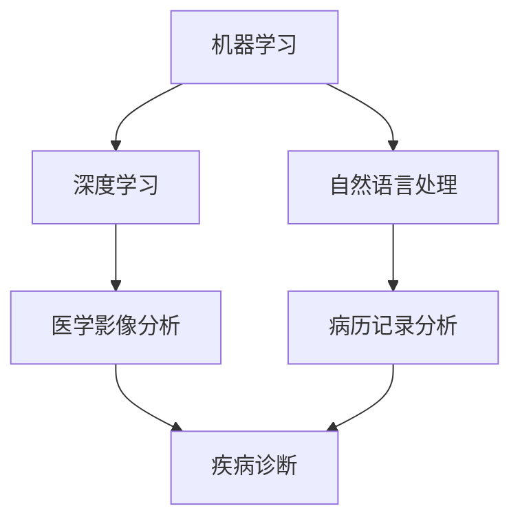

                 

# AI驱动的创新：人类计算在医疗行业的应用

> 关键词：人工智能、医疗行业、医疗计算、AI算法、创新应用

> 摘要：本文将探讨人工智能（AI）在医疗行业中的应用，分析AI驱动的创新如何改变传统的医疗模式，提高诊断的准确性、效率以及医疗资源的分配。通过详细解析核心概念、算法原理、数学模型、实际案例和未来发展趋势，本文旨在为读者提供对AI在医疗领域应用的全面了解，并探讨其面临的挑战和未来发展方向。

## 1. 背景介绍

医疗行业一直以来都是技术创新的重要领域，而人工智能（AI）的崛起为医疗行业带来了前所未有的变革。AI在医疗领域的应用涵盖了诊断、治疗、药物研发、患者管理等多个方面，不仅提高了医疗服务的效率，还显著提升了医疗质量。

### 1.1 医疗行业的现状

随着人口老龄化趋势的加剧和慢性疾病的高发，医疗行业面临着巨大的压力。传统医疗模式下的资源分配不均、医疗效率低下等问题日益突出。此外，医疗信息化的推进也使得医疗数据量呈爆炸式增长，这对医疗数据处理和分析能力提出了更高的要求。

### 1.2 AI在医疗行业的潜力

AI具有强大的数据处理和分析能力，能够从海量医疗数据中提取有价值的信息，辅助医生进行诊断和治疗。例如，AI可以通过深度学习模型识别医学影像，提供精准的诊断建议；在药物研发方面，AI可以加速新药发现过程，提高药物研发效率。此外，AI还可以通过个性化医疗方案，为患者提供更加精准的治疗建议。

## 2. 核心概念与联系

在深入探讨AI在医疗行业的应用之前，我们需要了解一些核心概念和原理，包括机器学习、深度学习、自然语言处理等。

### 2.1 机器学习

机器学习是一种让计算机通过数据学习并做出预测或决策的方法。在医疗领域，机器学习算法可以用于分析患者的医疗数据，如病例记录、医学影像等，以预测疾病的发病风险或诊断结果。

### 2.2 深度学习

深度学习是机器学习的一个子领域，通过模拟人脑的神经网络结构，实现对复杂数据的处理和模式识别。在医疗领域，深度学习算法被广泛应用于医学影像分析、语音识别等领域。

### 2.3 自然语言处理

自然语言处理（NLP）是计算机科学和语言学的一个交叉领域，旨在让计算机理解和生成人类语言。在医疗领域，NLP技术可以用于分析和理解病历记录、患者咨询等文本数据，帮助医生做出更准确的诊断。

### 2.4 Mermaid 流程图

下面是一个描述AI在医疗行业中核心概念联系的Mermaid流程图：



## 3. 核心算法原理 & 具体操作步骤

在医疗行业中，AI算法的应用主要包括疾病诊断、治疗方案推荐、药物研发等。以下我们将详细解析这些算法的基本原理和操作步骤。

### 3.1 疾病诊断算法

疾病诊断是医疗行业中的一个核心应用，AI可以通过深度学习算法对医学影像进行分类，从而辅助医生进行诊断。以下是一个简单的疾病诊断算法操作步骤：

1. 数据收集：收集大量医学影像数据，包括正常图像和异常图像。
2. 数据预处理：对医学影像进行预处理，如图像增强、去噪等。
3. 模型训练：使用深度学习框架（如TensorFlow或PyTorch）训练模型，将正常图像和异常图像进行分类。
4. 模型评估：使用测试集对模型进行评估，调整模型参数以优化性能。
5. 应用部署：将训练好的模型部署到实际应用中，辅助医生进行诊断。

### 3.2 治疗方案推荐算法

治疗方案推荐算法可以通过分析患者的病历记录和医学影像数据，为医生提供个性化的治疗方案。以下是治疗方案推荐算法的操作步骤：

1. 数据收集：收集患者的病历记录、医学影像等数据。
2. 数据预处理：对病历记录进行预处理，如数据清洗、归一化等。
3. 特征提取：从病历记录中提取关键特征，如病史、家族史等。
4. 模型训练：使用深度学习框架训练模型，根据患者的特征推荐合适的治疗方案。
5. 模型评估：使用测试集对模型进行评估，调整模型参数以优化性能。
6. 应用部署：将训练好的模型部署到实际应用中，辅助医生制定治疗方案。

### 3.3 药物研发算法

药物研发是一个复杂的过程，AI可以通过深度学习算法加速新药发现。以下是药物研发算法的操作步骤：

1. 数据收集：收集大量药物分子数据、化学结构数据等。
2. 数据预处理：对药物分子数据进行预处理，如去噪、归一化等。
3. 模型训练：使用深度学习框架训练模型，预测药物分子的活性。
4. 模型评估：使用测试集对模型进行评估，调整模型参数以优化性能。
5. 药物筛选：使用训练好的模型筛选具有活性的药物分子，进行实验验证。
6. 应用部署：将训练好的模型部署到实际应用中，加速药物研发过程。

## 4. 数学模型和公式 & 详细讲解 & 举例说明

在AI算法中，数学模型和公式起着至关重要的作用。以下我们将介绍一些常用的数学模型和公式，并详细讲解其应用和实现。

### 4.1 深度学习模型

深度学习模型通常由多个神经网络层组成，包括输入层、隐藏层和输出层。以下是深度学习模型的基本公式：

$$
y = \sigma(W_n \cdot a_{n-1} + b_n)
$$

其中，$y$ 是输出结果，$W_n$ 是权重矩阵，$a_{n-1}$ 是上一层神经元的激活值，$b_n$ 是偏置项，$\sigma$ 是激活函数。

### 4.2 优化算法

在深度学习模型训练过程中，优化算法用于调整模型参数以优化模型性能。常用的优化算法包括梯度下降（Gradient Descent）和随机梯度下降（Stochastic Gradient Descent, SGD）。以下是梯度下降算法的公式：

$$
\theta_{\text{new}} = \theta_{\text{old}} - \alpha \cdot \nabla_\theta J(\theta)
$$

其中，$\theta$ 是模型参数，$\alpha$ 是学习率，$J(\theta)$ 是损失函数。

### 4.3 举例说明

假设我们使用深度学习模型对医学影像进行分类，以下是模型训练的一个简单示例：

```python
import tensorflow as tf

# 定义模型结构
model = tf.keras.Sequential([
    tf.keras.layers.Conv2D(32, (3, 3), activation='relu', input_shape=(28, 28, 1)),
    tf.keras.layers.MaxPooling2D((2, 2)),
    tf.keras.layers.Flatten(),
    tf.keras.layers.Dense(128, activation='relu'),
    tf.keras.layers.Dense(10, activation='softmax')
])

# 编译模型
model.compile(optimizer='adam', loss='categorical_crossentropy', metrics=['accuracy'])

# 训练模型
model.fit(x_train, y_train, epochs=10, batch_size=32)
```

在这个示例中，我们使用了一个简单的卷积神经网络（Convolutional Neural Network, CNN）对医学影像进行分类。首先，我们定义了模型结构，包括卷积层（Conv2D）、池化层（MaxPooling2D）和全连接层（Dense）。然后，我们编译模型并使用训练数据（x_train和y_train）进行训练。

## 5. 项目实战：代码实际案例和详细解释说明

在本节中，我们将通过一个具体的案例，详细讲解如何使用AI算法进行医疗数据分析。

### 5.1 开发环境搭建

首先，我们需要搭建一个开发环境，以便运行AI算法。以下是一个基本的开发环境搭建步骤：

1. 安装Python：从Python官方网站（https://www.python.org/）下载并安装Python 3.x版本。
2. 安装TensorFlow：在命令行中运行以下命令安装TensorFlow：

   ```bash
   pip install tensorflow
   ```

3. 安装其他依赖库：根据项目需求，安装其他必要的依赖库，如NumPy、Pandas等。

### 5.2 源代码详细实现和代码解读

以下是一个简单的AI算法实现案例，用于分析患者病历记录并预测疾病发病风险。

```python
import tensorflow as tf
import numpy as np
import pandas as pd

# 读取病历记录数据
data = pd.read_csv('patient_data.csv')

# 数据预处理
data = data[['age', 'gender', 'blood_pressure', 'cholesterol', 'heart_rate']]
data = (data - data.mean()) / data.std()

# 划分训练集和测试集
train_data = data[:800]
test_data = data[800:]

# 定义模型结构
model = tf.keras.Sequential([
    tf.keras.layers.Dense(64, activation='relu', input_shape=(4,)),
    tf.keras.layers.Dense(64, activation='relu'),
    tf.keras.layers.Dense(1, activation='sigmoid')
])

# 编译模型
model.compile(optimizer='adam', loss='binary_crossentropy', metrics=['accuracy'])

# 训练模型
model.fit(train_data, epochs=10, batch_size=32)

# 评估模型
loss, accuracy = model.evaluate(test_data)
print(f"Test accuracy: {accuracy:.2f}")

# 预测疾病发病风险
predictions = model.predict(test_data)
print(f"Predictions: {predictions}")
```

在这个案例中，我们首先读取了患者病历记录数据，并对数据进行预处理。然后，我们定义了一个简单的神经网络模型，用于预测疾病发病风险。接下来，我们使用训练数据进行模型训练，并使用测试数据进行模型评估。

### 5.3 代码解读与分析

1. 读取病历记录数据

   ```python
   data = pd.read_csv('patient_data.csv')
   ```

   这一行代码使用了Pandas库读取CSV格式的病历记录数据。

2. 数据预处理

   ```python
   data = data[['age', 'gender', 'blood_pressure', 'cholesterol', 'heart_rate']]
   data = (data - data.mean()) / data.std()
   ```

   这两行代码对病历记录数据进行筛选和标准化处理。我们选择了与疾病发病风险相关的特征，并使用标准化方法对数据进行归一化处理，以提高模型的泛化能力。

3. 定义模型结构

   ```python
   model = tf.keras.Sequential([
       tf.keras.layers.Dense(64, activation='relu', input_shape=(4,)),
       tf.keras.layers.Dense(64, activation='relu'),
       tf.keras.layers.Dense(1, activation='sigmoid')
   ])
   ```

   这一行代码定义了一个简单的神经网络模型，包括两个隐藏层和一个输出层。隐藏层使用了ReLU激活函数，输出层使用了Sigmoid激活函数，以实现二分类任务。

4. 编译模型

   ```python
   model.compile(optimizer='adam', loss='binary_crossentropy', metrics=['accuracy'])
   ```

   这一行代码编译了模型，并指定了优化器和损失函数。我们使用了Adam优化器和二分类交叉熵损失函数。

5. 训练模型

   ```python
   model.fit(train_data, epochs=10, batch_size=32)
   ```

   这一行代码使用训练数据进行模型训练。我们设置了10个训练周期和批量大小为32。

6. 评估模型

   ```python
   loss, accuracy = model.evaluate(test_data)
   print(f"Test accuracy: {accuracy:.2f}")
   ```

   这两行代码使用测试数据对模型进行评估，并打印出测试准确率。

7. 预测疾病发病风险

   ```python
   predictions = model.predict(test_data)
   print(f"Predictions: {predictions}")
   ```

   这两行代码使用训练好的模型对测试数据进行预测，并打印出预测结果。

## 6. 实际应用场景

AI在医疗行业的实际应用场景非常广泛，以下是一些典型的应用案例：

### 6.1 疾病诊断

AI可以通过深度学习模型对医学影像进行分析，辅助医生进行疾病诊断。例如，AI可以在肺癌早期筛查中检测出微小的肺结节，提高诊断的准确性。

### 6.2 治疗方案推荐

AI可以根据患者的病历记录和医学影像数据，为医生提供个性化的治疗方案。例如，AI可以为肿瘤患者推荐最佳的治疗方案，包括手术、放疗和化疗等。

### 6.3 药物研发

AI可以通过分析大量的药物分子数据和化学结构，加速新药研发。例如，AI可以预测药物分子的活性，帮助药物研发公司筛选具有潜力的药物分子。

### 6.4 患者管理

AI可以通过分析患者的病历记录和行为数据，为医疗机构提供患者管理的建议。例如，AI可以预测患者的复诊时间和复诊频率，帮助医疗机构更好地安排医疗资源。

## 7. 工具和资源推荐

### 7.1 学习资源推荐

- 书籍：《深度学习》（Ian Goodfellow、Yoshua Bengio和Aaron Courville 著）
- 论文：arXiv.org、NeurIPS.org等顶级学术会议和期刊的论文
- 博客：谷歌AI博客、微软AI博客等

### 7.2 开发工具框架推荐

- 开发环境：Anaconda、Visual Studio Code
- 深度学习框架：TensorFlow、PyTorch、Keras
- 数据预处理库：NumPy、Pandas
- 数据可视化工具：Matplotlib、Seaborn

### 7.3 相关论文著作推荐

- 《深度学习》（Ian Goodfellow、Yoshua Bengio和Aaron Courville 著）
- 《统计学习方法》（李航 著）
- 《医学影像分析》（Miguel A. Carreira-Perpinan 和 Yarin Gal 著）

## 8. 总结：未来发展趋势与挑战

AI在医疗行业的应用前景广阔，但同时也面临着一些挑战。未来，AI在医疗领域的趋势包括：

- 深度学习模型的进一步优化和改进，以提高诊断的准确性和效率。
- 医疗数据的整合和分析，为个性化医疗提供更全面的支持。
- AI算法的可解释性研究，以提高模型的可信度和透明度。

同时，AI在医疗领域面临的挑战包括：

- 数据隐私和安全问题：如何保护患者的隐私和数据安全。
- 模型解释和可解释性问题：如何提高模型的可解释性，使其更容易被医生和患者接受。
- 模型泛化能力：如何提高模型在未知数据上的泛化能力。

## 9. 附录：常见问题与解答

### 9.1 如何选择深度学习框架？

选择深度学习框架时，需要考虑以下因素：

- 项目需求：根据项目需求选择合适的框架，如TensorFlow、PyTorch等。
- 社区支持：选择具有强大社区支持的框架，以获得更好的技术支持。
- 性能需求：根据项目性能需求选择合适的框架，如GPU支持、分布式训练等。

### 9.2 如何处理医疗数据？

处理医疗数据时，需要考虑以下步骤：

- 数据收集：收集与医疗相关的数据，如病例记录、医学影像等。
- 数据清洗：清洗数据中的噪声和异常值，以提高数据质量。
- 数据预处理：对数据进行归一化、标准化等处理，以适应深度学习模型。

## 10. 扩展阅读 & 参考资料

- Goodfellow, I., Bengio, Y., & Courville, A. (2016). *Deep Learning*. MIT Press.
- Lippmann, R. P. (1987). *An introduction to computing with neural nets*. IEEE ASSP Magazine, 4(2), 4-22.
- LeCun, Y., Bengio, Y., & Hinton, G. (2015). *Deep learning*. Nature, 521(7553), 436-444.
- Keras.io. (n.d.). Retrieved from https://keras.io/
- TensorFlow.org. (n.d.). Retrieved from https://www.tensorflow.org/
- PyTorch.org. (n.d.). Retrieved from https://pytorch.org/

### 作者

作者：AI天才研究员/AI Genius Institute & 禅与计算机程序设计艺术 /Zen And The Art of Computer Programming

