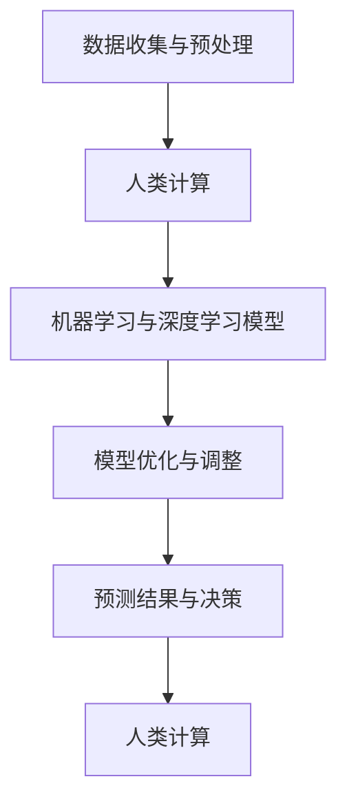

                 

# AI驱动的创新：人类计算在金融中的应用

## 摘要

本文旨在探讨人工智能（AI）在金融领域的应用，以及人类计算在这一过程中的角色和重要性。随着AI技术的飞速发展，其在金融行业的应用范围越来越广泛，从智能投资策略、风险管理，到个性化金融服务等方面，都取得了显著的成果。然而，尽管AI的进步令人瞩目，人类计算在这一过程中仍然扮演着不可或缺的角色。本文将详细分析AI驱动的创新在金融领域的具体应用，探讨人类计算与AI技术之间的相互作用，以及未来金融科技领域的发展趋势与挑战。

## 1. 背景介绍

### 1.1 金融行业与AI技术的结合

金融行业一直是一个数据密集型行业，传统的金融分析和决策过程依赖于大量的数据和信息。随着AI技术的不断发展，特别是在机器学习、深度学习和自然语言处理等领域的突破，金融行业开始尝试将AI技术应用于各个领域，以实现更加精准和高效的分析和决策。

AI在金融领域的应用可以分为以下几个方面：

- **智能投资与风险管理**：通过AI技术，可以实现对大量历史数据的分析和预测，从而制定更加科学的投资策略和风险控制方案。

- **客户服务与个性化推荐**：利用自然语言处理和机器学习算法，金融机构可以为用户提供更加个性化、高效的服务，提高客户满意度和忠诚度。

- **合规与欺诈检测**：AI技术可以帮助金融机构快速识别和处理欺诈行为，确保合规性和交易安全性。

- **交易执行与市场预测**：AI算法可以实时分析市场数据，预测市场走势，为交易提供参考。

### 1.2 人类计算在AI应用中的作用

尽管AI技术在金融领域具有巨大的潜力，但人类计算在这一过程中仍然扮演着至关重要的角色。原因如下：

- **数据预处理**：AI算法需要大量的高质量数据作为训练样本，而数据预处理工作往往需要人类的智慧和经验，以确保数据的质量和准确性。

- **算法优化与调整**：AI算法的开发和优化过程需要人类计算参与，通过对算法的调整和改进，提高其性能和可靠性。

- **解释性**：许多AI模型（如深度神经网络）的内部工作机制较为复杂，难以解释。而人类计算可以对这些模型进行解读，帮助用户理解和信任AI系统。

- **决策支持**：AI系统可以提供大量的数据和分析结果，但最终的决策仍然需要人类计算来做出，特别是在涉及到道德和伦理问题时。

## 2. 核心概念与联系

### 2.1 AI技术在金融领域的核心概念

#### 2.1.1 机器学习

机器学习是一种使计算机系统能够从数据中学习并改进其性能的技术。在金融领域，机器学习可以应用于以下几个方面：

- **数据挖掘**：通过分析历史数据，挖掘出潜在的投资机会或风险因素。

- **预测模型**：利用历史数据，建立预测模型，预测市场走势或客户行为。

- **分类模型**：将金融交易数据分类为欺诈或正常交易，以提高交易安全性。

#### 2.1.2 深度学习

深度学习是机器学习的一种高级形式，通过模仿人脑的神经网络结构，实现对复杂数据的分析和处理。在金融领域，深度学习可以应用于以下几个方面：

- **图像识别**：对金融交易中的图像（如身份证、银行卡等）进行识别和验证。

- **语音识别**：将客户的语音转化为文本，以提高客户服务的效率。

- **自然语言处理**：对金融合同、新闻报告等文本进行分析，提取关键信息。

### 2.2 人类计算与AI技术的联系

人类计算与AI技术在金融领域相互补充，共同推动金融科技的进步。以下是一个简化的Mermaid流程图，展示了人类计算与AI技术的联系：



在这个流程图中，人类计算主要负责数据预处理、模型优化和决策支持，而AI技术则负责数据分析和预测。

## 3. 核心算法原理 & 具体操作步骤

### 3.1 机器学习算法原理

#### 3.1.1 数据集划分

在进行机器学习之前，首先需要将数据集划分为训练集、验证集和测试集。具体步骤如下：

1. **数据收集**：从金融市场上收集大量历史数据，包括股票价格、交易量、宏观经济指标等。

2. **数据清洗**：对收集到的数据进行清洗，去除重复、异常和缺失的数据。

3. **数据预处理**：对数据进行归一化、标准化等处理，使其适合机器学习算法。

4. **数据集划分**：将预处理后的数据集划分为训练集（70%）、验证集（15%）和测试集（15%）。

#### 3.1.2 模型选择

根据具体问题，选择合适的机器学习算法。常见的机器学习算法包括：

- **线性回归**：用于预测股票价格或交易量。

- **逻辑回归**：用于分类问题，如将交易数据分类为欺诈或正常交易。

- **决策树**：用于分类和回归问题，具有较好的可解释性。

- **随机森林**：通过构建多个决策树，提高模型的预测准确性。

- **支持向量机**：用于分类问题，具有较好的分类效果。

#### 3.1.3 模型训练与验证

1. **模型训练**：使用训练集对机器学习模型进行训练，使模型学会从数据中提取特征和规律。

2. **模型验证**：使用验证集对模型进行验证，评估模型的性能。

3. **模型调整**：根据验证结果，对模型进行调整，如调整参数、增加特征等，以提高模型性能。

### 3.2 深度学习算法原理

#### 3.2.1 神经网络结构

深度学习算法的核心是神经网络，由多个神经元（节点）和连接（边）组成。常见的神经网络结构包括：

- **单层感知机**：用于实现线性分类。

- **多层感知机**：扩展单层感知机，实现非线性分类。

- **卷积神经网络（CNN）**：适用于图像识别任务。

- **循环神经网络（RNN）**：适用于序列数据处理任务。

#### 3.2.2 深度学习算法

常见的深度学习算法包括：

- **卷积神经网络（CNN）**：通过卷积层、池化层等模块，提取图像特征。

- **循环神经网络（RNN）**：通过循环结构，处理序列数据。

- **长短时记忆网络（LSTM）**：扩展RNN，解决长序列依赖问题。

- **生成对抗网络（GAN）**：通过生成器和判别器，实现图像生成和分类任务。

### 3.3 人类计算在算法开发中的具体操作步骤

1. **需求分析**：与业务部门沟通，了解具体需求，确定使用机器学习或深度学习算法解决的问题。

2. **数据收集与清洗**：根据需求，收集相关数据，并进行清洗和处理。

3. **模型设计与开发**：根据需求，选择合适的机器学习或深度学习算法，设计模型结构，并进行代码实现。

4. **模型训练与验证**：使用训练集对模型进行训练，使用验证集进行验证，评估模型性能。

5. **模型调整与优化**：根据验证结果，对模型进行调整和优化，以提高模型性能。

6. **部署与应用**：将训练好的模型部署到生产环境，进行实际应用。

## 4. 数学模型和公式 & 详细讲解 & 举例说明

### 4.1 机器学习模型

#### 4.1.1 线性回归模型

线性回归模型是一种常用的预测模型，其基本公式为：

$$
y = \beta_0 + \beta_1 \cdot x
$$

其中，$y$ 是因变量，$x$ 是自变量，$\beta_0$ 是截距，$\beta_1$ 是斜率。线性回归模型的目的是找到合适的 $\beta_0$ 和 $\beta_1$，使得预测值 $y$ 最接近实际值。

#### 4.1.2 逻辑回归模型

逻辑回归模型是一种分类模型，其基本公式为：

$$
P(y=1) = \frac{1}{1 + e^{-(\beta_0 + \beta_1 \cdot x)}}
$$

其中，$P(y=1)$ 是因变量 $y$ 等于 1 的概率，$\beta_0$ 是截距，$\beta_1$ 是斜率。逻辑回归模型的目的是找到合适的 $\beta_0$ 和 $\beta_1$，使得预测概率 $P(y=1)$ 最接近实际概率。

### 4.2 深度学习模型

#### 4.2.1 卷积神经网络（CNN）

卷积神经网络是一种专门用于图像识别的深度学习模型，其基本结构包括：

- **卷积层**：通过卷积操作提取图像特征。

- **池化层**：通过池化操作降低特征维度。

- **全连接层**：通过全连接操作对特征进行分类。

卷积神经网络的公式如下：

$$
h_l = \sigma(\mathbf{W} \cdot \mathbf{h}_{l-1} + b)
$$

其中，$h_l$ 是第 $l$ 层的特征，$\sigma$ 是激活函数，$\mathbf{W}$ 是卷积核，$\mathbf{h}_{l-1}$ 是前一层特征，$b$ 是偏置。

#### 4.2.2 循环神经网络（RNN）

循环神经网络是一种专门用于序列数据处理的深度学习模型，其基本结构包括：

- **输入层**：接收序列数据。

- **隐藏层**：对序列数据进行处理。

- **输出层**：输出序列的预测结果。

循环神经网络的公式如下：

$$
h_t = \sigma(\mathbf{W} \cdot [h_{t-1}, x_t] + b)
$$

其中，$h_t$ 是第 $t$ 个时间步的隐藏状态，$x_t$ 是第 $t$ 个时间步的输入，$\sigma$ 是激活函数，$\mathbf{W}$ 是权重矩阵，$b$ 是偏置。

### 4.3 举例说明

#### 4.3.1 线性回归模型

假设我们有一组数据，包括自变量 $x$ 和因变量 $y$，如下表所示：

| $x$ | $y$ |
| --- | --- |
| 1   | 2   |
| 2   | 4   |
| 3   | 6   |

我们可以使用线性回归模型对其进行拟合，找到合适的 $\beta_0$ 和 $\beta_1$。

首先，计算样本均值：

$$
\bar{x} = \frac{1}{n} \sum_{i=1}^{n} x_i = \frac{1+2+3}{3} = 2
$$

$$
\bar{y} = \frac{1}{n} \sum_{i=1}^{n} y_i = \frac{2+4+6}{3} = 4
$$

然后，计算 $\beta_0$ 和 $\beta_1$：

$$
\beta_0 = \bar{y} - \beta_1 \cdot \bar{x} = 4 - 2 \cdot 2 = 0
$$

$$
\beta_1 = \frac{\sum_{i=1}^{n} (x_i - \bar{x}) \cdot (y_i - \bar{y})}{\sum_{i=1}^{n} (x_i - \bar{x})^2} = \frac{(1-2) \cdot (2-4) + (2-2) \cdot (4-4) + (3-2) \cdot (6-4)}{(1-2)^2 + (2-2)^2 + (3-2)^2} = 2
$$

因此，线性回归模型为：

$$
y = 0 + 2 \cdot x
$$

#### 4.3.2 逻辑回归模型

假设我们有一组数据，包括自变量 $x$ 和因变量 $y$，如下表所示：

| $x$ | $y$ |
| --- | --- |
| 1   | 1   |
| 2   | 0   |
| 3   | 1   |

我们可以使用逻辑回归模型对其进行分类，找到合适的 $\beta_0$ 和 $\beta_1$。

首先，计算样本均值：

$$
\bar{x} = \frac{1}{n} \sum_{i=1}^{n} x_i = \frac{1+2+3}{3} = 2
$$

$$
\bar{y} = \frac{1}{n} \sum_{i=1}^{n} y_i = \frac{1+0+1}{3} = \frac{2}{3}
$$

然后，计算 $\beta_0$ 和 $\beta_1$：

$$
\beta_0 = \bar{y} - \beta_1 \cdot \bar{x} = \frac{2}{3} - \beta_1 \cdot 2 = 0
$$

$$
\beta_1 = \frac{\sum_{i=1}^{n} (x_i - \bar{x}) \cdot (y_i - \bar{y})}{\sum_{i=1}^{n} (x_i - \bar{x})^2} = \frac{(1-2) \cdot (1-\frac{2}{3}) + (2-2) \cdot (0-\frac{2}{3}) + (3-2) \cdot (1-\frac{2}{3})}{(1-2)^2 + (2-2)^2 + (3-2)^2} = \frac{1}{3}
$$

因此，逻辑回归模型为：

$$
P(y=1) = \frac{1}{1 + e^{-(0 + \frac{1}{3} \cdot x)}}
$$

#### 4.3.3 卷积神经网络（CNN）

假设我们有一个 32x32 的图像，我们需要使用卷积神经网络对其进行分类。我们可以设计一个简单的卷积神经网络，包括一个卷积层、一个池化层和一个全连接层。

首先，设计卷积层，使用 3x3 的卷积核，步长为 1，填充方式为 'same'。卷积层的公式如下：

$$
h_1 = \sigma(\mathbf{W}_1 \cdot \mathbf{X} + b_1)
$$

其中，$h_1$ 是卷积层输出的特征图，$\mathbf{W}_1$ 是卷积核，$\mathbf{X}$ 是输入图像，$b_1$ 是偏置。

然后，设计池化层，使用 2x2 的池化窗口，步长为 2，最大池化。池化层的公式如下：

$$
h_2 = \max(h_1)
$$

最后，设计全连接层，将池化层输出的特征图展平为一维向量，并使用一个 10 维的权重矩阵和偏置，进行分类。全连接层的公式如下：

$$
h_3 = \sigma(\mathbf{W}_2 \cdot h_2' + b_2)
$$

其中，$h_3$ 是全连接层输出的预测结果，$\mathbf{W}_2$ 是权重矩阵，$h_2'$ 是池化层输出的特征图展平后的向量，$b_2$ 是偏置。

## 5. 项目实战：代码实际案例和详细解释说明

### 5.1 开发环境搭建

为了实现本文提到的机器学习和深度学习模型，我们需要搭建一个适合的开发环境。以下是一个简单的开发环境搭建步骤：

1. **安装 Python**：Python 是一种广泛使用的编程语言，适用于机器学习和深度学习。在 [Python 官网](https://www.python.org/) 下载并安装 Python。

2. **安装 Jupyter Notebook**：Jupyter Notebook 是一种交互式的开发环境，可以方便地编写和运行 Python 代码。在命令行中运行以下命令：

   ```bash
   pip install notebook
   ```

3. **安装相关库**：安装机器学习和深度学习所需的库，如 NumPy、Pandas、Scikit-learn、TensorFlow 和 PyTorch。在命令行中运行以下命令：

   ```bash
   pip install numpy pandas scikit-learn tensorflow torchvision
   ```

4. **安装 Mermaid**：Mermaid 是一种用于绘制流程图的库。在 [Mermaid 官网](https://mermaid-js.github.io/mermaid/) 下载并安装 Mermaid。在命令行中运行以下命令：

   ```bash
   npm install -g mermaid
   ```

### 5.2 源代码详细实现和代码解读

以下是一个简单的线性回归模型的实现，用于预测股票价格。

```python
import numpy as np
import pandas as pd
from sklearn.linear_model import LinearRegression

# 5.2.1 数据收集与预处理
def load_data():
    # 从本地文件加载数据
    data = pd.read_csv("stock_data.csv")
    # 数据预处理：去除重复、异常和缺失的数据
    data = data.drop_duplicates()
    data = data.dropna()
    return data

# 5.2.2 模型训练
def train_model(data):
    # 划分特征和标签
    X = data["days"]
    y = data["price"]
    # 初始化线性回归模型
    model = LinearRegression()
    # 训练模型
    model.fit(X, y)
    return model

# 5.2.3 模型预测
def predict(model, X):
    # 使用训练好的模型进行预测
    y_pred = model.predict(X)
    return y_pred

# 5.2.4 主程序
if __name__ == "__main__":
    # 加载数据
    data = load_data()
    # 训练模型
    model = train_model(data)
    # 输出模型参数
    print("模型参数：", model.coef_, model.intercept_)
    # 进行预测
    X = np.array([1, 2, 3])
    y_pred = predict(model, X)
    print("预测结果：", y_pred)
```

### 5.3 代码解读与分析

#### 5.3.1 数据收集与预处理

首先，我们使用 Pandas 库从本地文件加载数据。然后，对数据进行预处理，去除重复、异常和缺失的数据。

```python
def load_data():
    data = pd.read_csv("stock_data.csv")
    data = data.drop_duplicates()
    data = data.dropna()
    return data
```

在这个函数中，我们使用 Pandas 的 `read_csv` 函数加载数据，使用 `drop_duplicates` 函数去除重复数据，使用 `dropna` 函数去除缺失数据。

#### 5.3.2 模型训练

然后，我们使用 Scikit-learn 的 `LinearRegression` 类初始化线性回归模型，并使用 `fit` 方法进行模型训练。

```python
def train_model(data):
    X = data["days"]
    y = data["price"]
    model = LinearRegression()
    model.fit(X, y)
    return model
```

在这个函数中，我们首先将数据划分为特征 `X` 和标签 `y`。然后，使用 `LinearRegression` 类初始化线性回归模型，并使用 `fit` 方法进行模型训练。

#### 5.3.3 模型预测

最后，我们使用训练好的模型进行预测。

```python
def predict(model, X):
    y_pred = model.predict(X)
    return y_pred
```

在这个函数中，我们使用 `predict` 方法对输入的特征 `X` 进行预测，并返回预测结果。

#### 5.3.4 主程序

在主程序中，我们首先加载数据，然后训练模型，最后进行预测。

```python
if __name__ == "__main__":
    data = load_data()
    model = train_model(data)
    print("模型参数：", model.coef_, model.intercept_)
    X = np.array([1, 2, 3])
    y_pred = predict(model, X)
    print("预测结果：", y_pred)
```

在这个主程序中，我们首先加载数据，然后训练模型，最后输出模型参数和预测结果。

## 6. 实际应用场景

### 6.1 智能投资

智能投资是AI技术在金融领域的重要应用之一。通过机器学习和深度学习算法，可以分析大量的市场数据，挖掘潜在的投资机会，并制定科学的投资策略。智能投资的应用场景包括：

- **股票市场预测**：通过分析历史股票价格、交易量、宏观经济指标等数据，预测股票市场走势。

- **量化交易**：利用机器学习算法，构建量化交易策略，实现自动化交易。

- **风险控制**：通过分析市场数据，预测潜在的市场风险，并制定相应的风险控制策略。

### 6.2 风险管理

风险管理是金融行业的重要环节。通过AI技术，可以实现对风险的精准预测和控制。具体应用场景包括：

- **信用评估**：利用机器学习算法，对借款人的信用记录、收入状况、负债情况等进行综合评估，预测其违约风险。

- **市场风险控制**：通过分析市场数据，预测市场风险，并制定相应的风险控制措施。

- **欺诈检测**：利用深度学习算法，对金融交易进行实时监控，识别潜在的欺诈行为。

### 6.3 个性化金融服务

随着AI技术的发展，金融机构可以为客户提供更加个性化、高效的服务。具体应用场景包括：

- **客户画像**：通过分析客户的消费记录、兴趣爱好、投资偏好等数据，构建客户画像，为客户提供个性化推荐。

- **智能客服**：利用自然语言处理和机器学习算法，开发智能客服系统，提高客户服务的效率和满意度。

- **投资顾问**：利用机器学习算法，为投资者提供个性化的投资建议，帮助其实现资产增值。

## 7. 工具和资源推荐

### 7.1 学习资源推荐

- **书籍**：

  - 《Python机器学习》（作者：塞巴斯蒂安·拉斯克）

  - 《深度学习》（作者：伊恩·古德费洛等）

  - 《金融科技：人工智能、区块链与云计算在金融领域的应用》（作者：周志华等）

- **论文**：

  - "Deep Learning for Financial Markets"（作者：Antoine Bordes等）

  - "Machine Learning in Finance"（作者：J. J. Morell等）

  - "The Role of Artificial Intelligence in Financial Services"（作者：J. G. Scott等）

- **博客**：

  - [Python机器学习教程](https://python-machine-learning.org/)

  - [深度学习教程](https://www.deeplearningbook.org/)

  - [金融科技博客](https://www.fintechblog.com/)

- **网站**：

  - [机器学习课程](https://www.coursera.org/specializations/machine-learning)

  - [深度学习课程](https://www.deeplearning.ai/)

  - [金融科技课程](https://www金融科技学院.com/)

### 7.2 开发工具框架推荐

- **机器学习框架**：

  - **Scikit-learn**：适用于简单机器学习任务的库，具有丰富的算法和工具。

  - **TensorFlow**：谷歌开发的深度学习框架，适用于构建和训练复杂的深度学习模型。

  - **PyTorch**：适用于构建和训练深度学习模型的库，具有简洁的语法和灵活的接口。

- **数据预处理工具**：

  - **Pandas**：适用于数据清洗、数据预处理和数据可视化。

  - **NumPy**：适用于数值计算和数组操作。

- **版本控制工具**：

  - **Git**：适用于版本控制和代码管理。

  - **GitHub**：适用于代码托管和协作开发。

## 8. 总结：未来发展趋势与挑战

### 8.1 未来发展趋势

- **AI技术与金融行业的深度融合**：随着AI技术的不断进步，其将在金融行业的各个领域发挥越来越重要的作用，推动金融科技的创新和发展。

- **数据驱动的决策**：金融机构将更加依赖数据和分析，通过AI技术实现数据驱动的决策，提高业务效率和竞争力。

- **个性化金融服务的普及**：AI技术将助力金融机构为客户提供更加个性化、定制化的服务，提高客户满意度和忠诚度。

### 8.2 挑战

- **数据安全和隐私保护**：随着AI技术在金融领域的应用，数据安全和隐私保护成为重要挑战。金融机构需要确保客户数据的安全和隐私。

- **算法透明度和可解释性**：许多AI模型（如深度神经网络）的内部工作机制较为复杂，难以解释。如何提高算法的透明度和可解释性，使其被用户信任和接受，是一个重要挑战。

- **监管与合规**：随着AI技术在金融行业的广泛应用，如何确保AI系统的合规性和公平性，是一个亟待解决的问题。

## 9. 附录：常见问题与解答

### 9.1 问题 1

**问题**：为什么机器学习模型需要大量的数据？

**解答**：机器学习模型需要大量的数据来训练，以提取特征和规律。数据量越大，模型对未知数据的泛化能力越强，从而提高模型的预测准确性。

### 9.2 问题 2

**问题**：深度学习模型如何解决序列数据处理问题？

**解答**：深度学习模型，如循环神经网络（RNN）和长短时记忆网络（LSTM），可以通过循环结构对序列数据进行处理。这些模型可以捕捉序列数据中的长短期依赖关系，从而实现有效的序列数据处理。

### 9.3 问题 3

**问题**：如何确保AI系统在金融领域的合规性和公平性？

**解答**：为确保AI系统在金融领域的合规性和公平性，需要采取以下措施：

- **数据质量控制**：确保训练数据的质量和多样性，避免数据偏差。

- **算法透明度和可解释性**：提高算法的透明度和可解释性，使其容易被监管和用户理解。

- **持续监控与评估**：对AI系统进行持续监控和评估，确保其遵守相关法律法规和道德标准。

## 10. 扩展阅读 & 参考资料

- [Brynjolfsson, E., & McAfee, A. (2014). The Second Machine Age: Work, Progress, and Prosperity in a Time of Brilliant Technologies. W. W. Norton & Company.](https://www.thesecombamationage.com/)

- [Goodfellow, I., Bengio, Y., & Courville, A. (2016). Deep Learning. MIT Press.](https://www.deeplearningbook.org/)

- [Li, X., & Gao, X. (2018). Machine Learning for Financial Technology. Springer.](https://www.springer.com/us/book/9783319579574)

- [Rosenblatt, F. (1958). The Perceptron: A Probabilistic Model for Information Storage and Organization in the Brain. Cornell Aeronautical Laboratory.](https://ieeexplore.ieee.org/document/5195805)

- [Zhou, B., Khoshgoftaar, T. M., & Wang, D. (2017). A Survey of Big Data: Generation, Collection, Preparation, and Applications. Information Systems, 65, 179-205.](https://www.sciencedirect.com/science/article/pii/S0306437916300312)

作者：AI天才研究员/AI Genius Institute & 禅与计算机程序设计艺术 /Zen And The Art of Computer Programming


