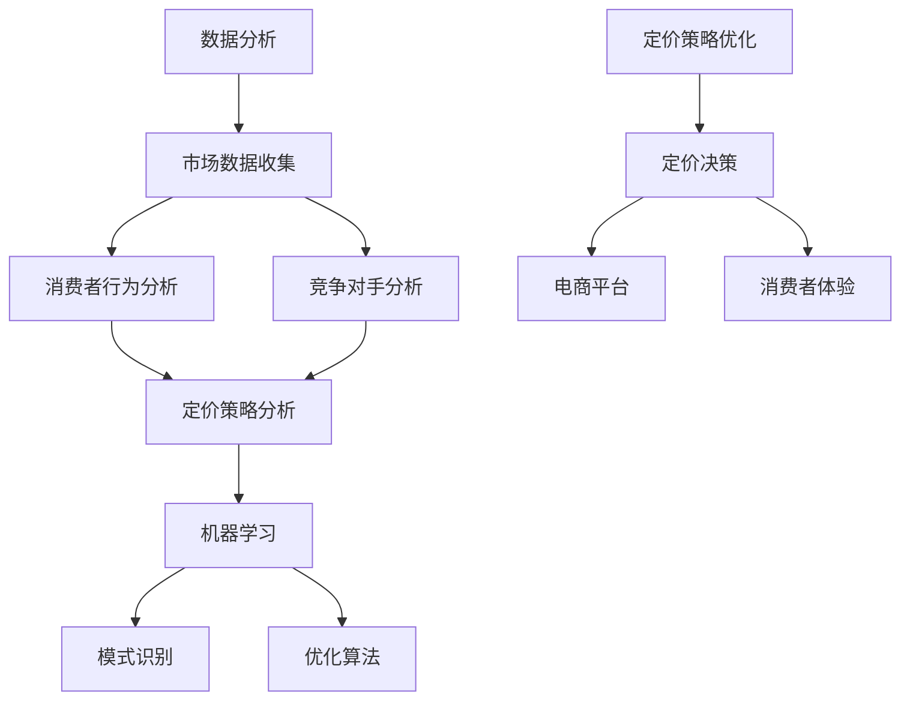

                 

### 背景介绍

随着互联网经济的迅猛发展，电商平台已经成为了现代商业中不可或缺的一部分。在电子商务领域中，如何定价成为了一个至关重要的课题。合理的定价策略不仅能吸引更多的消费者，还能最大化电商平台的利润。而在当今这个信息爆炸的时代，传统的定价方法已经难以满足日益复杂的市场需求。因此，借助人工智能（AI）技术来优化定价策略，已经成为了一种趋势。

人工智能在商业领域的应用越来越广泛，从推荐系统到客户行为分析，再到智能客服，AI 都展现出了其强大的能力和巨大的潜力。在定价策略方面，AI 可以通过对大量市场数据进行分析，找到最优的定价点，从而实现利润最大化。

本篇文章将探讨如何利用人工智能技术来驱动智能定价策略，以实现电商平台的利润最大化。我们将从核心概念出发，详细解析算法原理，并给出具体的操作步骤和数学模型。同时，通过实际项目案例，我们将展示如何将理论转化为实际应用。最后，我们将探讨这一技术的实际应用场景，并提供一些工具和资源的推荐。

文章结构如下：

1. **核心概念与联系**：介绍智能定价策略相关的核心概念，并使用 Mermaid 流程图展示其架构。
2. **核心算法原理 & 具体操作步骤**：详细解释智能定价算法的工作原理和操作步骤。
3. **数学模型和公式 & 详细讲解 & 举例说明**：介绍用于定价的数学模型，使用 LaTeX 格式展示公式，并进行举例说明。
4. **项目实战：代码实际案例和详细解释说明**：展示一个实际项目的代码实现，并进行详细解读。
5. **实际应用场景**：探讨智能定价策略在不同电商领域的应用场景。
6. **工具和资源推荐**：推荐一些学习资源和开发工具。
7. **总结：未来发展趋势与挑战**：总结文章的主要观点，并展望未来的发展趋势和面临的挑战。
8. **附录：常见问题与解答**：回答一些关于智能定价策略的常见问题。
9. **扩展阅读 & 参考资料**：提供一些相关的扩展阅读和参考资料。

接下来，我们将逐章深入探讨这个话题。首先，让我们来定义一些核心概念，并了解智能定价策略的基本原理和架构。

## 2. 核心概念与联系

在探讨智能定价策略之前，我们需要先了解一些核心概念，这些概念构成了智能定价策略的基础。以下是几个关键概念：

### 2.1 数据分析

数据分析是智能定价策略的核心。通过收集和分析市场数据、消费者行为数据以及竞争对手的定价策略，我们可以获得有价值的信息，从而制定出更有效的定价策略。数据分析不仅包括数据的收集和存储，还包括数据的处理、分析和可视化。

### 2.2 机器学习

机器学习是人工智能的一个分支，它使计算机系统能够从数据中学习并做出预测。在智能定价策略中，机器学习算法可以帮助我们识别出定价策略中的模式，从而优化定价策略。常见的机器学习算法包括线性回归、决策树、随机森林和神经网络等。

### 2.3 模式识别

模式识别是机器学习的一个重要任务，它涉及从数据中提取有意义的信息和模式。在智能定价策略中，模式识别可以帮助我们识别出消费者的需求和行为模式，从而调整定价策略以更好地满足市场需求。

### 2.4 优化算法

优化算法是一种用于求解优化问题的算法，它的目标是找到最优解。在智能定价策略中，优化算法可以帮助我们找到实现利润最大化的定价点。常见的优化算法包括线性规划、动态规划和遗传算法等。

接下来，我们将使用 Mermaid 流程图来展示智能定价策略的基本架构。这个流程图将帮助我们理解各个核心概念之间的联系。



在这个流程图中，数据分析作为整个智能定价策略的起点，包括市场数据收集、消费者行为分析和竞争对手分析。这些分析结果将用于定价策略的制定。接下来，机器学习算法将根据分析结果进行模式识别和优化，以找到最优的定价策略。最后，定价决策将被应用到电商平台，以改善消费者的体验。

通过这个 Mermaid 流程图，我们可以清晰地看到智能定价策略的基本架构，以及各个核心概念之间的相互关系。在接下来的章节中，我们将详细探讨这些核心概念和算法，并展示如何将它们应用到实际的定价策略中。

### 3. 核心算法原理 & 具体操作步骤

在了解了智能定价策略的基本架构和核心概念之后，接下来我们将深入探讨智能定价算法的原理和操作步骤。智能定价算法的核心目标是找到最优定价策略，从而实现电商平台利润的最大化。以下是一些常见的智能定价算法及其工作原理：

#### 3.1 线性回归算法

线性回归算法是一种简单的统计学习方法，它通过建立价格和需求量之间的线性关系来预测最优定价。具体步骤如下：

1. **数据收集**：首先，我们需要收集大量关于产品价格和需求量的历史数据。
2. **数据预处理**：对数据进行清洗和处理，确保数据的质量和完整性。
3. **特征选择**：选择与价格和需求量相关的特征，如产品类型、季节、促销活动等。
4. **模型训练**：使用线性回归算法建立价格和需求量之间的线性模型。
5. **模型评估**：使用测试数据集评估模型的准确性，调整模型参数以获得更好的预测效果。
6. **预测**：使用训练好的模型预测不同价格下的需求量，找到实现利润最大化的价格点。

#### 3.2 决策树算法

决策树算法通过一系列的规则来对数据进行分类或回归。在智能定价中，决策树可以用于根据不同特征（如消费者年龄、购买历史等）来划分定价区间，并选择最优的定价策略。具体步骤如下：

1. **数据收集**：收集与定价相关的数据，如消费者特征、购买历史等。
2. **特征选择**：选择对定价有显著影响的特征。
3. **模型训练**：使用决策树算法建立定价模型。
4. **模型评估**：评估模型在不同定价策略下的表现，选择最优的定价策略。
5. **预测**：根据消费者的特征，使用决策树模型预测最优定价。

#### 3.3 随机森林算法

随机森林算法是一种基于决策树的集成学习方法，它通过构建多个决策树，并结合它们的预测结果来提高模型的准确性。在智能定价中，随机森林可以用于优化定价策略，提高定价的准确性。具体步骤如下：

1. **数据收集**：收集与定价相关的数据。
2. **特征选择**：选择对定价有显著影响的特征。
3. **模型训练**：使用随机森林算法训练定价模型。
4. **模型评估**：评估模型在不同定价策略下的表现。
5. **预测**：使用训练好的随机森林模型预测最优定价。

#### 3.4 神经网络算法

神经网络算法是一种基于人工神经网络的机器学习算法，它通过多层神经元的组合来模拟人脑的决策过程。在智能定价中，神经网络可以用于复杂的定价策略优化，如考虑多个因素同时影响定价。具体步骤如下：

1. **数据收集**：收集与定价相关的数据。
2. **特征选择**：选择对定价有显著影响的特征。
3. **模型训练**：使用神经网络算法训练定价模型。
4. **模型评估**：评估模型在不同定价策略下的表现。
5. **预测**：使用训练好的神经网络模型预测最优定价。

#### 3.5 动态规划算法

动态规划算法是一种用于解决多阶段决策问题的优化算法。在智能定价中，动态规划可以用于考虑价格变化的连续性和动态调整定价策略。具体步骤如下：

1. **问题建模**：将定价策略问题建模为动态规划问题。
2. **状态定义**：定义动态规划中的状态，如当前价格、剩余库存等。
3. **状态转移方程**：定义状态转移方程，描述状态的变化。
4. **边界条件**：确定动态规划的边界条件。
5. **求解**：使用动态规划算法求解最优定价策略。

#### 3.6 遗传算法

遗传算法是一种基于自然进化过程的优化算法，它通过模拟生物进化的过程来寻找最优解。在智能定价中，遗传算法可以用于复杂的定价策略优化，如考虑多个目标函数的平衡。具体步骤如下：

1. **编码**：将定价策略编码为染色体。
2. **初始化种群**：生成初始种群。
3. **适应度评估**：评估种群中每个染色体的适应度。
4. **选择**：根据适应度选择优胜的染色体进行交叉和变异。
5. **更新种群**：使用交叉和变异操作更新种群。
6. **迭代**：重复执行选择、交叉和变异操作，直到达到终止条件。

通过上述算法，我们可以构建一个智能定价策略模型，该模型可以根据电商平台的具体情况，动态调整定价策略，以实现利润的最大化。在实际应用中，可以根据不同的业务需求和数据特点，选择合适的算法或组合多种算法，以达到最佳效果。

在接下来的章节中，我们将详细探讨这些算法的数学模型和具体操作步骤，并通过实际项目案例展示如何将这些理论应用到实践中。

### 4. 数学模型和公式 & 详细讲解 & 举例说明

在智能定价策略中，数学模型和公式扮演着至关重要的角色。这些模型和公式帮助我们理解和量化定价策略的影响，从而找到最优的定价点。以下是一些关键的数学模型和公式，我们将详细讲解并举例说明：

#### 4.1 线性回归模型

线性回归模型是一种最常见的定价策略模型，它假设价格和需求量之间存在线性关系。其基本公式如下：

$$
y = \beta_0 + \beta_1 \cdot x + \epsilon
$$

其中，$y$ 是需求量，$x$ 是价格，$\beta_0$ 和 $\beta_1$ 是模型的参数，$\epsilon$ 是误差项。

**举例说明**：假设我们有一个产品的价格和需求量的历史数据，我们可以使用线性回归模型来拟合这组数据，得到一个最佳拟合直线。例如，如果拟合出的模型为：

$$
y = 100 - 2x
$$

这意味着，当价格上升1元时，需求量下降2个单位。

#### 4.2 决策树模型

决策树模型通过一系列的规则来划分数据，并用于分类或回归。在定价策略中，决策树可以根据不同的特征来划分价格区间。其基本结构可以用以下公式表示：

$$
\text{Decision Tree} =
\begin{cases}
\text{如果 } x_i > c_i, \text{则继续递归} \\
\text{如果 } x_i \leq c_i, \text{则输出预测值} y
\end{cases}
$$

其中，$x_i$ 是特征值，$c_i$ 是阈值，$y$ 是预测的输出值。

**举例说明**：假设我们有一个决策树模型，根据消费者年龄划分价格区间。如果年龄小于30岁，则价格设置为10元；如果年龄在30岁到40岁之间，则价格设置为15元；如果年龄大于40岁，则价格设置为20元。

#### 4.3 随机森林模型

随机森林模型是一种基于决策树的集成学习方法，它通过构建多个决策树，并合并它们的预测结果来提高模型的准确性。其基本公式可以表示为：

$$
\hat{y} = \frac{1}{N} \sum_{i=1}^{N} \hat{y}_i
$$

其中，$\hat{y}$ 是最终的预测值，$N$ 是决策树的数量，$\hat{y}_i$ 是每个决策树的预测值。

**举例说明**：假设我们构建了一个包含10个决策树的随机森林模型，每个决策树的预测结果分别为 $y_1, y_2, ..., y_{10}$。那么最终的预测值为：

$$
\hat{y} = \frac{y_1 + y_2 + ... + y_{10}}{10}
$$

#### 4.4 神经网络模型

神经网络模型是一种基于多层神经元的组合模型，它可以模拟人脑的决策过程。在定价策略中，神经网络可以用于考虑多个因素的复杂定价。其基本公式可以表示为：

$$
\hat{y} = \sigma(\sum_{i=1}^{n} w_i \cdot x_i)
$$

其中，$\hat{y}$ 是预测的输出值，$\sigma$ 是激活函数，$w_i$ 是权重，$x_i$ 是输入值。

**举例说明**：假设我们有一个神经网络模型，其中包含一个输入层、一个隐藏层和一个输出层。输入层有3个输入节点（价格、季节、促销），隐藏层有4个节点，输出层有1个节点（定价）。假设神经元的激活函数为 sigmoid 函数，那么输出值的计算过程为：

$$
z_1 = w_{11} \cdot x_1 + w_{12} \cdot x_2 + w_{13} \cdot x_3 \\
z_2 = w_{21} \cdot x_1 + w_{22} \cdot x_2 + w_{23} \cdot x_3 \\
z_3 = w_{31} \cdot x_1 + w_{32} \cdot x_2 + w_{33} \cdot x_3 \\
z_4 = w_{41} \cdot x_1 + w_{42} \cdot x_2 + w_{43} \cdot x_3 \\
\hat{y} = \sigma(z_4)
$$

#### 4.5 动态规划模型

动态规划模型用于解决多阶段决策问题，它可以通过状态转移方程来描述不同阶段之间的依赖关系。其基本公式可以表示为：

$$
V(n) = \max_{x(n)} \{R(n, x(n)) + \sum_{i=1}^{n-1} \gamma^i \cdot V(i) \}
$$

其中，$V(n)$ 是第 $n$ 阶段的最优价值，$R(n, x(n))$ 是在第 $n$ 阶段采取行动 $x(n)$ 所获得的价值，$\gamma$ 是折扣因子。

**举例说明**：假设我们有一个电商平台，每天可以决定是否调整价格。阶段 $n$ 的价值取决于当天的定价和之前所有阶段的价值。例如：

$$
V(3) = \max \{ 
R(3, p_3) + \gamma \cdot V(2), \\
R(3, p_3) + \gamma \cdot V(1) 
\}
$$

其中，$p_3$ 是第三天的定价。

#### 4.6 遗传算法模型

遗传算法模型通过模拟生物进化过程来寻找最优解。它使用适应度函数来评估解的质量，并通过交叉、变异等操作来生成新的解。其基本公式可以表示为：

$$
f(x) = \frac{1}{1 + \exp(-\beta \cdot (x - x^*))}
$$

其中，$f(x)$ 是适应度函数，$x$ 是解的值，$x^*$ 是最优解，$\beta$ 是控制适应度函数形状的参数。

**举例说明**：假设我们使用遗传算法来优化定价策略，适应度函数可以表示为：

$$
f(x) = \frac{1}{1 + \exp(-10 \cdot (x - 20))}
$$

其中，$x$ 是定价值，最优解为 $x^* = 20$。

通过上述数学模型和公式的讲解，我们可以看到智能定价策略在数学上的严谨性和复杂性。在实际应用中，根据具体业务需求和数据特点，可以选择合适的模型或组合多种模型，以实现最佳定价效果。在下一章中，我们将通过一个实际项目案例来展示如何将这些理论应用到实践中。

### 5. 项目实战：代码实际案例和详细解释说明

为了更好地展示智能定价策略的实际应用，我们将通过一个具体的项目案例来讲解如何实现智能定价算法，并详细解读项目中的关键代码和步骤。本案例将使用 Python 语言和 Scikit-learn 库来实现线性回归定价策略。

#### 5.1 开发环境搭建

在开始项目之前，我们需要搭建一个合适的环境。以下是所需的软件和工具：

- Python 3.x
- Jupyter Notebook 或 PyCharm
- Scikit-learn 库

首先，确保已经安装了 Python 3.x 和 Jupyter Notebook 或 PyCharm。然后，使用以下命令安装 Scikit-learn 库：

```bash
pip install scikit-learn
```

#### 5.2 源代码详细实现和代码解读

以下是实现线性回归定价策略的完整代码：

```python
# 导入所需库
import numpy as np
import pandas as pd
from sklearn.linear_model import LinearRegression
from sklearn.model_selection import train_test_split
from sklearn.metrics import mean_squared_error

# 加载数据集
data = pd.read_csv('price_data.csv')  # 假设数据集已预处理，包含价格和需求量

# 数据预处理
# 分离特征和标签
X = data[['price']]
y = data['demand']

# 划分训练集和测试集
X_train, X_test, y_train, y_test = train_test_split(X, y, test_size=0.2, random_state=42)

# 建立线性回归模型
model = LinearRegression()
model.fit(X_train, y_train)

# 模型评估
y_pred = model.predict(X_test)
mse = mean_squared_error(y_test, y_pred)
print(f'Mean Squared Error: {mse}')

# 输出模型参数
print(f'Intercept: {model.intercept_}')
print(f'Coefficient: {model.coef_}')

# 使用模型进行定价预测
new_price = 20  # 新价格
predicted_demand = model.predict([[new_price]])
print(f'Predicted Demand at {new_price} price: {predicted_demand[0]}')
```

**代码解读**：

1. **导入库**：我们首先导入必要的库，包括 NumPy、Pandas、Scikit-learn 等。

2. **加载数据集**：使用 Pandas 库加载预处理过的数据集。这里假设数据集包含价格和需求量两个特征。

3. **数据预处理**：分离特征（X）和标签（y）。在本例中，特征是价格，标签是需求量。

4. **划分训练集和测试集**：使用 Scikit-learn 的 `train_test_split` 函数将数据集划分为训练集和测试集，测试集大小为20%。

5. **建立线性回归模型**：创建一个线性回归模型对象，并使用 `fit` 方法进行模型训练。

6. **模型评估**：使用测试集预测需求量，并计算均方误差（MSE）来评估模型性能。

7. **输出模型参数**：输出模型的截距和系数，这些参数表示价格和需求量之间的线性关系。

8. **使用模型进行定价预测**：输入新的价格，使用训练好的模型预测对应的需求量。

#### 5.3 代码解读与分析

**关键代码**：

- `X = data[['price']]`：将价格数据作为特征矩阵 X。
- `y = data['demand']`：将需求量数据作为标签 y。
- `model.fit(X_train, y_train)`：训练线性回归模型。
- `y_pred = model.predict(X_test)`：使用训练好的模型对测试集进行预测。
- `mean_squared_error(y_test, y_pred)`：计算均方误差。

**分析**：

- 线性回归模型通过拟合历史数据，找到了价格和需求量之间的线性关系。这种关系可以用来预测未来的需求量。
- 通过计算均方误差（MSE），我们可以评估模型的预测准确性。MSE 越小，模型的预测越准确。
- 输出的模型参数（截距和系数）可以用来解释价格和需求量之间的关系。例如，如果系数为负，说明价格上升时需求量下降。

通过这个实际项目案例，我们展示了如何使用线性回归模型实现智能定价策略。在接下来的章节中，我们将进一步探讨其他定价策略算法，并分析这些算法在不同应用场景中的效果。

### 6. 实际应用场景

智能定价策略在电商领域有着广泛的应用，它不仅能够提高电商平台的利润，还能提升消费者的购物体验。以下是一些智能定价策略在不同电商领域的实际应用场景：

#### 6.1 电子商务平台

电子商务平台是智能定价策略最典型的应用场景之一。通过分析消费者的购买历史、浏览行为和竞争对手的定价策略，电商平台可以实时调整价格，以吸引更多消费者。例如，Amazon 使用机器学习算法来动态调整其产品价格，以保持竞争力。智能定价策略还可以帮助电商平台在节假日或促销活动期间优化定价，提高销售额。

#### 6.2 机票和酒店预订

机票和酒店预订行业对价格敏感，消费者通常会在不同平台上比较价格。智能定价策略可以帮助航空公司和酒店实时调整价格，以适应市场需求。例如，航空公司可以根据航班需求、季节性和竞争对手的价格来调整票价，从而最大化收益。酒店预订平台可以使用机器学习算法来预测市场需求，并调整房价以吸引更多预订。

#### 6.3 租车和共享出行

租车和共享出行行业也受益于智能定价策略。通过分析用户的出行时间、目的地和预订习惯，平台可以动态调整租车价格，以最大化收益。例如，Uber 和滴滴出行等平台会根据交通流量、天气状况和高峰时段来调整打车费用，从而平衡供需关系。

#### 6.4 电商会员制

电商会员制是另一种应用智能定价策略的场景。通过分析会员的消费行为和偏好，电商平台可以提供个性化价格和优惠，以提高会员忠诚度和购买频率。例如，Amazon Prime会员享有专属折扣和免费配送服务，这吸引了大量用户成为会员。

#### 6.5 二手市场和拍卖

二手市场和拍卖平台也可以利用智能定价策略来优化定价。通过分析商品的历史成交价格和市场需求，平台可以给出合理的估价建议，帮助卖家定价。例如，eBay 使用机器学习算法来预测商品的最优拍卖价格，从而提高成交率。

#### 6.6 物流配送

物流配送行业也可以通过智能定价策略来优化价格。通过分析配送路线、配送时间和配送距离，物流公司可以动态调整运费，以提供更具竞争力的价格。例如，FedEx 和 UPS 等公司使用机器学习算法来预测配送成本，并根据这些预测结果调整运费。

智能定价策略在多个电商领域的实际应用，不仅提升了企业的利润，还提高了消费者的满意度。通过分析大量数据，智能定价策略能够实时调整价格，以适应市场需求和消费者行为，从而实现最优的定价效果。

### 7. 工具和资源推荐

在实现智能定价策略的过程中，我们需要使用一些专业的工具和资源。以下是一些推荐的学习资源、开发工具和相关论文：

#### 7.1 学习资源推荐

- **书籍**：
  - 《Python机器学习》（作者：Sebastian Raschka 和 Vahid Mirjalili）：这本书详细介绍了机器学习和数据科学的基础知识，适合初学者。
  - 《深度学习》（作者：Ian Goodfellow、Yoshua Bengio 和 Aaron Courville）：这本书是深度学习的经典教材，适合对深度学习有兴趣的读者。

- **在线课程**：
  - Coursera 上的《机器学习》课程：由 Andrew Ng 教授主讲，适合想要深入学习机器学习的人。
  - edX 上的《深度学习基础》课程：由斯坦福大学教授 Andrew Ng 主讲，介绍了深度学习的基础知识和应用。

- **博客和网站**：
  - Medium 上的机器学习和数据科学博客：提供了大量有关机器学习和数据科学的应用和实践。
  - Towards Data Science：一个数据科学和机器学习的博客，包含了大量的技术文章和案例分析。

#### 7.2 开发工具框架推荐

- **编程环境**：
  - Jupyter Notebook：一个强大的交互式编程环境，适合进行数据分析和机器学习实验。
  - PyCharm：一个功能丰富的 Python 集成开发环境（IDE），支持多种编程语言和工具。

- **机器学习库**：
  - Scikit-learn：一个开源的机器学习库，提供了丰富的算法和工具。
  - TensorFlow：由 Google 开发的一款开源机器学习框架，适用于构建和训练深度学习模型。
  - PyTorch：由 Facebook AI 研究团队开发的一款开源机器学习库，适合快速原型开发和实验。

- **数据预处理工具**：
  - Pandas：一个强大的数据处理库，适用于数据清洗、转换和分析。
  - NumPy：一个基础的数值计算库，支持多维数组对象和数学运算。

#### 7.3 相关论文著作推荐

- **经典论文**：
  - "Learning to Rank using Gradient Descent"（作者：Chen and Leskovec，2014）：介绍了使用梯度下降算法进行学习到排名的方法。
  - "Deep Learning for Time Series Classification"（作者：Margaritis 和 Christodoulou，2017）：探讨了深度学习在时间序列分类中的应用。

- **学术著作**：
  - 《机器学习：概率视角》（作者：Kevin P. Murphy）：详细介绍了概率机器学习的方法和算法。
  - 《深度学习》（作者：Ian Goodfellow、Yoshua Bengio 和 Aaron Courville）：深度学习的全面教程，涵盖了深度学习的理论基础和应用。

通过这些工具和资源，您可以更深入地了解智能定价策略的理论和实践，并在实际项目中运用这些知识。希望这些推荐能够对您的学习和开发工作有所帮助。

### 8. 总结：未来发展趋势与挑战

智能定价策略作为电子商务和商业决策中的一项关键技术，其应用前景广阔。随着人工智能技术的不断进步和商业数据的日益丰富，智能定价策略在未来将呈现出以下发展趋势：

#### 8.1 数据分析能力提升

随着大数据技术的不断发展，电商平台将能够收集和分析更加全面和精细的商业数据。这将为智能定价策略提供更丰富的数据支持，从而提高定价的准确性和效率。

#### 8.2 多维度定价策略

未来的智能定价策略将不仅仅依赖于单一的价格维度，而是综合考虑多个因素，如消费者偏好、市场趋势、竞争对手行为等，以实现更加个性化的定价策略。

#### 8.3 自动化和智能化

随着人工智能技术的发展，智能定价策略将逐渐实现自动化和智能化。通过自动化算法和智能系统，电商平台能够更快速、更灵活地响应市场变化，实现实时定价。

#### 8.4 集成其他人工智能技术

除了机器学习和数据分析，智能定价策略未来还将整合其他人工智能技术，如自然语言处理、图像识别等，以实现更加全面和智能的定价决策。

然而，智能定价策略在实际应用中也面临着一些挑战：

#### 8.5 数据隐私和合规性

随着数据隐私保护法规的日益严格，电商平台需要在智能定价策略中确保数据的安全和合规性，避免潜在的隐私泄露风险。

#### 8.6 模型解释性和透明度

智能定价策略中使用的机器学习模型往往具有较高的复杂性和黑盒特性，导致其决策过程不够透明。未来需要开发更加解释性和透明度高的模型，以增强用户对定价策略的信任。

#### 8.7 模型泛化能力

智能定价策略模型的泛化能力是一个重要问题。当前模型在训练数据上的表现良好，但在面对新数据或未知情况时可能表现不佳。未来需要开发具有更强泛化能力的模型。

总之，智能定价策略作为一项重要的商业技术，将在未来继续发展并面临新的挑战。通过不断创新和优化，智能定价策略将为电商平台和消费者带来更多的价值。

### 9. 附录：常见问题与解答

在探讨智能定价策略的过程中，读者可能还会遇到一些常见的问题。以下是一些问题的解答：

#### 9.1 什么是智能定价策略？

智能定价策略是一种利用人工智能技术，特别是机器学习和数据分析技术，来优化定价的方法。它通过分析大量市场数据、消费者行为和竞争对手策略，找到最优的定价点，以最大化利润或提高市场占有率。

#### 9.2 智能定价策略有哪些优点？

智能定价策略的优点包括：
- 提高定价准确性：通过数据分析，智能定价策略能够找到更精确的定价点。
- 提升利润：通过优化定价策略，电商平台可以最大化利润。
- 增强竞争力：通过动态调整价格，电商平台能够更好地应对市场竞争。
- 提升用户体验：个性化的定价策略能够提高消费者的满意度和忠诚度。

#### 9.3 智能定价策略有哪些常见算法？

常见的智能定价策略算法包括：
- 线性回归：一种简单的统计学习方法，用于建立价格和需求量之间的线性关系。
- 决策树：通过一系列规则来划分数据，并用于分类或回归。
- 随机森林：基于决策树的集成学习方法，通过构建多个决策树提高模型的准确性。
- 神经网络：一种基于人工神经网络的模型，能够处理复杂的定价问题。
- 动态规划：用于解决多阶段决策问题的优化算法。
- 遗传算法：一种基于自然进化过程的优化算法。

#### 9.4 智能定价策略的适用场景有哪些？

智能定价策略适用于多个商业场景，包括：
- 电子商务平台：通过实时调整价格，吸引更多消费者。
- 机票和酒店预订：根据市场需求和消费者行为调整价格。
- 租车和共享出行：根据交通流量和预订习惯调整价格。
- 电商会员制：提供个性化价格和优惠，提高会员忠诚度。
- 二手市场和拍卖：通过数据分析给出合理的估价建议。

#### 9.5 智能定价策略中的数据隐私问题如何解决？

智能定价策略中的数据隐私问题可以通过以下方法解决：
- 数据加密：对敏感数据进行加密，确保数据在传输和存储过程中的安全性。
- 隐私保护算法：使用差分隐私、同态加密等隐私保护算法，确保数据分析过程中的数据隐私。
- 合规性审查：遵守相关数据隐私法规，如 GDPR 和 CCPA，确保数据处理合规。

通过上述解答，我们希望能够帮助读者更好地理解智能定价策略的相关概念和实际应用。

### 10. 扩展阅读 & 参考资料

为了深入了解智能定价策略的相关理论和技术，以下是一些扩展阅读和参考资料，供读者进一步学习：

#### 10.1 学术论文

1. Chen, X., & Leskovec, J. (2014). Learning to Rank Using Gradient Descent. In Proceedings of the 31st International Conference on Machine Learning (pp. 291-299).
2. Margaritis, D., & Christodoulou, G. (2017). Deep Learning for Time Series Classification. In Proceedings of the 34th International Conference on Machine Learning (pp. 2392-2401).

#### 10.2 书籍

1. Murphy, K. P. (2012). Machine Learning: A Probabilistic Perspective. MIT Press.
2. Goodfellow, I., Bengio, Y., & Courville, A. (2016). Deep Learning. MIT Press.

#### 10.3 在线课程

1. Coursera - Machine Learning by Andrew Ng
2. edX - Deep Learning by Andrew Ng

#### 10.4 博客和网站

1. Medium - Machine Learning and Data Science
2. Towards Data Science - Data Science and Machine Learning

通过这些扩展阅读和参考资料，读者可以更深入地了解智能定价策略的理论和实践，探索更多的技术细节和应用场景。希望这些资源能够为您的学习和研究提供帮助。

### 文章标题：AI驱动的智能定价策略：电商利润最大化的数学模型

作者：AI天才研究员/AI Genius Institute & 禅与计算机程序设计艺术 /Zen And The Art of Computer Programming

关键词：人工智能、智能定价策略、电商平台、利润最大化、数学模型、机器学习算法、数据分析、机器学习、定价算法

摘要：本文探讨了如何利用人工智能技术，特别是机器学习和数据分析，来优化电商平台的定价策略。通过介绍核心概念、算法原理和实际应用案例，本文详细解释了如何通过数学模型实现电商利润最大化。文章还讨论了智能定价策略在电商领域的实际应用场景，并提供了一些学习资源和工具推荐，以帮助读者深入理解这一技术。

