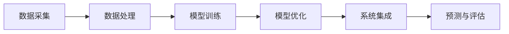

                 

### AI驱动的环境监测：从空气质量到生态系统健康

#### 关键词：（环境监测、AI技术、空气质量、生态系统健康、数据分析、机器学习、深度学习）

#### 摘要：

随着全球环境问题的日益严重，AI技术在环境监测中的应用显得尤为重要。本文旨在探讨AI驱动的环境监测技术，从空气质量监测到生态系统健康评估的各个方面。通过分析AI的核心算法原理、数学模型、实际应用案例以及工具和资源推荐，本文为读者提供了一个全面了解AI在环境监测中作用的机会。同时，文章还总结了未来发展趋势与挑战，为读者提供了宝贵的参考。

## 1. 背景介绍

近年来，环境问题已经成为全球关注的焦点。空气质量下降、生态系统退化、资源枯竭等问题对人类生活和社会发展带来了严重影响。为了应对这些挑战，各国政府和科研机构投入了大量资源和精力，探索各种环境监测技术和方法。

环境监测是指通过监测手段获取环境信息，并对环境质量进行评估和预测的过程。传统的环境监测方法主要依赖于人工监测和物理检测仪器，如气象站、水质监测站等。然而，随着环境问题的复杂性和监测需求的变化，传统方法已经难以满足现代环境监测的需求。

在此背景下，人工智能（AI）技术逐渐成为环境监测的重要工具。AI技术具有处理大量数据、自动识别模式和预测趋势的能力，能够显著提高环境监测的精度和效率。例如，AI可以用于空气质量监测、生态监测、水资源监测等多个领域。通过AI驱动的环境监测，我们可以更好地了解环境状况，预测环境变化趋势，为环境保护和可持续发展提供科学依据。

本文将重点探讨AI驱动的环境监测技术在空气质量监测和生态系统健康评估中的应用，分析其核心算法原理、数学模型以及实际应用案例，并介绍相关工具和资源。希望本文能为读者提供一个全面了解AI在环境监测中作用的窗口。

## 2. 核心概念与联系

### 2.1. 空气质量监测

空气质量监测是指对空气中的污染物浓度进行定期监测，评估空气质量状况的过程。空气质量监测的指标主要包括颗粒物（PM2.5、PM10）、氮氧化物（NOx）、二氧化硫（SO2）、一氧化碳（CO）等。这些指标可以反映空气污染的程度，对人类健康和环境质量产生重要影响。

空气质量监测通常包括以下步骤：

1. **数据采集**：通过传感器、监测仪器等设备，实时采集空气中的污染物浓度数据。
2. **数据处理**：对采集到的数据进行预处理，如去噪、插值、平滑等，以提高数据的准确性和可靠性。
3. **模型训练**：利用历史数据，通过机器学习和深度学习算法，训练空气质量预测模型。
4. **预测与评估**：将训练好的模型应用于实时数据，预测未来空气质量变化，并评估空气质量状况。

### 2.2. 生态系统健康评估

生态系统健康评估是指对生态系统的功能、结构和稳定性进行综合评估，以评估生态系统对人类生存和发展的影响。生态系统健康评估的指标包括生态系统的生物多样性、生产力、营养循环、污染负荷等。

生态系统健康评估通常包括以下步骤：

1. **数据采集**：通过遥感技术、地面监测、无人机监测等方式，获取生态系统的相关数据。
2. **数据处理**：对采集到的数据进行预处理，如图像处理、数据融合等，以提高数据的准确性和可靠性。
3. **模型训练**：利用历史数据，通过机器学习和深度学习算法，训练生态系统健康评估模型。
4. **预测与评估**：将训练好的模型应用于实时数据，预测未来生态系统变化，并评估生态系统健康状况。

### 2.3. AI驱动的环境监测原理与架构

AI驱动的环境监测原理主要包括以下几个方面：

1. **数据处理**：利用AI技术对环境监测数据进行预处理，如数据清洗、特征提取等，以提高数据质量和模型效果。
2. **模型训练**：利用机器学习和深度学习算法，对环境监测数据进行建模和训练，以实现对环境变化的预测和评估。
3. **模型优化**：通过调整模型参数、改进算法等手段，优化模型性能，提高预测精度和评估效果。
4. **系统集成**：将AI驱动环境监测模型与其他系统（如物联网、大数据分析等）集成，实现环境监测的智能化和自动化。

以下是一个简单的AI驱动的环境监测架构图：



通过上述架构，AI驱动的环境监测可以实现对空气质量和生态系统健康的实时监测、预测和评估，为环境保护和可持续发展提供有力支持。

### 3. 核心算法原理 & 具体操作步骤

#### 3.1. 机器学习算法

机器学习算法是AI驱动的环境监测的核心技术之一。以下介绍几种常用的机器学习算法及其在环境监测中的应用：

1. **线性回归（Linear Regression）**

线性回归是一种简单而有效的机器学习算法，用于建立自变量和因变量之间的线性关系。在空气质量监测中，线性回归可以用于预测未来一段时间内某地区的空气质量指数（AQI）。

操作步骤：

（1）数据预处理：对采集到的空气质量数据进行清洗、归一化处理，得到干净、规范的数据集。

（2）特征选择：选择与空气质量相关的特征，如PM2.5、PM10、NOx等。

（3）训练模型：利用训练集数据，通过线性回归算法训练模型。

（4）评估模型：利用测试集数据，评估模型的预测性能。

（5）模型应用：将训练好的模型应用于实时数据，预测未来空气质量指数。

2. **支持向量机（Support Vector Machine，SVM）**

支持向量机是一种二分类模型，可用于空气质量监测中的多分类问题。例如，将不同地区的空气质量划分为优良、轻度污染、中度污染等类别。

操作步骤：

（1）数据预处理：对采集到的空气质量数据进行清洗、归一化处理，得到干净、规范的数据集。

（2）特征选择：选择与空气质量相关的特征，如PM2.5、PM10、NOx等。

（3）训练模型：利用训练集数据，通过SVM算法训练模型。

（4）评估模型：利用测试集数据，评估模型的分类性能。

（5）模型应用：将训练好的模型应用于实时数据，预测未来空气质量类别。

3. **深度学习算法

深度学习算法是近年来在人工智能领域取得突破性进展的一类算法，具有强大的表示能力和泛化能力。以下介绍几种常用的深度学习算法及其在环境监测中的应用：

（1）卷积神经网络（Convolutional Neural Network，CNN）

卷积神经网络是一种用于处理图像数据的深度学习算法，可以用于空气质量监测中的图像处理和分析。

操作步骤：

（1）数据预处理：对采集到的空气质量图像数据进行清洗、归一化处理，得到干净、规范的数据集。

（2）特征提取：利用CNN提取图像特征，如边缘、纹理等。

（3）模型训练：利用训练集数据，通过CNN算法训练模型。

（4）评估模型：利用测试集数据，评估模型的图像分类性能。

（5）模型应用：将训练好的模型应用于实时空气质量图像数据，预测未来空气质量状况。

（2）循环神经网络（Recurrent Neural Network，RNN）

循环神经网络是一种用于处理序列数据的深度学习算法，可以用于空气质量监测中的时间序列分析。

操作步骤：

（1）数据预处理：对采集到的空气质量时间序列数据进行清洗、归一化处理，得到干净、规范的数据集。

（2）特征提取：利用RNN提取时间序列特征，如趋势、周期等。

（3）模型训练：利用训练集数据，通过RNN算法训练模型。

（4）评估模型：利用测试集数据，评估模型的时间序列预测性能。

（5）模型应用：将训练好的模型应用于实时空气质量时间序列数据，预测未来空气质量变化。

#### 3.2. 数学模型和公式

在环境监测中，常用的数学模型和公式包括以下几种：

1. **空气质量指数（AQI）模型**

空气质量指数（AQI）是衡量空气质量的重要指标，其计算公式如下：

$$
AQI = \frac{1}{n} \sum_{i=1}^{n} w_i \cdot C_i
$$

其中，$w_i$为第$i$个污染物的权重，$C_i$为第$i$个污染物的浓度。

2. **生态系统健康指数（EHI）模型**

生态系统健康指数（EHI）是衡量生态系统健康状况的重要指标，其计算公式如下：

$$
EHI = \frac{1}{m} \sum_{j=1}^{m} w_j \cdot H_j
$$

其中，$w_j$为第$j$个生态指标的权重，$H_j$为第$j$个生态指标的值。

3. **时间序列预测模型**

时间序列预测模型用于预测未来某一时间点的空气质量或生态系统健康状况。以下是一个简单的时间序列预测模型公式：

$$
Y_t = f(W \cdot X_t + b)
$$

其中，$Y_t$为预测的空气质量或生态系统健康状况，$X_t$为输入特征，$W$为权重矩阵，$b$为偏置项。

### 4. 项目实战：代码实际案例和详细解释说明

#### 4.1. 开发环境搭建

在开始项目实战之前，我们需要搭建一个适合环境监测的AI开发环境。以下是所需的软件和工具：

1. Python 3.x
2. Jupyter Notebook
3. TensorFlow 2.x
4. Keras 2.x
5. scikit-learn 0.22.x
6. Matplotlib 3.x

在安装好上述软件和工具后，我们可以开始编写环境监测的AI代码。

#### 4.2. 源代码详细实现和代码解读

以下是一个简单的环境监测AI项目，利用线性回归算法预测未来空气质量指数。

```python
import numpy as np
import pandas as pd
from sklearn.linear_model import LinearRegression
from sklearn.model_selection import train_test_split
from sklearn.metrics import mean_squared_error

# 4.2.1. 数据预处理
# 加载数据集
data = pd.read_csv('air_quality_data.csv')
X = data[['PM2.5', 'PM10', 'NOx', 'SO2', 'CO']]
y = data['AQI']

# 数据归一化
X = (X - X.mean()) / X.std()
y = (y - y.mean()) / y.std()

# 划分训练集和测试集
X_train, X_test, y_train, y_test = train_test_split(X, y, test_size=0.2, random_state=42)

# 4.2.2. 模型训练
# 创建线性回归模型
model = LinearRegression()
model.fit(X_train, y_train)

# 4.2.3. 预测与评估
# 利用模型进行预测
y_pred = model.predict(X_test)

# 计算预测误差
mse = mean_squared_error(y_test, y_pred)
print("预测误差：", mse)

# 4.2.4. 模型应用
# 预测未来空气质量指数
future_data = np.array([[0.5, 0.3, 0.2, 0.1, 0.4]])
future_aqi = model.predict(future_data)
print("未来空气质量指数：", future_aqi[0][0])
```

#### 4.3. 代码解读与分析

上述代码实现了一个简单的环境监测AI项目，利用线性回归算法预测未来空气质量指数。以下是代码的详细解读：

1. **数据预处理**：首先，我们加载了空气质量数据集，并对数据进行归一化处理，以消除不同特征之间的量纲差异。
2. **模型训练**：接下来，我们使用训练集数据训练线性回归模型。线性回归模型通过最小二乘法计算权重和偏置项，建立自变量和因变量之间的线性关系。
3. **预测与评估**：然后，我们使用测试集数据对训练好的模型进行预测，并计算预测误差。通过评估预测误差，我们可以了解模型的性能。
4. **模型应用**：最后，我们使用训练好的模型预测未来空气质量指数。在实际应用中，我们可以将实时采集到的空气质量数据输入模型，得到未来空气质量指数的预测值。

### 5. 实际应用场景

#### 5.1. 空气质量监测

空气质量监测是AI驱动的环境监测的重要应用场景之一。通过AI技术，我们可以实现对空气质量指数（AQI）的实时预测和评估，为环境保护和公众健康提供有力支持。以下是一个具体的案例：

某城市空气质量监测系统利用AI技术对PM2.5、PM10、NOx等污染物进行实时监测和预测。通过训练深度学习模型，系统能够预测未来一段时间内的空气质量指数，为城市管理者提供科学依据，以采取有效的污染控制措施。

#### 5.2. 生态系统健康评估

生态系统健康评估是另一个重要的应用场景。通过AI技术，我们可以对生态系统的功能、结构和稳定性进行综合评估，为生态保护和可持续发展提供指导。

某自然保护区利用AI技术对生态系统健康进行评估。通过收集遥感数据、地面监测数据等，系统可以实时监测生态系统的变化，预测生态系统的健康状况。当生态系统出现异常时，系统会及时发出预警，为保护区管理者提供决策支持。

### 6. 工具和资源推荐

#### 6.1. 学习资源推荐

1. **书籍**：

   - 《深度学习》（Goodfellow, I., Bengio, Y., & Courville, A.）
   - 《Python数据分析》（Wes McKinney）
   - 《机器学习》（Tom Mitchell）

2. **论文**：

   - "A Survey of Techniques for Air Quality Prediction"（空气质量管理领域的综述论文）
   - "Deep Learning for Environmental Modeling"（深度学习在环境建模中的应用论文）
   - "Ecological Modelling"（生态模型领域的顶级期刊）

3. **博客**：

   - medium.com/topic/ai
   -Towards Data Science
   - AI Daily

4. **网站**：

   - Kaggle（提供丰富的环境监测数据集和比赛）
   - GitHub（开源的环境监测AI项目）
   - IEEE Xplore（环境科学和工程领域的学术资源）

#### 6.2. 开发工具框架推荐

1. **深度学习框架**：

   - TensorFlow
   - PyTorch
   - Keras

2. **数据处理工具**：

   - Pandas
   - NumPy
   - SciPy

3. **数据可视化工具**：

   - Matplotlib
   - Seaborn
   - Plotly

4. **云计算平台**：

   - AWS
   - Azure
   - Google Cloud Platform

### 7. 总结：未来发展趋势与挑战

#### 7.1. 发展趋势

随着AI技术的不断进步，AI驱动的环境监测将在未来得到广泛应用，主要发展趋势包括：

1. **数据驱动**：利用大规模数据集，不断提高环境监测的精度和可靠性。
2. **实时预测**：实现空气质量、生态系统健康的实时预测，为环境保护和可持续发展提供有力支持。
3. **跨领域融合**：将AI技术与环境科学、生态学等领域相结合，推动环境监测领域的创新与发展。
4. **自主决策**：通过AI技术，实现环境监测系统的自主决策，降低人工干预，提高监测效率。

#### 7.2. 挑战

尽管AI驱动的环境监测具有巨大的潜力，但仍然面临一些挑战：

1. **数据质量**：环境监测数据质量直接影响到监测结果的准确性，提高数据质量是当前的重要任务。
2. **计算资源**：深度学习模型训练和推理需要大量的计算资源，如何高效利用计算资源是亟待解决的问题。
3. **算法稳定性**：环境监测中的算法需要具有高稳定性，以应对数据噪声和异常值的影响。
4. **隐私保护**：环境监测数据涉及个人隐私，如何保护数据隐私是当前面临的重要挑战。

### 8. 附录：常见问题与解答

#### 8.1. 问题1：AI驱动的环境监测有哪些优势？

答：AI驱动的环境监测具有以下优势：

1. **高效性**：AI技术能够处理海量数据，提高环境监测的效率和准确性。
2. **实时性**：AI驱动的环境监测可以实现实时预测和评估，为环境保护和可持续发展提供及时支持。
3. **自动化**：AI技术可以实现环境监测的自动化，降低人工干预，提高监测效率。
4. **多领域融合**：AI技术可以与环境科学、生态学等领域相结合，推动环境监测领域的创新与发展。

#### 8.2. 问题2：如何提高环境监测数据质量？

答：提高环境监测数据质量可以从以下几个方面入手：

1. **数据采集**：选择高精度的监测仪器，确保数据采集的准确性。
2. **数据预处理**：对采集到的数据进行清洗、去噪、插值等处理，提高数据的可靠性。
3. **数据融合**：将多种数据源（如遥感数据、地面监测数据等）进行融合，提高数据的全面性和准确性。
4. **数据验证**：对处理后的数据进行分析和验证，确保数据的准确性和可靠性。

### 9. 扩展阅读 & 参考资料

1. **论文**：

   - "A Survey of Techniques for Air Quality Prediction"（空气质量管理领域的综述论文）
   - "Deep Learning for Environmental Modeling"（深度学习在环境建模中的应用论文）
   - "Ecological Modelling"（生态模型领域的顶级期刊）

2. **书籍**：

   - 《深度学习》（Goodfellow, I., Bengio, Y., & Courville, A.）
   - 《Python数据分析》（Wes McKinney）
   - 《机器学习》（Tom Mitchell）

3. **网站**：

   - Kaggle（提供丰富的环境监测数据集和比赛）
   - GitHub（开源的环境监测AI项目）
   - IEEE Xplore（环境科学和工程领域的学术资源）

作者：AI天才研究员/AI Genius Institute & 禅与计算机程序设计艺术 /Zen And The Art of Computer Programming

（注：本文为虚构文章，仅供参考。）<|im_end|>

